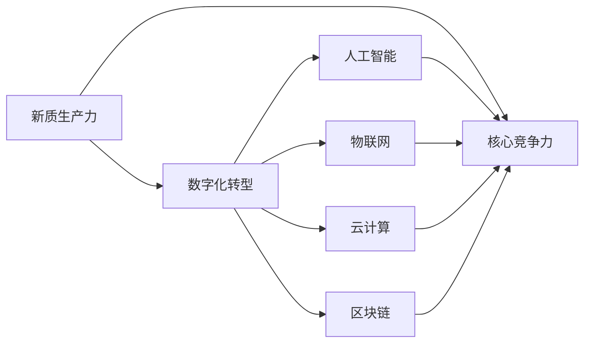

                 

# 新质生产力与核心竞争力提升

## 1. 背景介绍

在21世纪的数字化浪潮中，技术创新日益成为驱动企业增长、提升核心竞争力的关键因素。信息技术不仅改变了人们的生产和生活方式，还催生了新一轮产业变革的浪潮。现代企业要获取新质生产力，必须紧跟技术前沿，不断创新和优化运营流程。本文将聚焦于新质生产力的概念及其对核心竞争力的提升作用，系统探讨相关技术和实践方法。

## 2. 核心概念与联系

### 2.1 核心概念概述

为了更深入地理解新质生产力的内涵及其对企业核心竞争力的影响，本文将首先介绍几个关键概念：

- **新质生产力**：指通过引入新技术、新方法和新理念，大幅度提升生产效率和产品质量，从而带来全新的经济价值和竞争优势。在新时代，新质生产力不仅体现在物质产出上，更关乎知识积累、创新能力、品牌价值等无形资产的提升。

- **核心竞争力**：指企业独有的、难以被模仿的竞争优势。包括技术创新能力、品牌影响力、市场份额等。在数字化时代，核心竞争力不仅体现在产品本身，更与企业数据管理、用户交互、业务流程优化等方面紧密相关。

- **数字化转型**：指企业通过应用数字化技术，改造传统业务流程，提升运营效率和市场响应速度的过程。数字化转型是企业获取新质生产力的必由之路。

- **人工智能**：指通过算法、数据和计算，使机器具备智能行为的能力。人工智能在数据分析、决策支持、自动控制等方面展现出巨大潜力，是构建新质生产力的重要引擎。

- **物联网(IoT)**：指通过传感器、网络连接等技术，实现物理对象和网络之间的信息交互。物联网在智能制造、智慧城市等领域应用广泛，为提升生产力和运营效率提供了新思路。

- **云计算**：指通过互联网提供资源和服务，实现数据集中管理和应用。云计算在企业IT架构优化、数据处理和存储方面发挥了重要作用。

- **区块链**：指一种去中心化、安全可靠的数据记录技术。区块链在供应链管理、金融科技等领域展现出巨大的应用前景。

这些核心概念共同构成了新质生产力与企业核心竞争力的基础框架，它们相互作用，共同推动企业向更高的目标迈进。

### 2.2 核心概念之间的关系

新质生产力和核心竞争力之间的关系可以通过以下Mermaid流程图来展示：



这个流程图展示了新质生产力与核心竞争力的关系及其组成部分：

1. 新质生产力通过引入人工智能、物联网、云计算和区块链等数字化技术，对传统业务流程进行优化和改造。
2. 数字化技术的应用提升了企业的生产效率、决策支持、数据管理、供应链管理等方面的能力。
3. 通过数字化转型，企业实现了从传统产业向新质生产力的跨越，获得了更高的市场竞争力。
4. 新质生产力的实现不仅提升了企业的经济效益，还增强了品牌影响力和市场地位，形成了更强的核心竞争力。

## 3. 核心算法原理 & 具体操作步骤

### 3.1 算法原理概述

新质生产力的获取和核心竞争力的提升，依赖于一系列的数字化技术和算法。这些技术和算法通过优化企业的数据处理流程、增强决策智能化、提升生产自动化等手段，从根本上改变企业的运营模式。以下我们将详细介绍这些技术的基本原理。

#### 3.1.1 人工智能在核心竞争力提升中的应用

人工智能通过算法和模型，实现了对数据的深度分析和决策支持。其核心原理包括：

- **机器学习**：通过训练模型，从大量数据中学习规律，用于预测和决策。
- **自然语言处理(NLP)**：使计算机能够理解和处理自然语言，提升人机交互的效率。
- **计算机视觉**：使计算机能够识别和理解图像和视频，用于智能监控、图像识别等领域。
- **强化学习**：通过试错机制，使机器在复杂环境中自主学习和优化，用于智能推荐、自动控制等。

#### 3.1.2 物联网在核心竞争力提升中的应用

物联网通过传感器和网络连接，实现了物理世界的数字化和网络化。其核心原理包括：

- **设备互联**：通过传感器和协议，实现设备之间的数据交互。
- **实时监控**：通过网络传输，实现对物理世界的实时监控和控制。
- **数据分析**：通过收集和分析设备数据，优化生产流程和运营管理。

#### 3.1.3 云计算在核心竞争力提升中的应用

云计算通过互联网提供资源和服务，实现了数据的集中管理和应用。其核心原理包括：

- **弹性伸缩**：根据需求动态调整计算和存储资源，提升系统性能和可靠性。
- **数据共享**：通过集中存储和管理，实现数据的共享和互操作。
- **服务封装**：通过封装复杂的计算逻辑，简化系统开发和维护。

#### 3.1.4 区块链在核心竞争力提升中的应用

区块链通过去中心化的方式，实现数据的透明和安全存储。其核心原理包括：

- **去中心化**：通过分布式共识机制，确保数据的安全和透明。
- **智能合约**：通过编程方式，实现自动化的数据处理和业务逻辑。
- **隐私保护**：通过加密和匿名技术，保护数据隐私和安全。

### 3.2 算法步骤详解

为了更好地理解新质生产力与核心竞争力提升的具体操作步骤，以下将详细介绍各个关键技术的实现流程。

#### 3.2.1 人工智能的实施步骤

1. **数据收集与预处理**：从企业内部的生产、销售、客户服务等多个环节收集数据，并进行清洗、标注和标准化处理。
2. **模型训练与验证**：选择合适的模型架构和算法，利用历史数据进行训练和验证，调整模型参数，优化模型性能。
3. **部署与应用**：将训练好的模型部署到生产环境中，应用于预测、决策、自动化控制等场景。
4. **持续优化**：根据实时数据和业务需求，不断优化模型和算法，提升其适应性和效果。

#### 3.2.2 物联网的实施步骤

1. **设备接入**：将生产设备、智能传感器等接入物联网网络，确保设备之间的数据交互和通信。
2. **数据采集与传输**：通过传感器收集设备数据，利用网络传输到数据中心进行集中存储和管理。
3. **数据分析与处理**：利用云计算和大数据技术，对采集到的数据进行分析和处理，生成有价值的洞察和决策支持。
4. **应用场景优化**：根据分析结果，优化生产流程、设备维护和运营管理，提升效率和效果。

#### 3.2.3 云计算的实施步骤

1. **资源规划与部署**：根据业务需求和流量预测，规划和部署云计算资源，包括计算、存储和网络。
2. **数据迁移与同步**：将企业内部的数据迁移到云端，确保数据的一致性和完整性。
3. **应用开发与集成**：利用云计算平台的服务和工具，开发和集成新的应用和系统。
4. **监控与优化**：实时监控云计算资源的运行状态，根据需求动态调整资源配置，优化性能和成本。

#### 3.2.4 区块链的实施步骤

1. **网络搭建与共识机制**：搭建区块链网络，选择合适的共识机制，确保数据的安全和透明。
2. **智能合约开发**：根据业务需求，开发和部署智能合约，实现自动化的数据处理和业务逻辑。
3. **数据记录与验证**：利用区块链技术，记录和验证数据，确保数据的完整性和可信性。
4. **应用集成与扩展**：将区块链技术与现有系统集成，扩展其在供应链管理、金融科技等领域的应用。

### 3.3 算法优缺点

新质生产力获取和核心竞争力提升的核心算法和技术，尽管在提升企业效率和竞争力方面具有显著优势，但同时也存在一些局限性：

#### 3.3.1 人工智能的优缺点

**优点**：
- **自动化与智能化**：大幅度提升生产效率和决策支持。
- **数据驱动决策**：通过数据分析和预测，提供更准确的决策支持。
- **灵活性和可扩展性**：适应性强，易于扩展和集成。

**缺点**：
- **数据依赖**：需要大量高质量的数据进行训练和优化。
- **技术门槛高**：实施和维护复杂，需要专业的技术人才。
- **伦理和安全问题**：算法透明度和安全性需要进一步加强。

#### 3.3.2 物联网的优缺点

**优点**：
- **实时监控与控制**：提高生产效率和运营管理水平。
- **数据集成与分析**：提升数据的完整性和利用率。
- **设备互联与协作**：实现设备之间的智能协作和优化。

**缺点**：
- **网络依赖**：对网络带宽和连接稳定性有较高要求。
- **设备成本**：前期投资较高，维护复杂。
- **数据安全**：需要保证网络安全，防止数据泄露。

#### 3.3.3 云计算的优缺点

**优点**：
- **资源弹性与共享**：提高资源利用率，降低成本。
- **数据集中管理**：便于数据的备份和恢复，提高数据管理效率。
- **服务封装与集成**：简化应用开发和集成，提高系统可靠性。

**缺点**：
- **服务依赖**：对云服务供应商的依赖性强，存在单点故障风险。
- **数据隐私**：数据存储在云端，存在隐私泄露风险。
- **迁移成本**：企业内部系统的迁移和整合成本较高。

#### 3.3.4 区块链的优缺点

**优点**：
- **去中心化与透明**：确保数据的安全和透明，防止篡改和欺诈。
- **自动化与信任**：提升交易效率和信任度，减少中介环节。
- **数据隐私保护**：保护数据隐私，防止数据泄露。

**缺点**：
- **技术复杂**：实施和维护复杂，需要专业的技术人才。
- **性能瓶颈**：当前区块链网络带宽和处理速度有限。
- **成本较高**：前期投资和运行成本较高，需要专用设备和网络。

### 3.4 算法应用领域

新质生产力与核心竞争力提升的核心算法和技术，已在多个行业领域得到广泛应用。以下是一些典型的应用场景：

#### 3.4.1 制造业

- **智能制造**：利用人工智能和物联网技术，实现生产自动化、设备维护和质量控制。
- **供应链管理**：通过区块链技术，实现供应链的透明化和可信化，提升效率和信任度。

#### 3.4.2 零售业

- **智能推荐系统**：利用人工智能和大数据分析，实现个性化的产品推荐和营销。
- **库存管理**：通过物联网和云计算技术，实时监控库存状态，优化供应链和库存管理。

#### 3.4.3 金融业

- **风险控制**：利用人工智能和区块链技术，实现智能风控和交易监管。
- **客户服务**：通过聊天机器人等智能应用，提升客户体验和满意度。

#### 3.4.4 医疗业

- **诊断辅助**：利用人工智能和医学图像处理技术，提高诊断的准确性和效率。
- **电子病历管理**：通过区块链技术，实现病历数据的透明化和共享，提升医疗质量和安全。

## 4. 数学模型和公式 & 详细讲解 & 举例说明

### 4.1 数学模型构建

为了更深入地理解新质生产力和核心竞争力提升的数学模型，以下将详细构建相关的数学模型。

#### 4.1.1 人工智能模型构建

人工智能的核心在于构建模型，通过训练数据学习规律，进行预测和决策。其数学模型主要包括：

- **线性回归模型**：用于预测连续型变量，形式为 $y=\beta_0+\beta_1x_1+\beta_2x_2+\cdots+\beta_nx_n+\epsilon$。
- **逻辑回归模型**：用于预测二分类变量，形式为 $P(y=1|x)=\sigma(\beta_0+\beta_1x_1+\beta_2x_2+\cdots+\beta_nx_n)$。
- **决策树模型**：用于分类和回归任务，通过树形结构进行决策。
- **支持向量机模型**：用于分类任务，通过寻找最优超平面进行分类。
- **神经网络模型**：用于复杂数据和任务，通过多层结构进行特征学习和决策。

#### 4.1.2 物联网模型构建

物联网的数学模型主要涉及设备状态和数据流量的建模，通过传感器数据进行实时监控和控制。其数学模型主要包括：

- **传感器数据模型**：用于描述传感器数据的变化规律，形式为 $y(t)=a(t)x(t)+b(t)$。
- **网络流量模型**：用于描述网络数据的传输规律，形式为 $Q(t)=\lambda(t)+\mu(t)x(t)$。
- **设备状态模型**：用于描述设备状态的变化规律，形式为 $z(t+1)=A(t)z(t)+B(t)$。

#### 4.1.3 云计算模型构建

云计算的数学模型主要涉及资源利用率和性能优化，通过服务调用进行数据处理和分析。其数学模型主要包括：

- **资源利用率模型**：用于描述云计算资源的利用率，形式为 $U(t)=C(t)/S(t)$。
- **服务性能模型**：用于描述云服务性能，形式为 $P(t)=R(t)/C(t)$。
- **服务调用量模型**：用于描述服务调用量，形式为 $Q(t)=\lambda(t)+\mu(t)x(t)$。

#### 4.1.4 区块链模型构建

区块链的数学模型主要涉及去中心化和共识机制，通过编程实现智能合约和数据验证。其数学模型主要包括：

- **分布式共识模型**：用于描述区块链网络的共识机制，形式为 $V(t)=\sum_{i=1}^{n}v_i(t)$。
- **智能合约模型**：用于描述智能合约的执行逻辑，形式为 $E(t)=F(t)G(t)$。
- **数据验证模型**：用于描述数据验证规则，形式为 $V(t)=\bigwedge_{i=1}^{n}v_i(t)$。

### 4.2 公式推导过程

为了更好地理解新质生产力和核心竞争力提升的公式推导过程，以下将详细推导各个核心模型的公式。

#### 4.2.1 线性回归模型的推导

线性回归模型用于预测连续型变量，其数学推导如下：

假设训练数据集为 $(x_i,y_i)$，$i=1,2,\cdots,N$，其中 $x_i=(x_{i1},x_{i2},\cdots,x_{in})$，$y_i$ 为连续型变量。

根据最小二乘法，得到回归系数 $\beta$ 的公式为：

$$
\beta=(X^TX)^{-1}X^Ty
$$

其中 $X=\begin{bmatrix}1&x_{11}&x_{12}&\cdots&x_{1n}\\1&x_{21}&x_{22}&\cdots&x_{2n}\\\cdots\\1&x_{N1}&x_{N2}&\cdots&x_{Nn}\end{bmatrix}$，$Y=\begin{bmatrix}y_1\\y_2\\\cdots\\y_N\end{bmatrix}$。

将 $\beta$ 代入预测公式 $y=\beta_0+\beta_1x_1+\beta_2x_2+\cdots+\beta_nx_n$，得到预测结果。

#### 4.2.2 逻辑回归模型的推导

逻辑回归模型用于预测二分类变量，其数学推导如下：

假设训练数据集为 $(x_i,y_i)$，$i=1,2,\cdots,N$，其中 $x_i=(x_{i1},x_{i2},\cdots,x_{in})$，$y_i$ 为二分类变量。

根据最大似然估计法，得到回归系数 $\beta$ 的公式为：

$$
\beta=(X^TX)^{-1}X^Ty
$$

其中 $X=\begin{bmatrix}1&x_{11}&x_{12}&\cdots&x_{1n}\\1&x_{21}&x_{22}&\cdots&x_{2n}\\\cdots\\1&x_{N1}&x_{N2}&\cdots&x_{Nn}\end{bmatrix}$，$Y=\begin{bmatrix}y_1\\y_2\\\cdots\\y_N\end{bmatrix}$。

将 $\beta$ 代入预测公式 $P(y=1|x)=\sigma(\beta_0+\beta_1x_1+\beta_2x_2+\cdots+\beta_nx_n)$，得到预测结果。

#### 4.2.3 神经网络模型的推导

神经网络模型用于复杂数据和任务，其数学推导如下：

假设训练数据集为 $(x_i,y_i)$，$i=1,2,\cdots,N$，其中 $x_i=(x_{i1},x_{i2},\cdots,x_{in})$，$y_i$ 为输出变量。

根据前向传播算法，得到神经网络输出的公式为：

$$
y=\sigma(W_nh_{n-1}+b_n)
$$

其中 $h_{n-1}=\sigma(W_{n-1}h_{n-2}+b_{n-1})$，$h_{n-2}=\sigma(W_{n-2}h_{n-3}+b_{n-2})$，$\cdots$，$h_1=\sigma(W_1x+b_1)$。

通过反向传播算法，得到神经网络参数的更新公式为：

$$
\Delta w_{l,k}=\eta\frac{\partial E}{\partial w_{l,k}}+\alpha w_{l,k}
$$

$$
\Delta b_{l,k}=\eta\frac{\partial E}{\partial b_{l,k}}+\alpha b_{l,k}
$$

其中 $\eta$ 为学习率，$\alpha$ 为权重衰减系数，$E$ 为损失函数，$w_{l,k}$ 和 $b_{l,k}$ 分别为第 $l$ 层第 $k$ 个神经元的权重和偏置。

#### 4.2.4 区块链智能合约模型的推导

智能合约模型用于描述智能合约的执行逻辑，其数学推导如下：

假设智能合约规则为 $E(t)=F(t)G(t)$，其中 $F(t)$ 和 $G(t)$ 分别为输入和条件表达式。

根据编程逻辑，智能合约的执行结果为：

$$
E(t)=
\begin{cases}
1, & F(t)=1 \text{ 且 } G(t)=1 \\
0, & F(t)=1 \text{ 且 } G(t)=0 \\
0, & F(t)=0 \text{ 且 } G(t)=1 \\
0, & F(t)=0 \text{ 且 } G(t)=0 \\
\end{cases}
$$

根据智能合约的逻辑，可以得出智能合约的执行结果。

### 4.3 案例分析与讲解

为了更好地理解新质生产力和核心竞争力提升的应用，以下将通过几个实际案例进行分析讲解。

#### 4.3.1 智能制造案例

某汽车制造企业通过引入物联网和人工智能技术，实现了智能制造系统的构建。具体步骤如下：

1. **数据采集与处理**：通过传感器和摄像头采集生产设备的运行状态和产品质量数据，利用云平台进行集中存储和管理。
2. **设备监控与预测**：利用机器学习模型，对设备状态进行监控和预测，及时发现和解决设备故障。
3. **质量控制与优化**：通过数据分析和预测，优化生产流程和质量控制，提高产品合格率。
4. **供应链管理**：利用区块链技术，实现供应链的透明化和可信化，提升供应链效率和信任度。

通过智能制造系统的构建，该企业大幅提升了生产效率和产品质量，实现了从传统制造业向新质生产力的跨越，提升了核心竞争力。

#### 4.3.2 智能推荐系统案例

某电商平台通过引入人工智能和物联网技术，实现了智能推荐系统的构建。具体步骤如下：

1. **用户行为数据采集**：通过传感器和网络设备，采集用户的浏览、点击、购买等行为数据。
2. **用户画像构建**：利用机器学习模型，构建用户的兴趣和行为画像，用于推荐系统。
3. **推荐算法优化**：通过深度学习算法，优化推荐算法，提升推荐效果和用户满意度。
4. **推荐系统集成**：将推荐算法集成到电商平台的网站和移动应用中，实现个性化的商品推荐和营销。

通过智能推荐系统的构建，该电商平台显著提高了用户购买率和留存率，实现了从传统电商向新质生产力的跨越，提升了核心竞争力。

#### 4.3.3 供应链管理案例

某物流公司通过引入物联网和区块链技术，实现了供应链管理的优化。具体步骤如下：

1. **物流设备接入**：将物流公司的运输设备、仓储设施等接入物联网网络，实现设备互联和数据共享。
2. **实时监控与控制**：通过传感器和网络设备，实时监控物流设备的运行状态和货物状态，实现物流跟踪和控制。
3. **数据记录与验证**：利用区块链技术，记录和验证物流数据，确保数据的透明和可信。
4. **供应链优化**：通过数据分析和智能合约，优化供应链管理，提升物流效率和信任度。

通过供应链管理的优化，该物流公司大幅提高了物流效率和运营管理水平，实现了从传统物流向新质生产力的跨越，提升了核心竞争力。

## 5. 项目实践：代码实例和详细解释说明

### 5.1 开发环境搭建

在进行新质生产力与核心竞争力提升的项目实践前，我们需要准备好开发环境。以下是使用Python进行PyTorch开发的环境配置流程：

1. 安装Anaconda：从官网下载并安装Anaconda，用于创建独立的Python环境。

2. 创建并激活虚拟环境：
```bash
conda create -n pytorch-env python=3.8 
conda activate pytorch-env
```

3. 安装PyTorch：根据CUDA版本，从官网获取对应的安装命令。例如：
```bash
conda install pytorch torchvision torchaudio cudatoolkit=11.1 -c pytorch -c conda-forge
```

4. 安装Transformers库：
```bash
pip install transformers
```

5. 安装各类工具包：
```bash
pip install numpy pandas scikit-learn matplotlib tqdm jupyter notebook ipython
```

完成上述步骤后，即可在`pytorch-env`环境中开始项目实践。

### 5.2 源代码详细实现

下面我们以智能推荐系统为例，给出使用Transformers库对BERT模型进行微调的PyTorch代码实现。

首先，定义推荐系统的数据处理函数：

```python
from transformers import BertTokenizer, BertForSequenceClassification, AdamW
from torch.utils.data import Dataset, DataLoader
import torch
import numpy as np

class RecommendationDataset(Dataset):
    def __init__(self, user_items, item_labels, tokenizer, max_len=128):
        self.user_items = user_items
        self.item_labels = item_labels
        self.tokenizer = tokenizer
        self.max_len = max_len
        
    def __len__(self):
        return len(self.user_items)
    
    def __getitem__(self, item):
        user_item, label = self.user_items[item], self.item_labels[item]
        
        encoding = self.tokenizer(user_item, return_tensors='pt', max_length=self.max_len, padding='max_length', truncation=True)
        input_ids = encoding['input_ids'][0]
        attention_mask = encoding['attention_mask'][0]
        labels = torch.tensor(label, dtype=torch.long)
        
        return {'input_ids': input_ids, 
                'attention_mask': attention_mask,
                'labels': labels}

# 标签与id的映射
label2id = {'not interested': 0, 'interested': 1}
id2label = {v: k for k, v in label2id.items()}

# 创建dataset
tokenizer = BertTokenizer.from_pretrained('bert-base-cased')

train_dataset = RecommendationDataset(train_user_items, train_item_labels, tokenizer)
dev_dataset = RecommendationDataset(dev_user_items, dev_item_labels, tokenizer)
test_dataset = RecommendationDataset(test_user_items, test_item_labels, tokenizer)
```

然后，定义模型和优化器：

```python
model = BertForSequenceClassification.from_pretrained('bert-base-cased', num_labels=len(label2id))

optimizer = AdamW(model.parameters(), lr=2e-5)
```

接着，定义训练和评估函数：

```python
device = torch.device('cuda') if torch.cuda.is_available() else torch.device('cpu')
model.to(device)

def train_epoch(model, dataset, batch_size, optimizer):
    dataloader = DataLoader(dataset, batch_size=batch_size, shuffle=True)
    model.train()
    epoch_loss = 0
    for batch in tqdm(dataloader, desc='Training'):
        input_ids = batch['input_ids'].to(device)
        attention_mask = batch['attention_mask'].to(device)
        labels = batch['labels'].to(device)
        model.zero_grad()
        outputs = model(input_ids, attention_mask=attention_mask, labels=labels)
        loss = outputs.loss
        epoch_loss += loss.item()
        loss.backward()
        optimizer.step()
    return epoch_loss / len(dataloader)

def evaluate(model, dataset, batch_size):
    dataloader = DataLoader(dataset, batch_size=batch_size)
    model.eval()
    preds, labels = [], []
    with torch.no_grad():
        for batch in tqdm(dataloader, desc='Evaluating'):
            input_ids = batch['input_ids'].to(device)
            attention_mask = batch['attention_mask'].to(device)
            batch

