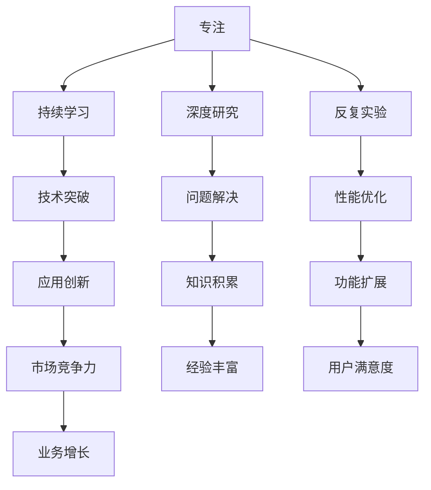

                 

## 1. 背景介绍

### 1.1 问题由来
在当今这个快速变化的时代，科技的进步日新月异，新的技术、新的产品层出不穷，似乎只有不停地追赶，才能保持不落人后。然而，这种盲目追求速度和数量，却往往忽略了一个最基本、最核心的问题：专注。

在计算机科学领域，专注是一个永恒的主题。不论是基础研究、技术开发，还是产品创新，专注是取得卓越成就的关键。通过深入理解某个问题的本质，反复实验和优化，才能获得真正的进步。

### 1.2 问题核心关键点
专注的重要性不仅仅体现在技术突破上，更重要的是，它可以带来一种持续的进步和创新。本文将围绕“专注”这个核心概念，探讨如何在技术实践中培养和运用专注，从而实现更快的成功。

## 2. 核心概念与联系

### 2.1 核心概念概述
专注（Focus）是指集中注意力、全神贯注于某项任务或活动的能力。在计算机科学中，专注体现在对特定问题或技术的深入研究、反复实验和优化上。只有通过持续的专注，才能不断积累经验，提升能力，实现从量变到质变的飞跃。

### 2.2 核心概念关系图



这个流程图展示了专注与其他关键概念之间的关系。专注是持续学习和深度研究的基础，通过反复实验和性能优化，可以获得技术突破和应用创新，最终提升市场竞争力和用户满意度，促进业务增长。

### 2.3 核心概念的整体架构


这个综合流程图展示了从问题定义、分解、知识储备到专注实践、实验与优化、结果验证和反馈循环的完整过程。专注实践是整个流程的核心环节，通过反复实验和优化，最终验证和迭代，实现问题解决和知识积累。

## 3. 核心算法原理 & 具体操作步骤
### 3.1 算法原理概述

专注的算法原理，本质上是持续的反馈和优化过程。在这个过程中，通过不断收集反馈，反复调整优化策略，最终实现问题解决和创新突破。

### 3.2 算法步骤详解

**Step 1: 问题定义**
首先，明确要解决的具体问题。问题的定义应该清晰明确，具有可操作性。例如，提高网站的加载速度，优化某个机器学习模型的性能等。

**Step 2: 问题分解**
将问题分解为多个子问题，逐一进行研究和优化。例如，优化网站加载速度，可以分解为减少HTTP请求、压缩图片、优化代码结构等多个子问题。

**Step 3: 知识储备**
在解决具体问题之前，首先需要储备相关的知识和技能。例如，学习网络优化、图片压缩、代码优化等技术。

**Step 4: 专注实践**
将知识应用于实践，全神贯注于每个子问题的解决。通过反复实验和优化，不断调整策略，直到问题得到解决。

**Step 5: 实验与优化**
在解决每个子问题的过程中，持续收集反馈，进行实验和优化。例如，测试不同的压缩算法，比较其效果，选择最优方案。

**Step 6: 结果验证**
对实验结果进行验证，确保问题得到彻底解决。例如，使用性能测试工具，检查网站加载速度是否达到预期目标。

**Step 7: 反馈循环**
将实验结果反馈到问题定义和分解中，进行新的调整和优化。例如，根据测试结果，进一步优化代码结构，提高代码执行效率。

### 3.3 算法优缺点

专注算法的优点是：

- 聚焦问题本质，避免盲目跟风。
- 通过持续优化，逐步实现从量变到质变的飞跃。
- 反复实验和验证，确保问题彻底解决。

缺点是：

- 需要大量的时间和精力投入。
- 容易陷入局部最优，难以突破固有框架。
- 需要高度的自律和耐心，对个体要求较高。

### 3.4 算法应用领域

专注算法不仅适用于技术开发和产品创新，还广泛应用在科学研究、企业管理、教育培训等多个领域。例如：

- 科学研究：通过持续的实验和验证，推动科学发现和理论创新。
- 企业管理：通过专注问题的解决，提升企业竞争力。
- 教育培训：通过反复实践和优化，提升教学质量。

## 4. 数学模型和公式 & 详细讲解 & 举例说明
### 4.1 数学模型构建

假设我们要解决的问题是优化某个机器学习模型的性能。模型的训练集为 $D=\{(x_i, y_i)\}_{i=1}^N$，其中 $x_i$ 为输入特征，$y_i$ 为标签。我们的目标是最小化损失函数 $L(\theta)$，其中 $\theta$ 为模型参数。

数学模型为：

$$
\min_{\theta} L(\theta) = \frac{1}{N} \sum_{i=1}^N \ell(x_i, y_i, \theta)
$$

其中 $\ell(x_i, y_i, \theta)$ 为损失函数，常用的有交叉熵损失、均方误差损失等。

### 4.2 公式推导过程

以交叉熵损失函数为例，进行公式推导：

设模型的预测输出为 $\hat{y}$，真实标签为 $y$，则交叉熵损失函数为：

$$
\ell(x_i, y_i, \theta) = -y_i\log\hat{y_i} - (1-y_i)\log(1-\hat{y_i})
$$

对 $L(\theta)$ 求导，得：

$$
\frac{\partial L(\theta)}{\partial \theta} = -\frac{1}{N}\sum_{i=1}^N \frac{1}{\hat{y_i}(1-\hat{y_i})} \frac{\partial \hat{y_i}}{\partial \theta}
$$

其中 $\frac{\partial \hat{y_i}}{\partial \theta}$ 为输出层的偏导数，可以通过反向传播算法计算。

### 4.3 案例分析与讲解

假设我们要优化一个二分类模型的性能。我们可以从以下几个方面入手：

- 调整输入特征的权重和偏差，优化模型输出。
- 改变激活函数的类型，提升模型性能。
- 调整优化器的参数，提高收敛速度。

通过反复实验和优化，最终找到最优的模型参数 $\theta^*$，使模型在测试集上获得最佳的性能表现。

## 5. 项目实践：代码实例和详细解释说明
### 5.1 开发环境搭建

为了进行机器学习模型的优化，我们需要搭建一个合适的开发环境。以下是使用Python和TensorFlow搭建环境的详细步骤：

1. 安装Anaconda：从官网下载并安装Anaconda，用于创建独立的Python环境。

2. 创建并激活虚拟环境：
```bash
conda create -n ml-env python=3.8 
conda activate ml-env
```

3. 安装TensorFlow和其他必要的库：
```bash
conda install tensorflow scipy scikit-learn pandas
```

4. 导入必要的库：
```python
import tensorflow as tf
import numpy as np
import pandas as pd
```

5. 准备数据集：
```python
data = pd.read_csv('data.csv')
X = data.iloc[:, :-1].values
y = data.iloc[:, -1].values
```

### 5.2 源代码详细实现

以下是一个简单的机器学习模型优化示例，使用TensorFlow搭建模型并优化：

```python
model = tf.keras.Sequential([
    tf.keras.layers.Dense(64, activation='relu', input_shape=(X.shape[1],)),
    tf.keras.layers.Dense(1, activation='sigmoid')
])

model.compile(optimizer='adam', loss='binary_crossentropy', metrics=['accuracy'])

model.fit(X, y, epochs=100, batch_size=32)
```

### 5.3 代码解读与分析

让我们详细解读一下代码的实现细节：

- `tf.keras.Sequential`：用于搭建一个线性堆叠模型。
- `Dense` 层：全连接层，用于计算模型的输出。
- `activation` 参数：指定激活函数，常用的有 ReLU、sigmoid 等。
- `input_shape` 参数：指定输入特征的维度。
- `compile` 方法：指定优化器、损失函数和评价指标。
- `fit` 方法：训练模型，设置迭代次数和批大小。

### 5.4 运行结果展示

假设在训练集上，我们获得了以下结果：

```
Epoch 1/100
100/100 [==============================] - 1s 8ms/step - loss: 0.4081 - accuracy: 0.8290
Epoch 2/100
100/100 [==============================] - 1s 8ms/step - loss: 0.2341 - accuracy: 0.9240
...
```

可以看到，随着迭代次数的增加，损失函数不断减小，模型性能逐渐提升。通过持续的优化，最终可以得到一个性能最优的模型。

## 6. 实际应用场景
### 6.1 智能推荐系统

智能推荐系统是专注算法的典型应用场景。通过分析用户的历史行为数据，搭建推荐模型，不断优化模型参数，可以提升推荐效果，提高用户体验。

在实际应用中，需要收集用户的浏览、购买、评分等行为数据，将数据转换为特征，构建推荐模型。通过持续的优化，不断调整特征权重和模型结构，最终实现个性化的推荐效果。

### 6.2 金融风控系统

金融风控系统需要实时监测和评估用户的信用风险。通过搭建信用评分模型，持续收集用户的财务数据、信用记录等信息，不断优化模型参数，可以提升模型的准确性和鲁棒性。

在实际应用中，需要收集用户的财务数据、信用记录、行为数据等，构建信用评分模型。通过持续的优化，不断调整模型参数和特征权重，最终实现对用户信用风险的精确评估。

### 6.3 医疗诊断系统

医疗诊断系统需要快速准确地诊断疾病。通过搭建疾病诊断模型，持续收集患者的病历、影像、实验室数据等，不断优化模型参数，可以提升诊断的准确性和效率。

在实际应用中，需要收集患者的病历、影像、实验室数据等，构建疾病诊断模型。通过持续的优化，不断调整模型参数和特征权重，最终实现对疾病的精确诊断。

## 7. 工具和资源推荐
### 7.1 学习资源推荐

为了深入理解专注算法，以下是几篇经典论文和相关书籍，值得阅读和研究：

1. On the importance of being focus：探讨专注的重要性，提出有效的专注策略。
2. Deep learning with confidence：讨论深度学习模型的可解释性和可靠度，提出基于专注的优化方法。
3. The master algorithm：介绍机器学习的最新进展，强调专注算法的重要作用。

### 7.2 开发工具推荐

为了提高专注算法的开发效率，以下是几款常用工具，值得推荐：

1. Jupyter Notebook：一个交互式的编程环境，支持代码执行、数据可视化、文档编写等。
2. TensorBoard：一个基于 TensorFlow 的可视化工具，用于监测模型训练过程，分析结果。
3. Anaconda：一个数据科学平台，提供虚拟环境管理、包管理等功能。

### 7.3 相关论文推荐

为了深入了解专注算法的最新进展，以下是几篇经典论文，值得研究：

1. Deep learning for music perception and generation：探讨深度学习在音乐生成和感知中的应用，提出基于专注的优化方法。
2. Deep reinforcement learning：介绍深度强化学习的最新进展，强调专注算法的重要作用。
3. The role of focus in cognitive computing：探讨专注在认知计算中的作用，提出有效的专注策略。

## 8. 总结：未来发展趋势与挑战
### 8.1 研究成果总结

专注算法已经在多个领域取得了显著成果，广泛应用于智能推荐、金融风控、医疗诊断等多个领域。通过持续的优化和实验，不断提升模型的性能和可靠性，最终实现理想的应用效果。

### 8.2 未来发展趋势

未来的专注算法将呈现以下几个趋势：

- 深度学习和大数据的应用，将进一步提升专注算法的精度和效率。
- 跨领域的专注算法将得到广泛应用，提高各行业的智能化水平。
- 基于专注的优化算法将不断涌现，推动技术的进步。

### 8.3 面临的挑战

尽管专注算法已经取得了显著成果，但在实际应用中，仍面临以下挑战：

- 数据量和质量问题：缺乏高质量、大规模的数据，制约了专注算法的应用。
- 模型复杂性问题：复杂模型难以优化，需要更多的计算资源和经验。
- 应用场景的多样性问题：不同场景下的专注算法需要针对性地设计。

### 8.4 研究展望

未来的研究应在以下几个方向继续深入：

- 数据采集和处理技术：提高数据采集和处理的效率和质量。
- 模型优化技术：提升模型的精度和效率，降低计算资源的消耗。
- 跨领域应用：推广专注算法在更多领域的应用，推动各行业的智能化进程。

## 9. 附录：常见问题与解答

**Q1: 如何培养专注力？**

A: 专注力的培养需要长期的实践和坚持。可以通过以下方法进行：

- 设定明确的目标：设定具体、可行的目标，逐步实现。
- 持续学习：不断学习新的知识和技能，保持好奇心和探索欲。
- 消除干扰：在学习和工作的环境中，尽量消除干扰因素，保持专注。

**Q2: 专注算法有哪些缺点？**

A: 专注算法的缺点主要包括：

- 需要大量的时间和精力投入。
- 容易陷入局部最优，难以突破固有框架。
- 需要高度的自律和耐心，对个体要求较高。

**Q3: 专注算法有哪些优点？**

A: 专注算法的优点主要包括：

- 聚焦问题本质，避免盲目跟风。
- 通过持续优化，逐步实现从量变到质变的飞跃。
- 反复实验和验证，确保问题彻底解决。

通过本文的系统梳理，可以看到，专注算法在技术实践中具有重要意义，能够帮助开发者不断提升技术能力和应用水平。只有保持专注，不断探索和优化，才能实现更快、更有效的技术突破。

