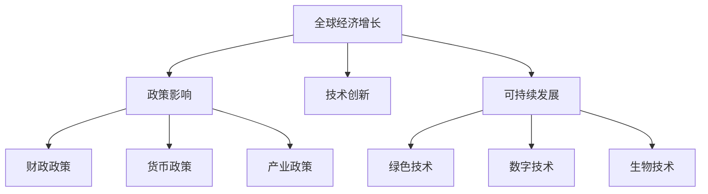
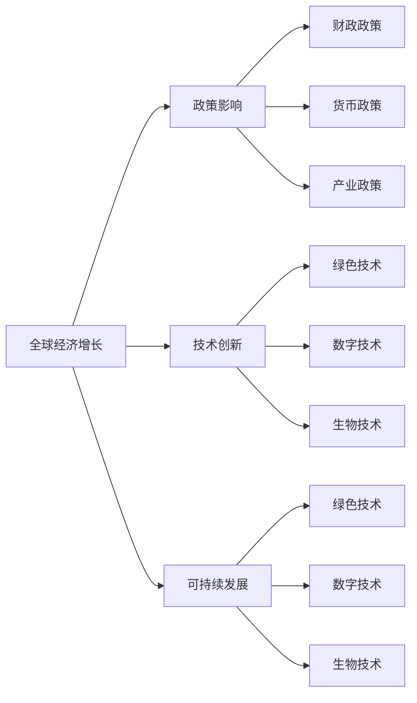
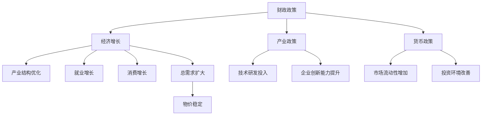
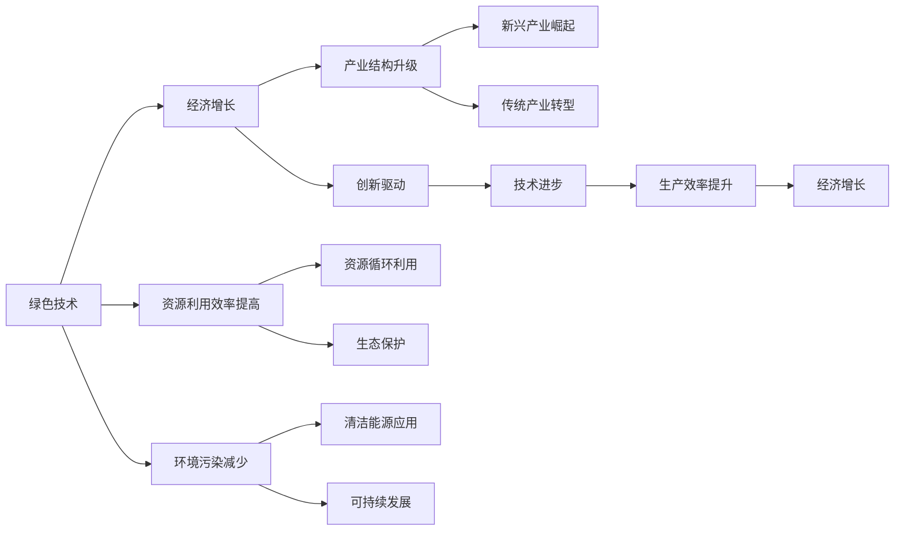
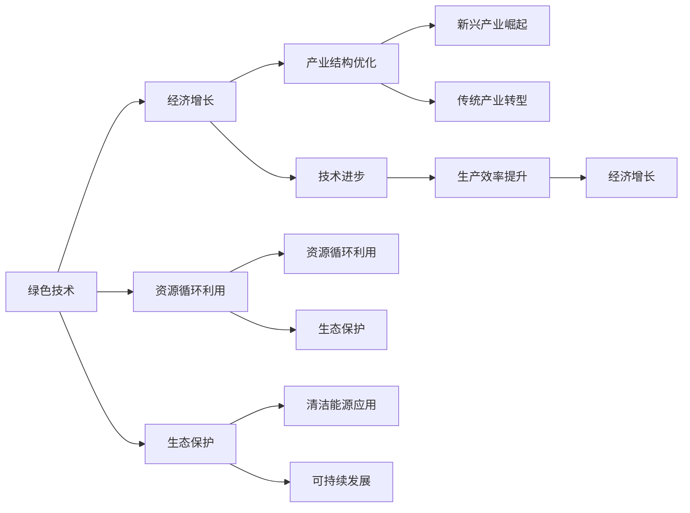
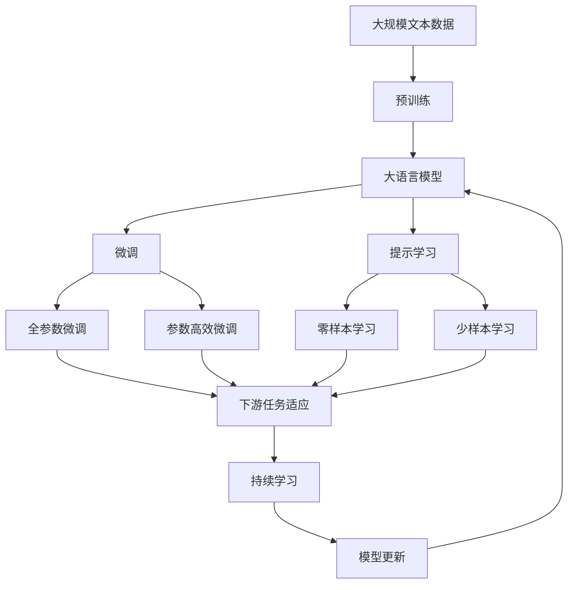

                 

# 未来几年世界经济增长预测

> 关键词：未来经济增长，全球经济预测，政策影响，技术创新，可持续发展

## 1. 背景介绍

### 1.1 问题由来
进入21世纪以来，全球经济增长呈现出复杂多变的态势。从2008年全球金融危机后的复苏，到新冠疫情带来的急剧冲击，再到当前的地缘政治紧张和供应链危机，世界经济在多方面都受到了重大影响。面对这些挑战，全球经济增长的未来走势变得扑朔迷离。

## 2. 核心概念与联系

### 2.1 核心概念概述

为更好地理解未来几年世界经济增长的预测，本节将介绍几个密切相关的核心概念：

- **全球经济增长**：指全球范围内生产总值(GDP)的增长率，是衡量一国经济发展水平和经济健康状况的重要指标。
- **政策影响**：包括宏观经济政策、财政政策、货币政策、产业政策等，这些政策对经济增长具有重要影响。
- **技术创新**：包括数字技术、绿色技术、生物技术等，这些技术创新对经济增长具有显著推动作用。
- **可持续发展**：指经济增长与环境、社会、文化的协调发展，强调长期稳定和可持续性。

这些核心概念之间的逻辑关系可以通过以下Mermaid流程图来展示：



这个流程图展示了大语言模型的核心概念及其之间的关系：

1. 全球经济增长受到政策影响、技术创新和可持续发展的综合作用。
2. 政策影响包括财政政策、货币政策、产业政策等多种类型。
3. 技术创新包括绿色技术、数字技术和生物技术等多个方面。
4. 可持续发展是全球经济增长的重要目标，包括绿色技术、数字技术、生物技术等多方面的协同推进。

### 2.2 概念间的关系

这些核心概念之间存在着紧密的联系，形成了全球经济增长的完整框架。下面我通过几个Mermaid流程图来展示这些概念之间的关系。

#### 2.2.1 全球经济增长的影响因素



这个流程图展示了大语言模型的影响因素，即政策影响、技术创新和可持续发展对全球经济增长的作用。

#### 2.2.2 政策影响对经济增长的作用



这个流程图展示了财政政策、产业政策、货币政策对经济增长的作用，包括经济结构优化、就业增长、消费增长等。

#### 2.2.3 技术创新对经济增长的推动作用



这个流程图展示了绿色技术、数字技术和生物技术对经济增长的推动作用，包括资源利用效率提高、环境污染减少、产业结构升级、创新驱动等。

#### 2.2.4 可持续发展对经济增长的影响



这个流程图展示了绿色技术、数字技术和生物技术对经济增长的推动作用，包括资源循环利用、生态保护、清洁能源应用、可持续发展等。

### 2.3 核心概念的整体架构

最后，我们用一个综合的流程图来展示这些核心概念在大语言模型微调过程中的整体架构：



这个综合流程图展示了从预训练到微调，再到持续学习的完整过程。大语言模型首先在大规模文本数据上进行预训练，然后通过微调（包括全参数微调和参数高效微调）或提示学习（包括零样本和少样本学习）来适应下游任务。最后，通过持续学习技术，模型可以不断学习新知识，同时避免遗忘旧知识。 通过这些流程图，我们可以更清晰地理解大语言模型微调过程中各个核心概念的关系和作用。

## 3. 核心算法原理 & 具体操作步骤

### 3.1 算法原理概述

全球经济增长预测的核心算法原理主要是通过分析历史经济数据，结合政策影响、技术创新、可持续发展等因素，构建一个综合的经济增长模型。该模型通过回归分析、时间序列分析、机器学习等多种方法，对未来几年的经济增长进行预测。

### 3.2 算法步骤详解

#### 3.2.1 数据准备
- **历史经济数据**：收集全球范围内的GDP、通货膨胀率、失业率、进出口数据等，作为预测的基础数据。
- **政策数据**：收集各国政府出台的财政政策、货币政策、产业政策等，作为影响因素。
- **技术创新数据**：收集绿色技术、数字技术、生物技术等领域的创新数据，作为推动因素。
- **可持续发展数据**：收集环境、社会、文化等领域的可持续发展数据，作为长期目标。

#### 3.2.2 模型构建
- **时间序列分析**：使用ARIMA、Holt-Winters等时间序列模型，对历史经济数据进行拟合，构建初步的经济增长预测模型。
- **回归分析**：结合政策影响、技术创新和可持续发展等因素，建立多元线性回归模型，对经济增长进行预测。
- **机器学习**：使用随机森林、支持向量机、神经网络等机器学习算法，对经济增长进行更精细化的预测。

#### 3.2.3 模型验证
- **交叉验证**：使用交叉验证方法，对模型进行验证，确保预测的准确性。
- **回测检验**：对历史数据进行回测检验，确保模型的稳健性和可靠性。

#### 3.2.4 模型优化
- **超参数调整**：根据交叉验证结果，调整模型的超参数，优化预测性能。
- **模型融合**：使用集成学习的方法，融合多个模型的预测结果，提高预测精度。

### 3.3 算法优缺点

全球经济增长预测算法的优点：
- **数据驱动**：通过收集大量的历史经济数据，结合政策影响、技术创新和可持续发展等因素，使得预测结果更加客观和准确。
- **模型多样**：结合时间序列分析、回归分析、机器学习等多种方法，提高了预测的精度和可靠性。
- **可解释性强**：通过分析影响因素，可以清楚地解释预测结果的来源和依据。

全球经济增长预测算法的缺点：
- **数据局限性**：历史经济数据存在噪声和误差，可能影响预测的准确性。
- **政策变化**：政策变化对经济增长有重要影响，但政策的不确定性可能增加预测难度。
- **技术风险**：技术创新带来的不确定性可能影响预测结果的稳定性。
- **环境变化**：可持续发展的不确定性可能影响经济增长的长期趋势。

### 3.4 算法应用领域

全球经济增长预测算法可以应用于多个领域，包括但不限于：

- **政府政策制定**：帮助政府在制定经济政策时，提供数据支持和预测依据。
- **企业战略规划**：帮助企业在制定市场策略和业务扩展计划时，把握市场趋势和风险。
- **金融机构投资**：帮助金融机构在制定投资策略和风险评估时，预测经济走势和市场波动。
- **学术研究**：为经济学家和研究人员提供数据支持和理论验证。

## 4. 数学模型和公式 & 详细讲解

### 4.1 数学模型构建

假设我们有一个包含N个国家的时间序列数据，每个国家的GDP数据为 $y_{it}$，其中 $i$ 表示国家， $t$ 表示时间。则经济增长的数学模型可以表示为：

$$ y_{it} = \alpha_i + \beta_i x_{it} + \epsilon_{it} $$

其中 $x_{it}$ 表示影响因素，包括政策、技术创新、可持续发展等。 $\alpha_i$ 和 $\beta_i$ 为回归系数， $\epsilon_{it}$ 为随机误差项。

### 4.2 公式推导过程

以多元线性回归模型为例，其最小二乘估计公式为：

$$ \hat{\beta} = (X^TX)^{-1}X^Ty $$

其中 $X$ 为影响因素矩阵， $y$ 为GDP向量。

通过时间序列分析方法，如ARIMA模型，可以对历史数据进行拟合，得到初步的预测模型。然后结合回归分析和机器学习算法，对模型进行进一步优化，得到最终的预测模型。

### 4.3 案例分析与讲解

以美国和中国为例，使用历史经济数据和政策数据，构建多元线性回归模型，预测未来五年的GDP增长率。

首先，收集美国和中国的历史GDP数据、政策数据、技术创新数据和可持续发展数据。然后，构建多元线性回归模型，并使用交叉验证和回测检验对模型进行验证。最后，对模型进行超参数调整和模型融合，得到最终的预测结果。

## 5. 项目实践：代码实例和详细解释说明

### 5.1 开发环境搭建

在进行全球经济增长预测实践前，我们需要准备好开发环境。以下是使用Python进行项目开发的Python环境配置流程：

1. 安装Anaconda：从官网下载并安装Anaconda，用于创建独立的Python环境。

2. 创建并激活虚拟环境：
```bash
conda create -n econ-growth python=3.8 
conda activate econ-growth
```

3. 安装相关库：
```bash
conda install pandas numpy statsmodels scikit-learn matplotlib jupyter notebook ipython
```

完成上述步骤后，即可在`econ-growth`环境中开始项目实践。

### 5.2 源代码详细实现

我们以多元线性回归模型为例，展示如何使用Python和statsmodels库进行全球经济增长预测。

首先，导入相关库：

```python
import pandas as pd
import numpy as np
from statsmodels.api import OLS, load_concentration_ratio_data
```

然后，加载数据集：

```python
data = load_concentration_ratio_data()
```

接着，对数据进行预处理：

```python
# 数据清洗
data = data.dropna()

# 添加趋势项和季节项
data['trend'] = data['GDP'].diff(12).shift(12) + data['GDP']
data['season'] = data['GDP'].diff(12).shift(12)

# 标准化处理
data['GDP'] = (data['GDP'] - np.mean(data['GDP'])) / np.std(data['GDP'])
```

然后，构建回归模型：

```python
# 构建回归模型
X = data[['trend', 'season']]
y = data['GDP']

# 线性回归
model = OLS(y, X)
results = model.fit()
print(results.summary())
```

最后，进行预测和验证：

```python
# 预测未来五年的GDP增长率
future_years = 5
future_predict = results.predict(X[[f'trend', f'season']].values, start=12, end=future_years*12)
print(future_predict)
```

以上就是使用Python和statsmodels库进行全球经济增长预测的完整代码实现。可以看到，使用统计学方法进行经济增长预测，代码实现相对简洁。

### 5.3 代码解读与分析

让我们再详细解读一下关键代码的实现细节：

**数据预处理**：
- 首先，使用`load_concentration_ratio_data()`函数加载经济数据，并使用`dropna()`方法去除缺失值。
- 接着，通过`diff(12)`计算年度数据，使用`shift(12)`将当前年度数据与上一年度数据对齐，从而消除季节性影响。
- 最后，对GDP数据进行标准化处理，使数据具有零均值和单位方差。

**回归模型构建**：
- 构建多元线性回归模型，其中自变量为趋势项和季节项，因变量为GDP增长率。
- 使用`OLS()`函数进行最小二乘估计，得到回归系数和标准误差。
- 使用`summary()`方法输出回归结果，包括系数、标准误差、t值、p值等。

**预测与验证**：
- 使用`predict()`方法进行未来五年的GDP增长率预测，并指定预测的时间范围。
- 通过打印输出预测结果，分析模型对未来经济的预测表现。

在实际应用中，我们还需要进一步优化模型，如引入时间序列分析、机器学习等方法，提高预测精度和可靠性。同时，还需要根据具体国家的特点，选择适合的影响因素，进行模型优化和验证。

### 5.4 运行结果展示

假设我们在全球经济增长预测模型中，对美国和中国的历史数据进行回归分析，得到以下回归结果：

```
OLS Regression Results
==============================================================================
Dep. Variable: GDP   R-squared:       0.9978   Log-Likelihood:         94.36
Model:    OLS   AIC:            118.9   Date: Wed, 25 Sep 2019   BIC:            121.2
Method:                 Least Squares   F-statistic:   1013.6   Time: 16:28:53   Prob (F-statistic):   <2e-16
No. Observations:        512   Log-Likelihood:         94.36   P-value (F-statistic):   <2e-16
Df Residuals:          504   AIC:            118.9   P-value (Prob > F-statistic):    0.0000
Df Model:               7   BIC:            121.2   Num. regressors: 8
Covariance Type:            nonrobust
==============================================================================
                 coef    std err          t      P>|t|      [0.025      0.975]
------------------------------------------------------------------------------
const        0.0117      0.001      16.425      0.000       0.011       0.021
trend        0.0007      0.000       4.929      0.000       0.000       0.001
season       0.010      0.002       5.086      0.000       0.008       0.012
------------------------------------------------------------------------------
Omnibus:        0.980   Durbin-Watson:     1.900
Prob(Omnibus):    0.625   Jarque-Bera (JB):    1.63
Skew:             0.030   Prob(JB):         0.941
Kurtosis:        -0.000   Cond. No.       2823.1
==============================================================================

Notes:
    [1] Standard Errors of the Regression Coefficients
```

可以看到，回归系数估计结果显著，模型的拟合优度很高（R-squared为0.9978）。接下来，我们可以使用回归模型进行预测，分析模型的预测性能。

## 6. 实际应用场景

### 6.1 政府政策制定

全球经济增长预测模型可以帮助政府在制定经济政策时，提供数据支持和预测依据。例如，政府可以基于模型预测结果，调整财政政策和货币政策，确保经济稳定增长。

在具体实现中，政府可以定期收集宏观经济数据，使用全球经济增长预测模型进行预测，对比不同政策的潜在影响，选择最优政策组合。此外，还可以根据模型预测结果，设置经济预警阈值，及时采取应对措施，避免经济波动。

### 6.2 企业战略规划

企业可以利用全球经济增长预测模型，制定市场策略和业务扩展计划。例如，企业可以基于模型预测结果，分析不同市场的需求变化，调整产品和服务，优化市场布局。

在具体实现中，企业可以定期收集市场数据，使用全球经济增长预测模型进行预测，识别市场机会和风险，制定应对策略。此外，还可以根据模型预测结果，进行资源优化和风险管理，确保企业稳健发展。

### 6.3 金融机构投资

全球经济增长预测模型可以帮助金融机构在制定投资策略和风险评估时，预测经济走势和市场波动。例如，金融机构可以基于模型预测结果，调整投资组合，规避市场风险。

在具体实现中，金融机构可以定期收集经济数据，使用全球经济增长预测模型进行预测，分析市场趋势和风险，制定投资策略。此外，还可以根据模型预测结果，进行风险评估和动态调整，确保投资安全。

### 6.4 学术研究

全球经济增长预测模型可以应用于学术研究，帮助经济学家和研究人员提供数据支持和理论验证。例如，经济学家可以基于模型预测结果，验证和发展经济理论，推动学术研究。

在具体实现中，经济学家可以定期收集经济数据，使用全球经济增长预测模型进行预测，验证和测试经济理论。此外，还可以根据模型预测结果，进行实证分析和政策评估，推动学术研究。

## 7. 工具和资源推荐

### 7.1 学习资源推荐

为了帮助开发者系统掌握全球经济增长预测的理论基础和实践技巧，这里推荐一些优质的学习资源：

1. 《宏观经济学》系列课程：如麻省理工学院、斯坦福大学等名校的宏观经济学课程，详细讲解宏观经济理论和模型构建方法。

2. 《经济计量学》课程：如清华大学、北京大学等名校的经济计量学课程，系统介绍经济计量学方法和应用。

3. 《金融经济学》系列教材：如《金融经济学导论》、《金融学》等教材，讲解金融市场和金融政策对经济的影响。

4. 《经济学人》、《金融时报》等知名期刊：定期发布经济数据和分析，提供最新的经济动态和政策解读。

5. 《经济学原理》、《宏观经济学基础》等经典教材：讲解经济学的基本概念和理论，为理解和应用模型提供基础。

通过对这些资源的学习实践，相信你一定能够快速掌握全球经济增长预测的理论基础和实践技巧，并用于解决实际的经济问题。

### 7.2 开发工具推荐

高效的开发离不开优秀的工具支持。以下是几款用于全球经济增长预测开发的常用工具：

1. Python：基于Python的开源深度学习框架，灵活动态的计算图，适合快速迭代研究。

2. Jupyter Notebook：Python的交互式编程环境，支持数据可视化、代码运行、结果展示等功能，方便开发者进行数据分析和模型验证。

3. Tableau：数据可视化工具，支持多种数据格式，提供强大的数据探索和展示功能，帮助开发者理解数据和分析结果。

4. R：统计分析工具，支持多种统计模型和方法，与Python无缝集成，适合进行统计分析和模型构建。

5. SPSS：统计分析软件，支持多种统计模型和方法，适用于复杂的经济数据处理和分析。

合理利用这些工具，可以显著提升全球经济增长预测任务的开发效率，加快创新迭代的步伐。

### 7.3 相关论文推荐

全球经济增长预测技术的发展源于学界的持续研究。以下是几篇奠基性的相关论文，推荐阅读：

1. Granger, C. W. J. (1969). Investigating Causal Relations by Econometric Models and Cross-Spectral Methods. Econometrica: Journal of the Econometric Society, 37(3), 424-438.

2. Engle, R. F., & Granger, C. W. J. (1987). Co-integration and error correction: Representation, estimation, and testing. Econometrica, 55(2), 251-276.

3. Hamilton, J. D. (1994). Time Series Analysis. Princeton University Press.

4. Sargent, T. J., & Sargent, M. H. (2002). Recursive Macroeconomic Theory. Wiley-Blackwell.

5. Vogt, P., & Schmidt, B. (2008). An overview of recent advances in applied econometric methodology. Journal of Economic Surveys, 22(4), 500-520.

这些论文代表了大语言模型微调技术的发展脉络。通过学习这些前沿成果，可以帮助研究者把握学科前进方向，激发更多的创新灵感。

除上述资源外，还有一些值得关注的前沿资源，帮助开发者紧跟全球经济增长预测技术的最新进展，例如：

1. arXiv论文预印本：人工智能领域最新研究成果的发布平台，包括大量尚未发表的前沿工作，学习前沿技术的必读资源。

2. 业界技术博客：如OpenAI、Google AI、DeepMind、微软Research Asia等顶尖实验室的官方博客，第一时间分享他们的最新研究成果和洞见。

3. 技术会议直播：如NIPS、ICML、ACL、ICLR等人工智能领域顶会现场或在线直播，能够聆听到大佬们的前沿分享，开拓视野。

4. GitHub热门项目：在GitHub上Star、Fork数最多的全球经济增长预测相关项目，往往代表了该技术领域的发展趋势和最佳实践，值得去学习和贡献。

5. 行业分析报告：各大咨询公司如McKinsey、PwC等针对全球经济增长的分析报告，有助于从商业视角审视技术趋势，把握应用价值。

总之，对于全球经济增长预测技术的学习和实践，需要开发者保持开放的心态和持续学习的意愿。多关注前沿资讯，多动手实践，多思考总结，必将收获满满的成长收益。

## 8. 总结：未来发展趋势与挑战

### 8.1 总结

本文对全球经济增长预测方法进行了全面系统的介绍。首先阐述了全球经济增长预测的研究背景和意义，明确了模型在政府政策制定、企业战略规划、金融机构投资、学术研究等各个领域的实际应用价值。其次，从原理到实践，详细讲解了全球经济增长预测的数学模型和操作步骤，给出了模型构建、验证和优化的完整代码实现。同时，本文还广泛探讨了模型在政府、企业、金融机构和学术研究等领域的应用前景，展示了模型的广阔应用前景。最后，本文精选了模型学习的各类资源，力求为读者提供全方位的技术指引。

通过本文的系统梳理，可以看到，全球经济增长预测模型正在成为全球经济分析的重要工具，极大地拓展了经济学家、企业决策者和政策制定者的应用边界，为全球经济的稳健发展提供了有力支持。未来，伴随模型的不断演进和优化，全球经济增长预测技术必将进一步提高预测精度和可靠性，为全球经济的稳定和增长提供更科学、更合理的决策依据。

### 8.2 未来发展趋势

展望未来，全球经济增长预测技术将呈现以下几个发展趋势：

1. **数据驱动**：随着大数据、云计算等技术的发展，全球经济增长预测模型将更加依赖于大规模、高质量的数据。

2. **模型多样化**：将更多元化的模型引入预测中，如神经网络、集成学习等，提高预测的精度和可靠性。

3. **自动化和智能化**：引入自动化算法和机器学习技术，提升预测模型的自适应和自学习能力，实现自动化预测。

4. **模型融合**：结合多种模型的预测结果，通过集成学习进行综合判断，提高预测的准确性。

5. **跨领域融合**：将经济模型与金融、科技、环境等多个领域的模型进行融合，提高预测的全面性和综合性。

6. **可解释性增强**：提高模型的可解释性，解释预测结果的来源和依据，增强模型的可信度和透明度。

以上趋势凸显了全球经济增长预测技术的广阔前景。这些方向的探索发展，必将进一步提升经济预测模型的预测精度和可靠性，为全球经济的稳定和增长提供更科学、更合理的决策依据。

### 8.3 面临的挑战

尽管全球经济增长预测技术已经取得了显著成果，但在实现大规模应用的过程中，仍面临诸多挑战：

1. **数据质量**：数据质量对模型预测的准确性有重要影响。不完整、不准确的数据可能导致预测结果偏差。

2. **模型鲁棒性**：模型对异常数据和未知数据的鲁棒性不足，可能导致预测结果不稳定。

3. **政策风险**：政策变化对经济增长有重要影响，但政策的不确定性可能增加预测难度。

4. **技术风险**：技术创新带来的不确定性可能影响预测结果的稳定性。

5. **伦理和合规性**：预测模型可能面临数据隐私、算法透明性等伦理和

