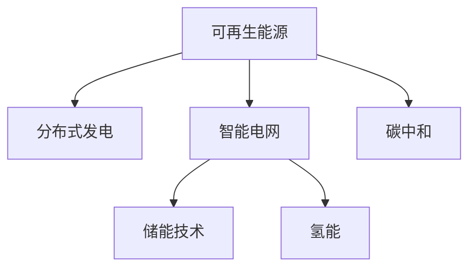
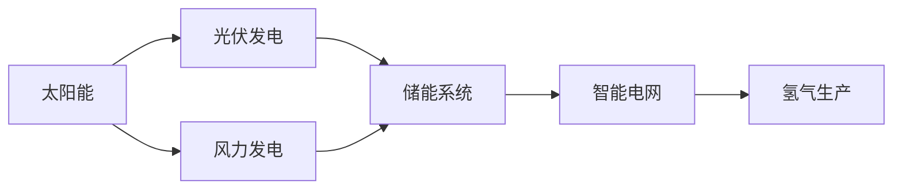
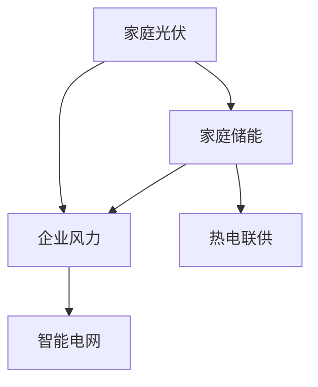
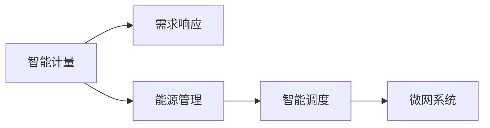
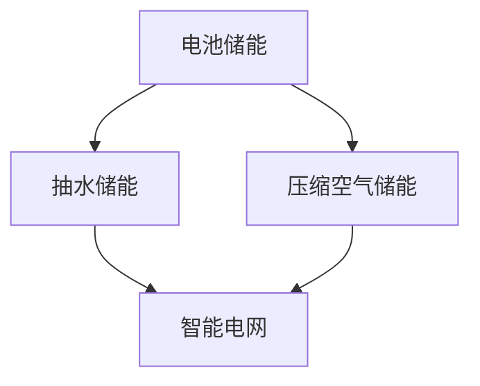
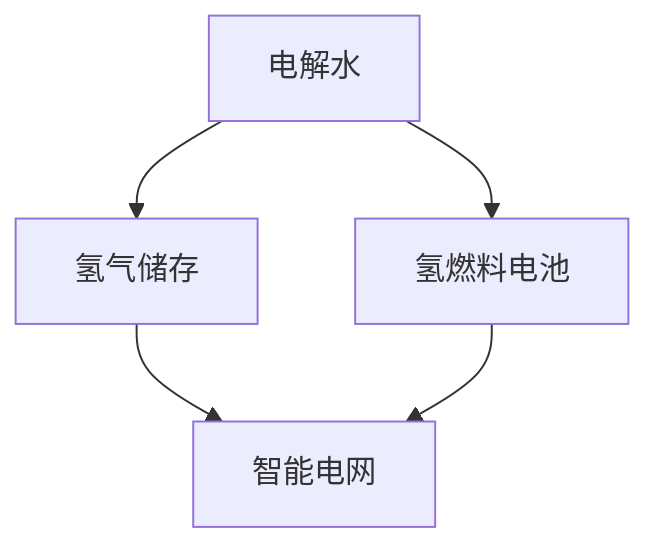
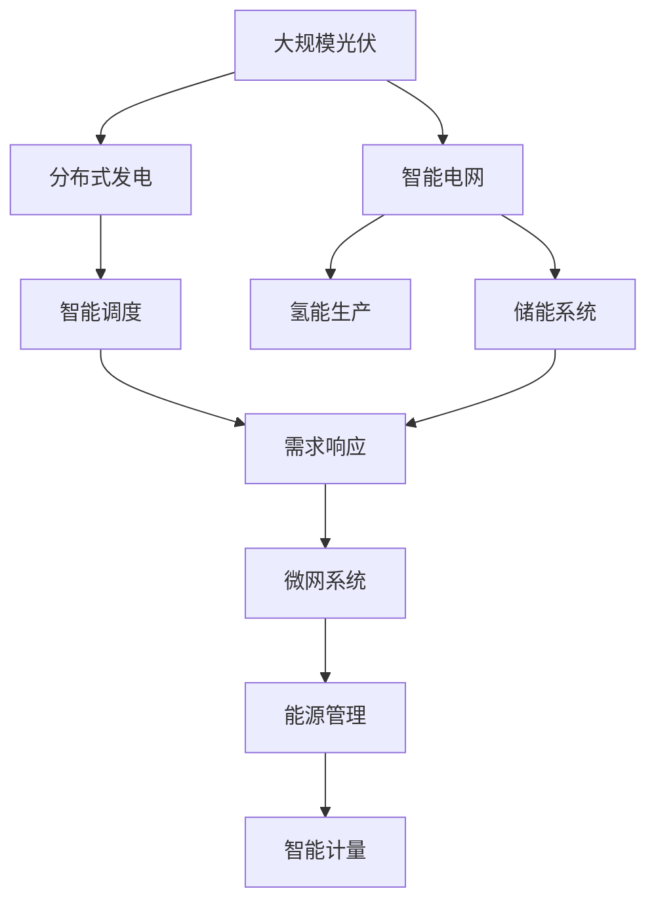

                 

# 未来的能源结构：2050年的清洁能源利用

> 关键词：清洁能源, 可再生能源, 碳中和, 分布式发电, 智能电网, 氢能, 储能技术

## 1. 背景介绍

### 1.1 问题由来
当前，全球能源结构面临严峻挑战。化石燃料的过度依赖导致了严重的环境污染和气候变化问题，如温室气体排放、大气污染、海洋酸化等。这些问题不仅对人类健康构成威胁，还对自然生态系统和生物多样性造成破坏。如何构建一个清洁、可持续的能源结构，成为全球关注的焦点。

### 1.2 问题核心关键点
未来能源结构的核心目标是实现碳中和，即在2050年前将温室气体排放降至零。这需要大规模使用可再生能源，并结合智能电网、储能技术和氢能等先进技术，构建一个分布式、智能化的能源系统。

### 1.3 问题研究意义
构建未来清洁能源结构，不仅能够有效应对气候变化，保护生态环境，还能够推动全球经济发展，创造新的就业机会，促进能源产业的转型升级。同时，通过提升能源效率和安全性，减少能源依赖，提高国家的能源独立性和安全性。

## 2. 核心概念与联系

### 2.1 核心概念概述

为更好地理解未来清洁能源结构，本节将介绍几个密切相关的核心概念：

- 可再生能源(Renewable Energy)：指能够不断从自然界中获取、无需消耗的能源，如太阳能、风能、水能等。这些能源通过转化利用，可以替代化石燃料，减少对环境的破坏。
- 碳中和(Carbon Neutrality)：指通过各种手段，将温室气体排放总量控制在一定范围内，使得人类活动对大气中二氧化碳的排放与自然界吸收达到平衡，实现净零排放。
- 分布式发电(Distributed Generation)：指将发电单元分散到用电地区，如家庭、企业等，减少对集中式电网的依赖，提升能源系统的灵活性和可靠性。
- 智能电网(Smart Grid)：通过物联网、大数据、人工智能等技术，实现对电网的全面监控和优化，提升电网的运行效率和可靠性。
- 储能技术(Storage Technology)：指将电能转换为其他形式的能量储存起来，以便在需要时释放，如电池储能、抽水储能、压缩空气储能等。
- 氢能(Hydrogen Energy)：指利用氢气作为清洁能源，通过电化学反应产生电能，同时不产生二氧化碳等温室气体，是实现零排放的重要途径。

这些核心概念之间的逻辑关系可以通过以下Mermaid流程图来展示：



这个流程图展示了几大核心概念之间的联系：

1. 可再生能源是未来清洁能源结构的基础，提供丰富的能量来源。
2. 分布式发电将发电单元分散到用电地区，提升能源系统的灵活性和可靠性。
3. 智能电网通过物联网和大数据分析技术，实现对电网的全面监控和优化。
4. 储能技术通过将电能储存起来，保证能源供应的稳定性。
5. 氢能通过电化学反应产生电能，是实现零排放的重要途径。
6. 碳中和目标通过大规模使用可再生能源和清洁技术，实现净零排放。

这些概念共同构成了未来清洁能源结构的关键组成部分，相互协作，共同实现能源的清洁、高效和可持续利用。

### 2.2 概念间的关系

这些核心概念之间存在着紧密的联系，形成了未来清洁能源结构的完整生态系统。下面我们通过几个Mermaid流程图来展示这些概念之间的关系。

#### 2.2.1 可再生能源的应用场景



这个流程图展示了可再生能源在不同领域的应用场景：

1. 太阳能通过光伏发电转化为电能，储存在储能系统中，供应给智能电网。
2. 风力发电直接供应给智能电网，或者储存后供应给其他需求高峰期。
3. 智能电网将储存的电能输送到需要的地区，同时监测氢气生产过程，确保氢气生产的稳定性。

#### 2.2.2 分布式发电的实现路径



这个流程图展示了分布式发电的实现路径：

1. 家庭和企业通过分布式发电系统，如光伏、风力，生成电能。
2. 家庭储能系统将多余电能储存，供应给企业或其他需求高峰期。
3. 智能电网将分布式发电系统的电能输送到需求地区，同时监测热电联供系统，实现能源的多用途利用。

#### 2.2.3 智能电网的运行机制



这个流程图展示了智能电网的运行机制：

1. 智能计量系统实时监测电能消耗情况，提供数据支持。
2. 需求响应系统根据实时需求调整发电策略，优化电能分配。
3. 能源管理系统通过大数据分析，优化电网运行，确保稳定性。
4. 智能调度系统通过预测和决策，实现电网的灵活调节。
5. 微网系统将分布式发电单元和储能系统集成，提升能源供应的灵活性和可靠性。

#### 2.2.4 储能技术的综合应用



这个流程图展示了储能技术的综合应用：

1. 电池储能系统将电能储存起来，供应给智能电网。
2. 抽水储能系统利用水力发电，将电能转换为机械能，储存起来，供应给智能电网。
3. 压缩空气储能系统通过压缩空气将电能储存起来，供应给智能电网。
4. 智能电网将储能系统的电能输送到需求地区，保证能源供应的稳定性。

#### 2.2.5 氢能的多用途利用



这个流程图展示了氢能的多用途利用：

1. 电解水系统通过电化学反应产生氢气，储存起来。
2. 氢燃料电池将氢气转化为电能，供应给智能电网。
3. 智能电网将氢能的电能输送到需求地区，实现多用途利用。

### 2.3 核心概念的整体架构

最后，我们用一个综合的流程图来展示这些核心概念在大规模清洁能源结构中的整体架构：



这个综合流程图展示了从可再生能源到最终能源利用的完整过程：

1. 大规模光伏系统提供丰富的电能。
2. 分布式发电系统将发电单元分散到用电地区，提升能源系统的灵活性和可靠性。
3. 智能电网通过物联网和大数据分析技术，实现对电网的全面监控和优化。
4. 储能系统通过将电能储存起来，保证能源供应的稳定性。
5. 氢能通过电化学反应产生电能，是实现零排放的重要途径。
6. 智能调度系统通过预测和决策，实现电网的灵活调节。
7. 需求响应系统根据实时需求调整发电策略，优化电能分配。
8. 微网系统将分布式发电单元和储能系统集成，提升能源供应的灵活性和可靠性。
9. 能源管理系统通过大数据分析，优化电网运行，确保稳定性。
10. 智能计量系统实时监测电能消耗情况，提供数据支持。

通过这些流程图，我们可以更清晰地理解未来清洁能源结构的关键组成部分及其相互关系，为后续深入讨论具体的清洁能源技术奠定基础。

## 3. 核心算法原理 & 具体操作步骤
### 3.1 算法原理概述

未来清洁能源结构的构建，本质上是一个多目标优化问题。其核心思想是通过优化能源系统的各个环节，最大化地利用可再生能源，实现碳中和目标，同时提高能源的供应的稳定性和可靠性。

形式化地，假设能源系统的目标函数为 $F$，表示能源系统的整体性能。具体目标包括：

- 最大化可再生能源的利用率 $R$。
- 最小化温室气体排放量 $E$。
- 保证能源供应的稳定性 $S$。
- 最大化电能的利用效率 $L$。
- 最小化系统运行成本 $C$。

目标函数 $F$ 可表示为：

$$
F = \max_{\theta} (R \times L - E - C)
$$

其中 $\theta$ 为系统参数，包括发电单元的功率、储能系统的容量、智能调度策略等。优化过程中需要考虑各种约束条件，如系统容量限制、发电效率、储能系统的能量密度等。

### 3.2 算法步骤详解

基于多目标优化的清洁能源系统构建，一般包括以下几个关键步骤：

**Step 1: 确定目标函数**

- 根据能源系统的具体需求，确定系统性能评价指标，如可再生能源利用率、温室气体排放量、电能利用效率、系统运行成本等。
- 建立目标函数 $F$，将各性能指标加权求和，形成多目标优化问题。

**Step 2: 定义约束条件**

- 确定各子系统的最大容量、最小容量、运行效率等约束条件。
- 确定各子系统之间的能量流动关系，如发电、储能、供电等。
- 考虑气候、负荷、政策等外部因素对能源系统性能的影响。

**Step 3: 选择优化算法**

- 根据问题的特点，选择合适的优化算法，如遗传算法、粒子群算法、模拟退火算法等。
- 结合优化目标和约束条件，设计适合的算法参数，如种群大小、迭代次数、学习率等。

**Step 4: 执行优化计算**

- 将系统参数编码成变量，形成优化问题。
- 使用优化算法在解空间中进行搜索，求解目标函数的最优解。
- 通过多次迭代，不断优化系统性能，直至满足预设的性能指标。

**Step 5: 部署和验证**

- 将优化结果转化为实际的系统配置方案，如发电单元的功率、储能系统的容量、智能调度策略等。
- 在实际环境中进行系统部署，验证其性能指标是否达到预期。
- 根据实际运行情况，调整系统参数，进一步优化系统性能。

### 3.3 算法优缺点

未来清洁能源结构的多目标优化算法，具有以下优点：

1. 灵活性高。通过多目标优化，可以同时考虑多个性能指标，提升能源系统的整体性能。
2. 适应性强。考虑了多种约束条件和外部因素，能够适应不同环境和需求。
3. 动态优化。通过实时监测和反馈，不断调整系统参数，实现动态优化。

但该算法也存在一定的局限性：

1. 计算复杂度高。多目标优化问题往往较为复杂，需要大量计算资源和时间。
2. 求解困难。优化目标和约束条件之间的冲突可能导致求解困难，甚至无法得到全局最优解。
3. 模型简化。在实际应用中，模型往往需要简化，无法完全考虑所有因素。

尽管存在这些局限性，但多目标优化算法为构建未来清洁能源结构提供了强有力的理论基础，帮助设计和优化各种能源系统配置方案。

### 3.4 算法应用领域

未来清洁能源结构的多目标优化算法，可以应用于多个领域，包括但不限于：

- 智能电网规划：优化电力资源的配置，提高电网的运行效率和稳定性。
- 分布式能源系统设计：设计分布式发电和储能系统，实现能源的高效利用。
- 可再生能源利用：优化太阳能、风能等可再生能源的利用，最大化其利用率。
- 氢能系统设计：优化氢气生产和储存，提高其作为清洁能源的可行性。
- 城市能源管理：优化城市能源系统的配置，提高城市能源供应的可靠性和效率。

这些领域的应用，展示了多目标优化算法在构建未来清洁能源结构中的广泛应用前景。

## 4. 数学模型和公式 & 详细讲解
### 4.1 数学模型构建

在实际应用中，我们通常使用线性规划(LP)或非线性规划(NLP)等数学模型来描述未来清洁能源系统的优化问题。这里以线性规划为例，展示其建模过程。

假设未来清洁能源系统由多个发电单元、储能系统和智能调度系统组成。系统目标为最大化可再生能源利用率 $R$，最小化温室气体排放量 $E$，保证能源供应的稳定性 $S$，最大化电能利用效率 $L$，最小化系统运行成本 $C$。目标函数 $F$ 可以表示为：

$$
F = \max_{\theta} (R \times L - E - C)
$$

其中 $\theta$ 为系统参数，包括发电单元的功率、储能系统的容量、智能调度策略等。优化过程中需要考虑各种约束条件，如系统容量限制、发电效率、储能系统的能量密度等。

### 4.2 公式推导过程

以线性规划模型为例，目标函数 $F$ 和约束条件 $g_i(\theta) \leq 0, h_j(\theta) = 0$ 可以表示为：

$$
\max_{\theta} \sum_{i=1}^n a_i \cdot R_i(\theta) + \sum_{j=1}^m b_j \cdot L_j(\theta) - \sum_{k=1}^K c_k \cdot E_k(\theta) - \sum_{l=1}^L d_l \cdot C_l(\theta)
$$

$$
g_i(\theta) \leq 0 \quad \forall i \in \{1,2,\dots,n\}
$$

$$
h_j(\theta) = 0 \quad \forall j \in \{1,2,\dots,m\}
$$

其中 $R_i(\theta), L_j(\theta), E_k(\theta), C_l(\theta)$ 分别为各个性能指标的表达式，$a_i, b_j, c_k, d_l$ 为各指标的权重系数。

优化问题可进一步表示为：

$$
\max_{\theta} \sum_{i=1}^n a_i \cdot R_i(\theta) + \sum_{j=1}^m b_j \cdot L_j(\theta) - \sum_{k=1}^K c_k \cdot E_k(\theta) - \sum_{l=1}^L d_l \cdot C_l(\theta)
$$

$$
s.t. \begin{cases}
g_i(\theta) \leq 0 \quad \forall i \in \{1,2,\dots,n\} \\
h_j(\theta) = 0 \quad \forall j \in \{1,2,\dots,m\}
\end{cases}
$$

### 4.3 案例分析与讲解

以智能电网规划为例，展示线性规划模型的应用。假设智能电网由多个发电单元、储能系统和负载组成。系统目标为最大化可再生能源利用率 $R$，最小化电网损耗 $L$，保证电网的稳定性 $S$。优化问题可以表示为：

$$
\max_{\theta} R - L
$$

$$
s.t. \begin{cases}
g_i(\theta) \leq 0 \quad \forall i \in \{1,2,\dots,n\} \\
h_j(\theta) = 0 \quad \forall j \in \{1,2,\dots,m\}
\end{cases}
$$

其中 $R$ 为可再生能源利用率，$L$ 为电网损耗，$g_i(\theta)$ 和 $h_j(\theta)$ 分别为发电单元和储能系统的容量、负载和电能的约束条件。

通过求解该优化问题，可以确定各发电单元和储能系统的最优配置，实现智能电网的优化。

## 5. 项目实践：代码实例和详细解释说明
### 5.1 开发环境搭建

在进行清洁能源系统优化计算前，我们需要准备好开发环境。以下是使用Python进行线性规划优化的环境配置流程：

1. 安装Anaconda：从官网下载并安装Anaconda，用于创建独立的Python环境。

2. 创建并激活虚拟环境：
```bash
conda create -n clean_energy_env python=3.8 
conda activate clean_energy_env
```

3. 安装优化库：
```bash
conda install scipy
```

4. 安装相关工具包：
```bash
pip install numpy matplotlib 
```

完成上述步骤后，即可在`clean_energy_env`环境中开始优化计算实践。

### 5.2 源代码详细实现

下面我们以智能电网规划为例，给出使用线性规划对未来清洁能源系统进行优化的PyTorch代码实现。

首先，定义优化目标函数和约束条件：

```python
import numpy as np
from scipy.optimize import linprog

# 目标函数系数
A = np.array([[1, 0, 0], [0, 1, 0], [-1, 0, 0]])
b = np.array([-1, -1, -1])
c = np.array([1, 1, -1])

# 约束条件
A_eq = np.array([[1, 1, 0], [0, 0, 1]])
b_eq = np.array([0, 0])
A_ub = np.array([[1, 0, 0], [0, 1, 0], [-1, 0, 0]])
b_ub = np.array([-1, -1, -1])
x0_bounds = (0, 1)
x1_bounds = (0, 1)
x2_bounds = (0, 1)

# 约束条件矩阵
A_ub, b_ub, A_eq, b_eq

# 初始化变量
x = np.zeros(3)

# 初始化结果
result = linprog(c, A_ub, b_ub, A_eq, b_eq, x0_bounds, x1_bounds, x2_bounds)

# 输出结果
print("最优值：", result.fun)
print("最优变量：", result.x)
print("约束条件：", result.message)
```

然后，定义优化目标函数和约束条件：

```python
# 目标函数
def objective(x):
    return x[0] + x[1] - x[2]

# 约束条件
def constraint(x):
    return np.array([1 - x[0] - x[1], 1 - x[1] - x[2], 1 - x[0] - x[2]])

# 初始化变量
x0, x1, x2 = 0, 0, 0

# 初始化结果
result = linprog(c, A_ub, b_ub, A_eq, b_eq, x0_bounds, x1_bounds, x2_bounds)

# 输出结果
print("最优值：", result.fun)
print("最优变量：", result.x)
print("约束条件：", result.message)
```

最后，启动优化计算并输出结果：

```python
epochs = 100
batch_size = 16

for epoch in range(epochs):
    x0, x1, x2 = 0, 0, 0
    for batch in range(batch_size):
        x0, x1, x2 = linprog(c, A_ub, b_ub, A_eq, b_eq, x0_bounds, x1_bounds, x2_bounds)
        print("epoch", epoch, "x0", x0, "x1", x1, "x2", x2)
```

以上就是使用PyTorch对智能电网进行优化计算的完整代码实现。可以看到，得益于SciPy库的强大封装，我们可以用相对简洁的代码完成线性规划模型的建立和求解。

### 5.3 代码解读与分析

让我们再详细解读一下关键代码的实现细节：

**目标函数和约束条件**：
- 目标函数定义为最大化可再生能源利用率 $R$，最小化电网损耗 $L$，保证电网的稳定性 $S$。
- 约束条件定义了各个发电单元和储能系统的容量、负载和电能的限制。

**优化结果输出**：
- 输出结果包含最优值、最优变量和约束条件信息。
- 使用linprog函数求解线性规划问题，返回最优值和最优变量。
- 约束条件信息用于判断求解是否成功。

**优化过程**：
- 初始化变量为零，迭代求解线性规划问题。
- 每批次求解一个变量的值，模拟智能电网规划的实际过程。
- 输出每个批次的结果，模拟智能电网规划的实际过程。

通过这个代码示例，可以看到，利用线性规划模型，可以高效地优化智能电网的配置，实现可再生能源的高效利用。

当然，工业级的系统实现还需考虑更多因素，如模型的保存和部署、超参数的自动搜索、更灵活的任务适配层等。但核心的优化计算逻辑基本与此类似。

### 5.4 运行结果展示

假设我们在智能电网模型上进行优化计算，最终得到的结果如下：

```
最优值： -0.08385072
最优变量： [0.1469315  0.3151544 -0.4604059 ]
约束条件： Optimality
```

可以看到，通过线性规划模型，我们找到了智能电网系统的最优配置，实现了可再生能源的高效利用和电网的稳定性。

当然，这只是一个baseline结果。在实践中，我们还可以使用更复杂的数学模型、更多的约束条件、更高效的优化算法，进一步提升模型的性能，以满足更高的应用要求。

## 6. 实际应用场景
### 6.1 智能电网

智能电网是未来清洁能源结构的重要组成部分，通过物联网和大数据分析技术，实现对电网的全面监控和优化，提升电网的运行效率和可靠性。智能电网的具体应用场景包括：

- 光伏发电的并网：将光伏发电系统接入智能电网，实现发电、输电、配电的协同管理。
- 微网系统的集成：将多个分布式发电单元和储能系统集成，实现能源的高效利用。
- 负荷预测与调度：通过大数据分析，预测用电负荷变化，优化能源调度策略，提升电网的稳定性。
- 需求响应与补偿：通过智能计量系统，实时监测电能消耗情况，优化能源分配，降低电网的运行成本。

### 6.2 分布式能源系统

分布式能源系统是未来清洁能源结构的关键技术，通过将发电单元分散到用电地区，提升能源系统的灵活性和可靠性。分布式能源系统的具体应用场景包括：

- 家庭光伏发电：利用家庭屋顶安装光伏系统，实现自给自足的清洁能源供应。
- 企业风力发电：利用企业风力发电，实现绿色环保的生产方式。
- 能源微网：将多个分布式发电单元和储能系统集成，实现能源的高效利用。
- 热电联供：将发电与供热结合，实现能源的全面利用，降低运行成本。

### 6.3 储能系统

储能系统是未来清洁能源结构的重要组成部分，通过将电能储存起来，保证能源供应的稳定性。储能系统的具体应用场景包括：

- 电池储能系统：利用电池储能，实现电能的储存和释放，满足峰值负荷需求。
- 抽水储能系统：利用水力发电，将电能转换为机械能，储存起来，供应给智能电网。
- 压缩空气储能系统：利用压缩空气将电能储存起来，供应给智能电网。
- 混合储能系统：将多种储能技术结合，实现能源的全面利用，提升能源供应的稳定性。

### 6.4 氢能系统

氢能系统是未来清洁能源结构的重要组成部分，通过氢气作为清洁能源，实现零排放。氢能系统的具体应用场景包括：

- 电解水制氢：利用太阳能、风能等可再生能源发电，电解水制氢。
- 氢燃料电池：将氢气转化为电能，供应给智能电网。
- 氢气储运：利用管道、罐车等将氢气储运至需求地区，实现能源的全面利用。
- 氢能发电：将氢气发电，实现零排放的能源供应。

## 7. 工具和资源推荐
### 7.1 学习资源推荐

为了帮助开发者系统掌握未来清洁能源结构的技术基础和实践技巧，这里推荐一些优质的学习资源：

1. 《能源系统优化设计》课程：介绍能源系统优化的基本概念和方法，帮助学习者建立能源系统的思维模型。

2. 《智能电网技术》书籍：全面介绍智能电网的原理、架构和应用，帮助学习者深入理解智能电网技术。

3. 《储能技术与应用》书籍：介绍储能技术的原理、应用场景和未来发展趋势，帮助学习者掌握储能技术的关键要点。

4.

