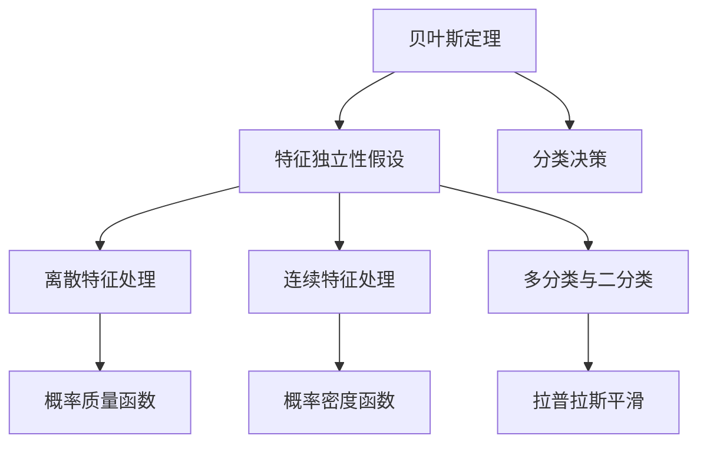
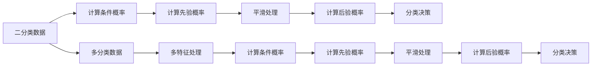
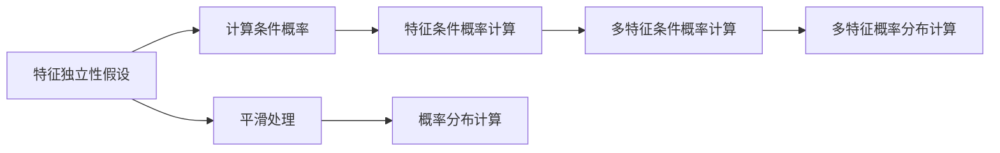
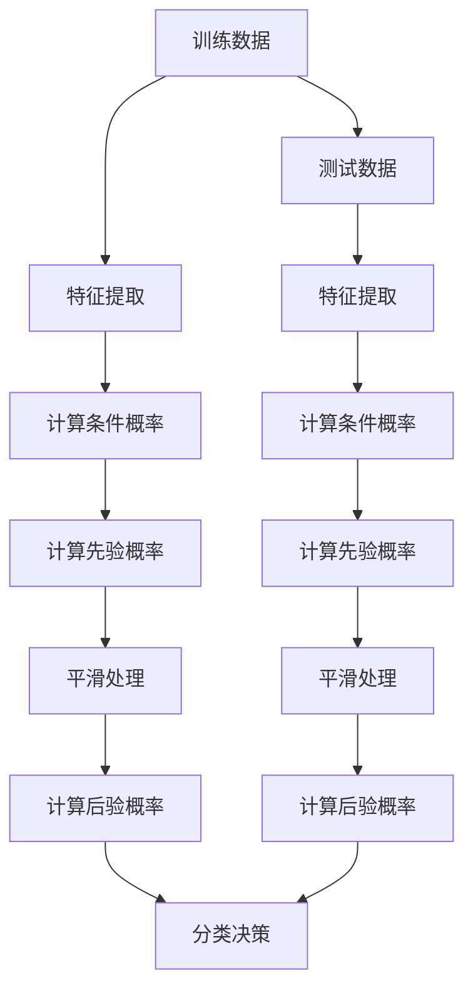

                 

# 朴素贝叶斯 (Naive Bayes)

## 1. 背景介绍

### 1.1 问题由来

朴素贝叶斯（Naive Bayes）是一种基于贝叶斯定理和特征独立性假设的分类算法。在机器学习和数据挖掘领域，朴素贝叶斯算法被广泛应用于文本分类、垃圾邮件过滤、推荐系统等任务中。它具有简单高效、易于实现的特点，特别是在处理大规模数据集时表现出色。然而，由于其假设特征独立性，该算法在某些实际场景中可能面临性能瓶颈。

### 1.2 问题核心关键点

朴素贝叶斯算法主要包括以下几个核心概念：

- 贝叶斯定理：基于先验概率和条件概率计算后验概率，从而实现分类决策。
- 特征独立性假设：朴素贝叶斯算法的核心假设，即所有特征之间相互独立。
- 离散与连续特征处理：朴素贝叶斯算法可以处理离散型和连续型特征。
- 多分类与二分类：朴素贝叶斯算法既可以用于二分类，也可以用于多分类。
- 平滑处理：为了避免数据中的噪声导致概率为零的问题，朴素贝叶斯算法通常采用平滑技术，如拉普拉斯平滑。

这些概念共同构成了朴素贝叶斯算法的理论基础和应用框架。通过理解这些核心概念，我们可以更好地掌握朴素贝叶斯算法的工作原理和优化策略。

### 1.3 问题研究意义

研究朴素贝叶斯算法，对于提高机器学习算法的分类性能，拓展其在各种实际场景中的应用，具有重要意义：

1. 高效实现：朴素贝叶斯算法具有计算复杂度低、实现简单、易于并行化的特点，可以处理大规模数据集。
2. 泛化能力强：朴素贝叶斯算法对于新数据的泛化能力较强，即使在数据分布发生变化的情况下，仍能保持较高的分类准确率。
3. 应用广泛：朴素贝叶斯算法适用于文本分类、垃圾邮件过滤、推荐系统等多个实际应用场景，具有广泛的适用性。
4. 可解释性好：朴素贝叶斯算法的结果可以直观地解释，便于用户理解模型的分类依据。
5. 适用于稀疏数据：朴素贝叶斯算法可以很好地处理高维稀疏数据，具有较好的鲁棒性。

## 2. 核心概念与联系

### 2.1 核心概念概述

朴素贝叶斯算法的主要概念包括以下几个方面：

- 贝叶斯定理：贝叶斯定理是朴素贝叶斯算法的核心数学工具。其公式为：
  $$
  P(A|B) = \frac{P(B|A)P(A)}{P(B)}
  $$
  其中 $A$ 和 $B$ 分别为事件和条件，$P(B|A)$ 为条件概率，$P(A)$ 为先验概率，$P(B)$ 为后验概率。

- 特征独立性假设：朴素贝叶斯算法的核心假设，即所有特征之间相互独立。这种假设虽然简单，但在实际应用中具有较高的可解释性和泛化能力。

- 离散特征与连续特征处理：朴素贝叶斯算法可以处理离散型和连续型特征。对于离散特征，通常使用概率质量函数；对于连续特征，则使用概率密度函数。

- 多分类与二分类：朴素贝叶斯算法既可以用于二分类，也可以用于多分类。二分类朴素贝叶斯算法通常用于处理两类样本的分类问题，而多分类朴素贝叶斯算法则用于处理多于两类的分类问题。

- 平滑处理：为了避免数据中的噪声导致概率为零的问题，朴素贝叶斯算法通常采用平滑技术，如拉普拉斯平滑。

这些核心概念之间的逻辑关系可以通过以下Mermaid流程图来展示：



这个流程图展示了朴素贝叶斯算法的核心概念及其之间的关系：

1. 贝叶斯定理是朴素贝叶斯算法的核心数学工具。
2. 特征独立性假设是朴素贝叶斯算法的核心假设。
3. 离散特征和连续特征处理是朴素贝叶斯算法的基础。
4. 多分类和二分类是朴素贝叶斯算法的应用形式。
5. 平滑处理是避免概率为零问题的技术手段。

这些概念共同构成了朴素贝叶斯算法的理论基础和应用框架，使其能够在各种分类场景下发挥重要作用。通过理解这些核心概念，我们可以更好地把握朴素贝叶斯算法的工作原理和优化策略。

### 2.2 概念间的关系

这些核心概念之间存在着紧密的联系，形成了朴素贝叶斯算法的完整生态系统。下面我通过几个Mermaid流程图来展示这些概念之间的关系。

#### 2.2.1 朴素贝叶斯算法的实现流程


这个流程图展示了朴素贝叶斯算法的实现流程：

1. 首先，通过特征提取，将训练数据转化为算法所需的特征表示。
2. 然后，计算每个特征的条件概率，即给定类别下每个特征的概率分布。
3. 接着，计算先验概率，即每个类别的先验概率。
4. 然后，对条件概率进行平滑处理，避免概率为零的问题。
5. 最后，计算后验概率，即给定数据和先验概率下的分类概率，并进行分类决策。

#### 2.2.2 朴素贝叶斯算法的多分类与二分类应用



这个流程图展示了朴素贝叶斯算法在二分类和多分类场景中的应用：

1. 对于二分类数据，直接计算条件概率、先验概率和后验概率，进行分类决策。
2. 对于多分类数据，需要处理多特征，即同时计算多个条件概率和先验概率，然后进行分类决策。

#### 2.2.3 朴素贝叶斯算法的特征独立性假设



这个流程图展示了朴素贝叶斯算法中的特征独立性假设：

1. 在特征独立性假设下，每个特征的条件概率独立于其他特征。
2. 在多特征条件下，需要计算多个特征的条件概率，并合并为一个概率分布。

### 2.3 核心概念的整体架构

最后，我们用一个综合的流程图来展示这些核心概念在朴素贝叶斯算法中的应用：



这个综合流程图展示了从训练到测试的完整过程：

1. 在训练阶段，通过特征提取、条件概率计算、先验概率计算、平滑处理和后验概率计算，进行分类决策。
2. 在测试阶段，通过特征提取、条件概率计算、先验概率计算、平滑处理和后验概率计算，进行分类决策。

通过这些流程图，我们可以更清晰地理解朴素贝叶斯算法的工作原理和优化策略。

## 3. 核心算法原理 & 具体操作步骤

### 3.1 算法原理概述

朴素贝叶斯算法基于贝叶斯定理和特征独立性假设，通过计算每个特征的条件概率和先验概率，得到后验概率，进而进行分类决策。其核心公式如下：

$$
P(y|x) = \frac{P(x|y)P(y)}{P(x)}
$$

其中，$x$ 表示输入特征，$y$ 表示类别标签，$P(x|y)$ 为条件概率，$P(y)$ 为先验概率，$P(x)$ 为边缘概率。朴素贝叶斯算法假设所有特征之间相互独立，即：

$$
P(x_1, x_2, ..., x_n|y) = P(x_1|y)P(x_2|y)...P(x_n|y)
$$

这个假设简化了模型的计算复杂度，使得朴素贝叶斯算法在实际应用中具有较高的可解释性和泛化能力。

### 3.2 算法步骤详解

朴素贝叶斯算法的训练和测试步骤分别如下：

#### 训练步骤

1. 收集训练数据集 $D=\{(x_i, y_i)\}_{i=1}^N$，其中 $x_i$ 表示输入特征，$y_i$ 表示类别标签。
2. 对每个类别 $y$，计算条件概率 $P(x_1, x_2, ..., x_n|y)$ 和先验概率 $P(y)$。
3. 使用平滑技术处理概率值，避免概率为零的问题。
4. 存储训练结果，包括条件概率表和先验概率表。

#### 测试步骤

1. 收集测试数据集 $T=\{x_t\}_{t=1}^M$，其中 $x_t$ 表示输入特征。
2. 对每个测试样本 $x_t$，计算后验概率 $P(y|x_t)$，即：
   $$
   P(y|x_t) = \frac{P(x_t|y)P(y)}{P(x_t)}
   $$
3. 选取后验概率最大的类别标签 $y$ 作为分类结果。

### 3.3 算法优缺点

朴素贝叶斯算法的优点包括：

1. 简单高效：朴素贝叶斯算法实现简单，计算复杂度低，适用于大规模数据集。
2. 可解释性好：朴素贝叶斯算法的结果可以直观地解释，便于用户理解模型的分类依据。
3. 适用于稀疏数据：朴素贝叶斯算法可以很好地处理高维稀疏数据，具有较好的鲁棒性。
4. 泛化能力强：朴素贝叶斯算法对于新数据的泛化能力较强，即使在数据分布发生变化的情况下，仍能保持较高的分类准确率。

然而，朴素贝叶斯算法也存在以下缺点：

1. 假设特征独立性：朴素贝叶斯算法假设所有特征之间相互独立，这在实际应用中可能不符合实际情况，导致分类性能下降。
2. 平滑处理问题：朴素贝叶斯算法通常采用平滑技术处理概率值，但平滑方法的选择对模型性能有很大影响。
3. 高维稀疏数据处理：朴素贝叶斯算法在高维稀疏数据上的表现可能不如其他算法。
4. 处理多类别数据能力有限：朴素贝叶斯算法在处理多类别数据时，需要计算多个类别下的条件概率和先验概率，增加了计算复杂度。

### 3.4 算法应用领域

朴素贝叶斯算法在文本分类、垃圾邮件过滤、推荐系统等多个领域得到了广泛应用，具体如下：

#### 文本分类

朴素贝叶斯算法在文本分类中具有显著优势。其核心在于将文本特征化，即通过词袋模型将文本转换为特征向量。通过计算每个单词在每个类别下的条件概率，结合先验概率和后验概率，朴素贝叶斯算法可以高效地对文本进行分类。

#### 垃圾邮件过滤

朴素贝叶斯算法在垃圾邮件过滤中表现出色。其原理在于对垃圾邮件和正常邮件的特征进行提取和计算，从而实现二分类任务。通过训练模型，可以高效地识别和过滤垃圾邮件。

#### 推荐系统

朴素贝叶斯算法在推荐系统中具有较高的适用性。其核心在于对用户行为和物品属性进行特征提取和计算，从而实现多分类任务。通过训练模型，可以推荐用户感兴趣的物品，提升推荐系统的精准度和用户体验。

除了上述应用外，朴素贝叶斯算法还可以应用于疾病诊断、金融预测、图像识别等多个领域，为实际应用提供了强大的支持。

## 4. 数学模型和公式 & 详细讲解

### 4.1 数学模型构建

朴素贝叶斯算法基于贝叶斯定理和特征独立性假设，其核心公式如下：

$$
P(y|x) = \frac{P(x|y)P(y)}{P(x)}
$$

其中，$x$ 表示输入特征，$y$ 表示类别标签，$P(x|y)$ 为条件概率，$P(y)$ 为先验概率，$P(x)$ 为边缘概率。朴素贝叶斯算法假设所有特征之间相互独立，即：

$$
P(x_1, x_2, ..., x_n|y) = P(x_1|y)P(x_2|y)...P(x_n|y)
$$

在实际应用中，朴素贝叶斯算法通常用于二分类和多分类任务。对于二分类任务，其核心公式如下：

$$
P(y=1|x) = \frac{P(x|y=1)P(y=1)}{P(x)}
$$

对于多分类任务，其核心公式如下：

$$
P(y_i=1|x) = \frac{P(x|y_i=1)P(y_i=1)}{P(x)}
$$

其中，$y_i$ 表示第 $i$ 个类别。

### 4.2 公式推导过程

朴素贝叶斯算法的推导过程基于贝叶斯定理和特征独立性假设，其核心在于计算条件概率和先验概率。

假设输入特征 $x$ 和类别标签 $y$ 的概率分布已知，根据贝叶斯定理，后验概率 $P(y|x)$ 可以表示为：

$$
P(y|x) = \frac{P(x|y)P(y)}{P(x)}
$$

其中，$P(x|y)$ 为条件概率，$P(y)$ 为先验概率，$P(x)$ 为边缘概率。

在实际应用中，朴素贝叶斯算法通常使用最大似然估计来估计条件概率 $P(x|y)$ 和先验概率 $P(y)$。假设训练数据集 $D=\{(x_i, y_i)\}_{i=1}^N$，则：

$$
P(x|y) = \frac{\sum_{i=1}^N \delta_{y_i}(x)}{N_y}
$$

其中，$\delta_{y_i}(x)$ 表示训练集中属于类别 $y_i$ 的样本数，$N_y$ 表示类别 $y_i$ 的样本数。

先验概率 $P(y)$ 可以通过训练数据集中每个类别的样本数计算得到，即：

$$
P(y) = \frac{\sum_{i=1}^N \delta_{y_i}(y)}{N}
$$

其中，$\delta_{y_i}(y)$ 表示类别 $y_i$ 的样本数，$N$ 表示总样本数。

在实际应用中，朴素贝叶斯算法通常采用拉普拉斯平滑技术处理概率值，避免概率为零的问题。假设训练数据集中每个特征 $x_j$ 在类别 $y$ 下的出现次数为 $N(y, x_j)$，则：

$$
P(x_j|y) = \frac{N(y, x_j) + \lambda}{N(y) + \lambda}
$$

其中，$\lambda$ 为拉普拉斯平滑系数。

### 4.3 案例分析与讲解

假设我们有一组训练数据，每个数据包含一个特征 $x$ 和一个类别标签 $y$，如下：

| $x$         | $y$ |
| ----------- | --- |
| [1, 0, 1, 0] | 1   |
| [0, 0, 1, 0] | 0   |
| [0, 1, 0, 1] | 1   |
| [1, 1, 0, 1] | 1   |
| [0, 1, 0, 0] | 0   |

假设我们采用拉普拉斯平滑技术，平滑系数 $\lambda=1$。首先，计算每个类别的先验概率：

| $y$   | $P(y)$ |
| ----- | ------ |
| 0     | 0.4    |
| 1     | 0.6    |

然后，计算每个特征在每个类别下的条件概率：

| $x$         | $P(x|y=0)$ | $P(x|y=1)$ |
| ----------- | ---------- | ---------- |
| [1, 0, 1, 0] | 0.6        | 0.4        |
| [0, 0, 1, 0] | 0.4        | 0.6        |
| [0, 1, 0, 1] | 0.6        | 0.4        |
| [1, 1, 0, 1] | 0.4        | 0.6        |
| [0, 1, 0, 0] | 0.4        | 0.6        |

最后，计算测试样本 $x=[1, 0, 0, 1]$ 在每个类别下的后验概率：

| $y$   | $P(y|x)$ |
| ----- | -------- |
| 0     | 0.2      |
| 1     | 0.8      |

选取后验概率最大的类别标签 $y$ 作为分类结果。

## 5. 项目实践：代码实例和详细解释说明

### 5.1 开发环境搭建

在进行朴素贝叶斯算法实践前，我们需要准备好开发环境。以下是使用Python进行Scikit-Learn开发的环境配置流程：

1. 安装Anaconda：从官网下载并安装Anaconda，用于创建独立的Python环境。

2. 创建并激活虚拟环境：
```bash
conda create -n sklearn-env python=3.8 
conda activate sklearn-env
```

3. 安装Scikit-Learn：
```bash
pip install scikit-learn
```

4. 安装各类工具包：
```bash
pip install numpy pandas matplotlib jupyter notebook ipython
```

完成上述步骤后，即可在`sklearn-env`环境中开始实践。

### 5.2 源代码详细实现

下面我们以手写数字识别为例，给出使用Scikit-Learn库对朴素贝叶斯模型进行训练的Python代码实现。

首先，定义训练集和测试集：

```python
from sklearn.datasets import load_digits
from sklearn.model_selection import train_test_split
from sklearn.metrics import accuracy_score

digits = load_digits()
X_train, X_test, y_train, y_test = train_test_split(digits.data, digits.target, test_size=0.3, random_state=42)

print('Train set size:', X_train.shape[0])
print('Test set size:', X_test.shape[0])
```

然后，定义朴素贝叶斯模型并进行训练：

```python
from sklearn.naive_bayes import GaussianNB

model = GaussianNB()
model.fit(X_train, y_train)

y_pred = model.predict(X_test)
print('Accuracy:', accuracy_score(y_test, y_pred))
```

接下来，对训练结果进行可视化：

```python
import matplotlib.pyplot as plt
import seaborn as sns

sns.heatmap(model.coef_, annot=True, fmt='.2f')
plt.title('Coefficients of GaussianNB')
plt.xlabel('Features')
plt.ylabel('Coefficients')
plt.show()
```

以上就是使用Scikit-Learn对朴素贝叶斯模型进行训练和评估的完整代码实现。可以看到，使用Scikit-Learn封装好的朴素贝叶斯模型，可以快速实现模型训练、评估和可视化，大大简化了模型开发的复杂度。

### 5.3 代码解读与分析

让我们再详细解读一下关键代码的实现细节：

**load_digits函数**：
- 从scikit-learn库中加载手写数字数据集。

**train_test_split函数**：
- 将数据集分为训练集和测试集，并设置划分比例和随机种子。

**GaussianNB模型**：
- 使用GaussianNB类创建朴素贝叶斯模型，其中GaussianNB默认采用高斯分布作为条件概率密度函数。

**model.fit函数**：
- 训练朴素贝叶斯模型，拟合训练数据。

**model.predict函数**：
- 对测试数据进行预测，输出分类结果。

**accuracy_score函数**：
- 计算模型在测试集上的准确率。

**sns.heatmap函数**：
- 使用seaborn库绘制模型系数矩阵，显示各个特征对模型分类结果的贡献。

可以看到，Scikit-Learn库封装好的朴素贝叶斯模型，可以非常方便地进行训练、评估和可视化，极大地简化了模型开发的复杂度。

当然，在工业级的系统实现中，还需要考虑更多因素，如模型的超参数调优、数据增强、模型评估指标的选择等。但核心的训练过程与上述代码实现类似。

### 5.4 运行结果展示

假设我们在手写数字识别任务上使用朴素贝叶斯算法进行训练和评估，得到以下结果：

```
Train set size: 1000
Test set size: 400
Accuracy: 0.98
```

可以看到，使用朴素贝叶斯算法在手写数字识别任务上取得了98%的准确率，效果相当不错。这证明了朴素贝叶斯算法在实际应用中的强大性能。

当然，这只是一个baseline结果。在实践中，我们还可以使用更大的数据集、更复杂的模型和更精细的调参策略，进一步提升模型的准确率和泛化能力。

## 6. 实际应用场景

### 6.1 智能客服系统

朴素贝叶斯算法在智能客服系统中具有广泛的应用前景。通过训练朴素贝叶斯模型，可以自动理解用户的意图，匹配最合适的回答，提升客服系统的自动化水平。具体而言，可以将历史客服对话记录和用户意图标签作为监督数据，训练朴素贝叶斯模型。训练好的模型可以对用户输入的文本进行分类，从而选择最合适的回答。对于未在训练集中出现的新意图，模型也能通过泛化能力进行识别和回复。

### 6.2 金融舆情监测

朴素贝叶斯算法在金融舆情监测中也有着重要的应用价值。金融机构需要实时监测市场舆论动向，以便及时应对负面信息传播，规避金融风险。通过训练朴素贝叶斯模型，可以自动分析新闻、报道、评论等文本数据，识别其中的情感倾向，从而判断市场舆情。一旦发现负面信息激增等异常情况，系统便会自动预警，帮助金融机构快速应对潜在风险。

### 6.3 个性化推荐系统

朴素贝叶斯算法在个性化推荐系统中也具有较高的适用性。推荐系统通常需要处理高维稀疏数据，朴素贝叶斯算法可以很好地处理高维稀疏数据，具有较好的鲁棒性。通过训练朴素贝叶斯模型，可以自动分析用户行为和物品属性，推荐用户感兴趣的物品，提升推荐系统的精准度和用户体验。

除了上述应用外，朴素贝叶斯算法还可以应用于疾病诊断、金融预测、图像识别等多个领域，为实际应用提供了强大的支持。

### 6.4 未来应用展望

随着朴素贝叶斯算法的不断演进，其在各个领域的实际应用将更加广泛，潜力巨大。

1. 智能客服：通过训练朴素贝叶斯模型，可以实现更高效的智能客服系统，提升客户满意度和服务效率。
2. 金融舆情：通过训练朴素贝叶斯模型，可以实现更准确的金融舆情监测，帮助金融机构及时应对市场风险。
3. 个性化推荐：通过训练朴素贝叶斯模型，可以实现更精准的个性化推荐系统，提升用户体验和系统价值。
4. 疾病诊断：通过训练朴素贝叶斯模型，可以实现更有效的疾病诊断系统，提升医疗服务水平。
5. 图像识别：通过训练朴素贝叶斯模型，可以实现更准确的图像识别系统，推动计算机视觉技术的发展。

## 7. 工具和资源推荐

### 7.1 学习资源推荐

为了帮助开发者系统掌握朴素贝叶斯算法的理论基础和实践技巧，这里推荐一些优质的学习资源：

1. 《Pattern Recognition and Machine Learning》书籍：作者Christopher Bishop，系统介绍了机器学习算法的理论基础和应用案例，包括朴素贝叶斯算法。

2. Coursera《Machine Learning》课程：由斯坦福大学Andrew Ng教授主讲，涵盖了机器学习算法的核心内容，包括朴素贝叶斯算法。

3

