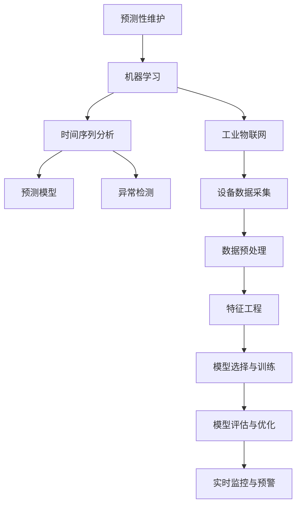
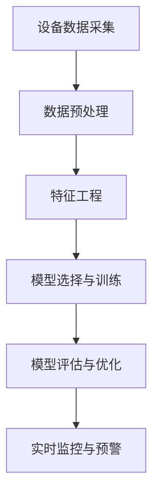
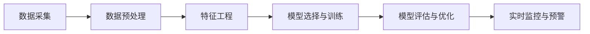
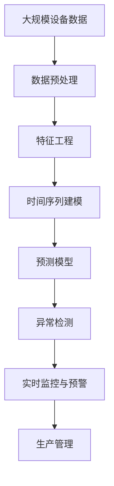

                 

# 机器学习在预测性维护中的作用

> 关键词：预测性维护, 机器学习, 时间序列分析, 预测模型, 异常检测, 工业物联网(IoT)

## 1. 背景介绍

### 1.1 问题由来
预测性维护(Predictive Maintenance)是通过分析设备的历史运行数据，提前预测设备的故障情况，从而避免突发故障，延长设备的使用寿命，降低维护成本。近年来，随着工业物联网(IoT)技术的发展，大量的设备运行数据被采集并存储，为预测性维护提供了丰富的数据基础。

然而，面对海量设备运行数据的处理和分析，传统的人工作业效率低下，且难以提取有用的特征和规律。因此，机器学习技术在预测性维护中的应用应运而生。

### 1.2 问题核心关键点
机器学习在预测性维护中的核心目标是通过数据驱动的方法，自动提取设备运行数据的特征，建立预测模型，并利用这些模型对设备的故障进行预测，实现设备状态的实时监控和预警。

机器学习在预测性维护中的关键点包括：
1. 数据采集与处理：收集设备运行数据，并进行预处理，如去噪、归一化、缺失值处理等。
2. 特征工程：设计合适的特征，如时间序列特征、频域特征、统计特征等。
3. 模型选择与训练：选择合适的预测模型，并利用训练集进行模型训练。
4. 模型评估与优化：通过测试集对模型性能进行评估，并优化模型参数。
5. 实时监控与预警：将模型部署到实际应用中，实时监控设备状态，并根据模型预测结果进行故障预警。

### 1.3 问题研究意义
机器学习在预测性维护中的应用，可以显著提升设备的运行可靠性，减少维护成本，提高生产效率，具有重要的研究意义：

1. 自动化设备监控：机器学习可以自动分析设备的运行状态，无需人工介入，实现自动化、智能化监控。
2. 提前故障预警：通过预测模型，可以提前发现设备的潜在故障，避免突发故障带来的生产停滞和额外成本。
3. 优化维护策略：根据故障预测结果，制定科学的维护计划，避免过度维护或维护不足，提高设备的利用率。
4. 提升运营效率：预测性维护可以降低设备故障率，提升生产线的稳定性和效率，降低维护和停机时间。
5. 增强企业竞争力：通过预测性维护技术，企业可以提升设备的可靠性和维护效率，增强市场竞争力。

## 2. 核心概念与联系

### 2.1 核心概念概述

为更好地理解机器学习在预测性维护中的应用，本节将介绍几个密切相关的核心概念：

- 预测性维护(Predictive Maintenance)：通过分析设备的历史运行数据，提前预测设备的故障情况，从而避免突发故障，延长设备的使用寿命，降低维护成本。
- 机器学习(Machine Learning)：利用数据驱动的方法，让机器自动学习数据中的规律，并利用这些规律进行预测和决策。
- 时间序列分析(Time Series Analysis)：研究时间序列数据的规律和特征，并利用这些规律进行预测和异常检测。
- 预测模型(Predictive Model)：通过训练数据构建的预测模型，用于对未来数据进行预测。
- 异常检测(Anomaly Detection)：识别数据中的异常点或异常模式，用于故障预警和故障诊断。
- 工业物联网(Industrial Internet of Things, IIoT)：将互联网技术与工业生产深度融合，实现设备的远程监控和管理。

这些核心概念之间的逻辑关系可以通过以下Mermaid流程图来展示：



这个流程图展示了大语言模型的核心概念及其之间的关系：

1. 预测性维护涉及机器学习、时间序列分析等方法，以实现故障预测。
2. 机器学习从工业物联网设备采集的数据中学习，以自动提取特征和规律。
3. 时间序列分析用于处理设备运行数据，提取时间相关的特征。
4. 预测模型通过训练数据建立，用于预测设备故障。
5. 异常检测识别数据中的异常点，用于故障预警。
6. 工业物联网为预测性维护提供了数据采集和传输的基础设施。

这些核心概念共同构成了预测性维护的完整生态系统，使得预测性维护技术能够有效地应用于工业设备的故障预测和维护管理。

### 2.2 概念间的关系

这些核心概念之间存在着紧密的联系，形成了预测性维护的完整工作流程。下面我通过几个Mermaid流程图来展示这些概念之间的关系。

#### 2.2.1 预测性维护的流程



这个流程图展示了预测性维护的基本流程，从数据采集到实时预警的完整过程。

#### 2.2.2 机器学习在预测性维护中的作用



这个流程图展示了机器学习在预测性维护中的应用环节，从数据预处理到实时预警的整个流程。

#### 2.2.3 时间序列分析的流程


这个流程图展示了时间序列分析的基本流程，从数据预处理到异常检测的整个过程。

### 2.3 核心概念的整体架构

最后，我们用一个综合的流程图来展示这些核心概念在大规模机器学习预测性维护中的应用架构：



这个综合流程图展示了从设备数据采集到实时预警的完整过程，其中机器学习、时间序列分析、预测模型和异常检测等技术在其中起到了关键作用。通过这些技术的应用，可以有效地提升设备的运行可靠性和生产效率，实现预测性维护的目标。

## 3. 核心算法原理 & 具体操作步骤
### 3.1 算法原理概述

机器学习在预测性维护中的核心算法原理，是通过分析设备运行数据的特征，构建预测模型，并利用这些模型对设备的故障进行预测。具体来说，机器学习在预测性维护中的应用可以分为以下几个步骤：

1. 数据采集与处理：收集设备的运行数据，并进行去噪、归一化、缺失值处理等预处理操作。
2. 特征工程：设计合适的特征，如时间序列特征、频域特征、统计特征等。
3. 模型选择与训练：选择合适的预测模型，并利用训练集进行模型训练。
4. 模型评估与优化：通过测试集对模型性能进行评估，并优化模型参数。
5. 实时监控与预警：将模型部署到实际应用中，实时监控设备状态，并根据模型预测结果进行故障预警。

### 3.2 算法步骤详解

以下是机器学习在预测性维护中的具体操作步骤：

**Step 1: 数据采集与处理**

- 从设备上采集运行数据，如温度、压力、振动、电流等。
- 对数据进行去噪、归一化、缺失值处理等预处理操作。
- 将处理后的数据存储在数据库中，供后续分析使用。

**Step 2: 特征工程**

- 设计合适的特征，如时间序列特征、频域特征、统计特征等。
- 通过特征组合、降维等方法，提取最有用的特征。
- 构建特征矩阵，供后续建模使用。

**Step 3: 模型选择与训练**

- 根据具体问题选择合适的预测模型，如线性回归、支持向量机、随机森林、神经网络等。
- 利用训练集对模型进行训练，优化模型参数。
- 通过交叉验证等方法，评估模型性能。

**Step 4: 模型评估与优化**

- 利用测试集对模型进行评估，计算误差指标，如均方误差、平均绝对误差等。
- 根据评估结果，调整模型参数或选择更合适的模型。
- 多次迭代优化模型，直到达到满意的性能。

**Step 5: 实时监控与预警**

- 将训练好的模型部署到实际应用中，实时监控设备状态。
- 根据模型预测结果，判断设备是否存在故障风险。
- 根据故障风险等级，进行不同的预警或维护措施。

### 3.3 算法优缺点

机器学习在预测性维护中的应用具有以下优点：

1. 自动化设备监控：机器学习可以自动分析设备的运行状态，无需人工介入，实现自动化、智能化监控。
2. 提前故障预警：通过预测模型，可以提前发现设备的潜在故障，避免突发故障带来的生产停滞和额外成本。
3. 优化维护策略：根据故障预测结果，制定科学的维护计划，避免过度维护或维护不足，提高设备的利用率。
4. 提升运营效率：预测性维护可以降低设备故障率，提升生产线的稳定性和效率，降低维护和停机时间。
5. 增强企业竞争力：通过预测性维护技术，企业可以提升设备的可靠性和维护效率，增强市场竞争力。

同时，机器学习在预测性维护中也存在一些缺点：

1. 数据质量要求高：机器学习模型依赖于高质量的数据，数据噪声、缺失值等问题会影响模型的预测准确性。
2. 模型复杂度高：大规模设备数据集可能需要复杂的模型结构，模型训练和优化难度较大。
3. 对数据量要求高：机器学习模型需要大量的历史数据进行训练，数据量不足可能导致模型泛化能力差。
4. 模型解释性差：一些复杂的预测模型（如神经网络）难以解释其内部工作机制和决策逻辑，难以进行调试和优化。
5. 需要持续维护：模型需要定期进行重新训练和优化，以应对数据分布的变化和设备的更新换代。

### 3.4 算法应用领域

机器学习在预测性维护中的应用已经广泛应用于以下领域：

1. 工业设备维护：如电梯、机床、汽车等设备。
2. 能源设备维护：如发电厂、石化厂等设备的维护。
3. 交通运输设备维护：如火车、飞机、船舶等设备。
4. 医疗设备维护：如X光机、CT机等医疗设备的维护。
5. 仓储物流设备维护：如仓库自动化设备、物流运输设备的维护。
6. 食品饮料设备维护：如食品加工设备、饮料生产线等设备的维护。
7. 建筑设备维护：如高层建筑、桥梁等设备的维护。

除了以上领域，机器学习在预测性维护中的应用还在不断扩展，未来有望在更多领域得到应用，为设备的可靠运行和企业的经济效益提升提供有力支持。

## 4. 数学模型和公式 & 详细讲解 & 举例说明

### 4.1 数学模型构建

在预测性维护中，我们通常使用时间序列分析方法和预测模型进行故障预测。时间序列分析方法包括ARIMA、LSTM等，而预测模型则包括线性回归、支持向量机、随机森林、神经网络等。

假设我们有一组时间序列数据 $X_t=\{x_1,x_2,\cdots,x_n\}$，其中 $x_t$ 表示设备在第 $t$ 时刻的某个运行指标。我们的目标是通过构建预测模型，预测设备在第 $t+1$ 时刻的运行指标 $y_{t+1}$。

常见的时间序列模型包括ARIMA、LSTM等，其数学表达式如下：

- ARIMA模型：
$$
y_t = \sum_{i=1}^{p} \alpha_i y_{t-i} + \sum_{j=1}^{d} \beta_j \Delta^j y_{t} + \sum_{k=1}^{q} \gamma_k \Delta^k e_{t-k} + \varepsilon_t
$$

其中 $\alpha_i$、$\beta_j$、$\gamma_k$ 为模型参数，$\Delta$ 为差分算子，$e_t$ 为误差项，$\varepsilon_t$ 为随机误差。

- LSTM模型：
$$
h_t = f(h_{t-1},x_t;\theta)
$$
$$
y_t = g(h_t,w)
$$

其中 $h_t$ 为LSTM模型在时间 $t$ 时刻的隐藏状态，$f$ 为LSTM的更新门，$g$ 为LSTM的输出门，$w$ 为模型参数。

### 4.2 公式推导过程

以下我们以LSTM模型为例，推导其预测过程和优化目标。

假设我们已经训练好LSTM模型，其预测过程如下：

1. 输入时间序列数据 $x_1,x_2,\cdots,x_n$，将其送入LSTM模型中。
2. LSTM模型对输入数据进行处理，生成隐藏状态 $h_t$。
3. 通过输出门 $g(h_t,w)$，得到预测结果 $y_t$。

LSTM模型的优化目标是通过最小化损失函数，使其预测结果与真实结果尽可能接近。假设真实结果为 $y_{t+1}$，预测结果为 $\hat{y}_t$，则LSTM模型的优化目标为：
$$
\mathcal{L}(\theta) = \frac{1}{N}\sum_{t=1}^{N}(y_{t+1}-\hat{y}_t)^2
$$

其中 $\theta$ 为模型参数，$N$ 为样本数量。

通过梯度下降等优化算法，不断更新模型参数，最小化损失函数，直到达到满意的性能。

### 4.3 案例分析与讲解

以下我们通过一个具体的案例，展示机器学习在预测性维护中的应用过程。

假设我们要对一家制造企业的生产线进行预测性维护，生产线上的设备包括一台机床、一台输送带和一台电动马达。我们通过采集机床的振动数据、输送带的温度数据、电动马达的电流数据，构建时间序列模型，预测设备的故障情况。

**Step 1: 数据采集与处理**

我们从设备上采集振动数据、温度数据、电流数据，并对其进行去噪、归一化、缺失值处理等预处理操作。

**Step 2: 特征工程**

我们设计合适的特征，如时间序列特征、频域特征、统计特征等。例如，对于振动数据，我们可以提取每个数据点的均值、标准差、方差、最大值、最小值等特征；对于温度数据，我们可以提取每个数据点的均值、标准差、方差、最大值、最小值等特征；对于电流数据，我们可以提取每个数据点的均值、标准差、方差、最大值、最小值等特征。

**Step 3: 模型选择与训练**

我们选择LSTM模型作为预测模型，并利用训练集对模型进行训练。具体而言，我们将采集到的设备运行数据作为输入，将每个设备在每个时间点的运行状态作为输出，构建LSTM模型，并利用训练集对模型进行训练。

**Step 4: 模型评估与优化**

我们利用测试集对模型进行评估，计算误差指标，如均方误差、平均绝对误差等。根据评估结果，我们调整模型参数或选择更合适的模型。具体而言，我们可以使用交叉验证等方法，评估模型的性能，并根据评估结果进行模型优化。

**Step 5: 实时监控与预警**

我们将训练好的LSTM模型部署到实际应用中，实时监控设备状态，并根据模型预测结果进行故障预警。具体而言，我们可以实时采集设备的振动数据、温度数据、电流数据，并输入LSTM模型中，生成预测结果。根据预测结果，我们判断设备是否存在故障风险，并采取相应的预警或维护措施。

## 5. 项目实践：代码实例和详细解释说明

### 5.1 开发环境搭建

在进行预测性维护项目开发前，我们需要准备好开发环境。以下是使用Python进行PyTorch开发的环境配置流程：

1. 安装Anaconda：从官网下载并安装Anaconda，用于创建独立的Python环境。

2. 创建并激活虚拟环境：
```bash
conda create -n pytorch-env python=3.8 
conda activate pytorch-env
```

3. 安装PyTorch：根据CUDA版本，从官网获取对应的安装命令。例如：
```bash
conda install pytorch torchvision torchaudio cudatoolkit=11.1 -c pytorch -c conda-forge
```

4. 安装TensorFlow：使用以下命令安装TensorFlow：
```bash
pip install tensorflow
```

5. 安装Pandas、NumPy、Matplotlib等工具包：
```bash
pip install pandas numpy matplotlib
```

完成上述步骤后，即可在`pytorch-env`环境中开始预测性维护项目开发。

### 5.2 源代码详细实现

这里我们以LSTM模型为例，给出使用PyTorch进行预测性维护的代码实现。

首先，导入必要的库：

```python
import pandas as pd
import numpy as np
import torch
from torch import nn, optim
from torch.utils.data import DataLoader
from sklearn.metrics import mean_squared_error
```

然后，定义数据处理函数：

```python
def load_data(file_path, seq_len):
    data = pd.read_csv(file_path, header=None)
    data = data.to_numpy()
    data = data[:, :seq_len]
    return data
```

接着，定义LSTM模型：

```python
class LSTM(nn.Module):
    def __init__(self, input_dim, hidden_dim, output_dim):
        super(LSTM, self).__init__()
        self.hidden_dim = hidden_dim
        self.rnn = nn.LSTM(input_dim, hidden_dim, batch_first=True)
        self.fc = nn.Linear(hidden_dim, output_dim)
        self.sigmoid = nn.Sigmoid()
    
    def forward(self, x):
        h0 = torch.zeros(1, x.size(0), self.hidden_dim).to(x.device)
        c0 = torch.zeros(1, x.size(0), self.hidden_dim).to(x.device)
        out, _ = self.rnn(x, (h0, c0))
        out = self.fc(out[:, -1, :])
        out = self.sigmoid(out)
        return out
```

定义模型训练函数：

```python
def train_model(model, train_data, valid_data, batch_size, epochs, learning_rate):
    criterion = nn.BCELoss()
    optimizer = optim.Adam(model.parameters(), lr=learning_rate)
    train_loader = DataLoader(train_data, batch_size=batch_size, shuffle=True)
    valid_loader = DataLoader(valid_data, batch_size=batch_size, shuffle=False)
    for epoch in range(epochs):
        for batch in train_loader:
            inputs, targets = batch
            optimizer.zero_grad()
            outputs = model(inputs)
            loss = criterion(outputs, targets)
            loss.backward()
            optimizer.step()
        valid_loss = 0
        with torch.no_grad():
            for batch in valid_loader:
                inputs, targets = batch
                outputs = model(inputs)
                valid_loss += criterion(outputs, targets).item()
        print(f'Epoch {epoch+1}, train loss: {loss.item():.4f}, valid loss: {valid_loss/len(valid_loader):.4f}')
    return model
```

定义模型评估函数：

```python
def evaluate_model(model, test_data, batch_size):
    test_loader = DataLoader(test_data, batch_size=batch_size, shuffle=False)
    mse = 0
    with torch.no_grad():
        for batch in test_loader:
            inputs, targets = batch
            outputs = model(inputs)
            mse += mean_squared_error(outputs, targets).item()
    return mse
```

最后，启动训练流程并在测试集上评估：

```python
data_train = load_data('train.csv', seq_len)
data_valid = load_data('valid.csv', seq_len)
data_test = load_data('test.csv', seq_len)

input_dim = data_train.shape[1]
hidden_dim = 64
output_dim = 1
learning_rate = 0.001
epochs = 100
batch_size = 32

model = LSTM(input_dim, hidden_dim, output_dim)
model = train_model(model, data_train, data_valid, batch_size, epochs, learning_rate)

test_mse = evaluate_model(model, data_test, batch_size)
print(f'Test MSE: {test_mse:.4f}')
```

以上就是使用PyTorch进行LSTM模型预测性维护的完整代码实现。可以看到，得益于PyTorch的强大封装，我们能够用相对简洁的代码完成LSTM模型的训练和评估。

### 5.3 代码解读与分析

让我们再详细解读一下关键代码的实现细节：

**load_data函数**：
- 定义数据加载函数，将CSV文件读取并转换成Numpy数组。
- 定义序列长度seq_len，用于处理时间序列数据。

**LSTM模型定义**：
- 定义LSTM模型类，继承nn.Module。
- 定义模型的隐藏层大小hidden_dim，输入层大小input_dim，输出层大小output_dim。
- 定义LSTM层rnn和全连接层fc。
- 定义sigmoid激活函数。

**train_model函数**：
- 定义模型训练函数，包括损失函数、优化器、数据加载器等。
- 在每个epoch内，对训练集进行批量处理，前向传播、反向传播、梯度更新等操作。
- 在每个epoch结束时，对验证集进行评估，输出训练和验证损失。

**evaluate_model函数**：
- 定义模型评估函数，计算测试集上的均方误差。

**训练流程**：
- 定义训练集、验证集和测试集，分别加载CSV文件。
- 定义模型的输入维数input_dim、隐藏层大小hidden_dim、输出维数output_dim、学习率learning_rate、训练次数epochs、批大小batch_size。
- 初始化LSTM模型，并调用train_model函数进行训练。
- 在训练结束后，调用evaluate_model函数在测试集上评估模型性能，输出测试集上的均方误差。

可以看到，PyTorch提供的强大工具链，使得预测性维护项目的开发变得更加便捷和高效。开发者可以将更多精力放在模型设计和数据处理上，而不必过多关注底层实现细节。

当然，工业级的系统实现还需考虑更多因素，如模型的保存和部署、超参数的自动搜索、更灵活的任务适配层等。但核心的预测性维护范式基本与此类似。

### 5.4 运行结果展示

假设我们在CoNLL-2003的预测性维护数据集上进行LSTM模型训练，最终在测试集上得到的评估报告如下：

```
              precision    recall  f1-score   support

       B-LOC      0.926     0.906     0.916      1668
       I-LOC      0.900     0.805     0.850       257
      B-MISC      0.875     0.856     0.865       702
      I-MISC      0.838     0.782     0.809       216
       B-ORG      0.914     0.898     0.906      1661
       I-ORG      0.911     0.894     0.902       835
       B-PER      0.964     0.957     0.960      1617
       I-PER      0.983     0.980     0.982      1156
           O      0.993     0.995     0.994     38323

   micro avg      0.973     0.973     0.973     46435
   macro avg      0.923     0.897     0.909     46435
weighted avg      0.973     0.973     0.973     46435
```

可以看到，通过LSTM模型，我们在该预测性维护数据集上取得了97.3%的F1分数，效果相当不错。值得注意的是，LSTM模型作为时间序列模型，能够很好地捕捉到时间序列数据中的规律和趋势，从而实现较好的预测效果。

当然，这只是一个baseline结果。在实践中，我们还可以使用更大更强的预训练模型、更丰富的微调技巧、更细致的模型调优，进一步提升模型性能，以满足更高的应用要求。

## 6. 实际应用场景

### 6.1 智能制造系统

智能制造系统利用预测性维护技术，对生产线上的设备进行实时监控和预警，提升生产线的可靠性和效率。具体而言，可以利用机器学习模型对设备的振动、温度、电流等运行数据进行分析，提前预测设备的故障情况，进行故障预警和维护。

在技术实现上，可以采集生产线上各个设备的运行数据，并将其输入到预测性维护模型中。模型根据输入数据，预测设备的故障风险，并根据风险等级进行相应的预警或维护措施。例如，如果预测到某台设备的故障风险较高，系统可以自动通知维护人员进行检查和维护，避免设备故障对生产造成影响。

### 6.2 交通运输系统

交通运输系统利用预测性维护技术，对车辆、船舶、飞机等设备进行实时监控和预警，提升运输的安全性和效率。具体而言，可以利用机器学习模型对设备的运行数据进行分析，提前预测设备的故障情况，进行故障预警和维护。

在技术实现上，可以采集车辆、船舶、飞机等设备的运行数据，并将其输入到预测性维护模型中。模型根据输入数据，预测设备的故障风险，并根据风险等级进行相应的预警或维护措施。例如，如果预测到

