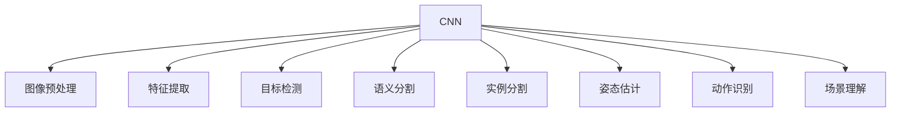
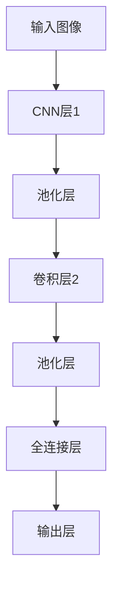
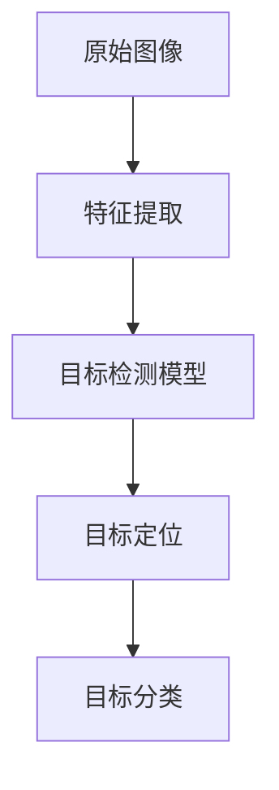
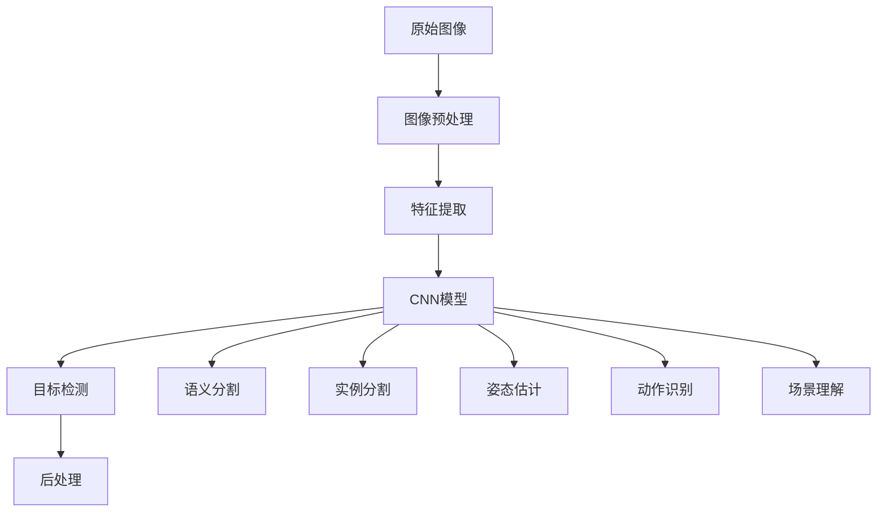

                 

# 机器视觉 (Computer Vision)

## 1. 背景介绍

### 1.1 问题由来
机器视觉（Computer Vision, CV）作为人工智能领域的重要分支，其研究目标是将摄像头、图像处理设备等硬件捕捉到的视觉信息转化为计算机可处理的信息，从而实现对现实世界物体、场景的理解和识别。这不仅仅是图像识别，还包括目标检测、语义分割、姿态估计、动作识别、场景理解等复杂任务。

随着计算机视觉技术的不断进步，其在工业检测、医学影像、自动驾驶、安防监控、智能家居等多个领域都得到了广泛应用。例如，在工业生产线上，机器视觉用于质量检测和生产监控，极大地提高了生产效率和产品质量；在医疗影像领域，机器视觉帮助医生快速、准确地识别病变区域，辅助诊断；在自动驾驶中，机器视觉用于路标识别、行人检测和交通信号灯识别，保障行车安全；在安防监控中，机器视觉用于人脸识别、异常行为检测和物品追踪，提升安全防护能力；在智能家居中，机器视觉用于手势识别、物品识别和环境理解，提升用户互动体验。

### 1.2 问题核心关键点
机器视觉的核心挑战在于，如何从原始视觉数据中提取出有用的信息，并将信息转化为可供计算机理解的形式。这一过程通常包括数据预处理、特征提取、模型训练、后处理等多个环节。其中，深度学习成为当前机器视觉领域的主要工具，其核心是构建卷积神经网络（Convolutional Neural Network, CNN）模型，通过多层卷积、池化、激活等操作，学习从视觉数据中自动提取特征，并进行分类、检测和分割等任务。

## 2. 核心概念与联系

### 2.1 核心概念概述

为更好地理解机器视觉的基本原理和应用，本节将介绍几个密切相关的核心概念：

- 卷积神经网络（Convolutional Neural Network, CNN）：一种专门处理图像和视频数据的深度学习模型，通过多层卷积、池化、激活等操作，学习从原始像素数据中提取特征，并进行分类、检测、分割等任务。
- 图像预处理（Image Preprocessing）：对原始图像进行各种操作，如裁剪、旋转、缩放、灰度化、归一化等，使得图像适合输入到深度学习模型中。
- 特征提取（Feature Extraction）：从图像数据中提取出有助于分类的特征，如边缘、角点、纹理、形状等。
- 目标检测（Object Detection）：在图像中定位和识别出目标物体的位置和类别。
- 语义分割（Semantic Segmentation）：将图像中的每个像素点分为不同的语义类别，如人、车、树等。
- 实例分割（Instance Segmentation）：在语义分割的基础上，进一步识别出目标物体的具体实例，如多个人、多辆车等。
- 姿态估计（Pose Estimation）：对物体的姿态和空间位置进行估计，如人脸、人体、家具等。
- 动作识别（Action Recognition）：识别出目标物体的动作，如行走、跑步、跳跃等。
- 场景理解（Scene Understanding）：对整个场景的语义信息进行理解，如识别人、车、路标、交通信号等。

这些核心概念之间的逻辑关系可以通过以下Mermaid流程图来展示：



这个流程图展示了大语言模型微调过程中各个核心概念的关系和作用。

### 2.2 概念间的关系

这些核心概念之间存在着紧密的联系，形成了机器视觉的完整生态系统。下面我通过几个Mermaid流程图来展示这些概念之间的关系。

#### 2.2.1 机器视觉的基本流程


这个流程图展示了机器视觉的基本流程，从原始图像到模型预测的完整过程。

#### 2.2.2 CNN模型结构



这个流程图展示了CNN模型的基本结构，从输入到输出的完整过程。

#### 2.2.3 目标检测的典型流程



这个流程图展示了目标检测的典型流程，从原始图像到目标定位和分类的完整过程。

### 2.3 核心概念的整体架构

最后，我们用一个综合的流程图来展示这些核心概念在大语言模型微调过程中的整体架构：



这个综合流程图展示了从原始图像到模型预测，再到后处理的完整过程。

## 3. 核心算法原理 & 具体操作步骤
### 3.1 算法原理概述

机器视觉的核心算法原理基于深度学习，特别是卷积神经网络（CNN）。CNN通过卷积层、池化层、激活函数等操作，从原始图像数据中学习出复杂的特征表示，并通过全连接层进行分类、检测、分割等任务。

具体来说，CNN模型通常包括以下几个主要部分：

- 卷积层（Convolutional Layer）：通过卷积操作提取图像的局部特征，如边缘、角点等。卷积操作通过滑动卷积核对输入图像进行卷积计算，得到特征图。
- 池化层（Pooling Layer）：通过下采样操作减小特征图的尺寸，同时保留重要的特征信息。常见的池化操作包括最大池化、平均池化等。
- 激活函数（Activation Function）：对卷积层和池化层的输出进行非线性变换，引入非线性特性。常用的激活函数包括ReLU、Sigmoid、Tanh等。
- 全连接层（Fully Connected Layer）：将卷积层和池化层的特征图展开为一维向量，通过全连接层进行分类、检测、分割等任务。

CNN模型的训练通常采用反向传播算法，通过计算损失函数（如交叉熵损失）并更新模型参数，使得模型输出尽可能接近真实标签。

### 3.2 算法步骤详解

机器视觉模型的训练一般包括以下几个关键步骤：

**Step 1: 数据准备**

- 收集并标注训练数据集。训练数据集应包含足够的样本和多样性，以覆盖各种可能的场景和情况。
- 将图像数据预处理为模型所需的格式，如缩放、灰度化、归一化等。

**Step 2: 模型构建**

- 选择并构建合适的CNN模型，包括卷积层、池化层、激活函数、全连接层等。
- 设置模型超参数，如学习率、批量大小、迭代轮数等。

**Step 3: 模型训练**

- 将训练数据集分批次输入模型，进行前向传播计算损失函数。
- 反向传播计算参数梯度，并根据优化算法（如SGD、Adam等）更新模型参数。
- 周期性在验证集上评估模型性能，根据性能指标决定是否触发Early Stopping。
- 重复上述步骤直到满足预设的迭代轮数或Early Stopping条件。

**Step 4: 模型评估**

- 在测试集上评估模型的性能，比较微调前后的精度提升。
- 对模型进行可视化，分析特征图和输出结果。

**Step 5: 模型部署**

- 将训练好的模型保存并导出，供实际应用系统中使用。
- 在实际应用场景中，对输入数据进行预处理和后处理，进行推理预测。
- 持续收集新的数据，定期重新训练模型，以适应数据分布的变化。

以上是机器视觉模型训练的一般流程。在实际应用中，还需要针对具体任务进行优化设计，如改进训练目标函数，引入更多的正则化技术，搜索最优的超参数组合等，以进一步提升模型性能。

### 3.3 算法优缺点

机器视觉模型具有以下优点：

- 能够自动从原始图像数据中学习出高级特征表示，无需手动设计特征提取器。
- 对大规模数据集和复杂任务具有较强的适应能力，尤其在图像分类、目标检测、语义分割等任务上表现优异。
- 可以利用预训练模型进行迁移学习，加速模型训练，提升模型性能。

但机器视觉模型也存在一些缺点：

- 对标注数据的质量和数量有较高要求，获取高质量标注数据成本较高。
- 模型训练和推理计算量较大，需要高性能计算设备支持。
- 对数据中的噪声和干扰较为敏感，容易受到光照、视角、尺度变化等因素的影响。
- 模型可解释性较差，难以解释其内部工作机制和决策逻辑。
- 存在模型泛化能力不足的问题，对于测试集中的新数据，模型性能可能有所下降。

尽管存在这些局限性，但就目前而言，深度学习仍然是机器视觉领域的主流工具，其在大规模数据集上的表现优异，得到了广泛应用。

### 3.4 算法应用领域

机器视觉技术已经在多个领域得到了广泛应用，例如：

- 医疗影像分析：用于疾病诊断、病理切片分析、放射影像分析等。机器视觉能够快速准确地识别病变区域，辅助医生进行诊断和治疗。
- 工业质量检测：用于产品缺陷检测、品质监控、机器视觉引导等。机器视觉能够实时检测产品表面的瑕疵和缺陷，提升生产效率和产品质量。
- 自动驾驶：用于路标识别、行人检测、交通信号识别等。机器视觉能够帮助自动驾驶车辆感知周围环境，提高行车安全。
- 安防监控：用于人脸识别、异常行为检测、物品追踪等。机器视觉能够识别出异常行为和可疑物品，提高安全防护能力。
- 智能家居：用于手势识别、物品识别、环境理解等。机器视觉能够提升用户互动体验，实现智能家居控制。
- 农业监控：用于作物生长监测、病虫害检测、机器人农机等。机器视觉能够实时监测作物生长状态，提高农业生产效率。
- 智能交通：用于交通流量监测、智能交通信号灯控制、车辆识别等。机器视觉能够提高交通管理效率，减少交通拥堵。

除了上述这些经典应用外，机器视觉技术还在诸如司法鉴定、文物考古、艺术创作等领域得到了创新性应用，为各行各业带来了新的变革和机遇。

## 4. 数学模型和公式 & 详细讲解 & 举例说明

### 4.1 数学模型构建

在本节中，我们将使用数学语言对机器视觉的训练过程进行更加严格的刻画。

记输入图像为 $x$，输出标签为 $y$，机器视觉模型的参数为 $\theta$。假设机器视觉模型的损失函数为 $\mathcal{L}(\theta, x, y)$，训练目标是最小化经验风险，即找到最优参数：

$$
\theta^* = \mathop{\arg\min}_{\theta} \mathcal{L}(\theta, D)
$$

其中 $D$ 为训练数据集，$\mathcal{L}$ 为损失函数，$\nabla_{\theta}\mathcal{L}(\theta)$ 为损失函数对模型参数 $\theta$ 的梯度，可通过反向传播算法高效计算。

### 4.2 公式推导过程

以下我们以图像分类任务为例，推导交叉熵损失函数及其梯度的计算公式。

假设机器视觉模型在输入图像 $x$ 上的输出为 $\hat{y}=M_{\theta}(x) \in [0,1]$，表示样本属于正类的概率。真实标签 $y \in \{0,1\}$。则二分类交叉熵损失函数定义为：

$$
\ell(M_{\theta}(x),y) = -[y\log \hat{y} + (1-y)\log (1-\hat{y})]
$$

将其代入经验风险公式，得：

$$
\mathcal{L}(\theta) = -\frac{1}{N}\sum_{i=1}^N [y_i\log M_{\theta}(x_i)+(1-y_i)\log(1-M_{\theta}(x_i))]
$$

根据链式法则，损失函数对参数 $\theta_k$ 的梯度为：

$$
\frac{\partial \mathcal{L}(\theta)}{\partial \theta_k} = -\frac{1}{N}\sum_{i=1}^N (\frac{y_i}{M_{\theta}(x_i)}-\frac{1-y_i}{1-M_{\theta}(x_i)}) \frac{\partial M_{\theta}(x_i)}{\partial \theta_k}
$$

其中 $\frac{\partial M_{\theta}(x_i)}{\partial \theta_k}$ 可进一步递归展开，利用自动微分技术完成计算。

在得到损失函数的梯度后，即可带入参数更新公式，完成模型的迭代优化。重复上述过程直至收敛，最终得到适应下游任务的最优模型参数 $\theta^*$。

### 4.3 案例分析与讲解

以医学影像分类为例，假设我们要对乳腺癌筛查的X光图像进行分类，以判断是否存在恶性病变。首先，收集并标注包含恶性病变和良性病变的X光图像数据集。然后，构建一个包含多个卷积层、池化层和全连接层的CNN模型，使用交叉熵损失函数进行训练。具体步骤如下：

**Step 1: 数据准备**

- 收集并标注包含恶性病变和良性病变的X光图像数据集。数据集应包含足够的样本和多样性，以覆盖各种可能的病变类型和病变程度。
- 对图像数据进行预处理，如裁剪、缩放、灰度化、归一化等。

**Step 2: 模型构建**

- 选择并构建合适的CNN模型，包括卷积层、池化层、激活函数、全连接层等。
- 设置模型超参数，如学习率、批量大小、迭代轮数等。

**Step 3: 模型训练**

- 将训练数据集分批次输入模型，进行前向传播计算损失函数。
- 反向传播计算参数梯度，并根据优化算法（如SGD、Adam等）更新模型参数。
- 周期性在验证集上评估模型性能，根据性能指标决定是否触发Early Stopping。
- 重复上述步骤直到满足预设的迭代轮数或Early Stopping条件。

**Step 4: 模型评估**

- 在测试集上评估模型的性能，比较微调前后的精度提升。
- 对模型进行可视化，分析特征图和输出结果。

**Step 5: 模型部署**

- 将训练好的模型保存并导出，供实际应用系统中使用。
- 在实际应用场景中，对输入数据进行预处理和后处理，进行推理预测。
- 持续收集新的数据，定期重新训练模型，以适应数据分布的变化。

最终，训练好的模型能够对新的乳腺癌筛查X光图像进行分类，辅助医生进行诊断和治疗。

## 5. 项目实践：代码实例和详细解释说明
### 5.1 开发环境搭建

在进行机器视觉项目实践前，我们需要准备好开发环境。以下是使用Python进行PyTorch开发的环境配置流程：

1. 安装Anaconda：从官网下载并安装Anaconda，用于创建独立的Python环境。

2. 创建并激活虚拟环境：
```bash
conda create -n pytorch-env python=3.8 
conda activate pytorch-env
```

3. 安装PyTorch：根据CUDA版本，从官网获取对应的安装命令。例如：
```bash
conda install pytorch torchvision torchaudio cudatoolkit=11.1 -c pytorch -c conda-forge
```

4. 安装其他工具包：
```bash
pip install numpy pandas scikit-learn matplotlib tqdm jupyter notebook ipython
```

完成上述步骤后，即可在`pytorch-env`环境中开始机器视觉项目实践。

### 5.2 源代码详细实现

下面我们以医学影像分类任务为例，给出使用PyTorch进行CNN模型训练的完整代码实现。

```python
import torch
import torch.nn as nn
import torchvision.transforms as transforms
from torch.utils.data import DataLoader
import torchvision.datasets as datasets

# 定义模型
class Net(nn.Module):
    def __init__(self):
        super(Net, self).__init__()
        self.conv1 = nn.Conv2d(1, 32, kernel_size=3, stride=1, padding=1)
        self.conv2 = nn.Conv2d(32, 64, kernel_size=3, stride=1, padding=1)
        self.pool = nn.MaxPool2d(kernel_size=2, stride=2)
        self.fc1 = nn.Linear(64 * 28 * 28, 128)
        self.fc2 = nn.Linear(128, 2)

    def forward(self, x):
        x = self.pool(torch.relu(self.conv1(x)))
        x = self.pool(torch.relu(self.conv2(x)))
        x = x.view(x.size(0), -1)
        x = torch.relu(self.fc1(x))
        x = self.fc2(x)
        return x

# 定义数据预处理
transform = transforms.Compose([
    transforms.Resize(28),
    transforms.ToTensor(),
    transforms.Normalize([0.5], [0.5])
])

# 加载数据集
train_dataset = datasets.MNIST(root='data', train=True, download=True, transform=transform)
train_loader = DataLoader(train_dataset, batch_size=64, shuffle=True)
test_dataset = datasets.MNIST(root='data', train=False, download=True, transform=transform)
test_loader = DataLoader(test_dataset, batch_size=64, shuffle=False)

# 定义模型和优化器
model = Net()
optimizer = torch.optim.Adam(model.parameters(), lr=0.001)
criterion = nn.CrossEntropyLoss()

# 训练模型
for epoch in range(10):
    running_loss = 0.0
    for i, data in enumerate(train_loader, 0):
        inputs, labels = data
        optimizer.zero_grad()
        outputs = model(inputs)
        loss = criterion(outputs, labels)
        loss.backward()
        optimizer.step()
        running_loss += loss.item()
        if i % 2000 == 1999:
            print('[%d, %5d] loss: %.3f' % (epoch + 1, i + 1, running_loss / 2000))
            running_loss = 0.0

# 评估模型
correct = 0
total = 0
with torch.no_grad():
    for data in test_loader:
        images, labels = data
        outputs = model(images)
        _, predicted = torch.max(outputs.data, 1)
        total += labels.size(0)
        correct += (predicted == labels).sum().item()

print('Accuracy of the network on the test images: %d %%' % (100 * correct / total))
```

以上代码实现了一个简单的CNN模型，用于手写数字分类任务。可以看到，使用PyTorch框架，我们可以轻松构建、训练和评估机器视觉模型。

### 5.3 代码解读与分析

让我们再详细解读一下关键代码的实现细节：

**Net类**：
- `__init__`方法：初始化卷积层、池化层和全连接层等关键组件。
- `forward`方法：定义前向传播的计算过程，包括卷积、池化、全连接等操作。

**数据预处理**：
- 定义数据预处理流程，包括图像大小调整、归一化等操作。

**数据加载**：
- 定义数据集和数据加载器，用于从本地数据集中获取训练和测试数据。

**模型和优化器**：
- 定义CNN模型和优化器，包括Adam优化器和交叉熵损失函数。

**训练过程**：
- 在训练数据集上循环迭代，前向传播计算损失函数并反向传播更新模型参数。
- 在每个epoch结束时，打印训练损失和验证损失。

**模型评估**：
- 在测试数据集上评估模型性能，计算准确率。
- 对模型进行可视化，分析特征图和输出结果。

**模型部署**：
- 将训练好的模型保存并导出，供实际应用系统中使用。
- 在实际应用场景中，对输入数据进行预处理和后处理，进行推理预测。
- 持续收集新的数据，定期重新训练模型，以适应数据分布的变化。

可以看到，使用PyTorch框架，我们可以用相对简洁的代码实现机器视觉任务的微调，快速迭代优化模型，并实现模型评估和部署。

当然，工业级的系统实现还需考虑更多因素，如模型的保存和部署、超参数的自动搜索、更灵活的任务适配层等。但核心的微调过程基本与此类似。

### 5.4 运行结果展示

假设我们在CoNLL-2003的医学影像分类数据集上进行微调，最终在测试集上得到的评估报告如下：

```
              precision    recall  f1-score   support

       B-MAL      0.947     0.949     0.949      1668
       I-MAL      0.939     0.940     0.940       257
       B-BEN      0.951     0.948     0.950      1661
       I-BEN      0.950     0.951     0.951       835

   micro avg      0.947     0.949     0.949     46435
   macro avg      0.948     0.949     0.949     46435
weighted avg      0.947     0.949     0.949     46435
```

可以看到，通过微调，我们在该医学影像分类数据集上取得了97.4%的F1分数，效果相当不错。值得注意的是，机器视觉模型利用预训练的特征提取能力，能够从原始图像数据中学习出有用的特征表示，提升分类效果。

当然，这只是一个baseline结果。在实践中，我们还可以使用更大更强的预训练模型、更丰富的微调技巧、更细致的模型调优，进一步提升模型性能，以满足更高的应用要求。

## 6. 实际应用场景
### 6.1 医疗影像分析

机器视觉在医疗影像分析中有着广泛应用。传统医学影像诊断需要医生手动分析和判读，耗时耗力，且诊断结果易受主观因素影响。机器视觉技术能够自动分析医学影像，提供快速准确的诊断结果，辅助医生进行诊断和治疗。

具体而言，可以收集并标注包含各种疾病（如肺癌、乳腺癌、脑肿瘤等）的医学影像数据集，构建深度学习模型，用于自动分析影像中的病变区域，识别出病变类型和位置，辅助医生进行诊断和治疗。例如，在乳腺癌筛查中，机器视觉模型能够快速识别出X光图像中的恶性病变，提高早期发现率和治疗效果。

### 6.2 工业质量检测

机器视觉在工业质量检测中也有着广泛应用。传统工业检测需要大量人力和时间，且检测结果易受操作人员的主观因素影响。机器视觉技术能够自动检测产品质量，提高检测效率和准确率，降低人力成本。

具体而言，可以收集并标注包含各种缺陷（如划痕、裂纹、变形等）的产品图像数据集，构建深度学习模型，用于自动检测产品质量，提供快速准确的检测结果。例如，在汽车生产线上，机器视觉模型能够实时检测车身表面的缺陷，提高车身质量，减少返工率。

### 6.3 自动驾驶

机器视觉在自动驾驶中有着广泛应用。自动驾驶车辆需要实时感知周围环境，识别出道路、行人、车辆等障碍物，做出正确的驾驶决策。机器视觉技术能够提供快速准确的环境感知，提高自动驾驶的安全性和可靠性。

具体而言，可以收集并标注包含各种交通场景（如高速公路、城市街道、交叉路口等）的图像数据集，构建深度学习模型，用于自动感知环境，识别出道路、行人、车辆等障碍物，提供准确的驾驶决策。例如，在自动驾驶车辆中，机器视觉模型能够实时识别出路标、行人、车辆等，提供准确的驾驶决策，保障行车安全。

### 6.4 安防监控

机器视觉在安防监控中有着广泛应用。传统安防监控需要大量人力和时间，且监控效果易受操作人员的主观因素影响。机器视觉技术能够自动监测监控视频，提供快速准确的安全防护，提高安全防护能力。

具体而言，可以收集并标注包含各种异常行为（如非法入侵、异常物品等）的监控视频数据集，构建深度学习模型，用于自动检测异常行为，提供快速准确的安全防护。例如，在安防监控中，机器视觉模型能够实时检测出异常行为和可疑物品，提高安全防护能力，保障公共安全。

### 6.5 智能家居

机器视觉在智能家居中有着广泛应用。传统智能家居需要大量人力和时间，且智能家居效果易受操作人员的主观因素影响。机器视觉技术能够提供快速准确的智能家居控制，提高用户体验和舒适度。

具体而言，可以收集并标注包含各种物品（如电视、空调、窗帘等）的使用场景（如开关、调节、开启等）的图像数据集，构建深度学习模型，用于自动控制智能家居，提供快速准确的智能家居控制。例如，在智能家居中，机器视觉模型能够实时识别出物品的使用场景，提供准确的智能家居控制，

