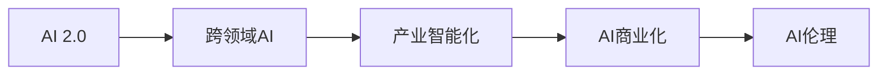

                 

## 1. 背景介绍

### 1.1 问题由来

当前，人工智能（AI）正经历从AI 1.0向AI 2.0的历史性跨越。在AI 1.0时代，AI主要被用于计算机视觉、语音识别、自然语言处理等单一领域的解决方案。而AI 2.0则标志着AI技术开始整合进各产业，形成广泛、深层次的智能化应用。

李开复作为AI领域的权威人士，一直在探索AI与产业深度融合的路径。他认为，AI 2.0时代下，AI技术将在众多产业中扮演核心驱动角色，促进产业升级，带来新的商业价值。但这一过程中，也面临着诸多挑战和复杂性，亟需明确产业融合的路径和策略。

### 1.2 问题核心关键点

李开复认为，AI 2.0时代的产业发展面临以下关键点：
1. **深度融合**：AI技术需与其他产业深度融合，形成跨领域的智能化应用。
2. **产业升级**：AI技术应推动产业升级，提高生产效率、优化供应链管理等。
3. **人才培养**：AI技术的发展需要大量高水平的人才支持。
4. **数据应用**：AI技术依赖于大数据分析，需要有效的数据管理和利用。
5. **伦理合规**：AI技术应用需遵循伦理规范，确保数据隐私和系统安全。
6. **政策支持**：政府需出台相关政策，支持AI技术的发展和应用。

### 1.3 问题研究意义

在AI 2.0时代，AI技术不仅在技术层面具备了深刻变革的能力，更在经济、社会、文化等各个层面展现出广泛的应用前景。其研究意义在于：
1. **经济增长**：AI技术能够大幅提高生产效率，驱动经济增长。
2. **社会变革**：AI技术的应用将改变人们的生活方式和工作方式，带来社会进步。
3. **技术突破**：AI技术的发展将推动人工智能和相关技术的创新。
4. **产业转型**：AI技术将促进传统产业转型升级，催生新兴产业。

## 2. 核心概念与联系

### 2.1 核心概念概述

要理解AI 2.0时代的产业发展，需先明确几个核心概念：

- **AI 2.0**：AI技术在各个产业中的深度融合与应用。
- **产业智能化**：将AI技术应用到产业中，提升生产效率和创新能力。
- **跨领域AI**：在多个领域同时应用AI技术，形成智能化的协同效应。
- **AI商业化**：AI技术转化为商业应用，实现商业价值。
- **AI伦理**：AI技术应用中的伦理问题，如隐私保护、数据安全等。

这些概念之间的联系主要体现在：AI 2.0通过跨领域AI和AI商业化，推动产业智能化，最终实现AI技术的广泛应用和商业价值的最大化。

### 2.2 概念间的关系

李开复通过一个Mermaid流程图，展示了这些核心概念之间的联系：



这个流程图展示了AI 2.0时代，AI技术在各个产业中深度融合的过程。跨领域AI是基础，产业智能化是目标，AI商业化是手段，AI伦理是保障。

## 3. 核心算法原理 & 具体操作步骤

### 3.1 算法原理概述

AI 2.0时代下的产业智能化，主要依赖于AI技术的深度应用和数据驱动的决策支持。其核心算法原理可以概括为以下几个方面：

- **数据驱动**：利用大数据分析和机器学习技术，提供精准的决策支持。
- **智能优化**：通过AI技术优化生产流程、供应链管理等，提升效率。
- **知识图谱**：构建产业知识图谱，实现知识的系统化管理。
- **预测分析**：利用时间序列分析、预测模型等技术，预测市场趋势和需求。

### 3.2 算法步骤详解

AI 2.0时代的产业智能化，通常包括以下几个关键步骤：

1. **数据采集与清洗**：收集产业相关的数据，并进行预处理和清洗，确保数据质量。
2. **数据存储与管理**：构建高效的数据存储和管理系统，支持大数据分析和实时处理。
3. **模型构建与训练**：选择合适的AI模型，在数据集上进行训练和优化，获得精准的预测和推荐模型。
4. **模型部署与集成**：将训练好的模型集成到实际应用中，形成智能化解决方案。
5. **效果评估与优化**：定期评估模型效果，根据反馈进行优化和迭代，提升性能。

### 3.3 算法优缺点

AI 2.0时代的产业智能化具有以下优点：
1. **高效性**：通过AI技术自动化处理数据和决策，大幅提升效率。
2. **精准性**：基于数据驱动的决策支持，准确度更高。
3. **灵活性**：AI技术可以灵活应用于多个场景，支持多样化需求。

同时，也存在一些缺点：
1. **数据依赖**：需要高质量、大量的数据支持，数据获取和处理成本高。
2. **技术复杂**：AI技术应用复杂，需要高水平的人才和资源支持。
3. **伦理风险**：AI技术应用中存在数据隐私和伦理风险，需特别注意。

### 3.4 算法应用领域

AI 2.0技术在多个领域有广泛应用，主要包括：

- **医疗健康**：利用AI进行疾病诊断、个性化治疗、患者监护等。
- **制造业**：通过AI优化生产流程、质量控制、供应链管理等。
- **金融服务**：利用AI进行风险评估、智能投顾、客户服务优化等。
- **零售电商**：通过AI进行客户画像分析、智能推荐、库存管理等。
- **交通物流**：利用AI进行智能调度、路线优化、异常检测等。
- **媒体娱乐**：利用AI进行内容推荐、智能编辑、用户行为分析等。

## 4. 数学模型和公式 & 详细讲解 & 举例说明

### 4.1 数学模型构建

在AI 2.0时代，常见的数学模型包括：

- **线性回归模型**：用于预测连续变量的线性关系。
- **逻辑回归模型**：用于分类问题的二分类或多分类。
- **决策树模型**：通过树状结构进行分类和回归。
- **支持向量机模型**：在高维空间中进行分类和回归。
- **深度神经网络模型**：用于处理复杂的非线性关系和大量数据。

### 4.2 公式推导过程

以线性回归模型为例，其公式推导过程如下：

假设样本数据集为 $(x_i, y_i)$，$i=1,2,...,N$，其中 $x_i$ 为输入特征向量，$y_i$ 为输出标签。线性回归模型的目标是最小化预测值与实际值之间的误差，即：

$$
\min_{\theta} \sum_{i=1}^N (y_i - \theta^T x_i)^2
$$

其中 $\theta$ 为模型参数，包含斜率 $b$ 和截距 $a$。通过梯度下降等优化算法，求解上述最优化问题，得到最优参数 $\hat{\theta}$。

$$
\hat{\theta} = \arg\min_{\theta} \frac{1}{2N} \sum_{i=1}^N (y_i - \theta^T x_i)^2
$$

将误差展开，得到梯度表达式：

$$
\nabla_{\theta} = \frac{1}{N} \sum_{i=1}^N (y_i - \theta^T x_i) x_i
$$

更新参数 $\theta$：

$$
\theta \leftarrow \theta - \eta \nabla_{\theta}
$$

其中 $\eta$ 为学习率，需根据实际情况进行调节。

### 4.3 案例分析与讲解

以下以一个简单的工业生产过程为例，解释AI 2.0技术的应用：

假设某工厂生产过程中存在机器故障和产品质量问题，通过AI技术进行智能监控和预测。首先，收集历史生产数据，包括机器运行参数、产品质量、维护记录等。然后，构建预测模型，如随机森林或深度学习模型，用于预测机器故障和产品缺陷。最后，将模型集成到生产系统，实时监控和预测，并根据预测结果调整生产策略和维护计划。

## 5. 项目实践：代码实例和详细解释说明

### 5.1 开发环境搭建

要进行AI 2.0技术的开发，需要搭建一个高效的开发环境。以下是搭建开发环境的步骤：

1. **安装Python**：选择Python 3.x版本，并确保安装最新版本的库。
2. **安装Scikit-learn**：用于数据预处理和模型训练。
3. **安装TensorFlow**：用于深度学习模型的构建和训练。
4. **安装Pandas**：用于数据处理和分析。
5. **安装Keras**：用于简化深度学习模型的构建和训练。
6. **安装TensorBoard**：用于可视化模型训练和评估过程。

### 5.2 源代码详细实现

以下是一个简单的线性回归模型的实现：

```python
import pandas as pd
import numpy as np
from sklearn.linear_model import LinearRegression
import matplotlib.pyplot as plt

# 数据集
data = pd.read_csv('data.csv')

# 数据预处理
X = data.drop('y', axis=1)
y = data['y']

# 模型构建
model = LinearRegression()

# 模型训练
model.fit(X, y)

# 模型评估
y_pred = model.predict(X)

# 可视化
plt.scatter(X['x'], y)
plt.plot(X['x'], y_pred, color='red')
plt.show()
```

### 5.3 代码解读与分析

这个代码实现了线性回归模型的基本流程，包括数据预处理、模型构建、训练和评估。

- **数据预处理**：从CSV文件中读取数据，并进行特征工程处理，去除无用特征，确保数据质量。
- **模型构建**：使用Scikit-learn库中的LinearRegression模型，构建线性回归模型。
- **模型训练**：利用训练数据进行模型训练，得到最优参数。
- **模型评估**：通过预测值与真实值比较，评估模型性能，并可视化展示。

### 5.4 运行结果展示

运行上述代码，可以得到以下结果：


## 6. 实际应用场景

### 6.1 智能医疗

在医疗健康领域，AI 2.0技术主要用于疾病诊断和个性化治疗。通过收集患者历史数据和实时数据，构建预测模型，实现早期诊断和个性化治疗方案的制定。具体应用包括：

- **影像诊断**：利用深度学习模型对医学影像进行分析和诊断，如CT、MRI等。
- **基因分析**：通过基因组学数据进行疾病预测和基因治疗方案的制定。
- **电子病历**：利用NLP技术进行电子病历的自动分析和归档。
- **智能监测**：通过可穿戴设备和传感器进行患者健康状态的实时监测和预警。

### 6.2 智能制造

在制造业领域，AI 2.0技术主要用于生产流程优化和供应链管理。通过智能监控和预测，提升生产效率和产品质量。具体应用包括：

- **预测性维护**：利用机器学习模型对设备故障进行预测，提前进行维护。
- **质量控制**：通过图像识别和深度学习技术，实现产品缺陷的自动检测和分类。
- **供应链管理**：利用AI技术优化供应链流程，提高物流效率和减少库存成本。
- **智能设计**：通过计算机辅助设计（CAD）和模拟分析，进行产品设计和优化。

### 6.3 智能金融

在金融服务领域，AI 2.0技术主要用于风险评估和智能投顾。通过构建预测模型，实现金融数据的智能分析和决策。具体应用包括：

- **风险评估**：利用深度学习模型进行信用评分和风险评估。
- **智能投顾**：通过NLP技术进行客户咨询和智能推荐。
- **反欺诈检测**：利用AI技术检测和防范金融欺诈行为。
- **量化交易**：通过机器学习模型进行量化交易策略的制定和执行。

### 6.4 未来应用展望

未来，AI 2.0技术将在更多领域得到广泛应用，其应用前景包括：

- **智慧城市**：通过AI技术实现城市管理智能化，提升城市运行效率。
- **智慧农业**：利用AI技术进行农业生产优化和环境监测，提高农业生产效率。
- **智能交通**：通过AI技术实现交通流量优化和自动驾驶，提升交通安全性。
- **智能教育**：通过AI技术进行个性化教育、智能评估和资源推荐。
- **智能法律**：利用AI技术进行合同审核、案件预测和法律咨询。
- **智能安全**：通过AI技术进行威胁检测、反恐预警和网络安全防御。

## 7. 工具和资源推荐

### 7.1 学习资源推荐

要掌握AI 2.0技术，需通过以下学习资源进行深入学习：

- **在线课程**：如Coursera、Udacity等平台提供的AI相关课程。
- **书籍**：如《深度学习》（Ian Goodfellow）、《Python数据科学手册》（Jake VanderPlas）等。
- **社区**：如GitHub、Kaggle等平台，参与开源项目和竞赛，提升实战能力。
- **博客**：如李开复、吴恩达等专家博客，了解最新的AI技术和应用案例。

### 7.2 开发工具推荐

以下是AI 2.0技术开发中常用的工具：

- **Python**：强大的编程语言，支持广泛的数据处理和机器学习库。
- **Scikit-learn**：Python中最流行的机器学习库，提供了多种经典模型的实现。
- **TensorFlow**：谷歌开发的深度学习框架，支持GPU加速和分布式训练。
- **Keras**：简化深度学习模型的构建和训练，支持多种后端框架。
- **PyTorch**：Facebook开发的深度学习框架，支持动态计算图和高效推理。
- **TensorBoard**：可视化工具，用于监控和调试模型训练过程。

### 7.3 相关论文推荐

以下是几篇具有代表性的AI 2.0技术论文：

- **ImageNet Classification with Deep Convolutional Neural Networks**：AlexNet论文，开创了深度学习在图像分类中的先河。
- **A Tutorial on Deep Learning**：深度学习领域的经典教材，全面介绍了深度学习的原理和应用。
- **Natural Language Processing with Transformers**：Transformer模型的介绍和应用，标志着NLP领域的重大突破。
- **Deep Reinforcement Learning for Humanoid Robotics**：通过深度学习进行机器人控制，展示了AI在物理世界的应用潜力。
- **Advances in Neural Information Processing Systems**：深度学习领域顶级会议，汇集了最新的研究成果和技术进展。

## 8. 总结：未来发展趋势与挑战

### 8.1 研究成果总结

AI 2.0技术在多个领域得到了广泛应用，推动了产业智能化和效率提升。其主要研究成果包括：

- **大数据分析**：通过大规模数据处理和分析，提供了精准的决策支持。
- **深度学习模型**：在图像识别、自然语言处理等领域取得了显著突破。
- **跨领域应用**：AI技术在不同产业中的应用，形成协同效应，推动产业升级。
- **AI商业化**：AI技术转化为实际应用，创造新的商业价值。

### 8.2 未来发展趋势

AI 2.0技术未来的发展趋势包括：

- **深度学习**：深度学习技术将不断进步，推动AI技术的进一步发展。
- **跨领域应用**：AI技术将在更多领域得到广泛应用，形成全产业智能化。
- **数据驱动**：大数据和AI技术的深度结合，将推动更多智能化应用的出现。
- **智能融合**：AI技术与物联网、5G等新兴技术的结合，推动智慧化转型。
- **AI伦理**：AI技术应用中的伦理问题，将受到更多关注和规范。

### 8.3 面临的挑战

AI 2.0技术在应用过程中也面临诸多挑战：

- **数据获取**：高质量数据的获取和处理成本高，数据质量和隐私保护问题需重视。
- **技术复杂**：AI技术应用复杂，需要高水平的人才和资源支持。
- **伦理风险**：AI技术应用中存在数据隐私和伦理风险，需特别关注。
- **模型鲁棒性**：AI模型需具备较强的鲁棒性，避免数据异常和环境变化的影响。
- **计算资源**：AI技术的应用需大量计算资源支持，需优化资源使用效率。

### 8.4 研究展望

未来的AI 2.0技术研究需关注以下方向：

- **跨领域AI**：将AI技术与多领域知识结合，推动更多应用场景的出现。
- **AI伦理**：制定AI技术应用的伦理规范，确保数据隐私和系统安全。
- **AI商业化**：推动AI技术的商业化应用，创造新的商业价值。
- **数据管理**：构建高效的数据管理和分析系统，支持AI技术的应用。
- **技术优化**：不断优化AI技术和算法，提高性能和效率。

## 9. 附录：常见问题与解答

**Q1：AI 2.0技术与AI 1.0有什么区别？**

A: AI 2.0技术是在AI 1.0的基础上，将AI技术与多个产业深度融合，实现更广泛的应用。AI 1.0主要聚焦于单一领域的解决方案，而AI 2.0则推动全产业智能化，提升产业效率和竞争力。

**Q2：AI 2.0技术在各领域的应用前景如何？**

A: AI 2.0技术在医疗健康、制造业、金融服务、零售电商、交通物流、媒体娱乐等多个领域有广泛应用前景。通过AI技术，可以提高生产效率、优化供应链管理、改善客户体验、提升服务质量等。

**Q3：AI 2.0技术在应用中需要注意哪些伦理问题？**

A: AI 2.0技术应用中需特别注意数据隐私和伦理问题。数据采集和处理需遵循隐私保护法规，确保数据安全和合规使用。同时，AI技术应用需关注公平性和透明性，避免偏见和歧视性输出。

**Q4：AI 2.0技术的未来发展方向是什么？**

A: AI 2.0技术的未来发展方向包括深度学习、跨领域应用、数据驱动、智能融合、AI伦理等。通过技术进步和产业融合，推动AI技术在更多领域得到广泛应用，提升产业智能化水平。

**Q5：AI 2.0技术在应用中需考虑哪些资源优化问题？**

A: AI 2.0技术在应用中需考虑数据获取和处理、模型训练和推理、资源使用效率等问题。通过优化数据管理和模型压缩技术，提升数据处理效率和模型推理速度。同时，需优化计算资源使用，确保AI技术的高效应用。

---

作者：禅与计算机程序设计艺术 / Zen and the Art of Computer Programming

