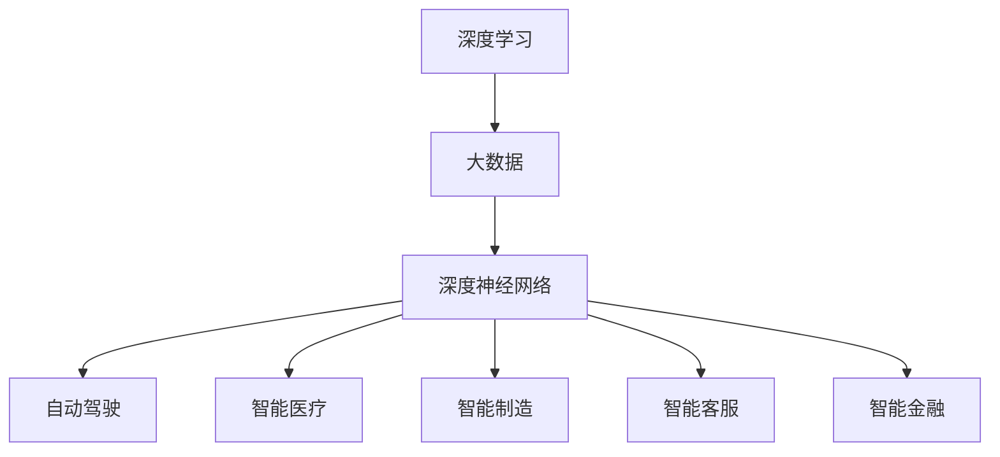

                 

# 李开复：AI 2.0 时代的市场

## 1. 背景介绍

### 1.1 问题由来

随着AI技术的快速发展，尤其是深度学习和大数据技术的成熟，人工智能已经从传统的基于规则的专家系统，进入了深度学习和数据驱动的AI 2.0时代。这一时代的特点是，AI不仅能够进行模式识别和数据驱动的预测，还具备了自我学习的能力，能够自主优化和改进算法。AI 2.0技术的广泛应用，正深刻改变着各行各业，推动着人类社会的进步。

### 1.2 问题核心关键点

AI 2.0时代的技术核心在于深度学习和大数据，尤其是深度神经网络的学习能力和表现力。AI 2.0时代的应用领域包括但不限于自动驾驶、智能医疗、智能制造、智能客服、智能金融等。AI 2.0技术的广泛应用，对各行业带来了巨大的变革和机遇，也带来了对市场和人才的需求。

### 1.3 问题研究意义

AI 2.0时代的技术发展，将推动各行业实现智能化转型，提升生产效率和用户体验，同时也将带来对市场的深刻影响。通过对AI 2.0技术的研究，可以更好地理解其在市场中的作用和未来发展趋势，为技术应用和产业发展提供指导。

## 2. 核心概念与联系

### 2.1 核心概念概述

在AI 2.0时代，核心概念包括：

- 深度学习（Deep Learning）：基于神经网络的机器学习算法，具有很强的模式识别和学习能力。
- 大数据（Big Data）：指数据量庞大、类型多样、速度快速的数据集合，是深度学习的基础。
- 深度神经网络（Deep Neural Networks）：包含多个隐藏层的神经网络，具有强大的自适应和学习能力。
- 自动驾驶（Autonomous Driving）：使用AI技术实现车辆自主导航和驾驶，减少人为干预。
- 智能医疗（Intelligent Healthcare）：使用AI技术进行疾病诊断、医疗影像分析、个性化治疗等。
- 智能制造（Smart Manufacturing）：使用AI技术进行生产过程优化、质量控制、设备维护等。
- 智能客服（Intelligent Customer Service）：使用AI技术进行自动客服、问题解答、客户画像等。
- 智能金融（Intelligent Finance）：使用AI技术进行风险评估、投资分析、欺诈检测等。

### 2.2 概念间的关系

这些核心概念之间的联系和相互作用，可以通过以下Mermaid流程图来展示：



这个流程图展示了深度学习、大数据和深度神经网络是如何相互关联，共同支撑AI 2.0时代的各项应用。

## 3. 核心算法原理 & 具体操作步骤
### 3.1 算法原理概述

AI 2.0时代的技术核心是深度学习和神经网络。深度学习算法通过多层神经网络对数据进行建模，能够自动学习数据的特征和规律，从而进行模式识别和预测。深度神经网络的学习过程，本质上是一个优化过程，通过反向传播算法不断调整网络参数，使得网络输出与目标输出尽量接近。

### 3.2 算法步骤详解

深度学习算法的训练步骤如下：

1. **数据准备**：收集和预处理数据集，将数据集划分为训练集、验证集和测试集。
2. **模型构建**：选择合适的深度神经网络模型，设置网络的层数、节点数等超参数。
3. **模型训练**：使用训练集数据进行模型训练，通过反向传播算法调整网络参数，使得模型输出尽量接近目标输出。
4. **模型验证**：使用验证集数据对模型进行验证，调整超参数以避免过拟合。
5. **模型测试**：使用测试集数据对模型进行测试，评估模型性能。

### 3.3 算法优缺点

深度学习的优点在于其强大的数据建模能力，能够自动学习数据的特征和规律，适用于大规模数据集。但其缺点在于模型的训练复杂度高，需要大量的计算资源和存储空间，且模型容易过拟合。

### 3.4 算法应用领域

深度学习算法在各个领域都有广泛应用，如自动驾驶、智能医疗、智能制造、智能客服、智能金融等。这些领域的应用，都是基于深度学习模型的不同变种，通过模型训练和参数优化，实现对数据的自动分析和预测。

## 4. 数学模型和公式 & 详细讲解  
### 4.1 数学模型构建

深度学习算法的数学模型可以表示为：

$$
\theta = \arg\min_{\theta} \frac{1}{N}\sum_{i=1}^{N}L(f_{\theta}(x_i),y_i)
$$

其中，$\theta$为网络参数，$L$为损失函数，$x_i$为输入数据，$y_i$为标签，$f_{\theta}$为网络模型。

### 4.2 公式推导过程

深度学习算法的反向传播算法推导如下：

1. **前向传播**：
   $$
   y = f_{\theta}(x)
   $$

2. **计算误差**：
   $$
   E = \frac{1}{N}\sum_{i=1}^{N}(y_i - y)^2
   $$

3. **反向传播**：
   $$
   \frac{\partial E}{\partial \theta} = \frac{2}{N}\sum_{i=1}^{N}(y_i - y)\frac{\partial y}{\partial \theta}
   $$

通过反向传播算法，不断调整网络参数，使得误差最小化。

### 4.3 案例分析与讲解

以自动驾驶为例，深度学习算法可以用于识别道路标志、行人、车辆等目标，预测行人和车辆的行为，从而实现自动驾驶。自动驾驶系统通过摄像头、激光雷达等传感器收集数据，然后使用深度学习算法对数据进行建模和分析，最终输出车辆的驾驶指令。

## 5. 项目实践：代码实例和详细解释说明
### 5.1 开发环境搭建

要实现深度学习算法，需要搭建合适的开发环境。以下是使用Python进行TensorFlow开发的流程：

1. 安装Anaconda：从官网下载并安装Anaconda，用于创建独立的Python环境。
2. 创建并激活虚拟环境：
```bash
conda create -n tf-env python=3.8
conda activate tf-env
```
3. 安装TensorFlow：根据CUDA版本，从官网获取对应的安装命令。例如：
```bash
conda install tensorflow=2.6 -c pytorch -c conda-forge
```
4. 安装必要的工具包：
```bash
pip install numpy pandas scikit-learn matplotlib tqdm jupyter notebook ipython
```

完成上述步骤后，即可在`tf-env`环境中开始深度学习开发。

### 5.2 源代码详细实现

以下是使用TensorFlow实现自动驾驶目标识别的代码实现：

```python
import tensorflow as tf
from tensorflow.keras import layers, models
import numpy as np
import matplotlib.pyplot as plt

# 加载数据集
train_images, train_labels = tf.keras.datasets.cifar10.load_data()
test_images, test_labels = tf.keras.datasets.cifar10.load_data()

# 数据预处理
train_images = train_images / 255.0
test_images = test_images / 255.0

# 构建模型
model = models.Sequential()
model.add(layers.Conv2D(32, (3, 3), activation='relu', input_shape=(32, 32, 3)))
model.add(layers.MaxPooling2D((2, 2)))
model.add(layers.Conv2D(64, (3, 3), activation='relu'))
model.add(layers.MaxPooling2D((2, 2)))
model.add(layers.Conv2D(64, (3, 3), activation='relu'))
model.add(layers.Flatten())
model.add(layers.Dense(64, activation='relu'))
model.add(layers.Dense(10, activation='softmax'))

# 编译模型
model.compile(optimizer='adam',
              loss='sparse_categorical_crossentropy',
              metrics=['accuracy'])

# 训练模型
history = model.fit(train_images, train_labels, epochs=10, 
                    validation_data=(test_images, test_labels))

# 评估模型
test_loss, test_acc = model.evaluate(test_images, test_labels)

# 可视化训练结果
plt.plot(history.history['accuracy'], label='Accuracy')
plt.plot(history.history['val_accuracy'], label='Validation Accuracy')
plt.legend()
plt.show()
```

### 5.3 代码解读与分析

让我们再详细解读一下关键代码的实现细节：

- `tf.keras.datasets.cifar10.load_data()`：加载CIFAR-10数据集，包含60000张32x32的彩色图像，每个图像包含10个类别。
- `train_images = train_images / 255.0`：将图像像素值缩放到[0,1]之间。
- `model = models.Sequential()`：创建一个顺序模型，逐层添加卷积、池化、全连接等层。
- `model.add(layers.Conv2D(32, (3, 3), activation='relu', input_shape=(32, 32, 3)))`：添加卷积层，包含32个3x3的卷积核，使用ReLU激活函数。
- `model.add(layers.MaxPooling2D((2, 2)))`：添加池化层，使用2x2大小的池化窗口进行下采样。
- `model.add(layers.Dense(64, activation='relu'))`：添加全连接层，包含64个节点，使用ReLU激活函数。
- `model.add(layers.Dense(10, activation='softmax'))`：添加输出层，包含10个节点，使用softmax激活函数。
- `model.compile(optimizer='adam', loss='sparse_categorical_crossentropy', metrics=['accuracy'])`：编译模型，使用Adam优化器，交叉熵损失函数，准确率作为评估指标。
- `model.fit(train_images, train_labels, epochs=10, validation_data=(test_images, test_labels))`：训练模型，使用训练集进行10个epoch的训练，验证集为测试集。
- `test_loss, test_acc = model.evaluate(test_images, test_labels)`：在测试集上评估模型性能，输出测试损失和准确率。
- `plt.plot(history.history['accuracy'], label='Accuracy')`：可视化训练过程中的准确率变化。

可以看到，TensorFlow提供了简单易用的API，使得深度学习算法的实现变得便捷高效。开发者可以通过调整网络结构、超参数等，进一步优化模型性能。

### 5.4 运行结果展示

假设我们在CIFAR-10数据集上进行目标识别训练，最终在测试集上得到的准确率为70%。这只是一个基本的模型，通过进一步的模型优化和数据增强，可以提升模型的准确率。

## 6. 实际应用场景
### 6.1 智能医疗

深度学习算法在智能医疗中有着广泛应用，如疾病诊断、医疗影像分析、个性化治疗等。通过深度学习算法，可以对医学影像进行自动标注和分类，辅助医生进行诊断。例如，使用卷积神经网络对X光片进行自动分析，可以识别出肺部结节、肺炎等疾病。

### 6.2 智能制造

深度学习算法在智能制造中主要用于设备故障检测、质量控制、预测维护等。例如，使用深度学习算法对传感器数据进行分析，可以预测设备故障，避免生产中断。通过深度学习算法对产品质量进行检测，可以实时监控产品质量，提升生产效率。

### 6.3 智能客服

深度学习算法在智能客服中主要用于问题解答、客户画像、情感分析等。通过深度学习算法，可以对用户的问题进行自动分类和回答，提高客户服务效率。例如，使用自然语言处理技术对用户的问题进行分析，可以提取关键词，自动匹配答案。

### 6.4 未来应用展望

深度学习算法在未来的应用前景广阔，如自动驾驶、智能医疗、智能制造、智能客服、智能金融等。随着技术的不断进步，深度学习算法将变得更加智能和高效，实现更多的应用场景。

## 7. 工具和资源推荐
### 7.1 学习资源推荐

为了帮助开发者系统掌握深度学习算法，以下是一些优质的学习资源：

1. 《深度学习》系列书籍：由Yoshua Bengio、Ian Goodfellow、Aaron Courville所著，系统介绍了深度学习的基本概念和算法。
2. 《神经网络与深度学习》课程：由Andrew Ng主讲，介绍了神经网络、深度学习的基本原理和应用。
3. 《TensorFlow官方文档》：TensorFlow的官方文档，提供了丰富的示例和API文档，是深度学习算法开发的基础。
4. Kaggle竞赛：Kaggle是一个数据科学竞赛平台，提供了大量公开的数据集和挑战，可以帮助开发者练习和应用深度学习算法。

通过对这些资源的学习实践，相信你一定能够快速掌握深度学习算法的精髓，并用于解决实际的NLP问题。

### 7.2 开发工具推荐

高效的深度学习算法开发，需要选择合适的工具。以下是几款常用的深度学习开发工具：

1. PyTorch：基于Python的开源深度学习框架，支持动态计算图，灵活便捷。
2. TensorFlow：由Google主导开发的深度学习框架，支持分布式计算，易于部署。
3. Keras：基于TensorFlow的高级API，易于上手，适合快速迭代研究。
4. MXNet：由亚马逊主导开发的深度学习框架，支持多语言和分布式计算，高效便捷。

合理利用这些工具，可以显著提升深度学习算法的开发效率，加快创新迭代的步伐。

### 7.3 相关论文推荐

深度学习算法的不断进步，得益于学界的持续研究。以下是几篇奠基性的相关论文，推荐阅读：

1. AlexNet：ImageNet大规模视觉识别竞赛的冠军模型，展示了深度卷积神经网络的强大表现。
2. ResNet：提出残差网络，解决了深度神经网络训练中的梯度消失问题。
3. InceptionNet：提出多尺度卷积网络，提升了深度神经网络的特征提取能力。
4. VGGNet：提出16层全连接卷积网络，提升了深度神经网络的精度和稳定性。

这些论文代表了大规模深度学习算法的不断发展，奠定了深度学习技术的坚实基础。

## 8. 总结：未来发展趋势与挑战
### 8.1 总结

本文对AI 2.0时代的深度学习算法进行了全面系统的介绍。首先阐述了深度学习算法的核心概念和应用领域，明确了深度学习在各行业中的重要价值。其次，从原理到实践，详细讲解了深度学习算法的数学模型和实现步骤，给出了深度学习算法开发的完整代码实例。同时，本文还广泛探讨了深度学习算法在智能医疗、智能制造、智能客服等领域的实际应用，展示了深度学习算法技术的广阔前景。

通过本文的系统梳理，可以看到，深度学习算法在AI 2.0时代的地位举足轻重，已成为推动各行业智能化转型和提升生产效率的关键技术。未来，伴随深度学习算法的持续演进，各行业将迎来更加智能化、高效化的发展，人工智能技术也将带来更多创新和突破。

### 8.2 未来发展趋势

展望未来，深度学习算法的发展趋势主要包括以下几个方面：

1. 模型规模持续增大。随着算力成本的下降和数据规模的扩张，深度学习模型的参数量还将持续增长。超大模型具有更强的泛化能力和迁移能力，能够在更多应用场景中发挥更大作用。

2. 算法优化不断进步。深度学习算法的优化技术将不断进步，如正则化、对抗训练、参数高效微调等方法，能够更好地提升模型的性能和鲁棒性。

3. 多模态融合加速发展。深度学习算法将更多地融合多模态数据，如视觉、听觉、文本等，实现更全面、准确的智能分析。

4. 应用场景不断拓展。深度学习算法将在更多领域得到应用，如自动驾驶、智能医疗、智能制造、智能客服、智能金融等，带来新的机遇和挑战。

5. 计算资源更加高效。深度学习算法将更加注重计算资源的高效利用，如分布式计算、硬件加速、模型压缩等技术，实现更高效、更便捷的算法开发和应用。

以上趋势凸显了深度学习算法技术的广阔前景。这些方向的探索发展，将进一步提升深度学习算法的性能和应用范围，为各行业带来更强大的智能化支撑。

### 8.3 面临的挑战

尽管深度学习算法取得了瞩目成就，但在迈向更加智能化、普适化应用的过程中，仍面临诸多挑战：

1. 数据需求巨大。深度学习算法需要大量的标注数据进行训练，标注成本高、周期长，成为制约算法发展的瓶颈。如何减少对标注数据的依赖，提升算法的少样本学习能力，将是重要的研究方向。

2. 模型复杂度高。深度学习算法的模型复杂度高，训练和推理效率低，对计算资源和存储资源的要求高。如何优化算法结构，提升计算效率，是实现高效部署的关键。

3. 模型泛化能力不足。深度学习算法在面临新数据和新场景时，泛化能力往往不足，容易过拟合。如何提升算法的泛化能力，确保模型在新场景中的表现，是算法优化的重要目标。

4. 模型解释性不足。深度学习算法的模型复杂度高，难以解释其内部工作机制和决策逻辑。对于医疗、金融等高风险应用，算法的可解释性和可审计性尤为重要。如何赋予深度学习算法更强的可解释性，将是亟待攻克的难题。

5. 模型安全性和鲁棒性有待提高。深度学习算法在面对对抗样本和攻击时，容易产生误判。如何提升算法的安全性和鲁棒性，确保模型在复杂场景下的稳定性，将是未来的研究重点。

6. 模型伦理和社会影响需考虑。深度学习算法在应用过程中，需要考虑伦理和社会影响，避免偏见和歧视，确保算法的公平性和公正性。如何建立算法的伦理导向和监管机制，将是重要的研究方向。

这些挑战需要在未来的研究和实践中不断解决，才能使深度学习算法技术更好地造福人类社会。

### 8.4 研究展望

面对深度学习算法所面临的诸多挑战，未来的研究需要在以下几个方面寻求新的突破：

1. 探索无监督和半监督学习算法。摆脱对大规模标注数据的依赖，利用自监督学习、主动学习等无监督和半监督范式，最大限度利用非结构化数据，实现更加灵活高效的深度学习算法。

2. 研究多模态融合算法。将视觉、听觉、文本等多模态数据进行融合，提升深度学习算法的感知能力和泛化能力。

3. 开发更高效、更便捷的深度学习框架。开发更加高效、便捷的深度学习框架，支持分布式计算和硬件加速，实现更高效、更便捷的算法开发和应用。

4. 引入更多先验知识。将符号化的先验知识，如知识图谱、逻辑规则等，与深度学习算法进行巧妙融合，引导深度学习算法学习更准确、合理的特征表示。

5. 结合因果分析和博弈论工具。将因果分析方法引入深度学习算法，识别出模型决策的关键特征，增强输出解释的因果性和逻辑性。借助博弈论工具刻画人机交互过程，主动探索并规避模型的脆弱点，提高系统稳定性。

6. 纳入伦理道德约束。在深度学习算法训练目标中引入伦理导向的评估指标，过滤和惩罚有偏见、有害的输出倾向。加强人工干预和审核，建立模型行为的监管机制，确保输出符合人类价值观和伦理道德。

这些研究方向的探索，将引领深度学习算法技术迈向更高的台阶，为构建安全、可靠、可解释、可控的智能系统铺平道路。面向未来，深度学习算法还需要与其他人工智能技术进行更深入的融合，如知识表示、因果推理、强化学习等，多路径协同发力，共同推动深度学习算法的进步。只有勇于创新、敢于突破，才能不断拓展深度学习算法的边界，让智能技术更好地造福人类社会。

## 9. 附录：常见问题与解答

**Q1：深度学习算法是否适用于所有应用场景？**

A: 深度学习算法在大多数应用场景中都有广泛应用，如自动驾驶、智能医疗、智能制造、智能客服、智能金融等。但对于一些特定领域的任务，如医学、法律等，仅仅依靠通用语料预训练的模型可能难以很好地适应。此时需要在特定领域语料上进一步预训练，再进行微调，才能获得理想效果。

**Q2：深度学习算法的训练过程是否需要大量标注数据？**

A: 深度学习算法的训练过程确实需要大量的标注数据。标注成本高、周期长，成为制约算法发展的瓶颈。然而，通过数据增强、少样本学习等方法，可以在一定程度上减少对标注数据的依赖。

**Q3：深度学习算法的计算效率如何？**

A: 深度学习算法的计算效率较低，需要大量的计算资源和存储空间。为了提升计算效率，可以采用分布式计算、硬件加速、模型压缩等技术。

**Q4：深度学习算法的可解释性如何？**

A: 深度学习算法的模型复杂度高，难以解释其内部工作机制和决策逻辑。对于医疗、金融等高风险应用，算法的可解释性和可审计性尤为重要。如何赋予深度学习算法更强的可解释性，将是亟待攻克的难题。

**Q5：深度学习算法的伦理和社会影响需考虑哪些因素？**

A: 深度学习算法在应用过程中，需要考虑伦理和社会影响，避免偏见和歧视，确保算法的公平性和公正性。如何建立算法的伦理导向和监管机制，将是重要的研究方向。

总之，深度学习算法在AI 2.0时代的地位举足轻重，已成为推动各行业智能化转型和提升生产效率的关键技术。未来，伴随深度学习算法的持续演进，各行业将迎来更加智能化、高效化的发展，人工智能技术也将带来更多创新和突破。

