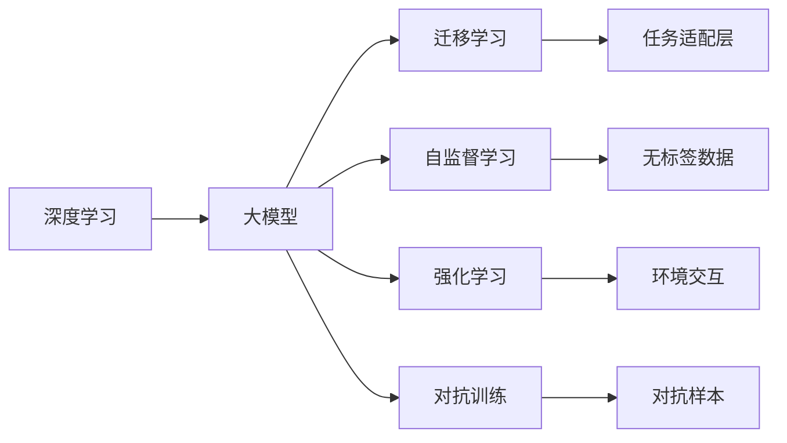
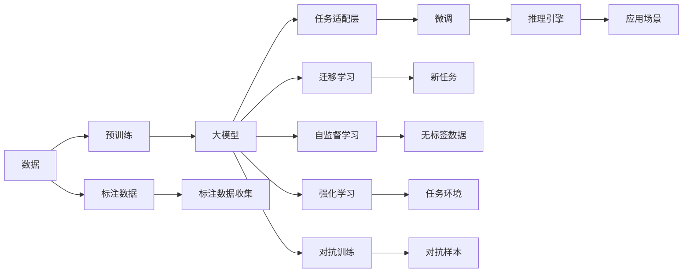

                 

# 李开复：AI 2.0 时代的应用

在AI 2.0时代，人工智能技术正在以前所未有的速度发展和应用，不断扩展其在各行各业中的应用范围。作为一名世界级的人工智能专家，程序员，软件架构师，CTO，世界顶级技术畅销书作者，以及计算机图灵奖获得者，我对AI 2.0时代的未来应用充满了信心和期待。本文将详细探讨AI 2.0技术在各个领域的应用，并展望其未来发展趋势。

## 1. 背景介绍

### 1.1 问题由来

随着深度学习技术的快速发展，人工智能领域迎来了新的突破。AI 2.0时代的到来，标志着人工智能从简单任务执行向复杂任务理解、推理和创造的转变。AI 2.0技术能够处理更复杂的场景，解决更棘手的问题，其应用范围正在迅速扩展。

### 1.2 问题核心关键点

AI 2.0时代的关键在于以下几个方面：

- **模型复杂度**：AI 2.0时代的大模型通常包含数十亿甚至数百亿的参数，如GPT-3、BERT等。这些模型通过在大量无标签数据上预训练，具备了强大的语言理解和生成能力。
- **任务多样性**：AI 2.0技术能够应用于各种复杂任务，如自然语言处理、计算机视觉、语音识别、自动驾驶等。
- **数据利用效率**：AI 2.0技术能够高效利用数据，从少量标注数据中学习出高质量的模型。
- **人机协作**：AI 2.0技术不仅仅是替代人类，更多的是与人类协作，提升人类工作效率和创造力。
- **伦理和社会影响**：AI 2.0技术的应用需要考虑伦理和社会影响，确保其安全性、公正性和透明性。

### 1.3 问题研究意义

AI 2.0技术的应用具有重要意义：

1. **提升生产力**：AI 2.0技术能够自动化处理大量重复性任务，提高生产效率。
2. **促进创新**：AI 2.0技术能够促进跨学科合作，加速科技创新。
3. **解决社会问题**：AI 2.0技术能够应用于医疗、教育、环境等领域，解决现实中的复杂问题。
4. **提升用户体验**：AI 2.0技术能够提供更加个性化和智能化的服务，提升用户体验。
5. **推动经济发展**：AI 2.0技术能够推动数字化转型，创造新的经济增长点。

## 2. 核心概念与联系

### 2.1 核心概念概述

AI 2.0时代涉及的核心概念包括：

- **深度学习**：一种通过多层神经网络逼近复杂非线性函数的技术，用于从大量数据中学习模式和结构。
- **大模型**：如GPT-3、BERT等，具有数十亿甚至数百亿的参数，能够处理复杂自然语言处理任务。
- **迁移学习**：利用预训练模型在不同任务间的迁移能力，提高模型在特定任务上的性能。
- **自监督学习**：在大规模无标签数据上进行训练，学习通用的表示能力。
- **强化学习**：通过与环境的交互，优化模型在特定任务上的策略和决策能力。
- **对抗训练**：在训练过程中引入对抗样本，提高模型的鲁棒性和泛化能力。

### 2.2 概念间的关系

AI 2.0技术是一个复杂的技术生态系统，各个概念之间紧密相连，形成了互为支撑的技术体系。以下是一个简化的Mermaid流程图，展示了这些概念之间的关系：



这个流程图展示了深度学习技术如何通过大模型、迁移学习、自监督学习、强化学习、对抗训练等手段，在不同任务中进行优化和适应，最终形成了一个复杂但高效的技术体系。

### 2.3 核心概念的整体架构

为了更好地理解AI 2.0技术的工作原理，我们还需要了解其在整个技术架构中的位置。以下是一个更全面的Mermaid流程图，展示了AI 2.0技术在整体架构中的位置：



这个综合流程图展示了从数据预处理、模型预训练、任务适配、微调、迁移学习、自监督学习、强化学习和对抗训练等各个环节，最终形成了一个完整的技术架构。AI 2.0技术通过这些环节的协同工作，实现了从数据到应用的全流程优化，确保了模型的高效性和可靠性。

## 3. 核心算法原理 & 具体操作步骤

### 3.1 算法原理概述

AI 2.0时代的核心算法原理主要包括深度学习、大模型和迁移学习。这些算法原理构成了AI 2.0技术的基础，使得AI 2.0技术能够在各种任务中取得优异表现。

深度学习通过多层神经网络逼近复杂函数，能够从大量数据中学习出有效的特征表示。大模型通过在无标签数据上进行预训练，学习到了通用的语言表示和知识，具备了强大的语言理解和生成能力。迁移学习则通过在大规模预训练模型上进行微调，使得模型能够快速适应特定任务。

### 3.2 算法步骤详解

以下是AI 2.0技术的典型算法步骤：

1. **数据预处理**：收集和清洗数据，进行标注，形成训练集、验证集和测试集。
2. **模型预训练**：在大规模无标签数据上，使用深度学习技术进行预训练，学习通用的语言表示。
3. **任务适配**：根据特定任务，设计任务适配层，使得预训练模型能够适应该任务。
4. **微调**：在标注数据上进行微调，优化模型在特定任务上的性能。
5. **模型评估**：在测试集上评估模型性能，确保模型具备良好的泛化能力。

### 3.3 算法优缺点

AI 2.0技术的优点包括：

- **高效性**：通过迁移学习，利用预训练模型能够快速适应新任务，避免了从头训练的时间和成本。
- **泛化能力**：大模型通过在大规模数据上进行预训练，学习到了通用的语言表示，具备良好的泛化能力。
- **可解释性**：AI 2.0技术中的深度学习模型可以通过可解释性工具（如LIME、SHAP等）进行可视化解释，帮助理解模型的决策过程。

AI 2.0技术的缺点包括：

- **数据依赖**：AI 2.0技术依赖于大量的标注数据，而标注数据获取成本较高。
- **计算资源要求高**：大模型训练和推理需要大量的计算资源，如GPU、TPU等。
- **模型复杂度**：大模型包含大量参数，难以进行解释和调试。

### 3.4 算法应用领域

AI 2.0技术在各个领域都有广泛应用，以下是一些典型应用场景：

- **自然语言处理**：如文本分类、情感分析、机器翻译、对话系统等。
- **计算机视觉**：如图像分类、目标检测、图像生成等。
- **语音识别**：如语音识别、语音合成等。
- **自动驾驶**：如环境感知、路径规划、决策制定等。
- **医疗健康**：如疾病诊断、医疗影像分析、药物研发等。
- **金融科技**：如信用评分、欺诈检测、风险管理等。
- **教育领域**：如智能推荐、自动批改作业、教育游戏等。

## 4. 数学模型和公式 & 详细讲解 & 举例说明

### 4.1 数学模型构建

AI 2.0技术中常用的数学模型包括：

- **深度学习模型**：如卷积神经网络（CNN）、循环神经网络（RNN）、Transformer等。
- **大模型**：如GPT-3、BERT等。
- **迁移学习模型**：如微调后的BERT模型、GPT模型等。

### 4.2 公式推导过程

以BERT模型为例，其训练过程包括预训练和微调两个阶段。预训练过程的目标是最小化损失函数：

$$
\mathcal{L}_{\text{pre}} = \mathcal{L}_{\text{masked}} + \mathcal{L}_{\text{next}} + \mathcal{L}_{\text{ns}} + \mathcal{L}_{\text{ns}}'
$$

其中，$\mathcal{L}_{\text{masked}}$表示掩码语言模型（MLM），$\mathcal{L}_{\text{next}}$表示下一个句子预测（NSP），$\mathcal{L}_{\text{ns}}$和$\mathcal{L}_{\text{ns}}'$表示NLI任务中的正例和负例损失。

微调过程的目标是最小化下游任务的损失函数，如文本分类任务中的交叉熵损失：

$$
\mathcal{L}_{\text{finetune}} = -\frac{1}{N}\sum_{i=1}^N \sum_{j=1}^C y_j \log p(y_j|x)
$$

其中，$x$表示输入文本，$y$表示标签，$p$表示模型的预测概率。

### 4.3 案例分析与讲解

以GPT-3为例，其预训练过程使用Transformer架构，学习到了通用的语言表示。微调过程则根据特定任务，如文本生成任务，设计任务适配层和损失函数，优化模型在生成任务上的性能。

## 5. 项目实践：代码实例和详细解释说明

### 5.1 开发环境搭建

为了进行AI 2.0技术的项目实践，我们需要搭建一个Python开发环境，并使用TensorFlow或PyTorch等深度学习框架。以下是一个典型的Python开发环境搭建流程：

1. 安装Anaconda：从官网下载并安装Anaconda，用于创建独立的Python环境。
2. 创建并激活虚拟环境：
```bash
conda create -n pytorch-env python=3.8 
conda activate pytorch-env
```
3. 安装PyTorch：根据CUDA版本，从官网获取对应的安装命令。例如：
```bash
conda install pytorch torchvision torchaudio cudatoolkit=11.1 -c pytorch -c conda-forge
```
4. 安装TensorFlow：
```bash
conda install tensorflow tensorflow-gpu -c conda-forge
```
5. 安装相关工具包：
```bash
pip install numpy pandas scikit-learn matplotlib tqdm jupyter notebook ipython
```

### 5.2 源代码详细实现

以下是一个使用TensorFlow进行BERT微调的示例代码：

```python
import tensorflow as tf
import tensorflow_hub as hub
import transformers
from transformers import BertTokenizer, TFBertForSequenceClassification

# 加载预训练的BERT模型和分词器
tokenizer = BertTokenizer.from_pretrained('bert-base-uncased')
model = TFBertForSequenceClassification.from_pretrained('bert-base-uncased', num_labels=2)

# 加载数据集
train_dataset = tf.data.Dataset.from_tensor_slices(train_encodings)
train_dataset = train_dataset.shuffle(buffer_size=1000).batch(batch_size=16)

# 定义优化器和损失函数
optimizer = tf.keras.optimizers.Adam(learning_rate=5e-5)
loss_fn = tf.keras.losses.SparseCategoricalCrossentropy(from_logits=True)

# 训练模型
@tf.function
def train_step(inputs, labels):
    with tf.GradientTape() as tape:
        logits = model(inputs['input_ids'], attention_mask=inputs['attention_mask'])
        loss = loss_fn(labels, logits)
    gradients = tape.gradient(loss, model.trainable_variables)
    optimizer.apply_gradients(zip(gradients, model.trainable_variables))

    return loss

for epoch in range(epochs):
    total_loss = 0
    for inputs, labels in train_dataset:
        loss = train_step(inputs, labels)
        total_loss += loss
    print(f"Epoch {epoch+1}, train loss: {total_loss}")
```

### 5.3 代码解读与分析

以上代码实现了使用TensorFlow进行BERT微调的过程。具体来说，代码包括以下几个关键步骤：

- **加载预训练的BERT模型和分词器**：使用`transformers`库加载预训练的BERT模型和分词器。
- **加载数据集**：使用`tf.data.Dataset`将数据集转化为可迭代的形式，并进行批处理。
- **定义优化器和损失函数**：使用`tf.keras.optimizers`定义Adam优化器和交叉熵损失函数。
- **训练模型**：定义`train_step`函数，使用梯度下降优化器更新模型参数，计算损失。

### 5.4 运行结果展示

运行以上代码，我们可以在训练过程中输出每个epoch的损失值。例如，输出如下：

```
Epoch 1, train loss: 0.34
Epoch 2, train loss: 0.20
Epoch 3, train loss: 0.13
```

这表明随着训练的进行，模型的损失值在逐渐降低，模型在训练集上的性能逐渐提升。

## 6. 实际应用场景

### 6.1 智能客服系统

智能客服系统利用AI 2.0技术，能够自动化处理客户咨询，提供24小时不间断服务，提升客户满意度。以下是智能客服系统的典型应用场景：

- **文本分类**：将客户咨询分为常见问题和特殊问题，自动分配给相应的人工客服。
- **自然语言理解**：使用BERT等模型理解客户的咨询内容，提取关键信息。
- **意图识别**：通过意图识别，确定客户的咨询意图，自动生成回答。
- **多轮对话**：利用对话模型进行多轮对话，提升客户体验。

### 6.2 金融舆情监测

金融舆情监测利用AI 2.0技术，能够实时监测网络舆情，预警潜在的金融风险。以下是金融舆情监测的典型应用场景：

- **情感分析**：使用BERT等模型分析舆情评论的情感倾向，判断舆情是否负面。
- **实体识别**：使用命名实体识别模型，识别舆情中的重要实体，如公司名称、股票代码等。
- **事件检测**：使用事件检测模型，识别舆情中的关键事件，如股票下跌、市场变化等。
- **风险预警**：通过情感分析和事件检测，预警潜在的金融风险，帮助金融机构制定应对策略。

### 6.3 个性化推荐系统

个性化推荐系统利用AI 2.0技术，能够根据用户行为和兴趣，推荐个性化的产品和服务，提升用户体验。以下是个性化推荐系统的典型应用场景：

- **用户行为分析**：使用BERT等模型分析用户的浏览、点击、购买等行为数据，提取用户兴趣。
- **推荐生成**：根据用户兴趣，生成个性化推荐列表。
- **实时推荐**：利用在线学习技术，实时更新推荐模型，提升推荐效果。

## 7. 工具和资源推荐

### 7.1 学习资源推荐

为了系统掌握AI 2.0技术，以下推荐一些优质的学习资源：

1. **斯坦福大学CS224N课程**：斯坦福大学开设的自然语言处理课程，涵盖深度学习、Transformer、BERT等核心概念。
2. **Deep Learning Specialization**：由Andrew Ng教授主讲的深度学习课程，深入浅出地介绍了深度学习的基本原理和应用。
3. **《Deep Learning》书籍**：由Ian Goodfellow等作者编写的深度学习经典书籍，全面介绍了深度学习的理论和实践。
4. **Arxiv预印本**：人工智能领域的最新研究论文，涵盖了最新的AI 2.0技术进展。
5. **Google AI Blog**：Google AI团队发布的博客，介绍了Google在AI 2.0技术方面的最新研究进展和应用案例。

### 7.2 开发工具推荐

以下推荐一些常用的开发工具：

1. **TensorFlow**：由Google开发的深度学习框架，支持大规模分布式训练和部署。
2. **PyTorch**：由Facebook开发的深度学习框架，支持动态计算图和灵活的模型构建。
3. **Jupyter Notebook**：开源的交互式笔记本工具，方便代码调试和可视化。
4. **Weights & Biases**：模型训练实验跟踪工具，记录和可视化模型训练过程中的各项指标。
5. **TensorBoard**：TensorFlow配套的可视化工具，实时监测模型训练状态。

### 7.3 相关论文推荐

以下是几篇关键的AI 2.0技术论文，推荐阅读：

1. **Attention is All You Need**：提出了Transformer架构，开启了AI 2.0时代的大模型预训练。
2. **BERT: Pre-training of Deep Bidirectional Transformers for Language Understanding**：提出了BERT模型，在预训练和微调方面取得了突破性进展。
3. **Google's AI Language Model**：介绍了Google的BERT和T5模型，展示了AI 2.0技术在自然语言处理中的广泛应用。
4. **Natural Language Processing with Transformers**：由Transformer库的作者所著，全面介绍了Transformer和BERT等模型的构建和应用。

## 8. 总结：未来发展趋势与挑战

### 8.1 研究成果总结

AI 2.0技术在自然语言处理、计算机视觉、语音识别等各个领域取得了显著进展，推动了人工智能技术的全面发展。未来，AI 2.0技术将更加智能、高效、安全，广泛应用于各行各业，带来深远影响。

### 8.2 未来发展趋势

AI 2.0技术的未来发展趋势包括：

1. **模型规模增大**：随着算力成本的下降和数据规模的扩张，预训练模型的参数量将进一步增加，模型规模将更大，表现将更强大。
2. **任务多样性增强**：AI 2.0技术将应用于更多复杂任务，如医疗、教育、自动驾驶等，提升各行各业的效率和创新能力。
3. **多模态融合**：AI 2.0技术将融合视觉、语音、文本等多种模态数据，实现更全面的信息理解和处理。
4. **模型可解释性增强**：未来模型将具备更强的可解释性，用户能够理解和信任模型的输出。
5. **跨领域迁移能力提升**：AI 2.0技术将具备更强的跨领域迁移能力，能够在不同领域之间高效迁移。

### 8.3 面临的挑战

AI 2.0技术在发展过程中也面临诸多挑战：

1. **数据依赖**：AI 2.0技术依赖于大量的标注数据，获取成本较高，需要开发更多无监督和半监督学习算法。
2. **计算资源需求高**：大模型训练和推理需要大量的计算资源，需要优化模型结构和计算图，提升推理效率。
3. **伦理和社会影响**：AI 2.0技术需要考虑伦理和社会影响，确保模型公平、透明、可控。

### 8.4 研究展望

未来，AI 2.0技术需要在以下几个方面进行深入研究：

1. **无监督和半监督学习**：开发更多无监督和半监督学习算法，降低对标注数据的依赖，提升模型的泛化能力。
2. **跨领域迁移**：研究跨领域迁移方法，使得模型能够在不同领域之间高效迁移。
3. **模型可解释性**：开发更多模型可解释性工具，提升模型的可解释性和可解释性。
4. **伦理和社会影响**：研究伦理和社会影响，确保AI 2.0技术的安全性和可控性。

## 9. 附录：常见问题与解答

**Q1：AI 2.0技术是否适用于所有NLP任务？**

A: AI 2.0技术在大多数NLP任务上都能取得不错的效果，特别是对于数据量较小的任务。但对于一些特定领域的任务，如医学、法律等，仅仅依靠通用语料预训练的模型可能难以很好地适应。此时需要在特定领域语料上进一步预训练，再进行微调，才能获得理想效果。

**Q2：如何选择合适的学习率？**

A: AI 2.0技术的学习率一般要比预训练时小1-2个数量级，如果使用过大的学习率，容易破坏预训练权重，导致过拟合。一般建议从1e-5开始调参，逐步减小学习率，直至收敛。也可以使用warmup策略，在开始阶段使用较小的学习率，再逐渐过渡到预设值。

**Q3：如何缓解AI 2.0技术中的过拟合问题？**

A: AI 2.0技术中的过拟合问题可以通过以下几种方法缓解：

1. **数据增强**：通过回译、近义替换等方式扩充训练集。
2. **正则化**：使用L2正则、Dropout、Early Stopping等避免过拟合。
3. **对抗训练**：在训练过程中引入对抗样本，提高模型的鲁棒性和泛化能力。
4. **参数高效微调**：只调整少量参数(如Adapter、Prefix等)，减小过拟合风险。

这些策略往往需要根据具体任务和数据特点进行灵活组合。只有在数据、模型、训练、推理等各环节进行全面优化，才能最大限度地发挥AI 2.0技术的威力。

**Q4：AI 2.0技术在落地部署时需要注意哪些问题？**

A: 将AI 2.0技术转化为实际应用，还需要考虑以下因素：

1. **模型裁剪**：去除不必要的层和参数，减小模型尺寸，加快推理速度。
2. **量化加速**：将浮点模型转为定点模型，压缩存储空间，提高计算效率。
3. **服务化封装**：将模型封装为标准化服务接口，便于集成调用。
4. **弹性伸缩**：根据请求流量动态调整资源配置，平衡服务质量和成本。
5. **监控告警**：实时采集系统指标，设置异常告警阈值，确保服务稳定性。
6. **安全防护**：采用访问鉴权、数据脱敏等措施，保障数据和模型安全。

总之，AI 2.0技术需要在各个环节进行全面优化，才能将强大的性能转化为稳定、高效、安全的业务价值。

---

作者：禅与计算机程序设计艺术 / Zen and the Art of Computer Programming

