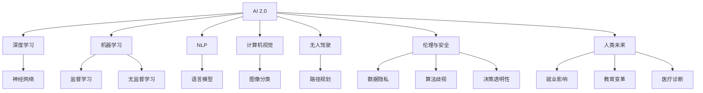
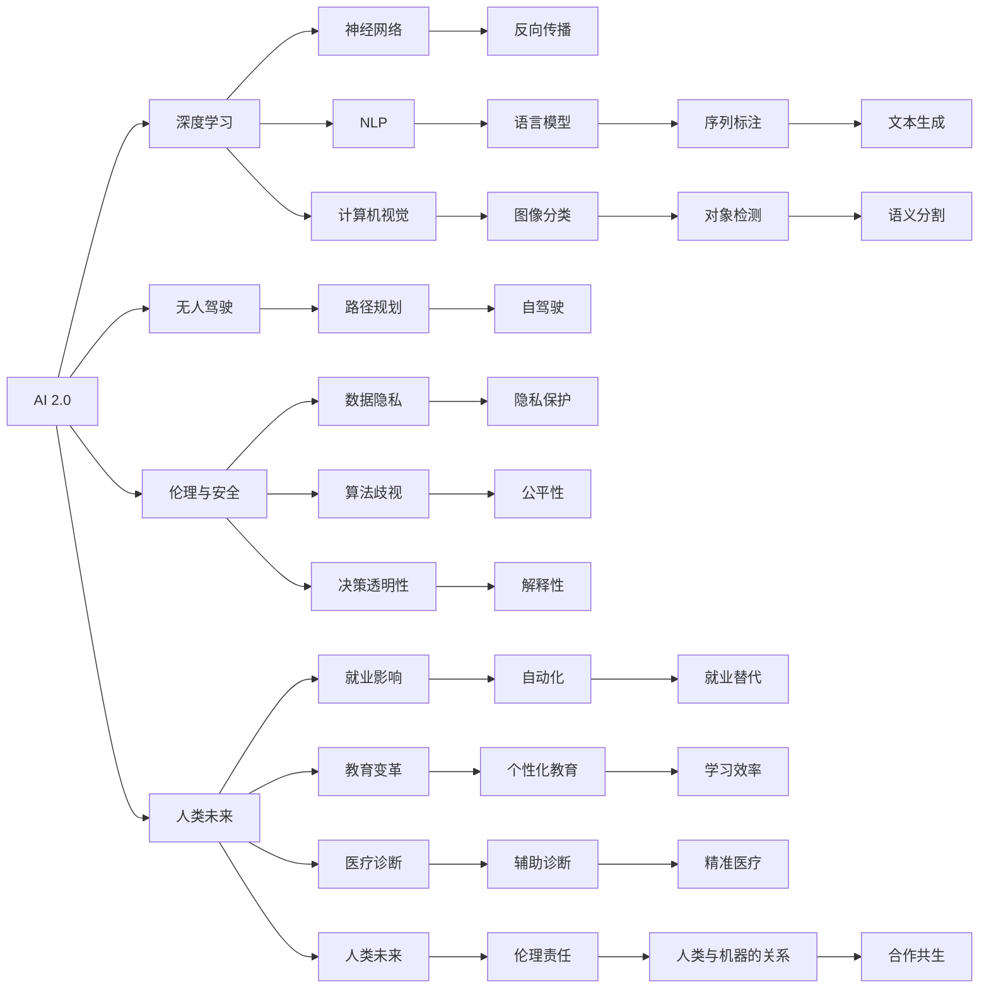

                 

# 李开复：AI 2.0 时代的挑战

> 关键词：人工智能, AI 2.0, 机器学习, 深度学习, 自然语言处理, 计算机视觉, 无人驾驶, 伦理与安全, 人类未来

## 1. 背景介绍

### 1.1 问题由来

人工智能（AI）在过去几十年间经历了飞速发展。从最初的专家系统到机器学习，再到深度学习，AI 技术不断突破，逐渐成为推动经济社会发展的重要引擎。然而，随着技术的日益成熟，AI 2.0 时代的到来，诸多挑战也浮现出来，这些问题不仅影响着技术本身的进步，更触及到了社会的各个层面。本文旨在深入探讨 AI 2.0 时代所面临的挑战，并提出应对策略，以期推动 AI 技术在未来更加健康、可持续地发展。

### 1.2 问题核心关键点

AI 2.0 时代的挑战主要集中在以下几个方面：

- **技术挑战**：AI 2.0 时代的核心在于深度学习和神经网络，然而，这一范式在面对复杂任务时，依然存在诸多局限，如数据需求高、模型难以解释、计算资源消耗大等。
- **伦理与安全问题**：AI 的广泛应用带来了数据隐私、算法歧视、决策透明性等问题，这些问题的存在，威胁到社会的稳定和公平。
- **社会影响**：AI 对就业、教育、医疗等社会领域的影响深远，如何确保 AI 技术的正面影响，使其更好地服务于社会，是一个亟待解决的问题。

## 2. 核心概念与联系

### 2.1 核心概念概述

AI 2.0 时代的核心概念包括：

- **AI 2.0**：AI 2.0 是指新一代的 AI 技术，基于深度学习、神经网络等技术，旨在解决更复杂、更抽象的任务，如自然语言理解、视觉识别、机器人学习等。
- **机器学习**：一种使计算机能够从数据中学习并改进的技术。
- **深度学习**：一种机器学习技术，通过多层神经网络模拟人脑的工作机制，能够自动提取特征并进行分类、回归等任务。
- **自然语言处理（NLP）**：使计算机能够理解和生成人类语言的技术。
- **计算机视觉**：使计算机能够“看”的技术，即从图像中提取信息并进行分析。
- **无人驾驶**：利用 AI 技术实现汽车自主导航，提高交通安全和效率。
- **伦理与安全**：在 AI 应用中，如何确保数据隐私、算法公平性、决策透明性等问题。
- **人类未来**：AI 技术的发展对人类社会的影响，包括就业、教育、医疗等方面。

这些核心概念通过以下 Mermaid 流程图进行展示：



这个流程图展示了 AI 2.0 时代的核心概念及其相互联系：

1. AI 2.0 建立在深度学习等技术之上。
2. 机器学习和深度学习是 AI 的核心。
3. NLP、计算机视觉和无人驾驶是 AI 2.0 时代的重要应用领域。
4. 伦理与安全是 AI 应用的重要考量。
5. AI 对人类未来有深远影响。

### 2.2 概念间的关系

这些核心概念之间存在紧密的联系，通过以下 Mermaid 流程图进行展示：



这个流程图展示了 AI 2.0 时代各核心概念之间的联系：

1. AI 2.0 建立在深度学习之上，通过神经网络实现反向传播。
2. NLP 通过语言模型和序列标注等技术实现文本生成和理解。
3. 计算机视觉通过图像分类和语义分割等技术实现对象检测。
4. 无人驾驶利用路径规划等技术实现自驾驶。
5. 伦理与安全问题贯穿于数据隐私、算法歧视和决策透明性等各个方面。
6. AI 对就业、教育、医疗等方面有深远影响。

## 3. 核心算法原理 & 具体操作步骤

### 3.1 算法原理概述

AI 2.0 时代的核心算法包括深度学习、神经网络、反向传播等。这些算法通过多层神经网络模拟人脑的工作机制，自动提取特征并进行分类、回归等任务。深度学习通过多个层次的抽象和概括，能够从原始数据中学习到更高级别的特征表示。

### 3.2 算法步骤详解

AI 2.0 时代的算法步骤如下：

1. **数据准备**：收集和标注数据，作为训练模型的基础。
2. **模型构建**：选择适当的神经网络架构，并设置超参数。
3. **模型训练**：使用反向传播算法优化模型参数，最小化损失函数。
4. **模型评估**：在验证集上评估模型性能，调整超参数。
5. **模型部署**：将训练好的模型部署到实际应用中，进行预测和推理。

### 3.3 算法优缺点

AI 2.0 时代的算法优点包括：

- **自适应性强**：能够自动提取特征，适应不同的任务和数据分布。
- **可扩展性强**：通过增加神经网络的层数和节点数，可以处理更复杂的任务。
- **计算能力强**：现代 GPU 和 TPU 硬件加速，使得大规模数据集上的训练变得可行。

缺点包括：

- **计算资源消耗大**：需要大量的计算资源进行训练。
- **模型难以解释**：黑盒模型难以解释其内部工作机制。
- **数据依赖性高**：需要大量标注数据进行训练，数据获取成本高。

### 3.4 算法应用领域

AI 2.0 时代的算法在多个领域都有广泛应用，包括：

- **自然语言处理**：通过语言模型进行文本生成、翻译、情感分析等任务。
- **计算机视觉**：通过图像分类、对象检测、语义分割等技术实现图像理解。
- **无人驾驶**：利用路径规划等技术实现汽车自主导航。
- **医疗诊断**：通过辅助诊断、精准医疗等技术提高诊断准确率。

## 4. 数学模型和公式 & 详细讲解 & 举例说明

### 4.1 数学模型构建

AI 2.0 时代的数学模型构建包括：

- **损失函数**：定义模型预测与真实标签之间的差异。
- **优化算法**：如梯度下降、Adam 等，用于最小化损失函数。
- **正则化技术**：如 L2 正则、Dropout 等，防止过拟合。

### 4.2 公式推导过程

以深度学习中的反向传播算法为例，其公式推导过程如下：

设模型输出为 $y=\sigma(Wx+b)$，其中 $W$ 为权重矩阵，$b$ 为偏置向量，$\sigma$ 为激活函数。损失函数为 $L(y,\hat{y})$，其中 $\hat{y}$ 为真实标签。

反向传播算法的步骤如下：

1. **计算梯度**：
   $$
   \frac{\partial L}{\partial y} = \frac{\partial L}{\partial \hat{y}} \cdot \frac{\partial \hat{y}}{\partial y}
   $$
   其中 $\frac{\partial \hat{y}}{\partial y}$ 为激活函数的导数。

2. **更新权重和偏置**：
   $$
   \frac{\partial L}{\partial W} = \frac{\partial L}{\partial y} \cdot \frac{\partial y}{\partial W}
   $$
   $$
   \frac{\partial L}{\partial b} = \frac{\partial L}{\partial y} \cdot \frac{\partial y}{\partial b}
   $$

### 4.3 案例分析与讲解

以图像分类为例，使用卷积神经网络（CNN）进行图像分类。

1. **数据准备**：准备图像数据集，并进行预处理，如归一化、数据增强等。
2. **模型构建**：设计卷积层、池化层、全连接层等结构，并设置超参数。
3. **模型训练**：使用反向传播算法进行模型训练，最小化交叉熵损失函数。
4. **模型评估**：在测试集上评估模型性能，调整超参数。
5. **模型部署**：将训练好的模型部署到实际应用中，进行图像分类预测。

## 5. 项目实践：代码实例和详细解释说明

### 5.1 开发环境搭建

开发 AI 2.0 时代的算法，需要以下开发环境：

1. **Python**：Python 是 AI 开发的主要语言，有丰富的科学计算库。
2. **深度学习框架**：如 TensorFlow、PyTorch 等，提供了强大的计算图和自动微分功能。
3. **计算机视觉库**：如 OpenCV、PIL 等，提供了图像处理和分析功能。
4. **自然语言处理库**：如 NLTK、spaCy 等，提供了文本处理和分析功能。

### 5.2 源代码详细实现

以下是一个简单的图像分类项目示例，使用 PyTorch 进行代码实现：

```python
import torch
import torch.nn as nn
import torch.optim as optim
from torchvision import datasets, transforms

# 定义神经网络模型
class Net(nn.Module):
    def __init__(self):
        super(Net, self).__init__()
        self.conv1 = nn.Conv2d(3, 6, 5)
        self.pool = nn.MaxPool2d(2, 2)
        self.conv2 = nn.Conv2d(6, 16, 5)
        self.fc1 = nn.Linear(16 * 5 * 5, 120)
        self.fc2 = nn.Linear(120, 84)
        self.fc3 = nn.Linear(84, 10)

    def forward(self, x):
        x = self.pool(F.relu(self.conv1(x)))
        x = self.pool(F.relu(self.conv2(x)))
        x = x.view(-1, 16 * 5 * 5)
        x = F.relu(self.fc1(x))
        x = F.relu(self.fc2(x))
        x = self.fc3(x)
        return x

# 加载 MNIST 数据集
train_dataset = datasets.MNIST(root='./data', train=True, transform=transforms.ToTensor(), download=True)
test_dataset = datasets.MNIST(root='./data', train=False, transform=transforms.ToTensor())

# 定义超参数
batch_size = 100
learning_rate = 0.001

# 初始化模型和优化器
model = Net()
criterion = nn.CrossEntropyLoss()
optimizer = optim.SGD(model.parameters(), lr=learning_rate, momentum=0.9)

# 训练模型
for epoch in range(10):
    running_loss = 0.0
    for i, data in enumerate(train_loader, 0):
        inputs, labels = data
        optimizer.zero_grad()
        outputs = model(inputs)
        loss = criterion(outputs, labels)
        loss.backward()
        optimizer.step()

        running_loss += loss.item()
        if i % 200 == 199:
            print('[%d, %5d] loss: %.3f' %
                  (epoch + 1, i + 1, running_loss / 200))
            running_loss = 0.0

# 评估模型
correct = 0
total = 0
with torch.no_grad():
    for data in test_loader:
        images, labels = data
        outputs = model(images)
        _, predicted = torch.max(outputs.data, 1)
        total += labels.size(0)
        correct += (predicted == labels).sum().item()

print('Accuracy of the network on the 10000 test images: %d %%' % (
    100 * correct / total))
```

### 5.3 代码解读与分析

以上代码实现了简单的图像分类项目，包括数据加载、模型定义、训练和评估等步骤。

- **数据加载**：使用 torchvision 库加载 MNIST 数据集，并进行预处理。
- **模型定义**：定义神经网络模型，包括卷积层、池化层、全连接层等结构。
- **训练模型**：使用 SGD 优化器进行模型训练，最小化交叉熵损失函数。
- **评估模型**：在测试集上评估模型性能，计算准确率。

## 6. 实际应用场景

### 6.1 智能客服系统

智能客服系统利用 AI 技术，可以24小时不间断提供服务，快速响应客户咨询。通过收集企业内部的历史客服对话记录，将问题和最佳答复构建成监督数据，在此基础上对预训练模型进行微调，使模型能够自动理解用户意图，匹配最合适的答案模板进行回复。

### 6.2 金融舆情监测

金融机构需要实时监测市场舆论动向，以规避金融风险。通过收集金融领域相关的新闻、报道、评论等文本数据，并对其进行主题标注和情感标注。在此基础上对预训练语言模型进行微调，使模型能够自动判断文本属于何种主题，情感倾向是正面、中性还是负面。

### 6.3 个性化推荐系统

当前的推荐系统往往只依赖用户的历史行为数据进行物品推荐，无法深入理解用户的真实兴趣偏好。通过收集用户浏览、点击、评论、分享等行为数据，提取和用户交互的物品标题、描述、标签等文本内容。将文本内容作为模型输入，用户的后续行为（如是否点击、购买等）作为监督信号，在此基础上微调预训练语言模型。微调后的模型能够从文本内容中准确把握用户的兴趣点，生成推荐列表。

### 6.4 未来应用展望

随着 AI 2.0 技术的不断进步，其在医疗、教育、交通等领域的应用前景广阔。未来，AI 将在更多领域得到应用，为人类生活带来深刻变革。

- **医疗**：AI 可用于辅助诊断、精准医疗等，提高诊断准确率和效率。
- **教育**：AI 可用于个性化教育、智能辅导等，提升教育质量和效率。
- **交通**：AI 可用于无人驾驶、智能交通管理等，提高交通安全和效率。

## 7. 工具和资源推荐

### 7.1 学习资源推荐

1. **《深度学习》书籍**：Ian Goodfellow 等著，系统介绍了深度学习的理论和实践。
2. **CS231n 课程**：斯坦福大学开设的计算机视觉课程，包括图像分类、目标检测等任务。
3. **自然语言处理课程**：Coursera 等平台上的自然语言处理课程，涵盖了从基础到高级的多种任务。
4. **论文阅读**：arXiv、JMLR 等平台上的论文，了解最新的研究成果。

### 7.2 开发工具推荐

1. **PyTorch**：基于 Python 的深度学习框架，提供了强大的计算图和自动微分功能。
2. **TensorFlow**：由 Google 主导的开源深度学习框架，适用于大规模工程应用。
3. **OpenCV**：计算机视觉库，提供了丰富的图像处理和分析功能。
4. **NLTK**：自然语言处理库，提供了文本处理和分析功能。

### 7.3 相关论文推荐

1. **深度学习**：Ian Goodfellow 等著，系统介绍了深度学习的理论和实践。
2. **计算机视觉**：Geoffrey Hinton 等著，介绍了计算机视觉的理论和应用。
3. **自然语言处理**：Stanford 大学自然语言处理课程讲义，涵盖了从基础到高级的多种任务。
4. **无人驾驶**：Ulrich Karget 等著，介绍了无人驾驶的技术和应用。

## 8. 总结：未来发展趋势与挑战

### 8.1 研究成果总结

AI 2.0 时代的核心算法和应用技术已经取得了显著进展，广泛应用于多个领域。然而，AI 在发展过程中也面临诸多挑战，需要在技术、伦理、社会等方面进行全方位的探讨和解决。

### 8.2 未来发展趋势

1. **技术进步**：AI 2.0 技术将不断进步，深度学习、神经网络等算法将变得更加高效、准确。
2. **跨领域应用**：AI 将应用于更多领域，如医疗、教育、交通等，为人类生活带来深刻变革。
3. **伦理与安全**：AI 在应用过程中将面临诸多伦理和安全问题，需要构建健全的监管机制和保障措施。

### 8.3 面临的挑战

1. **数据隐私**：AI 应用过程中需要收集大量数据，如何保护数据隐私成为重要问题。
2. **算法公平性**：AI 算法可能存在偏见，如何确保算法的公平性是重要研究方向。
3. **决策透明性**：AI 模型的决策过程难以解释，如何提高决策透明性是重要研究方向。
4. **计算资源**：AI 模型训练和推理需要大量计算资源，如何降低计算成本是重要研究方向。

### 8.4 研究展望

1. **跨领域融合**：AI 技术将与更多领域进行融合，如医疗、教育、交通等，带来更多创新应用。
2. **伦理与安全**：AI 在应用过程中将面临诸多伦理和安全问题，需要构建健全的监管机制和保障措施。
3. **人机协同**：AI 将与人类进行更紧密的协同，实现人类与机器的共生共荣。

## 9. 附录：常见问题与解答

**Q1：AI 2.0 时代的核心算法有哪些？**

A: AI 2.0 时代的核心算法包括深度学习、神经网络、反向传播等。这些算法通过多层神经网络模拟人脑的工作机制，自动提取特征并进行分类、回归等任务。

**Q2：AI 2.0 时代的应用场景有哪些？**

A: AI 2.0 时代的应用场景包括智能客服、金融舆情监测、个性化推荐、医疗诊断、无人驾驶等。

**Q3：AI 2.0 时代面临的主要挑战有哪些？**

A: AI 2.0 时代面临的主要挑战包括数据隐私、算法公平性、决策透明性、计算资源等。

**Q4：AI 2.0 技术的发展方向有哪些？**

A: AI 2.0 技术的发展方向包括技术进步、跨领域应用、伦理与安全、人机协同等。

---

作者：禅与计算机程序设计艺术 / Zen and the Art of Computer Programming

