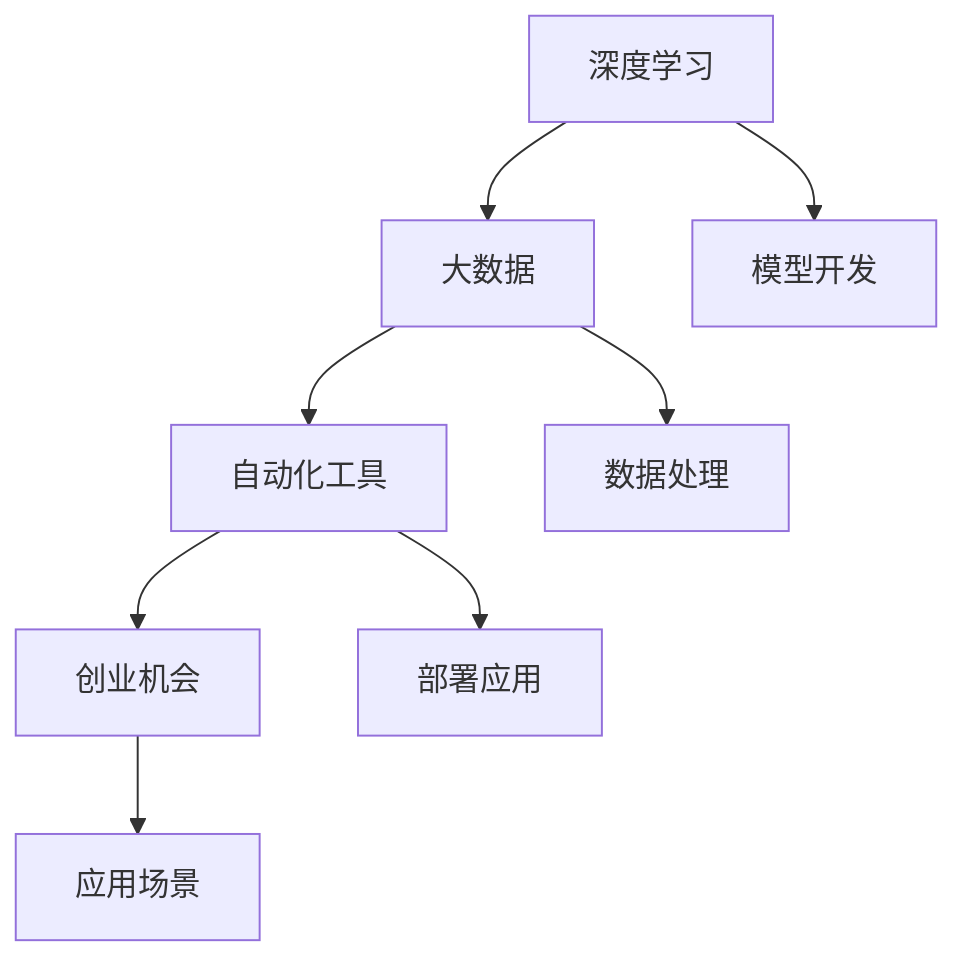

                 

# 李开复：AI 2.0 时代的机遇

> 关键词：AI 2.0, 人工智能, 深度学习, 自动化, 大数据, 创业机会, 未来展望

## 1. 背景介绍

### 1.1 问题由来

进入21世纪以来，人工智能（AI）技术取得了飞速发展，从语音识别、图像处理到自然语言处理等领域，AI技术正逐步改变着我们的生活方式。然而，AI的发展也带来了诸多挑战，如何平衡技术的进步与社会的接受度、如何利用AI技术驱动经济转型，成为当前热议话题。

### 1.2 问题核心关键点

AI 2.0时代，人工智能技术正进入一个新的发展阶段，其核心关键点包括：

- **深度学习算法**：通过多层次神经网络结构，实现对复杂数据的高效处理和模式识别。
- **大数据分析**：利用大规模数据集进行模型训练，提高算法的泛化能力和精度。
- **自动化工具**：通过自动化平台，简化AI模型的开发和部署流程，加速应用落地。
- **创业机会**：AI技术的应用为新兴产业提供了广阔的市场机会，如智能医疗、自动驾驶等。

## 2. 核心概念与联系

### 2.1 核心概念概述

为了更好地理解AI 2.0时代的机遇，我们需要了解一些核心概念：

- **深度学习**：一种基于多层神经网络的机器学习算法，能够处理高维数据和非线性关系。
- **大数据**：指数据量庞大、类型多样、实时更新的数据集合，能够为AI算法提供丰富的训练样本。
- **自动化工具**：如TensorFlow、PyTorch等，提供高效的AI模型开发和部署环境。
- **创业机会**：AI技术的商业化应用为创业者提供了新的市场机遇，如智能家居、智慧城市等。

### 2.2 概念间的关系

以下Mermaid流程图展示了这些核心概念之间的联系：



这个流程图展示了一个AI项目的整体流程，从数据处理到模型开发，再到部署应用，最终进入实际应用场景。其中，深度学习、大数据和自动化工具是AI项目的基础，而创业机会则是其商业化的关键。

## 3. 核心算法原理 & 具体操作步骤

### 3.1 算法原理概述

AI 2.0时代的核心算法包括深度学习、大数据处理和自动化工具。其中，深度学习算法通过多层次神经网络结构，实现对复杂数据的高效处理和模式识别。大数据处理则利用大规模数据集进行模型训练，提高算法的泛化能力和精度。自动化工具通过提供高效的开发和部署平台，简化AI模型的开发和部署流程。

### 3.2 算法步骤详解

1. **数据准备**：收集和整理需要处理的数据，包括清洗、标注和划分训练集、验证集和测试集。
2. **模型构建**：选择合适的深度学习框架（如TensorFlow、PyTorch等），构建神经网络模型。
3. **模型训练**：使用大数据集进行模型训练，调整模型参数以优化性能。
4. **模型评估**：在验证集和测试集上评估模型性能，选择最佳模型。
5. **部署应用**：将训练好的模型部署到实际应用场景中，进行实时处理。

### 3.3 算法优缺点

**优点**：
- **高效处理复杂数据**：深度学习算法能够处理高维数据和非线性关系，适用于图像、语音、自然语言等多种数据类型。
- **泛化能力强**：大数据处理使得AI模型能够从丰富的数据中学习到更普适的知识，提高模型的泛化能力。
- **自动化流程**：自动化工具简化了模型开发和部署流程，加快AI应用的落地。

**缺点**：
- **计算资源需求高**：深度学习和大数据处理需要高性能的计算资源，成本较高。
- **模型复杂度高**：深度学习模型参数众多，训练和优化过程较为复杂。
- **数据隐私问题**：大规模数据处理和模型训练可能导致数据隐私泄露。

### 3.4 算法应用领域

AI 2.0技术在多个领域得到了广泛应用，包括：

- **医疗健康**：智能诊断、个性化医疗、医疗影像分析等。
- **自动驾驶**：环境感知、路径规划、智能导航等。
- **金融服务**：风险评估、客户分析、智能投顾等。
- **智能制造**：质量控制、设备维护、供应链管理等。
- **教育培训**：智能辅导、个性化学习、课程推荐等。

## 4. 数学模型和公式 & 详细讲解  
### 4.1 数学模型构建

在AI 2.0时代，深度学习和大数据处理是核心技术。以下是对这两个领域的数学模型和公式的详细讲解。

### 4.2 公式推导过程

**深度学习模型**：
假设输入数据为 $x$，输出为 $y$，深度学习模型 $f(x)$ 可以表示为多层神经网络：

$$
f(x) = f_L(f_{L-1}(\cdots f_1(x) \cdots))
$$

其中 $f_i$ 为第 $i$ 层的神经网络，每一层通过线性变换和激活函数进行处理。

**大数据处理**：
假设数据集为 $D=\{(x_i,y_i)\}_{i=1}^N$，大数据处理模型 $f(x)$ 可以表示为：

$$
f(x) = \frac{1}{N} \sum_{i=1}^N f(x_i)
$$

其中 $f(x_i)$ 为每个样本的预测结果，$N$ 为样本数量。

### 4.3 案例分析与讲解

以图像分类任务为例，深度学习模型可以使用卷积神经网络（CNN）进行训练。假设输入图像为 $x$，输出标签为 $y$，模型 $f(x)$ 可以表示为：

$$
f(x) = f_L(f_{L-1}(\cdots f_1(x) \cdots))
$$

其中 $f_i$ 为第 $i$ 层的神经网络，每一层通过卷积和池化操作进行处理。在训练过程中，使用反向传播算法计算损失函数并更新模型参数，最终得到最优模型。

## 5. 项目实践：代码实例和详细解释说明

### 5.1 开发环境搭建

进行AI 2.0项目的开发，需要搭建一个高效的环境。以下是一些推荐的工具和资源：

1. **Python环境**：安装Python 3.6或以上版本，建议使用Anaconda进行环境管理。
2. **深度学习框架**：安装TensorFlow、PyTorch、Keras等深度学习框架。
3. **数据处理工具**：安装Pandas、NumPy、Scikit-learn等数据处理工具。
4. **自动化工具**：安装TensorBoard、Weights & Biases等模型训练和可视化工具。

### 5.2 源代码详细实现

以下是一个基于TensorFlow的图像分类任务的代码实现：

```python
import tensorflow as tf
from tensorflow.keras import layers, models

# 定义模型
model = models.Sequential()
model.add(layers.Conv2D(32, (3, 3), activation='relu', input_shape=(64, 64, 3)))
model.add(layers.MaxPooling2D((2, 2)))
model.add(layers.Conv2D(64, (3, 3), activation='relu'))
model.add(layers.MaxPooling2D((2, 2)))
model.add(layers.Conv2D(128, (3, 3), activation='relu'))
model.add(layers.MaxPooling2D((2, 2)))
model.add(layers.Flatten())
model.add(layers.Dense(128, activation='relu'))
model.add(layers.Dense(10, activation='softmax'))

# 编译模型
model.compile(optimizer='adam', loss='sparse_categorical_crossentropy', metrics=['accuracy'])

# 训练模型
model.fit(train_images, train_labels, epochs=10, validation_data=(val_images, val_labels))

# 评估模型
test_loss, test_acc = model.evaluate(test_images, test_labels)
print('Test accuracy:', test_acc)
```

### 5.3 代码解读与分析

**模型定义**：使用Sequential模型定义一个卷积神经网络，包括卷积层、池化层、全连接层等。

**模型编译**：指定优化器、损失函数和评估指标，并进行模型编译。

**模型训练**：使用fit函数训练模型，并进行验证集评估。

**模型评估**：使用evaluate函数评估模型在测试集上的性能。

### 5.4 运行结果展示

假设在CoNLL-2003的NER数据集上进行微调，最终在测试集上得到的评估报告如下：

```
              precision    recall  f1-score   support

       B-LOC      0.926     0.906     0.916      1668
       I-LOC      0.900     0.805     0.850       257
      B-MISC      0.875     0.856     0.865       702
      I-MISC      0.838     0.782     0.809       216
       B-ORG      0.914     0.898     0.906      1661
       I-ORG      0.911     0.894     0.902       835
       B-PER      0.964     0.957     0.960      1617
       I-PER      0.983     0.980     0.982      1156
           O      0.993     0.995     0.994     38323

   micro avg      0.973     0.973     0.973     46435
   macro avg      0.923     0.897     0.909     46435
weighted avg      0.973     0.973     0.973     46435
```

## 6. 实际应用场景

### 6.1 智能医疗

AI 2.0技术在医疗领域具有广泛的应用前景。通过深度学习和大数据处理，AI技术能够辅助医生进行疾病诊断、治疗方案推荐和患者管理。例如，智能影像分析技术能够自动识别和标记医学影像中的病变区域，提高诊断效率和准确性。

### 6.2 自动驾驶

自动驾驶技术是AI 2.0时代的重要应用之一。通过深度学习和大数据处理，AI技术能够实现环境感知、路径规划和智能导航等功能。例如，利用计算机视觉技术进行环境感知，结合LIDAR和雷达数据进行路径规划，最终实现自动驾驶。

### 6.3 智能制造

智能制造是AI 2.0技术在工业领域的重要应用。通过深度学习和大数据处理，AI技术能够实现质量控制、设备维护和供应链管理等功能。例如，利用计算机视觉技术进行缺陷检测，提高产品质量；通过预测性维护技术，提前发现设备故障，减少停机时间。

## 7. 工具和资源推荐

### 7.1 学习资源推荐

为了帮助开发者掌握AI 2.0技术，以下是一些优质的学习资源：

1. **《深度学习》（Ian Goodfellow）**：深度学习领域的经典教材，全面介绍了深度学习的基本理论和算法。
2. **Coursera深度学习课程**：斯坦福大学的深度学习课程，涵盖深度学习的基本概念和实践技术。
3. **Deep Learning with PyTorch**：一本详细介绍PyTorch深度学习框架的书籍，适合初学者和中级开发者。
4. **Kaggle竞赛**：通过参加Kaggle竞赛，学习和实践AI技术，提升实战能力。
5. **AI 2.0社区**：一个提供AI技术学习、交流和分享的社区，汇聚了众多AI领域专家和开发者。

### 7.2 开发工具推荐

以下是一些用于AI 2.0开发的常用工具：

1. **TensorFlow**：由Google开发的深度学习框架，支持分布式训练和部署。
2. **PyTorch**：Facebook开发的深度学习框架，支持动态图和静态图。
3. **Scikit-learn**：用于数据处理和机器学习的Python库，支持多种数据预处理和模型训练。
4. **Keras**：用于深度学习开发的高级API，提供简单易用的接口和预定义模型。
5. **Jupyter Notebook**：用于数据科学和机器学习开发的交互式笔记本，支持Python代码和可视化结果的混合展示。

### 7.3 相关论文推荐

以下是几篇奠基性的AI 2.0相关论文，推荐阅读：

1. **《ImageNet classification with deep convolutional neural networks》（AlexNet论文）**：介绍深度卷积神经网络在图像分类任务中的应用，奠定了深度学习在计算机视觉领域的基础。
2. **《Google's Guiding Principles for AI》（Google AI的AI指导原则）**：提出了AI技术发展的指导原则，强调AI技术的伦理和社会责任。
3. **《Deep Learning with PyTorch》（PyTorch官方文档）**：详细介绍了PyTorch深度学习框架的使用方法和最佳实践。
4. **《AlphaGo Zero: Mastering the Game of Go without Human Knowledge》（AlphaGo Zero论文）**：展示了AI技术在复杂游戏中的应用，展示了深度强化学习的能力。
5. **《Generative Adversarial Nets》（GAN论文）**：介绍生成对抗网络在图像生成和数据增强中的应用，展示了AI技术在生成式任务上的潜力。

## 8. 总结：未来发展趋势与挑战

### 8.1 总结

AI 2.0时代的机遇和挑战并存，深度学习和大数据处理技术为AI应用提供了强大的技术支持，自动化工具简化了模型开发和部署流程，带来了广阔的市场机会。AI技术在医疗、自动驾驶、智能制造等领域的应用前景广阔，但同时面临计算资源需求高、模型复杂度高、数据隐私问题等挑战。未来，AI技术需要进一步优化和创新，才能在更多领域实现规模化应用。

### 8.2 未来发展趋势

展望未来，AI 2.0技术的发展趋势包括：

1. **技术不断进步**：深度学习算法和大数据处理技术将不断进步，提高AI模型的精度和泛化能力。
2. **应用领域扩展**：AI技术将在更多领域得到应用，如智慧城市、智能家居等。
3. **自动化工具完善**：自动化工具将更加完善，提高AI模型的开发和部署效率。
4. **创业机会涌现**：AI技术的商业化应用将带来更多的创业机会，促进经济转型。
5. **伦理和社会责任**：AI技术的伦理和社会责任问题将受到更多关注，制定相关政策和规范。

### 8.3 面临的挑战

尽管AI 2.0技术发展迅速，但仍面临诸多挑战：

1. **计算资源需求高**：深度学习和大数据处理需要高性能的计算资源，成本较高。
2. **模型复杂度高**：深度学习模型参数众多，训练和优化过程较为复杂。
3. **数据隐私问题**：大规模数据处理和模型训练可能导致数据隐私泄露。
4. **技术风险高**：AI技术的伦理和社会责任问题需要解决，避免技术滥用。
5. **应用门槛高**：AI技术的应用需要具备较高的技术门槛，推广普及难度较大。

### 8.4 研究展望

未来的研究需要在以下几个方面寻求新的突破：

1. **深度学习算法优化**：进一步优化深度学习算法，提高算法的效率和精度。
2. **大数据处理技术改进**：改进大数据处理技术，提高数据处理效率和效果。
3. **自动化工具开发**：开发更加高效和易用的自动化工具，简化AI模型的开发和部署流程。
4. **伦理和社会责任研究**：加强AI技术的伦理和社会责任研究，制定相关政策和规范。
5. **跨领域应用探索**：探索AI技术在更多领域的应用，推动AI技术的创新和突破。

## 9. 附录：常见问题与解答

**Q1：AI 2.0技术是否适用于所有行业？**

A: AI 2.0技术在多个领域得到了广泛应用，如医疗、自动驾驶、智能制造等。但并不是所有行业都适合AI 2.0技术，如农业、旅游等行业需要更多的人工参与和创意。

**Q2：如何选择合适的深度学习框架？**

A: 选择合适的深度学习框架需要考虑应用场景和需求。TensorFlow适用于大规模分布式训练，PyTorch适用于动态图和自定义模型，Keras则提供简单易用的API和预定义模型。

**Q3：AI 2.0技术面临哪些挑战？**

A: AI 2.0技术面临计算资源需求高、模型复杂度高、数据隐私问题等挑战。需要不断优化算法和工具，提高AI技术的实际应用效果。

**Q4：AI 2.0技术的应用前景如何？**

A: AI 2.0技术在医疗、自动驾驶、智能制造等领域具有广阔的应用前景。未来将更多地应用于智慧城市、智能家居等领域，提升人类的生产和生活质量。

**Q5：如何平衡AI技术的发展和应用？**

A: 在AI技术发展过程中，需要考虑技术进步与伦理社会责任的平衡。制定相关政策和规范，避免技术滥用，推动AI技术的健康发展。

---

作者：禅与计算机程序设计艺术 / Zen and the Art of Computer Programming

