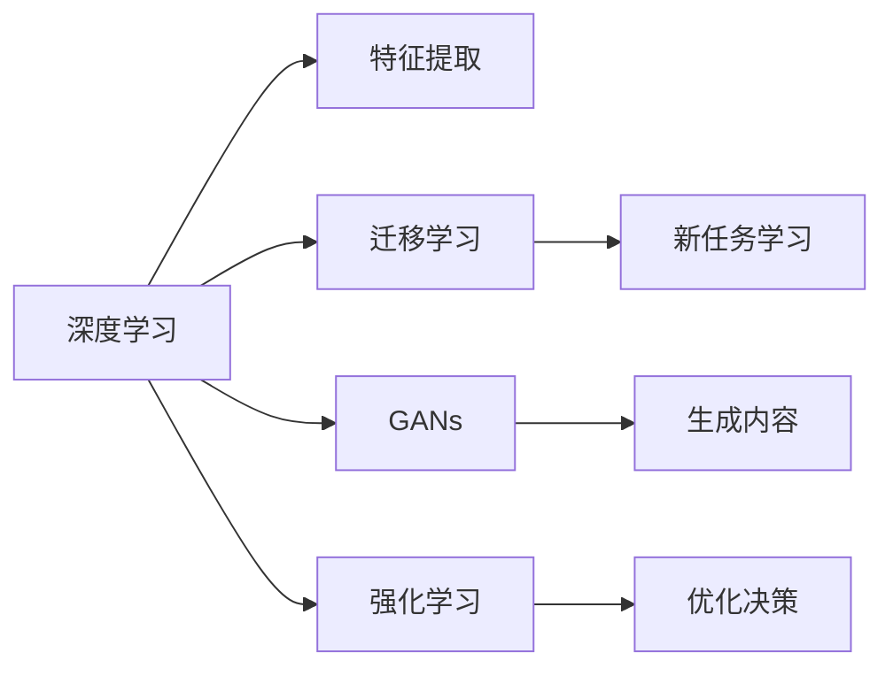

                 

# 李开复：AI 2.0 时代的社会价值

## 1. 背景介绍

人工智能（AI）已经深刻地改变了我们的工作、生活和商业。从AI 1.0时代的专家系统，到AI 2.0时代的深度学习，再到即将到来的AI 3.0时代的通用人工智能，AI技术的发展日新月异，其社会价值也日益凸显。本文将探讨AI 2.0时代的社会价值，并分析其在各行各业中的潜在影响和应用。

### 1.1 人工智能的历史演进

人工智能的历史可以追溯到1956年达特茅斯会议的召开，标志着AI领域的诞生。在AI 1.0时代，专家系统利用知识库和推理规则进行决策，广泛应用于医疗、金融等领域。随着深度学习等算法的出现，AI技术进入了AI 2.0时代，通过大规模数据训练的深度神经网络模型，AI逐渐能够进行更复杂的图像识别、自然语言处理和推荐系统等任务。

### 1.2 AI 2.0 时代的特点

AI 2.0时代主要特点包括：
- **大数据**：利用大数据进行模型训练，提升模型的准确性和泛化能力。
- **深度学习**：利用深度神经网络进行特征学习和模式识别。
- **自主学习**：AI模型能够自主学习并优化，无需人工干预。
- **跨领域应用**：AI技术在医疗、金融、教育、娱乐等多个领域广泛应用。

## 2. 核心概念与联系

### 2.1 核心概念概述

在AI 2.0时代，核心概念包括：
- **深度学习**：利用多层神经网络进行特征提取和分类，广泛应用于图像识别、自然语言处理等领域。
- **迁移学习**：利用已有模型在其他任务上的学习成果，加速新任务上的学习。
- **生成对抗网络（GANs）**：通过生成模型和判别模型的对抗训练，生成高质量的图像、视频等内容。
- **强化学习**：通过与环境的交互，优化决策策略，广泛应用于游戏、机器人等领域。

### 2.2 概念间的关系

这些核心概念之间存在着紧密的联系，形成了AI 2.0技术的生态系统。

- **深度学习与迁移学习**：深度学习提供了强大的特征提取能力，而迁移学习则利用已有模型，加速新任务的学习。
- **GANs 与深度学习**：GANs 是一种特殊的深度学习模型，通过生成模型和判别模型的对抗训练，生成逼真的图像、视频等。
- **强化学习与深度学习**：强化学习通过与环境的交互，优化决策策略，而深度学习提供了更强大的特征表示能力。

这些概念相互作用，共同推动了AI 2.0技术的发展，使其在各个领域中发挥了巨大的社会价值。

### 2.3 核心概念的整体架构

以下是一个综合的流程图，展示了AI 2.0技术的关键组成部分及其之间的关系：



这个流程图展示了从深度学习到生成对抗网络，再到强化学习的整体架构。其中，深度学习提供了特征提取的能力，迁移学习加速新任务的学习，GANs 生成高质量内容，强化学习优化决策策略。这些概念共同构成了AI 2.0技术的核心。

## 3. 核心算法原理 & 具体操作步骤

### 3.1 算法原理概述

AI 2.0时代，核心算法包括深度学习、迁移学习和强化学习。这些算法原理概述如下：

- **深度学习**：利用多层神经网络进行特征提取和分类，如图像识别、自然语言处理等领域。
- **迁移学习**：利用已有模型在其他任务上的学习成果，加速新任务的学习，如图像分类、目标检测等领域。
- **强化学习**：通过与环境的交互，优化决策策略，如机器人控制、游戏AI等领域。

### 3.2 算法步骤详解

以深度学习为例，具体算法步骤如下：

1. **数据准备**：收集和标注数据集。
2. **模型构建**：构建多层神经网络模型。
3. **模型训练**：利用训练集对模型进行训练。
4. **模型验证**：在验证集上评估模型性能，调整模型参数。
5. **模型应用**：在测试集上评估模型性能，部署到实际应用中。

以迁移学习为例，具体算法步骤如下：

1. **预训练模型选择**：选择已有的大规模预训练模型。
2. **任务适配层设计**：设计针对新任务的任务适配层。
3. **微调**：在预训练模型上进行微调，适应新任务。
4. **模型评估**：在测试集上评估模型性能，调整模型参数。

以强化学习为例，具体算法步骤如下：

1. **环境建模**：建立环境模型，定义状态、动作和奖励。
2. **策略设计**：设计强化学习策略，如Q-learning、SARSA等。
3. **策略优化**：通过与环境的交互，优化策略参数。
4. **策略应用**：将优化后的策略应用于实际问题中。

### 3.3 算法优缺点

这些核心算法各具优缺点，总结如下：

- **深度学习**：优点在于强大的特征提取能力，缺点在于需要大量数据和计算资源。
- **迁移学习**：优点在于加速新任务的学习，缺点在于数据分布差异可能影响性能。
- **强化学习**：优点在于能够自适应环境，缺点在于需要大量的实验和调整。

### 3.4 算法应用领域

这些核心算法在各个领域中得到了广泛应用：

- **深度学习**：广泛应用于图像识别、自然语言处理、推荐系统等领域。
- **迁移学习**：应用于医学影像诊断、金融风险评估、自然语言生成等领域。
- **强化学习**：应用于机器人控制、游戏AI、自动驾驶等领域。

## 4. 数学模型和公式 & 详细讲解 & 举例说明

### 4.1 数学模型构建

以深度学习为例，其数学模型可以表示为：

$$ y = f(x; \theta) $$

其中，$y$ 表示输出，$x$ 表示输入，$\theta$ 表示模型参数。常用的深度学习模型包括卷积神经网络（CNN）、循环神经网络（RNN）、长短时记忆网络（LSTM）等。

### 4.2 公式推导过程

以CNN为例，其公式推导过程如下：

1. **卷积层**：利用卷积核进行特征提取。
2. **池化层**：利用池化操作进行特征降维。
3. **全连接层**：将卷积和池化后的特征进行分类。

以迁移学习为例，其数学模型可以表示为：

$$ y = f_{T2}(x; \theta_T, \theta_2) $$

其中，$y$ 表示输出，$x$ 表示输入，$\theta_T$ 表示预训练模型的参数，$\theta_2$ 表示任务适配层的参数。

### 4.3 案例分析与讲解

以迁移学习在图像分类任务中的应用为例：

1. **预训练模型选择**：选择VGG16作为预训练模型。
2. **任务适配层设计**：在VGG16的顶部添加一个全连接层，进行分类。
3. **微调**：在VGG16上进行微调，适应新的图像分类任务。
4. **模型评估**：在测试集上评估模型性能，调整模型参数。

## 5. 项目实践：代码实例和详细解释说明

### 5.1 开发环境搭建

为了进行AI 2.0技术的项目实践，需要搭建开发环境。以下是使用Python进行TensorFlow开发的环境配置流程：

1. **安装Anaconda**：从官网下载并安装Anaconda，用于创建独立的Python环境。

2. **创建并激活虚拟环境**：
```bash
conda create -n tensorflow-env python=3.8 
conda activate tensorflow-env
```

3. **安装TensorFlow**：根据CUDA版本，从官网获取对应的安装命令。例如：
```bash
conda install tensorflow==2.7 -c tf
```

4. **安装各类工具包**：
```bash
pip install numpy pandas scikit-learn matplotlib tqdm jupyter notebook ipython
```

完成上述步骤后，即可在`tensorflow-env`环境中开始项目实践。

### 5.2 源代码详细实现

以下是一个简单的TensorFlow代码示例，用于图像分类任务：

```python
import tensorflow as tf
from tensorflow.keras import layers, models

# 定义模型结构
model = models.Sequential([
    layers.Conv2D(32, (3, 3), activation='relu', input_shape=(28, 28, 1)),
    layers.MaxPooling2D((2, 2)),
    layers.Conv2D(64, (3, 3), activation='relu'),
    layers.MaxPooling2D((2, 2)),
    layers.Flatten(),
    layers.Dense(64, activation='relu'),
    layers.Dense(10)
])

# 编译模型
model.compile(optimizer='adam', loss=tf.keras.losses.SparseCategoricalCrossentropy(from_logits=True), metrics=['accuracy'])

# 训练模型
model.fit(train_images, train_labels, epochs=10, validation_data=(test_images, test_labels))

# 评估模型
test_loss, test_acc = model.evaluate(test_images, test_labels)
print('Test accuracy:', test_acc)
```

### 5.3 代码解读与分析

这个代码示例展示了如何使用TensorFlow进行图像分类任务。具体步骤如下：

1. **模型构建**：定义多层神经网络模型，包括卷积层、池化层和全连接层。
2. **模型编译**：选择优化器和损失函数，并设置评估指标。
3. **模型训练**：使用训练集对模型进行训练，并设置验证集。
4. **模型评估**：在测试集上评估模型性能。

## 6. 实际应用场景

### 6.1 医疗影像诊断

AI 2.0技术在医疗影像诊断中得到了广泛应用，如图像分类、病灶检测等。通过深度学习算法，AI系统可以自动识别病变区域，辅助医生进行诊断和治疗。

### 6.2 金融风险评估

在金融领域，AI 2.0技术可以应用于信用评估、欺诈检测等任务。通过迁移学习算法，利用已有模型对新任务进行加速学习，从而提升金融风险评估的准确性和效率。

### 6.3 自然语言生成

AI 2.0技术在自然语言生成方面也表现出色，如机器翻译、自动摘要、对话系统等。通过生成对抗网络算法，AI系统可以生成高质量的文本内容，提升用户体验。

### 6.4 未来应用展望

未来，AI 2.0技术将更加普及，应用于更多领域，带来更广泛的社会价值。例如，在教育领域，AI可以提供个性化教学、智能辅导等；在城市治理中，AI可以应用于交通管理、环境监测等领域。

## 7. 工具和资源推荐

### 7.1 学习资源推荐

为了帮助开发者系统掌握AI 2.0技术，这里推荐一些优质的学习资源：

1. **《Deep Learning》（Ian Goodfellow）**：深度学习领域的经典教材，系统介绍了深度学习的理论基础和实践应用。
2. **Coursera的深度学习课程**：由斯坦福大学的Andrew Ng教授主讲，覆盖深度学习的基本概念和算法。
3. **TensorFlow官方文档**：提供了丰富的API文档和教程，帮助开发者快速上手TensorFlow开发。
4. **Kaggle竞赛**：数据科学和机器学习领域的知名竞赛平台，提供大量的数据集和挑战，实践AI 2.0技术。
5. **GitHub开源项目**：参与和贡献开源项目，学习和分享AI 2.0技术的最新进展。

### 7.2 开发工具推荐

高效的开发离不开优秀的工具支持。以下是几款用于AI 2.0技术开发的常用工具：

1. **TensorFlow**：基于Python的开源深度学习框架，灵活的计算图和自动微分功能，适合快速迭代研究。
2. **PyTorch**：基于Python的开源深度学习框架，动态计算图和丰富的API支持，适合科学研究。
3. **Keras**：基于TensorFlow和Theano的高层次API，易于上手，适合快速原型开发。
4. **Jupyter Notebook**：交互式笔记本环境，支持Python代码、Markdown和LaTeX等格式，方便实验和文档记录。
5. **Google Colab**：谷歌提供的免费Jupyter Notebook环境，支持GPU和TPU算力，方便实验和共享。

### 7.3 相关论文推荐

AI 2.0技术的发展离不开学界的持续研究。以下是几篇奠基性的相关论文，推荐阅读：

1. **《ImageNet Classification with Deep Convolutional Neural Networks》（AlexNet论文）**：提出了卷积神经网络模型，应用于图像分类任务，取得了优异的效果。
2. **《Convolutional Neural Networks for Fast Object Recognition》（VGG论文）**：详细介绍了卷积神经网络的设计和实现，推动了计算机视觉领域的发展。
3. **《A Systematic Benchmarking of Deep Learning Architectures》（ResNet论文）**：提出了残差网络模型，进一步提升了深度神经网络的性能。
4. **《Transfer Learning from Large-Scale Unlabelled Video to Final Classification Tasks》（TVM论文）**：提出了迁移学习算法，加速新任务的学习。
5. **《Playing Atari with Real-Time Reinforcement Learning》（DQN论文）**：提出了深度强化学习算法，应用于游戏AI领域，取得了显著的成果。

这些论文代表了AI 2.0技术的发展脉络，通过学习这些前沿成果，可以帮助研究者把握学科前进方向，激发更多的创新灵感。

## 8. 总结：未来发展趋势与挑战

### 8.1 总结

本文对AI 2.0技术进行了全面系统的介绍，探讨了其社会价值和应用前景。AI 2.0技术利用深度学习、迁移学习和强化学习等算法，在各个领域中展示了强大的潜力，推动了技术的广泛应用。

### 8.2 未来发展趋势

未来，AI 2.0技术将呈现以下几个发展趋势：

1. **算力提升**：随着硬件技术的进步，算力成本不断下降，深度学习模型的规模将不断扩大。
2. **多模态融合**：利用深度学习、迁移学习和强化学习等算法，实现多模态数据的融合和协同建模。
3. **迁移学习**：迁移学习技术将得到广泛应用，加速新任务的加速学习。
4. **强化学习**：强化学习算法将应用于更多领域，如自动驾驶、机器人控制等。
5. **跨领域应用**：AI 2.0技术将在更多领域得到应用，推动各行业的智能化升级。

### 8.3 面临的挑战

尽管AI 2.0技术已经取得了瞩目成就，但在迈向更加智能化、普适化应用的过程中，仍面临诸多挑战：

1. **数据隐私**：AI 2.0技术需要大量数据，但数据隐私和安全问题必须得到重视。
2. **算法透明性**：AI 2.0技术的决策过程缺乏可解释性，难以对其推理逻辑进行分析和调试。
3. **伦理问题**：AI 2.0技术可能带来伦理和社会问题，如就业、隐私、公平性等。
4. **计算资源**：AI 2.0技术需要大量的计算资源，如何优化资源利用率是一个重要课题。
5. **技术壁垒**：AI 2.0技术的实现需要高水平的算法和工程能力，技术壁垒较高。

### 8.4 研究展望

面对AI 2.0技术面临的挑战，未来的研究需要在以下几个方面寻求新的突破：

1. **隐私保护技术**：发展隐私保护算法和机制，确保数据隐私和安全。
2. **可解释性算法**：开发可解释性强的AI模型，提高算法的透明性和可解释性。
3. **伦理规范**：制定AI 2.0技术的伦理规范，确保技术应用符合社会价值观和伦理道德。
4. **资源优化**：优化计算图和算法，提高资源利用效率，降低计算成本。
5. **跨学科研究**：结合计算机科学、数学、社会学等学科，推动AI 2.0技术的发展和应用。

## 9. 附录：常见问题与解答

**Q1：AI 2.0技术的主要优势和局限性是什么？**

A: AI 2.0技术的主要优势包括：
- **强大的数据处理能力**：深度学习、迁移学习和强化学习等算法能够处理大规模数据，提升模型的泛化能力。
- **高效的模型训练**：利用大规模预训练模型和加速学习算法，能够快速训练高质量的模型。
- **广泛的应用场景**：AI 2.0技术在医疗、金融、教育、娱乐等领域得到了广泛应用。

其局限性包括：
- **数据隐私问题**：AI 2.0技术需要大量数据，但数据隐私和安全问题必须得到重视。
- **算法透明性**：AI 2.0技术的决策过程缺乏可解释性，难以对其推理逻辑进行分析和调试。
- **技术壁垒高**：AI 2.0技术的实现需要高水平的算法和工程能力，技术壁垒较高。

**Q2：AI 2.0技术在医疗领域的应用前景如何？**

A: AI 2.0技术在医疗领域具有广泛的应用前景，例如：
- **医学影像诊断**：利用深度学习算法，自动识别病变区域，辅助医生进行诊断和治疗。
- **基因分析**：利用深度学习算法，分析基因序列，发现疾病的遗传因素。
- **个性化医疗**：利用AI技术，根据患者的具体情况，制定个性化的治疗方案。

**Q3：AI 2.0技术在金融领域的应用前景如何？**

A: AI 2.0技术在金融领域具有广泛的应用前景，例如：
- **信用评估**：利用深度学习算法，分析用户的历史行为数据，评估其信用风险。
- **欺诈检测**：利用深度学习算法，识别和防范欺诈行为。
- **量化交易**：利用AI技术，分析市场数据，优化投资决策。

**Q4：AI 2.0技术在教育领域的应用前景如何？**

A: AI 2.0技术在教育领域具有广泛的应用前景，例如：
- **个性化教学**：利用AI技术，根据学生的学习情况，制定个性化的学习计划。
- **智能辅导**：利用AI技术，提供智能化的学习辅导和反馈。
- **课程推荐**：利用AI技术，推荐适合学生的课程和教材。

**Q5：AI 2.0技术在城市治理中的应用前景如何？**

A: AI 2.0技术在城市治理中具有广泛的应用前景，例如：
- **交通管理**：利用AI技术，优化交通信号灯和路网布局，减少交通拥堵。
- **环境监测**：利用AI技术，实时监测环境数据，预防和应对环境问题。
- **应急指挥**：利用AI技术，分析和预测突发事件，优化应急响应。

---

作者：禅与计算机程序设计艺术 / Zen and the Art of Computer Programming

