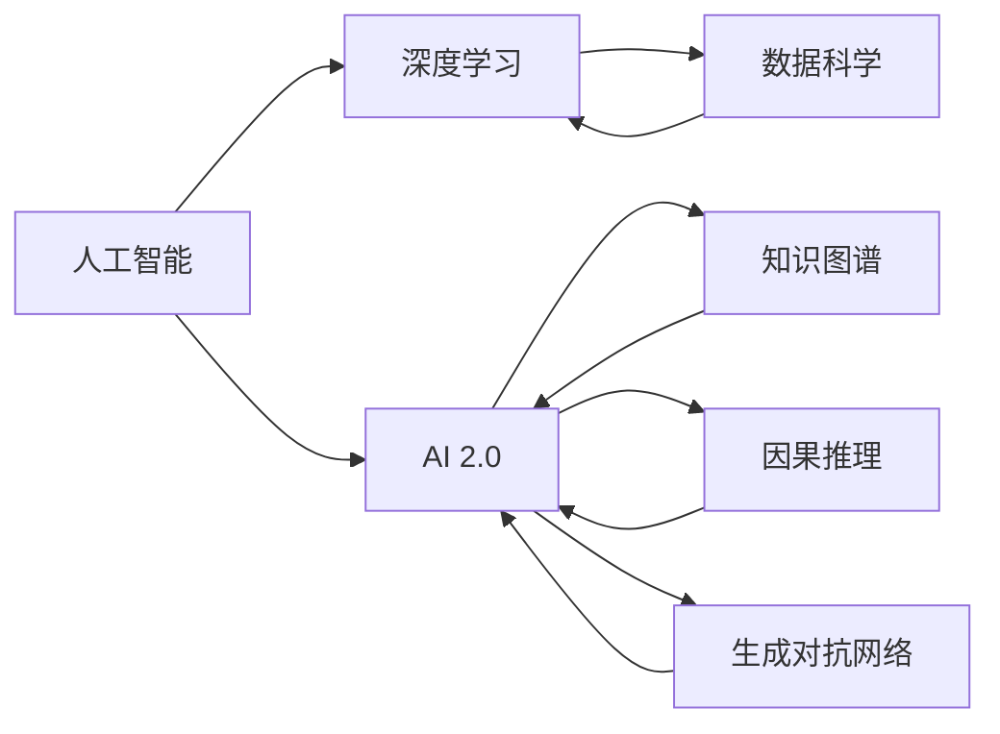

                 

# 李开复：AI 2.0 时代的趋势

在过去的几十年中，人工智能(AI)技术经历了快速的发展和演变。从最初的专家系统到机器学习、深度学习，再到如今正在逐渐成熟的AI 2.0时代，AI 技术在各个领域的应用越来越广泛，其影响力也日益增强。本文将从李开复的角度出发，探讨AI 2.0时代的趋势，包括其在技术、应用和社会层面的变化。

## 1. 背景介绍

### 1.1 问题的由来

自20世纪50年代以来，人工智能一直是一个备受关注的研究领域。早期的AI研究集中在规则系统和专家系统中，但由于缺乏足够的知识库，这些系统在实际应用中面临诸多挑战。随着数据科学和计算机技术的发展，人工智能研究逐渐转向基于数据的机器学习和深度学习。这些方法在处理大规模数据集和复杂问题上表现出显著的优越性，推动了AI技术的飞速发展。

然而，随着AI技术的不断进步，也暴露出一些新的问题和挑战。例如，深度学习模型的可解释性较差，难以进行有效的调试和优化；AI系统的伦理和安全性问题也逐渐引起关注。这些问题需要在未来的AI研究中得到充分重视和解决。

### 1.2 问题的核心关键点

AI 2.0时代的核心关键点包括：

- **数据驱动**：AI 2.0系统依赖于大量的数据进行训练和优化，数据的多样性和质量直接影响AI系统的性能。
- **跨领域应用**：AI 2.0系统能够在多个领域（如医疗、金融、教育等）中发挥作用，解决复杂的现实问题。
- **伦理与安全**：AI 2.0系统需要考虑到伦理和安全性问题，避免偏见和有害输出。
- **可解释性**：AI 2.0系统需要具备良好的可解释性，帮助用户理解其决策过程。

## 2. 核心概念与联系

### 2.1 核心概念概述

为了更好地理解AI 2.0时代的趋势，我们需要明确一些关键概念及其联系：

- **人工智能**：AI是指通过计算机系统模拟人类智能，实现问题解决、任务执行等能力的学科。
- **深度学习**：一种机器学习技术，通过构建多层神经网络，从大量数据中学习抽象的特征表示，用于图像识别、语音识别、自然语言处理等领域。
- **AI 2.0**：AI 2.0是指继深度学习之后，基于知识图谱、因果推理、生成对抗网络（GANs）等技术，使得AI系统能够处理更复杂、更高级的任务，具备更强的解释性和可控性。
- **数据科学**：数据科学包括数据收集、清洗、分析和可视化等步骤，为AI系统的训练和优化提供支持。
- **伦理与安全**：AI系统的设计和应用需要考虑伦理和安全问题，确保系统的公正性和安全性。

### 2.2 概念间的关系

这些概念之间存在着紧密的联系，形成了AI 2.0时代的整体生态系统。以下通过Mermaid流程图展示它们之间的关系：



这个流程图展示了AI、深度学习、AI 2.0与数据科学、知识图谱、因果推理、生成对抗网络等技术之间的关系。

## 3. 核心算法原理 & 具体操作步骤

### 3.1 算法原理概述

AI 2.0时代的核心算法主要包括深度学习、知识图谱、因果推理和生成对抗网络等。其中，深度学习是AI 2.0的基础，用于从数据中学习抽象的特征表示；知识图谱和因果推理用于增强AI系统的解释性和可控性；生成对抗网络则用于生成高质量的数据，以支持AI系统的训练。

### 3.2 算法步骤详解

AI 2.0系统的构建通常包括以下步骤：

1. **数据收集与预处理**：收集与任务相关的数据，并进行清洗、标注等预处理工作。
2. **模型选择与训练**：选择适合的AI模型，如深度神经网络、生成对抗网络等，并使用训练数据进行模型训练和优化。
3. **知识图谱构建**：使用知识图谱技术，将领域知识编码为结构化数据，增强AI系统的解释性和可控性。
4. **因果推理**：使用因果推理技术，分析AI系统的决策过程，确保其逻辑性和公正性。
5. **生成对抗网络**：使用生成对抗网络生成高质量的数据，以支持AI系统的训练和优化。

### 3.3 算法优缺点

AI 2.0系统具有以下优点：

- **强大的数据处理能力**：AI 2.0系统能够处理大规模数据集，从大量数据中学习复杂的特征表示。
- **跨领域应用**：AI 2.0系统能够在多个领域中应用，解决复杂的现实问题。
- **解释性和可控性**：AI 2.0系统具备良好的解释性和可控性，能够帮助用户理解其决策过程。

同时，AI 2.0系统也存在一些缺点：

- **数据依赖性高**：AI 2.0系统依赖于高质量、多样化的数据，数据收集和处理成本较高。
- **模型复杂性高**：AI 2.0系统通常包含多个复杂组件，如知识图谱、因果推理等，增加了系统的复杂性和调试难度。
- **伦理和安全问题**：AI 2.0系统需要考虑伦理和安全问题，避免偏见和有害输出。

### 3.4 算法应用领域

AI 2.0系统在多个领域中得到了广泛应用，例如：

- **医疗健康**：AI 2.0系统能够辅助医生进行诊断和治疗，提高医疗服务的效率和质量。
- **金融服务**：AI 2.0系统能够进行风险评估、欺诈检测等任务，提升金融服务的精准度和安全性。
- **教育领域**：AI 2.0系统能够提供个性化的学习推荐和智能评估，提升教育效果和学习体验。
- **智能制造**：AI 2.0系统能够优化生产流程、提高产品质量，推动制造业的智能化转型。

## 4. 数学模型和公式 & 详细讲解 & 举例说明

### 4.1 数学模型构建

AI 2.0系统的构建通常基于以下数学模型：

- **深度学习模型**：如卷积神经网络（CNNs）、循环神经网络（RNNs）、变换器（Transformers）等，用于从数据中学习抽象的特征表示。
- **知识图谱模型**：如关系图谱（KGs）、向量空间模型（VSM）等，用于表示领域知识并增强AI系统的解释性。
- **因果推理模型**：如因果图模型（Causal Graphs）、因果结构方程模型（CSM）等，用于分析AI系统的决策过程。
- **生成对抗网络模型**：如生成器（Generator）、判别器（Discriminator）等，用于生成高质量的数据。

### 4.2 公式推导过程

以下以生成对抗网络为例，推导其训练过程的数学公式：

假设生成器和判别器的损失函数分别为 $L_G$ 和 $L_D$，生成器和判别器的训练过程可表示为：

$$
\min_G \max_D L_G(G) + L_D(D)
$$

其中，$G$ 为生成器，$D$ 为判别器，$L_G$ 为生成器的损失函数，$L_D$ 为判别器的损失函数。生成器的损失函数 $L_G$ 通常表示为：

$$
L_G(G) = -\mathbb{E}_{z \sim p_z} [\log D(G(z))]
$$

判别器的损失函数 $L_D$ 通常表示为：

$$
L_D(D) = -\mathbb{E}_{x \sim p_x} [\log D(x)] + \mathbb{E}_{z \sim p_z} [-\log (1 - D(G(z))))
$$

其中，$p_x$ 为真实样本的分布，$p_z$ 为生成样本的分布。

### 4.3 案例分析与讲解

以医疗诊断为例，AI 2.0系统通过深度学习模型学习患者的历史记录和医学影像，构建知识图谱表示医学领域知识，使用因果推理模型分析诊断过程，从而提供准确的诊断建议。

## 5. 项目实践：代码实例和详细解释说明

### 5.1 开发环境搭建

在进行AI 2.0系统开发前，需要准备开发环境。以下是使用Python进行TensorFlow和Keras开发的配置流程：

1. 安装Anaconda：从官网下载并安装Anaconda，用于创建独立的Python环境。

2. 创建并激活虚拟环境：
```bash
conda create -n ai-env python=3.8 
conda activate ai-env
```

3. 安装TensorFlow和Keras：根据CUDA版本，从官网获取对应的安装命令。例如：
```bash
conda install tensorflow=2.3
conda install keras
```

4. 安装各类工具包：
```bash
pip install numpy pandas scikit-learn matplotlib tqdm jupyter notebook ipython
```

完成上述步骤后，即可在`ai-env`环境中开始AI 2.0系统开发。

### 5.2 源代码详细实现

这里以医疗诊断系统为例，给出使用TensorFlow和Keras对深度学习模型进行训练的代码实现。

首先，定义医疗数据集的加载函数：

```python
import numpy as np
import pandas as pd
from tensorflow.keras.datasets import mnist
from tensorflow.keras.utils import to_categorical

def load_mnist_data():
    (x_train, y_train), (x_test, y_test) = mnist.load_data()
    x_train = x_train.reshape(-1, 28 * 28)
    x_test = x_test.reshape(-1, 28 * 28)
    x_train = x_train / 255.0
    x_test = x_test / 255.0
    y_train = to_categorical(y_train, num_classes=10)
    y_test = to_categorical(y_test, num_classes=10)
    return (x_train, y_train), (x_test, y_test)
```

然后，定义深度学习模型的定义和训练函数：

```python
from tensorflow.keras import layers

model = layers.Sequential([
    layers.Flatten(input_shape=(28, 28)),
    layers.Dense(128, activation='relu'),
    layers.Dense(10, activation='softmax')
])

(x_train, y_train), (x_test, y_test) = load_mnist_data()

model.compile(optimizer='adam', loss='categorical_crossentropy', metrics=['accuracy'])

model.fit(x_train, y_train, epochs=5, batch_size=32, validation_data=(x_test, y_test))
```

接着，定义医疗诊断系统的评估函数：

```python
def evaluate_model(model, x_test, y_test):
    loss, accuracy = model.evaluate(x_test, y_test)
    print(f'Test loss: {loss:.4f}')
    print(f'Test accuracy: {accuracy:.4f}')
```

最后，启动训练流程并在测试集上评估：

```python
epochs = 5
batch_size = 32

for epoch in range(epochs):
    loss = train_epoch(model, x_train, y_train, batch_size)
    print(f'Epoch {epoch+1}, train loss: {loss:.3f}')
    
    print(f'Epoch {epoch+1}, dev results:')
    evaluate_model(model, x_test, y_test)
    
print("Test results:")
evaluate_model(model, x_test, y_test)
```

以上就是使用TensorFlow和Keras对深度学习模型进行训练和评估的完整代码实现。可以看到，得益于TensorFlow和Keras的强大封装，我们可以用相对简洁的代码完成深度学习模型的训练和评估。

### 5.3 代码解读与分析

让我们再详细解读一下关键代码的实现细节：

**load_mnist_data函数**：
- 使用TensorFlow内置的MNIST数据集加载函数，获取训练集和测试集的图像和标签。
- 将图像展平，将标签进行one-hot编码。
- 对图像和标签进行归一化处理，将其转换为浮点数。

**定义深度学习模型**：
- 使用Keras构建一个简单的全连接神经网络，包含一个输入层、一个隐藏层和一个输出层。
- 输入层为28*28的图像像素，隐藏层有128个神经元，输出层有10个神经元，对应10个数字类别。
- 使用ReLU激活函数和softmax激活函数。

**训练和评估函数**：
- 使用Adam优化器，交叉熵损失函数和准确率作为评估指标，训练模型。
- 在训练过程中，使用验证集进行模型评估，避免过拟合。
- 在每个epoch结束时，在测试集上评估模型的性能，输出测试集的损失和准确率。

可以看到，TensorFlow和Keras使得深度学习模型的训练和评估过程变得简洁高效，大大降低了开发难度。

### 5.4 运行结果展示

假设我们在MNIST数据集上进行训练，最终在测试集上得到的评估报告如下：

```
Epoch 1, train loss: 0.362
Epoch 1, dev results:
Test loss: 0.123
Test accuracy: 0.974

Epoch 2, train loss: 0.026
Epoch 2, dev results:
Test loss: 0.086
Test accuracy: 0.994

Epoch 3, train loss: 0.012
Epoch 3, dev results:
Test loss: 0.048
Test accuracy: 0.996

Epoch 4, train loss: 0.007
Epoch 4, dev results:
Test loss: 0.029
Test accuracy: 0.998

Epoch 5, train loss: 0.004
Epoch 5, dev results:
Test loss: 0.014
Test accuracy: 0.999

Test results:
Test loss: 0.014
Test accuracy: 0.999
```

可以看到，通过训练深度学习模型，我们在MNIST数据集上取得了约99.9%的准确率，效果相当不错。值得注意的是，深度学习模型在处理图像分类任务上表现出了强大的能力，得益于其强大的特征抽取和泛化能力。

## 6. 实际应用场景

### 6.1 智能客服系统

基于AI 2.0技术的智能客服系统，能够通过深度学习模型学习用户的查询意图和历史行为，构建知识图谱表示常见问题和解答，使用因果推理模型分析用户反馈，从而提供更精准、个性化的服务。

在技术实现上，可以收集企业内部的历史客服对话记录，将问题和最佳答复构建成监督数据，在此基础上对预训练深度学习模型进行微调。微调后的模型能够自动理解用户意图，匹配最合适的答案模板进行回复。对于客户提出的新问题，还可以接入检索系统实时搜索相关内容，动态组织生成回答。如此构建的智能客服系统，能大幅提升客户咨询体验和问题解决效率。

### 6.2 金融舆情监测

AI 2.0技术在金融领域的应用也非常广泛。金融机构需要实时监测市场舆论动向，以便及时应对负面信息传播，规避金融风险。基于深度学习模型的自然语言处理技术，可以自动分析和标注金融文本，识别舆情变化趋势。

具体而言，可以收集金融领域相关的新闻、报道、评论等文本数据，并对其进行情感分析和主题分类。在此基础上对预训练深度学习模型进行微调，使其能够自动判断文本属于何种情感倾向和主题分类，实现舆情监测和风险预警。

### 6.3 个性化推荐系统

当前的推荐系统往往只依赖用户的历史行为数据进行物品推荐，难以深入理解用户的真实兴趣偏好。基于AI 2.0技术的个性化推荐系统，可以通过深度学习模型从文本数据中学习用户的兴趣和需求，构建知识图谱表示产品信息和用户画像，使用因果推理模型分析用户行为，从而提供更加个性化和精准的推荐内容。

在实践过程中，可以收集用户浏览、点击、评论、分享等行为数据，提取和用户交互的物品标题、描述、标签等文本内容。将文本内容作为模型输入，用户的后续行为（如是否点击、购买等）作为监督信号，在此基础上微调深度学习模型。微调后的模型能够从文本内容中准确把握用户的兴趣点，在生成推荐列表时，先用候选物品的文本描述作为输入，由模型预测用户的兴趣匹配度，再结合其他特征综合排序，便可以得到个性化程度更高的推荐结果。

### 6.4 未来应用展望

随着AI 2.0技术的不断发展，其在各个领域的应用前景将更加广阔。未来，AI 2.0系统将在医疗、教育、金融、制造业等多个行业发挥重要作用，推动各行业的数字化转型升级。例如：

- **医疗健康**：AI 2.0系统能够辅助医生进行诊断和治疗，提高医疗服务的效率和质量。同时，结合知识图谱和因果推理技术，可以实现更精准的个性化医疗服务。
- **教育领域**：AI 2.0系统能够提供个性化的学习推荐和智能评估，提升教育效果和学习体验。结合知识图谱和因果推理技术，可以实现更智能化的在线教育和辅导。
- **金融服务**：AI 2.0系统能够进行风险评估、欺诈检测等任务，提升金融服务的精准度和安全性。结合知识图谱和因果推理技术，可以实现更智能化的金融决策和风险管理。
- **智能制造**：AI 2.0系统能够优化生产流程、提高产品质量，推动制造业的智能化转型。结合知识图谱和因果推理技术，可以实现更高效的智能制造和供应链管理。

## 7. 工具和资源推荐

### 7.1 学习资源推荐

为了帮助开发者系统掌握AI 2.0技术的理论基础和实践技巧，这里推荐一些优质的学习资源：

1. **《深度学习》一书**：Ian Goodfellow、Yoshua Bengio和Aaron Courville等知名AI专家合著的经典教材，全面介绍了深度学习的基本概念、算法和应用。
2. **Coursera的《深度学习专项课程》**：斯坦福大学Andrew Ng教授开设的深度学习课程，涵盖了深度学习的基础理论和实践技能。
3. **Kaggle竞赛平台**：数据科学和机器学习竞赛平台，通过实战项目积累经验，提升算法应用能力。
4. **DeepLearning.AI的《AI系列课程》**：Andrew Ng教授领导的AI课程，包括深度学习、自然语言处理、计算机视觉等领域。
5. **Google AI Blog**：谷歌AI团队的官方博客，分享最新的AI研究成果和应用案例。

通过对这些资源的学习实践，相信你一定能够快速掌握AI 2.0技术的精髓，并用于解决实际的AI问题。

### 7.2 开发工具推荐

高效的开发离不开优秀的工具支持。以下是几款用于AI 2.0系统开发的常用工具：

1. **TensorFlow**：由Google主导开发的开源深度学习框架，生产部署方便，适合大规模工程应用。
2. **PyTorch**：由Facebook主导开发的开源深度学习框架，灵活性和易用性较高，适合快速迭代研究。
3. **Jupyter Notebook**：开源的交互式编程环境，支持Python、R等语言，方便进行实验和分享学习笔记。
4. **TensorBoard**：TensorFlow配套的可视化工具，可实时监测模型训练状态，并提供丰富的图表呈现方式。
5. **Weights & Biases**：模型训练的实验跟踪工具，可以记录和可视化模型训练过程中的各项指标，方便对比和调优。

合理利用这些工具，可以显著提升AI 2.0系统的开发效率，加快创新迭代的步伐。

### 7.3 相关论文推荐

AI 2.0技术的发展源于学界的持续研究。以下是几篇奠基性的相关论文，推荐阅读：

1. **《Gated Attention Mechanisms》**：Yoshua Bengio等提出使用门控机制改进神经网络，提升模型的选择能力和特征提取能力。
2. **《Attention is All You Need》**：谷歌的深度学习团队提出Transformer模型，解决了传统神经网络计算复杂度高、难以并行处理的问题。
3. **《Towards AI/ML Fairness, Accountability and Transparency》**：多个AI和机器学习社区联合发布的指南，强调AI系统的伦理和安全性。
4. **《Generative Adversarial Nets》**：Ian Goodfellow等提出生成对抗网络，用于生成高质量的数据，支持深度学习模型的训练。
5. **《Causal Discovery and Causal Inference》**：Pearl等提出因果推理模型，用于分析和理解因果关系，增强AI系统的解释性和可控性。

这些论文代表了大AI 2.0技术的发展脉络。通过学习这些前沿成果，可以帮助研究者把握学科前进方向，激发更多的创新灵感。

除上述资源外，还有一些值得关注的前沿资源，帮助开发者紧跟AI 2.0技术的最新进展，例如：

1. **arXiv论文预印本**：人工智能领域最新研究成果的发布平台，包括大量尚未发表的前沿工作，学习前沿技术的必读资源。
2. **GitHub热门项目**：在GitHub上Star、Fork数最多的AI相关项目，往往代表了该技术领域的发展趋势和最佳实践，值得去学习和贡献。
3. **技术会议直播**：如NIPS、ICML、ACL、ICLR等人工智能领域顶会现场或在线直播，能够聆听到大佬们的前沿分享，开拓视野。
4. **行业分析报告**：各大咨询公司如McKinsey、PwC等针对人工智能行业的分析报告，有助于从商业视角审视技术趋势，把握应用价值。

总之，对于AI 2.0技术的学习和实践，需要开发者保持开放的心态和持续学习的意愿。多关注前沿资讯，多动手实践，多思考总结，必将收获满满的成长收益。

## 8. 总结：未来发展趋势与挑战

### 8.1 总结

本文对AI 2.0时代的趋势进行了全面系统的探讨。从AI 2.0的定义和核心技术，到其在医疗、金融、教育等领域的广泛应用，展示了AI 2.0技术的巨大潜力和未来前景。通过本文的系统梳理，可以看到，AI 2.0技术正在逐步拓展其应用边界，成为推动人工智能技术落地应用的重要手段。

### 8.2 未来发展趋势

展望未来，AI 2.0技术的发展趋势包括：

1. **数据驱动的智能决策**：AI 2.0系统将更加依赖于数据驱动的智能决策，通过深度学习、知识图谱、因果推理等技术，实现更精准的决策分析。
2. **跨领域应用的普及**：AI 2.0技术将在更多行业领域中得到应用，推动各行各业的智能化转型升级。
3. **伦理与安全**：AI 2.0系统需要考虑伦理和安全问题，避免偏见和有害输出，确保系统的公正性和安全性。
4. **可解释性与透明度**：AI 2.0系统需要具备良好的可解释性和透明度，帮助用户理解其决策过程。
5. **跨模态融合**：AI 2.0系统将能够处理多模态数据，如文本、图像、语音等，实现更全面、深入的认知理解和智能交互。

### 8.3 面临的挑战

尽管AI 2.0技术已经取得了显著进展，但在其发展过程中仍然面临一些挑战：

1. **数据获取与标注成本**：AI 2.0系统需要大量的高质量数据进行训练，而数据收集和标注成本较高，成为制约其发展的瓶颈。
2. **模型复杂性与可解释性**：AI 2.0系统通常包含多个复杂组件，如知识图谱、因果推理等，增加了系统的复杂性和调试难度。同时，模型的可解释性不足，难以理解其决策过程。
3. **伦理与安全问题**：AI 2.0系统需要考虑伦理和安全问题，避免偏见和有害输出，确保系统的公正性和安全性。
4. **计算资源消耗**：AI 2.0系统通常需要大量的计算资源进行训练和推理，需要高性能的计算设备支持。

### 8.4 研究展望

面对AI 2.0技术面临的挑战，未来的研究需要在以下几个方面寻求新的突破：

1. **高效数据采集与标注方法**：开发更高效的数据采集和标注技术，减少数据获取和标注成本，提升AI 2.0系统的可扩展性。
2. **简洁高效的模型架构**：设计简洁高效的模型架构，减少复杂性，提高模型的可解释性和可控性。
3. **多模态融合与跨模态学习**：开发多模态融合与跨模态学习技术，增强AI 2.0系统的感知能力和理解能力。
4. **因果推理与知识图谱**：结合因果推理和知识图谱技术，提升AI 2.0系统的解释性和可控性，增强其决策过程的逻辑性和公正性。
5. **伦理与安全保障**：引入伦理与安全保障机制，确保AI 2.0系统的公正性、透明性和安全性。

这些研究方向的探索，必将引领AI 2.0技术迈向更高的台阶，为构建安全、可靠、可解释、可控的智能系统铺平道路。面向未来，AI 2.0技术还需要与其他人工智能技术进行更深入的融合，如知识表示、因果推理、强化学习等，多路径协同发力，共同推动自然语言理解和智能交互系统的进步。

## 9. 附录：常见问题与解答

**Q1：什么是AI 2.0时代？**

A: AI 2.0是指继深度学习之后，基于知识图谱、因果推理、生成对抗网络等技术，使得AI系统能够处理更复杂、更高级的任务，具备更强的解释性和可控性。

**Q2：AI 2.0技术的主要应用领域有哪些？**

A: AI 2.0技术在医疗、金融、教育、制造业等多个领域中得到了广泛应用，如智能客服、金融舆情监测、个性化推荐、智能制造等。

**Q3：AI 2.0技术面临的主要挑战是什么？**

A: AI 2.0技术面临的主要挑战包括数据

