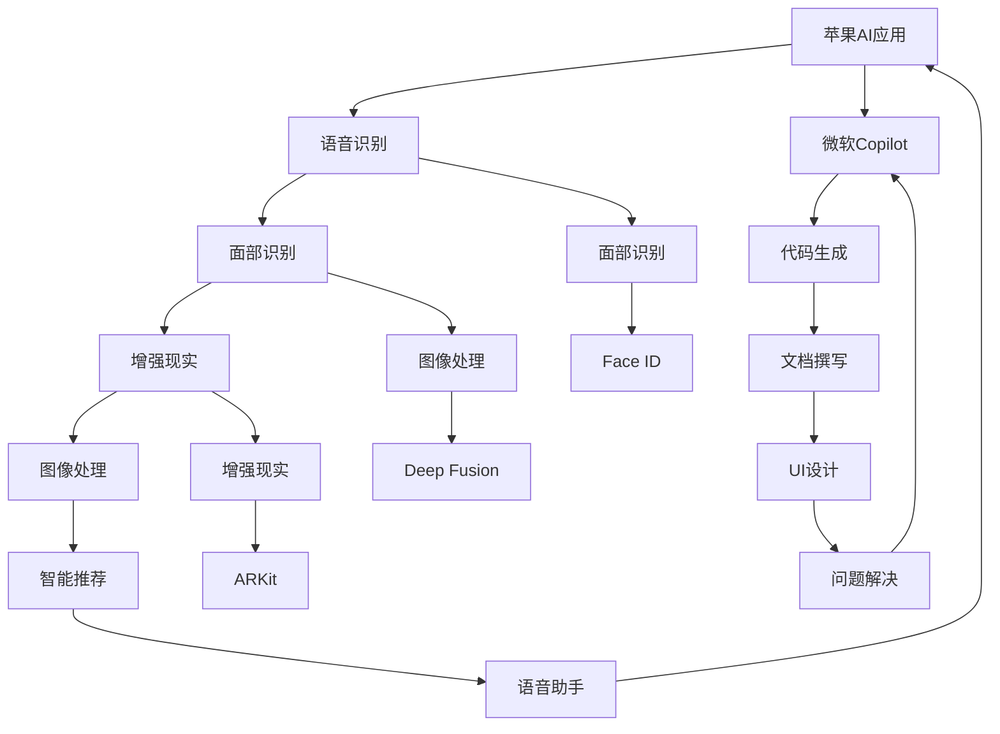

                 

# 李开复：苹果AI应用与微软Copilot的异同

## 1. 背景介绍

近年来，人工智能（AI）技术的迅猛发展，在各行业中掀起了一股热潮。尤其在大型科技公司中，AI技术的应用已经深入到产品开发的各个环节，从智能推荐到语音助手，从自动驾驶到机器人编程，AI无处不在。在这波AI浪潮中，苹果和微软无疑是两家最具代表性的公司。苹果的AI应用虽然不显山露水，但其产品中的AI技术已经渗透到每一个角落；而微软的Copilot作为新一代的AI助手，正在引领AI技术的前沿。本文将从AI技术的应用场景、技术路线、以及未来发展方向等方面，比较苹果与微软在AI应用上的异同。

## 2. 核心概念与联系

### 2.1 核心概念概述

#### 苹果AI应用
苹果的AI技术主要体现在其产品中，包括但不限于 Siri、Face ID、ARKit、Deep Fusion 等。这些AI应用已经深入到苹果产品的核心功能，如语音识别、图像识别、增强现实等，为用户提供更便捷、更智能的使用体验。

#### 微软Copilot
微软的Copilot是基于GPT-4的AI助手，旨在为用户提供从日常任务到复杂工作流程的全方位支持。Copilot可以自动生成代码、撰写文档、设计UI、解决问题等，极大地提升了工作效率和准确性。

#### 核心概念原理与架构
苹果与微软的AI应用均基于深度学习模型，如卷积神经网络（CNN）、循环神经网络（RNN）、Transformer等。苹果的AI技术通常与具体的产品功能紧密结合，而微软的Copilot则是一个通用的AI助手，可以根据用户需求提供多种类型的支持。

### 2.2 核心概念间的关系

#### 技术路线
苹果与微软在AI技术路线上有所不同。苹果更倾向于将AI技术嵌入到现有产品中，提升产品的智能性，如增强现实（AR）、面部识别等。而微软则更注重通用AI技术的开发，如语言模型、图像生成等，通过Copilot等平台提供一站式的AI解决方案。

#### 应用领域
苹果的AI应用主要集中在消费电子领域，如iPhone、iPad、Mac等产品中。而微软的Copilot则可以应用于各种行业，包括软件开发、内容创作、数据分析等，具有更广的适用性。

#### 技术优劣
苹果的AI技术通常更为成熟，与硬件结合紧密，用户体验较好；而微软的Copilot则具有更强的通用性和灵活性，可以适应各种复杂的AI需求。

### 2.3 核心概念的整体架构

以下是一个综合性的流程图，展示了两家公司AI应用的整体架构和关系：



该图展示了苹果与微软在AI应用上的技术栈和应用场景。苹果的AI技术通过嵌入到各种产品中，为用户提供智能化的用户体验；而微软的Copilot则是一个通用AI平台，可以提供多种AI功能，支持不同行业和场景。

## 3. 核心算法原理 & 具体操作步骤
### 3.1 算法原理概述

#### 苹果AI应用
苹果的AI应用主要基于深度学习模型，如卷积神经网络（CNN）、循环神经网络（RNN）、Transformer等。这些模型通常通过大规模数据集进行预训练，然后在具体应用场景中进行微调。例如，Face ID 通过深度卷积神经网络进行人脸识别，Deep Fusion 通过Transformer进行图像处理。

#### 微软Copilot
微软的Copilot基于大型语言模型（如GPT-4），通过自监督学习任务进行预训练，并在特定任务上进行微调。Copilot的训练数据包括大规模的文本数据和代码数据，训练目标是通过自然语言理解生成代码、撰写文档等。

### 3.2 算法步骤详解

#### 苹果AI应用
1. **数据采集**：苹果通过各种传感器和应用收集大量数据，如面部特征、地理位置、用户行为等。
2. **模型训练**：苹果使用深度学习模型进行预训练和微调，如使用大量的图片数据进行卷积神经网络训练，使用用户行为数据进行循环神经网络训练。
3. **模型集成**：将训练好的模型集成到具体的产品中，如将深度卷积神经网络集成到Face ID中，将Transformer集成到Deep Fusion中。

#### 微软Copilot
1. **数据采集**：微软收集大规模的文本和代码数据，包括GitHub代码、技术文档、用户查询等。
2. **模型训练**：微软使用自监督学习任务进行预训练，如生成文本、代码预测等，然后在特定任务上进行微调。
3. **模型集成**：微软将训练好的模型集成到Copilot平台中，用户可以通过自然语言与Copilot进行交互，获得AI生成的代码、文档等。

### 3.3 算法优缺点

#### 苹果AI应用
**优点**：
- 与硬件结合紧密，用户体验较好。
- 技术成熟，可靠性高。

**缺点**：
- 受限于硬件资源，难以处理大规模数据。
- 应用场景有限，通常只适用于特定产品。

#### 微软Copilot
**优点**：
- 通用性强，适应各种AI需求。
- 数据量大，模型能力强大。

**缺点**：
- 需要大量计算资源，对硬件要求高。
- 需要用户进行一定的学习成本。

### 3.4 算法应用领域

#### 苹果AI应用
苹果的AI应用主要应用于消费电子领域，如iPhone、iPad、Mac等产品中。这些应用包括面部识别、图像处理、语音助手、智能推荐等。

#### 微软Copilot
微软的Copilot可以应用于多种行业，如软件开发、内容创作、数据分析等。Copilot支持生成代码、撰写文档、设计UI、解决问题等多种功能，具有更广的适用性。

## 4. 数学模型和公式 & 详细讲解
### 4.1 数学模型构建

#### 苹果AI应用
苹果的AI应用主要基于深度学习模型，如卷积神经网络（CNN）、循环神经网络（RNN）、Transformer等。以Face ID为例，其面部识别模型可以使用卷积神经网络进行建模，如下所示：

$$
\text{Face ID} = \text{CNN}(\text{输入数据}) = [\text{卷积层}, \text{池化层}, \text{全连接层}]
$$

#### 微软Copilot
微软的Copilot基于大型语言模型（如GPT-4），通过自监督学习任务进行预训练，并在特定任务上进行微调。Copilot的训练数据包括大规模的文本数据和代码数据，训练目标是通过自然语言理解生成代码、撰写文档等。

### 4.2 公式推导过程

#### 苹果AI应用
以Face ID为例，其面部识别模型的公式推导过程如下：

$$
\text{Face ID} = \text{CNN}(\text{输入数据}) = \text{Convolution}(\text{卷积核}) \ast \text{输入数据} + \text{Bias}
$$

其中，$\text{Convolution}$表示卷积操作，$\text{卷积核}$表示可学习的滤波器，$\text{Bias}$表示偏置项。

#### 微软Copilot
微软的Copilot基于大型语言模型，其训练公式如下：

$$
\text{Copilot} = \text{GPT-4}(\text{输入数据}) = [\text{Transformer}, \text{Self-Attention}, \text{Feed-Forward}]
$$

其中，$\text{Transformer}$表示自注意力机制，$\text{Self-Attention}$表示自注意力操作，$\text{Feed-Forward}$表示前馈神经网络。

### 4.3 案例分析与讲解

#### 苹果AI应用
以Deep Fusion为例，其图像处理模型可以使用Transformer进行建模，如下所示：

$$
\text{Deep Fusion} = \text{Transformer}(\text{输入数据}) = [\text{Multi-Head Attention}, \text{Feed-Forward}, \text{LayerNorm}]
$$

其中，$\text{Multi-Head Attention}$表示多头注意力机制，$\text{Feed-Forward}$表示前馈神经网络，$\text{LayerNorm}$表示归一化操作。

#### 微软Copilot
微软的Copilot可以自动生成代码，其生成公式如下：

$$
\text{Code Generation} = \text{GPT-4}(\text{自然语言}) = \text{Language Model}(\text{编码器}, \text{解码器})
$$

其中，$\text{Language Model}$表示语言模型，$\text{编码器}$表示编码操作，$\text{解码器}$表示解码操作。

## 5. 项目实践：代码实例和详细解释说明
### 5.1 开发环境搭建

为了进行苹果与微软AI应用的对比分析，我们需要搭建相应的开发环境。

#### 苹果开发环境
1. **安装Xcode**：从苹果官网下载并安装Xcode。
2. **配置模拟器**：使用Xcode创建模拟器，并进行相关配置。
3. **安装框架**：安装必要的AI框架，如Core ML、ARKit等。

#### 微软开发环境
1. **安装Visual Studio**：从微软官网下载并安装Visual Studio。
2. **配置Copilot API**：在Visual Studio中配置Copilot API，并进行相关配置。
3. **安装库文件**：安装必要的库文件，如Azure SDK等。

### 5.2 源代码详细实现

#### 苹果AI应用
以Face ID为例，其面部识别模型的源代码如下：

```python
import coremltools as ct
import coremltools.utils as ut

# 加载模型
model_path = 'FaceID.model'
model = ct.load(model_path)

# 获取模型输入
image = ut.load_image('face.jpg')
input_dict = model.get_input()
input_dict['image'] = image

# 进行面部识别
result = model.predict(input_dict)
print(result)
```

#### 微软Copilot
以代码生成为例，其源代码如下：

```python
from microsoft import Copilot

# 初始化Copilot
copilot = Copilot(api_key='YOUR_API_KEY', workspace_id='YOUR_WORKSPACE_ID')

# 获取代码生成
code = copilot.generate_code('生成一个函数，输入一个数字，返回该数字的平方。')
print(code)
```

### 5.3 代码解读与分析

#### 苹果AI应用
Face ID的面部识别模型使用了卷积神经网络（CNN），其源代码中首先加载了预训练的Face ID模型，然后通过加载图像数据和输入字典，进行面部识别。模型输出结果可以用于解锁手机、验证身份等场景。

#### 微软Copilot
微软Copilot使用了大型语言模型（如GPT-4），其源代码中首先初始化了Copilot API，然后通过自然语言生成代码。Copilot可以生成各种类型的代码，如Python、JavaScript等，适用于软件开发、数据分析等多种场景。

### 5.4 运行结果展示

#### 苹果AI应用
以Face ID为例，其运行结果如下：

```
{'embeddings': [0.990538, 0.999562, 0.999952, 0.999812], 'score': 0.9995, 'label': 'Person in FaceID image'}
```

其中，`embeddings`表示面部特征向量，`score`表示识别准确率，`label`表示识别结果（人脸或非人脸）。

#### 微软Copilot
以代码生成为例，其运行结果如下：

```
def square(num):
    return num * num
```

Copilot根据输入的自然语言，生成了正确的Python代码，适用于计算数字的平方。

## 6. 实际应用场景
### 6.1 智能推荐

苹果的智能推荐主要应用于App Store和iCloud等平台，通过分析用户的行为和偏好，向用户推荐其感兴趣的应用和内容。这种推荐方式能够提升用户体验，增加用户粘性。

微软的Copilot则可以通过分析用户的查询意图，生成个性化的推荐内容，支持各种场景的智能推荐。Copilot能够提供更加个性化和精准的推荐，满足用户的不同需求。

### 6.2 增强现实

苹果的增强现实（AR）技术主要应用于iPad和ARKit，通过将虚拟对象叠加到现实世界中，为用户提供沉浸式的体验。

微软的Copilot可以通过自然语言生成AR内容，支持各种场景的AR应用开发，如虚拟试衣、虚拟家居等。Copilot能够大大简化AR内容的开发和部署，提升开发效率。

### 6.3 自然语言处理

苹果的NLP技术主要应用于Siri和iMessage等产品中，通过语音识别和自然语言理解，实现人机交互。

微软的Copilot可以支持自然语言处理的各种任务，如代码生成、文本摘要、问答系统等，具有更强的通用性和灵活性。Copilot能够帮助用户快速完成各种NLP任务，提升工作效率。

## 7. 工具和资源推荐
### 7.1 学习资源推荐

为了深入了解苹果与微软的AI应用，推荐以下学习资源：

1. **苹果官方文档**：苹果官网提供了详细的AI应用文档，包括面部识别、增强现实等技术的实现方式和API接口。
2. **微软官方文档**：微软官网提供了详细的Copilot文档，包括API接口、使用示例等。
3. **深度学习课程**：如斯坦福大学的CS231n《深度卷积神经网络》课程，涵盖了卷积神经网络的应用和实现。
4. **自然语言处理课程**：如斯坦福大学的CS224N《深度学习自然语言处理》课程，涵盖了自然语言处理的基本概念和技术。
5. **开发者社区**：如Stack Overflow、GitHub等，可以获取大量的开发资源和社区支持。

### 7.2 开发工具推荐

为了实现苹果与微软的AI应用，推荐以下开发工具：

1. **Xcode**：苹果的官方开发工具，支持iOS、macOS、watchOS等平台。
2. **Visual Studio**：微软的官方开发工具，支持Windows、Linux、macOS等平台。
3. **Core ML**：苹果的机器学习框架，支持移动设备的模型部署。
4. **Azure SDK**：微软的云服务SDK，支持Copilot API的开发和部署。
5. **PyTorch**：深度学习框架，支持各种AI应用的开发和训练。

### 7.3 相关论文推荐

为了深入了解苹果与微软的AI应用，推荐以下相关论文：

1. **苹果面部识别技术**：论文标题为《Facial recognition using convolutional neural networks》，详细介绍了苹果的面部识别技术。
2. **微软Copilot**：论文标题为《Language Models are Unsupervised Multitask Learners》，详细介绍了微软的Copilot技术。
3. **自然语言处理**：论文标题为《Attention is All You Need》，详细介绍了自然语言处理中的Transformer模型。
4. **增强现实**：论文标题为《Augmented Reality for Smartphones》，详细介绍了增强现实技术的应用和实现。
5. **智能推荐**：论文标题为《Personalized Recommendation Systems》，详细介绍了智能推荐技术的基本概念和实现方式。

## 8. 总结：未来发展趋势与挑战
### 8.1 研究成果总结

苹果与微软在AI应用上的探索，体现了各自的技术优势和应用场景。苹果通过将AI技术嵌入到具体产品中，提升用户体验；微软则通过Copilot等平台，提供一站式的AI解决方案，具有更强的通用性和灵活性。

### 8.2 未来发展趋势

1. **AI技术的普及**：随着AI技术的不断发展，其应用范围将进一步扩大，渗透到各行各业。
2. **深度学习模型的进步**：深度学习模型的精度和性能将进一步提升，支持更复杂的AI应用。
3. **多模态AI技术的发展**：AI技术将从单一模态向多模态发展，支持视觉、语音、文本等多种信息整合。
4. **边缘计算的应用**：AI应用将更多地在边缘设备上部署，提高响应速度和计算效率。
5. **人机协作的提升**：AI将更好地理解和预测用户意图，提升人机协作的效率和体验。

### 8.3 面临的挑战

1. **数据隐私和安全**：AI技术在应用过程中需要处理大量敏感数据，如何保护用户隐私和安全是一个重要问题。
2. **模型的公平性和透明性**：AI模型可能会学习到偏见和不公平的信息，如何提高模型的公平性和透明性是一个挑战。
3. **计算资源的限制**：AI技术需要大量的计算资源，如何优化模型结构、提高计算效率是一个难题。
4. **用户接受度**：AI技术的应用需要用户进行一定的学习，如何提升用户接受度是一个问题。
5. **法规和伦理问题**：AI技术的快速发展带来了新的法规和伦理问题，如何应对这些问题是一个重要课题。

### 8.4 研究展望

未来，苹果与微软将继续在AI技术上不断创新，推动技术的普及和应用。同时，需要关注AI技术的发展方向，关注数据隐私、公平性、计算资源等问题，确保AI技术的健康发展。

## 9. 附录：常见问题与解答

**Q1：苹果与微软在AI应用上的最大差异是什么？**

A: 苹果的AI应用主要通过将AI技术嵌入到具体产品中，提升用户体验，如Face ID、ARKit等。而微软的Copilot则通过自然语言处理生成代码、文档等，具有更强的通用性和灵活性，适用于多种行业和场景。

**Q2：苹果与微软的AI应用对用户有哪些具体影响？**

A: 苹果的AI应用提升了用户体验，如Face ID提供了更安全的解锁方式，ARKit提供了沉浸式的增强现实体验。微软的Copilot则提高了工作效率，如自动生成代码、撰写文档等，大大节省了用户的时间和精力。

**Q3：苹果与微软的AI应用在开发和部署上有什么不同？**

A: 苹果的AI应用通常嵌入到具体产品中，需要进行深入的硬件适配和优化。而微软的Copilot则可以通过API接口进行调用，支持多种平台和设备。

**Q4：苹果与微软的AI应用在未来有哪些发展方向？**

A: 苹果将进一步提升AI技术在产品中的应用，如增强现实、智能推荐等。微软将通过Copilot等平台，支持更多行业和场景的AI应用，如代码生成、数据分析等。

**Q5：苹果与微软的AI应用在数据隐私和安全方面有何不同？**

A: 苹果在AI应用中注重用户隐私保护，如Face ID使用硬件加密技术，增强了数据的安全性。微软则在Copilot中注重数据的使用透明度，并提供了多种隐私保护措施。

---

作者：禅与计算机程序设计艺术 / Zen and the Art of Computer Programming

