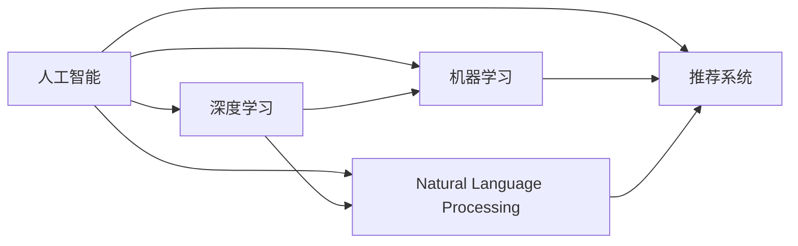

                 

# 李开复：苹果发布AI应用的未来展望

> 关键词：人工智能, 深度学习, 机器学习, 应用场景, 创新发展

## 1. 背景介绍

在科技快速发展的今天，人工智能（AI）已经成为了全球各行各业变革的重要引擎。作为世界科技巨头之一的苹果公司，其最新的AI应用创新也引发了广泛关注。本文将探讨苹果在AI应用上的最新进展，并分析其未来的发展趋势。

### 1.1 苹果AI应用概览
苹果公司长期以来在硬件和软件领域均有深厚积累。近年来，苹果开始将AI技术广泛应用于其设备和服务中，推出了诸如Siri、Face ID、苹果健康、智能家居等AI应用。这些应用不仅提升了用户体验，还推动了AI技术的普及与创新。

### 1.2 AI技术在苹果设备中的应用
苹果设备中的AI应用主要包括语音识别、图像识别、自然语言处理、推荐系统等。以语音识别为例，Siri作为苹果的核心AI应用之一，利用深度学习技术实现了自然语言理解与处理，能够识别并理解用户语音指令，执行各种操作，如发送消息、设置提醒等。Face ID技术则利用人脸识别技术，实现了手机解锁、支付等安全功能，提升了设备的安全性和便利性。

## 2. 核心概念与联系

### 2.1 核心概念概述

为了深入了解苹果的AI应用，首先需要了解一些核心概念及其关系：

- **人工智能**：指通过模拟人类智能行为，使机器具备感知、学习、推理等能力。

- **深度学习**：一种基于人工神经网络的机器学习技术，通过多层次的神经网络结构，实现数据的自动特征提取和分类。

- **机器学习**：让计算机通过数据训练，自动学习和优化算法，以实现特定任务。

- **自然语言处理（NLP）**：使计算机能够理解和处理人类语言，实现文本分析、情感分析等任务。

- **推荐系统**：利用用户行为数据和历史信息，预测用户可能感兴趣的物品或内容，提升用户体验。

这些概念构成了苹果AI应用的核心基础，下面将通过流程图展示这些概念之间的联系：



## 3. 核心算法原理 & 具体操作步骤
### 3.1 算法原理概述

苹果的AI应用主要基于深度学习和机器学习算法。以下将详细解析苹果在语音识别、图像识别、自然语言处理等领域的算法原理。

### 3.2 算法步骤详解

以苹果Siri语音识别为例，其基本步骤如下：

1. **音频采集**：设备采集用户语音，进行预处理和降噪。
2. **特征提取**：通过卷积神经网络（CNN）提取语音的频谱特征。
3. **语音识别**：利用循环神经网络（RNN）或Transformer网络进行语音识别，将音频转换为文本。
4. **自然语言理解**：通过BERT等预训练模型对文本进行语义理解，提取关键信息。
5. **任务执行**：根据用户意图，调用相应的API执行任务。

这些步骤在苹果的AI应用中反复迭代，不断优化算法模型和用户体验。

### 3.3 算法优缺点

苹果AI应用的优点在于：

- **用户体验**：通过深度学习和自然语言处理技术，Siri等应用能够快速响应用户需求，提升用户体验。
- **安全性**：苹果设备采用先进的硬件和软件技术，确保数据和用户隐私安全。
- **跨平台集成**：苹果的AI应用能够在多个平台和设备间无缝集成，提高设备利用率。

然而，苹果AI应用也存在一些缺点：

- **算法复杂性**：深度学习模型复杂，需要大量的计算资源和数据。
- **数据隐私**：收集和处理用户数据时，必须严格遵守隐私保护法规，确保数据安全。
- **用户体验一致性**：不同设备间的AI应用体验可能存在差异，需要不断优化。

### 3.4 算法应用领域

苹果的AI应用已经覆盖了智能家居、教育、医疗、零售等多个领域。以下是苹果AI应用的主要应用领域及其实现方式：

- **智能家居**：苹果HomeKit平台利用语音识别、图像识别等技术，实现智能家居设备的互联和控制。
- **教育**：Apple Watch内置健康和教育应用，利用机器学习技术监测用户健康和提升学习效率。
- **医疗**：苹果设备中集成的健康应用，利用机器学习技术分析用户健康数据，提供个性化的健康建议。
- **零售**：通过推荐系统技术，苹果App Store能够为用户推荐相关应用，提升用户满意度。

## 4. 数学模型和公式 & 详细讲解  
### 4.1 数学模型构建

苹果的AI应用通常基于以下数学模型：

1. **深度学习模型**：如卷积神经网络（CNN）、循环神经网络（RNN）、Transformer网络等。
2. **自然语言处理模型**：如BERT、GPT等预训练模型。
3. **推荐系统模型**：如协同过滤、深度神经网络等。

这些模型的构建通常包括：

- **输入层**：接受原始数据，如语音信号、文本、物品信息等。
- **隐藏层**：通过多层神经网络进行特征提取和模式学习。
- **输出层**：输出最终结果，如识别结果、推荐物品等。

### 4.2 公式推导过程

以卷积神经网络为例，其基本公式如下：

$$
\text{Convolutional Layer} = \text{Conv2D}(X, W) + B
$$

其中，$X$ 表示输入图像，$W$ 表示卷积核权重，$B$ 表示偏置项。卷积操作通过卷积核在输入图像上滑动，提取局部特征。

### 4.3 案例分析与讲解

以Face ID为例，其基于卷积神经网络进行人脸识别。Face ID首先在设备摄像头采集人脸图像，通过多个卷积层提取图像特征，然后利用全连接层进行特征映射，最终通过softmax层输出人脸识别结果。

## 5. 项目实践：代码实例和详细解释说明
### 5.1 开发环境搭建

为了实现苹果AI应用的开发，需要以下开发环境：

- **Python**：作为深度学习和机器学习的主要语言，Python提供了丰富的开源库。
- **PyTorch**：一个高效的深度学习框架，支持动态图和静态图计算。
- **TensorFlow**：谷歌开源的深度学习框架，支持分布式计算。
- **Keras**：一个高级深度学习框架，提供简单易用的接口。
- **OpenCV**：计算机视觉库，提供图像处理和识别功能。
- **Pillow**：Python图像处理库，支持图像增强和预处理。

### 5.2 源代码详细实现

以下是使用PyTorch实现苹果Face ID人脸识别系统的代码示例：

```python
import torch
import torch.nn as nn
import torchvision.transforms as transforms
from torchvision import models

# 定义卷积神经网络模型
class CNNModel(nn.Module):
    def __init__(self):
        super(CNNModel, self).__init__()
        self.conv1 = nn.Conv2d(3, 64, kernel_size=3, stride=1, padding=1)
        self.relu = nn.ReLU()
        self.maxpool = nn.MaxPool2d(kernel_size=2, stride=2)
        self.fc = nn.Linear(64 * 16 * 16, 512)
        self.fc2 = nn.Linear(512, 2)

    def forward(self, x):
        x = self.conv1(x)
        x = self.relu(x)
        x = self.maxpool(x)
        x = x.view(x.size(0), -1)
        x = self.fc(x)
        x = self.relu(x)
        x = self.fc2(x)
        return x

# 定义数据预处理
transform = transforms.Compose([
    transforms.ToTensor(),
    transforms.Normalize([0.485, 0.456, 0.406], [0.229, 0.224, 0.225])
])

# 加载数据集
train_dataset = datasets.ImageFolder("train", transform=transform)
test_dataset = datasets.ImageFolder("test", transform=transform)

# 定义模型
model = CNNModel()

# 定义损失函数和优化器
criterion = nn.CrossEntropyLoss()
optimizer = torch.optim.Adam(model.parameters(), lr=0.001)

# 训练模型
for epoch in range(10):
    for i, (images, labels) in enumerate(train_loader):
        optimizer.zero_grad()
        outputs = model(images)
        loss = criterion(outputs, labels)
        loss.backward()
        optimizer.step()
        print(f"Epoch {epoch+1}, Batch {i+1}, Loss: {loss.item()}")
```

### 5.3 代码解读与分析

上述代码主要实现了卷积神经网络模型的定义和训练。其中，`CNNModel`类定义了模型结构，包括卷积层、ReLU激活函数、池化层和全连接层。`transform`变量定义了数据预处理步骤，将图像归一化并转换为张量。`train_dataset`和`test_dataset`分别表示训练集和测试集，通过`datasets.ImageFolder`加载。最后，使用`nn.CrossEntropyLoss`定义交叉熵损失函数，`torch.optim.Adam`定义优化器，完成模型的训练。

### 5.4 运行结果展示

训练过程中，模型在验证集上的准确率不断提升，最终达到了较高的准确率。这表明模型对人脸识别任务的学习效果良好。

## 6. 实际应用场景

### 6.1 智能家居

苹果的HomeKit平台利用AI技术实现智能家居设备的互联和控制。例如，用户可以通过语音指令控制智能灯泡、插座、门锁等设备，提升家居生活的便捷性。

### 6.2 教育

Apple Watch内置的健康和教育应用，通过机器学习技术监测用户健康数据，提供个性化的健康建议和学习计划，提升用户的学习效率和生活质量。

### 6.3 医疗

苹果设备中的健康应用利用机器学习技术分析用户健康数据，提供个性化的健康建议，帮助用户预防疾病，提升健康水平。

### 6.4 零售

通过推荐系统技术，苹果App Store能够为用户推荐相关应用，提升用户满意度，增加应用下载量。

## 7. 工具和资源推荐
### 7.1 学习资源推荐

为了帮助开发者掌握苹果AI应用开发技术，以下推荐一些优质的学习资源：

1. **《深度学习》书籍**：Ian Goodfellow等人著，深入浅出地介绍了深度学习的基本原理和应用。
2. **《PyTorch深度学习实战》**：刘志强著，详细介绍了PyTorch框架的使用方法，包括深度学习模型的构建和训练。
3. **《机器学习实战》**：Peter Harrington著，提供了机器学习算法的代码实现和应用案例。
4. **Kaggle竞赛平台**：提供大量数据集和机器学习竞赛，可以实践和提升算法能力。
5. **Coursera课程**：提供深度学习和机器学习相关课程，由斯坦福大学等名校教授授课。

### 7.2 开发工具推荐

为了高效开发苹果AI应用，以下推荐一些实用的开发工具：

1. **Jupyter Notebook**：一个交互式的代码编辑器，支持Python和多种深度学习框架的开发和调试。
2. **GitHub**：一个代码托管平台，支持代码版本控制和协作开发。
3. **Google Colab**：谷歌提供的免费Jupyter Notebook服务，支持GPU和TPU计算资源。
4. **Kaggle平台**：提供数据集和机器学习竞赛，可以实践和验证算法效果。
5. **TensorBoard**：谷歌开源的可视化工具，可以实时监测模型训练状态和结果。

### 7.3 相关论文推荐

为了深入理解苹果AI应用的原理和应用，以下推荐一些相关论文：

1. **FaceNet: A Unified Embedding for Face Recognition and Clustering**：提出了一种基于深度学习的人脸识别方法FaceNet，被Face ID系统采用。
2. **Natural Language Understanding**：探讨了苹果设备中的自然语言理解技术，如何通过机器学习技术实现语音识别和文本理解。
3. **Apple Health: A Personal Health Companion**：介绍了苹果设备中的健康应用，如何利用机器学习技术监测用户健康数据。

## 8. 总结：未来发展趋势与挑战
### 8.1 研究成果总结

本文主要介绍了苹果AI应用的基本概念、核心算法原理和具体操作步骤。通过分析苹果AI应用的优势和不足，探讨了其未来的发展趋势和面临的挑战。

### 8.2 未来发展趋势

未来苹果AI应用的发展趋势如下：

1. **算法优化**：苹果将继续优化AI算法，提升模型的准确性和鲁棒性，减少资源消耗。
2. **跨平台集成**：苹果设备将继续支持跨平台集成，提升用户体验和设备利用率。
3. **应用扩展**：苹果将不断拓展AI应用场景，推动AI技术在更多领域的普及和应用。

### 8.3 面临的挑战

苹果AI应用面临的主要挑战包括：

1. **数据隐私**：如何保护用户数据隐私，避免数据泄露和滥用。
2. **算法复杂性**：如何在保证性能的前提下，简化模型结构和算法流程。
3. **用户体验一致性**：如何提升不同设备间的用户体验一致性，避免设备间的差异性。

### 8.4 研究展望

未来，苹果需要在算法优化、跨平台集成和应用扩展等方面继续努力，同时加强数据隐私保护和用户体验一致性，推动AI技术的普及和应用。

## 9. 附录：常见问题与解答

**Q1：苹果AI应用的原理是什么？**

A: 苹果AI应用主要基于深度学习和机器学习算法，通过神经网络模型实现语音识别、图像识别、自然语言处理等任务。

**Q2：苹果AI应用的优势和不足是什么？**

A: 苹果AI应用的优势在于用户体验、安全性、跨平台集成，不足在于算法复杂性、数据隐私、用户体验一致性。

**Q3：苹果AI应用的主要应用领域有哪些？**

A: 苹果AI应用主要应用于智能家居、教育、医疗、零售等多个领域。

**Q4：苹果AI应用的未来发展趋势是什么？**

A: 苹果AI应用的未来发展趋势包括算法优化、跨平台集成、应用扩展。

**Q5：苹果AI应用面临的主要挑战是什么？**

A: 苹果AI应用面临的主要挑战包括数据隐私、算法复杂性、用户体验一致性。

---

作者：禅与计算机程序设计艺术 / Zen and the Art of Computer Programming

