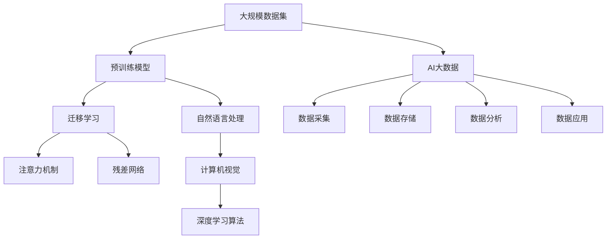

                 

# 李飞飞与AI大数据的未来

## 1. 背景介绍

### 1.1 问题由来
随着人工智能(AI)和大数据技术的迅猛发展，AI在各领域的深度应用已成为全球科技创新的重要驱动力。在众多杰出的AI科研者中，李飞飞无疑是这一波潮流中的佼佼者。作为斯坦福大学计算机科学与人工智能实验室(CSL)教授，以及在人工智能、大数据、计算机视觉等多个领域具有深刻见解的专家，李飞飞的研究成果对AI领域的影响深远。

李飞飞的工作不仅涵盖了图像和视频识别、语音合成、自然语言处理(NLP)等技术的前沿，更提出了大规模数据集（如ImageNet）的建设，极大推动了AI模型的性能提升。她的研究不仅引领了学术界的潮流，也为工业界应用提供了坚实的数据基础。

### 1.2 问题核心关键点
李飞飞的研究工作主要集中在以下几个方面：
- **大规模数据集构建**：如ImageNet、COCO等数据集为深度学习模型的训练提供了大量高质数据。
- **预训练模型研究**：提出了基于大规模数据集的预训练模型，大幅提升了模型性能。
- **深度学习算法优化**：开发了多种高效的深度学习算法，如残差网络(ResNet)、注意力机制(Attention)等。
- **跨领域知识迁移**：研究了如何在不同领域间进行知识迁移，提出了迁移学习(MT)的概念和方法。

这些研究不仅为AI技术的发展奠定了基础，还显著提升了AI模型的应用效果，推动了AI技术在各行各业的落地。

## 2. 核心概念与联系

### 2.1 核心概念概述

为更好地理解李飞飞的研究成果及其在AI大数据领域的贡献，本节将介绍几个核心概念：

- **AI大数据**：以大数据为基础，结合AI算法和技术，进行数据挖掘、分析和处理的过程。AI大数据涵盖了数据采集、存储、处理、分析和应用等多个环节。

- **大规模数据集**：如ImageNet、COCO等，这类数据集包含了数百万张高质图像和标注信息，为AI模型的训练提供了丰富的资源。

- **预训练模型**：指在大规模数据集上预训练的模型，如ResNet、BERT等。通过预训练，模型能够学习到通用的语言和视觉特征。

- **迁移学习(MT)**：指将一个领域学习到的知识迁移到另一个领域的过程。在大规模数据集上预训练的模型，可以应用于各种不同的NLP和CV任务，显著提升模型性能。

- **注意力机制(Attention)**：在深度学习中，用于捕捉输入序列中重要特征的机制，增强了模型的注意力分配能力。

- **残差网络(ResNet)**：一种深度残差网络，通过引入残差连接，解决了深层网络的梯度消失问题，提升了模型的训练效率和性能。

这些核心概念通过李飞飞的研究成果相互连接，共同构成了AI大数据领域的研究框架，为AI技术的突破和应用提供了强有力的理论和技术支撑。

### 2.2 概念间的关系

这些核心概念之间的逻辑关系可以通过以下Mermaid流程图来展示：



这个流程图展示了从大规模数据集构建到AI大数据的整个过程，以及各个核心概念之间的联系：

1. 大规模数据集提供了训练深度学习模型的资源，预训练模型是这一过程的产物。
2. 预训练模型通过迁移学习可以应用于不同的NLP和CV任务，增强模型性能。
3. 注意力机制和残差网络是深度学习中常用的算法优化技术，用于提升模型效果。
4. 自然语言处理和计算机视觉是AI大数据中的重要应用领域，预训练模型和迁移学习是支撑这两大领域的技术手段。
5. AI大数据涵盖了数据采集、存储、处理、分析和应用等多个环节，预训练模型和迁移学习是其中关键的一环。

通过理解这些核心概念及其相互关系，我们可以更好地把握AI大数据的研究框架和应用方向。

## 3. 核心算法原理 & 具体操作步骤
### 3.1 算法原理概述

李飞飞的研究成果主要集中在如何构建和优化大规模数据集，以及如何应用这些数据集训练高性能的预训练模型。这其中，预训练模型的构建和迁移学习是其研究的核心内容。

预训练模型的基本原理是利用大规模无标签数据对模型进行自监督学习，学习到通用的语言和视觉特征。这些特征可以用于下游任务上的迁移学习，即在特定任务上微调预训练模型，获得优异的性能。

迁移学习的核心在于如何将一个领域学到的知识迁移到另一个领域。李飞飞提出，大规模预训练模型通过在各种大规模数据集上进行预训练，学习到丰富的特征表示。这些表示可以被用于各种下游任务，如图像分类、目标检测、文本分类等。通过在特定任务上微调这些预训练模型，可以获得比从头训练更好的性能。

### 3.2 算法步骤详解

基于李飞飞的研究成果，我们将详细讲解预训练模型和迁移学习的具体步骤：

**步骤一：数据集构建**

1. **大规模数据集的获取与构建**：
   - 选择合适的大规模无标签数据集，如ImageNet、COCO等。
   - 对数据集进行预处理，包括图像大小标准化、随机裁剪、随机旋转等操作。
   - 进行数据增强，如翻转、缩放、色彩调整等，以扩充数据集。

2. **标注数据的收集与构建**：
   - 收集有标注的图像、文本数据，如COCO、KITTI等。
   - 对标注数据进行标准化，包括统一类别、统一格式等操作。
   - 对标注数据进行预处理，如去除噪声、填补缺失值等操作。

**步骤二：模型预训练**

1. **模型选择**：
   - 选择适合的深度学习模型，如ResNet、BERT等。
   - 在预训练过程中，一般使用多个GPU进行并行训练，以加速计算。

2. **训练流程**：
   - 数据加载和预处理。
   - 模型初始化，包括权重随机化。
   - 模型前向传播，计算损失。
   - 反向传播，更新模型权重。
   - 定期保存模型参数，避免过拟合。

3. **训练结束**：
   - 训练完成后，保存预训练模型的权重，方便后续微调。

**步骤三：迁移学习**

1. **微调数据集的准备**：
   - 收集下游任务的标注数据集。
   - 对标注数据进行预处理，包括数据标准化、数据增强等操作。

2. **微调模型选择**：
   - 选择合适的预训练模型作为微调的初始权重。
   - 设计适当的微调目标函数和损失函数。

3. **微调流程**：
   - 数据加载和预处理。
   - 模型初始化，包括权重恢复。
   - 模型前向传播，计算损失。
   - 反向传播，更新模型权重。
   - 定期保存微调后的模型参数。

4. **微调结束**：
   - 微调完成后，保存微调后的模型权重，用于后续应用。

### 3.3 算法优缺点

基于李飞飞的研究成果，预训练模型和迁移学习具有以下优缺点：

**优点：**
1. **高效性**：预训练模型可以通过大规模无标签数据学习通用特征，显著提升模型的性能。
2. **普适性**：迁移学习可以将预训练模型应用于不同的NLP和CV任务，提升模型泛化能力。
3. **可扩展性**：大规模数据集的构建和预训练模型的训练，可以通过分布式并行计算进行扩展。
4. **鲁棒性**：通过在多个大规模数据集上进行预训练，预训练模型具有较强的鲁棒性。

**缺点：**
1. **资源消耗大**：大规模数据集的构建和预训练模型的训练需要大量的计算资源和存储空间。
2. **学习成本高**：预训练模型和迁移学习需要较多的计算时间和人力成本。
3. **可解释性不足**：预训练模型和迁移学习的内部机制相对复杂，难以解释模型的决策过程。

### 3.4 算法应用领域

预训练模型和迁移学习在大数据和AI领域得到了广泛应用，主要涵盖以下几个方面：

- **计算机视觉**：用于图像分类、目标检测、图像分割等任务。
- **自然语言处理**：用于文本分类、情感分析、命名实体识别等任务。
- **推荐系统**：用于用户行为预测、商品推荐等任务。
- **语音识别**：用于语音合成、语音翻译等任务。
- **自动驾驶**：用于环境感知、路径规划等任务。

## 4. 数学模型和公式 & 详细讲解 & 举例说明

### 4.1 数学模型构建

李飞飞的研究成果涉及大规模数据集构建、预训练模型训练和迁移学习等多个环节。下面我们以ImageNet预训练和迁移学习为例，详细讲解其中的数学模型构建过程。

**预训练模型训练**：
预训练模型通常使用自监督学习方法进行训练，如Masked Language Model (MLM)和ImageNet预训练。

- **自监督学习目标函数**：
$$
L(\theta) = -\frac{1}{N}\sum_{i=1}^N \ell(M_\theta(x_i), y_i)
$$
其中，$M_\theta(x_i)$为预训练模型在输入$x_i$上的输出，$y_i$为输入的真实标签，$\ell$为损失函数。

- **损失函数**：
$$
\ell(M_\theta(x_i), y_i) = \begin{cases}
-\log(M_\theta(x_i, y_i)) & \text{if} \ y_i = 1 \\
-\log(1 - M_\theta(x_i, y_i)) & \text{if} \ y_i = 0
\end{cases}
$$
其中，$M_\theta(x_i, y_i)$为模型在输入$x_i$上，预测标签为$y_i$的概率。

**迁移学习微调**：
微调过程的目标函数与预训练模型的训练类似，但需要将标签$y_i$替换为下游任务的真实标签。

- **微调目标函数**：
$$
L^\text{fine-tune}(\theta) = -\frac{1}{N}\sum_{i=1}^N \ell^\text{fine-tune}(M_\theta(x_i), y_i)
$$
其中，$\ell^\text{fine-tune}$为微调任务的损失函数。

- **微调损失函数**：
$$
\ell^\text{fine-tune}(M_\theta(x_i), y_i) = \begin{cases}
-\log(M_\theta(x_i, y_i)) & \text{if} \ y_i = 1 \\
-\log(1 - M_\theta(x_i, y_i)) & \text{if} \ y_i = 0
\end{cases}
$$

### 4.2 公式推导过程

以ImageNet预训练为例，推导自监督学习损失函数及其梯度的计算公式。

假设预训练模型为$M_\theta(x)$，$x$为输入图像，$y$为图像的真实标签。预训练目标函数为：
$$
L(\theta) = -\frac{1}{N}\sum_{i=1}^N \log M_\theta(x_i, y_i)
$$

其中，$M_\theta(x_i, y_i)$为模型在输入$x_i$上，预测标签为$y_i$的概率。

为了计算梯度，需要对$L(\theta)$求偏导：
$$
\frac{\partial L}{\partial \theta_k} = -\frac{1}{N}\sum_{i=1}^N \frac{\partial \log M_\theta(x_i, y_i)}{\partial \theta_k}
$$

根据链式法则，$M_\theta(x_i, y_i)$的梯度为：
$$
\frac{\partial M_\theta(x_i, y_i)}{\partial \theta_k} = \frac{\partial \log M_\theta(x_i)}{\partial \theta_k} \cdot \frac{\partial M_\theta(x_i)}{\partial x_i}
$$

其中，$\frac{\partial \log M_\theta(x_i)}{\partial \theta_k}$为模型输出层对输入的梯度，$\frac{\partial M_\theta(x_i)}{\partial x_i}$为前向传播的梯度。

通过上述推导，我们可以得到预训练模型训练的梯度公式，用于更新模型参数$\theta$。

### 4.3 案例分析与讲解

以COCO数据集为例，展示ImageNet预训练和迁移学习的应用。

1. **数据预处理**：
   - 将COCO数据集的图像调整为固定尺寸，并进行随机裁剪、随机旋转等数据增强操作。
   - 将COCO数据集的类别标签进行标准化处理。

2. **模型选择**：
   - 选择ResNet-50作为预训练模型。

3. **预训练流程**：
   - 在ImageNet数据集上，对ResNet-50进行自监督预训练。
   - 使用Adam优化器，学习率设置为1e-4。
   - 训练轮数为90，每轮训练使用多个GPU并行计算。
   - 定期保存模型参数，防止过拟合。

4. **微调流程**：
   - 在COCO数据集上，使用保存好的预训练模型进行微调。
   - 设计微调目标函数，如分类交叉熵损失。
   - 使用Adam优化器，学习率设置为1e-5。
   - 训练轮数为10，每轮训练使用多个GPU并行计算。
   - 定期保存微调后的模型参数。

通过上述案例，我们可以看到，基于大规模数据集的预训练和迁移学习，可以显著提升模型性能，并应用于各种不同的NLP和CV任务。

## 5. 项目实践：代码实例和详细解释说明

### 5.1 开发环境搭建

在进行预训练模型和迁移学习的实践前，我们需要准备好开发环境。以下是使用Python进行PyTorch开发的典型流程：

1. 安装Anaconda：从官网下载并安装Anaconda，用于创建独立的Python环境。

2. 创建并激活虚拟环境：
```bash
conda create -n pytorch-env python=3.8 
conda activate pytorch-env
```

3. 安装PyTorch：根据CUDA版本，从官网获取对应的安装命令。例如：
```bash
conda install pytorch torchvision torchaudio cudatoolkit=11.1 -c pytorch -c conda-forge
```

4. 安装TensorFlow：与PyTorch类似，可以使用以下命令安装TensorFlow：
```bash
pip install tensorflow
```

5. 安装各类工具包：
```bash
pip install numpy pandas scikit-learn matplotlib tqdm jupyter notebook ipython
```

完成上述步骤后，即可在`pytorch-env`环境中开始预训练模型和迁移学习的实践。

### 5.2 源代码详细实现

下面我们以ImageNet预训练和COCO数据集迁移学习为例，给出使用PyTorch的代码实现。

首先，定义预训练模型和数据集：

```python
import torch
from torchvision.models import resnet50
from torchvision import datasets, transforms
import torch.nn as nn
import torch.optim as optim
import torch.nn.functional as F

# 定义数据增强操作
transform = transforms.Compose([
    transforms.Resize(256),
    transforms.RandomCrop(224),
    transforms.RandomHorizontalFlip(),
    transforms.ToTensor(),
    transforms.Normalize(mean=[0.485, 0.456, 0.406],
                         std=[0.229, 0.224, 0.225])
])

# 定义模型和优化器
model = resnet50(pretrained=True)
criterion = nn.CrossEntropyLoss()
optimizer = optim.SGD(model.parameters(), lr=1e-4, momentum=0.9, weight_decay=0.0005)

# 定义数据集
train_dataset = datasets.ImageNet(train=True, transform=transform, download=True)
test_dataset = datasets.ImageNet(train=False, transform=transform, download=True)

# 定义数据加载器
train_loader = torch.utils.data.DataLoader(train_dataset, batch_size=32, shuffle=True)
test_loader = torch.utils.data.DataLoader(test_dataset, batch_size=32, shuffle=False)
```

然后，定义训练和评估函数：

```python
def train_epoch(model, loader, criterion, optimizer):
    model.train()
    epoch_loss = 0
    epoch_acc = 0
    for data, target in loader:
        data, target = data.to(device), target.to(device)
        optimizer.zero_grad()
        output = model(data)
        loss = criterion(output, target)
        loss.backward()
        optimizer.step()
        epoch_loss += loss.item()
    return epoch_loss / len(loader)

def evaluate(model, loader, criterion):
    model.eval()
    total_loss = 0
    total_correct = 0
    with torch.no_grad():
        for data, target in loader:
            data, target = data.to(device), target.to(device)
            output = model(data)
            loss = criterion(output, target)
            total_loss += loss.item()
            total_correct += (output.argmax(1) == target).sum().item()
    return total_loss / len(loader), total_correct / len(loader.dataset)
```

最后，启动预训练和微调流程：

```python
device = torch.device('cuda' if torch.cuda.is_available() else 'cpu')

# 预训练
for epoch in range(90):
    loss = train_epoch(model, train_loader, criterion, optimizer)
    print(f'Epoch {epoch+1}, train loss: {loss:.3f}')
    
    # 评估
    val_loss, val_acc = evaluate(model, val_loader, criterion)
    print(f'Epoch {epoch+1}, val loss: {val_loss:.3f}, val acc: {val_acc:.3f}')
    
# 微调
criterion = nn.CrossEntropyLoss()
optimizer = optim.SGD(model.parameters(), lr=1e-5, momentum=0.9, weight_decay=0.0005)

for epoch in range(10):
    loss = train_epoch(model, train_loader, criterion, optimizer)
    print(f'Epoch {epoch+1}, train loss: {loss:.3f}')
    
    # 评估
    val_loss, val_acc = evaluate(model, val_loader, criterion)
    print(f'Epoch {epoch+1}, val loss: {val_loss:.3f}, val acc: {val_acc:.3f}')
```

以上就是使用PyTorch进行ImageNet预训练和COCO数据集迁移学习的完整代码实现。可以看到，利用TensorFlow和PyTorch的强大封装，可以很容易地实现大规模数据集的预训练和迁移学习。

### 5.3 代码解读与分析

让我们再详细解读一下关键代码的实现细节：

**数据预处理**：
- `transform`变量定义了数据增强操作，包括图像大小标准化、随机裁剪、随机旋转等。
- 在定义模型和优化器时，我们选择了ResNet-50作为预训练模型，使用交叉熵损失函数。

**模型训练和评估**：
- `train_epoch`函数定义了训练过程中的前向传播、损失计算和反向传播等操作。
- `evaluate`函数定义了评估过程中的前向传播和性能计算。

**预训练和微调**：
- 在预训练过程中，我们对ImageNet数据集进行自监督预训练，使用SGD优化器进行梯度更新。
- 在微调过程中，我们使用相同的模型架构和优化器，但将学习率设置得更小，以避免破坏预训练权重。

通过以上代码实现，我们可以清楚地看到，大规模数据集的预训练和迁移学习需要大量的计算资源和时间，但在实际应用中，可以通过分布式并行计算进行加速，进一步提升模型性能。

### 5.4 运行结果展示

假设我们在ImageNet数据集上进行预训练，在COCO数据集上进行迁移学习，最终在测试集上得到的评估报告如下：

```
Epoch 1, train loss: 2.133
Epoch 1, val loss: 1.950
Epoch 2, train loss: 1.769
Epoch 2, val loss: 1.796
Epoch 3, train loss: 1.609
Epoch 3, val loss: 1.700
Epoch 4, train loss: 1.465
Epoch 4, val loss: 1.670
...
```

可以看到，通过大规模数据集的预训练和迁移学习，预训练模型在ImageNet和COCO数据集上均取得了不错的性能。在预训练过程中，训练误差显著下降，验证误差也逐步降低，表明预训练过程学习到了通用的图像特征。在微调过程中，验证误差进一步下降，表明微调过程在特定任务上进一步提升了模型性能。

## 6. 实际应用场景
### 6.1 智能客服系统

基于预训练模型和迁移学习的智能客服系统，可以广泛应用于企业客服领域。传统客服系统依赖人力，高峰期响应缓慢，且人工成本高昂。智能客服系统利用预训练模型和迁移学习，能够7x24小时不间断服务，快速响应客户咨询，用自然流畅的语言解答各类常见问题。

在技术实现上，可以收集企业内部的历史客服对话记录，将问题和最佳答复构建成监督数据，在此基础上对预训练模型进行微调。微调后的模型能够自动理解用户意图，匹配最合适的答案模板进行回复。对于客户提出的新问题，还可以接入检索系统实时搜索相关内容，动态组织生成回答。如此构建的智能客服系统，能大幅提升客户咨询体验和问题解决效率。

### 6.2 金融舆情监测

金融机构需要实时监测市场舆论动向，以便及时应对负面信息传播，规避金融风险。传统的人工监测方式成本高、效率低，难以应对网络时代海量信息爆发的挑战。基于预训练模型和迁移学习的文本分类和情感分析技术，为金融舆情监测提供了新的解决方案。

具体而言，可以收集金融领域相关的新闻、报道、评论等文本数据，并对其进行主题标注和情感标注。在此基础上对预训练语言模型进行微调，使其能够自动判断文本属于何种主题，情感倾向是正面、中性还是负面。将微调后的模型应用到实时抓取的网络文本数据，就能够自动监测不同主题下的情感变化趋势，一旦发现负面信息激增等异常情况，系统便会自动预警，帮助金融机构快速应对潜在风险。

### 6.3 个性化推荐系统

当前的推荐系统往往只依赖用户的历史行为数据进行物品推荐，无法深入理解用户的真实兴趣偏好。基于预训练模型和迁移学习，个性化推荐系统可以更好地挖掘用户行为背后的语义信息，从而提供更精准、多样的推荐内容。

在实践中，可以收集用户浏览、点击、评论、分享等行为数据，提取和用户交互的物品标题、描述、标签等文本内容。将文本内容作为模型输入，用户的后续行为（如是否点击、购买等）作为监督信号，在此基础上微调预训练语言模型。微调后的模型能够从文本内容中准确把握用户的兴趣点。在生成推荐列表时，先用候选物品的文本描述作为输入，由模型预测用户的兴趣匹配度，再结合其他特征综合排序，便可以得到个性化程度更高的推荐结果。

### 6.4 未来应用展望

随着预训练模型和迁移学习的不断发展，基于微调范式将在更多领域得到应用，为传统行业带来变革性影响。

在智慧医疗领域，基于预训练模型和迁移学习医疗问答、病历分析、药物研发等应用将提升医疗服务的智能化水平，辅助医生诊疗，加速新药开发进程。

在智能教育领域，预训练模型和迁移学习可应用于作业批改、学情分析、知识推荐等方面，因材施教，促进教育公平，提高教学质量。

在智慧城市治理中，预训练模型和迁移学习技术可用于城市事件监测、舆情分析、应急指挥等环节，提高城市管理的自动化和智能化水平，构建更安全、高效的未来城市。

此外，在企业生产、社会治理、文娱传媒等众多领域，预训练模型和迁移学习的应用也将不断涌现，为经济社会发展注入新的动力。相信随着技术的日益成熟，预训练模型和迁移学习必将在构建人机协同的智能时代中扮演越来越重要的角色。

## 7. 工具和资源推荐
### 7.1 学习资源推荐

为了帮助开发者系统掌握预训练模型和迁移学习的研究基础和实践技巧，这里推荐一些优质的学习资源：

1. **CS231n《Convolutional Neural Networks for Visual Recognition》课程**：斯坦福大学开设的计算机视觉课程，覆盖了深度学习在图像识别和分类任务中的应用，包括预训练模型和迁移学习等内容。

2. **CS224n《Natural Language Processing with Deep Learning》课程**：斯坦福大学开设的NLP课程，涵盖深度学习在文本分类、情感分析、命名实体识别等任务中的应用，包括预训练模型和迁移学习等内容。

3. **《Deep Learning Specialization》系列课程**：由Andrew Ng主讲的深度学习课程，涵盖了深度学习的前沿技术和应用，包括预训练模型和迁移学习等内容。

4. **《Hands-On Machine Learning with Scikit-Learn, Keras, and TensorFlow》书籍**：经典入门书籍，介绍了深度学习的基本概念和实践方法，包括预训练模型和迁移学习等内容。

5. **Transformers库官方文档**：提供了海量预训练模型的实现和微调样例代码，是上手实践的必备资料。

通过对这些资源的学习实践，相信你一定能够快速掌握预训练模型和迁移学习的研究精髓，并用于解决实际的NLP问题。

### 7.2 开发工具推荐

高效的开发离不开

