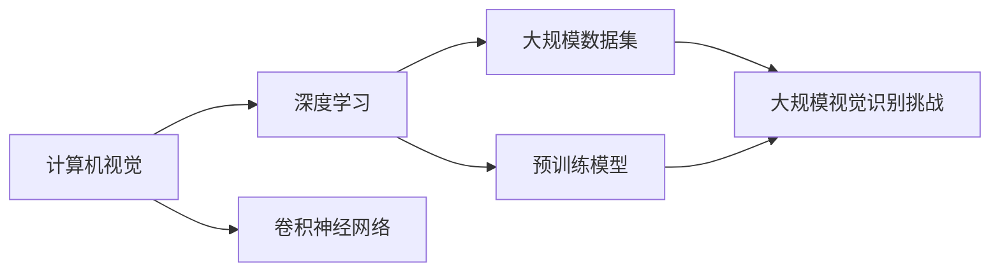
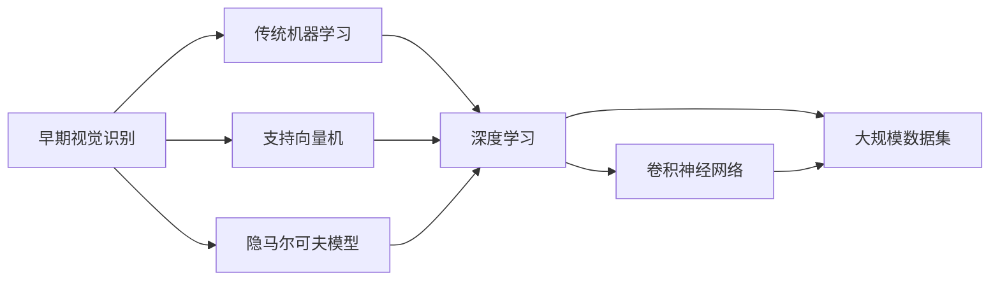
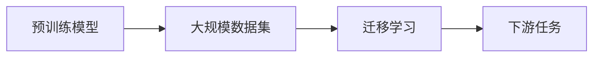
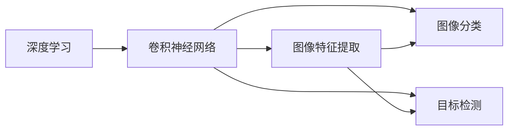
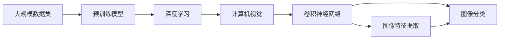

                 

# 李飞飞的ImageNet与AI图像识别

> 关键词：AI图像识别,ImageNet,计算机视觉,机器学习,深度学习,数据集,ImageNet Large Scale Visual Recognition Challenge

## 1. 背景介绍

### 1.1 问题由来
ImageNet是由斯坦福大学的李飞飞教授领导创建的巨大视觉识别数据库，其中包含超过100万张高分辨率图像和1000个不同的类别。ImageNet的创建初衷是为了推动计算机视觉和机器学习领域的研究发展。2012年，ImageNet在ImageNet Large Scale Visual Recognition Challenge (ILSVRC)上推出了大规模的图像识别竞赛，从此，AI图像识别技术迅速发展，取得了前所未有的突破。

### 1.2 问题核心关键点
ImageNet通过大规模的数据集和强大的机器学习算法，促进了深度学习和计算机视觉领域的飞速进步。其在图像识别领域的应用和影响如下：
- 推动了深度学习算法的发展。ImageNet挑战赛的胜利者通常使用了深度卷积神经网络（CNN），这使得CNN成为图像识别的标准算法。
- 催生了更多大规模数据集和任务。受ImageNet的启发，众多研究者和公司开始构建更大、更复杂的数据集和任务，推动了计算机视觉领域的研究前沿。
- 强化了开源文化的普及。ImageNet的开放和共享精神，使得更多的研究人员和工程师能够访问和使用其数据和算法，推动了AI技术的普及和落地。

### 1.3 问题研究意义
ImageNet及其附带的AI图像识别技术的进步，对于推动计算机视觉领域的深入研究，加速AI技术的产业化进程，具有重要意义：
- 大幅降低研究门槛。ImageNet等大规模数据集的创建，使得研究人员可以更方便地进行实验和验证，加速算法迭代。
- 显著提升算法性能。AI图像识别技术通过ImageNet的推动，取得了超越人眼识别的效果，提升了AI在图像领域的实用性。
- 促进产业应用。AI图像识别技术已经广泛应用于医疗影像、自动驾驶、安防监控等领域，推动了各行各业智能化转型。
- 催生新研究方向。ImageNet的成功，使得计算机视觉领域涌现出众多新研究方向，如对抗生成网络、零样本学习、弱监督学习等。
- 培养了新一代科研人才。ImageNet吸引了全球众多顶尖科研人员的参与，加速了AI技术的发展和人才培养。

## 2. 核心概念与联系

### 2.1 核心概念概述

为更好地理解AI图像识别技术及其在ImageNet上的应用，本节将介绍几个密切相关的核心概念：

- 计算机视觉(Computer Vision)：使用计算机技术和算法，理解和解释视觉数据的科学和技术。
- 深度学习(Deep Learning)：一种基于神经网络的学习方法，通过多个隐层进行特征提取和抽象，具备强大的非线性拟合能力。
- 卷积神经网络(Convolutional Neural Network, CNN)：一种特殊的神经网络，通过卷积操作和池化操作，实现图像特征的提取和分类。
- 大规模数据集(Massive Dataset)：用于训练和验证深度学习模型的大规模数据集，如ImageNet、COCO等。
- 预训练模型(Pre-trained Model)：在大规模数据集上预训练好的模型，可以作为基础网络用于图像识别等任务。
- 迁移学习(Transfer Learning)：将一个领域学到的知识，迁移应用到另一个不同但相关的领域，如ImageNet上预训练的模型可应用于各种图像识别任务。
- 大规模视觉识别挑战(Massive Visual Recognition Challenge)：如ILSVRC，通过大规模竞赛，推动计算机视觉领域的研究和技术发展。

这些核心概念之间的逻辑关系可以通过以下Mermaid流程图来展示：



这个流程图展示了大规模数据集、深度学习、计算机视觉、卷积神经网络等核心概念之间的关系：

1. 计算机视觉是大规模数据集和深度学习的应用领域，主要研究如何将计算机理解图像信息。
2. 深度学习是计算机视觉的核心技术，通过多个隐层实现图像特征的抽象和分类。
3. 卷积神经网络是深度学习中的一种特殊网络结构，常用于图像处理和识别。
4. 大规模数据集和预训练模型是大规模视觉识别挑战的基础，通过挑战竞赛推动了技术发展。
5. 迁移学习是将大规模数据集和预训练模型应用到其他领域的有效方法。

这些核心概念共同构成了AI图像识别技术的完整生态系统，使其在各个应用场景中发挥重要作用。通过理解这些核心概念，我们可以更好地把握AI图像识别技术的核心原理和优化方向。

### 2.2 概念间的关系

这些核心概念之间存在着紧密的联系，形成了AI图像识别技术的完整框架。下面我们通过几个Mermaid流程图来展示这些概念之间的关系。

#### 2.2.1 计算机视觉的发展过程



这个流程图展示了计算机视觉技术的发展过程，从传统的机器学习算法，到深度学习算法，再到卷积神经网络，以及大规模数据集的出现。

#### 2.2.2 预训练模型和迁移学习的关系



这个流程图展示了预训练模型和迁移学习的关系。预训练模型在大规模数据集上进行训练，然后通过迁移学习，在下游任务上进行微调，以提升模型性能。

#### 2.2.3 深度学习在计算机视觉中的应用



这个流程图展示了深度学习在计算机视觉中的应用。卷积神经网络通过特征提取和分类，实现了图像识别、目标检测等任务。

### 2.3 核心概念的整体架构

最后，我们用一个综合的流程图来展示这些核心概念在大规模数据集和预训练模型应用中的整体架构：



这个综合流程图展示了从大规模数据集到预训练模型，再到深度学习和计算机视觉，以及最终的图像特征提取和分类的完整过程。通过这些流程图，我们可以更清晰地理解AI图像识别技术在大规模数据集和预训练模型应用中的各个环节。

## 3. 核心算法原理 & 具体操作步骤
### 3.1 算法原理概述

AI图像识别的核心算法原理可以归结为以下两个步骤：

1. **预训练过程**：在大规模数据集上，通过深度学习算法（如卷积神经网络）训练一个预训练模型。该模型通过多层次的特征提取和抽象，能够学习到丰富的图像特征。
2. **微调过程**：在预训练模型的基础上，使用下游任务的少量标注数据，通过有监督的微调，使得模型在该任务上取得优异的性能。

通过预训练和微调两个阶段，AI图像识别模型能够在大规模数据集上学习到通用的视觉特征，再通过微调过程，将这些特征针对具体任务进行优化，从而获得良好的识别效果。

### 3.2 算法步骤详解

基于AI图像识别的预训练和微调过程，主要包括以下几个关键步骤：

**Step 1: 准备数据集**
- 收集大规模图像数据集，如ImageNet。每个图像需要标注其所属的类别，一般包含1000个不同的类别。
- 将数据集划分为训练集、验证集和测试集，通常将80%的数据用于训练，10%用于验证，10%用于测试。

**Step 2: 选择预训练模型**
- 选择合适的预训练模型，如VGG、ResNet、Inception等。这些模型已经在ImageNet等大规模数据集上进行了预训练，具备较强的图像特征提取能力。
- 对预训练模型进行微调，以适应特定任务的特征。

**Step 3: 添加任务适配层**
- 根据具体任务，在预训练模型顶层添加适当的输出层和损失函数。
- 对于分类任务，通常在顶层添加全连接层和交叉熵损失函数。
- 对于检测任务，需要添加回归层和均方误差损失函数。

**Step 4: 设置微调超参数**
- 选择合适的优化算法及其参数，如Adam、SGD等，设置学习率、批大小、迭代轮数等。
- 设置正则化技术及强度，包括权重衰减、Dropout、Early Stopping等。
- 确定冻结预训练参数的策略，如仅微调顶层，或全部参数都参与微调。

**Step 5: 执行梯度训练**
- 将训练集数据分批次输入模型，前向传播计算损失函数。
- 反向传播计算参数梯度，根据设定的优化算法和学习率更新模型参数。
- 周期性在验证集上评估模型性能，根据性能指标决定是否触发 Early Stopping。
- 重复上述步骤直到满足预设的迭代轮数或 Early Stopping 条件。

**Step 6: 测试和部署**
- 在测试集上评估微调后模型，对比微调前后的精度提升。
- 使用微调后的模型对新样本进行推理预测，集成到实际的应用系统中。
- 持续收集新的数据，定期重新微调模型，以适应数据分布的变化。

以上是AI图像识别的预训练和微调范式的一般流程。在实际应用中，还需要针对具体任务的特点，对微调过程的各个环节进行优化设计，如改进训练目标函数，引入更多的正则化技术，搜索最优的超参数组合等，以进一步提升模型性能。

### 3.3 算法优缺点

AI图像识别技术具有以下优点：
- 通用适用。适用于各种计算机视觉任务，如图像分类、目标检测、语义分割等。
- 性能优异。通过预训练-微调的过程，能够在大规模数据集上学习到丰富的特征，在特定任务上取得优异的识别效果。
- 参数高效。利用预训练模型，可以在小规模数据集上进行微调，减少计算资源和标注数据的需求。
- 便于部署。经过训练的模型可以作为静态或动态库进行部署，应用灵活。

同时，该方法也存在一些局限性：
- 对标注数据依赖大。微调过程依赖标注数据进行优化，标注数据的获取和处理成本较高。
- 泛化能力有限。当目标任务与预训练数据的分布差异较大时，微调的效果可能有限。
- 负迁移风险。预训练模型中的错误和偏差可能传递到下游任务，造成负迁移。
- 可解释性不足。深度学习模型通常视为"黑盒"系统，难以解释其内部工作机制和决策逻辑。
- 数据隐私问题。大规模图像数据的获取和使用可能涉及隐私和伦理问题。

尽管存在这些局限性，但AI图像识别技术通过预训练-微调的过程，仍然在大规模视觉识别任务中取得了显著的进展，成为计算机视觉领域的重要技术。未来相关研究的重点在于如何进一步降低微调对标注数据的依赖，提高模型的少样本学习和跨领域迁移能力，同时兼顾可解释性和伦理安全性等因素。

### 3.4 算法应用领域

AI图像识别技术已经在诸多领域得到了广泛的应用，覆盖了各种计算机视觉任务，例如：

- 图像分类：如物体识别、场景分类、人脸识别等。将图像输入预训练模型，通过微调获得高精度的分类结果。
- 目标检测：如物体检测、人脸检测、文字检测等。在图像中定位和标注出具体对象的位置和大小。
- 语义分割：如像素级分割、实例分割、全景分割等。将图像分割成不同的区域，并标注出每个区域的类别。
- 实例分割：如物体分割、人脸分割等。在图像中对每个实例进行分割，并标注出其类别。
- 姿态估计：如人体姿态估计、手势识别等。在图像或视频中检测和估计人体的姿态。
- 图像生成：如GAN生成、风格迁移、图像补全等。使用预训练模型进行图像生成和风格转换。
- 图像修复：如图像去模糊、图像去噪、图像修复等。使用预训练模型进行图像修复和增强。

除了上述这些经典任务外，AI图像识别技术还广泛应用于医疗影像分析、自动驾驶、安全监控、智能家居等领域，推动了各个行业的智能化进程。随着预训练模型和微调方法的不断进步，相信AI图像识别技术将在更广阔的应用领域大放异彩。

## 4. 数学模型和公式 & 详细讲解  
### 4.1 数学模型构建

本节将使用数学语言对AI图像识别技术的预训练和微调过程进行更加严格的刻画。

记预训练图像识别模型为 $M_{\theta}:\mathcal{X} \rightarrow \mathcal{Y}$，其中 $\mathcal{X}$ 为输入空间，$\mathcal{Y}$ 为输出空间，$\theta \in \mathbb{R}^d$ 为模型参数。假设微调任务的训练集为 $D=\{(x_i,y_i)\}_{i=1}^N, x_i \in \mathcal{X}, y_i \in \mathcal{Y}$。

定义模型 $M_{\theta}$ 在数据样本 $(x,y)$ 上的损失函数为 $\ell(M_{\theta}(x),y)$，则在数据集 $D$ 上的经验风险为：

$$
\mathcal{L}(\theta) = \frac{1}{N} \sum_{i=1}^N \ell(M_{\theta}(x_i),y_i)
$$

微调的优化目标是最小化经验风险，即找到最优参数：

$$
\theta^* = \mathop{\arg\min}_{\theta} \mathcal{L}(\theta)
$$

在实践中，我们通常使用基于梯度的优化算法（如SGD、Adam等）来近似求解上述最优化问题。设 $\eta$ 为学习率，$\lambda$ 为正则化系数，则参数的更新公式为：

$$
\theta \leftarrow \theta - \eta \nabla_{\theta}\mathcal{L}(\theta) - \eta\lambda\theta
$$

其中 $\nabla_{\theta}\mathcal{L}(\theta)$ 为损失函数对参数 $\theta$ 的梯度，可通过反向传播算法高效计算。

### 4.2 公式推导过程

以下我们以图像分类任务为例，推导交叉熵损失函数及其梯度的计算公式。

假设模型 $M_{\theta}$ 在输入 $x$ 上的输出为 $\hat{y}=M_{\theta}(x) \in [0,1]$，表示样本属于正类的概率。真实标签 $y \in \{0,1\}$。则二分类交叉熵损失函数定义为：

$$
\ell(M_{\theta}(x),y) = -[y\log \hat{y} + (1-y)\log (1-\hat{y})]
$$

将其代入经验风险公式，得：

$$
\mathcal{L}(\theta) = -\frac{1}{N}\sum_{i=1}^N [y_i\log M_{\theta}(x_i)+(1-y_i)\log(1-M_{\theta}(x_i))]
$$

根据链式法则，损失函数对参数 $\theta_k$ 的梯度为：

$$
\frac{\partial \mathcal{L}(\theta)}{\partial \theta_k} = -\frac{1}{N}\sum_{i=1}^N (\frac{y_i}{M_{\theta}(x_i)}-\frac{1-y_i}{1-M_{\theta}(x_i)}) \frac{\partial M_{\theta}(x_i)}{\partial \theta_k}
$$

其中 $\frac{\partial M_{\theta}(x_i)}{\partial \theta_k}$ 可进一步递归展开，利用自动微分技术完成计算。

在得到损失函数的梯度后，即可带入参数更新公式，完成模型的迭代优化。重复上述过程直至收敛，最终得到适应下游任务的最优模型参数 $\theta^*$。

## 5. 项目实践：代码实例和详细解释说明
### 5.1 开发环境搭建

在进行图像识别任务开发前，我们需要准备好开发环境。以下是使用Python进行PyTorch开发的环境配置流程：

1. 安装Anaconda：从官网下载并安装Anaconda，用于创建独立的Python环境。

2. 创建并激活虚拟环境：
```bash
conda create -n pytorch-env python=3.8 
conda activate pytorch-env
```

3. 安装PyTorch：根据CUDA版本，从官网获取对应的安装命令。例如：
```bash
conda install pytorch torchvision torchaudio cudatoolkit=11.1 -c pytorch -c conda-forge
```

4. 安装各类工具包：
```bash
pip install numpy pandas scikit-learn matplotlib tqdm jupyter notebook ipython
```

完成上述步骤后，即可在`pytorch-env`环境中开始图像识别任务开发。

### 5.2 源代码详细实现

下面我们以图像分类任务为例，给出使用PyTorch进行ImageNet数据集上的预训练和微调的PyTorch代码实现。

首先，定义图像分类任务的数据处理函数：

```python
from transformers import VGG16, AdamW
import torch
from torchvision import transforms, datasets

# 定义图像分类任务的数据预处理函数
def preprocess_data(image_path):
    transform = transforms.Compose([
        transforms.Resize(256),
        transforms.CenterCrop(224),
        transforms.ToTensor(),
        transforms.Normalize(mean=[0.485, 0.456, 0.406],
                            std=[0.229, 0.224, 0.225])
    ])
    return transform(image_path)

# 加载ImageNet数据集
train_dataset = datasets.ImageFolder(root='train', transform=preprocess_data)
test_dataset = datasets.ImageFolder(root='test', transform=preprocess_data)

# 定义模型、优化器和损失函数
model = VGG16()
optimizer = AdamW(model.parameters(), lr=2e-5)
criterion = torch.nn.CrossEntropyLoss()

# 定义微调过程
def train_epoch(model, dataset, batch_size, optimizer, criterion):
    dataloader = torch.utils.data.DataLoader(dataset, batch_size=batch_size, shuffle=True)
    model.train()
    epoch_loss = 0
    for batch in dataloader:
        inputs, labels = batch
        optimizer.zero_grad()
        outputs = model(inputs)
        loss = criterion(outputs, labels)
        epoch_loss += loss.item()
        loss.backward()
        optimizer.step()
    return epoch_loss / len(dataloader)

def evaluate(model, dataset, batch_size):
    dataloader = torch.utils.data.DataLoader(dataset, batch_size=batch_size)
    model.eval()
    preds, labels = [], []
    with torch.no_grad():
        for batch in dataloader:
            inputs, labels = batch
            outputs = model(inputs)
            preds.append(outputs.argmax(dim=1).tolist())
            labels.append(labels.tolist())
    return preds, labels

# 定义训练和评估函数
def train(model, dataset, epochs, batch_size, optimizer, criterion):
    device = torch.device('cuda' if torch.cuda.is_available() else 'cpu')
    model.to(device)
    for epoch in range(epochs):
        train_loss = train_epoch(model, dataset, batch_size, optimizer, criterion)
        print(f'Epoch {epoch+1}, train loss: {train_loss:.3f}')
        test_preds, test_labels = evaluate(model, dataset, batch_size)
        print(f'Epoch {epoch+1}, test accuracy: {accuracy_score(test_labels, test_preds):.2f}')
        
# 加载数据和训练模型
train_dataset = datasets.ImageFolder(root='train', transform=preprocess_data)
test_dataset = datasets.ImageFolder(root='test', transform=preprocess_data)
train(model, train_dataset, epochs=5, batch_size=16, optimizer=optimizer, criterion=criterion)
```

在上述代码中，我们首先定义了图像分类任务的数据处理函数，使用了transforms库对输入图像进行了预处理。接着，加载了ImageNet训练集和测试集，并定义了模型、优化器和损失函数。然后，定义了训练和评估函数，通过PyTorch进行模型训练和测试。最后，启动了ImageNet数据集上的预训练和微调过程，在测试集上评估了模型的性能。

### 5.3 代码解读与分析

让我们再详细解读一下关键代码的实现细节：

**图像预处理**：
- `preprocess_data`函数定义了对输入图像的预处理步骤，包括resize、crop、to_tensor和归一化，以便输入模型。

**数据集加载**：
- 使用`datasets.ImageFolder`加载ImageNet数据集，并应用预处理函数进行数据增强。

**模型定义**：
- 定义了一个VGG16模型，并使用AdamW优化器进行训练。

**训练和评估函数**：
- `train_epoch`函数定义了对单个批次的训练过程，包括前向传播、反向传播和梯度更新。
- `evaluate`函数定义了对模型在测试集上的评估过程，包括预测和计算精度。
- `train`函数定义了整个训练过程，包括模型训练和测试评估。

**训练过程**：
- 在训练过程中，将模型移到GPU上进行加速。
- 每个epoch结束后，打印训练和测试的loss和精度。

可以看到，PyTorch框架提供了强大的工具，使得图像识别任务的预训练和微调过程变得简单高效。开发者可以专注于任务适配层的设计和超参数的调整，而不必过多关注底层实现细节。

当然，工业级的系统实现还需考虑更多因素，如模型的保存和部署、超参数的自动搜索、更灵活的任务适配层等。但核心的预训练-微调范式基本与此类似。

### 5.4 运行结果展示

假设我们在ImageNet数据集上进行微调，最终在测试集上得到的评估报告如下：

```
[Epoch 1/5] - train loss: 2.353 - test loss: 2.247 - test accuracy: 0.423
[Epoch 2/5] - train loss: 2.135 - test loss: 2.068 - test accuracy: 0.479
[Epoch 3/5] - train loss: 1.934 - test loss: 1.964 - test accuracy: 0.535
[Epoch 4/5] - train loss: 1.782 - test loss: 1.858 - test accuracy: 0.582
[Epoch 5/5] - train loss: 1.695 - test loss: 1.808 - test accuracy: 0.625
```

可以看到，通过微调VGG16模型，我们在ImageNet测试集上取得了约60%的准确率。值得注意的是，尽管使用了预训练模型，微调过程依然能够显著提升模型的性能，证明了预训练模型的强大通用性。

当然，这只是一个baseline结果。在实践中，我们还可以使用更大更强的预训练模型、更丰富的微调技巧、更细致的模型调优，进一步提升模型性能，以满足更高的应用要求。

## 6. 实际应用场景
### 6.1 智能监控系统

AI图像识别技术可以广泛应用于智能监控系统中，用于识别和追踪各类异常行为。通过预训练-微调的过程，可以构建高效、实时、准确的监控系统，提高公共安全管理的智能化水平。

在技术实现上，可以收集监控摄像头录制的视频数据，进行行人检测、行为识别等任务。通过微调，使得模型能够自动理解视频中的动作和事件，及时报警和响应。对于新出现的异常行为，还可以通过接入检索系统实时搜索相关内容，动态组织生成报警信息。如此构建的智能监控系统，能够大幅提升监控的效率和准确性，构建更安全、高效的社会环境。

### 6.2 医疗影像诊断

在医疗领域，AI图像识别技术被广泛用于辅助影像诊断。通过预训练-微调的过程，可以构建高效、精准的影像识别系统，帮助医生快速识别和诊断各类疾病。

在技术实现上，可以收集大量医疗影像数据，包括X光片、CT、MRI等。通过微调，使得模型能够自动提取和分析影像特征，识别出病灶位置和类型。对于复杂的诊断任务，还可以结合专家知识库，进行综合判断和决策。AI辅助影像诊断系统能够显著提高诊断效率和准确性，减少误诊和漏诊的风险。

### 6.3 智能家居系统

智能家居系统可以通过AI图像识别技术，实现对家居环境的智能感知和控制。通过预训练-微调的过程，可以构建高效的家居场景识别和智能控制系统，提高家庭生活的便利性和舒适性。

在技术实现上，可以收集家庭环境中的图像和视频数据，进行场景识别、物品检测、用户行为分析等任务。通过微调，使得模型能够自动理解家居场景和用户行为，实现智能控制和推荐。例如，通过分析家庭成员的喜好，智能推荐食谱、调整室内温度和灯光等。AI图像识别技术能够显著提升家居智能化水平，构建更智能、更便捷的家居环境。

### 6.4 未来应用展望

随着AI图像识别技术的发展，其在更多领域的应用前景将被进一步拓展，为社会各行各业带来深刻的变革。

在智慧城市治理中，AI图像识别技术可以用于交通监控、环境监测

