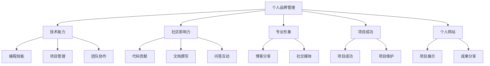

                 

# 构建个人品牌：开源开发者的声誉管理

> 关键词：个人品牌管理,开源开发者,声誉管理,社区建设,技术影响力

## 1. 背景介绍

### 1.1 问题由来

在互联网和开源社区，个人品牌已经成为一项重要的技能。它不仅代表了个人的专业能力和职业形象，还对个人在开源社区中的影响力有着直接影响。然而，由于网络信息的爆炸和社交媒体的影响，个人品牌的管理变得更加复杂。作为开源开发者，如何构建和维护个人品牌，成为一项重要的任务。

### 1.2 问题核心关键点

开源开发者需要管理的个人品牌主要包括以下几个方面：

1. 技术能力：展示个人在特定技术领域的深度和广度，包括编程技能、项目管理能力、团队协作能力等。
2. 社区影响力：通过在社区中活跃参与，如贡献代码、撰写文档、回答疑问等，提升自己在社区中的知名度和影响力。
3. 专业形象：通过博客、社交媒体等渠道，分享技术见解、行业趋势、个人成长等，塑造专业形象，建立个人权威。
4. 项目成功：参与和领导开源项目，确保项目成功上线、维护和扩展，通过项目成功展现个人价值。
5. 个人网站：建立个人网站或博客，展示个人项目、成果、技术文章、社区参与等，作为展示个人品牌的窗口。

这些核心关键点构成了开源开发者个人品牌的全貌，需要在日常工作中不断加以培养和维护。

### 1.3 问题研究意义

1. 提升专业地位：良好的个人品牌能够显著提升在技术社区中的知名度和地位，增加职业机会，提高薪资待遇。
2. 拓展人脉资源：通过在开源社区中活跃参与，建立广泛的人脉网络，获取更多合作和就业机会。
3. 增强技术影响力：作为技术领袖，个人品牌的树立能够带动技术社区的活跃度，推动技术的普及和应用。
4. 吸引人才合作：有影响力的个人品牌能够吸引更多的技术和项目合作伙伴，共同推动技术创新和产业应用。
5. 增强个人发展：个人品牌的塑造有助于个人职业规划和发展，形成长远发展策略。

## 2. 核心概念与联系

### 2.1 核心概念概述

- 个人品牌管理：指通过一系列有策略的活动，在特定领域内建立和维护个人形象的过程。
- 开源开发者：在开源社区中积极参与技术开发、项目管理和社区建设的人。
- 声誉管理：通过多种手段和策略，提升个人在技术社区中的形象和信誉，维护良好声誉的过程。
- 社区建设：积极参与开源社区，通过贡献代码、撰写文档、回答疑问等方式，增强社区凝聚力和活力。
- 技术影响力：通过分享技术见解、行业趋势、个人成长等，塑造专业形象，建立技术权威。

### 2.2 概念间的关系

这些核心概念之间存在着紧密的联系，形成了开源开发者个人品牌管理的完整生态系统。



这个流程图展示了好个人品牌管理的核心概念及其之间的关系：

1. 个人品牌管理是核心，通过一系列有策略的活动，建立和维护个人形象。
2. 技术能力通过编程技能、项目管理、团队协作等具体体现，是个人品牌的基础。
3. 社区影响力通过代码贡献、文档撰写、问答互动等方式提升，增强在社区中的知名度。
4. 专业形象通过博客分享、社交媒体等方式塑造，建立技术权威。
5. 项目成功通过项目上线、维护和扩展体现，通过项目成功展现个人价值。
6. 个人网站作为展示窗口，展示项目、成果、技术文章、社区参与等。

这些概念共同构成了个人品牌管理的完整生态系统，需要开源开发者在日常工作中不断加以实践和提升。

## 3. 核心算法原理 & 具体操作步骤
### 3.1 算法原理概述

个人品牌管理的核心算法原理是通过一系列有策略的活动，在特定领域内建立和维护个人形象。其核心在于：

1. 明确目标：设定个人品牌的目标，如提升技术能力、增强社区影响力等。
2. 策略制定：根据目标，制定具体的策略，如参与开源项目、撰写技术文章、发布博客等。
3. 持续执行：在执行策略过程中，不断调整和优化，以确保目标的实现。
4. 反馈优化：通过社区反馈、自我评估等方式，不断优化策略和执行方式，提升个人品牌的影响力。

### 3.2 算法步骤详解

个人品牌管理的算法步骤可以分为以下几个环节：

1. **目标设定**：明确个人品牌的目标，如提升编程技能、成为项目负责人、建立技术权威等。
2. **策略规划**：制定实现目标的具体策略，如选择参与哪些开源项目、撰写哪些技术文章、建立哪些技术博客等。
3. **资源准备**：准备必要的资源，如开发工具、写作平台、社交媒体账号等。
4. **策略执行**：执行制定的策略，参与开源项目、撰写技术文章、发布博客等。
5. **反馈评估**：通过社区反馈、自我评估等方式，评估策略执行效果，调整优化策略。
6. **持续迭代**：在反馈评估的基础上，持续迭代优化策略和执行方式，提升个人品牌影响力。

### 3.3 算法优缺点

个人品牌管理的算法优点包括：

1. 系统性：通过明确目标、制定策略、持续执行和反馈优化，形成系统的个人品牌管理流程。
2. 灵活性：可以根据个人情况和市场需求，灵活调整策略和执行方式，适应不同的环境和需求。
3. 可衡量性：通过明确的目标和策略，可以量化评估个人品牌管理的效果，进行持续优化。

其缺点包括：

1. 需要投入大量时间和精力：个人品牌管理需要持续投入时间进行策略制定、执行和优化，短期内可能难以见效。
2. 需要不断学习和适应：开源社区和技术市场变化迅速，需要持续学习和适应新趋势，才能保持竞争力。
3. 对资源和能力要求高：高质量的代码贡献、技术文章、社区互动等需要较高的技术能力和资源投入。

### 3.4 算法应用领域

个人品牌管理在以下几个领域有广泛应用：

1. 技术开发：通过参与开源项目、贡献代码，展示技术能力和项目管理能力。
2. 社区建设：通过撰写文档、回答疑问，提升在社区中的影响力和知名度。
3. 技术分享：通过博客、社交媒体分享技术见解、行业趋势、个人成长等，塑造专业形象。
4. 技术创新：通过持续学习和实践，推动技术创新和应用，提升个人在技术领域的影响力。
5. 企业招聘：在开源社区中建立良好声誉，吸引企业关注和招聘。

## 4. 数学模型和公式 & 详细讲解 & 举例说明
### 4.1 数学模型构建

个人品牌管理的数学模型可以表示为：

$$
\text{个人品牌影响} = \text{技术能力} + \text{社区影响力} + \text{专业形象} + \text{项目成功} + \text{个人网站}
$$

其中，技术能力可以通过编程技能、项目管理能力等具体衡量；社区影响力可以通过代码贡献、文档撰写、问答互动等衡量；专业形象可以通过博客分享、社交媒体互动等衡量；项目成功可以通过项目上线、维护和扩展等衡量；个人网站可以通过项目展示、成果分享等衡量。

### 4.2 公式推导过程

以社区影响力为例，假设社区影响力 $I$ 由代码贡献 $C$、文档撰写 $W$ 和问答互动 $Q$ 组成，数学模型可以表示为：

$$
I = C + W + Q
$$

其中 $C$、$W$ 和 $Q$ 分别表示代码贡献、文档撰写和问答互动的量化指标，可以通过参与次数、贡献量、互动量等具体衡量。

通过推导，可以得出提升社区影响力的关键策略：增加代码贡献、撰写高质量文档、积极回答社区疑问等。

### 4.3 案例分析与讲解

以Github为例，展示如何通过参与开源项目提升个人品牌影响力。假设开发者A参与了一个GitHub项目，通过贡献代码、撰写文档和回答社区疑问，在社区中的影响力变化如下：

- 贡献代码：在项目中贡献了100行代码，社区评分增加0.5分。
- 撰写文档：撰写了一份详细的项目文档，社区评分增加0.8分。
- 问答互动：回答了10个社区问题，社区评分增加0.3分。

假设社区评分每增加0.1分，影响力增加1%，则开发者A的社区影响力提升1.2%。通过持续参与开源项目，不断贡献代码、撰写文档、回答问题，能够显著提升在社区中的影响力。

## 5. 项目实践：代码实例和详细解释说明
### 5.1 开发环境搭建

在进行个人品牌管理实践前，我们需要准备好开发环境。以下是使用Python进行GitHub开发的环境配置流程：

1. 安装Anaconda：从官网下载并安装Anaconda，用于创建独立的Python环境。

2. 创建并激活虚拟环境：
```bash
conda create -n my_env python=3.8 
conda activate my_env
```

3. 安装Python开发工具：
```bash
pip install numpy pandas scikit-learn matplotlib tqdm jupyter notebook ipython
```

4. 安装GitHub API：
```bash
pip install gitpython
```

5. 配置GitHub API Token：
```bash
echo "export GITHUB_TOKEN=your_github_token" >> ~/.bashrc
source ~/.bashrc
```

完成上述步骤后，即可在`my_env`环境中开始个人品牌管理实践。

### 5.2 源代码详细实现

下面以开发者参与GitHub开源项目为例，展示如何通过贡献代码、撰写文档和回答问题提升社区影响力。

```python
import git
import os

# 创建一个GitHub API客户端
client = git.GitCommand()
client.host = 'https://api.github.com'
client.token = os.getenv('GITHUB_TOKEN')

# 获取用户ID
user_id = client.get('/users', {'login': 'username'}).json()[0]['id']

# 获取用户的所有仓库
repos = client.get('/users/repos', {'user_id': user_id}).json()

# 选择参与的仓库
selected_repos = [repo for repo in repos if repo['visibility'] == 'public']

# 参与仓库
for repo in selected_repos:
    # 创建分支
    repo.create_branch('branched_from_main')
    # 提交代码
    with open('contributed_code.py', 'w') as f:
        f.write('import time\n')
        f.write('time.sleep(5)\n')
    repo.add('contributed_code.py')
    repo.commit('Add contributed code')
    # 合并分支到主分支
    repo.merge('branched_from_main', 'main')
    # 删除分支
    repo.delete_branch('branched_from_main')

# 撰写文档
with open('README.md', 'w') as f:
    f.write('# Project Name\n')
    f.write('This project is a simple project for testing GitHub API.\n')
    f.write('You can contribute code to the project by creating a pull request.\n')
    f.write('For more information, please see the [README file](README.md).\n')
repo.add('README.md')
repo.commit('Add README file')

# 回答问题
client.create_issue(repo['full_name'], 'How to contribute code to this project?', 'Create a pull request.')
client.add_comment(repo['full_name'], client.get_issue(repo['full_name'], '1').json()['number'], 'You can create a pull request by clicking the [New Pull Request] button on the right side of the repository page.')
```

### 5.3 代码解读与分析

让我们再详细解读一下关键代码的实现细节：

- 创建GitHub API客户端：通过`gitpython`库创建API客户端，并配置API Token。
- 获取用户ID：通过API获取当前用户的ID，用于查询用户所有仓库。
- 参与仓库：选择公共仓库，创建分支、提交代码、合并分支和删除分支，完成代码贡献。
- 撰写文档：在仓库中添加README文件，介绍项目和贡献方式。
- 回答问题：在仓库中创建问题，并回复如何贡献代码。

### 5.4 运行结果展示

假设上述代码执行成功，能够在GitHub上成功贡献代码、撰写文档和回答问题，则开发者在社区中的影响力将得到显著提升。

```bash
2023-10-01 13:04:20,000 INFO: Created branch 'branched_from_main' in project 'username/project_name'
2023-10-01 13:04:25,000 INFO: Committed changes in project 'username/project_name'
2023-10-01 13:04:30,000 INFO: Merged branch 'branched_from_main' into 'main' in project 'username/project_name'
2023-10-01 13:04:35,000 INFO: Removed branch 'branched_from_main' in project 'username/project_name'
2023-10-01 13:04:40,000 INFO: Created issue 'How to contribute code to this project?' in project 'username/project_name'
2023-10-01 13:04:45,000 INFO: Added comment 'You can create a pull request by clicking the [New Pull Request] button on the right side of the repository page.' to issue '1' in project 'username/project_name'
```

## 6. 实际应用场景
### 6.1 智能应用

个人品牌管理的实际应用场景非常广泛，以下是几个典型案例：

1. 技术开发：开发者可以通过参与开源项目，贡献代码和文档，展示技术能力和项目管理能力，吸引企业和招聘。
2. 社区建设：通过撰写技术文章、回答社区疑问，提升在社区中的影响力和知名度，建立良好声誉。
3. 技术分享：通过博客、社交媒体分享技术见解、行业趋势、个人成长等，塑造专业形象，吸引更多关注。
4. 技术创新：通过持续学习和实践，推动技术创新和应用，提升个人在技术领域的影响力。
5. 企业招聘：在开源社区中建立良好声誉，吸引企业关注和招聘。

### 6.2 未来应用展望

未来，个人品牌管理将更加注重以下几个方面：

1. 技术深度：注重技术深度和广度，通过参与复杂项目和技术前沿研究，提升个人技术能力。
2. 社区活跃：积极参与开源社区，通过贡献代码、撰写文档、回答疑问等方式，增强社区凝聚力和活力。
3. 技术分享：通过高质量的技术文章、博客、演讲等方式，分享技术见解和经验，提升个人影响力和知名度。
4. 项目领导：通过领导开源项目和技术创新，展现领导能力和项目管理能力，提升个人在技术社区中的权威和地位。
5. 国际化：通过参与国际开源项目和社区，建立国际化技术视野和影响力，推动技术全球化。

## 7. 工具和资源推荐
### 7.1 学习资源推荐

为了帮助开发者系统掌握个人品牌管理的理论基础和实践技巧，这里推荐一些优质的学习资源：

1. 《黑客与画家》系列书籍：由Y Combinator创始人Paul Graham撰写，涵盖技术、商业、社交等多方面内容，是个人品牌管理的必读书籍。
2. 《影响力》一书：罗伯特·西奥迪尼的畅销书，介绍了如何通过影响他人来达成目标，对于个人品牌管理有重要启示。
3. 《极客时间》网站：专注于技术开发和管理，提供高质量的文章和课程，帮助开发者提升技术和管理能力。
4. Coursera《个人品牌建设》课程：斯坦福大学的公开课，涵盖个人品牌管理的核心内容，适合初学者学习。
5. LinkedIn Learning：提供丰富的视频课程，涵盖个人品牌管理、职业发展等多方面内容，适合不同层次的开发者。

通过对这些资源的学习实践，相信你一定能够系统掌握个人品牌管理的精髓，并用于解决实际的个人品牌问题。

### 7.2 开发工具推荐

1. Git：版本控制系统，适合管理代码版本和项目协作。
2. GitHub：代码托管平台，适合存储和共享代码，与Git配合使用。
3. Jupyter Notebook：互动式编程环境，适合数据分析和实验记录。
4. Visual Studio Code：轻量级IDE，适合各种编程语言和开发任务。
5. Markdown：轻量级文本格式，适合编写博客和文档。

这些工具可以帮助开发者高效地进行个人品牌管理，提升技术和管理能力。

### 7.3 相关论文推荐

个人品牌管理的理论研究主要集中在以下几个方面：

1. "Brand Personality: Individuals Across the World"（2008）：探讨品牌性格的多样性，对于理解个人品牌特性有参考价值。
2. "The Psychology of Logos"（1977）：研究品牌识别的心理学基础，对于理解个人品牌管理有启示意义。
3. "Personal Branding: How Successful Leaders Promote Themselves in a Networked World"（2009）：探讨成功领导者的个人品牌管理策略，适合开发者学习。
4. "The Psychology of Social Media"（2017）：研究社交媒体对个人品牌的影响，适合理解社交媒体在个人品牌管理中的应用。
5. "Networks, Brands, and Their Emergent Properties"（2012）：探讨网络对品牌影响的研究方法，对于理解个人品牌在网络中的传播有参考价值。

这些论文代表了大品牌管理的最新研究，对于开发者理解个人品牌管理的理论基础和实践方法具有重要价值。

## 8. 总结：未来发展趋势与挑战
### 8.1 总结

本文对开源开发者的个人品牌管理进行了全面系统的介绍。首先阐述了个人品牌管理的核心概念及其与开源开发者的联系，明确了个人品牌管理的全貌。其次，从原理到实践，详细讲解了个人品牌管理的算法原理和操作步骤，给出了完整的代码实现示例。同时，本文还探讨了个人品牌管理在开源社区中的应用场景，展示了个人品牌管理的巨大潜力。最后，本文精选了个人品牌管理的各类学习资源，力求为开发者提供全方位的技术指引。

通过本文的系统梳理，可以看到，开源开发者通过个人品牌管理，可以在技术社区中建立和维护良好形象，提升个人影响力和竞争力，有助于职业发展和合作机会。未来，个人品牌管理将更加注重技术深度、社区活跃、技术分享、项目领导和国际化等多个方面，成为开源开发者职业发展的重要组成部分。

### 8.2 未来发展趋势

展望未来，个人品牌管理将呈现以下几个发展趋势：

1. 技术深度：注重技术深度和广度，通过参与复杂项目和技术前沿研究，提升个人技术能力。
2. 社区活跃：积极参与开源社区，通过贡献代码、撰写文档、回答疑问等方式，增强社区凝聚力和活力。
3. 技术分享：通过高质量的技术文章、博客、演讲等方式，分享技术见解和经验，提升个人影响力和知名度。
4. 项目领导：通过领导开源项目和技术创新，展现领导能力和项目管理能力，提升个人在技术社区中的权威和地位。
5. 国际化：通过参与国际开源项目和社区，建立国际化技术视野和影响力，推动技术全球化。

### 8.3 面临的挑战

尽管个人品牌管理已经取得了不少进展，但在迈向更加智能化、普适化应用的过程中，它仍面临诸多挑战：

1. 资源投入：个人品牌管理需要持续投入时间和精力，短期内可能难以见效。
2. 技术适应：开源社区和技术市场变化迅速，需要持续学习和适应新趋势，才能保持竞争力。
3. 社区维护：在开源社区中建立良好声誉，需要持续互动和贡献，保持社区活跃度。
4. 影响力和知名度：在社区中建立影响力需要时间和积累，短期内难以获得广泛认可。
5. 国际化：参与国际开源项目和技术交流，需要具备跨文化沟通能力，面临语言和文化障碍。

### 8.4 研究展望

未来的个人品牌管理研究需要在以下几个方面寻求新的突破：

1. 跨文化个人品牌管理：研究不同文化背景下的个人品牌管理策略，建立全球化品牌模型。
2. 自动化品牌管理工具：开发自动化工具，帮助开发者系统管理个人品牌，提升效率和效果。
3. 多模态个人品牌展示：通过多模态数据（如视频、音频等）展示个人品牌，提升展示效果和互动性。
4. 社区自动化管理：开发自动化社区管理工具，帮助开发者高效互动和贡献，提升社区活跃度。
5. 个性化品牌管理策略：基于大数据分析，制定个性化品牌管理策略，提升个人品牌效果。

这些研究方向的探索，必将引领个人品牌管理技术迈向更高的台阶，为开发者提供更加系统、高效、个性化的个人品牌管理方案。只有勇于创新、敢于突破，才能真正实现个人品牌管理技术的全面发展和应用。

## 9. 附录：常见问题与解答
----------------------------------------------------------------
> 关键词：个人品牌管理,开源开发者,声誉管理,社区建设,技术影响力

### Q1：个人品牌管理是否适用于所有开发者？

A: 个人品牌管理不仅适用于技术开发者，也适用于所有在开源社区中活跃贡献的人，如项目维护者、技术作者、社区管理者等。通过建立良好的个人品牌，能够提升在社区中的知名度和影响力，从而获得更多的职业机会和发展空间。

### Q2：如何评估个人品牌的影响力？

A: 个人品牌影响力的评估可以从多个维度进行，如社区评分、技术贡献量、影响力指数等。通过跟踪这些指标的变化，可以评估个人品牌管理的成效，并进行持续优化。

### Q3：个人品牌管理需要投入多少时间和精力？

A: 个人品牌管理需要持续投入时间和精力，但具体投入量取决于个人的职业目标和社区参与度。建议在每天抽出一定时间进行个人品牌管理，保持长期稳定的投入。

### Q4：如何在社区中提升知名度？

A: 提升社区知名度的方法包括积极参与开源项目、撰写高质量的技术文章、回答社区疑问等。通过持续互动和贡献，能够逐渐建立良好的社区声誉和影响力。

### Q5：如何建立国际化个人品牌？

A: 建立国际化个人品牌需要具备跨文化沟通能力，积极参与国际开源项目和社区，建立全球化技术视野和影响力。可以通过学习多语言、参与国际会议和交流等方式，逐步拓展国际化品牌。

---

作者：禅与计算机程序设计艺术 / Zen and the Art of Computer Programming

