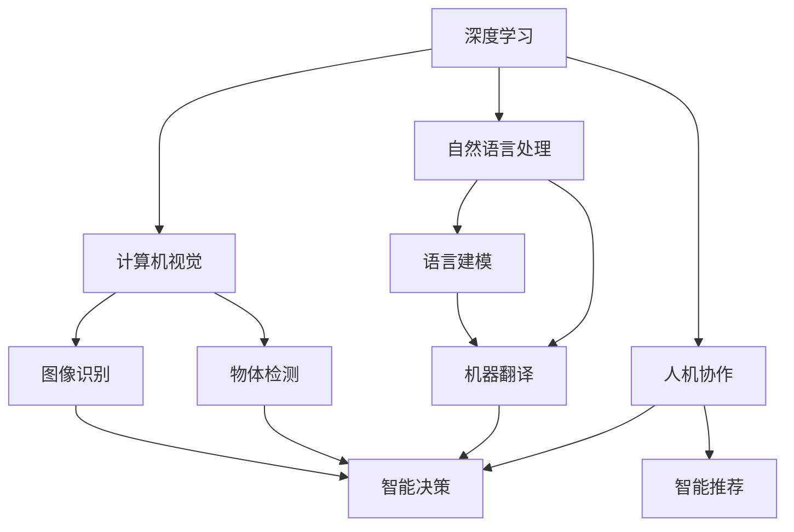
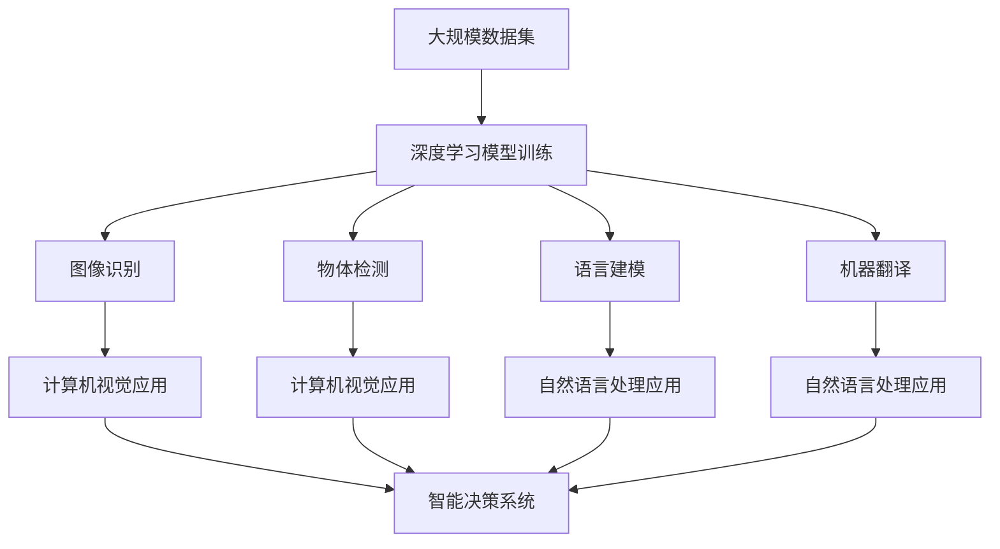
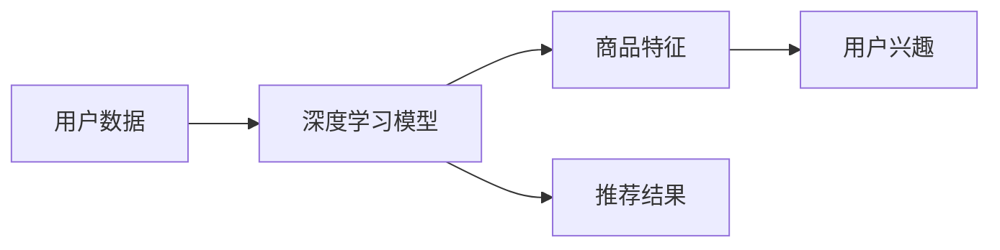
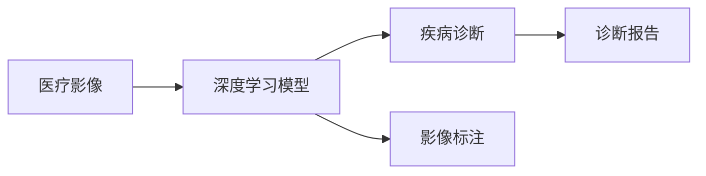
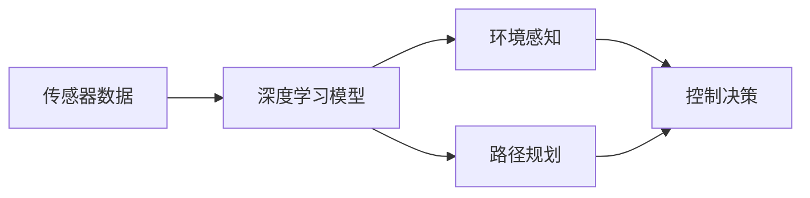

                 

## 1. 背景介绍

在当今这个数字化、智能化的时代，人类计算（Human Computation）已成为推动社会进步和经济发展的重要力量。从深度学习、自然语言处理、计算机视觉到物联网、量子计算，人类计算技术的突破正不断改变我们的生活和工作方式。本文将从多个角度探讨人类计算的应用场景，分析其背后的原理和关键技术，展望未来的发展趋势，并提出相应的挑战和解决方案。

### 1.1 问题由来

人类计算的核心在于利用计算机技术和算法，结合人类的智能和创造力，解决现实世界中的复杂问题。这不仅包括传统的数值计算、模拟仿真、科学计算等领域，也拓展到了大数据分析、人工智能、机器学习、智能决策等领域。

人类计算的兴起，得益于计算机硬件的飞速进步和软件技术的持续创新。特别是深度学习、计算机视觉、自然语言处理等领域的突破，使得计算机能够在图像识别、语音识别、自然语言理解和生成等任务上接近甚至超越人类的水平。这些技术的广泛应用，正在塑造一个更加智能、高效、便捷的世界。

### 1.2 问题核心关键点

人类计算的核心在于将计算机与人类的智能结合，实现更高效、更智能的计算能力。具体来说，关键点包括：

1. **数据驱动**：通过大规模数据集训练模型，提升模型的预测和决策能力。
2. **算法创新**：开发更加高效、准确的算法，解决复杂问题。
3. **跨领域融合**：将不同领域的知识和算法进行融合，实现更广范围的应用。
4. **人机协作**：结合人类智能与计算机计算能力，实现更优的决策和创新。
5. **可解释性**：开发可解释的模型，提升决策的透明度和可信度。

这些关键点共同构成了人类计算的核心，推动了技术在各个领域的应用和创新。

## 2. 核心概念与联系

### 2.1 核心概念概述

为了更好地理解人类计算的应用场景，本文将介绍几个核心概念：

1. **深度学习**：基于神经网络模型的学习范式，通过多层非线性变换，从大量数据中学习复杂的特征表示。
2. **计算机视觉**：使计算机能够理解和处理视觉信息，包括图像识别、物体检测、图像分割等任务。
3. **自然语言处理**：使计算机能够理解和生成自然语言，包括语言建模、机器翻译、情感分析等任务。
4. **人机协作**：结合人类的智能和计算机的计算能力，实现更高效、更智能的计算和决策。
5. **跨领域融合**：将不同领域的知识和算法进行融合，拓展人类计算的应用边界。

这些核心概念通过人类计算技术的应用场景联系在一起，共同推动着技术的进步和社会的进步。

### 2.2 概念间的关系

这些核心概念之间存在着紧密的联系，通过人类计算技术的应用场景展示如下：



这个流程图展示了深度学习、计算机视觉、自然语言处理、人机协作和跨领域融合之间的关系。深度学习为计算机视觉和自然语言处理提供基础，而人机协作则融合了这些技术和人类智能，拓展了应用场景。跨领域融合进一步拓展了人类计算的应用边界，推动了技术的全面发展。

### 2.3 核心概念的整体架构

最后，我们用一个综合的流程图来展示这些核心概念在大规模应用场景中的整体架构：



这个综合流程图展示了深度学习模型在大规模数据集上的训练，以及其在图像识别、物体检测、语言建模、机器翻译、智能决策和推荐系统等应用场景中的实践。

## 3. 核心算法原理 & 具体操作步骤
### 3.1 算法原理概述

人类计算的核心算法原理是基于大规模数据集训练深度学习模型，通过多层非线性变换，从数据中学习复杂的特征表示。这些特征表示能够有效捕捉数据中的复杂模式和关系，使得模型能够在各种任务中取得优异的性能。

### 3.2 算法步骤详解

人类计算的核心算法步骤主要包括数据预处理、模型训练、模型评估和模型应用四个阶段。以下详细讲解每个步骤：

1. **数据预处理**：
    - 收集和清洗大规模数据集。
    - 将数据集划分为训练集、验证集和测试集。
    - 对数据进行标准化和归一化处理，以便模型能够更好地学习。

2. **模型训练**：
    - 选择合适的深度学习模型架构，如卷积神经网络（CNN）、循环神经网络（RNN）、变换器（Transformer）等。
    - 定义损失函数和优化器，如交叉熵损失、Adam优化器等。
    - 在训练集上使用随机梯度下降（SGD）算法，不断优化模型参数。

3. **模型评估**：
    - 在验证集上评估模型性能，如准确率、召回率、F1分数等。
    - 使用交叉验证等技术，防止过拟合。
    - 根据评估结果调整模型参数，进行模型调优。

4. **模型应用**：
    - 将训练好的模型应用于实际场景，如图像识别、物体检测、自然语言处理等。
    - 收集用户反馈，持续优化模型性能。
    - 将模型集成到业务系统中，实现智能决策和推荐。

### 3.3 算法优缺点

人类计算的核心算法具有以下优点：
1. **高效性**：通过大规模数据集训练模型，能够显著提升模型的性能。
2. **可扩展性**：深度学习模型具有高度可扩展性，能够轻松应对大规模复杂任务。
3. **通用性**：深度学习模型能够应用到多种任务中，如计算机视觉、自然语言处理等。

同时，也存在一些缺点：
1. **计算资源需求高**：训练深度学习模型需要大量的计算资源，包括高性能计算机和GPU。
2. **模型复杂性高**：深度学习模型结构复杂，难以解释和调试。
3. **数据质量依赖高**：模型的性能高度依赖于训练数据的质量和数量。

### 3.4 算法应用领域

人类计算的核心算法已经在多个领域得到了广泛应用，如：

- **计算机视觉**：图像识别、物体检测、图像分割、视频分析等。
- **自然语言处理**：语言建模、机器翻译、情感分析、文本生成等。
- **智能决策**：智能推荐、金融风险评估、医疗诊断等。
- **智能推荐**：商品推荐、内容推荐、广告推荐等。
- **智能交通**：自动驾驶、交通预测、交通管理等。
- **智慧城市**：城市管理、公共安全、智慧医疗等。

这些应用领域展示了人类计算技术的强大潜力和广阔前景。

## 4. 数学模型和公式 & 详细讲解 & 举例说明
### 4.1 数学模型构建

为了更好地理解人类计算的核心算法，我们将从数学角度进行详细的模型构建和公式推导。

假设有一个图像识别任务，输入是图片 $X$，输出是类别 $Y$。深度学习模型的目标是通过训练学习到输入和输出的映射关系。

记深度学习模型为 $f_\theta(X)$，其中 $\theta$ 为模型参数。目标函数为交叉熵损失函数：

$$
L(\theta) = -\frac{1}{N}\sum_{i=1}^N y_i \log f_\theta(x_i) + (1-y_i) \log (1-f_\theta(x_i))
$$

其中 $y_i$ 为标签，$f_\theta(x_i)$ 为模型的预测概率。

### 4.2 公式推导过程

以下是图像识别任务的详细公式推导过程：

1. **前向传播**：
    $$
    f_\theta(X) = h(W_2 ReLU(h(W_1 X + b_1) + b_2))
    $$
    其中 $W_1$、$W_2$ 为权重，$b_1$、$b_2$ 为偏置。

2. **交叉熵损失函数**：
    $$
    L(\theta) = -\frac{1}{N}\sum_{i=1}^N y_i \log f_\theta(x_i) + (1-y_i) \log (1-f_\theta(x_i))
    $$

3. **梯度下降算法**：
    $$
    \theta \leftarrow \theta - \eta \nabla_\theta L(\theta)
    $$
    其中 $\eta$ 为学习率。

4. **反向传播算法**：
    $$
    \frac{\partial L}{\partial W_1} = -\frac{1}{N}\sum_{i=1}^N (y_i - f_\theta(x_i))x_i \frac{\partial f_\theta}{\partial W_1}
    $$
    $$
    \frac{\partial L}{\partial W_2} = -\frac{1}{N}\sum_{i=1}^N (y_i - f_\theta(x_i))\frac{\partial f_\theta}{\partial W_2}
    $$

通过上述公式，我们可以清晰地理解深度学习模型在图像识别任务中的计算过程。

### 4.3 案例分析与讲解

以下是一个简化的图像识别任务案例，详细讲解模型的构建和训练过程。

假设有一个包含狗和猫的图像数据集，其中每张图片的大小为 $28 \times 28$。我们使用了卷积神经网络（CNN）进行训练。

1. **数据预处理**：
    - 将每张图片标准化，归一化到 $[0,1]$ 范围内。
    - 将数据集划分为训练集、验证集和测试集。

2. **模型构建**：
    - 定义一个包含两个卷积层和两个池化层的CNN模型。
    - 使用softmax函数进行分类。

3. **模型训练**：
    - 在训练集上使用随机梯度下降算法，不断优化模型参数。
    - 在验证集上评估模型性能，防止过拟合。
    - 根据评估结果调整模型参数，进行模型调优。

4. **模型应用**：
    - 将训练好的模型应用于新的图像数据集，进行分类预测。
    - 收集用户反馈，持续优化模型性能。

## 5. 项目实践：代码实例和详细解释说明
### 5.1 开发环境搭建

在进行项目实践前，我们需要准备好开发环境。以下是使用Python进行PyTorch开发的环境配置流程：

1. 安装Anaconda：从官网下载并安装Anaconda，用于创建独立的Python环境。

2. 创建并激活虚拟环境：
```bash
conda create -n pytorch-env python=3.8 
conda activate pytorch-env
```

3. 安装PyTorch：根据CUDA版本，从官网获取对应的安装命令。例如：
```bash
conda install pytorch torchvision torchaudio cudatoolkit=11.1 -c pytorch -c conda-forge
```

4. 安装TensorFlow：
```bash
conda install tensorflow -c conda-forge
```

5. 安装各类工具包：
```bash
pip install numpy pandas scikit-learn matplotlib tqdm jupyter notebook ipython
```

完成上述步骤后，即可在`pytorch-env`环境中开始项目实践。

### 5.2 源代码详细实现

下面我们以图像分类任务为例，给出使用PyTorch进行CNN模型训练的完整代码实现。

首先，定义数据处理函数：

```python
import torch
from torchvision import datasets, transforms
from torch.utils.data import DataLoader
import matplotlib.pyplot as plt

def data_processing(root, batch_size=32, num_workers=4):
    transform = transforms.Compose([
        transforms.ToTensor(),
        transforms.Normalize([0.5, 0.5, 0.5], [0.5, 0.5, 0.5])
    ])
    
    train_dataset = datasets.CIFAR10(root=root, train=True, download=True, transform=transform)
    train_loader = DataLoader(train_dataset, batch_size=batch_size, shuffle=True, num_workers=num_workers)
    
    test_dataset = datasets.CIFAR10(root=root, train=False, download=True, transform=transform)
    test_loader = DataLoader(test_dataset, batch_size=batch_size, shuffle=False, num_workers=num_workers)
    
    return train_loader, test_loader
```

然后，定义CNN模型：

```python
import torch.nn as nn
import torch.nn.functional as F

class CNN(nn.Module):
    def __init__(self):
        super(CNN, self).__init__()
        self.conv1 = nn.Conv2d(3, 32, 3, padding=1)
        self.conv2 = nn.Conv2d(32, 64, 3, padding=1)
        self.pool = nn.MaxPool2d(2, 2)
        self.fc1 = nn.Linear(64 * 8 * 8, 512)
        self.fc2 = nn.Linear(512, 10)
    
    def forward(self, x):
        x = F.relu(self.conv1(x))
        x = F.relu(self.conv2(x))
        x = self.pool(x)
        x = x.view(x.size(0), -1)
        x = F.relu(self.fc1(x))
        x = self.fc2(x)
        return F.log_softmax(x, dim=1)
```

接着，定义训练和评估函数：

```python
import torch.optim as optim

def train_model(model, train_loader, test_loader, epochs=10, learning_rate=0.001):
    criterion = nn.CrossEntropyLoss()
    optimizer = optim.Adam(model.parameters(), lr=learning_rate)
    
    for epoch in range(epochs):
        model.train()
        running_loss = 0.0
        for i, (inputs, labels) in enumerate(train_loader):
            optimizer.zero_grad()
            outputs = model(inputs)
            loss = criterion(outputs, labels)
            loss.backward()
            optimizer.step()
            running_loss += loss.item()
        
        train_loss = running_loss / len(train_loader)
        print(f'Epoch {epoch+1}, train loss: {train_loss:.4f}')
    
    model.eval()
    running_loss = 0.0
    correct = 0
    with torch.no_grad():
        for inputs, labels in test_loader:
            outputs = model(inputs)
            _, predicted = torch.max(outputs.data, 1)
            loss = criterion(outputs, labels)
            running_loss += loss.item()
            correct += (predicted == labels).sum().item()
    
    test_loss = running_loss / len(test_loader)
    test_accuracy = correct / len(test_loader.dataset)
    print(f'Test loss: {test_loss:.4f}, test accuracy: {test_accuracy:.4f}')
```

最后，启动训练流程并在测试集上评估：

```python
import torch
import torchvision.transforms as transforms
from torch.utils.data import DataLoader
from torchvision.datasets import CIFAR10

# 定义数据预处理函数
def data_processing(root, batch_size=32, num_workers=4):
    transform = transforms.Compose([
        transforms.ToTensor(),
        transforms.Normalize([0.5, 0.5, 0.5], [0.5, 0.5, 0.5])
    ])
    
    train_dataset = datasets.CIFAR10(root=root, train=True, download=True, transform=transform)
    train_loader = DataLoader(train_dataset, batch_size=batch_size, shuffle=True, num_workers=num_workers)
    
    test_dataset = datasets.CIFAR10(root=root, train=False, download=True, transform=transform)
    test_loader = DataLoader(test_dataset, batch_size=batch_size, shuffle=False, num_workers=num_workers)
    
    return train_loader, test_loader

# 定义CNN模型
class CNN(nn.Module):
    def __init__(self):
        super(CNN, self).__init__()
        self.conv1 = nn.Conv2d(3, 32, 3, padding=1)
        self.conv2 = nn.Conv2d(32, 64, 3, padding=1)
        self.pool = nn.MaxPool2d(2, 2)
        self.fc1 = nn.Linear(64 * 8 * 8, 512)
        self.fc2 = nn.Linear(512, 10)
    
    def forward(self, x):
        x = F.relu(self.conv1(x))
        x = F.relu(self.conv2(x))
        x = self.pool(x)
        x = x.view(x.size(0), -1)
        x = F.relu(self.fc1(x))
        x = self.fc2(x)
        return F.log_softmax(x, dim=1)

# 定义训练和评估函数
def train_model(model, train_loader, test_loader, epochs=10, learning_rate=0.001):
    criterion = nn.CrossEntropyLoss()
    optimizer = optim.Adam(model.parameters(), lr=learning_rate)
    
    for epoch in range(epochs):
        model.train()
        running_loss = 0.0
        for i, (inputs, labels) in enumerate(train_loader):
            optimizer.zero_grad()
            outputs = model(inputs)
            loss = criterion(outputs, labels)
            loss.backward()
            optimizer.step()
            running_loss += loss.item()
        
        train_loss = running_loss / len(train_loader)
        print(f'Epoch {epoch+1}, train loss: {train_loss:.4f}')
    
    model.eval()
    running_loss = 0.0
    correct = 0
    with torch.no_grad():
        for inputs, labels in test_loader:
            outputs = model(inputs)
            _, predicted = torch.max(outputs.data, 1)
            loss = criterion(outputs, labels)
            running_loss += loss.item()
            correct += (predicted == labels).sum().item()
    
    test_loss = running_loss / len(test_loader)
    test_accuracy = correct / len(test_loader.dataset)
    print(f'Test loss: {test_loss:.4f}, test accuracy: {test_accuracy:.4f}')

# 加载数据集并进行预处理
train_loader, test_loader = data_processing('data', batch_size=32, num_workers=4)

# 定义模型并训练
model = CNN()
train_model(model, train_loader, test_loader, epochs=10, learning_rate=0.001)
```

以上就是使用PyTorch进行CNN模型训练的完整代码实现。可以看到，得益于PyTorch的强大封装和动态计算图机制，模型的构建和训练过程变得简洁高效。

### 5.3 代码解读与分析

让我们再详细解读一下关键代码的实现细节：

**data_processing函数**：
- 定义了数据预处理函数，包括数据加载、转换和归一化。
- 使用transforms库进行数据增强，如缩放、裁剪、旋转等，增强数据集的多样性。
- 使用DataLoader进行数据批处理，提升模型训练效率。

**CNN模型**：
- 定义了一个包含两个卷积层和两个全连接层的CNN模型，使用ReLU激活函数和Max Pooling层进行特征提取。
- 使用softmax函数进行多分类预测。

**train_model函数**：
- 定义了模型训练函数，包括损失函数和优化器选择。
- 在每个epoch中，使用训练集进行模型训练，计算训练集损失。
- 在测试集上进行模型评估，计算测试集损失和准确率。

**训练流程**：
- 加载数据集并进行预处理。
- 定义CNN模型并进行训练，输出训练集和测试集的损失和准确率。

通过上述代码，我们可以清晰地理解如何使用PyTorch进行深度学习模型的构建和训练，进而应用于实际应用场景。

## 6. 实际应用场景
### 6.1 智能推荐系统

智能推荐系统是深度学习在电商、社交网络、视频平台等领域的重要应用之一。通过深度学习模型，推荐系统能够理解用户兴趣和行为，推荐符合用户喜好的商品或内容，提升用户体验和平台收益。

以下是一个基于深度学习的推荐系统架构：



在推荐系统中，用户数据包括历史浏览、购买、评分等行为数据。这些数据经过预处理后，输入深度学习模型进行特征提取。模型通过学习用户和商品的特征表示，计算用户和商品的相似度，最终输出推荐结果。

推荐系统的核心在于深度学习模型的设计和优化，包括神经网络结构、损失函数、优化器等。模型的性能直接影响到推荐效果的好坏。

### 6.2 医疗影像诊断

医疗影像诊断是深度学习在医疗领域的重要应用之一。通过深度学习模型，医生能够快速准确地诊断影像中的疾病，提升诊疗效率和治疗效果。

以下是一个基于深度学习的医疗影像诊断系统架构：



在医疗影像诊断系统中，医疗影像经过预处理后，输入深度学习模型进行特征提取。模型通过学习影像和疾病的特征表示，输出疾病诊断结果。同时，模型还可以通过标注数据进行微调，提升诊断的准确性。

医疗影像诊断系统的关键在于深度学习模型的设计和优化，包括神经网络结构、损失函数、优化器等。模型的性能直接影响到诊断结果的准确性和可靠性。

### 6.3 自动驾驶

自动驾驶是深度学习在交通领域的重要应用之一。通过深度学习模型，自动驾驶系统能够感知周围环境，做出驾驶决策，保证行车安全。

以下是一个基于深度学习的自动驾驶系统架构：



在自动驾驶系统中，传感器数据经过预处理后，输入深度学习模型进行特征提取。模型通过学习环境感知和路径规划的特征表示，输出控制决策。

自动驾驶系统的核心在于深度学习模型的设计和优化，包括神经网络结构、损失函数、优化器等。模型的性能直接影响到驾驶的安全性和可靠性。

## 7. 工具和资源推荐
### 7.1 学习资源推荐

为了帮助开发者系统掌握深度学习的应用场景和技术，这里推荐一些优质的学习资源：

1. 《深度学习》课程：斯坦福大学开设的深度学习课程，详细讲解深度学习的基本概念和核心技术，适合初学者入门。
2. 《动手学深度学习》书籍：由吴恩达、李沐等专家编写，通过动手实践的方式，深入理解深度学习的原理和应用。
3. 《计算机视觉：模型、学习与推断》书籍：由Visual Geometry Algorithms作者撰写，详细讲解计算机视觉的基本概念和核心技术。
4. TensorFlow官方文档：TensorFlow的官方文档，提供丰富的教程和示例，适合深入学习和实践。
5. PyTorch官方文档：PyTorch的官方文档，提供丰富的教程和示例，适合深入学习和实践。
6. Kaggle平台：数据科学竞赛平台，提供大量的数据集和竞赛项目，适合动手实践和锻炼。

通过对这些资源的学习实践，相信你一定能够快速掌握深度学习的应用场景和技术，并用于解决实际的NLP问题。

### 7.2 开发工具推荐

高效的开发离不开优秀的工具支持。以下是几款用于深度学习开发和实践的工具：

1. PyTorch：基于Python的开源深度学习框架，灵活动态的计算图，适合快速迭代研究。
2. TensorFlow：由Google主导开发的开源深度学习框架，生产部署方便，适合大规模工程应用。
3. Keras：基于TensorFlow和Theano的高级API，简单易用，适合快速原型开发。
4. Jupyter Notebook：交互式编程环境，支持多种编程语言和数据处理库，适合数据探索和模型调试。
5. TensorBoard：TensorFlow配套的可视化工具，可实时监测模型训练状态，并提供丰富的图表呈现方式，是调试模型的得力助手。
6. Weights & Biases：模型训练的实验跟踪工具，可以记录和可视化模型训练过程中的各项指标，方便对比和调优。

合理利用这些工具，可以显著提升深度学习的开发效率，加快创新迭代的步伐。

### 7.3 相关论文推荐

深度学习的发展源于学界的持续研究。以下是几篇奠基性的相关论文，推荐阅读：

1. AlexNet：ImageNet大规模视觉识别挑战赛的获奖模型，开创了深度学习在计算机视觉领域的应用。
2. ResNet：深度残差网络，解决了深度学习模型训练过程中梯度消失和爆炸的问题，提升了模型深度。
3. VGGNet：深度卷积神经网络，通过增加卷积层深度，提升了模型识别能力。
4. InceptionNet：多尺度卷积神经网络，通过多尺度特征提取，提升了模型性能。
5. YOLO：实时目标检测算法，通过全卷积网络，提升了目标检测速度和精度。

这些论文代表了大规模视觉识别技术的发展脉络。通过学习这些前沿成果，可以帮助研究者把握学科前进方向，激发更多的创新灵感。

除上述资源外，还有一些值得关注的前沿资源，帮助开发者紧跟深度学习技术的最新进展，例如：

1. arXiv论文预印本：人工智能领域最新研究成果的

