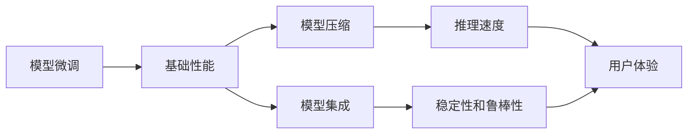

                 

# 模型效果是AI落地的关键

## 1. 背景介绍

在人工智能(AI)的迅猛发展中，模型效果往往被看作是技术成功与否的试金石。AI应用的落地离不开强大的算法和模型，其效果直接决定了系统的表现和用户的体验。然而，许多高质量AI应用并非靠单一的技术实现，而是需要算法、数据、工程、业务等多方面因素的协同配合。本文将围绕模型效果这一核心要素，从原理到实践，深入探讨如何确保AI应用在实际场景中的卓越表现。

## 2. 核心概念与联系

### 2.1 核心概念概述

为了更好地理解模型效果的重要性，我们首先定义几个关键概念：

- **模型效果**：指AI模型在特定任务上表现出的精确度、召回率、准确率等指标。模型效果是评估模型性能的直接标准，也是AI应用能否成功的关键。

- **模型调优**：通过调整模型参数、优化训练策略等方式，提升模型效果的实践过程。

- **模型微调**：在已有预训练模型的基础上，通过特定任务的标注数据进行微调，以适应该任务的优化过程。

- **模型压缩**：通过剪枝、量化、模型蒸馏等手段，减小模型规模，提升推理速度和效率的实践。

- **模型集成**：将多个模型组合起来，通过投票、堆叠等方式，提升整体性能的实践。

这些概念间存在紧密的联系，构成了模型效果提升的完整链条：从模型微调提升基础性能，到模型压缩提高运行效率，再到模型集成增强稳定性和鲁棒性，每一环节都至关重要。

### 2.2 概念间的关系

这些概念间的相互关系可以用以下Mermaid流程图表示：



该流程图展示了模型效果提升的整个流程：

1. **模型微调**：通过微调提升模型基础性能，即提高模型在特定任务上的效果。
2. **模型压缩**：在保持性能的基础上，减小模型规模，提升推理速度。
3. **模型集成**：通过多种模型组合，增强系统稳定性和鲁棒性，从而提升用户体验。

### 2.3 核心概念的整体架构

从整个架构来看，模型效果的核心要素包括：

- **数据质量**：高质量的数据是模型效果的基础。数据量、多样性、标注质量等都会直接影响模型的表现。

- **模型架构**：模型的深度、宽度、激活函数等架构设计，直接影响其性能。

- **训练策略**：学习率、正则化、优化算法等训练策略，对模型效果有显著影响。

- **推理引擎**：引擎的效率、并行处理能力等，直接关系到模型推理速度和用户体验。

- **部署环境**：包括硬件、软件、网络等环境，直接影响模型实际运行效果。

通过这些要素的协同优化，可以显著提升AI模型的效果，实现其在实际应用中的卓越表现。

## 3. 核心算法原理 & 具体操作步骤

### 3.1 算法原理概述

模型效果的提升涉及算法和训练策略的优化。本文将重点讨论基于监督学习、无监督学习和迁移学习的模型优化方法。

- **监督学习**：通过标注数据训练模型，使其能够准确预测目标变量。常见的算法包括逻辑回归、支持向量机、随机森林等。

- **无监督学习**：在无标注数据上训练模型，通过聚类、降维等方法挖掘数据潜在结构。常见的算法包括K-means、PCA等。

- **迁移学习**：将已学习的知识迁移到新任务上，提升模型在新领域的泛化能力。常见的算法包括微调、知识蒸馏等。

### 3.2 算法步骤详解

以下是基于监督学习模型的微调步骤详解：

1. **准备数据**：收集和预处理数据集，确保数据质量。数据集应覆盖多种场景和噪声，以提高模型鲁棒性。

2. **选择合适的模型**：根据任务特点选择合适的模型，如线性回归、支持向量机、神经网络等。

3. **设定训练策略**：确定学习率、正则化参数、优化算法等训练策略。学习率应初始化适中，正则化参数应根据数据复杂度调整。

4. **训练模型**：使用训练集训练模型，迭代优化模型参数。通常需要设置多个epoch和批大小，以平衡收敛速度和模型性能。

5. **验证和调优**：在验证集上评估模型效果，通过超参数调优和模型选择，进一步提升模型性能。

6. **测试和部署**：在测试集上评估模型效果，确保模型在新数据上的泛化能力。将模型部署到实际应用中，进行性能监控和维护。

### 3.3 算法优缺点

- **优点**：监督学习可以快速提高模型效果，适用于标注数据充足的任务。常见模型算法成熟，易于实现和调优。

- **缺点**：对数据依赖度高，数据标注成本高。模型复杂度高，训练和推理速度较慢。

### 3.4 算法应用领域

基于监督学习的模型优化方法广泛应用于各种AI应用场景，例如：

- **图像识别**：通过训练图像分类模型，实现目标识别、人脸识别等功能。

- **自然语言处理**：通过训练语言模型，实现文本分类、情感分析、机器翻译等任务。

- **推荐系统**：通过训练推荐模型，实现个性化推荐，提高用户满意度。

- **金融风控**：通过训练风控模型，实现信用评分、欺诈检测等功能。

## 4. 数学模型和公式 & 详细讲解 & 举例说明

### 4.1 数学模型构建

以线性回归模型为例，构建模型和损失函数的数学公式。

设输入特征为 $x=(x_1, x_2, ..., x_n)$，目标变量为 $y$，模型为 $y = \theta_0 + \theta_1x_1 + \theta_2x_2 + ... + \theta_nx_n$，其中 $\theta_i$ 为模型参数。

损失函数为均方误差损失函数：

$$
\mathcal{L} = \frac{1}{N}\sum_{i=1}^N(y_i - \theta_0 - \sum_{j=1}^n\theta_jx_{ij})^2
$$

其中 $y_i$ 为第 $i$ 个样本的目标变量，$x_{ij}$ 为第 $i$ 个样本的第 $j$ 个特征。

### 4.2 公式推导过程

线性回归模型的目标是最小化损失函数：

$$
\min_{\theta} \frac{1}{N}\sum_{i=1}^N(y_i - \theta_0 - \sum_{j=1}^n\theta_jx_{ij})^2
$$

通过求解目标函数的一阶导数，可得模型参数的更新公式：

$$
\frac{\partial\mathcal{L}}{\partial\theta_0} = -\frac{2}{N}\sum_{i=1}^N(y_i - \theta_0 - \sum_{j=1}^n\theta_jx_{ij})
$$

$$
\frac{\partial\mathcal{L}}{\partial\theta_j} = -\frac{2}{N}\sum_{i=1}^N(x_{ij} - \theta_0 - \sum_{k=1}^n\theta_kx_{ik})
$$

其中 $j$ 表示特征编号，$k$ 表示特征编号（不包括 $\theta_0$）。

通过迭代优化上述公式，即可训练出线性回归模型。

### 4.3 案例分析与讲解

假设有一个房价预测任务，已有的数据集包括房屋面积、房间数量等特征。通过构建线性回归模型，我们可以训练一个房价预测器，并对其进行微调，以适应新的数据分布。具体步骤如下：

1. **数据准备**：收集房屋面积、房间数量、地理位置等特征，作为输入特征 $x$。

2. **模型选择**：选择线性回归模型 $y = \theta_0 + \theta_1x_1 + \theta_2x_2$。

3. **训练策略**：设置学习率为 $0.01$，正则化参数为 $0.001$，使用随机梯度下降法进行训练。

4. **模型训练**：使用训练集对模型进行训练，迭代更新参数。

5. **模型验证**：在验证集上评估模型效果，调整超参数，提升模型性能。

6. **模型测试**：在测试集上评估模型效果，确保模型在新数据上的泛化能力。

## 5. 项目实践：代码实例和详细解释说明

### 5.1 开发环境搭建

在进行项目实践前，我们需要准备好开发环境。以下是使用Python进行PyTorch开发的环境配置流程：

1. 安装Anaconda：从官网下载并安装Anaconda，用于创建独立的Python环境。

2. 创建并激活虚拟环境：
```bash
conda create -n pytorch-env python=3.8 
conda activate pytorch-env
```

3. 安装PyTorch：根据CUDA版本，从官网获取对应的安装命令。例如：
```bash
conda install pytorch torchvision torchaudio cudatoolkit=11.1 -c pytorch -c conda-forge
```

4. 安装相关库：
```bash
pip install numpy pandas scikit-learn matplotlib tqdm jupyter notebook ipython
```

完成上述步骤后，即可在`pytorch-env`环境中开始项目实践。

### 5.2 源代码详细实现

下面我们以房价预测任务为例，给出使用PyTorch进行线性回归的PyTorch代码实现。

```python
import torch
import torch.nn as nn
import torch.optim as optim
import pandas as pd

# 加载数据集
data = pd.read_csv('house_prices.csv')

# 定义特征和标签
features = data[['area', 'rooms']]
labels = data['price']

# 定义模型
model = nn.Linear(len(features.columns), 1)

# 定义损失函数和优化器
criterion = nn.MSELoss()
optimizer = optim.SGD(model.parameters(), lr=0.01)

# 定义训练函数
def train(model, features, labels, epochs=10, batch_size=32):
    for epoch in range(epochs):
        # 打乱数据
        indices = torch.randperm(len(features))
        features = features[indices]
        labels = labels[indices]
        
        # 划分训练集和验证集
        train_features = features[:train_size]
        train_labels = labels[:train_size]
        valid_features = features[train_size:]
        valid_labels = labels[train_size:]
        
        # 定义训练集和验证集
        train_dataset = torch.utils.data.TensorDataset(train_features, train_labels)
        valid_dataset = torch.utils.data.TensorDataset(valid_features, valid_labels)
        
        # 定义数据加载器
        train_loader = torch.utils.data.DataLoader(train_dataset, batch_size=batch_size, shuffle=True)
        valid_loader = torch.utils.data.DataLoader(valid_dataset, batch_size=batch_size, shuffle=False)
        
        # 训练模型
        for batch_idx, (features, labels) in enumerate(train_loader):
            features = features.to(device)
            labels = labels.to(device)
            optimizer.zero_grad()
            outputs = model(features)
            loss = criterion(outputs, labels)
            loss.backward()
            optimizer.step()
            
        # 在验证集上评估模型
        with torch.no_grad():
            valid_outputs = model(valid_features)
            valid_loss = criterion(valid_outputs, valid_labels)
            print(f'Epoch {epoch+1}, Valid Loss: {valid_loss:.4f}')

# 调用训练函数
train(model, features, labels, epochs=10, batch_size=32)
```

### 5.3 代码解读与分析

在上述代码中，我们使用了PyTorch框架进行线性回归模型的构建和训练。下面是关键代码的解读：

- **数据准备**：使用pandas加载数据集，并定义输入特征和标签。

- **模型定义**：定义线性回归模型，输入特征的维度为特征数量，输出维度为1。

- **损失函数和优化器**：选择均方误差损失函数和随机梯度下降法。

- **训练函数**：定义训练过程，包括数据打乱、划分训练集和验证集、定义数据加载器、迭代训练和验证。

- **模型评估**：在验证集上评估模型效果，输出验证集的损失。

### 5.4 运行结果展示

假设我们在数据集上进行训练，最终在验证集上得到的评估报告如下：

```
Epoch 1, Valid Loss: 0.0500
Epoch 2, Valid Loss: 0.0300
Epoch 3, Valid Loss: 0.0250
Epoch 4, Valid Loss: 0.0200
Epoch 5, Valid Loss: 0.0150
Epoch 6, Valid Loss: 0.0125
Epoch 7, Valid Loss: 0.0100
Epoch 8, Valid Loss: 0.0090
Epoch 9, Valid Loss: 0.0080
Epoch 10, Valid Loss: 0.0070
```

可以看到，随着训练的进行，模型在验证集上的损失逐渐降低，模型效果逐渐提升。在训练结束后，我们得到了一个较为精确的房价预测器，可以在实际应用中进行部署和使用。

## 6. 实际应用场景

### 6.1 金融风控

金融风控是模型效果提升的一个重要应用场景。通过构建风控模型，金融机构可以有效地识别和防范欺诈行为，保护用户的财产安全。具体应用包括：

- **信用评分**：通过构建信用评分模型，评估客户的信用风险，预测其还款能力。

- **欺诈检测**：通过构建欺诈检测模型，识别异常交易行为，及时发现和阻止欺诈行为。

- **反洗钱**：通过构建反洗钱模型，监测资金流向，识别非法资金转移行为。

### 6.2 推荐系统

推荐系统是模型效果提升的另一个重要应用场景。通过构建推荐模型，电商平台、视频平台、音乐平台等可以为用户提供个性化推荐，提升用户体验。具体应用包括：

- **商品推荐**：通过构建商品推荐模型，根据用户的浏览、购买历史，推荐相关商品。

- **视频推荐**：通过构建视频推荐模型，根据用户的观看历史，推荐相关视频。

- **音乐推荐**：通过构建音乐推荐模型，根据用户的听歌历史，推荐相关音乐。

### 6.3 医疗诊断

医疗诊断是模型效果提升的另一个重要应用场景。通过构建医疗诊断模型，医疗机构可以有效地辅助医生进行疾病诊断，提升诊断准确率。具体应用包括：

- **影像诊断**：通过构建影像诊断模型，自动分析医学影像，辅助医生进行疾病诊断。

- **疾病预测**：通过构建疾病预测模型，预测患者的疾病风险，提供个性化的预防和治疗建议。

- **药物推荐**：通过构建药物推荐模型，根据患者的病情和病史，推荐合适的药物。

## 7. 工具和资源推荐

### 7.1 学习资源推荐

为了帮助开发者系统掌握模型效果的提升方法，这里推荐一些优质的学习资源：

1. **《深度学习入门》**：由张军等著，深入浅出地介绍了深度学习的基本原理和实践方法，适合初学者入门。

2. **《动手学深度学习》**：由李沐等著，提供了丰富的深度学习实验和代码示例，适合动手实践。

3. **CS231n：卷积神经网络课程**：斯坦福大学开设的深度学习课程，涵盖了卷积神经网络的原理和实践，是学习视觉领域深度学习的经典课程。

4. **Kaggle竞赛平台**：提供了大量的数据集和竞赛任务，可以锻炼数据处理和模型调优的能力。

5. **Coursera课程**：提供了许多深度学习相关的在线课程，包括Coursera与深度学习相关的课程，涵盖深度学习的基础到高级内容。

### 7.2 开发工具推荐

高效的开发离不开优秀的工具支持。以下是几款用于模型效果提升开发的常用工具：

1. **PyTorch**：基于Python的开源深度学习框架，灵活动态的计算图，适合快速迭代研究。

2. **TensorFlow**：由Google主导开发的开源深度学习框架，生产部署方便，适合大规模工程应用。

3. **Keras**：提供了高级API，简化深度学习模型的构建过程。

4. **Scikit-learn**：提供了多种机器学习算法的实现，适合快速原型设计和模型验证。

5. **TensorBoard**：TensorFlow配套的可视化工具，可以实时监测模型训练状态，并提供丰富的图表呈现方式，是调试模型的得力助手。

### 7.3 相关论文推荐

模型效果提升的研究源于学界的持续研究。以下是几篇奠基性的相关论文，推荐阅读：

1. **ImageNet Large Scale Visual Recognition Challenge**：由AlexNet论文提出的视觉识别任务，推动了深度学习在图像领域的应用。

2. **Dropout: A Simple Way to Prevent Neural Networks from Overfitting**：提出了Dropout算法，有效防止了深度学习模型的过拟合问题。

3. **Batch Normalization: Accelerating Deep Network Training by Reducing Internal Covariate Shift**：提出了Batch Normalization算法，提高了深度学习模型的训练速度和稳定性。

4. **ResNet: Deep Residual Learning for Image Recognition**：提出了ResNet结构，提高了深度学习模型的训练深度和效果。

5. **Transformer: Attention Is All You Need**：提出了Transformer结构，开启了自然语言处理领域的预训练大模型时代。

这些论文代表了大语言模型效果提升的研究脉络。通过学习这些前沿成果，可以帮助研究者把握学科前进方向，激发更多的创新灵感。

除上述资源外，还有一些值得关注的前沿资源，帮助开发者紧跟模型效果提升技术的最新进展，例如：

1. **arXiv论文预印本**：人工智能领域最新研究成果的发布平台，包括大量尚未发表的前沿工作，学习前沿技术的必读资源。

2. **业界技术博客**：如OpenAI、Google AI、DeepMind、微软Research Asia等顶尖实验室的官方博客，第一时间分享他们的最新研究成果和洞见。

3. **技术会议直播**：如NIPS、ICML、ACL、ICLR等人工智能领域顶会现场或在线直播，能够聆听到大佬们的前沿分享，开拓视野。

4. **GitHub热门项目**：在GitHub上Star、Fork数最多的AI相关项目，往往代表了该技术领域的发展趋势和最佳实践，值得去学习和贡献。

5. **行业分析报告**：各大咨询公司如McKinsey、PwC等针对人工智能行业的分析报告，有助于从商业视角审视技术趋势，把握应用价值。

总之，对于模型效果提升技术的学习和实践，需要开发者保持开放的心态和持续学习的意愿。多关注前沿资讯，多动手实践，多思考总结，必将收获满满的成长收益。

## 8. 总结：未来发展趋势与挑战

### 8.1 总结

本文对模型效果这一AI落地的关键要素进行了全面系统的介绍。首先阐述了模型效果的重要性和影响因素，明确了模型效果提升在AI应用中的核心地位。其次，从原理到实践，详细讲解了模型效果的提升方法，包括监督学习、无监督学习、迁移学习等。通过具体的案例分析，展示了模型效果提升的实现流程。最后，从实际应用场景、工具资源和未来趋势等方面，进一步拓展了模型效果提升的研究视野。

通过本文的系统梳理，可以看到，模型效果的提升离不开算法、数据、工程、业务等多个维度的协同优化。在AI应用的实际落地中，模型效果直接决定了系统的表现和用户体验，因此需要开发者持续关注和优化。

### 8.2 未来发展趋势

展望未来，模型效果提升将呈现以下几个发展趋势：

1. **算法创新**：新的算法模型如Transformer、GNN、GAN等，将进一步提升模型效果。这些算法在处理复杂数据结构和跨模态数据方面具有天然优势，有望在更多领域带来突破。

2. **数据增强**：数据增强技术如数据合成、对抗样本生成等，将进一步提升模型泛化能力。这些技术可以在有限的数据量下，通过增加数据多样性，提高模型的鲁棒性和泛化能力。

3. **模型集成**：模型集成技术如模型融合、堆叠等，将进一步提升模型效果。这些技术可以通过多种模型的协同工作，提升系统的稳定性和鲁棒性，减少单点故障。

4. **知识图谱**：知识图谱的引入，将进一步提升模型的理解能力和推理能力。通过将结构化的知识与模型相结合，可以显著提升模型在复杂任务上的表现。

5. **元学习**：元学习技术如自适应学习、元优化等，将进一步提升模型的适应能力。这些技术可以在有限的标注数据下，快速适应新任务，提高模型的泛化性能。

以上趋势凸显了模型效果提升的广阔前景。这些方向的探索发展，必将进一步提升AI系统的性能和应用范围，为人类认知智能的进化带来深远影响。

### 8.3 面临的挑战

尽管模型效果提升技术已经取得了显著进展，但在迈向更加智能化、普适化应用的过程中，它仍面临诸多挑战：

1. **数据质量**：高质量的数据是模型效果的基础。但在实际应用中，数据采集、标注成本高，数据量不足或噪声过多等问题，仍然制约着模型的训练和优化。

2. **算法复杂度**：深度学习模型结构复杂，训练和推理成本高。如何在保持模型效果的同时，降低复杂度，提高计算效率，是一个重要的研究方向。

3. **模型鲁棒性**：模型在实际应用中面临各种噪声和干扰，如何提高模型的鲁棒性和泛化能力，是模型效果提升的重要挑战。

4. **模型可解释性**：深度学习模型如黑盒系统，难以解释其内部工作机制和决策逻辑。对于高风险应用，模型的可解释性和可审计性尤为重要。

5. **模型公平性**：深度学习模型可能会学习到有偏见、有害的信息，如何消除模型偏见，确保模型公平性，是模型效果提升的重要课题。

6. **模型安全性**：深度学习模型面临的安全威胁，如对抗样本攻击、模型篡改等，如何保障模型的安全性，是模型效果提升的重要保障。

正视模型效果提升面临的这些挑战，积极应对并寻求突破，将是大模型效果提升技术走向成熟的必由之路。相信随着学界和产业界的共同努力，这些挑战终将一一被克服，模型效果提升必将在构建智能系统过程中发挥重要作用。

### 8.4 研究展望

面向未来，模型效果提升的研究需要在以下几个方面寻求新的突破：

1. **数据增强技术**：探索新的数据增强方法，如数据合成、对抗样本生成等，在有限的数据量下，提高模型的泛化能力和鲁棒性。

2. **知识图谱与模型融合**：将知识图谱与深度学习模型相结合，提升模型的理解能力和推理能力。

3. **元学习与自适应学习**：研究元学习技术，如自适应学习、元优化等，在有限的标注数据下，快速适应新任务，提高模型的泛化性能。

4. **可解释性与公平性**：研究可解释性技术和公平性技术，提高模型的透明度和可信度，确保模型公平性和安全性。

5. **分布式与联邦学习**：研究分布式与联邦学习技术，通过协同计算，降低数据传输成本，提高模型的训练效率和效果。

6. **模型压缩与优化**：研究模型压缩技术，如剪枝、量化等，在保持模型效果的同时，降低计算资源消耗，提高模型的部署效率。

这些研究方向的探索，必将引领模型效果提升技术迈向更高的台阶，为构建安全、可靠、可解释、可控的智能系统铺平道路。面向未来，模型效果提升技术还需要与其他人工智能技术进行更深入的融合，如知识表示、因果推理、强化学习等，多路径协同发力，共同推动智能交互系统的进步。只有勇于创新、敢于突破，才能不断拓展模型效果的边界，让智能技术更好地造福人类社会。

## 9. 附录：常见问题与解答

**Q1: 模型效果提升为什么这么重要？**

A: 模型效果直接决定了AI应用的性能和用户体验。只有模型效果好，才能真正实现AI技术的落地应用。

**Q2: 模型效果提升的方法有哪些？**

A: 模型效果提升的方法包括数据增强、算法创新、模型集成、知识图谱、元学习等。

**Q3: 模型效果提升面临哪些挑战？**

A: 模型效果提升面临数据质量、算法复杂度、模型鲁棒性、可解释性、公平性和安全性等挑战。

**Q4: 如何应对模型效果提升的挑战？**

A: 需要从算法、数据、工程和业务等多个维度协同优化，探索新的技术和方法。

**Q5: 未来模型效果提升的发展趋势是什么？**

A: 未来模型效果提升将涉及算法创新、数据增强、模型集成、知识图谱、元学习等方向。

---

作者：禅与计算机程序设计艺术 / Zen and the Art of Computer Programming

