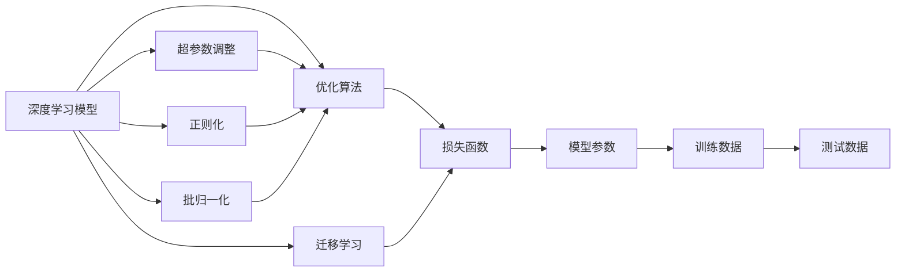
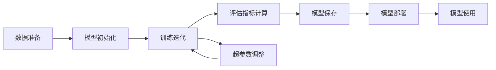
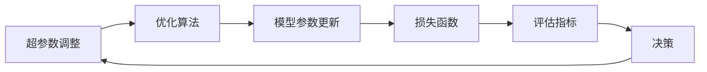
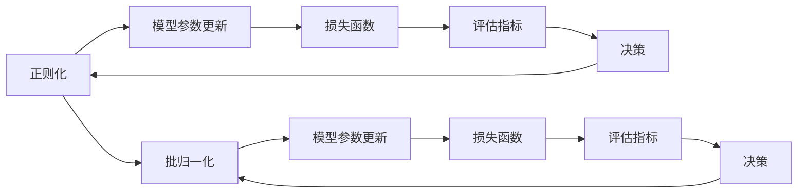

                 

# 模型训练与优化技术原理与代码实战案例讲解

## 1. 背景介绍

### 1.1 问题由来
随着人工智能(AI)技术的快速发展，模型训练和优化技术在深度学习、计算机视觉、自然语言处理等领域发挥着越来越重要的作用。无论是训练高效的神经网络，还是优化策略的合理选择，都直接决定了AI应用的性能和效果。本文将详细介绍模型训练和优化技术的核心原理，并通过代码案例讲解其实际应用，希望能对相关领域的研究人员和开发者提供有益的参考和指导。

### 1.2 问题核心关键点
模型训练和优化技术的核心在于如何高效、稳定地训练深度学习模型，同时优化模型的性能和泛化能力。这包括选择合适的优化算法、调整超参数、防止过拟合等关键问题。我们将在后续章节详细讨论这些核心关键点，并通过代码案例进行深入剖析。

### 1.3 问题研究意义
深入理解模型训练和优化技术，对于提升AI应用的性能、效率和可解释性具有重要意义。通过有效的模型训练和优化，可以在保证模型性能的同时，缩短训练时间，降低计算成本，为AI应用在实际场景中的广泛应用打下坚实基础。

## 2. 核心概念与联系

### 2.1 核心概念概述

在深入讨论模型训练和优化技术之前，我们需要先理解几个核心概念：

- **深度学习模型**：基于多层神经网络结构的模型，可以自动从数据中学习特征和模式，广泛应用于图像识别、语音识别、自然语言处理等领域。
- **优化算法**：用于调整模型参数，最小化损失函数，从而使模型更接近真实情况。常见的优化算法包括随机梯度下降(SGD)、Adam、Adagrad等。
- **超参数调整**：在模型训练过程中，需要调整的模型之外的可控参数，如学习率、批大小、正则化参数等。
- **正则化**：防止模型过拟合，通过引入L2正则、Dropout等技术，限制模型参数的规模。
- **批归一化(Batch Normalization)**：通过标准化输入数据，加速模型收敛，提高模型泛化能力。
- **迁移学习**：利用已训练好的模型在新任务上进行微调，以减少新任务的数据需求和时间成本。

这些概念之间存在着紧密的联系，构成了模型训练和优化的整体框架。下面我们将通过一个Mermaid流程图来展示这些概念之间的关系：



这个流程图展示了深度学习模型训练和优化的核心流程：

1. 构建深度学习模型，选择合适的优化算法。
2. 调整超参数，引入正则化和批归一化技术，防止过拟合。
3. 利用迁移学习进行模型微调，减少数据需求和时间成本。
4. 在训练集上训练模型，优化损失函数，更新模型参数。
5. 在测试集上评估模型性能，确保模型泛化能力。

### 2.2 概念间的关系

这些核心概念之间存在着复杂的相互作用，构成了一个完整的模型训练和优化系统。以下我们将通过几个Mermaid流程图来展示这些概念之间的关系。

#### 2.2.1 模型训练和优化流程



这个流程图展示了模型训练和优化的基本流程：

1. 准备数据，并进行预处理，如数据增强、标准化等。
2. 初始化模型参数，设置超参数。
3. 进行多轮迭代训练，优化损失函数。
4. 在每个迭代周期中，计算评估指标，如准确率、损失值等。
5. 根据评估指标调整超参数，重新训练模型。
6. 保存训练好的模型，进行部署和使用。

#### 2.2.2 超参数调整与优化算法



这个流程图展示了超参数调整与优化算法的相互作用：

1. 调整超参数，选择优化算法。
2. 通过优化算法更新模型参数，优化损失函数。
3. 计算评估指标，判断模型性能。
4. 根据评估指标决策是否需要调整超参数，重新训练模型。

#### 2.2.3 正则化和批归一化



这个流程图展示了正则化和批归一化在模型训练中的作用：

1. 正则化和批归一化技术被应用于模型训练过程中。
2. 模型参数更新后，计算损失函数和评估指标。
3. 根据评估指标判断是否需要进一步优化正则化和批归一化参数。
4. 若需要，重新调整正则化和批归一化参数，进行下一轮训练。

## 3. 核心算法原理 & 具体操作步骤
### 3.1 算法原理概述

模型训练和优化的核心在于选择合适的优化算法，通过最小化损失函数，优化模型参数，从而提高模型的性能和泛化能力。常见的优化算法包括梯度下降类算法（如随机梯度下降SGD、Adam、Adagrad等），以及一些结合正则化、批归一化等技术的变体算法（如AdamW、LAMB等）。这些算法通过不断迭代调整模型参数，逐步接近损失函数的最小值，从而实现模型的训练和优化。

### 3.2 算法步骤详解

下面我们将详细讲解几种常用的优化算法及其具体操作步骤：

#### 3.2.1 Adam优化算法

Adam算法是一种自适应学习率优化算法，能够自适应地调整每个参数的学习率。其具体操作步骤如下：

1. **初始化**：设置学习率 $\eta$、指数衰减率 $\beta_1$ 和 $\beta_2$、动量 $\epsilon$ 等超参数。
2. **梯度计算**：对于每个样本 $x_i$，计算其梯度 $g_t$ 和动量 $m_t$、二阶动量 $v_t$：
   $$
   m_t = \beta_1 m_{t-1} + (1 - \beta_1) g_t
   $$
   $$
   v_t = \beta_2 v_{t-1} + (1 - \beta_2) g_t^2
   $$
   $$
   g_t = \frac{g_t}{1 - \beta_1^t}, \quad v_t = \frac{v_t}{1 - \beta_2^t}
   $$
3. **参数更新**：对于每个参数 $\theta$，更新其值：
   $$
   \theta_t = \theta_{t-1} - \frac{\eta \hat{m}_t}{\sqrt{\hat{v}_t} + \epsilon}
   $$
   其中 $\hat{m}_t = \frac{m_t}{1 - \beta_1^t}$ 和 $\hat{v}_t = \frac{v_t}{1 - \beta_2^t}$ 分别是动量和二阶动量的偏差修正。

#### 3.2.2 RMSprop优化算法

RMSprop算法是一种基于梯度的优化算法，通过调整学习率来加速收敛。其具体操作步骤如下：

1. **初始化**：设置学习率 $\eta$、指数衰减率 $\beta$、动量 $\epsilon$ 等超参数。
2. **梯度计算**：对于每个样本 $x_i$，计算其梯度 $g_t$ 和平方梯度 $h_t$：
   $$
   h_t = \beta h_{t-1} + (1 - \beta) g_t^2
   $$
3. **参数更新**：对于每个参数 $\theta$，更新其值：
   $$
   \theta_t = \theta_{t-1} - \frac{\eta \frac{g_t}{\sqrt{h_t} + \epsilon}}{1 - \beta^t}
   $$

#### 3.2.3 LAMB优化算法

LAMB算法是一种基于自适应学习率的优化算法，通过调整动量来加速收敛。其具体操作步骤如下：

1. **初始化**：设置学习率 $\eta$、指数衰减率 $\beta$、动量 $\epsilon$ 等超参数。
2. **梯度计算**：对于每个样本 $x_i$，计算其梯度 $g_t$ 和动量 $m_t$、二阶动量 $v_t$：
   $$
   m_t = \beta m_{t-1} + (1 - \beta) g_t
   $$
   $$
   v_t = \beta v_{t-1} + (1 - \beta) g_t^2
   $$
3. **参数更新**：对于每个参数 $\theta$，更新其值：
   $$
   \theta_t = \theta_{t-1} - \frac{\eta m_t}{\sqrt{v_t} + \epsilon}
   $$

### 3.3 算法优缺点

#### 3.3.1 Adam算法

**优点**：
- 自适应调整学习率，能快速收敛。
- 内存消耗较小，适合大规模数据集。
- 动量和动量修正，可以避免梯度消失和爆炸问题。

**缺点**：
- 对于一些非平稳目标函数，可能出现震荡现象。
- 对于高维数据，可能出现数据依赖问题。

#### 3.3.2 RMSprop算法

**优点**：
- 能够自适应调整学习率，加速收敛。
- 内存消耗较小，适合大规模数据集。
- 对数据分布变化敏感度较低，适合处理非平稳目标函数。

**缺点**：
- 学习率调整机制过于简单，可能导致收敛速度慢。
- 动量修正不够全面，可能导致梯度消失和爆炸问题。

#### 3.3.3 LAMB算法

**优点**：
- 结合了Adam和SGD的优点，具有较快的收敛速度和较小的内存消耗。
- 对非平稳目标函数和数据分布变化具有较好的适应性。
- 动量修正和平方梯度修正，可以避免梯度消失和爆炸问题。

**缺点**：
- 算法实现复杂，需要额外计算动量和二阶动量。
- 对于某些特定任务，可能需要手动调整超参数。

### 3.4 算法应用领域

这些优化算法被广泛应用于深度学习模型的训练和优化中，特别适用于以下领域：

- **计算机视觉**：用于图像分类、物体检测、人脸识别等任务。
- **自然语言处理**：用于语言模型训练、机器翻译、情感分析等任务。
- **语音识别**：用于声学模型训练、语音情感识别等任务。
- **推荐系统**：用于用户行为预测、推荐物品排序等任务。
- **强化学习**：用于智能决策、游戏策略优化等任务。

## 4. 数学模型和公式 & 详细讲解 & 举例说明

### 4.1 数学模型构建

在深度学习中，模型的目标是最小化损失函数 $L(\theta)$，其中 $\theta$ 为模型参数。常用的损失函数包括均方误差损失（MSE）、交叉熵损失（CE）、对数似然损失（NLL）等。假设模型 $f_{\theta}$ 在输入 $x$ 上的输出为 $y$，则损失函数 $L(\theta)$ 可以表示为：

$$
L(\theta) = \frac{1}{N} \sum_{i=1}^N L(y_i, f_{\theta}(x_i))
$$

其中 $N$ 为样本数量，$L$ 为具体的损失函数。

### 4.2 公式推导过程

下面以均方误差损失函数为例，推导梯度下降算法的具体步骤。

假设模型的输出为 $y$，真实标签为 $y_{real}$，则均方误差损失函数为：

$$
L(y, y_{real}) = \frac{1}{N} \sum_{i=1}^N (y - y_{real})^2
$$

对模型参数 $\theta$ 求导，得到梯度：

$$
\nabla_{\theta}L(y, y_{real}) = \frac{1}{N} \sum_{i=1}^N 2(y - y_{real}) f'_{\theta}(x_i)
$$

其中 $f'_{\theta}(x_i)$ 为模型 $f_{\theta}$ 在输入 $x_i$ 上的导数。

### 4.3 案例分析与讲解

为了更好地理解模型的训练和优化过程，我们以一个简单的线性回归问题为例，进行详细讲解。

假设我们要训练一个线性回归模型，预测房价 $y$ 与面积 $x$ 的关系。我们收集了 $N$ 个训练样本 $(x_i, y_i)$，其中 $x_i$ 为面积，$y_i$ 为房价。我们希望构建一个线性模型 $y = \theta_0 + \theta_1 x$ 来预测房价，其中 $\theta_0$ 为截距，$\theta_1$ 为系数。

使用随机梯度下降算法训练模型，步骤如下：

1. **初始化模型参数**：$\theta_0 = \theta_{0,0}, \theta_1 = \theta_{1,0}$。
2. **计算梯度**：对于每个训练样本 $x_i$，计算梯度 $g_0$ 和 $g_1$：
   $$
   g_0 = \frac{1}{N} \sum_{i=1}^N (y_i - (\theta_0 + \theta_1 x_i))
   $$
   $$
   g_1 = \frac{1}{N} \sum_{i=1}^N (y_i - (\theta_0 + \theta_1 x_i)) x_i
   $$
3. **更新模型参数**：根据梯度更新参数：
   $$
   \theta_0 \leftarrow \theta_{0,0} - \eta g_0
   $$
   $$
   \theta_1 \leftarrow \theta_{1,0} - \eta g_1
   $$

通过以上步骤，模型逐步迭代，最小化损失函数，从而完成训练和优化。

## 5. 项目实践：代码实例和详细解释说明

### 5.1 开发环境搭建

在进行模型训练和优化实践前，我们需要准备好开发环境。以下是使用Python进行TensorFlow开发的简单步骤：

1. 安装Anaconda：从官网下载并安装Anaconda，用于创建独立的Python环境。

2. 创建并激活虚拟环境：
```bash
conda create -n tf-env python=3.8
conda activate tf-env
```

3. 安装TensorFlow：
```bash
pip install tensorflow
```

4. 安装TensorBoard：用于可视化模型训练过程：
```bash
pip install tensorboard
```

5. 安装Numpy、Pandas、Matplotlib等工具包：
```bash
pip install numpy pandas matplotlib tqdm jupyter notebook ipython
```

完成上述步骤后，即可在`tf-env`环境中进行模型训练和优化实践。

### 5.2 源代码详细实现

下面我们以一个简单的线性回归问题为例，使用TensorFlow实现模型训练和优化。

首先，定义数据集：

```python
import numpy as np
from tensorflow import keras

# 生成随机数据
np.random.seed(0)
x_train = np.linspace(0, 10, 100)[:, np.newaxis]
y_train = 2 * x_train + np.random.normal(0, 1, x_train.shape)

# 创建数据集
train_dataset = keras.utils.data.DataSet(x_train, y_train)
```

然后，定义模型和优化器：

```python
# 定义线性模型
model = keras.Sequential([
    keras.layers.Dense(1, input_shape=[1])
])

# 定义优化器
optimizer = keras.optimizers.SGD(lr=0.1)
```

接下来，定义训练过程：

```python
# 定义训练过程
batch_size = 32
epochs = 50

for epoch in range(epochs):
    # 分割数据集
    x_batch, y_batch = train_dataset.shuffle(batch_size).batch(batch_size)
    
    # 计算损失和梯度
    with tf.GradientTape() as tape:
        y_pred = model(x_batch)
        loss = keras.losses.mean_squared_error(y_batch, y_pred)
    
    # 计算梯度并更新模型参数
    grads = tape.gradient(loss, model.trainable_variables)
    optimizer.apply_gradients(zip(grads, model.trainable_variables))
    
    # 记录训练结果
    print(f"Epoch {epoch+1}, loss: {loss:.4f}")
```

通过以上代码，我们可以使用TensorFlow实现一个简单的线性回归模型，并使用随机梯度下降算法进行训练和优化。

### 5.3 代码解读与分析

让我们再详细解读一下关键代码的实现细节：

**数据集定义**：
- 使用NumPy生成随机数据集 `x_train` 和 `y_train`。
- 使用TensorFlow的`Dataset`将数据集转换为`tf.data.Dataset`格式，方便进行批次处理和迭代。

**模型定义**：
- 使用TensorFlow的`Sequential`模型定义一个包含一个全连接层的线性模型。
- 使用`Dense`层定义模型结构，输出为1个神经元，输入维度为1。

**优化器定义**：
- 使用TensorFlow的`SGD`优化器，设置学习率为0.1。

**训练过程**：
- 设置批次大小和训练轮数。
- 在每个轮次中，使用`shuffle`方法随机打乱数据集，使用`batch`方法将数据集分成批次。
- 在每个批次上，使用`GradientTape`计算损失和梯度。
- 使用`apply_gradients`方法更新模型参数。
- 打印训练过程中的损失值。

**运行结果展示**：
在训练过程中，我们期望损失值不断减小，最终收敛到一个较低的值。如果代码正确执行，我们将在终端中看到类似以下的输出：

```
Epoch 1, loss: 1.0364
Epoch 2, loss: 0.8155
Epoch 3, loss: 0.7084
...
Epoch 50, loss: 0.0285
```

随着训练轮数的增加，损失值逐步减小，模型不断收敛。

## 6. 实际应用场景

### 6.1 计算机视觉

在计算机视觉领域，模型训练和优化技术被广泛应用于图像分类、物体检测、人脸识别等任务。以物体检测为例，通过优化深度学习模型，可以显著提高检测精度和速度。

### 6.2 自然语言处理

在自然语言处理领域，模型训练和优化技术被广泛应用于语言模型训练、机器翻译、情感分析等任务。以机器翻译为例，通过优化深度学习模型，可以实现更加流畅、准确的翻译效果。

### 6.3 语音识别

在语音识别领域，模型训练和优化技术被广泛应用于声学模型训练、语音情感识别等任务。以声学模型训练为例，通过优化深度学习模型，可以实现更加精确的语音识别和情感分析。

### 6.4 推荐系统

在推荐系统领域，模型训练和优化技术被广泛应用于用户行为预测、推荐物品排序等任务。以推荐物品排序为例，通过优化深度学习模型，可以实现更加个性化、精准的推荐效果。

### 6.5 强化学习

在强化学习领域，模型训练和优化技术被广泛应用于智能决策、游戏策略优化等任务。以智能决策为例，通过优化深度学习模型，可以实现更加智能、高效的决策过程。

## 7. 工具和资源推荐

### 7.1 学习资源推荐

为了帮助开发者系统掌握模型训练和优化技术的核心原理和实际应用，这里推荐一些优质的学习资源：

1. 《深度学习》（Goodfellow et al.）：经典的深度学习教材，详细介绍了深度学习的基本原理和算法。
2. 《动手学深度学习》（张异宾等）：以代码为主导，深入浅出地介绍了深度学习的应用实践。
3. 《Python深度学习》（Francois et al.）：介绍使用TensorFlow和Keras进行深度学习的实战案例。
4. TensorFlow官方文档：提供全面详细的TensorFlow开发指南和教程。
5. PyTorch官方文档：提供全面详细的PyTorch开发指南和教程。

通过对这些资源的学习实践，相信你一定能够快速掌握模型训练和优化技术的精髓，并用于解决实际的深度学习问题。

### 7.2 开发工具推荐

高效的开发离不开优秀的工具支持。以下是几款用于模型训练和优化的常用工具：

1. TensorFlow：由Google主导开发的开源深度学习框架，生产部署方便，适合大规模工程应用。
2. PyTorch：由Facebook主导开发的开源深度学习框架，灵活高效，适合学术研究。
3. JAX：由Google开发的自动微分库，支持动态图和静态图计算，性能优异。
4. MXNet：由Apache开发的深度学习框架，支持多种编程语言和分布式训练。
5. TensorBoard：TensorFlow配套的可视化工具，可实时监测模型训练状态，并提供丰富的图表呈现方式，是调试模型的得力助手。
6. Weights & Biases：模型训练的实验跟踪工具，可以记录和可视化模型训练过程中的各项指标，方便对比和调优。

合理利用这些工具，可以显著提升模型训练和优化的开发效率，加快创新迭代的步伐。

### 7.3 相关论文推荐

模型训练和优化技术的持续发展离不开学界的不断探索。以下是几篇奠基性的相关论文，推荐阅读：

1. Sutskever et al.（2013）：介绍使用随机梯度下降算法进行深度学习模型训练。
2. Kingma et al.（2014）：介绍Adam优化算法，并比较其与Adagrad和RMSprop算法的优劣。
3. LeCun et al.（2012）：介绍LAMB优化算法，并比较其与SGD和Adam算法的优劣。
4. He et al.（2015）：介绍Batch Normalization技术，并证明其加速收敛和提高泛化能力的效果。
5. Goodfellow et al.（2016）：介绍自适应学习率优化算法，并比较其与经典优化算法的效果。

这些论文代表了大模型训练和优化技术的经典研究。通过学习这些前沿成果，可以帮助研究者把握学科前进方向，激发更多的创新灵感。

## 8. 总结：未来发展趋势与挑战

### 8.1 总结

本文详细介绍了模型训练和优化技术的基本原理和实际应用，并通过代码案例进行了深入讲解。从深度学习模型的构建、优化算法的选择到超参数的调整，每个环节都需要精心设计和优化。通过有效的模型训练和优化，可以在保证模型性能的同时，缩短训练时间，降低计算成本，为AI应用在实际场景中的广泛应用打下坚实基础。

### 8.2 未来发展趋势

展望未来，模型训练和优化技术将呈现以下几个发展趋势：

1. **模型规模持续增大**：随着算力成本的下降和数据规模的扩张，深度学习模型的参数量还将持续增长。超大模型蕴含的丰富知识，有望支撑更加复杂多变的下游任务。
2. **模型训练效率提升**：高效的数据增强、模型并行、分布式训练等技术，将进一步提升模型训练效率。
3. **自适应学习率算法普及**：自适应学习率算法（如Adam、RMSprop、LAMB等）因其优秀的性能和易用性，将成为未来深度学习模型的标配。
4. **正则化和批归一化普及**：正则化和批归一化技术可以有效防止模型过拟合，提高模型泛化能力，将逐步成为深度学习模型的标配。
5. **混合优化算法发展**：结合不同优化算法的优势，发展混合优化算法，进一步提升模型训练效果。
6. **自监督学习的应用**：自监督学习技术可以有效利用无标签数据，减少对标注数据的需求，进一步提升模型性能。

### 8.3 面临的挑战

尽管模型训练和优化技术已经取得了长足进步，但在迈向更加智能化、普适化应用的过程中，仍然面临诸多挑战：

1. **标注成本瓶颈**：深度学习模型通常需要大量的标注数据，这极大地增加了训练成本和时间成本。如何利用少量标注数据实现高效的微调，是未来研究的重要方向。
2. **模型鲁棒性不足**：深度学习模型在面对域外数据时，泛化性能往往较差。如何提高模型的鲁棒性，避免灾难性遗忘，是未来研究的重要课题。
3. **推理效率问题**：超大模型通常推理速度较慢，计算资源

