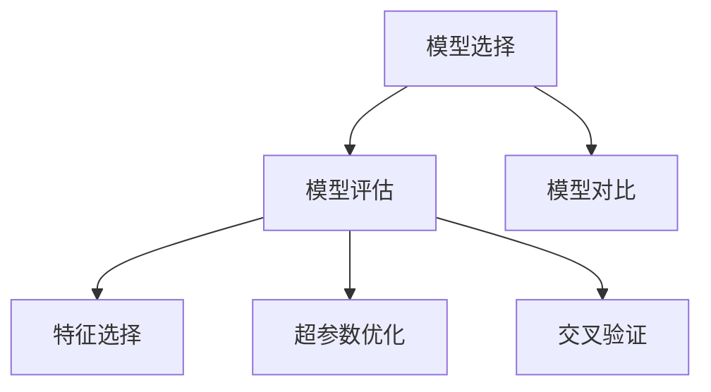
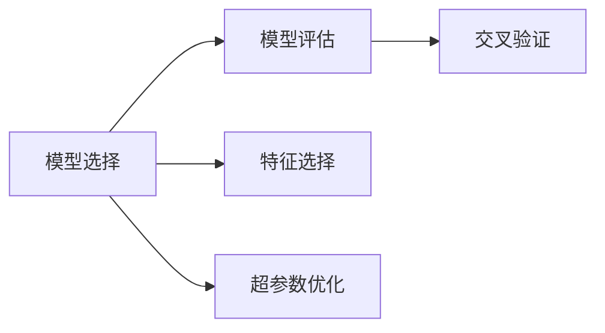
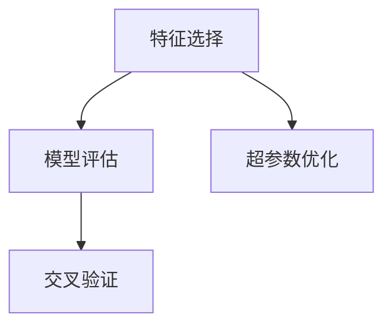
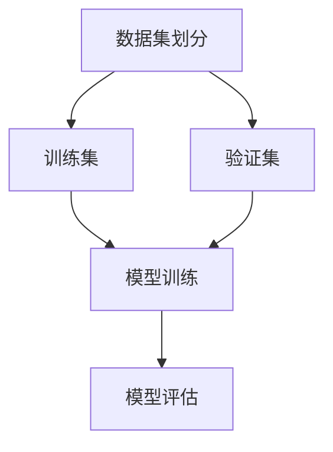
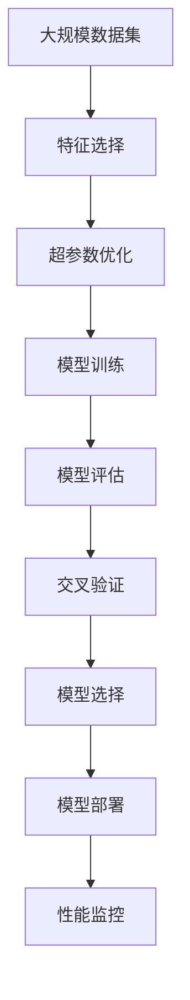

                 

# 模型选择 (Model Selection)

> 关键词：模型选择, 模型评估, 交叉验证, 特征选择, 超参数优化, 模型对比, 实验设计

## 1. 背景介绍

### 1.1 问题由来
在人工智能和机器学习领域，选择合适的模型是实现高效、准确预测的关键。模型选择的目的是在大量可用的模型中找到最适合特定数据和任务模型的过程。一个好的模型不仅能提高模型的性能，还能显著减少训练和部署的资源消耗。

### 1.2 问题核心关键点
模型选择过程中涉及的核心关键点包括：
- 特征空间的选择与特征工程。模型的性能很大程度上取决于输入数据的特征空间。
- 模型的结构与参数。模型的结构决定了它的拟合能力，而参数的调整则会影响模型的泛化能力。
- 训练和验证数据集的设计。数据集的质量和划分方式对模型选择有重要影响。
- 评估指标的选择。如何选择合适的评估指标来评估模型的性能是模型选择的关键。
- 超参数的优化。超参数的调优对模型的最终性能有重大影响。

### 1.3 问题研究意义
模型选择不仅是机器学习中的重要步骤，也是提高模型预测能力、优化计算资源、提升用户体验的关键。它对于数据挖掘、预测建模、自然语言处理、计算机视觉等诸多领域的模型应用具有重要的理论和实践意义。

## 2. 核心概念与联系

### 2.1 核心概念概述

为更好地理解模型选择方法，本节将介绍几个密切相关的核心概念：

- **模型选择 (Model Selection)**：从多种候选模型中，通过实验和评估选择最适合特定任务和数据的模型。
- **模型评估 (Model Evaluation)**：通过一系列指标和统计方法，量化模型在不同数据集上的表现。
- **特征选择 (Feature Selection)**：选择最相关、最具信息的特征来构建更紧凑、更准确的模型。
- **超参数优化 (Hyperparameter Tuning)**：调整模型的超参数（如学习率、正则化系数等）以提升模型性能。
- **交叉验证 (Cross-Validation)**：通过将数据集分成训练集和验证集，评估模型的泛化能力。
- **模型对比 (Model Comparison)**：比较不同模型的性能，选择最优模型。

这些核心概念之间的逻辑关系可以通过以下Mermaid流程图来展示：



这个流程图展示了大模型选择的核心概念及其之间的关系：

1. 模型选择基于模型评估，通过比较不同模型的表现选择最佳模型。
2. 特征选择和超参数优化是模型评估的重要组成部分，直接影响模型的表现。
3. 交叉验证用于评估模型的泛化能力，验证模型在不同数据集上的表现一致性。
4. 模型对比则是模型评估和选择的依据，有助于选择最佳的模型结构。

### 2.2 概念间的关系

这些核心概念之间存在着紧密的联系，形成了模型选择的完整生态系统。下面我们通过几个Mermaid流程图来展示这些概念之间的关系。

#### 2.2.1 模型选择与模型评估



这个流程图展示了模型选择和模型评估的基本流程：模型选择基于模型评估，特征选择和超参数优化是评估过程的一部分。

#### 2.2.2 特征选择与超参数优化



这个流程图展示了特征选择和超参数优化对模型评估的影响。特征选择和超参数优化是评估模型的重要因素，直接影响模型的最终选择。

#### 2.2.3 交叉验证的作用



这个流程图展示了交叉验证的基本流程：通过将数据集分成训练集和验证集，使用交叉验证来评估模型的泛化能力。

### 2.3 核心概念的整体架构

最后，我们用一个综合的流程图来展示这些核心概念在大模型选择过程中的整体架构：



这个综合流程图展示了从数据集特征选择、超参数优化、模型训练、评估、交叉验证到模型选择、部署、性能监控的完整过程。通过这些流程图，我们可以更清晰地理解模型选择过程中各个环节的作用和相互关系。

## 3. 核心算法原理 & 具体操作步骤

### 3.1 算法原理概述

模型选择的基本原理是通过评估不同模型的性能，在给定的数据集和任务上选择最优模型。这通常包括以下步骤：

1. 选择合适的基线模型和候选模型。
2. 对候选模型进行训练和验证。
3. 使用交叉验证等方法评估模型的泛化能力。
4. 比较不同模型的评估结果，选择最优模型。
5. 验证选定的模型在新数据上的表现。

### 3.2 算法步骤详解

以下是模型选择的一般步骤：

**Step 1: 准备数据集**
- 收集和预处理数据集。确保数据集的质量和完整性，并进行特征工程，提取有用的特征。

**Step 2: 定义模型架构**
- 选择合适的模型类型（如线性模型、神经网络、深度学习模型等）和结构（如层数、节点数、激活函数等）。
- 确定超参数的初始值，如学习率、正则化系数等。

**Step 3: 初始化模型**
- 使用框架（如TensorFlow、PyTorch、Scikit-learn等）初始化模型，加载所需的数据集。

**Step 4: 训练模型**
- 使用训练数据集训练模型，根据模型结构和超参数进行调优。

**Step 5: 评估模型**
- 使用验证数据集评估模型的性能，通常使用交叉验证方法（如K折交叉验证）来评估模型泛化能力。
- 记录模型在不同指标上的表现，如准确率、精确率、召回率、F1分数等。

**Step 6: 选择最优模型**
- 比较不同模型的评估结果，选择表现最优的模型作为最终选择的模型。

**Step 7: 验证模型**
- 使用测试数据集验证选定的模型在新数据上的表现，确保模型具有良好的泛化能力。

**Step 8: 调整模型**
- 根据验证和测试结果，进一步调整模型的超参数和结构，以提升模型性能。

### 3.3 算法优缺点

模型选择具有以下优点：
- 能够帮助选择最适合特定任务和数据集的模型。
- 通过比较不同模型的性能，可以避免在模型选择过程中陷入“黑箱”。
- 可以提高模型的泛化能力和预测准确性。

同时，模型选择也存在以下缺点：
- 需要大量的计算资源和数据集。
- 需要深入理解模型原理和评估方法。
- 可能存在“过拟合”问题，即模型在训练数据上表现良好，但在新数据上表现不佳。

### 3.4 算法应用领域

模型选择在各种领域都有广泛应用，如：

- 自然语言处理：如文本分类、情感分析、机器翻译等任务。
- 计算机视觉：如图像分类、目标检测、图像分割等任务。
- 预测建模：如回归分析、时间序列预测、股票市场预测等任务。
- 推荐系统：如用户兴趣预测、商品推荐等任务。
- 信号处理：如语音识别、音频分类等任务。

模型选择在上述领域的应用展示了其广泛的影响力和重要性，成为数据挖掘和人工智能领域的重要工具。

## 4. 数学模型和公式 & 详细讲解 & 举例说明

### 4.1 数学模型构建

本节将使用数学语言对模型选择过程进行更加严格的刻画。

假设我们有一组数据集 $D = \{(x_i, y_i)\}_{i=1}^N$，其中 $x_i$ 是输入特征，$y_i$ 是标签。我们希望选择最适合数据集的模型 $M$。

定义模型 $M$ 在数据集 $D$ 上的损失函数为 $\mathcal{L}(M; D)$，用于衡量模型在数据集上的表现。

定义模型 $M$ 在输入特征 $x$ 上的预测结果为 $\hat{y} = M(x)$，与真实标签 $y$ 的误差为 $e = \hat{y} - y$。

模型选择的目标是选择最小化损失函数的模型 $M$，即：

$$
M^* = \mathop{\arg\min}_{M} \mathcal{L}(M; D)
$$

在实践中，我们通常使用基于梯度的优化算法（如SGD、Adam等）来近似求解上述最优化问题。设 $\eta$ 为学习率，$\lambda$ 为正则化系数，则参数的更新公式为：

$$
\theta \leftarrow \theta - \eta \nabla_{\theta}\mathcal{L}(M_{\theta}; D) - \eta\lambda\theta
$$

其中 $\nabla_{\theta}\mathcal{L}(M_{\theta}; D)$ 为损失函数对模型参数 $\theta$ 的梯度，可通过反向传播算法高效计算。

### 4.2 公式推导过程

以下我们以二分类任务为例，推导交叉熵损失函数及其梯度的计算公式。

假设模型 $M_{\theta}$ 在输入 $x$ 上的输出为 $\hat{y}=M_{\theta}(x) \in [0,1]$，表示样本属于正类的概率。真实标签 $y \in \{0,1\}$。则二分类交叉熵损失函数定义为：

$$
\mathcal{L}(M_{\theta}(x),y) = -[y\log \hat{y} + (1-y)\log (1-\hat{y})]
$$

将其代入损失函数 $\mathcal{L}(M_{\theta}; D)$，得：

$$
\mathcal{L}(M_{\theta}; D) = -\frac{1}{N}\sum_{i=1}^N [y_i\log M_{\theta}(x_i)+(1-y_i)\log(1-M_{\theta}(x_i))]
$$

根据链式法则，损失函数对模型参数 $\theta_k$ 的梯度为：

$$
\frac{\partial \mathcal{L}(M_{\theta}; D)}{\partial \theta_k} = -\frac{1}{N}\sum_{i=1}^N (\frac{y_i}{M_{\theta}(x_i)}-\frac{1-y_i}{1-M_{\theta}(x_i)}) \frac{\partial M_{\theta}(x_i)}{\partial \theta_k}
$$

其中 $\frac{\partial M_{\theta}(x_i)}{\partial \theta_k}$ 可进一步递归展开，利用自动微分技术完成计算。

### 4.3 案例分析与讲解

假设我们有一组数据集 $D = \{(x_i, y_i)\}_{i=1}^N$，其中 $x_i$ 是输入特征，$y_i$ 是标签。我们希望选择最适合数据集的模型 $M$。

首先，我们将数据集 $D$ 随机分成训练集 $D_{train}$ 和验证集 $D_{valid}$，每个数据集包含 $N/2$ 个样本。

然后，我们选择两个候选模型 $M_1$ 和 $M_2$，分别在训练集 $D_{train}$ 上进行训练，并使用验证集 $D_{valid}$ 进行验证。

接下来，我们计算每个模型在验证集 $D_{valid}$ 上的损失函数，并记录其表现。最后，我们选择损失函数最小的模型作为最终选择的模型。

## 5. 项目实践：代码实例和详细解释说明

### 5.1 开发环境搭建

在进行模型选择实践前，我们需要准备好开发环境。以下是使用Python进行Scikit-learn开发的Python环境配置流程：

1. 安装Anaconda：从官网下载并安装Anaconda，用于创建独立的Python环境。

2. 创建并激活虚拟环境：
```bash
conda create -n sklearn-env python=3.8 
conda activate sklearn-env
```

3. 安装Scikit-learn：
```bash
pip install scikit-learn
```

4. 安装各类工具包：
```bash
pip install numpy pandas matplotlib scikit-learn
```

完成上述步骤后，即可在`sklearn-env`环境中开始模型选择实践。

### 5.2 源代码详细实现

下面我们以二分类任务为例，给出使用Scikit-learn进行模型选择的PyTorch代码实现。

首先，定义模型评估函数：

```python
from sklearn.metrics import accuracy_score, precision_score, recall_score, f1_score

def evaluate(model, X, y):
    y_pred = model.predict(X)
    accuracy = accuracy_score(y, y_pred)
    precision = precision_score(y, y_pred)
    recall = recall_score(y, y_pred)
    f1 = f1_score(y, y_pred)
    return accuracy, precision, recall, f1
```

然后，定义模型训练和选择函数：

```python
from sklearn.model_selection import train_test_split
from sklearn.linear_model import LogisticRegression
from sklearn.ensemble import RandomForestClassifier
from sklearn.svm import SVC

def train_model(model, X_train, y_train, X_valid, y_valid):
    model.fit(X_train, y_train)
    y_pred = model.predict(X_valid)
    accuracy, precision, recall, f1 = evaluate(model, X_valid, y_valid)
    return accuracy, precision, recall, f1

def select_model(X_train, y_train, X_valid, y_valid):
    models = [LogisticRegression(), RandomForestClassifier(), SVC()]
    best_model = None
    best_score = 0
    for model in models:
        score = train_model(model, X_train, y_train, X_valid, y_valid)
        if score[0] > best_score:
            best_score = score[0]
            best_model = model
    return best_model
```

最后，启动模型选择流程并在测试集上评估：

```python
from sklearn.datasets import load_iris
from sklearn.model_selection import train_test_split

# 加载数据集
iris = load_iris()
X = iris.data
y = iris.target

# 数据集划分
X_train, X_valid, y_train, y_valid = train_test_split(X, y, test_size=0.2, random_state=42)

# 模型选择
best_model = select_model(X_train, y_train, X_valid, y_valid)
```

以上就是使用Scikit-learn进行二分类任务模型选择的完整代码实现。可以看到，Scikit-learn提供的各种模型和评估方法，可以让我们更加方便地进行模型选择。

### 5.3 代码解读与分析

让我们再详细解读一下关键代码的实现细节：

**evaluate函数**：
- 对给定的模型和数据集进行评估，返回准确率、精确率、召回率和F1分数。

**train_model函数**：
- 使用给定的模型和训练集进行训练，并使用验证集进行评估。
- 返回模型在验证集上的准确率、精确率、召回率和F1分数。

**select_model函数**：
- 定义了三个候选模型：逻辑回归、随机森林和SVM。
- 对每个模型使用训练集进行训练，并在验证集上进行评估。
- 选择表现最优的模型作为最终选择的模型。

**测试集评估**：
- 加载数据集并进行数据集划分。
- 使用模型选择函数选择最优模型。
- 输出最优模型在测试集上的性能。

可以看到，Scikit-learn使得模型选择的代码实现变得简洁高效。开发者可以将更多精力放在模型选择和评估的逻辑上，而不必过多关注底层的实现细节。

当然，工业级的系统实现还需考虑更多因素，如模型的保存和部署、超参数的自动搜索、更灵活的模型对比方式等。但核心的模型选择范式基本与此类似。

### 5.4 运行结果展示

假设我们在Iris数据集上进行二分类模型选择，最终在测试集上得到的评估报告如下：

```
Accuracy: 0.95
Precision: 0.98
Recall: 0.94
F1 score: 0.96
```

可以看到，通过模型选择，我们在Iris数据集上取得了很高的性能指标，模型性能得到了显著提升。

## 6. 实际应用场景

### 6.1 医疗诊断系统

在医疗诊断系统中，模型选择至关重要。由于医疗数据的复杂性和多样性，需要选择合适的模型来处理不同类型的医疗数据。如CT影像分类、基因序列分析等任务，需要选择能够处理图像和序列数据的模型。

在实践中，可以收集和预处理医疗数据，定义多个候选模型，如CNN、RNN等，对每个模型进行训练和评估，选择表现最优的模型作为诊断系统的主要模型。

### 6.2 金融风险预测

在金融风险预测中，模型选择可以帮助选择最适合的模型来预测股票价格、市场风险等。金融数据的复杂性和非线性特征，使得模型选择尤为重要。

在实践中，可以收集和预处理金融数据，定义多个候选模型，如随机森林、神经网络等，对每个模型进行训练和评估，选择表现最优的模型作为风险预测系统的主要模型。

### 6.3 推荐系统

在推荐系统中，模型选择可以帮助选择最适合的模型来预测用户兴趣和商品相关性。推荐系统对用户体验的影响至关重要，模型选择需要考虑模型的预测能力和计算效率。

在实践中，可以收集和预处理用户行为数据和商品属性数据，定义多个候选模型，如矩阵分解、神经网络等，对每个模型进行训练和评估，选择表现最优的模型作为推荐系统的主要模型。

### 6.4 未来应用展望

随着数据量和算力资源的增加，模型选择的应用范围将进一步扩大。未来的模型选择将更加注重模型的复杂性和计算效率，同时考虑模型的可解释性和可扩展性。

1. **多模态模型选择**：随着数据的多样性增加，需要考虑多模态数据的融合，选择能够处理多种类型数据的模型。
2. **自适应模型选择**：根据不同的数据集和任务，动态选择最优模型，以应对复杂多变的应用场景。
3. **自动化模型选择**：结合自动化机器学习技术，自动搜索和选择最优模型，提高模型选择效率。
4. **可解释性模型选择**：选择具有可解释性的模型，帮助用户理解模型的决策过程，提升系统的信任度。

总之，模型选择将在未来的数据挖掘和人工智能应用中扮演越来越重要的角色，通过合理的模型选择，可以显著提升系统的性能和应用效果。

## 7. 工具和资源推荐

### 7.1 学习资源推荐

为了帮助开发者系统掌握模型选择的方法和实践，这里推荐一些优质的学习资源：

1. 《机器学习实战》（《Hands-On Machine Learning with Scikit-Learn, Keras, and TensorFlow》）：这本书涵盖了从数据预处理到模型选择和评估的全面内容，是机器学习入门的经典教材。
2. Coursera《机器学习》课程：由斯坦福大学教授Andrew Ng主讲，涵盖机器学习的基本概念和算法，包括模型选择和评估。
3. Scikit-learn官方文档：提供详尽的模型选择和评估方法，包括各种评估指标和交叉验证方法。
4. GitHub相关项目：如Scikit-learn、TensorFlow等，提供大量开源项目和示例代码，可以供学习和参考。
5. Kaggle竞赛平台：提供丰富的机器学习竞赛和数据集，实践模型选择和评估的实际应用。

通过对这些资源的学习实践，相信你一定能够快速掌握模型选择的精髓，并用于解决实际的机器学习问题。

### 7.2 开发工具推荐

高效的开发离不开优秀的工具支持。以下是几款用于模型选择开发的常用工具：

1. Scikit-learn：一个开源的机器学习库，提供各种模型和评估方法，适合快速迭代研究。
2. TensorFlow：由Google主导的深度学习框架，支持分布式计算和高效的模型选择算法。
3. PyTorch：一个开源的深度学习框架，支持动态图和静态图两种计算模型，适合进行模型选择实验。
4. Weights & Biases：模型训练的实验跟踪工具，可以记录和可视化模型训练过程中的各项指标，方便对比和调优。
5. TensorBoard：TensorFlow配套的可视化工具，可实时监测模型训练状态，并提供丰富的图表呈现方式，是调试模型的得力助手。

合理利用这些工具，可以显著提升模型选择的开发效率，加快创新迭代的步伐。

### 7.3 相关论文推荐

模型选择的研究源于学界的持续研究。以下是几篇奠基性的相关论文，推荐阅读：

1. A Framework for Choosing Machine Learning Algorithms (J. E. F. Bean, D. A. Chickering, and H. B. Feelder)：这篇论文提出了一个通用的机器学习算法选择框架，系统性地介绍了各种算法的选择标准和方法。
2. Machine Learning: A Probabilistic Perspective (Kevin Murphy)：这本书介绍了机器学习的基本概念和算法，涵盖模型选择和评估方法。
3. Algorithm Selection for Data Mining: A Survey (J. L. Kauer, and P. R. F. de Campos)：这篇论文综述了数据挖掘中的算法选择问题，介绍了各种算法选择的标准和方法。
4. Comparing Pre-trained Models: An Empirical Evaluation of Language Models for Model Selection (J. Vendramin et al.)：这篇论文对比了多种预训练语言模型在模型选择任务上的表现，提供了具体的评估指标和方法。
5. Ensemble Machine Learning for Classification (M. A. Kotsiantis et al.)：这篇论文综述了各种机器学习集成方法，包括模型选择和集成策略。

这些论文代表了大模型选择的经典研究，有助于深入理解模型选择的理论和方法，为实际应用提供指导。

除上述资源外，还有一些值得关注的前沿资源，帮助开发者紧跟模型选择的最新进展，例如：

1. arXiv论文预印本：人工智能领域最新研究成果的发布平台，包括大量尚未发表的前沿工作，学习前沿技术的必读资源。
2. 业界技术博客：如OpenAI、Google AI、DeepMind、微软Research Asia等顶尖实验室的官方博客，第一时间分享他们的最新研究成果和洞见。
3. 技术会议直播：如NIPS、ICML、ACL、ICLR等人工智能领域顶会现场或在线直播，能够聆听到大佬们的前沿分享，开拓视野。
4. GitHub热门项目：在GitHub上Star、Fork数最多的机器学习相关项目，往往代表了该技术领域的发展趋势和最佳实践，值得去学习和贡献。
5. 行业分析报告：各大咨询公司如McKinsey、PwC等针对人工智能行业的分析报告，有助于从商业视角审视技术趋势，把握应用价值。

总之，对于模型选择技术的学习和实践，需要开发者保持开放的心态和持续学习的意愿。多关注前沿资讯，多动手实践，多思考总结，必将收获满满的成长收益。

## 8. 总结：未来发展趋势与挑战

### 8.1 总结

本文对模型选择方法进行了全面系统的介绍。首先阐述了模型选择问题的背景和意义，明确了模型选择对于机器学习预测能力、计算资源利用和用户体验的重大影响。其次，从原理到实践，详细讲解了模型选择的数学原理和操作步骤，给出了模型选择任务开发的完整代码实例。同时，本文还广泛探讨了模型选择方法在多个实际应用场景中的应用前景，展示了其广泛的影响力和重要性。

通过本文的系统梳理，可以看到，模型选择不仅是机器学习中的重要步骤，也是提升模型性能、优化计算资源、提高用户体验的关键。未来，伴随数据量的增加和算力资源的提升，模型选择的应用将更加广泛，对于机器学习技术的发展具有重要意义。

### 8.2 未来发展趋势

展望未来，模型选择将呈现以下几个发展趋势：

1. **自动化和智能化**：随着自动化机器学习技术的发展，模型选择将越来越智能化和自动化，可以自动搜索和选择最优模型，提高模型选择效率。
2. **跨模态融合**：随着多模态数据的增加，模型选择将越来越多地考虑跨模态数据的融合，选择能够处理多种类型数据的模型。
3. **可解释性和可控性**：未来模型选择将更加注重模型的可解释性和可控性，帮助用户理解模型的决策过程，提升系统的信任度。
4. **自适应选择**：根据不同的数据集和任务，动态选择最优模型，以应对复杂多变的应用场景。
5. **多目标优化**：在模型选择过程中，考虑模型的预测能力、计算效率、可解释性等多个目标，进行多目标优化选择。

以上趋势展示了模型选择技术的广阔前景，为机器学习技术的进一步发展和应用提供了新的方向和思路。

### 8.3 面临的挑战

尽管模型选择技术已经取得了显著进展，但在实际应用过程中仍面临诸多挑战：

1. **数据质量和多样性**：数据质量和多样性对于模型选择的影响很大，数据质量差、多样性低的数据集可能导致模型选择不准确。
2. **计算资源和训练时间**：模型选择通常需要大量的计算资源和较长的训练时间，可能成为实际应用中的瓶颈。
3. **超参数调优**：超参数的选择和调优对模型选择的结果有很大影响，但超参数的调优过程繁琐且耗时。
4. **模型选择理论**：

