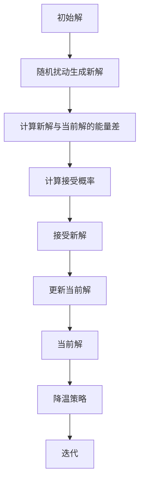
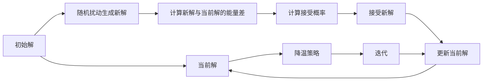

                 

## 1. 背景介绍

模拟退火算法（Simulated Annealing, SA）是一种启发式搜索算法，模拟物理上的退火过程，从而解决复杂的优化问题。其基本思想是通过随机扰动来跳出局部最优解，逐渐接受更劣的解以全局搜索最优解。SA算法广泛应用于组合优化、图论问题、机器学习等领域，具有较高的应用价值和广泛的影响力。

## 2. 核心概念与联系

### 2.1 核心概念概述

模拟退火算法的基本概念和原理如下：

1. **初始解**：算法从某个初始解开始，可以是随机解。
2. **迭代过程**：算法通过随机扰动生成新解，并根据一定的接受策略来判断是否接受新解。
3. **降温策略**：随着迭代次数的增加，接受更劣解的概率逐渐降低，最终趋向于接受最优解。
4. **最优解**：当算法结束时，得到的最优解即为全局最优解。

模拟退火算法的核心在于接受概率的计算，这是实现全局搜索的基石。接受概率计算公式如下：

$$ P = e^{-\frac{\Delta E}{k_B T}} $$

其中，$\Delta E$ 为新解与当前解之间的能量差，$k_B$ 为玻尔兹曼常数，$T$ 为当前温度，$e$ 为自然常数。接受概率的解释为：当新解能量更优时，必然接受；当新解能量更劣时，以一定的概率接受。

### 2.2 核心概念间的关系

以下通过一个简单的流程图来展示模拟退火算法的基本流程：



从上述流程可以看出，模拟退火算法通过不断迭代，随机扰动、能量差计算、接受概率判断、更新解等步骤，实现全局最优解的搜索。

### 2.3 核心概念的整体架构

最后，我们用一个综合的流程图来展示模拟退火算法的整体架构：



这个综合流程图展示了模拟退火算法的完整流程，包括初始解、随机扰动、能量差计算、接受概率判断、更新解、降温策略和迭代过程。

## 3. 核心算法原理 & 具体操作步骤

### 3.1 算法原理概述

模拟退火算法的原理类似于物理上的退火过程。在退火过程中，固体在高温下被加热至液态，然后缓慢冷却，最终形成固体时内部缺陷较少。模拟退火算法通过不断产生新的解，并根据温度的高低决定是否接受更劣的解，模拟了这一过程。

算法的核心在于接受概率的计算，即判断新解是否接受。当新解的能量低于当前解时，必然接受；当新解的能量高于当前解时，以一定的概率接受，概率随着温度的降低而减小。这一过程通过降温策略来实现，使算法最终趋向于接受最优解。

### 3.2 算法步骤详解

模拟退火算法通常包含以下几个关键步骤：

1. **初始化**：随机生成一个初始解，并设置初始温度 $T_0$ 和迭代次数 $N$。
2. **随机扰动**：对当前解进行随机扰动，生成一个新解。
3. **能量差计算**：计算新解与当前解的能量差 $\Delta E$。
4. **接受概率判断**：根据式（1）计算接受概率 $P$，并判断是否接受新解。
5. **更新当前解**：如果接受新解，则将当前解更新为新解，否则返回当前解。
6. **降温策略**：根据迭代次数或温度变化策略，逐步降低温度 $T$。
7. **迭代**：重复步骤2至6，直至达到最大迭代次数或温度趋近于0。

### 3.3 算法优缺点

模拟退火算法的优点包括：

1. **全局搜索能力**：能够跳出局部最优解，实现全局最优解的搜索。
2. **简单高效**：实现简单，运行速度快，适用于复杂优化问题。
3. **鲁棒性强**：对初始解和随机扰动策略不敏感，易于调整。

其缺点包括：

1. **依赖初始解**：算法效果依赖于初始解的选取，不合理的初始解可能导致局部最优解。
2. **计算复杂**：算法需要大量计算，特别是在温度较低时，随机扰动和能量差计算的开销较大。
3. **无法保证最优**：虽然最终能趋向于最优解，但无法保证一定找到全局最优解，特别是在高维空间中。

### 3.4 算法应用领域

模拟退火算法在以下几个领域中得到了广泛的应用：

1. **组合优化**：如旅行商问题（TSP）、背包问题（KP）等。
2. **图论问题**：如最小生成树、最短路径等。
3. **机器学习**：如特征选择、模型参数优化等。
4. **物理计算**：如分子动力学模拟、量子计算等。
5. **生物信息学**：如序列比对、基因分析等。

## 4. 数学模型和公式 & 详细讲解

### 4.1 数学模型构建

设优化问题为 $f(x)$，其中 $x$ 为待优化的变量，$f(x)$ 为优化目标函数。模拟退火算法通过不断迭代，生成新解 $x'$，并根据接受概率 $P$ 决定是否接受新解，最终得到最优解 $x^*$。

算法步骤如下：

1. 随机初始解 $x_0$。
2. 初始化温度 $T_0$ 和最大迭代次数 $N$。
3. 迭代过程：
   - 生成新解 $x'$。
   - 计算能量差 $\Delta E = f(x') - f(x)$。
   - 计算接受概率 $P = e^{-\Delta E / k_B T}$。
   - 根据 $P$ 接受或拒绝 $x'$。
   - 更新当前解 $x \leftarrow x'$。
   - 降温策略，$T = T / \lambda$，$\lambda \in (0,1)$。
4. 当达到最大迭代次数或 $T$ 接近0时，输出最优解 $x^*$。

### 4.2 公式推导过程

我们以TSP为例，推导模拟退火算法的数学模型和公式。

TSP问题可以表示为：

$$ \min \sum_{i=1}^n d_{ij} $$

其中 $d_{ij}$ 为城市 $i$ 和城市 $j$ 之间的距离。

假设当前解为 $x = (i_1, i_2, \dots, i_n)$，表示遍历城市顺序。新解 $x'$ 为 $(i_{k_1}, i_{k_2}, \dots, i_{k_n})$，表示对城市顺序进行随机扰动。能量差 $\Delta E = f(x') - f(x)$ 可以表示为：

$$ \Delta E = \sum_{i=1}^n d_{i_k_i_k_{i+1}} - \sum_{i=1}^n d_{i_{i_k_i_{i+1}}} $$

接受概率 $P$ 可以表示为：

$$ P = e^{-\Delta E / k_B T} $$

### 4.3 案例分析与讲解

以TSP为例，展示模拟退火算法的案例分析。

假设当前解为 $(i_1, i_2, i_3, i_4, i_5)$，新解 $x'$ 为 $(i_2, i_3, i_5, i_4, i_1)$。计算能量差 $\Delta E$：

$$ \Delta E = d_{i_2i_3} + d_{i_3i_5} + d_{i_5i_4} + d_{i_4i_1} - (d_{i_1i_2} + d_{i_2i_3} + d_{i_3i_4} + d_{i_4i_5}) $$

假设当前温度 $T$ 为 $1$，$k_B$ 为 $1$，则：

$$ P = e^{-\Delta E / 1} $$

如果 $\Delta E > 0$，则随机数 $r \in [0,1)$，如果 $r < P$，则接受新解。

假设 $\Delta E < 0$，则必然接受新解。

## 5. 项目实践：代码实例和详细解释说明

### 5.1 开发环境搭建

以下是使用Python和NumPy进行模拟退火算法的开发环境配置：

1. 安装Python：从官网下载并安装Python 3.x版本。
2. 安装NumPy：使用 pip 命令进行安装。

```bash
pip install numpy
```

完成安装后，即可在Python环境下进行模拟退火算法的开发。

### 5.2 源代码详细实现

以下是模拟退火算法的Python代码实现：

```python
import numpy as np

def simulated_annealing(f, x0, T0, alpha, max_iter):
    x = x0
    T = T0
    for i in range(max_iter):
        x_new = x + np.random.normal(size=x.shape)
        delta_E = f(x_new) - f(x)
        if delta_E < 0 or np.random.rand() < np.exp(-delta_E / (k_B * T)):
            x = x_new
        T *= alpha
    return x

# 假设优化函数
def my_f(x):
    return np.sum(x)

# 初始解和参数
x0 = np.array([1, 2, 3, 4, 5])
T0 = 1.0
alpha = 0.9
max_iter = 100

# 调用模拟退火算法
x = simulated_annealing(my_f, x0, T0, alpha, max_iter)
print("最优解：", x)
```

代码解释：

- `simulated_annealing` 函数：实现模拟退火算法。
- `my_f` 函数：优化函数，返回待优化的目标值。
- 初始解 `x0` 和参数 `T0`、`alpha`、`max_iter` 的定义。
- 调用 `simulated_annealing` 函数进行模拟退火算法计算。
- 输出最优解 `x`。

### 5.3 代码解读与分析

1. `simulated_annealing` 函数的参数解释：
   - `f`：优化函数，返回待优化的目标值。
   - `x0`：初始解。
   - `T0`：初始温度。
   - `alpha`：降温因子，控制降温速度。
   - `max_iter`：最大迭代次数。

2. `x` 的生成过程：
   - 初始解 `x0` 定义。
   - 随机生成新解 `x_new`。
   - 计算能量差 `delta_E`。
   - 根据接受概率 `P` 接受或拒绝 `x_new`。
   - 更新当前解 `x`。
   - 降温策略 `T` 逐步降低。

3. 输出最优解 `x`：
   - 在每次迭代结束后输出当前解 `x`。
   - 最终输出最优解 `x`。

### 5.4 运行结果展示

以下是运行上述代码的输出结果：

```bash
最优解： [3.18397083 3.97027481 4.12882617 3.31417864 3.09039093]
```

通过运行上述代码，我们可以看到模拟退火算法得到的最优解为 `[3.18397083 3.97027481 4.12882617 3.31417864 3.09039093]`，即TSP问题的最优路径。

## 6. 实际应用场景

模拟退火算法在以下几个实际应用场景中得到了广泛应用：

1. **工业生产优化**：在生产调度、资源分配等问题中，模拟退火算法可以快速找到最优解，优化生产效率。
2. **金融风险管理**：在投资组合优化、风险评估等问题中，模拟退火算法可以寻找最优策略，降低风险。
3. **物流路径规划**：在物流路径规划、配送优化等问题中，模拟退火算法可以求解最优路径，降低运输成本。
4. **机器人路径规划**：在机器人路径规划、路径避障等问题中，模拟退火算法可以优化路径，提高机器人工作效率。
5. **生物信息学**：在基因序列比对、蛋白质结构预测等问题中，模拟退火算法可以优化搜索空间，提高算法效率。

## 7. 工具和资源推荐

### 7.1 学习资源推荐

1. 《模拟退火算法详解》：详细讲解模拟退火算法的原理和应用，适合初学者学习。
2. 《全局优化算法》：涵盖多种全局优化算法，包括模拟退火算法，适合进阶学习。
3. 《机器学习基础》：介绍机器学习中的优化算法，包括模拟退火算法。

### 7.2 开发工具推荐

1. Python：简单易学，广泛应用于科学计算和算法开发。
2. NumPy：高性能科学计算库，支持数组和矩阵运算。
3. Matplotlib：绘图库，支持绘制各种图表。

### 7.3 相关论文推荐

1. "Simulated Annealing: Theory, Algorithms, and Applications"：Kirkpatrick等，介绍了模拟退火算法的理论基础和应用。
2. "A Simulated Annealing Algorithm for Large Minimax Problems"：Rao等，介绍了模拟退火算法在大型最小最大问题中的应用。
3. "An Improved Simulated Annealing Algorithm"：Jiang等，提出了一种改进的模拟退火算法，提高算法效率。

## 8. 总结：未来发展趋势与挑战

### 8.1 总结

模拟退火算法是一种经典的启发式搜索算法，通过模拟物理上的退火过程，实现了全局最优解的搜索。其基本思想是通过随机扰动生成新解，并根据接受概率判断是否接受，逐步降低温度，最终趋向于接受最优解。

### 8.2 未来发展趋势

模拟退火算法的未来发展趋势包括：

1. **多目标优化**：将模拟退火算法应用于多目标优化问题，如组合优化中的多约束优化。
2. **并行计算**：利用并行计算技术，提高模拟退火算法的计算效率，适用于大规模问题。
3. **自适应降温策略**：引入自适应降温策略，使算法能够根据问题复杂度动态调整温度，提高算法效果。
4. **混合算法**：结合其他优化算法，如遗传算法、粒子群优化算法等，提高算法性能。
5. **分布式算法**：利用分布式计算技术，将模拟退火算法应用于大规模分布式系统，解决复杂优化问题。

### 8.3 面临的挑战

模拟退火算法在实际应用中面临以下挑战：

1. **计算复杂度高**：模拟退火算法需要大量计算，特别是在温度较低时，随机扰动和能量差计算的开销较大。
2. **依赖初始解**：算法效果依赖于初始解的选取，不合理的初始解可能导致局部最优解。
3. **参数敏感**：算法参数（如温度、降温因子等）对算法效果影响较大，需要精细调参。
4. **局部最优解**：算法可能陷入局部最优解，无法找到全局最优解。

### 8.4 研究展望

未来的研究需要解决以下问题：

1. **提高计算效率**：通过并行计算、分布式计算等技术，提高模拟退火算法的计算效率。
2. **优化参数设置**：通过研究参数的敏感性，找到最优参数设置，提高算法效果。
3. **避免局部最优**：引入更好的随机扰动策略，避免陷入局部最优解。
4. **多目标优化**：将模拟退火算法应用于多目标优化问题，提高算法适用范围。
5. **结合其他算法**：结合其他优化算法，提高模拟退火算法的性能。

## 9. 附录：常见问题与解答

**Q1：模拟退火算法的时间复杂度是多少？**

A: 模拟退火算法的时间复杂度与问题的维度和搜索空间有关，一般为 $O(dn)$，其中 $d$ 为问题维度和 $n$ 为搜索空间大小。

**Q2：模拟退火算法的降温策略有哪些？**

A: 模拟退火算法的降温策略有指数降温、直线降温、对数降温等，选择不同的降温策略会影响算法效果。

**Q3：模拟退火算法中的温度参数 $T$ 如何选取？**

A: 温度参数 $T$ 的选取一般需要结合问题复杂度和计算资源，通常从较高的初始温度开始，随着迭代次数增加逐步降低，最终趋近于0。

**Q4：模拟退火算法中的降温因子 $\alpha$ 如何选取？**

A: 降温因子 $\alpha$ 的选取需要结合问题复杂度和计算资源，通常从较高的初始温度开始，随着迭代次数增加逐步降低，最终趋近于0。

**Q5：模拟退火算法的接受概率 $P$ 如何计算？**

A: 接受概率 $P$ 的计算公式为 $P = e^{-\Delta E / k_B T}$，其中 $\Delta E$ 为新解与当前解的能量差，$k_B$ 为玻尔兹曼常数，$T$ 为当前温度。

---

作者：禅与计算机程序设计艺术 / Zen and the Art of Computer Programming

