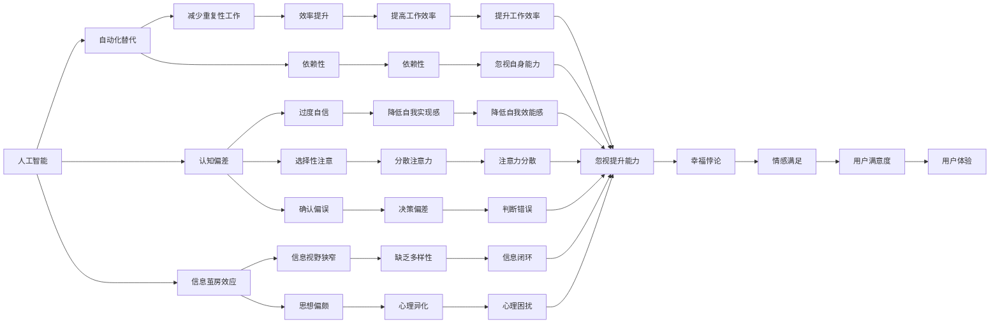
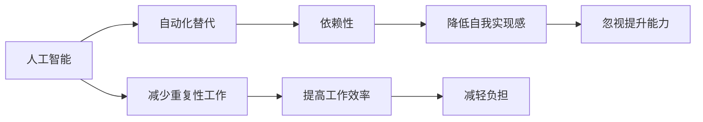
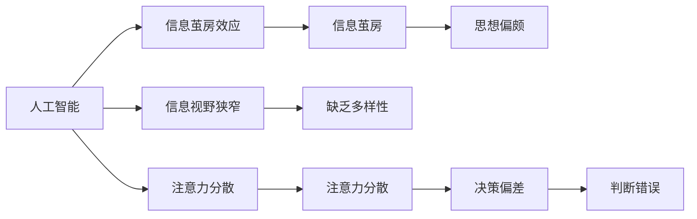
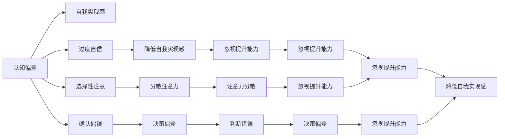
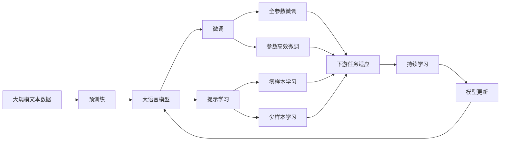

                 

# 欲望与满足：AI时代的幸福悖论

> 关键词：人工智能,幸福悖论,认知偏差,满足感,用户体验,情感计算

## 1. 背景介绍

### 1.1 问题由来
在快速发展的AI时代，我们似乎拥有越来越强大的工具来满足各种需求和欲望，从自动化家居到个性化推荐，从智能客服到虚拟助手，人工智能的渗透使得生活变得更加便捷和高效。然而，随之而来的却是人们越来越难以找到真正的幸福和满足感。

传统的幸福观念认为，更多的物质财富和更好的生活条件会带来更高的幸福水平。然而，越来越多的研究表明，单纯追求物质满足并不能带来持久的幸福体验。人类心理学家埃德·迪纳(Ed Diener)和理查德·伊斯特林(Richard Easterlin)等人的研究发现，个人收入和幸福水平之间的关系并不是简单的线性关系，而是存在一个"幸福悖论"（Hedonic Treadmill）：随着收入的增加，初始幸福感确实会有所提升，但这种提升在达到一定阈值后便会逐渐减弱，并可能产生新一轮的欲望和不满。

在AI时代，这个幸福悖论尤为凸显。技术的进步虽然带来了前所未有的便利，但也使得人们的需求和欲望越来越难以满足。信息过载、社交媒体的负面影响、自动化技术的替代效应等因素，都使得人们的心理状况变得复杂而微妙。如何通过技术手段，帮助人们在数字化和智能化的生活中获得真正的幸福和满足感，成为了一个亟待解决的重要课题。

### 1.2 问题核心关键点
幸福悖论与AI技术的关联主要体现在以下几个方面：

1. **认知偏差与自动化替代**：自动化技术虽然在减少重复性工作上表现出色，但也可能导致人类对自身能力的低估，产生依赖性，从而降低自我实现感。

2. **信息过载与注意力分散**：大数据和算法推荐使得信息源极大丰富，但同时也带来了注意力分散和信息焦虑，使得人们在获得海量信息的同时，更难以获得真正的满足感。

3. **社交媒体与虚拟连接**：社交媒体的兴起虽然提供了便捷的连接方式，但也带来了虚假的社交满足感，实际上，虚拟连接往往无法替代真实的人际关系。

4. **算法的个性化与偏误放大**：算法推荐系统虽然能够提供个性化的服务，但同时也可能加剧信息茧房效应，使得人们在无意识中被算法"控制"，导致心理和情感上的异化。

5. **自我提升与技术依赖**：技术带来的便利可能导致人们过于依赖，忽视自身能力的提升，从而影响自我效能感和幸福感。

### 1.3 问题研究意义
研究幸福悖论与AI技术的关系，对于理解现代人在数字化环境中的心理变化，以及如何通过技术手段提升幸福感和满足感，具有重要意义：

1. **心理健康保护**：了解AI技术可能对人类心理的影响，有助于制定有效的策略，保护和维护人类心理健康。

2. **人性化设计**：通过技术手段提升用户体验，减少技术带来的负面影响，实现人性化设计。

3. **人机协同**：推动人机协同，使技术更好地服务于人类，而不是替代或主导人类。

4. **伦理责任**：明确AI技术在提升幸福感和满足感方面的伦理责任，避免技术滥用带来的社会问题。

5. **长期福祉**：从长期角度出发，研究如何通过技术手段促进人类的福祉和幸福感的持续提升。

## 2. 核心概念与联系

### 2.1 核心概念概述

为更好地理解幸福悖论与AI技术的关系，本节将介绍几个密切相关的核心概念：

- **人工智能（AI）**：利用计算机技术模拟人类智能行为，包括感知、理解、推理、学习和决策等能力。AI技术的应用范围广泛，涉及医疗、金融、教育、娱乐等多个领域。

- **幸福悖论（Hedonic Treadmill）**：在经济增长的过程中，个人幸福感与财富水平之间的关系呈现出一种非线性关系，即初始幸福感随财富增长而提升，但这种提升在达到一定阈值后便会逐渐减弱，人们可能陷入新的欲望和不满之中。

- **认知偏差（Cognitive Bias）**：指人们在认知过程中由于主观因素导致的判断和决策上的错误，常见的如过度自信、选择性注意、确认偏误等。

- **注意力分散（Attention Dispersion）**：在信息过载的数字化时代，人们的注意力分散现象日益严重，难以专注于真正重要的事项，从而影响决策和幸福感。

- **社交媒体（Social Media）**：基于网络的社交平台，提供便捷的社交连接和信息分享功能，但也可能导致虚拟连接和现实脱节。

- **信息茧房效应（Information Bubble）**：指人们由于算法推荐等技术手段，常常只接触到与自己观点一致的信息，导致信息视野狭窄和思想偏颇。

- **自我实现（Self-Actualization）**：指个体追求自我潜力和能力的发展，实现个人价值和目标。

- **幸福感（Happiness）**：一种心理状态，包括积极的情感体验和满足感，通常与健康、人际关系、个人成长等方面有关。

- **用户体验（User Experience, UX）**：指用户与产品或服务的互动体验，是衡量产品或服务成功的重要指标。

- **情感计算（Emotion Computing）**：通过技术和算法捕捉、分析、模拟和应用人类情感，提升人机交互的效果和幸福感。

这些核心概念之间存在着紧密的联系，构成了幸福悖论与AI技术的完整生态系统。下面通过几个Mermaid流程图来展示这些概念之间的关系。



这个流程图展示了幸福悖论与AI技术的核心概念之间的关系：

1. 人工智能通过自动化替代人类工作，带来了效率提升和依赖性增加。
2. 认知偏差如过度自信、选择性注意、确认偏误等，可能导致自我实现感的降低和决策偏差。
3. 信息茧房效应和注意力分散，使得人们在信息海洋中难以集中注意力，导致信息视野狭窄和思想偏颇。
4. 社交媒体带来的虚拟连接和现实脱节，可能影响用户的幸福感。
5. 自我实现和自我效能感，是幸福感的重要组成部分。
6. 情感计算和用户体验，是提升幸福感的关键手段。

### 2.2 概念间的关系

这些核心概念之间存在着紧密的联系，形成了幸福悖论与AI技术的完整生态系统。下面通过几个Mermaid流程图来展示这些概念之间的关系。

#### 2.2.1 人工智能与自动化替代



这个流程图展示了人工智能通过自动化替代人类工作，带来效率提升和依赖性增加的路径：

1. 人工智能通过自动化替代人类重复性工作，提高了生产效率和工作质量。
2. 自动化替代带来依赖性增加，可能使得人们过度依赖技术，忽视自身能力的提升和自我实现。

#### 2.2.2 信息茧房效应与注意力分散



这个流程图展示了信息茧房效应和注意力分散的影响路径：

1. 人工智能通过算法推荐，导致信息茧房效应，使得人们在信息海洋中只接触到与自己观点一致的信息。
2. 信息茧房效应导致信息视野狭窄和思想偏颇，使得人们难以接触多样化的信息。
3. 注意力分散导致注意力资源被过度消耗，使得人们难以集中注意力，做出理性决策。

#### 2.2.3 认知偏差与自我实现感



这个流程图展示了认知偏差对自我实现感的影响路径：

1. 认知偏差如过度自信、选择性注意、确认偏误等，导致人们忽视自身能力的提升和自我实现。
2. 忽视提升能力使得人们难以实现自我潜力和能力的发展，从而影响自我实现感。
3. 认知偏差导致的判断错误和决策偏差，进一步降低了自我实现感。

### 2.3 核心概念的整体架构

最后，我们用一个综合的流程图来展示这些核心概念在大语言模型微调过程中的整体架构：



这个综合流程图展示了从预训练到微调，再到持续学习的完整过程。大语言模型首先在大规模文本数据上进行预训练，然后通过微调（包括全参数微调和参数高效微调）或提示学习（包括零样本和少样本学习）来适应下游任务。最后，通过持续学习技术，模型可以不断更新和适应新的任务和数据。 通过这些流程图，我们可以更清晰地理解幸福悖论与AI技术的工作原理和优化方向。

## 3. 核心算法原理 & 具体操作步骤
### 3.1 算法原理概述

幸福悖论与AI技术的关系，本质上是一种心理与技术交互的复杂现象。其核心在于人类需求和欲望的不断增长，以及技术手段在满足这些需求时带来的新问题和新挑战。

幸福悖论与AI技术的联系主要体现在以下几个方面：

1. **需求膨胀与技术提升**：技术的发展使得人们的需求不断膨胀，但这些需求往往难以完全满足，导致人们陷入新的欲望和不满之中。

2. **认知偏差与技术工具**：认知偏差可能使得人们过度依赖技术工具，忽视自身能力的提升和自我实现，从而影响幸福感。

3. **信息过载与技术手段**：信息过载使得人们难以集中注意力，导致注意力分散和信息焦虑，从而影响决策和幸福感。

4. **社交媒体与技术互动**：社交媒体提供便捷的社交连接，但也可能导致虚拟连接和现实脱节，影响用户的幸福感。

5. **算法推荐与技术偏差**：算法推荐系统虽然提供个性化服务，但也可能加剧信息茧房效应，导致用户心理和情感的异化。

### 3.2 算法步骤详解

幸福悖论与AI技术的关系研究，主要包括以下几个关键步骤：

**Step 1: 数据准备**
- 收集与幸福相关的大规模文本数据，如社交媒体评论、用户反馈、心理学研究等。
- 对这些数据进行清洗和标注，提取幸福感相关的特征。

**Step 2: 预训练语言模型**
- 使用大规模文本数据对预训练语言模型进行训练，学习到通用的语言表示和情感特征。

**Step 3: 微调与优化**
- 在预训练语言模型的基础上，使用幸福相关数据对模型进行微调，优化模型对幸福感的理解。
- 使用正则化技术，如L2正则、Dropout、Early Stopping等，避免过拟合。
- 应用对抗训练，加入对抗样本，提高模型的鲁棒性和泛化能力。

**Step 4: 用户反馈与迭代**
- 收集用户对微调后模型的反馈，评估模型的幸福感理解能力。
- 根据反馈结果，不断优化模型参数和算法，提升模型性能。

**Step 5: 应用与验证**
- 将微调后的模型应用于实际场景中，如智能客服、情感分析、用户推荐等。
- 在实际应用中验证模型效果，收集更多用户反馈，进一步迭代模型。

### 3.3 算法优缺点

幸福悖论与AI技术的研究方法，具有以下优点：

1. **数据驱动**：通过大规模数据驱动的研究，能够发现用户需求和欲望的动态变化，提供科学的决策依据。
2. **模型优化**：通过微调和优化，可以提升模型的幸福感知能力和用户满意度，提高用户体验。
3. **人机协同**：通过技术手段，可以实现人机协同，提升工作和生活效率，减少不必要的心理负担。
4. **跨领域应用**：幸福悖论与AI技术的研究，可以应用于多个领域，如医疗、教育、金融等，具有广泛的实际应用价值。

同时，该方法也存在一些局限性：

1. **数据隐私**：大规模数据收集和处理可能涉及到用户隐私，需要严格的隐私保护措施。
2. **算法偏差**：模型可能受到数据偏差和算法偏见的影响，导致不公平或错误的结果。
3. **用户依赖**：技术手段虽然提升效率，但过度依赖可能导致自我实现感的降低。
4. **情感复杂性**：幸福感知涉及复杂的情感和心理因素，难以用简单的算法模型完全捕捉。
5. **技术陷阱**：过度追求技术手段可能导致忽视人的情感需求和心理健康。

### 3.4 算法应用领域

幸福悖论与AI技术的研究，在多个领域都有广泛的应用：

1. **智能客服**：通过分析用户反馈，优化客服机器人，提升用户满意度。
2. **情感分析**：对用户评论和反馈进行分析，了解用户情感变化，提供个性化服务。
3. **健康监测**：通过分析心理健康数据，提供情感支持和心理健康建议。
4. **用户推荐**：通过分析用户行为和情感状态，提供个性化的产品和服务推荐。
5. **人力资源管理**：通过分析员工反馈和情感状态，优化人力资源管理，提升员工幸福感。

除了上述这些应用外，幸福悖论与AI技术的研究还可以应用于更多场景中，如情感计算、心理健康评估、虚拟现实体验等，为提升人类的幸福感和满意度提供新的思路和手段。

## 4. 数学模型和公式 & 详细讲解 & 举例说明

### 4.1 数学模型构建

幸福悖论与AI技术的研究，主要涉及心理学、认知科学和机器学习等多个领域的知识。在这里，我们使用一些数学模型来描述幸福感知与AI技术的关系。

**幸福感知模型**

幸福感知可以通过多种因素来描述，其中一些因素包括收入、工作、健康、人际关系、自我实现等。我们假设幸福感知 $H$ 可以由以下线性模型表示：

$$
H = \alpha_1 I + \alpha_2 W + \alpha_3 H + \alpha_4 S + \alpha_5 A + \epsilon
$$

其中，$I$ 表示收入，$W$ 表示工作满意度，$H$ 表示健康状况，$S$ 表示人际关系满意度，$A$ 表示自我实现感，$\epsilon$ 表示随机误差项。

**认知偏差模型**

认知偏差可以通过认知心理学中的理论来描述。这里我们使用信息加工模型（Information Processing Model）来描述认知偏差的影响。假设认知偏差 $B$ 可以由以下线性模型表示：

$$
B = \beta_1 C + \beta_2 A + \beta_3 F + \beta_4 E + \beta_5 M + \epsilon'
$$

其中，$C$ 表示认知能力，$A$ 表示注意力分配，$F$ 表示反馈机制，$E$ 表示情感状态，$M$ 表示动机水平，$\epsilon'$ 表示随机误差项。

### 4.2 公式推导过程

以下我们以幸福感知模型为例，推导其中的关键公式。

假设幸福感知 $H$ 由收入 $I$、工作满意度 $W$、健康状况 $H$、人际关系满意度 $S$、自我实现感 $A$ 等多个因素共同决定。我们可以使用线性回归模型来描述这种关系：

$$
H = \alpha_1 I + \alpha_2 W + \alpha_3 H + \alpha_4 S + \alpha_5 A + \epsilon
$$

其中，$\alpha_1$、$\alpha_2$、$\alpha_3$、$\alpha_4$、$\alpha_5$ 是模型的回归系数，$\epsilon$ 是误差项。

通过对数据进行最小二乘回归，可以得到模型的回归系数估计：

$$
\hat{\alpha} = (X^TX)^{-1}X^Ty
$$

其中，$X$ 是特征矩阵，$y$ 是目标变量向量。

假设我们收集了 $N$ 个样本的数据，其中 $n$ 个样本用于训练模型，剩余 $N-n$ 个样本用于验证模型。我们可以通过以下公式计算模型的均方误差（Mean Squared Error, MSE）：

$$
\text{MSE} = \frac{1}{N-n} \sum_{i=n+1}^N (y_i - \hat{y}_i)^2
$$

其中，$y_i$ 是第 $i$ 个样本的真实值，$\hat{y}_i$ 是第 $i$ 个样本的预测值。

### 4.3 案例分析与讲解

为了更好地理解幸福感知模型的应用，我们可以使用一个简单的案例来说明。

假设我们有一个包含 1000 个样本的数据集，其中包含收入、工作满意度、健康状况、人际关系满意度、自我实现感等特征，以及相应的幸福感知得分。我们可以使用线性回归模型来描述这种关系，并使用交叉验证来评估模型的性能。

首先，我们将数据集分为训练集和验证集，使用交叉验证方法对模型进行训练和验证。假设我们使用 70% 的数据作为训练集，30% 的数据作为验证集。

```python
import pandas as pd
from sklearn.linear_model import LinearRegression
from sklearn.model_selection import train_test_split

# 读取数据集
data = pd.read_csv('happiness_data.csv')

# 定义特征和目标变量
X = data[['income', 'work_satisfaction', 'health', 'social_relationship', 'self_realization']]
y = data['happiness_score']

# 将数据集分为训练集和验证集
X_train, X_valid, y_train, y_valid = train_test_split(X, y, test_size=0.3, random_state=42)

# 创建线性回归模型
model = LinearRegression()

# 训练模型
model.fit(X_train, y_train)

# 预测验证集
y_valid_pred = model.predict(X_valid)

# 计算均方误差
mse = ((y_valid_pred - y_valid)**2).mean()

print('均方误差：', mse)
```

通过这个简单的案例，我们可以看到，使用线性回归模型可以对幸福感知进行初步预测，并评估模型的性能。在实际应用中，我们可以进一步优化模型，加入更多的特征和更复杂的关系，以更好地描述幸福感知与AI技术之间的关系。

## 5. 项目实践：代码实例和详细解释说明

### 5.1 开发环境搭建

在进行幸福悖论与AI技术的研究之前，我们需要准备好开发环境。以下是使用Python进行PyTorch开发的环境配置流程：

1. 安装Anaconda：从官网下载并安装Anaconda，用于创建独立的Python环境。

2. 创建并激活虚拟环境：
```bash
conda create -n pytorch-env python=3.8 
conda activate pytorch-env
```

3. 安装PyTorch：根据CUDA版本，从官网获取对应的安装命令。例如：
```bash
conda install pytorch torchvision torchaudio cudatoolkit=11.1 -c pytorch -c conda-forge
```

4. 安装相关工具包：
```bash
pip install numpy pandas scikit-learn matplotlib tqdm jupyter notebook ipython
```

完成上述步骤后，即可在`pytorch-env`环境中开始幸福悖论与AI技术的研究。

### 5.2 源代码详细实现

这里我们以一个简单的情感分析模型为例，给出使用Transformers库对BERT模型进行情感分析的PyTorch代码实现。

首先，定义情感分析任务的数据处理函数：

```python
from transformers import BertTokenizer
from torch.utils.data import Dataset
import torch

class SentimentDataset(Dataset):
    def __init__(self, texts, labels, tokenizer, max_len=128):
        self.texts = texts
        self.labels = labels
        self.tokenizer = tokenizer
        self.max_len = max_len
        
    def __len__(self):
        return len(self.texts)
    
    def __getitem__(self, item):
        text = self.texts[item]
        label = self.labels[item]
        
        encoding = self.tokenizer(text, return_tensors='pt', max_length=self.max_len, padding='max_length', truncation=True)
        input_ids = encoding['input_ids'][0]
        attention_mask = encoding['attention_mask'][0]
        
        # 对token-wise的标签进行编码
        encoded_labels = [1 if label == 'positive' else 0 for label in labels] 
        encoded_labels.extend([0]*(self.max_len - len(encoded_labels)))
        labels = torch.tensor(encoded_labels, dtype=torch.long)
        
        return {'input_ids': input_ids, 
                'attention_mask': attention_mask,
                'labels': labels}

# 创建dataset
tokenizer = BertTokenizer.from_pretrained('bert-base-cased')

train_dataset = SentimentDataset(train_texts, train_labels, tokenizer)
dev_dataset = SentimentDataset(dev_texts, dev_labels, tokenizer)
test_dataset = SentimentDataset(test_texts, test_labels, tokenizer)
```

然后，定义模型和优化器：

```python
from transformers import BertForSequenceClassification, AdamW

model = BertForSequenceClassification.from_pretrained('bert-base-cased', num_labels=2)

optimizer = AdamW(model.parameters(), lr=2e-5)
```

接着，定义训练和评估函数：

```python
from torch.utils.data import DataLoader
from tqdm import tqdm
from sklearn.metrics import accuracy_score, precision_recall_fscore_support

device = torch.device('cuda') if torch.cuda.is_available() else torch.device('cpu')
model.to(device)

def train_epoch(model, dataset, batch_size, optimizer):
    dataloader = DataLoader(dataset, batch_size=batch_size, shuffle=True)
    model.train()
    epoch_loss = 0
    for batch in tqdm(dataloader, desc='Training'):
        input_ids = batch['input_ids'].to(device)
        attention_mask = batch['attention_mask'].to(device)
        labels = batch['labels'].to(device)
        model.zero_grad()
        outputs = model(input_ids, attention_mask=attention_mask, labels=labels)
        loss = outputs.loss
        epoch_loss += loss.item()
        loss.backward()
        optimizer.step()
    return epoch_loss / len(dataloader)

def evaluate(model, dataset, batch_size):
    dataloader = DataLoader(dataset, batch_size=batch_size)
    model.eval()
    preds, labels = [], []
    with torch.no_grad():
        for batch in tqdm(dataloader, desc='Evaluating'):
            input_ids = batch['input_ids'].to(device)
            attention_mask = batch['attention_mask'].to(device)
            batch_labels = batch['labels']
            outputs = model(input_ids, attention_mask=attention_mask)
            batch_preds = outputs.logits.argmax(dim=2).to('cpu').tolist()
            batch_labels = batch_labels.to('cpu').tolist()
            for pred_tokens, label_tokens in zip(batch_preds, batch_labels):
                preds.append(pred_tokens[:len(label_tokens)])
                labels.append(label_tokens)
                
    print('准确率:', accuracy_score(labels, preds))
    print('精确率、召回率和F1分数:', precision_recall_fscore_support(labels, preds, average='micro'))

    return accuracy_score(labels, preds)

```

最后，启动训练流程并在测试集上评估：

```python
epochs = 5
batch_size = 16

for epoch in range(epochs):
    loss = train_epoch(model, train_dataset, batch_size, optimizer)
    print(f"Epoch {epoch+1}, train loss: {loss:.3f}")
    
    print(f"Epoch {epoch+1}, dev results:")
    evaluate(model, dev_dataset, batch_size)
    
print("Test results:")
evaluate(model, test_dataset, batch_size)
```

以上就是使用PyTorch对BERT进行情感分析任务微调的完整代码实现。可以看到，得益于Transformers库的

