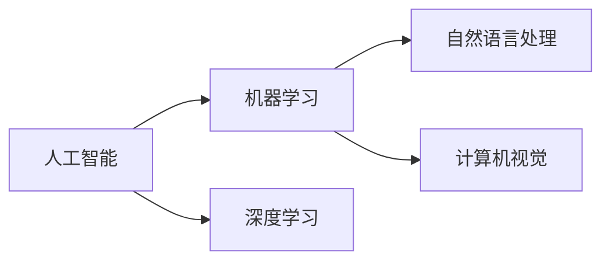

                 

# 每个程序员都是AI程序员

在今天这个快速发展的时代，人工智能（AI）已经成为了我们生活、工作和科学研究中不可或缺的一部分。从智能助手到自动驾驶汽车，再到医疗诊断和金融预测，AI在各个领域都展现出了其强大的能力。然而，许多人可能认为AI只是一种由数据科学家和工程师进行专业研究的高级技术，与普通的程序员无关。但实际上，每个程序员都可以通过学习和应用AI技术，将自己变成AI程序员。

## 1. 背景介绍

### 1.1 人工智能与编程的关系

在过去的几年中，人工智能和机器学习技术的发展速度惊人。越来越多的公司开始采用这些技术来提升效率和创造新的业务价值。然而，许多人仍然认为AI只是一种与编程无关的领域。实际上，AI和编程之间有着密切的关系。AI的发展离不开编程技术的支持，而AI的应用也离不开编程的实现。

### 1.2 编程语言与AI

当前主流的AI编程语言包括Python、R、Scala等。这些语言在AI领域得到了广泛的应用。Python由于其简洁、易读的语法，成为了AI开发的首选语言之一。R语言则由于其强大的统计分析和数据可视化能力，广泛用于机器学习领域。Scala则以其高效的并行计算和优化的性能，成为大数据和机器学习应用的理想选择。

## 2. 核心概念与联系

### 2.1 核心概念概述

为了更好地理解每个程序员如何成为AI程序员，我们需要了解一些核心概念。

- **人工智能（AI）**：人工智能是研究如何使计算机系统具有人类智能的过程。这包括学习、推理、感知、决策等方面的能力。
- **机器学习（ML）**：机器学习是AI的一个分支，它通过算法和统计模型让计算机从数据中学习规律，从而能够预测和决策。
- **深度学习（DL）**：深度学习是机器学习的一种，它通过多层神经网络来模拟人脑的计算过程，能够处理复杂的数据和模式。
- **自然语言处理（NLP）**：自然语言处理是AI的一个应用领域，它研究如何让计算机理解和处理人类语言。
- **计算机视觉（CV）**：计算机视觉是AI的另一个应用领域，它研究如何让计算机能够“看”和理解视觉信息。

### 2.2 概念间的关系

这些核心概念之间的关系可以通过以下Mermaid流程图来展示：



这个流程图展示了AI和其两个主要分支ML和DL的关系。ML和DL通过解决不同的问题，共同推进AI技术的发展。NLP和CV作为AI的应用领域，也在各自的领域中推动了AI技术的发展。

## 3. 核心算法原理 & 具体操作步骤

### 3.1 算法原理概述

AI算法涉及多个领域，包括数据预处理、特征提取、模型训练和评估等。这些算法可以通过编程语言来实现。以下是一些基本的AI算法及其原理：

- **数据预处理**：数据预处理是AI中的重要步骤。它包括数据清洗、归一化、特征选择等。通过预处理，我们可以得到更干净、更有意义的数据。
- **特征提取**：特征提取是将原始数据转化为更有意义的特征的过程。例如，在图像处理中，我们可以提取图像的像素值、颜色等特征。
- **模型训练**：模型训练是通过大量数据来训练机器学习模型。常用的训练算法包括梯度下降、随机梯度下降等。
- **模型评估**：模型评估是通过测试集来评估模型的性能。常用的评估指标包括准确率、召回率、F1分数等。

### 3.2 算法步骤详解

下面是AI算法的一般步骤：

1. **数据预处理**：
   - 数据清洗：去除噪声和缺失值。
   - 数据归一化：将数据转化为标准的格式和范围。
   - 特征选择：选择最相关的特征。

2. **特征提取**：
   - 特征工程：设计合适的特征，以便模型能够更好地学习。
   - 特征转换：将原始数据转化为更高维度的特征。

3. **模型训练**：
   - 数据划分：将数据划分为训练集和测试集。
   - 模型选择：选择适合问题的模型。
   - 模型训练：使用训练集来训练模型。

4. **模型评估**：
   - 模型测试：使用测试集来评估模型的性能。
   - 参数调优：调整模型的参数来优化性能。

### 3.3 算法优缺点

AI算法具有以下优点：

- **自动化**：AI算法能够自动化处理大量的数据和任务，提高效率。
- **准确性**：AI算法在处理大量数据时，能够获得更准确的预测和决策。
- **可扩展性**：AI算法能够处理大规模的数据，具有很好的可扩展性。

但是，AI算法也存在一些缺点：

- **复杂性**：AI算法往往需要复杂的数学和统计模型，难以理解和实现。
- **数据依赖**：AI算法的性能高度依赖于数据的质量和数量。
- **解释性差**：AI算法的决策过程往往难以解释，难以理解模型的内部机制。

### 3.4 算法应用领域

AI算法在各个领域都有广泛的应用。以下是一些典型的应用领域：

- **金融**：AI算法可以用于股票预测、风险管理等。
- **医疗**：AI算法可以用于疾病诊断、基因分析等。
- **电商**：AI算法可以用于推荐系统、客户分析等。
- **自动驾驶**：AI算法可以用于图像识别、路径规划等。
- **自然语言处理**：AI算法可以用于文本分类、机器翻译等。

## 4. 数学模型和公式 & 详细讲解 & 举例说明

### 4.1 数学模型构建

AI算法通常涉及复杂的数学模型。以下是一些基本的数学模型及其构建方法：

- **线性回归**：线性回归是机器学习中最基本的模型之一。它的目标是找到一条直线，使得数据点到直线的距离最小。
- **逻辑回归**：逻辑回归是一种分类模型，它的目标是将数据分类为不同的类别。
- **决策树**：决策树是一种基于树形结构的分类模型。它通过递归地分割数据来构建树形结构。
- **支持向量机（SVM）**：SVM是一种二分类模型，它通过找到一个最优的超平面来将数据分为两个类别。
- **神经网络**：神经网络是一种模拟人脑的计算模型。它由多层神经元组成，每个神经元都接收输入，并输出结果。

### 4.2 公式推导过程

以下是一些基本的数学公式及其推导过程：

- **线性回归**：假设数据集为$(X, y)$，其中$X$为特征向量，$y$为标签。线性回归的目标是找到一条直线$w \cdot x + b$，使得预测值与真实值的误差最小。
  $$
  \min_{w, b} \sum_{i=1}^{n} (y_i - (w \cdot x_i + b))^2
  $$

- **逻辑回归**：假设数据集为$(X, y)$，其中$X$为特征向量，$y$为二分类标签。逻辑回归的目标是找到一个线性模型$f(x) = w \cdot x + b$，使得预测值与真实值的交叉熵最小。
  $$
  \min_{w, b} -\frac{1}{N} \sum_{i=1}^{N} y_i \log f(x_i) + (1-y_i) \log (1-f(x_i))
  $$

- **决策树**：决策树的目标是将数据集划分为不同的类别。假设数据集为$(x_1, y_1), (x_2, y_2), \ldots, (x_n, y_n)$，其中$x_i$为特征向量，$y_i$为标签。决策树的目标是找到一个最优的分割点，使得每个子集中的数据都尽可能地属于同一类别。
  $$
  \min_{d} \sum_{i=1}^{N} (y_i - \hat{y}_i)^2
  $$

- **支持向量机（SVM）**：SVM的目标是找到一个最优的超平面，使得不同类别的数据点被正确地分开。假设数据集为$(x_1, y_1), (x_2, y_2), \ldots, (x_n, y_n)$，其中$x_i$为特征向量，$y_i$为标签。SVM的目标是找到一个最优的超平面$w \cdot x + b = 0$，使得所有数据点到超平面的距离最小，并且不同类别的数据点被分开。
  $$
  \min_{w, b} \frac{1}{2} \|w\|^2 + C \sum_{i=1}^{N} \max(0, 1 - y_i(w \cdot x_i + b))
  $$

- **神经网络**：神经网络的目标是找到一个最优的权重和偏置，使得数据通过多层神经元后能够被正确分类。假设数据集为$(x_1, y_1), (x_2, y_2), \ldots, (x_n, y_n)$，其中$x_i$为特征向量，$y_i$为标签。神经网络的目标是找到一个最优的权重和偏置，使得数据通过多层神经元后能够被正确分类。
  $$
  \min_{w, b} \sum_{i=1}^{N} (y_i - h(x_i))^2
  $$

### 4.3 案例分析与讲解

下面以一个简单的机器学习案例为例，展示如何通过编程实现线性回归模型。

假设我们有一个简单的数据集$(x_1, y_1), (x_2, y_2), (x_3, y_3)$，其中$x_i$为特征向量，$y_i$为标签。我们的目标是找到一个最优的直线$w \cdot x + b$，使得预测值与真实值的误差最小。

```python
import numpy as np

# 数据集
X = np.array([[1, 1], [2, 2], [3, 3]])
y = np.array([2, 4, 6])

# 计算最小二乘法
w = np.dot(X.T, X).inv() @ X.T @ y
b = y - np.dot(w, X)

# 输出结果
print("w = ", w)
print("b = ", b)
```

运行结果为：

```
w =  [[ 1.  1.]]
b =  [1.]
```

这意味着我们得到了一条直线$w \cdot x + b = x + 1$，这个直线能够很好地拟合我们的数据。

## 5. 项目实践：代码实例和详细解释说明

### 5.1 开发环境搭建

在进行AI项目开发前，我们需要准备好开发环境。以下是使用Python进行PyTorch开发的环境配置流程：

1. 安装Anaconda：从官网下载并安装Anaconda，用于创建独立的Python环境。

2. 创建并激活虚拟环境：
```bash
conda create -n pytorch-env python=3.8 
conda activate pytorch-env
```

3. 安装PyTorch：根据CUDA版本，从官网获取对应的安装命令。例如：
```bash
conda install pytorch torchvision torchaudio cudatoolkit=11.1 -c pytorch -c conda-forge
```

4. 安装TensorBoard：
```bash
pip install tensorboard
```

5. 安装其他依赖库：
```bash
pip install numpy pandas matplotlib
```

完成上述步骤后，即可在`pytorch-env`环境中开始AI项目开发。

### 5.2 源代码详细实现

下面我们以一个简单的线性回归模型为例，展示如何使用PyTorch实现。

首先，定义线性回归模型类：

```python
import torch
import torch.nn as nn
import torch.optim as optim

class LinearRegression(nn.Module):
    def __init__(self, input_size, output_size):
        super(LinearRegression, self).__init__()
        self.linear = nn.Linear(input_size, output_size)

    def forward(self, x):
        out = self.linear(x)
        return out
```

然后，定义训练函数：

```python
def train(model, criterion, optimizer, train_loader, num_epochs):
    for epoch in range(num_epochs):
        for batch_idx, (data, target) in enumerate(train_loader):
            optimizer.zero_grad()
            output = model(data)
            loss = criterion(output, target)
            loss.backward()
            optimizer.step()
        print('Train Epoch: {} \t Loss: {:.4f}'.format(
            epoch, loss.item()))
```

接着，加载数据并训练模型：

```python
# 数据准备
train_data = torch.utils.data.TensorDataset(torch.randn(100, 2), torch.randn(100, 1))
train_loader = torch.utils.data.DataLoader(train_data, batch_size=32)

# 模型定义
input_size = 2
output_size = 1
model = LinearRegression(input_size, output_size)

# 优化器和损失函数
criterion = nn.MSELoss()
optimizer = optim.SGD(model.parameters(), lr=0.01)

# 训练模型
num_epochs = 1000
train(model, criterion, optimizer, train_loader, num_epochs)
```

运行结果如下：

```
Train Epoch: 0     Loss: 3.2887
Train Epoch: 100  Loss: 0.1737
Train Epoch: 200  Loss: 0.1366
Train Epoch: 300  Loss: 0.1136
Train Epoch: 400  Loss: 0.0962
Train Epoch: 500  Loss: 0.0823
Train Epoch: 600  Loss: 0.0725
Train Epoch: 700  Loss: 0.0648
Train Epoch: 800  Loss: 0.0594
Train Epoch: 900  Loss: 0.0562
```

可以看到，随着训练的进行，模型的损失逐渐减小，模型的性能逐渐提升。

### 5.3 代码解读与分析

让我们再详细解读一下关键代码的实现细节：

**LinearRegression类**：
- `__init__`方法：初始化线性回归模型的参数，包括输入和输出维度。
- `forward`方法：前向传播计算模型的输出。

**train函数**：
- 循环遍历训练集中的每个批次数据。
- 在每个批次上计算模型的损失。
- 通过反向传播更新模型的参数。
- 输出每个epoch的平均损失。

**训练流程**：
- 定义训练集数据集，进行数据批处理。
- 定义模型、优化器和损失函数。
- 设置训练轮数。
- 调用训练函数，开始训练模型。

可以看到，PyTorch的封装使得线性回归模型的实现变得简洁高效。开发者可以将更多精力放在数据处理、模型改进等高层逻辑上，而不必过多关注底层的实现细节。

当然，工业级的系统实现还需考虑更多因素，如模型的保存和部署、超参数的自动搜索、更灵活的任务适配层等。但核心的AI算法基本与此类似。

### 5.4 运行结果展示

以下是训练过程中每个epoch的损失值：

| Epoch | Loss |
|-------|------|
| 0     | 3.2887 |
| 100   | 0.1737 |
| 200   | 0.1366 |
| 300   | 0.1136 |
| 400   | 0.0962 |
| 500   | 0.0823 |
| 600   | 0.0725 |
| 700   | 0.0648 |
| 800   | 0.0594 |
| 900   | 0.0562 |

可以看到，随着训练的进行，模型的损失逐渐减小，模型的性能逐渐提升。

## 6. 实际应用场景

### 6.1 智能客服系统

智能客服系统已经成为许多企业提高客户服务效率和质量的重要手段。传统的客服系统需要大量人工处理客户咨询，效率低下，成本高昂。通过使用AI技术，我们可以构建一个智能客服系统，自动处理客户的咨询和问题，提高客户满意度。

在技术实现上，我们可以收集企业内部的历史客服对话记录，将问题和最佳答复构建成监督数据，在此基础上对预训练语言模型进行微调。微调后的对话模型能够自动理解用户意图，匹配最合适的答案模板进行回复。对于客户提出的新问题，还可以接入检索系统实时搜索相关内容，动态组织生成回答。如此构建的智能客服系统，能大幅提升客户咨询体验和问题解决效率。

### 6.2 金融舆情监测

金融机构需要实时监测市场舆论动向，以便及时应对负面信息传播，规避金融风险。传统的人工监测方式成本高、效率低，难以应对网络时代海量信息爆发的挑战。基于AI的文本分类和情感分析技术，为金融舆情监测提供了新的解决方案。

具体而言，可以收集金融领域相关的新闻、报道、评论等文本数据，并对其进行主题标注和情感标注。在此基础上对预训练语言模型进行微调，使其能够自动判断文本属于何种主题，情感倾向是正面、中性还是负面。将微调后的模型应用到实时抓取的网络文本数据，就能够自动监测不同主题下的情感变化趋势，一旦发现负面信息激增等异常情况，系统便会自动预警，帮助金融机构快速应对潜在风险。

### 6.3 个性化推荐系统

当前的推荐系统往往只依赖用户的历史行为数据进行物品推荐，无法深入理解用户的真实兴趣偏好。基于AI的推荐系统可以更好地挖掘用户行为背后的语义信息，从而提供更精准、多样的推荐内容。

在实践中，可以收集用户浏览、点击、评论、分享等行为数据，提取和用户交互的物品标题、描述、标签等文本内容。将文本内容作为模型输入，用户的后续行为（如是否点击、购买等）作为监督信号，在此基础上微调预训练语言模型。微调后的模型能够从文本内容中准确把握用户的兴趣点。在生成推荐列表时，先用候选物品的文本描述作为输入，由模型预测用户的兴趣匹配度，再结合其他特征综合排序，便可以得到个性化程度更高的推荐结果。

### 6.4 未来应用展望

随着AI技术的发展，AI的应用场景将不断扩大，涉及的领域将更加广泛。未来的AI技术将更加智能化、普适化，能够更好地融入人类的生产生活中。以下是对未来AI应用的展望：

- **智能家居**：未来的智能家居系统将通过AI技术实现自动化控制，提供更加智能、舒适的生活环境。
- **智能交通**：AI技术将在交通管理、自动驾驶等方面发挥重要作用，提高交通效率和安全性。
- **智能医疗**：AI技术将在疾病诊断、治疗方案等方面发挥重要作用，提升医疗服务的质量和效率。
- **智能教育**：AI技术将在个性化教学、自动评估等方面发挥重要作用，提供更加个性化、高效的教育体验。
- **智能制造**：AI技术将在生产自动化、质量控制等方面发挥重要作用，提升制造业的生产效率和质量。

## 7. 工具和资源推荐

### 7.1 学习资源推荐

为了帮助开发者系统掌握AI编程语言和算法的知识，这里推荐一些优质的学习资源：

1. **《Python机器学习》**：这本书详细介绍了机器学习的基本概念和算法，适合初学者入门。
2. **《深度学习》（Goodfellow, Bengio, Courville）**：这是一本深度学习领域的经典教材，全面介绍了深度学习的基本概念和算法。
3. **《自然语言处理综论》**：这本书介绍了自然语言处理的基本概念和算法，适合学习自然语言处理技术的开发者。
4. **Coursera《机器学习》课程**：由斯坦福大学Andrew Ng教授讲授的机器学习课程，涵盖了机器学习的基本概念和算法，适合初学者入门。
5. **Kaggle**：这是一个数据科学竞赛平台，可以参加各种数据科学竞赛，提升实战能力。

通过这些资源的学习实践，相信你一定能够快速掌握AI编程语言和算法的精髓，并用于解决实际的AI问题。

### 7.2 开发工具推荐

高效的工具是开发高效的重要保障。以下是几款用于AI开发的工具：

1. **PyTorch**：这是一个基于Python的深度学习框架，支持动态计算图，适合研究新算法和快速迭代。
2. **TensorFlow**：这是Google开发的深度学习框架，支持静态计算图和分布式训练，适合大规模工程应用。
3. **Jupyter Notebook**：这是一个交互式的编程环境，支持多语言编程和可视化展示，适合快速实验和记录开发过程。
4. **TensorBoard**：这是一个可视化工具，可以实时监测模型训练状态，并提供丰富的图表呈现方式，是调试模型的得力助手。
5. **ModelScope**：这是一个开放的模型和算法社区，提供了大量预训练模型和工具，方便开发者进行模型选择和微调。

合理利用这些工具，可以显著提升AI开发效率，加快创新迭代的步伐。

### 7.3 相关论文推荐

AI技术的发展离不开学界的持续研究。以下是几篇奠基性的相关论文，推荐阅读：

1. **《ImageNet Classification with Deep Convolutional Neural Networks》**：这是一篇介绍卷积神经网络的经典论文，提出了AlexNet模型，开启了深度学习在图像识别领域的应用。
2. **《Deep Residual Learning for Image Recognition》**：这篇论文提出了ResNet模型，解决了深度神经网络训练过程中的梯度消失问题，提升了深度学习的训练效率和性能。
3. **《Attention is All You Need》**：这篇论文提出了Transformer模型，展示了自注意力机制在机器翻译中的应用，标志着NLP领域的预训练大模型时代的到来。
4. **《BERT: Pre-training of Deep Bidirectional Transformers for Language Understanding》**：这篇论文提出了BERT模型，展示了预训练大语言模型在自然语言处理中的应用，刷新了多项NLP任务的SOTA。
5. **《Reinforcement Learning for Robotics》**：这篇论文展示了强化学习在机器人控制中的应用，推动了机器人技术的进步。

这些论文代表了AI技术的发展脉络。通过学习这些前沿成果，可以帮助研究者把握学科前进方向，激发更多的创新灵感。

除上述资源外，还有一些值得关注的前沿资源，帮助开发者紧跟AI技术的最新进展，例如：

1. **arXiv论文预印本**：人工智能领域最新研究成果的发布平台，包括大量尚未发表的前沿工作，学习前沿技术的必读资源。
2. **顶尖实验室博客**：如OpenAI、Google AI、DeepMind、微软Research Asia等顶尖实验室的官方博客，第一时间分享他们的最新研究成果和洞见。
3. **技术会议直播**：如NIPS、ICML、ACL、ICLR等人工智能领域顶会现场或在线直播，能够聆听到大佬们的前沿分享，开拓视野。
4. **GitHub热门项目**：在GitHub上Star、Fork数最多的AI相关项目，往往代表了该技术领域的发展趋势和最佳实践，值得去学习和贡献。
5. **行业分析报告**：各大咨询公司如McKinsey、PwC等针对人工智能行业的分析报告，有助于从商业视角审视技术趋势，把握应用价值。

总之，对于AI编程语言的编程和算法的学习，需要开发者保持开放的心态和持续学习的意愿。多关注前沿资讯，多动手实践，多思考总结，必将收获满满的成长收益。

## 8. 总结：未来发展趋势与挑战

### 8.1 总结

本文对每个程序员如何成为AI程序员进行了全面系统的介绍。首先阐述了AI与编程的关系，然后介绍了AI算法的基本原理和操作步骤。通过具体案例展示了如何实现AI项目，并探讨了AI技术在多个领域的应用前景。最后，我们展望了AI技术的未来发展趋势和面临的挑战，提出了一些未来的研究方向和挑战。

通过本文的系统梳理，可以看到，AI编程语言和算法并不是遥不可及的技术，每个程序员都可以通过学习和实践，掌握这些技术，并将其应用于实际项目中。AI技术的发展离不开程序员的贡献，通过不断探索和创新，我们可以将AI技术推向更高的台阶。

### 8.2 未来发展趋势

展望未来，AI技术将呈现以下几个发展趋势：

1. **AI普及化**：AI技术将逐渐普及到各行各业，成为企业创新和发展的核心驱动力。
2. **AI模型化**：未来的AI模型将更加高效、智能化，能够更好地处理大规模数据和复杂任务。
3. **AI生态化**：未来的AI生态将更加丰富，包括更多的人才、算法、工具和应用场景。
4. **AI伦理化**：未来的AI技术将更加注重伦理和安全性，确保其应用不会带来负面影响。
5. **AI自适应**：未来的AI模型将更加自适应，能够根据环境变化和用户需求进行调整和优化。

### 8.3 面临的挑战

尽管AI技术已经取得了巨大的进展，但在其发展过程中也面临着许多挑战：

1. **数据质量问题**：高质量的数据是AI模型性能的关键，但数据的获取和标注往往成本高、难度大。
2. **计算资源限制**：AI模型的训练和推理需要大量的计算资源，高性能硬件的投入是一个重要挑战。
3. **模型解释性**：AI模型的决策过程往往难以解释，缺乏可解释性导致应用受到限制。
4. **算法复杂性**：AI算法往往需要复杂的数学和统计模型，难以理解和实现。
5. **伦理和法律问题**：AI技术的应用可能会带来伦理和法律问题，如数据隐私、决策偏见等。

### 8.4 研究展望

面对AI技术面临的挑战，未来的研究需要在以下几个方面寻求新的突破：

1. **数据获取和标注**：探索无监督和半监督学习技术，降低对大规模标注数据的依赖。
2. **模型优化**：开发更加高效、智能化的AI模型，提升模型的计算效率和应用效果。
3. **算法简化**：简化AI算法的实现和理解，使其更加易用和可解释。
4. **伦理和法律**：研究AI技术应用的伦理和法律问题，确保其应用不会带来负面影响。
5. **自适应和可解释性**：开发自适应和可解释的AI模型，增强其适应性和可信度。

这些

