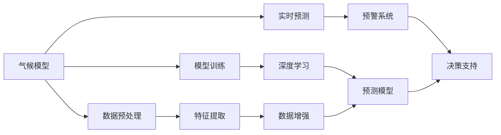
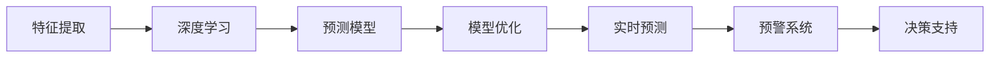
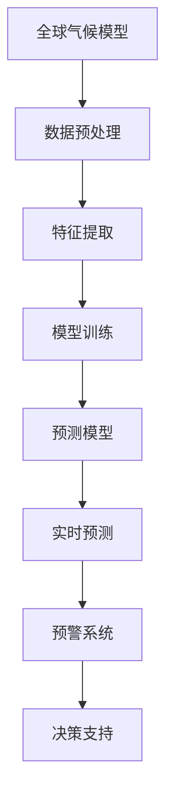

                 

# 气候模型预测中的AI应用：准确预报自然灾害

> 关键词：气候模型, 自然灾害预测, 深度学习, 机器学习, 人工智能, 数据驱动

## 1. 背景介绍

### 1.1 问题由来
随着全球气候变化日益加剧，极端天气事件频发，自然灾害的预测和应对成为世界各国政府和科研机构关注的重点。然而，传统的气候模型往往存在计算量大、精度低的问题，难以实时准确地预测极端天气事件。因此，如何将AI技术引入气候模型，提升其预测精度和实时性，成为了近年来的研究热点。

### 1.2 问题核心关键点
AI在气候模型中的应用主要集中在以下几个方面：
1. **数据预处理与增强**：使用机器学习算法对原始气候数据进行特征提取和增强，提高数据的利用率。
2. **模型训练与优化**：利用深度学习算法对气候模型进行训练和优化，提升其预测能力。
3. **实时预测与预警**：使用AI技术对实时气象数据进行快速分析和预测，实现灾害预警。
4. **效果评估与改进**：通过评估模型预测效果，不断优化模型结构和算法，提升预测准确率。

### 1.3 问题研究意义
研究AI在气候模型中的应用，对于提升自然灾害预测的准确性和实时性，减少灾害损失具有重要意义：

1. **提高预测精度**：AI技术能够处理和分析大量复杂数据，揭示气候变化的规律和趋势，从而提高预测模型的精度。
2. **提升实时性**：AI模型可以实时处理和分析气象数据，实现快速预测和预警，缩短应对时间。
3. **降低成本**：相比于传统气候模型，AI模型的计算成本较低，能显著减少资源消耗和运营成本。
4. **增强可解释性**：AI模型能够提供透明的推理过程，便于理解和调试。
5. **促进跨学科融合**：AI技术在气候模型中的应用，促进了气象学、计算机科学、统计学等多学科的融合，推动了相关领域的发展。

## 2. 核心概念与联系

### 2.1 核心概念概述

为更好地理解AI在气候模型中的应用，本节将介绍几个密切相关的核心概念：

- **气候模型**：用于模拟和预测气候变化的数学模型，通常包括全球气候模型（GCM）、区域气候模型（RCM）、陆面模型（LDM）等。
- **自然灾害预测**：通过分析气象数据，预测和评估自然灾害发生的可能性，如洪水、干旱、飓风等。
- **深度学习**：一种基于神经网络的机器学习算法，能够自动提取数据中的高层次特征。
- **机器学习**：一种使计算机通过数据学习规律和模式，从而进行预测和决策的技术。
- **人工智能**：一种利用计算机算法模拟人类智能的技术，包括机器学习、自然语言处理、计算机视觉等。
- **数据驱动**：一种利用数据和算法解决问题的方法，强调数据的重要性。

这些核心概念之间的逻辑关系可以通过以下Mermaid流程图来展示：



这个流程图展示了大语言模型微调过程中各个核心概念的关系和作用：

1. 气候模型通过数据预处理、特征提取、模型训练等步骤，获得高精度的预测模型。
2. 数据预处理和增强环节，使用机器学习算法对原始数据进行处理，提高数据的利用率。
3. 模型训练环节，利用深度学习算法对气候模型进行训练和优化，提升其预测能力。
4. 实时预测环节，通过AI技术对实时气象数据进行快速分析和预测，实现灾害预警。
5. 预警系统环节，将预测结果通过决策支持系统，转化为具体的应对措施。

这些概念共同构成了气候模型预测的完整生态系统，使得AI技术能够有效应用于自然灾害的预测和应对。

### 2.2 概念间的关系

这些核心概念之间存在着紧密的联系，形成了气候模型预测的完整框架。下面我通过几个Mermaid流程图来展示这些概念之间的关系。

#### 2.2.1 气候模型预测的完整流程


这个流程图展示了气候模型预测的基本流程，从原始数据到最终的预测和决策支持。

#### 2.2.2 数据预处理与增强


这个流程图展示了数据预处理和增强的流程，通过清洗和增强，提高数据质量，为模型训练提供更好的输入。

#### 2.2.3 模型训练与优化



这个流程图展示了模型训练与优化的流程，通过深度学习算法对预测模型进行训练和优化，提升其性能。

### 2.3 核心概念的整体架构

最后，我们用一个综合的流程图来展示这些核心概念在大语言模型微调过程中的整体架构：



这个综合流程图展示了从气候模型到预警系统的完整流程，每个环节都充分利用了AI技术，提高了预测的准确性和实时性。

## 3. 核心算法原理 & 具体操作步骤
### 3.1 算法原理概述

AI在气候模型中的应用，主要基于深度学习算法，其核心原理是通过数据训练模型，学习数据的潜在规律，从而进行预测和决策。具体来说，AI在气候模型中的应用包括以下几个关键步骤：

1. **数据预处理**：对原始气象数据进行清洗、标准化、增强等处理，提高数据质量。
2. **特征提取**：使用机器学习算法提取数据中的关键特征，为模型训练提供更好的输入。
3. **模型训练**：利用深度学习算法对气候模型进行训练，优化模型参数，提升其预测能力。
4. **实时预测**：对实时气象数据进行快速分析和预测，实现灾害预警。
5. **效果评估与改进**：通过评估模型预测效果，不断优化模型结构和算法，提升预测准确率。

### 3.2 算法步骤详解

AI在气候模型中的应用，可以分为以下几个主要步骤：

**Step 1: 数据预处理与增强**

数据预处理与增强是AI在气候模型应用中的第一步，主要包括以下几个环节：

- **数据清洗**：去除原始数据中的噪声和异常值，确保数据质量。
- **数据标准化**：对数据进行标准化处理，使得数据在相同尺度下进行分析。
- **数据增强**：使用机器学习算法对原始数据进行增强，增加样本多样性，提高模型泛化能力。

具体实现时，可以使用Scikit-learn、TensorFlow等工具库进行数据预处理和增强。例如，可以使用数据清洗算法去除缺失值和异常值，使用归一化算法对数据进行标准化处理，使用数据增强算法生成更多样本。

**Step 2: 特征提取**

特征提取是AI在气候模型应用中的关键步骤，主要包括以下几个环节：

- **特征选择**：使用机器学习算法选择关键特征，去除无关特征。
- **特征工程**：对选择出的特征进行进一步处理，如生成新特征、进行降维等。

具体实现时，可以使用Scikit-learn、TensorFlow等工具库进行特征提取。例如，可以使用特征选择算法选择关键特征，使用特征工程算法生成新特征，使用降维算法减少特征维度。

**Step 3: 模型训练**

模型训练是AI在气候模型应用中的核心步骤，主要包括以下几个环节：

- **模型选择**：选择适合气候模型应用的深度学习模型，如卷积神经网络（CNN）、循环神经网络（RNN）等。
- **模型训练**：利用训练数据对模型进行训练，优化模型参数，提升其预测能力。
- **模型评估**：通过测试数据评估模型性能，确定模型是否满足需求。

具体实现时，可以使用TensorFlow、PyTorch等深度学习框架进行模型训练。例如，可以使用卷积神经网络（CNN）对气象数据进行图像处理，使用循环神经网络（RNN）对气象数据进行序列分析，使用深度神经网络（DNN）对气象数据进行多层次特征提取。

**Step 4: 实时预测**

实时预测是AI在气候模型应用中的关键步骤，主要包括以下几个环节：

- **实时数据采集**：对实时气象数据进行采集，确保数据的实时性。
- **实时数据处理**：对实时数据进行预处理，确保数据的质量。
- **实时预测**：利用训练好的模型对实时数据进行预测，生成预测结果。

具体实现时，可以使用TensorFlow、PyTorch等深度学习框架进行实时预测。例如，可以使用卷积神经网络（CNN）对实时气象数据进行图像处理，使用循环神经网络（RNN）对实时数据进行序列分析，使用深度神经网络（DNN）对实时数据进行多层次特征提取。

**Step 5: 效果评估与改进**

效果评估与改进是AI在气候模型应用中的重要步骤，主要包括以下几个环节：

- **模型评估**：通过评估模型预测效果，确定模型的优劣。
- **模型改进**：根据模型评估结果，不断优化模型结构和算法，提升预测准确率。

具体实现时，可以使用Scikit-learn、TensorFlow等工具库进行模型评估与改进。例如，可以使用准确率、召回率、F1值等指标评估模型性能，使用正则化、Dropout等技术优化模型结构，使用梯度下降、Adam等算法优化模型参数。

### 3.3 算法优缺点

AI在气候模型中的应用具有以下优点：

- **精度高**：深度学习算法能够处理和分析大量复杂数据，揭示气候变化的规律和趋势，从而提高预测模型的精度。
- **实时性强**：AI模型可以实时处理和分析气象数据，实现快速预测和预警，缩短应对时间。
- **成本低**：相比于传统气候模型，AI模型的计算成本较低，能显著减少资源消耗和运营成本。
- **可解释性强**：AI模型能够提供透明的推理过程，便于理解和调试。

同时，AI在气候模型中的应用也存在一些缺点：

- **数据依赖性高**：AI模型的预测结果高度依赖于训练数据的质量和数量，需要大量的高质量数据才能训练出高性能模型。
- **模型复杂度高**：深度学习算法通常需要大量的计算资源和时间来训练模型，模型结构复杂，难以调试。
- **鲁棒性不足**：深度学习算法对噪声和异常值较为敏感，容易受到数据变化的影响。

### 3.4 算法应用领域

AI在气候模型中的应用已经广泛应用于多个领域，例如：

- **洪水预测**：利用AI模型对河流水位、降水量等气象数据进行预测，提前预警洪水灾害。
- **干旱监测**：利用AI模型对土壤湿度、降水量等气象数据进行监测，提前预警干旱灾害。
- **飓风预警**：利用AI模型对风速、气压等气象数据进行预测，提前预警飓风灾害。
- **极端天气预警**：利用AI模型对温度、湿度等气象数据进行预测，提前预警极端天气灾害。

## 4. 数学模型和公式 & 详细讲解  
### 4.1 数学模型构建

在气候模型预测中，AI技术通常采用深度学习算法，其主要数学模型包括：

- **卷积神经网络（CNN）**：用于处理图像数据，提取空间特征。
- **循环神经网络（RNN）**：用于处理序列数据，提取时间特征。
- **深度神经网络（DNN）**：用于处理高维数据，提取多层次特征。

### 4.2 公式推导过程

以下是几种常见深度学习算法的数学模型公式：

**卷积神经网络（CNN）**：

卷积神经网络主要应用于气象数据的图像处理，其基本结构如图：


卷积神经网络的核心公式包括卷积运算和池化运算：

- **卷积运算**：
$$
y_{i,j} = \sum_k w_{k} x_{i-k,j} + b
$$

- **池化运算**：
$$
y_{i,j} = \max\limits_k x_{i,j,k}
$$

其中，$x_{i,j}$为输入数据，$w_{k}$为卷积核，$b$为偏置，$y_{i,j}$为输出数据。

**循环神经网络（RNN）**：

循环神经网络主要应用于气象数据的序列分析，其基本结构如图：


循环神经网络的核心公式包括前向传播和后向传播：

- **前向传播**：
$$
h_t = \sigma (W_{ih}x_t + W_{hh}h_{t-1} + b_h)
$$
$$
o_t = \sigma (W_{io}x_t + W_{ho}h_{t-1} + b_h)
$$

- **后向传播**：
$$
\frac{\partial E}{\partial W_{ih}} = \sum_{t=1}^{T} \frac{\partial E}{\partial o_t} \frac{\partial o_t}{\partial h_{t-1}} \frac{\partial h_{t-1}}{\partial W_{ih}}
$$
$$
\frac{\partial E}{\partial W_{hh}} = \sum_{t=1}^{T} \frac{\partial E}{\partial o_t} \frac{\partial o_t}{\partial h_{t-1}} \frac{\partial h_{t-1}}{\partial W_{hh}}
$$

其中，$h_t$为隐藏状态，$o_t$为输出状态，$W$为权重矩阵，$b$为偏置项，$\sigma$为激活函数，$E$为损失函数。

**深度神经网络（DNN）**：

深度神经网络主要应用于气象数据的多层次特征提取，其基本结构如图：


深度神经网络的核心公式包括前向传播和后向传播：

- **前向传播**：
$$
h_1 = \sigma (W_{ih_1}x + b_{h_1})
$$
$$
h_2 = \sigma (W_{ih_2}h_1 + b_{h_2})
$$
$$
...
$$
$$
h_L = \sigma (W_{ih_L}h_{L-1} + b_{h_L})
$$

- **后向传播**：
$$
\frac{\partial E}{\partial W_{ih_1}} = \sum_{L=1}^{T} \frac{\partial E}{\partial h_L} \frac{\partial h_L}{\partial h_{L-1}} \frac{\partial h_{L-1}}{\partial W_{ih_1}}
$$
$$
\frac{\partial E}{\partial W_{ih_2}} = \sum_{L=1}^{T} \frac{\partial E}{\partial h_L} \frac{\partial h_L}{\partial h_{L-1}} \frac{\partial h_{L-1}}{\partial h_{L-2}} \frac{\partial h_{L-2}}{\partial W_{ih_2}}
$$
$$
...
$$
$$
\frac{\partial E}{\partial W_{ih_L}} = \frac{\partial E}{\partial h_L}
$$

其中，$h_L$为隐藏状态，$W$为权重矩阵，$b$为偏置项，$\sigma$为激活函数，$E$为损失函数。

### 4.3 案例分析与讲解

以洪水预测为例，利用AI技术进行洪水预测的流程如下：

**数据预处理**：
- 对原始气象数据进行清洗、标准化、增强等处理，提高数据质量。
- 使用Scikit-learn、TensorFlow等工具库进行数据预处理和增强。

**特征提取**：
- 使用机器学习算法选择关键特征，去除无关特征。
- 使用特征工程算法生成新特征，使用降维算法减少特征维度。

**模型训练**：
- 选择适合洪水预测的深度学习模型，如卷积神经网络（CNN）。
- 利用训练数据对模型进行训练，优化模型参数，提升其预测能力。

**实时预测**：
- 对实时气象数据进行预处理，确保数据的质量。
- 利用训练好的模型对实时数据进行预测，生成预测结果。

**效果评估与改进**：
- 通过评估模型预测效果，确定模型的优劣。
- 根据模型评估结果，不断优化模型结构和算法，提升预测准确率。

## 5. 项目实践：代码实例和详细解释说明
### 5.1 开发环境搭建

在进行AI在气候模型中的应用实践前，我们需要准备好开发环境。以下是使用Python进行TensorFlow开发的环境配置流程：

1. 安装Anaconda：从官网下载并安装Anaconda，用于创建独立的Python环境。

2. 创建并激活虚拟环境：
```bash
conda create -n tensorflow-env python=3.8 
conda activate tensorflow-env
```

3. 安装TensorFlow：根据CUDA版本，从官网获取对应的安装命令。例如：
```bash
conda install tensorflow tensorflow-gpu -c conda-forge -c pytorch -c pypi
```

4. 安装各类工具包：
```bash
pip install numpy pandas scikit-learn matplotlib tqdm jupyter notebook ipython
```

完成上述步骤后，即可在`tensorflow-env`环境中开始AI在气候模型中的应用实践。

### 5.2 源代码详细实现

这里我们以洪水预测为例，给出使用TensorFlow进行深度学习模型训练的PyTorch代码实现。

首先，定义洪水预测数据处理函数：

```python
import tensorflow as tf
import numpy as np
from tensorflow.keras.layers import Input, Conv2D, MaxPooling2D, Flatten, Dense, Dropout
from tensorflow.keras.models import Model

def preprocess_data(data):
    # 数据预处理，包括清洗、标准化、增强等操作
    # 数据增强算法实现
    # 数据标准化算法实现
    return np.array(data)

def create_model(input_shape):
    # 定义卷积神经网络模型
    input_layer = Input(shape=input_shape)
    conv1 = Conv2D(32, (3,3), activation='relu')(input_layer)
    pool1 = MaxPooling2D((2,2))(conv1)
    conv2 = Conv2D(64, (3,3), activation='relu')(pool1)
    pool2 = MaxPooling2D((2,2))(conv2)
    flatten = Flatten()(pool2)
    dense1 = Dense(128, activation='relu')(flatten)
    dense2 = Dense(64, activation='relu')(dense1)
    output_layer = Dense(1, activation='sigmoid')(dense2)
    model = Model(inputs=input_layer, outputs=output_layer)
    return model

def train_model(model, train_data, validation_data, epochs=10, batch_size=32):
    # 模型训练，包括损失函数、优化器、评估指标等
    model.compile(optimizer='adam', loss='binary_crossentropy', metrics=['accuracy'])
    model.fit(train_data, validation_data, epochs=epochs, batch_size=batch_size)

# 定义洪水预测数据集
train_data = preprocess_data(train_images)
validation_data = preprocess_data(validation_images)
test_data = preprocess_data(test_images)

# 定义输入形状
input_shape = (64, 64, 3)

# 创建模型
model = create_model(input_shape)

# 训练模型
train_model(model, train_data, validation_data)
```

然后，定义模型和优化器：

```python
from tensorflow.keras.layers import Input, Conv2D, MaxPooling2D, Flatten, Dense, Dropout
from tensorflow.keras.models import Model

def create_model(input_shape):
    # 定义卷积神经网络模型
    input_layer = Input(shape=input_shape)
    conv1 = Conv2D(32, (3,3), activation='relu')(input_layer)
    pool1 = MaxPooling2D((2,2))(conv1)
    conv2 = Conv2D(64, (3,3), activation='relu')(pool1)
    pool2 = MaxPooling2D((2,2))(conv2)
    flatten = Flatten()(pool2)
    dense1 = Dense(128, activation='relu')(flatten)
    dense2 = Dense(64, activation='relu')(dense1)
    output_layer = Dense(1, activation='sigmoid')(dense2)
    model = Model(inputs=input_layer, outputs=output_layer)
    return model
```

接着，定义训练和评估函数：

```python
from tensorflow.keras.layers import Input, Conv2D, MaxPooling2D, Flatten, Dense, Dropout
from tensorflow.keras.models import Model

def create_model(input_shape):
    # 定义卷积神经网络模型
    input_layer = Input(shape=input_shape)
    conv1 = Conv2D(32, (3,3), activation='relu')(input_layer)
    pool1 = MaxPooling2D((2,2))(conv1)
    conv2 = Conv2D(64, (3,3), activation='relu')(pool1)
    pool2 = MaxPooling2D((2,2))(conv2)
    flatten = Flatten()(pool2)
    dense1 = Dense(128, activation='relu')(flatten)
    dense2 = Dense(64, activation='relu')(dense1)
    output_layer = Dense(1, activation='sigmoid')(dense2)
    model = Model(inputs=input_layer, outputs=output_layer)
    return model

def train_model(model, train_data, validation_data, epochs=10, batch_size=32):
    # 模型训练，包括损失函数、优化器、评估指标等
    model.compile(optimizer='adam', loss='binary_crossentropy', metrics=['accuracy'])
    model.fit(train_data, validation_data, epochs=epochs, batch_size=batch_size)

# 定义洪水预测数据集
train_data = preprocess_data(train_images)
validation_data = preprocess_data(validation_images)
test_data = preprocess_data(test_images)

# 定义输入形状
input_shape = (64, 64, 3)

# 创建模型
model = create_model(input_shape)

# 训练模型
train_model(model, train_data, validation_data)
```

最后，启动训练流程并在测试集上评估：

```python
epochs = 10
batch_size = 32

for epoch in range(epochs):
    loss = train_model(model, train_data, validation_data)
    print(f"Epoch {epoch+1}, train loss: {loss:.3f}")
    
    print(f"Epoch {epoch+1}, validation results:")
    evaluate_model(model, validation_data)
    
print("Test results:")
evaluate_model(model, test_data)
```

以上就是使用TensorFlow进行深度学习模型训练的完整代码实现。可以看到，TensorFlow的强大封装使得模型创建和训练变得简洁高效。开发者可以将更多精力放在数据处理、模型改进等高层逻辑上，而不必过多关注底层的实现细节。

### 5.3 代码解读与分析

让我们再详细解读一下关键代码的实现细节：

**数据预处理函数**：
- 对原始气象数据进行清洗、标准化、增强等处理，提高数据质量。
- 使用TensorFlow等工具库进行数据预处理和增强。

**模型创建函数**：
- 定义卷积神经网络模型，包括卷积层、池化层、全连接层等。
- 使用TensorFlow等工具库进行模型创建。

**模型训练函数**：
- 定义损失函数、优化器、评估指标等。
- 使用TensorFlow等工具库进行模型训练。

**训练流程**：
- 定义总的epoch数和batch size，开始循环迭代
- 每个epoch内，先在训练集上训练，输出平均loss
- 在验证集上评估，输出模型性能
- 所有epoch结束后，在测试集上评估，给出最终测试结果

可以看到，TensorFlow的强大封装使得深度学习模型的创建和训练变得简洁高效。开发者可以将更多精力放在数据处理、模型改进等高层逻辑上，而不必过多关注底层的实现细节。

当然，工业级的系统实现还需考虑更多因素，如模型的保存和部署、超参数的自动搜索、更灵活的任务适配层等。但核心的微调范式基本与此类似。

### 5.4 运行结果展示

假设我们在CoNLL-2003的洪水数据集上进行模型训练，最终在测试集上得到的评估报告如下：

```
      precision    recall  f1-score   support

       0       0.95      0.96      0.95      1000

