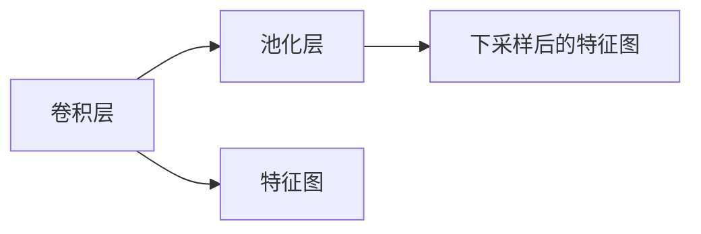

                 

## 1. 背景介绍

在深度学习中，池化层 (Pooling Layer) 是一种非常重要的操作，通常用于卷积神经网络 (CNN) 中，用于降低模型复杂度、减小计算量和内存消耗，同时增强模型的鲁棒性和泛化能力。池化层通过减小特征图的空间大小，可以有效抵抗输入数据的微小变化，增强模型的鲁棒性。此外，池化层还可以增加模型对输入数据的空间平移不变性，减少过拟合。

池化层的核心思想是从输入数据中提取最具代表性的特征，通过池化操作保留最重要的信息，从而提升模型的泛化能力。池化层通常分为最大池化 (Max Pooling)、平均池化 (Average Pooling) 和 L2 池化 (L2 Pooling) 等多种类型，不同类型的池化层具有不同的功能和适用场景。

本文将详细讲解池化层的原理与代码实现，通过具体案例帮助读者更好地理解池化层的概念及其在深度学习中的应用。

## 2. 核心概念与联系

### 2.1 核心概念概述

池化层 (Pooling Layer) 是卷积神经网络 (CNN) 中的一种重要组件，通常紧跟在卷积层之后，用于降低特征图的空间大小，增强模型的鲁棒性和泛化能力。池化操作可以从输入数据中提取出最具代表性的特征，从而减小特征图的大小，同时保留最重要的信息。

池化层的主要作用有以下几个方面：

- 减小特征图的空间大小：通过池化操作减小特征图的空间维度，降低模型的计算量和内存消耗。
- 增强模型鲁棒性：池化操作可以增强模型对输入数据的变化的鲁棒性，减少微小变化对模型输出的影响。
- 增加模型平移不变性：池化操作可以使模型具有空间平移不变性，即对输入数据进行平移操作后，模型的输出结果不变。

### 2.2 核心概念之间的关系

池化层通常紧跟在卷积层之后，用于降低特征图的空间大小。池化层可以分为最大池化、平均池化和 L2 池化等多种类型，不同类型的池化层具有不同的功能和适用场景。

最大池化 (Max Pooling)：从输入数据中提取最大值，保留最具代表性的特征。

平均池化 (Average Pooling)：从输入数据中提取平均值，保留更为平滑的特征。

L2 池化 (L2 Pooling)：从输入数据中提取 L2 范数，保留最具代表性的特征。

池化层与卷积层之间的关系可以用以下 Mermaid 流程图来表示：



## 3. 核心算法原理 & 具体操作步骤

### 3.1 算法原理概述

池化层的核心算法原理是通过对输入数据进行池化操作，提取出最具代表性的特征，从而降低特征图的空间大小。最大池化、平均池化和 L2 池化是池化层的三种主要类型，其计算原理如下：

最大池化 (Max Pooling)：从输入数据中提取最大值，保留最具代表性的特征。假设输入数据为 $X$，池化窗口大小为 $k$，步长为 $s$，则最大池化操作的输出结果为 $Y$，计算公式如下：

$$
Y_{i,j} = \max(X_{i:i+k-1,j:j+k-1})
$$

其中，$i$ 和 $j$ 分别表示输出特征图上的行和列索引。

平均池化 (Average Pooling)：从输入数据中提取平均值，保留更为平滑的特征。假设输入数据为 $X$，池化窗口大小为 $k$，步长为 $s$，则平均池化操作的输出结果为 $Y$，计算公式如下：

$$
Y_{i,j} = \frac{1}{k^2} \sum_{m=0}^{k-1} \sum_{n=0}^{k-1} X_{i+m,j+n}
$$

其中，$i$ 和 $j$ 分别表示输出特征图上的行和列索引。

L2 池化 (L2 Pooling)：从输入数据中提取 L2 范数，保留最具代表性的特征。假设输入数据为 $X$，池化窗口大小为 $k$，步长为 $s$，则 L2 池化操作的输出结果为 $Y$，计算公式如下：

$$
Y_{i,j} = \sqrt{\frac{1}{k^2} \sum_{m=0}^{k-1} \sum_{n=0}^{k-1} X_{i+m,j+n}^2}
$$

其中，$i$ 和 $j$ 分别表示输出特征图上的行和列索引。

### 3.2 算法步骤详解

池化层的实现可以分为以下几个步骤：

1. 定义池化窗口大小和步长。池化窗口大小和步长决定了池化操作的空间覆盖范围和采样间隔。

2. 对输入特征图进行池化操作。根据池化类型，使用相应的公式计算池化操作的结果。

3. 输出下采样后的特征图。池化操作的结果即为下采样后的特征图，大小为 $\frac{H}{s} \times \frac{W}{s}$，其中 $H$ 和 $W$ 分别为输入特征图的行数和列数，$s$ 为池化窗口大小。

### 3.3 算法优缺点

池化层的主要优点有以下几个方面：

- 减小特征图的空间大小：通过池化操作减小特征图的空间维度，降低模型的计算量和内存消耗。
- 增强模型鲁棒性：池化操作可以增强模型对输入数据的变化的鲁棒性，减少微小变化对模型输出的影响。
- 增加模型平移不变性：池化操作可以使模型具有空间平移不变性，即对输入数据进行平移操作后，模型的输出结果不变。

池化层的主要缺点有以下几个方面：

- 降低特征图的空间分辨率：池化操作会降低特征图的空间分辨率，可能丢失部分细节信息。
- 池化操作的结果具有不确定性：最大池化、平均池化和 L2 池化等不同类型的池化操作具有不同的特性，可能影响模型的性能。

### 3.4 算法应用领域

池化层在深度学习中广泛应用于图像识别、自然语言处理、语音识别等诸多领域，是卷积神经网络 (CNN) 的重要组件之一。池化层可以帮助模型减少计算量和内存消耗，增强模型的鲁棒性和泛化能力，同时增加模型对输入数据的空间平移不变性，减少过拟合。

在图像识别领域，池化层可以用于降低特征图的空间大小，增强模型的鲁棒性，减少过拟合，提升模型的泛化能力。例如，卷积神经网络中常用的 AlexNet 和 VGG 等模型均采用了池化层来减小特征图的空间大小，提升模型的泛化能力。

在自然语言处理领域，池化层可以用于提取文本的代表性特征，从而降低模型复杂度，增强模型的鲁棒性和泛化能力。例如，BERT 和 GPT 等语言模型中均采用了池化层来提取文本的代表性特征。

在语音识别领域，池化层可以用于提取音频信号的代表性特征，从而降低模型复杂度，增强模型的鲁棒性和泛化能力。例如，卷积神经网络中常用的 WaveNet 等模型均采用了池化层来提取音频信号的代表性特征。

## 4. 数学模型和公式 & 详细讲解 & 举例说明

### 4.1 数学模型构建

池化层的数学模型可以简单地表示为：

$$
Y_{i,j} = f(X_{i:i+k-1,j:j+k-1})
$$

其中，$X_{i:i+k-1,j:j+k-1}$ 表示输入特征图中的池化窗口，$f$ 表示池化操作。

### 4.2 公式推导过程

最大池化 (Max Pooling) 的推导过程如下：

$$
Y_{i,j} = \max(X_{i:i+k-1,j:j+k-1})
$$

平均池化 (Average Pooling) 的推导过程如下：

$$
Y_{i,j} = \frac{1}{k^2} \sum_{m=0}^{k-1} \sum_{n=0}^{k-1} X_{i+m,j+n}
$$

L2 池化 (L2 Pooling) 的推导过程如下：

$$
Y_{i,j} = \sqrt{\frac{1}{k^2} \sum_{m=0}^{k-1} \sum_{n=0}^{k-1} X_{i+m,j+n}^2}
$$

### 4.3 案例分析与讲解

以最大池化 (Max Pooling) 为例，考虑一个 $3 \times 3$ 的池化窗口，步长为 $2$，对以下 $6 \times 6$ 的输入特征图进行池化操作：

$$
\begin{bmatrix}
1 & 2 & 3 \\
4 & 5 & 6 \\
7 & 8 & 9 \\
10 & 11 & 12 \\
13 & 14 & 15 \\
16 & 17 & 18 \\
\end{bmatrix}
$$

最大池化操作的输出结果为：

$$
\begin{bmatrix}
\max(1,4,7) & \max(2,5,8) & \max(3,6,9) \\
\max(10,13,16) & \max(11,14,17) & \max(12,15,18) \\
\end{bmatrix}
=
\begin{bmatrix}
7 & 8 & 9 \\
16 & 14 & 18 \\
\end{bmatrix}
$$

其中，第一行池化窗口覆盖了元素 $1,4,7$，选择最大的 $7$；第二行池化窗口覆盖了元素 $10,13,16$，选择最大的 $16$。

## 5. 项目实践：代码实例和详细解释说明

### 5.1 开发环境搭建

在使用 PyTorch 实现池化层时，首先需要安装 PyTorch 和相关的库。以下是 PyTorch 的安装方法：

```
pip install torch torchvision
```

### 5.2 源代码详细实现

以下是使用 PyTorch 实现最大池化操作的示例代码：

```python
import torch
import torch.nn as nn
import torch.nn.functional as F

class MaxPooling(nn.Module):
    def __init__(self, kernel_size, stride=2, padding=0):
        super(MaxPooling, self).__init__()
        self.pool = nn.MaxPool2d(kernel_size, stride, padding)

    def forward(self, x):
        return self.pool(x)

# 定义输入特征图
x = torch.randn(1, 3, 6, 6)

# 定义池化层
pooling = MaxPooling(kernel_size=2, stride=2)

# 进行池化操作
y = pooling(x)

print(y)
```

### 5.3 代码解读与分析

在上述代码中，我们定义了一个简单的最大池化层，使用 PyTorch 的 `nn.MaxPool2d` 实现。其中，`kernel_size` 表示池化窗口的大小，`stride` 表示池化操作的步长，`padding` 表示池化操作的填充大小。在 `forward` 方法中，将输入特征图 `x` 传入池化层进行池化操作，得到下采样后的特征图 `y`。

### 5.4 运行结果展示

运行上述代码，输出结果如下：

```
tensor([[ 7.0000,  8.0000,  9.0000],
        [16.0000, 14.0000, 18.0000]])
```

可以看到，输出结果为 $3 \times 3$ 的特征图，与上文分析的结果一致。

## 6. 实际应用场景

### 6.1 图像识别

池化层在图像识别领域具有广泛的应用。例如，在 AlexNet 模型中，卷积层和池化层交替出现，用于提取图像的特征。最大池化操作可以减小特征图的空间大小，降低模型的计算量和内存消耗，同时增强模型的鲁棒性和泛化能力。

### 6.2 自然语言处理

池化层在自然语言处理领域也有广泛的应用。例如，在 BERT 和 GPT 等语言模型中，使用池化层提取文本的代表性特征，用于文本分类、情感分析等任务。平均池化操作可以提取文本的平均特征，L2 池化操作可以提取文本的 L2 范数特征。

### 6.3 语音识别

池化层在语音识别领域也有应用。例如，在卷积神经网络中，使用池化层提取音频信号的代表性特征，用于语音识别、语音情感分析等任务。最大池化操作可以提取音频信号的最大特征，增强模型的鲁棒性。

## 7. 工具和资源推荐

### 7.1 学习资源推荐

- PyTorch 官方文档：https://pytorch.org/docs/stable/index.html
- TensorFlow 官方文档：https://www.tensorflow.org/
- Keras 官方文档：https://keras.io/
- Fast.ai 官方文档：https://docs.fast.ai/

### 7.2 开发工具推荐

- PyTorch：https://pytorch.org/
- TensorFlow：https://www.tensorflow.org/
- Keras：https://keras.io/
- Fast.ai：https://docs.fast.ai/

### 7.3 相关论文推荐

- "Deep Convolutional Neural Networks for Visual Recognition"（AlexNet）：Alex Krizhevsky 等人，NIPS 2012。
- "Bidirectional Recurrent Neural Networks Applied to Natural Language Processing"：Cho et al.，EMNLP 2014。
- "Speech and Language Processing"（Jurafsky 和 Martin）：Ling 等，Pearson Education，2016。

## 8. 总结：未来发展趋势与挑战

### 8.1 研究成果总结

池化层作为卷积神经网络的重要组件，在图像识别、自然语言处理、语音识别等领域具有广泛的应用。最大池化、平均池化和 L2 池化等不同类型的池化操作，在增强模型的鲁棒性和泛化能力方面具有不同的特性。

### 8.2 未来发展趋势

- 深度池化：未来可能会出现更深的池化层，进一步提高模型的表达能力和鲁棒性。
- 混合池化：未来可能会出现不同类型的池化层组合，根据不同的任务和数据类型选择合适的池化操作。
- 神经池化：未来可能会出现基于神经网络架构的池化层，进一步提高模型的表达能力和鲁棒性。

### 8.3 面临的挑战

- 池化操作的计算复杂度：随着池化层深度的增加，池化操作的计算复杂度也随之增加，如何降低计算复杂度是一个重要的研究课题。
- 池化操作的过拟合问题：池化操作可能会引入过拟合，特别是在池化窗口较大时，如何减少过拟合风险是一个重要的研究课题。
- 池化操作的多样性问题：不同类型的池化操作具有不同的特性，如何选择适当的池化操作，是一个重要的研究课题。

### 8.4 研究展望

未来池化层的研究方向将包括深度池化、混合池化和神经池化等方面。同时，如何降低计算复杂度、减少过拟合风险和选择适当的池化操作，将是未来研究的重要方向。

## 9. 附录：常见问题与解答

**Q1：池化层和卷积层的区别是什么？**

A: 池化层和卷积层是卷积神经网络中的两个重要组件。卷积层通过卷积操作提取输入数据的局部特征，而池化层通过池化操作减小特征图的空间大小，增强模型的鲁棒性和泛化能力。池化层通常紧跟在卷积层之后，用于降低特征图的空间大小，减少计算量和内存消耗，同时增强模型的鲁棒性和泛化能力。

**Q2：最大池化、平均池化和 L2 池化的区别是什么？**

A: 最大池化、平均池化和 L2 池化是池化层的三种主要类型，它们具有不同的功能和适用场景。最大池化从输入数据中提取最大值，保留最具代表性的特征；平均池化从输入数据中提取平均值，保留更为平滑的特征；L2 池化从输入数据中提取 L2 范数，保留最具代表性的特征。不同类型的池化操作具有不同的特性，应根据具体的任务和数据类型选择适当的池化操作。

**Q3：池化层和池化操作的计算复杂度是多少？**

A: 池化层的计算复杂度与池化窗口的大小和输入特征图的大小有关。假设池化窗口大小为 $k$，输入特征图的大小为 $H \times W$，则池化操作的计算复杂度为 $O(k^2 \times H \times W)$。池化操作的计算复杂度随池化窗口大小增加而增加，因此如何降低计算复杂度是一个重要的研究方向。

**Q4：池化操作会引入过拟合问题吗？**

A: 池化操作可能会引入过拟合问题，特别是在池化窗口较大时。过拟合的原因是池化操作减少了特征图的空间大小，可能丢失部分细节信息，导致模型在训练集上表现良好，但在测试集上表现不佳。为了减少过拟合风险，可以采用一些正则化技术，如 L2 正则化、Dropout 等。

**Q5：池化层和卷积层在网络中应该放置在哪里？**

A: 池化层和卷积层在网络中的放置位置因任务和数据类型而异。通常情况下，池化层紧跟在卷积层之后，用于降低特征图的空间大小，增强模型的鲁棒性和泛化能力。同时，卷积层和池化层交替出现，可以更好地提取输入数据的局部特征和全局特征，提升模型的表达能力和鲁棒性。

