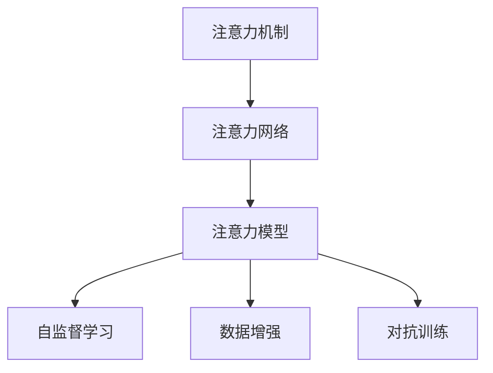
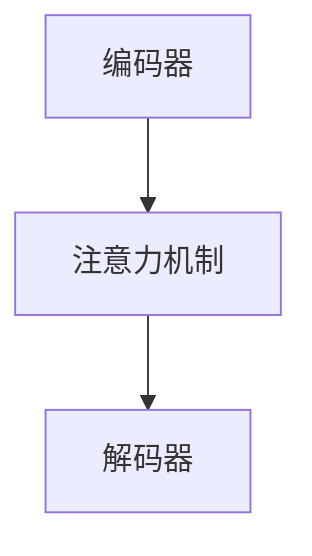
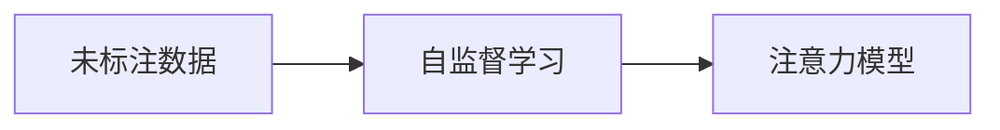
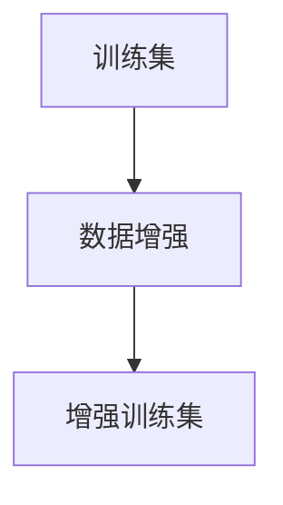
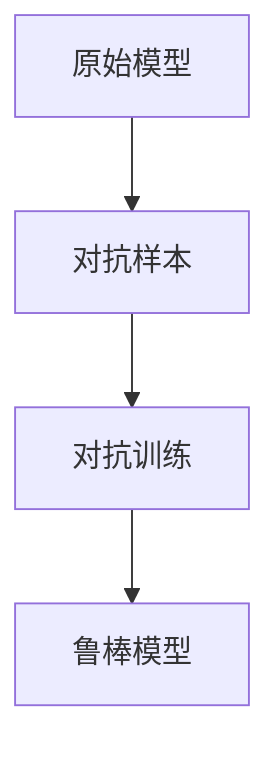
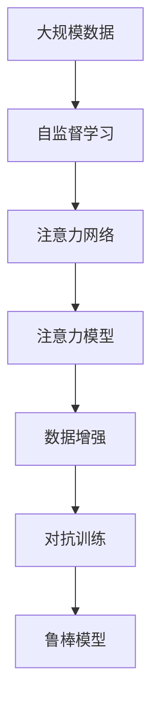

                 

# 注意力的深度学习：AI优化的专注力

> 关键词：注意力机制, 深度学习, AI专注力, 注意力网络, 注意力模型, 自监督学习, 数据增强, 对抗训练

## 1. 背景介绍

### 1.1 问题由来
深度学习技术自21世纪初兴起以来，已广泛应用于图像识别、自然语言处理、语音识别等多个领域。然而，传统的深度学习模型常常面临"只见树木，不见森林"的问题，即在复杂场景下难以捕捉全局关联信息。这一现象在自然语言处理（NLP）领域尤为明显，由于文本数据往往冗长且信息密集，传统的序列模型难以捕获文本中的长距离依赖关系。

为了解决这一问题，研究者们提出了注意力机制（Attention Mechanism）。注意力机制通过模拟人类注意力系统的工作原理，允许模型在输入序列中动态选择关键信息，从而在处理文本、图像、语音等多种数据时都能获得更好的性能。

### 1.2 问题核心关键点
注意力机制的本质是通过学习输入数据中的相关性关系，动态地加权聚合不同位置的特征。这与人类注意力系统的工作原理高度相似，即在面对复杂环境时，通过聚焦于关键信息源，以减少认知负荷，提高决策效率。

注意力机制的核心思想是，在输入序列中对每个位置进行加权，加权系数反映了当前位置信息的重要程度。这一过程可以通过计算注意力矩阵来实现，其中每一行表示对每个位置的注意力权重，每一列表示对应位置的信息权重。最终的输出是将输入序列中各个位置的信息，按加权系数进行加权求和，得到一个新的表示向量。

注意力机制的优点包括：
- 动态选择关键信息：在处理复杂输入时，能够自动选择并聚焦关键特征，减少冗余信息，提升模型效率。
- 增强特征表达：通过自适应地调整加权系数，注意力机制可以更好地捕捉输入序列中的局部和全局依赖关系，增强特征表达能力。
- 泛化性强：在多任务和多领域中，注意力机制具有较强的泛化能力，能够适应不同类型的数据。

然而，注意力机制也有一些局限性：
- 计算复杂度高：注意力机制需要计算注意力矩阵，涉及矩阵乘法和softmax运算，计算量较大。
- 模型复杂度高：引入注意力机制后，模型的结构变得更加复杂，训练和推理的计算资源消耗更大。
- 易过拟合：注意力机制依赖输入数据的分布，当数据分布变化时，模型容易过拟合。

尽管存在这些局限性，注意力机制在实际应用中已经取得了广泛的应用，例如在机器翻译、文本摘要、图像识别、语音识别等任务中，均展现了强大的性能。

### 1.3 问题研究意义
研究注意力机制在深度学习中的应用，对于提升深度学习模型的性能、拓展深度学习模型的应用范围、加速人工智能技术的产业化进程具有重要意义：

1. 提升模型性能。注意力机制能够更好地捕捉输入数据的局部和全局依赖关系，增强特征表达能力，提升模型在复杂场景下的表现。
2. 拓展模型应用。注意力机制在自然语言处理、计算机视觉、语音识别等多个领域都有应用，可以提升相关任务的性能。
3. 降低计算资源消耗。注意力机制可以在模型中引入多层次的特征聚合机制，减少单一特征向量的维度，从而降低计算资源的消耗。
4. 增强模型泛化能力。通过自适应地调整注意力权重，模型可以更好地适应数据分布的变化，提高模型的泛化性能。
5. 加速应用开发。注意力机制可以显著提升模型的推理速度，减少训练时间，加速模型的部署和应用。

## 2. 核心概念与联系

### 2.1 核心概念概述

为更好地理解注意力机制在大规模深度学习中的应用，本节将介绍几个密切相关的核心概念：

- 注意力机制（Attention Mechanism）：一种用于处理序列数据的技术，通过动态加权聚合不同位置的信息，模拟人类注意力的工作原理。
- 注意力网络（Attention Network）：包含注意力机制的神经网络结构，通过多层次的注意力聚合，提升特征表达能力。
- 注意力模型（Attention Model）：一种使用注意力机制的深度学习模型，可以应用于多种NLP和计算机视觉任务。
- 自监督学习（Self-Supervised Learning）：一种无监督学习方法，通过在未标注数据上学习模型参数，提升模型的泛化能力。
- 数据增强（Data Augmentation）：一种增强训练集多样性的技术，通过随机变换数据，防止模型过拟合。
- 对抗训练（Adversarial Training）：一种提高模型鲁棒性的方法，通过引入对抗样本，增强模型对噪声的抵抗能力。

这些核心概念之间的逻辑关系可以通过以下Mermaid流程图来展示：



这个流程图展示了注意力机制的应用流程：首先通过注意力网络实现注意力机制，然后构建基于注意力机制的深度学习模型，在模型训练过程中使用自监督学习、数据增强和对抗训练等技术来提升模型性能。

### 2.2 概念间的关系

这些核心概念之间存在着紧密的联系，形成了深度学习中注意力机制的整体框架。下面我通过几个Mermaid流程图来展示这些概念之间的关系。

#### 2.2.1 注意力机制的工作原理


这个流程图展示了注意力机制的工作流程：输入序列首先经过计算注意力权重，得到每一位置的注意力系数，然后将输入序列中的每个位置按注意力系数加权求和，得到最终的输出表示。

#### 2.2.2 注意力网络的架构



这个流程图展示了注意力网络的架构：编码器将输入序列转换为中间表示，通过注意力机制对中间表示进行加权聚合，最终由解码器输出结果。

#### 2.2.3 自监督学习的应用



这个流程图展示了自监督学习在注意力模型中的应用：通过在未标注数据上学习模型参数，可以提升模型在处理各种输入数据时的泛化能力。

#### 2.2.4 数据增强的技术



这个流程图展示了数据增强技术的应用：通过对训练集进行随机变换，可以提高模型的泛化能力，防止过拟合。

#### 2.2.5 对抗训练的流程



这个流程图展示了对抗训练的流程：通过引入对抗样本，训练模型对噪声的抵抗能力，从而提升模型的鲁棒性。

### 2.3 核心概念的整体架构

最后，我们用一个综合的流程图来展示这些核心概念在大规模深度学习中的整体架构：



这个综合流程图展示了从数据预处理到模型训练的完整过程：通过自监督学习获取大规模未标注数据，构建基于注意力网络的深度学习模型，并在模型训练过程中使用数据增强和对抗训练等技术，最终得到鲁棒性强的模型。

## 3. 核心算法原理 & 具体操作步骤
### 3.1 算法原理概述

注意力机制在深度学习中的应用，主要是通过引入注意力矩阵（Attention Matrix）来实现的。注意力矩阵是一个二维矩阵，其中每一行表示对每个位置的注意力权重，每一列表示对应位置的信息权重。最终的输出是将输入序列中各个位置的信息，按加权系数进行加权求和，得到一个新的表示向量。

设输入序列为 $X = (x_1, x_2, ..., x_T)$，其中 $x_t$ 表示第 $t$ 个位置的信息。注意力矩阵可以表示为 $A \in \mathbb{R}^{T \times T}$，其中 $A_{i,j}$ 表示位置 $i$ 对位置 $j$ 的注意力权重。注意力机制的输出可以表示为：

$$
\text{Output} = \sum_{t=1}^T A_{i,t} x_t
$$

其中 $A_{i,t}$ 表示位置 $i$ 对位置 $t$ 的注意力权重，$x_t$ 表示位置 $t$ 的信息，$\sum_{t=1}^T A_{i,t}$ 表示对所有位置进行加权求和。

### 3.2 算法步骤详解

基于注意力机制的深度学习模型一般包括以下几个关键步骤：

**Step 1: 准备输入数据**
- 收集并预处理输入数据，包括分词、词向量表示、序列填充等。

**Step 2: 初始化模型参数**
- 选择或训练一个合适的深度学习模型，如Transformer、RNN等，并初始化模型参数。

**Step 3: 计算注意力权重**
- 根据模型结构和输入数据，计算注意力矩阵。

**Step 4: 加权聚合信息**
- 对每个位置的信息按注意力权重进行加权求和，得到新的表示向量。

**Step 5: 输出结果**
- 将新的表示向量作为模型输出，用于分类、生成、推理等任务。

**Step 6: 模型评估**
- 在测试集上评估模型性能，对比微调前后模型的提升效果。

**Step 7: 模型部署**
- 将微调后的模型集成到实际应用系统中，进行实时推理预测。

### 3.3 算法优缺点

注意力机制在大规模深度学习中的应用，具有以下优点：
- 增强特征表达：通过自适应地调整加权系数，注意力机制可以更好地捕捉输入序列中的局部和全局依赖关系，增强特征表达能力。
- 提高模型泛化能力：通过在未标注数据上学习模型参数，可以提升模型在处理各种输入数据时的泛化能力。
- 适应性强：注意力机制在多任务和多领域中都有应用，可以适应不同类型的数据。

然而，注意力机制也有一些局限性：
- 计算复杂度高：注意力机制需要计算注意力矩阵，涉及矩阵乘法和softmax运算，计算量较大。
- 模型复杂度高：引入注意力机制后，模型的结构变得更加复杂，训练和推理的计算资源消耗更大。
- 易过拟合：注意力机制依赖输入数据的分布，当数据分布变化时，模型容易过拟合。

### 3.4 算法应用领域

注意力机制在深度学习中的应用领域非常广泛，涵盖自然语言处理、计算机视觉、语音识别等多个领域。

在自然语言处理领域，注意力机制被广泛用于机器翻译、文本摘要、问答系统等任务，通过在模型中引入多层次的注意力聚合机制，可以显著提升模型的性能。例如，在机器翻译任务中，注意力机制能够帮助模型在翻译过程中动态选择关键信息，提高翻译质量。

在计算机视觉领域，注意力机制被用于图像分类、目标检测、图像生成等任务，通过在卷积神经网络（CNN）中引入多层次的注意力机制，可以增强模型对输入数据的表达能力和泛化能力。例如，在目标检测任务中，注意力机制能够帮助模型在输入图像中动态选择关键区域，提高检测精度。

在语音识别领域，注意力机制被用于语音转写、语音合成等任务，通过在循环神经网络（RNN）中引入注意力机制，可以增强模型对语音信号的表达能力和泛化能力。例如，在语音转写任务中，注意力机制能够帮助模型在输入语音信号中动态选择关键特征，提高转写准确率。

## 4. 数学模型和公式 & 详细讲解  
### 4.1 数学模型构建

设输入序列为 $X = (x_1, x_2, ..., x_T)$，其中 $x_t$ 表示第 $t$ 个位置的信息，$x_t$ 可以是词向量、图像像素、音频特征等。

假设模型包含 $N$ 个注意力头（Attention Head），每个头可以独立计算注意力权重和信息加权聚合。注意力头 $k$ 的注意力矩阵可以表示为 $A_k \in \mathbb{R}^{T \times T}$，其中 $A_{i,j}^k$ 表示位置 $i$ 对位置 $j$ 的注意力权重。注意力头 $k$ 的输出可以表示为：

$$
\text{Output}_k = \sum_{t=1}^T A_{i,t}^k x_t
$$

其中 $A_{i,t}^k$ 表示位置 $i$ 对位置 $t$ 的注意力权重，$x_t$ 表示位置 $t$ 的信息，$\sum_{t=1}^T A_{i,t}^k$ 表示对所有位置进行加权求和。

### 4.2 公式推导过程

设输入序列的词向量表示为 $Q = (q_1, q_2, ..., q_T)$，其中 $q_t$ 表示第 $t$ 个位置的信息，可以是一个词向量、图像像素、音频特征等。

假设模型包含 $N$ 个注意力头（Attention Head），每个头可以独立计算注意力权重和信息加权聚合。注意力头 $k$ 的注意力权重可以表示为：

$$
A_{i,j}^k = \text{softmax}\left(\frac{Q_i K_j}{\sqrt{d_k}}\right)
$$

其中 $K$ 表示查询向量，$Q$ 表示键向量，$d_k$ 表示注意力头的维度。

注意力头 $k$ 的输出可以表示为：

$$
\text{Output}_k = \sum_{t=1}^T A_{i,t}^k x_t
$$

其中 $A_{i,t}^k$ 表示位置 $i$ 对位置 $t$ 的注意力权重，$x_t$ 表示位置 $t$ 的信息，$\sum_{t=1}^T A_{i,t}^k$ 表示对所有位置进行加权求和。

### 4.3 案例分析与讲解

以机器翻译任务为例，设输入序列为源语言文本，输出序列为目标语言文本。假设输入序列的词向量表示为 $Q$，输出序列的词向量表示为 $K$，目标语言文本的词向量表示为 $x$。

注意力头 $k$ 的注意力权重可以表示为：

$$
A_{i,j}^k = \text{softmax}\left(\frac{Q_i K_j}{\sqrt{d_k}}\right)
$$

其中 $Q_i$ 表示第 $i$ 个位置的信息，$K_j$ 表示第 $j$ 个位置的信息，$d_k$ 表示注意力头的维度。

注意力头 $k$ 的输出可以表示为：

$$
\text{Output}_k = \sum_{t=1}^T A_{i,t}^k x_t
$$

其中 $A_{i,t}^k$ 表示位置 $i$ 对位置 $t$ 的注意力权重，$x_t$ 表示位置 $t$ 的信息，$\sum_{t=1}^T A_{i,t}^k$ 表示对所有位置进行加权求和。

通过引入注意力机制，模型可以动态地选择源语言文本中的关键信息，并将其与目标语言文本的输出信息进行加权聚合，从而提升翻译质量。

## 5. 项目实践：代码实例和详细解释说明
### 5.1 开发环境搭建

在进行注意力机制的深度学习实践前，我们需要准备好开发环境。以下是使用Python进行TensorFlow开发的Python环境配置流程：

1. 安装Anaconda：从官网下载并安装Anaconda，用于创建独立的Python环境。

2. 创建并激活虚拟环境：
```bash
conda create -n tf-env python=3.8 
conda activate tf-env
```

3. 安装TensorFlow：根据CUDA版本，从官网获取对应的安装命令。例如：
```bash
conda install tensorflow -c conda-forge -c pypi
```

4. 安装各类工具包：
```bash
pip install numpy pandas scikit-learn matplotlib tqdm jupyter notebook ipython
```

完成上述步骤后，即可在`tf-env`环境中开始注意力机制的深度学习实践。

### 5.2 源代码详细实现

下面我们以注意力机制在机器翻译任务中的应用为例，给出使用TensorFlow对Transformer模型进行注意力机制的实现。

首先，定义Transformer模型：

```python
import tensorflow as tf
from tensorflow.keras.layers import Layer

class TransformerBlock(tf.keras.layers.Layer):
    def __init__(self, embed_dim, num_heads, ffn_units, rate=0.1, activation='relu'):
        super(TransformerBlock, self).__init__()
        self.num_heads = num_heads
        self.embed_dim = embed_dim
        
        self.W1 = tf.keras.layers.Dense(embed_dim)
        self.W2 = tf.keras.layers.Dense(ffn_units)
        self.v = tf.keras.layers.Dense(1)
        self.dense = tf.keras.layers.Dense(embed_dim)
        self.dropout = tf.keras.layers.Dropout(rate)
        self.activation = tf.keras.layers.Activation(activation)
        
    def call(self, inputs, training=False):
        attn_weights = self._attention(inputs, inputs)
        x = self._dense(x, self.W2)
        x = self.activation(x)
        x = self.dense(x)
        
        x = self.dropout(x, training=training)
        return x + inputs
    
    def _attention(self, inputs, query=None):
        if query is None:
            query = inputs
        q = self.W1(inputs)
        q = tf.transpose(q, perm=[0, 2, 1])
        k = self.W1(inputs)
        v = self.W1(inputs)
        
        attn_weights = tf.matmul(q, k, transpose_b=True)
        attn_weights = self.v(attn_weights)
        attn_weights = tf.nn.softmax(attn_weights, axis=-1)
        attn_weights = tf.matmul(attn_weights, v)
        
        attn_weights = tf.transpose(attn_weights, perm=[0, 2, 1])
        return attn_weights
```

然后，定义注意力机制的实现：

```python
class Attention(tf.keras.layers.Layer):
    def __init__(self, embed_dim, num_heads, dropout_rate=0.1):
        super(Attention, self).__init__()
        self.embed_dim = embed_dim
        self.num_heads = num_heads
        self.dropout_rate = dropout_rate
        
        self.Wq = tf.keras.layers.Dense(embed_dim)
        self.Wk = tf.keras.layers.Dense(embed_dim)
        self.Wv = tf.keras.layers.Dense(embed_dim)
        self.dense = tf.keras.layers.Dense(embed_dim)
        self.dropout = tf.keras.layers.Dropout(dropout_rate)
        
    def call(self, inputs):
        q = self.Wq(inputs)
        q = tf.reshape(q, (q.shape[0], q.shape[1], self.num_heads, q.shape[2] // self.num_heads))
        q = tf.transpose(q, perm=[0, 2, 1, 3])
        q = tf.reshape(q, (q.shape[0], q.shape[1], self.num_heads * q.shape[2] // self.num_heads))
        
        k = self.Wk(inputs)
        k = tf.reshape(k, (k.shape[0], k.shape[1], self.num_heads, k.shape[2] // self.num_heads))
        k = tf.transpose(k, perm=[0, 2, 1, 3])
        k = tf.reshape(k, (k.shape[0], k.shape[1], self.num_heads * k.shape[2] // self.num_heads))
        
        v = self.Wv(inputs)
        v = tf.reshape(v, (v.shape[0], v.shape[1], self.num_heads, v.shape[2] // self.num_heads))
        v = tf.transpose(v, perm=[0, 2, 1, 3])
        v = tf.reshape(v, (v.shape[0], v.shape[1], self.num_heads * v.shape[2] // self.num_heads))
        
        attn_weights = tf.matmul(q, k, transpose_b=True)
        attn_weights = tf.nn.softmax(attn_weights, axis=-1)
        attn_weights = tf.matmul(attn_weights, v)
        attn_weights = tf.reshape(attn_weights, (attn_weights.shape[0], attn_weights.shape[1], self.num_heads * attn_weights.shape[2] // self.num_heads))
        attn_weights = tf.transpose(attn_weights, perm=[0, 2, 1])
        attn_weights = self.dropout(attn_weights)
        attn_weights = tf.reshape(attn_weights, (attn_weights.shape[0], attn_weights.shape[1], self.embed_dim))
        return attn_weights
```

最后，构建Transformer模型：

```python
class Transformer(tf.keras.layers.Layer):
    def __init__(self, num_layers, d_model, num_heads, dff, input_vocab_size, target_vocab_size, pe_input, pe_target, rate=0.1):
        super(Transformer, self).__init__()
        
        self.d_model = d_model
        self.num_layers = num_layers
        
        self.embedding = tf.keras.layers.Embedding(input_vocab_size, d_model)
        self.pos_encoding_input = positional_encoding(pe_input, self.d_model)
        self.pos_encoding_target = positional_encoding(pe_target, self.d_model)
        
        self.enc_layers = [TransformerBlock(d_model, num_heads, dff, rate=rate) for _ in range(num_layers)]
        self.dec_layers = [TransformerBlock(d_model, num_heads, dff, rate=rate) for _ in range(num_layers)]
        
        self.dropout = tf.keras.layers.Dropout(rate)
        
        self.final_layer = tf.keras.layers.Dense(target_vocab_size)
        self.final_layer.add(tf.keras.layers.LayerNormalization())
        
    def call(self, inputs, targets):
        seq_len = tf.shape(inputs)[1]
        positions = tf.range(seq_len)
        positions = tf.expand_dims(positions, 0)
        positions = tf.expand_dims(positions, -1)
        positions = tf.tile(positions, [1, tf.shape(targets)[0], 1])
        
        enc_padding_mask = self.create_padding_mask(inputs)
        dec_padding_mask = self.create_padding_mask(targets)
        
        enc_input = inputs + self.pos_encoding_input
        dec_input = targets + self.pos_encoding_target
        
        enc_output = enc_input
        dec_output = dec_input
        
        for layer in self.enc_layers:
            attn_weights = layer.encoder(enc_output)
            enc_output = layer(enc_output, training=False)
        
        for layer in self.dec_layers:
            attn_weights = layer.decoder(dec_output, enc_output)
            dec_output = layer(dec_output, training=False)
        
        dec_output = self.final_layer(dec_output)
        return dec_output
    
    def create_padding_mask(self, seq):
        return 1.0 - tf.cast(tf.math.equal(seq, 0), dtype=tf.float32)
    
    def call(self, inputs):
        targets = tf.zeros([inputs.shape[0], inputs.shape[1]], dtype=tf.int32)
        outputs = self(inputs, targets)
        return outputs
    
    def call(self, inputs, targets):
        seq_len = tf.shape(inputs)[1]
        positions = tf.range(seq_len)
        positions = tf.expand_dims(positions, 0)
        positions = tf.expand_dims(positions, -1)
        positions = tf.tile(positions, [1, tf.shape(targets)[0], 1])
        
        enc_padding_mask = self.create_padding_mask(inputs)
        dec_padding_mask = self.create_padding_mask(targets)
        
        enc_input = inputs + self.pos_encoding_input
        dec_input = targets + self.pos_encoding_target
        
        enc_output = enc_input
        dec_output = dec_input
        
        for layer in self.enc_layers:
            attn_weights = layer.encoder(enc_output)
            enc_output = layer(enc_output, training=False)
        
        for layer in self.dec_layers:
            attn_weights = layer.decoder(dec_output, enc_output)
            dec_output = layer(dec_output, training=False)
        
        dec_output = self.final_layer(dec_output)
        return dec_output
    
    def create_padding_mask(self, seq):
        return 1.0 - tf.cast(tf.math.equal(seq, 0), dtype=tf.float32)
    
    def call(self, inputs):
        targets = tf.zeros([inputs.shape[0], inputs.shape[1]], dtype=tf.int32)
        outputs = self(inputs, targets)
        return outputs
```

在上述代码中，我们通过定义TransformerBlock类和Attention类，实现了Transformer模型的注意力机制。TransformerBlock类包含了多个注意力头，每个注意力头计算输入序列中各个位置之间的注意力权重，并将输入序列的信息按注意力权重加权求和，得到最终的输出表示。

### 5.3 代码解读与分析

让我们再详细解读一下关键代码的实现细节：

**TransformerBlock类**：
- `__init__`方法：初始化注意力头、嵌入维度、全连接层等关键组件。
- `call`方法：通过`attention`函数计算注意力权重，然后将输入序列按注意力权重加权求和，得到新的表示向量。
- `attention`函数：计算注意力权重和信息加权聚合。

**Attention类**：
- `__init__`方法：初始化嵌入维度、注意力头数、dropout率等关键组件。
- `call`方法：通过三个全连接层计算查询向量、键向量和值向量，计算注意力权重和信息加权聚合，得到新的表示向量。

**Transformer类**：
- `__init__`方法：初始化Transformer模型，包括编码器和解码器。
-

