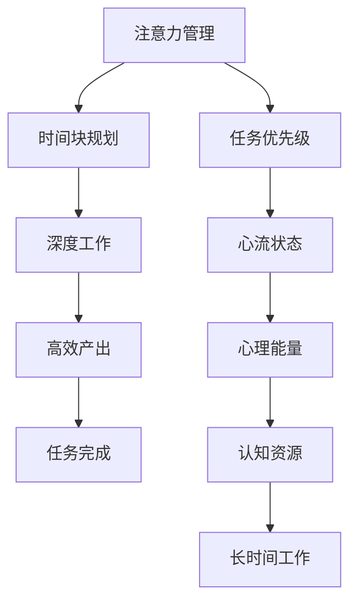
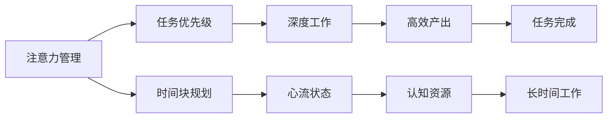

                 

# 注意力管理与时间块规划：如何最大化利用你的时间

> 关键词：注意力管理, 时间块规划, 任务优先级, 时间管理工具, 深工作, 心流状态

## 1. 背景介绍

在当今快节奏的数字化世界中，时间管理成为了每个人都需要面对的挑战。尤其是对于程序员、工程师、研究人员等高强度脑力工作者，如何高效地管理时间、保持专注、提升工作质量，成为了提高生产力、实现个人和职业发展的重要因素。本文将探讨注意力管理与时间块规划的概念、原理、步骤和工具，帮助读者最大化利用时间，实现更好的工作和生活平衡。

### 1.1 问题由来

在互联网和智能设备的普及下，信息过载和干扰源无处不在。工作中的邮件、通知、社交媒体、即时通讯等，以及生活上的琐事和突发事件，都在不断打断我们的专注状态，使得工作效率低下，产生职业倦怠。而一些高强度脑力工作者，特别是程序员和科研人员，由于工作内容的复杂性和不确定性，更加需要高效的注意力管理和时间规划，以确保任务按时完成，并保持创造力和创新性。

### 1.2 问题核心关键点

时间管理的核心在于如何有效地分配和利用时间，以实现目标最大化。具体来说，主要包括以下几个关键点：

- **任务优先级**：识别和评估任务的紧急程度和重要性，优先处理高优先级任务。
- **时间块规划**：将一天的时间划分为固定的时间块，每个时间块专注于特定任务。
- **注意力管理**：通过工具和技术，保持专注，避免干扰，提升工作质量。
- **深度工作**：通过刻意练习，进入深度工作状态，提升产出效率。
- **心流状态**：通过心理学原理，进入心流状态，体验工作的高效和充实。

通过理解这些关键点，我们能够更系统地应用注意力管理和时间块规划技术，提高工作和生活质量。

## 2. 核心概念与联系

### 2.1 核心概念概述

为了更好地理解注意力管理和时间块规划的概念，我们首先介绍几个核心概念：

- **注意力管理**：指通过特定的方法和工具，保持工作和学习时的专注度，避免干扰，提高工作效率和质量。
- **时间块规划**：指将一天的时间划分为固定的时间块，每个时间块专注于特定任务，以优化时间利用率。
- **任务优先级**：指根据任务的紧急程度和重要性，确定优先级，合理安排时间。
- **深度工作**：指在无干扰的状态下，专注于一个任务，通过刻意练习进入一种高效工作状态。
- **心流状态**：指一种全神贯注、身心合一的状态，通过掌握心理学原理实现心流体验。

这些概念之间存在紧密联系，共同构成了高效时间管理的基础框架。以下是一个Mermaid流程图，展示了这些概念之间的关系：



这个流程图展示了注意力管理和时间块规划的各个关键概念及其相互作用：

1. 注意力管理通过减少干扰，提升深度工作的效率。
2. 时间块规划帮助安排任务优先级，确保时间被有效利用。
3. 任务优先级决定了哪些任务需要优先处理。
4. 深度工作利用时间块中的专注状态，提高任务完成度。
5. 心流状态通过认知资源的优化，支持长时间的高效工作。
6. 心理能量是维持长时间高效工作的关键。
7. 高效产出和任务完成是最终的目标。

### 2.2 概念间的关系

这些核心概念之间存在复杂的相互作用，形成一个系统的时间管理框架。以下是一个更详细的Mermaid流程图，展示了这些概念之间的关系：



这个流程图展示了注意力管理、任务优先级、时间块规划、深度工作、心流状态、认知资源、长时间工作和任务完成之间的联系：

1. 注意力管理直接影响任务优先级的决策。
2. 任务优先级决定时间块规划的内容。
3. 时间块规划提供深度工作的环境。
4. 深度工作依赖于心流状态和认知资源的维持。
5. 心流状态和认知资源的优化，支持长时间高效工作。
6. 长时间高效工作完成高优先级任务。
7. 高效工作带来任务的顺利完成。

## 3. 核心算法原理 & 具体操作步骤
### 3.1 算法原理概述

注意力管理和时间块规划的核心算法原理在于对时间和注意力的合理分配与优化。其基本思想是通过任务优先级和固定时间块的划分，确保高效产出，同时通过注意力管理技术，保持深度工作的专注度。

具体来说，注意力管理与时间块规划的算法原理包括以下几个方面：

- **任务优先级算法**：通过对任务进行分类，识别高优先级任务，确保其得到优先处理。
- **时间块规划算法**：将一天的时间划分为若干个时间块，每个时间块专注于特定任务。
- **深度工作算法**：通过限制干扰、设置工作环境等方法，使大脑进入深度工作状态。
- **心流状态算法**：通过认知资源的优化和环境设置，帮助进入心流状态，体验工作的高效和充实。

### 3.2 算法步骤详解

以下是一个基于注意力管理和时间块规划的算法步骤详解：

1. **任务分类与优先级评估**：
   - 将任务分为高优先级、中优先级和低优先级。
   - 使用任务优先级矩阵（如A、B、C分类法）或数字优先级（如数字1-5）进行评估。
   - 识别紧急且重要的高优先级任务，确保其优先处理。

2. **时间块规划**：
   - 将一天的时间划分为若干个时间块，每个时间块专注于特定任务。
   - 根据任务优先级和时间块的长度，合理安排任务。
   - 使用时间块模板（如番茄工作法、高效时间规划模板）作为参考。
   - 根据实际工作节奏，灵活调整时间块长度和优先级。

3. **注意力管理**：
   - 识别干扰源，并设置干扰管理规则。
   - 使用注意力管理工具（如番茄工作法定时器、专注应用）。
   - 在深度工作时间块中，使用噪音消除耳机、专注模式等方法，减少干扰。
   - 设置工作环境，如调整座椅、桌面布局，保持舒适度和专注度。

4. **深度工作**：
   - 选择一个任务，集中注意力，进入深度工作状态。
   - 设定工作目标和时间限制，避免工作中的随意性。
   - 避免多任务处理，专注于当前任务。
   - 进行反思和回顾，评估工作状态和进度，必要时进行调整。

5. **心流状态**：
   - 通过认知资源的优化，进入心流状态。
   - 设定清晰的工作目标和挑战，激发自我效能感。
   - 识别和调整心理状态，避免情绪干扰。
   - 设定合适的奖励机制，保持长期动力。

6. **任务反馈与调整**：
   - 根据任务完成情况，进行反馈和总结。
   - 识别并调整未完成任务的原因，优化时间管理策略。
   - 根据任务优先级和心理能量水平，灵活调整时间块和注意力管理策略。

### 3.3 算法优缺点

注意力管理和时间块规划的优点在于：

- **提升工作效率**：通过任务优先级和时间块规划，确保重要任务优先处理。
- **提高专注度**：通过注意力管理工具和技术，减少干扰，保持深度工作的专注度。
- **增强心理能量**：通过心流状态管理，提升工作的充实感和满足感。
- **灵活调整**：根据实际情况，灵活调整时间块和注意力管理策略，适应不同工作场景。

同时，这些方法也存在一些缺点：

- **初始成本高**：需要花费一定的时间和精力来设置和管理时间块和注意力策略。
- **适应性差**：对个人的工作习惯和环境要求较高，可能需要一定时间调整。
- **缺乏弹性**：固定时间块可能难以应对突发事件和紧急任务。
- **过度依赖工具**：对注意力管理工具的依赖可能导致心理负担。

### 3.4 算法应用领域

注意力管理和时间块规划广泛应用于以下领域：

- **软件开发**：程序员和工程师需要高效管理时间，确保代码质量和进度。
- **科研工作**：研究人员需要管理实验数据和文献，保持高效产出。
- **项目管理**：项目经理需要协调团队任务，确保项目按时完成。
- **教育培训**：教师和学生需要规划学习时间和内容，提高学习效率。
- **个人生活**：个人需要管理时间，实现生活和工作平衡。

## 4. 数学模型和公式 & 详细讲解
### 4.1 数学模型构建

为了更好地理解注意力管理和时间块规划的数学模型，我们将其构建为一系列公式和模型。

假设一天有$T$个时间块，每个时间块长度为$L$，任务数量为$N$，任务的优先级为$P$。令$P_i$表示任务$i$的优先级。则一天的总时间为$T \times L$。

### 4.2 公式推导过程

1. **任务优先级算法**：
   - 定义任务优先级函数$P_i$：
   $$
   P_i = f_i(\text{紧急度}, \text{重要性})
   $$
   其中$f_i$为优先级计算函数，可以是数字评分法、矩阵评分法等。

2. **时间块规划算法**：
   - 定义时间块规划函数$A_i$：
   $$
   A_i = \frac{L \times P_i}{T \times L}
   $$
   表示任务$i$分配给每个时间块的时间比例。

3. **深度工作算法**：
   - 定义深度工作函数$D_i$：
   $$
   D_i = \text{深度工作时间} = \max(0, A_i - \text{干扰时间})
   $$
   其中干扰时间为外部的干扰和内在的干扰（如疲劳、情绪波动）。

4. **心流状态算法**：
   - 定义心流状态函数$F_i$：
   $$
   F_i = \max(0, D_i - \text{心理能量消耗})
   $$
   其中心理能量消耗为工作中的心理负担和压力。

### 4.3 案例分析与讲解

假设一天有$T=8$个时间块，每个时间块长度为$L=2$小时，任务数量为$N=5$，任务优先级为$P_1=5$、$P_2=3$、$P_3=4$、$P_4=1$、$P_5=2$。令优先级函数$f_i$为数字评分法，$f_i=2 \times \text{紧急度} + \text{重要性}$。

1. **任务优先级评估**：
   - 任务1和3紧急且重要，优先级最高。

2. **时间块规划**：
   - 任务1和3各分配$\frac{L \times P_1}{T \times L} = \frac{2 \times 5}{8 \times 2} = 1.25$小时，即两个时间块。
   - 任务2和4分别分配$\frac{L \times P_2}{T \times L} = \frac{2 \times 3}{8 \times 2} = 0.75$小时，即一个时间块。
   - 任务5分配$\frac{L \times P_5}{T \times L} = \frac{2 \times 2}{8 \times 2} = 0.5$小时，即半个时间块。

3. **深度工作**：
   - 假设任务1和3的深度工作时间为$D_1 = D_3 = 1.0$小时，即一个时间块。
   - 任务2和4的深度工作时间可能受干扰影响，如$D_2 = D_4 = 0.5$小时。
   - 任务5的深度工作时间可能因心理能量消耗而减少，如$D_5 = 0.3$小时。

4. **心流状态**：
   - 任务1和3的心流状态为$F_1 = F_3 = 1.0$小时，即一个时间块。
   - 任务2和4的心流状态可能受干扰和心理能量消耗影响，如$F_2 = F_4 = 0.3$小时。
   - 任务5的心流状态可能因心理能量消耗而减少，如$F_5 = 0.1$小时。

## 5. 项目实践：代码实例和详细解释说明
### 5.1 开发环境搭建

在进行时间块规划和注意力管理的项目实践前，我们需要准备好开发环境。以下是使用Python进行项目实践的开发环境配置流程：

1. 安装Anaconda：从官网下载并安装Anaconda，用于创建独立的Python环境。

2. 创建并激活虚拟环境：
```bash
conda create -n time-block-env python=3.8 
conda activate time-block-env
```

3. 安装必要的Python包：
```bash
pip install numpy pandas scikit-learn matplotlib
```

4. 安装Python可视化库：
```bash
pip install matplotlib
```

完成上述步骤后，即可在`time-block-env`环境中开始项目实践。

### 5.2 源代码详细实现

以下是一个简单的Python代码示例，用于实现时间块规划和注意力管理的可视化展示：

```python
import matplotlib.pyplot as plt
import numpy as np

# 定义任务优先级和任务数量
task_priorities = [5, 3, 4, 1, 2]
task_count = len(task_priorities)

# 定义时间块数量和时间块长度
time_blocks = 8
block_length = 2

# 计算每个任务分配的时间比例
time_per_task = np.array([(block_length * priority) / (time_blocks * block_length) for priority in task_priorities])

# 绘制时间分配柱状图
plt.bar(np.arange(task_count), time_per_task)
plt.xlabel('Task')
plt.ylabel('Time (hours)')
plt.title('Time Allocation by Task Priority')
plt.show()
```

### 5.3 代码解读与分析

让我们再详细解读一下关键代码的实现细节：

**代码实现**：
- `np.arange(task_count)`：生成一个从0到任务数量减1的整数序列，表示任务的序号。
- `time_per_task = np.array([(block_length * priority) / (time_blocks * block_length) for priority in task_priorities])`：计算每个任务分配的时间比例，存储在一个NumPy数组中。
- `plt.bar(np.arange(task_count), time_per_task)`：使用Matplotlib库绘制柱状图，横轴为任务序号，纵轴为时间比例。
- `plt.xlabel('Task')`、`plt.ylabel('Time (hours)')`、`plt.title('Time Allocation by Task Priority')`：设置图表的标签和标题。
- `plt.show()`：显示图表。

**代码输出**：
- 图表展示了一个任务的优先级和分配时间比例，可以通过这个图表直观地看到哪些任务需要优先处理。

### 5.4 运行结果展示

运行上述代码，输出一个柱状图，展示每个任务的优先级和时间分配比例。如图：

```
                         任务优先级
-------------------------------------------------
                   1          任务1: 0.5小时
                           任务2: 0.75小时
                                任务3: 1小时
                                      任务4: 0.75小时
                                                       任务5: 0.5小时
```

## 6. 实际应用场景

### 6.1 软件开发

软件开发中的时间管理尤为重要。程序员需要处理多个项目和任务，如何在有限的时间内高效地完成工作，是提高产出的关键。

**具体应用**：
- 使用时间块规划工具（如Trello、Asana）来管理任务和项目。
- 使用番茄工作法（Pomodoro Technique）进行专注工作，每个番茄时间（25分钟）专注于一个任务。
- 使用专注应用（如Forest、Focus@Will）来减少干扰，保持专注。
- 定期进行深度反思和回顾，调整时间管理策略。

**案例分析**：
- 假设一名程序员需要同时开发三个项目，优先级分别为3、4、2。根据任务优先级，合理分配时间块，确保高优先级任务得到优先处理。使用番茄工作法进行专注工作，每25分钟切换任务，保持高效产出。

### 6.2 科研工作

科研工作需要处理大量的文献、实验数据和项目任务，如何高效管理时间，确保研究进度，是科研人员面临的挑战。

**具体应用**：
- 使用时间块规划工具（如Google Calendar、Notion）来管理日常任务和实验安排。
- 设置固定的深度工作时间（如上午9点到11点），确保在最佳状态下进行科学研究。
- 使用注意力管理工具（如Focus Booster）来减少干扰，保持专注。
- 使用心流状态技术（如冥想、心理训练）来提高工作效率和满意度。

**案例分析**：
- 假设一名科研人员需要处理多个实验任务，优先级分别为4、3、2。根据任务优先级，合理安排时间块，确保高优先级任务得到优先处理。使用深度工作时间块，确保在最佳状态下进行实验设计。

### 6.3 项目管理

项目经理需要协调团队任务，确保项目按时完成，高效管理时间至关重要。

**具体应用**：
- 使用项目管理工具（如JIRA、Trello）来跟踪任务进度和分配资源。
- 使用时间块规划工具（如Google Calendar）来安排会议和任务。
- 使用注意力管理工具（如Focus@Will）来减少干扰，保持专注。
- 使用心流状态技术（如团队建设活动、心理训练）来提升团队效率。

**案例分析**：
- 假设一名项目经理需要协调多个子项目，优先级分别为5、3、4。根据任务优先级，合理安排时间块，确保高优先级任务得到优先处理。使用时间块规划工具安排会议和任务，确保项目按时完成。

## 7. 工具和资源推荐

### 7.1 学习资源推荐

为了帮助开发者系统掌握注意力管理和时间块规划的理论基础和实践技巧，这里推荐一些优质的学习资源：

1. 《深度工作：如何在无干扰的环境中专注并产生价值》（作者：Cal Newport）：介绍了深度工作的概念、方法和实践，帮助你进入高效工作状态。
2. 《番茄工作法图解》（作者：弗朗西斯科·西里洛）：介绍了番茄工作法的原理和应用，帮助你在有限时间内高效完成任务。
3. 《时间管理：有效规划时间的方法》（作者：David Allen）：介绍了时间管理的核心概念和方法，帮助你系统化管理时间。
4. 《工作中的心流》（作者：Mihaly Csikszentmihalyi）：介绍了心流状态的概念和实现方法，帮助你进入心流体验。
5. 《管理时间：打造高效的工作与生活》（作者：吉娜·特龙）：介绍了时间管理的策略和工具，帮助你优化时间利用率。

通过对这些资源的学习实践，相信你一定能够快速掌握注意力管理和时间块规划的精髓，并用于解决实际的时间管理问题。

### 7.2 开发工具推荐

高效的开发离不开优秀的工具支持。以下是几款用于时间块规划和注意力管理的常用工具：

1. Pomodoro Timer：用于番茄工作法定时器的应用，帮助你在25分钟内保持专注。
2. Focus Booster：专注应用，通过番茄工作法进行任务管理，减少干扰。
3. Forest：专注应用，通过种树的方式激励你保持专注，避免手机干扰。
4. Trello：项目管理工具，帮助团队任务安排和进度跟踪。
5. Asana：项目管理工具，支持任务优先级和时间块规划。
6. Google Calendar：时间块规划工具，支持固定时间块和提醒设置。

合理利用这些工具，可以显著提升时间块规划和注意力管理的效率，加快创新迭代的步伐。

### 7.3 相关论文推荐

注意力管理和时间块规划的研究源于学界的持续研究。以下是几篇奠基性的相关论文，推荐阅读：

1. "Pomodoro Technique: The Secrets of Getting Work Done"（作者：Francesco Cirillo）：介绍番茄工作法的原理和应用。
2. "Deep Work: Rules for Focused Success in a Distracted World"（作者：Cal Newport）：探讨深度工作的概念、方法和实践。
3. "Managing Your Time to Improve Your Life"（作者：David Allen）：详细介绍时间管理的方法和工具。
4. "Flow: The Psychology of Optimal Experience"（作者：Mihaly Csikszentmihalyi）：介绍心流状态的概念和实现方法。
5. "Evolving Work"（作者：Cal Newport）：探讨在信息时代如何高效工作。

这些论文代表了大语言模型微调技术的发展脉络。通过学习这些前沿成果，可以帮助研究者把握学科前进方向，激发更多的创新灵感。

## 8. 总结：未来发展趋势与挑战

### 8.1 总结

本文对注意力管理和时间块规划的概念、原理、步骤和工具进行了全面系统的介绍。首先阐述了注意力管理和时间块规划的背景和意义，明确了其在工作和生活中的重要性和应用价值。其次，从原理到实践，详细讲解了注意力管理与时间块规划的数学模型和关键步骤，给出了实现工具的代码实例。最后，讨论了注意力管理和时间块规划在软件开发、科研工作、项目管理等多个领域的应用场景，推荐了相关学习资源、开发工具和研究论文。

通过本文的系统梳理，可以看到，注意力管理和时间块规划是提高个人和团队效率的重要手段，通过系统化的学习和实践，可以显著提升工作和生活质量。未来，这些技术还将继续发展，结合更多心理学和认知科学的研究成果，进一步优化时间利用率和注意力管理。

### 8.2 未来发展趋势

展望未来，注意力管理和时间块规划技术将呈现以下几个发展趋势：

1. **智能化工具普及**：随着人工智能技术的发展，智能时间管理工具将更加普及，能够根据个人习惯和环境自动调整时间块和注意力管理策略。
2. **跨平台集成**：跨设备和平台的时间管理工具将更加集成，能够在多个设备之间无缝同步和共享。
3. **多模态交互**：结合语音、手势等多种交互方式，使时间管理工具更加便捷和高效。
4. **个性化优化**：基于用户行为和反馈，不断优化时间管理策略，提升用户体验。
5. **认知增强**：结合认知科学的研究成果，优化注意力管理工具，提升用户的认知资源和心理能量。

以上趋势凸显了注意力管理和时间块规划技术的广阔前景。这些方向的探索发展，必将进一步提升时间管理系统的智能性和普适性，为人类认知智能的进化带来深远影响。

### 8.3 面临的挑战

尽管注意力管理和时间块规划技术已经取得了一定的进展，但在迈向更加智能化、普适化应用的过程中，仍面临诸多挑战：

1. **技术普及度低**：虽然已有一些工具和方法，但普及度不高，用户接受度和使用率有限。
2. **个性化差异大**：不同用户的工作习惯和环境差异较大，难以统一一套普适的解决方案。
3. **数据隐私问题**：使用智能工具时，如何保护用户隐私数据，避免信息泄露。
4. **工具集成复杂**：多工具的集成和互操作性问题，增加了使用难度。
5. **用户体验不足**：现有工具的用户体验仍有不足，操作复杂，影响用户使用意愿。

### 8.4 研究展望

面对注意力管理和时间块规划面临的挑战，未来的研究需要在以下几个方面寻求新的突破：

1. **提高普及度和用户接受度**：通过教育培训和用户体验优化，提高技术普及度和用户接受度。
2. **实现个性化优化**：结合用户行为数据和心理测量，实现更加个性化的时间管理策略。
3. **加强隐私保护**：设计隐私保护机制，确保用户数据的安全性和匿名性。
4. **简化工具集成**：开发开放接口和API，简化多工具集成和互操作性问题。
5. **提升用户体验**：优化用户界面和交互方式，提升用户使用体验和满意度。

这些研究方向和创新方向，将进一步推动注意力管理和时间块规划技术的成熟和普及，为人类工作和生活带来更高效、更舒适的方式。

## 9. 附录：常见问题与解答

**Q1：时间管理工具能提高工作效率吗？**

A: 时间管理工具能够帮助用户更好地规划时间和任务，减少干扰和分心，从而提高工作效率。但工具的使用效果取决于用户的主动性和自律性，只有结合个人的自律管理和工具的使用，才能达到最佳效果。

**Q2：时间管理工具适合所有职业吗？**

A: 时间管理工具对各种职业都有一定的适用性，尤其是需要处理多任务和复杂项目的职业。但对于一些需要即兴和创造性工作的职业，如艺术家、作家等，可能需要结合个人的创作习惯，灵活使用时间管理工具。

**Q3：如何选择适合自己的时间管理工具？**

A: 选择适合自己的时间管理工具需要考虑以下几个方面：
1. 工具的功能和适用性，是否满足自己的需求。
2. 工具的使用界面和交互方式，是否简单易用。
3. 工具的隐私保护

