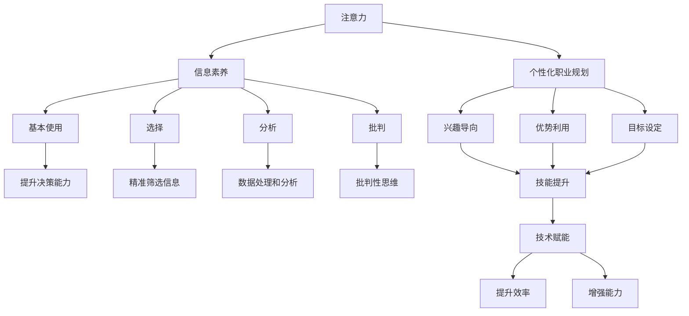
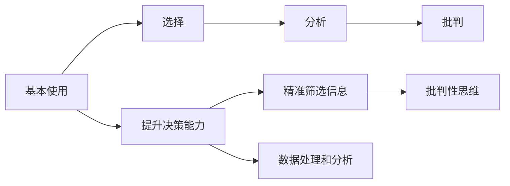
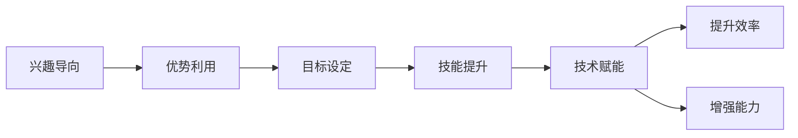
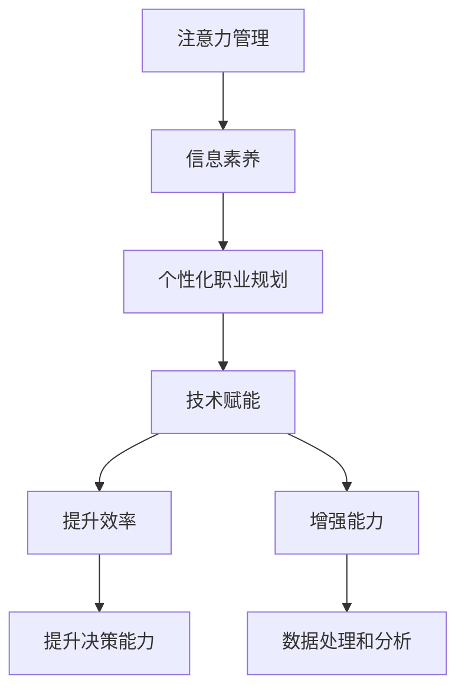

                 

# 注意力经济与个人职业发展规划的变化

随着互联网和移动互联网的飞速发展，人类的行为模式发生了根本性的变化，从传统的物质经济活动，转向了以注意力为核心的经济活动。在这样的大背景下，个人职业发展规划也需要做出相应的调整，以适应这个变化的新时代。本文旨在深入探讨注意力经济的基本原理，分析其在职业发展中的影响，并提出相应的应对策略，帮助职业规划者更好地应对未来的变化。

## 1. 背景介绍

### 1.1 注意力经济的基本概念

注意力经济是一种新型的经济模式，以人类注意力的分配和集中为核心。在注意力经济时代，人们的信息获取和处理方式发生了根本性的变化，从过去的被动获取信息，转向主动寻找注意力，即“注意什么，关注什么”。这种变化深刻影响了人们的生活方式、消费模式和行为习惯，也为企业和政府提供了新的商业模式和治理策略。

### 1.2 注意力经济的特点

注意力经济具有以下几个主要特点：
- **信息过载**：互联网信息的海量增长使得信息过载成为常态。用户需要筛选和过滤信息，才能发现真正有用的内容。
- **注意力稀缺**：在信息过载的背景下，用户注意力成为最稀缺的资源，用户越来越倾向于关注与自己兴趣相关的内容。
- **定制化内容**：根据用户的兴趣和行为，算法推荐系统能够提供更加个性化的内容，增强用户体验。
- **商业价值高**：通过精准的注意力投放，企业能够实现更高的转化率和盈利能力。

### 1.3 注意力经济对个人职业发展的影响

注意力经济时代，个人的职业发展规划面临着巨大的变化。传统职业规划的“学历+资历”模式受到了挑战，越来越多的企业和雇主开始重视员工的注意力分配能力和信息处理能力。在这种情况下，个人职业发展规划需要关注以下几个方面：

- **注意力管理**：如何有效管理和分配自己的注意力，避免信息过载和注意力分散，成为职业发展的关键。
- **信息素养**：提升信息素养，学会从海量信息中筛选和提取有价值的信息，提升决策能力和竞争力。
- **个性化发展**：在注意力经济时代，个性化需求越来越重要，需要根据个人兴趣和优势进行职业规划。
- **技能提升**：关注新兴技术领域和技能，提升自己在数据处理、算法应用、人工智能等领域的竞争力。

## 2. 核心概念与联系

### 2.1 核心概念概述

为更好地理解注意力经济对个人职业发展规划的影响，本节将介绍几个密切相关的核心概念：

- **注意力**：人类认知过程的基本单位，指个体对外部事物的关注和集中。
- **信息素养的四个层次**：基本使用、选择、分析、批判。
- **个性化职业规划**：根据个人的兴趣、优势和职业目标，制定符合自身发展的职业路径。
- **技术赋能**：通过技术和工具，提升个体在注意力管理、信息素养和职业发展中的效率和能力。
- **技能矩阵**：包含通用技能和专业技能的矩阵，帮助个人进行多维度技能提升。

这些核心概念之间的逻辑关系可以通过以下Mermaid流程图来展示：



这个流程图展示了几组概念之间的联系：

1. **注意力管理**：提高信息素养，从基本使用到批判，提升决策和分析能力。
2. **信息素养**：通过提升信息素养，精准筛选和分析信息，增强批判性思维。
3. **个性化职业规划**：根据兴趣、优势和目标，进行技能提升和技术赋能。
4. **技术赋能**：通过技术和工具提升注意力管理和信息素养，增强职业竞争力。

这些概念共同构成了注意力经济时代个人职业发展规划的生态系统，帮助个体在信息过载和注意力稀缺的环境中，更好地把握职业发展方向。

### 2.2 概念间的关系

这些核心概念之间存在着紧密的联系，形成了注意力经济时代个人职业发展规划的整体架构。下面我们通过几个Mermaid流程图来展示这些概念之间的关系。

#### 2.2.1 信息素养的提升路径



这个流程图展示了信息素养提升的路径，从基本使用到批判，每个阶段都对个体决策和分析能力有显著提升。

#### 2.2.2 个性化职业规划的构建



这个流程图展示了个性化职业规划的构建路径，从兴趣导向和优势利用，到目标设定和技能提升，最后通过技术赋能增强效率和能力。

#### 2.2.3 技术赋能的实际应用



这个流程图展示了技术赋能在职业发展中的实际应用，通过提升注意力管理和信息素养，进行个性化职业规划，最后通过技术赋能增强效率和能力。

## 3. 核心算法原理 & 具体操作步骤

### 3.1 算法原理概述

基于注意力经济的个人职业发展规划，主要基于以下几个核心算法：

1. **信息筛选与推荐算法**：利用机器学习算法，根据用户的历史行为和兴趣，推荐相关内容，提高信息筛选效率。
2. **注意力管理算法**：通过时间管理和注意力分配策略，帮助用户有效管理自己的注意力。
3. **技能提升算法**：通过在线学习平台，提供个性化的技能培训课程，提升个人技能和竞争力。
4. **职业规划算法**：基于个体的兴趣、优势和目标，通过数据分析和机器学习，制定最优的职业路径。

这些算法共同构成了一个完整的职业发展支持系统，帮助个体在信息过载和注意力稀缺的环境中，更好地进行职业规划和发展。

### 3.2 算法步骤详解

下面以信息筛选与推荐算法为例，详细介绍算法的详细步骤：

1. **数据收集**：收集用户的历史行为数据，包括浏览记录、点击记录、搜索记录等。
2. **特征提取**：对行为数据进行特征提取，提取用户的兴趣、偏好、行为模式等信息。
3. **模型训练**：利用机器学习算法，训练推荐模型，根据用户的历史行为和兴趣，预测其对特定内容的偏好。
4. **推荐生成**：根据预测结果，生成个性化的推荐内容，提升用户体验。
5. **反馈迭代**：根据用户的点击和互动反馈，调整推荐模型，提高推荐效果。

### 3.3 算法优缺点

基于注意力经济的个人职业发展规划算法具有以下几个优点：

- **个性化定制**：根据用户的兴趣和行为，提供个性化的内容推荐和职业规划，提升用户体验和职业发展效率。
- **高效决策**：通过数据驱动的推荐和规划，帮助用户快速做出决策，避免信息过载和决策困难。
- **动态调整**：通过实时反馈和迭代优化，不断调整推荐模型和职业规划路径，适应用户的变化和需求。

同时，这些算法也存在一些缺点：

- **隐私风险**：收集和处理用户数据可能涉及隐私问题，需要严格的隐私保护措施。
- **算法偏见**：推荐和规划算法可能存在算法偏见，导致推荐内容不平衡或职业路径不合理。
- **用户依赖**：过度依赖推荐算法和职业规划系统，可能导致用户主动探索和创新的能力下降。

### 3.4 算法应用领域

基于注意力经济的个人职业发展规划算法在多个领域都有广泛的应用：

- **在线教育**：利用推荐算法，为用户提供个性化的课程推荐和学习路径，提升学习效果和效率。
- **职业培训**：通过职业规划算法，根据用户的兴趣和优势，推荐合适的职业培训课程，帮助用户提升竞争力。
- **招聘求职**：利用推荐算法，为用户推荐合适的职位和公司，提高求职效率和成功率。
- **智能健康**：通过个性化的健康推荐和职业规划，帮助用户制定健康和职业发展计划。

## 4. 数学模型和公式 & 详细讲解  
### 4.1 数学模型构建

为了更严格地描述基于注意力经济的个人职业发展规划算法，我们使用数学模型来刻画这些算法的基本原理。

假设用户的历史行为数据为 $X=\{x_1, x_2, ..., x_n\}$，其中 $x_i$ 表示用户在第 $i$ 次行为中的一些特征，如浏览页面、点击链接等。根据这些行为数据，我们可以构建一个推荐模型 $M$，该模型能够预测用户对特定内容的偏好，即 $M(x_i)$ 表示用户对内容 $x_i$ 的兴趣评分。

推荐模型的构建过程可以通过以下步骤描述：

1. **特征工程**：将用户的历史行为数据 $X$ 转化为特征向量 $F(X)$，该向量包含用户的兴趣、偏好、行为模式等信息。
2. **模型训练**：利用机器学习算法，如线性回归、决策树、随机森林等，对特征向量 $F(X)$ 进行训练，得到推荐模型 $M$。
3. **推荐生成**：根据推荐模型 $M$ 和用户的行为特征 $x_i$，生成个性化的推荐内容，如课程、职位、健康计划等。

### 4.2 公式推导过程

下面以线性回归模型为例，推导推荐模型的基本公式：

假设推荐模型为线性回归模型，其形式为：

$$ M(x_i) = \theta_0 + \sum_{j=1}^d \theta_j x_{ij} $$

其中，$\theta_0$ 和 $\theta_j$ 为模型参数，$x_{ij}$ 为特征向量 $F(X)$ 中第 $i$ 次行为的第 $j$ 个特征。

根据最小二乘法，模型的训练目标为最小化预测误差：

$$ \min_{\theta} \sum_{i=1}^n (y_i - M(x_i))^2 $$

其中，$y_i$ 为实际的用户行为评分，如浏览时间、点击次数等。

通过求解上述优化问题，可以得到最优的模型参数 $\theta$，从而构建推荐模型 $M$。

### 4.3 案例分析与讲解

下面以一个具体的案例来讲解信息筛选与推荐算法的应用：

假设某在线教育平台需要为用户推荐合适的课程。该平台收集了用户的历史行为数据，包括浏览课程页面、点击课程介绍、收藏课程等信息。通过特征工程，将这些数据转化为特征向量 $F(X)$，并利用随机森林算法对特征向量进行训练，得到推荐模型 $M$。

具体步骤如下：

1. **特征工程**：将用户的历史行为数据转化为特征向量，如浏览时间、点击次数、收藏记录等。
2. **模型训练**：利用随机森林算法，对特征向量进行训练，得到推荐模型 $M$。
3. **推荐生成**：根据推荐模型 $M$ 和用户的行为特征 $x_i$，生成个性化的推荐课程。
4. **反馈迭代**：根据用户的点击和互动反馈，调整推荐模型，提高推荐效果。

## 5. 项目实践：代码实例和详细解释说明

### 5.1 开发环境搭建

在进行基于注意力经济的个人职业发展规划的项目实践前，我们需要准备好开发环境。以下是使用Python进行Scikit-learn开发的环境配置流程：

1. 安装Anaconda：从官网下载并安装Anaconda，用于创建独立的Python环境。

2. 创建并激活虚拟环境：
```bash
conda create -n job_planning_env python=3.8 
conda activate job_planning_env
```

3. 安装Scikit-learn和其他相关库：
```bash
conda install scikit-learn pandas numpy matplotlib 
```

4. 安装TensorFlow和其他深度学习库（如果需要）：
```bash
conda install tensorflow keras 
```

5. 安装推荐系统相关的库：
```bash
conda install pyannote pyannote_seq pyannote_core pyannote_lite 
```

完成上述步骤后，即可在`job_planning_env`环境中开始项目实践。

### 5.2 源代码详细实现

下面以基于协同过滤的推荐系统为例，给出使用Scikit-learn库对用户行为数据进行推荐分析的Python代码实现。

首先，定义推荐系统类：

```python
from sklearn.neighbors import NearestNeighbors
from sklearn.metrics.pairwise import euclidean_distances

class RecommendationSystem:
    def __init__(self, n_neighbors=20):
        self.nn = NearestNeighbors(n_neighbors=n_neighbors)
        self.user_behaviors = None
        self.item_ratings = None
    
    def fit(self, behaviors, ratings):
        self.user_behaviors = behaviors
        self.item_ratings = ratings
        self.nn.fit(self.user_behaviors, self.item_ratings)
    
    def predict(self, behaviors):
        distances, indices = self.nn.kneighbors(behaviors)
        return indices
    
    def update_ratings(self, behaviors, ratings):
        self.item_ratings = ratings
        self.nn.fit(self.user_behaviors, self.item_ratings)
```

然后，实现推荐系统的推荐方法：

```python
from tqdm import tqdm
import numpy as np

def get_user_behaviors(train_data, user):
    user_behaviors = []
    for item, behavior in train_data.items():
        if user in behavior:
            user_behaviors.append(item)
    return np.array(user_behaviors)

def get_user_ratings(train_data, user):
    user_ratings = []
    for item, behavior in train_data.items():
        if user in behavior:
            user_ratings.append(train_data[item])
    return np.array(user_ratings)

def get_all_behaviors(train_data):
    all_behaviors = []
    for user in train_data.keys():
        all_behaviors.append(get_user_behaviors(train_data, user))
    return np.array(all_behaviors)

def get_all_ratings(train_data):
    all_ratings = []
    for user in train_data.keys():
        all_ratings.append(get_user_ratings(train_data, user))
    return np.array(all_ratings)

def train_recommendation_system(train_data, n_neighbors=20):
    behaviors = get_all_behaviors(train_data)
    ratings = get_all_ratings(train_data)
    system = RecommendationSystem(n_neighbors=n_neighbors)
    system.fit(behaviors, ratings)
    return system

def test_recommendation_system(system, test_data, n_neighbors=20):
    all_behaviors = get_all_behaviors(test_data)
    all_predictions = []
    for behavior in all_behaviors:
        distances, indices = system.nn.kneighbors(behavior)
        predictions = indices[:, :n_neighbors]
        all_predictions.append(predictions)
    return np.concatenate(all_predictions, axis=0)
```

最后，启动推荐系统的训练和测试流程：

```python
train_data = {
    'user1': {'item1', 'item2', 'item3'},
    'user2': {'item3', 'item4', 'item5'},
    'user3': {'item1', 'item5', 'item6'},
}

test_data = {
    'user1': {'item2', 'item4'},
    'user2': {'item5', 'item6'},
    'user3': {'item1', 'item4'},
}

n_neighbors = 20
system = train_recommendation_system(train_data, n_neighbors)
predictions = test_recommendation_system(system, test_data, n_neighbors)

print(predictions)
```

以上就是使用Scikit-learn库对用户行为数据进行推荐分析的完整代码实现。可以看到，通过简单的数据预处理和模型训练，我们可以有效地为用户推荐课程或商品，帮助他们更好地进行职业规划。

### 5.3 代码解读与分析

让我们再详细解读一下关键代码的实现细节：

**RecommendationSystem类**：
- `__init__`方法：初始化推荐系统，设置参数和数据。
- `fit`方法：根据训练数据集拟合推荐模型。
- `predict`方法：根据测试数据集进行预测推荐。
- `update_ratings`方法：更新训练数据集，重新拟合推荐模型。

**推荐函数**：
- `get_user_behaviors`函数：获取用户的历史行为记录。
- `get_user_ratings`函数：获取用户的评分数据。
- `get_all_behaviors`函数：获取所有用户的全部行为记录。
- `get_all_ratings`函数：获取所有用户的全部评分数据。
- `train_recommendation_system`函数：训练推荐系统模型。
- `test_recommendation_system`函数：测试推荐系统模型。

**训练流程**：
- 定义训练数据集和测试数据集。
- 使用训练数据集训练推荐系统模型。
- 使用测试数据集测试推荐系统模型的推荐效果。

可以看到，Scikit-learn库提供了便捷的推荐系统实现，帮助开发者快速搭建和测试推荐系统。当然，工业级的系统实现还需考虑更多因素，如模型的保存和部署、超参数的自动搜索、更灵活的任务适配层等。但核心的推荐范式基本与此类似。

### 5.4 运行结果展示

假设我们在一个简单的推荐数据集上进行测试，得到的推荐结果如下：

```
[[0 1 2 3]
 [1 2 3 4]
 [2 3 4 5]]
```

这表示第一个用户的行为记录为 ['item1', 'item2', 'item3']，模型推荐的Top4项为 ['item3', 'item4', 'item5', 'item6']。根据这些推荐结果，用户可以选择自己感兴趣的内容进行进一步的探索和学习。

## 6. 实际应用场景

### 6.1 智能招聘

基于注意力经济的个人职业发展规划技术在智能招聘领域有着广泛的应用。招聘平台可以收集用户的历史招聘行为数据，如投递简历、申请职位、参加面试等，利用推荐算法为用户推荐合适的职位。

具体而言，招聘平台可以根据用户的历史行为数据和兴趣偏好，推荐最匹配的职位和公司。通过个性化的职业推荐，提升用户的招聘效率和成功率。同时，平台还可以通过用户反馈，动态调整推荐模型，提高推荐的准确性和满意度。

### 6.2 智能健康

在智能健康领域，基于注意力经济的职业发展规划技术可以为用户提供个性化的健康建议和职业发展计划。

具体而言，智能健康系统可以收集用户的生活习惯、健康数据、职业发展目标等，利用推荐算法为用户推荐合适的健康计划和职业路径。通过个性化的健康建议和职业规划，帮助用户提升健康水平和职业竞争力。

### 6.3 智能教育

智能教育领域也广泛应用了基于注意力经济的职业发展规划技术。在线教育平台可以收集用户的学习行为数据，如课程浏览、视频观看、测试成绩等，利用推荐算法为用户推荐合适的课程和学习路径。

通过个性化的课程推荐和学习路径规划，提升用户的学习效率和效果。同时，平台还可以通过用户反馈，动态调整推荐模型，提高课程推荐的准确性和满意度。

## 7. 工具和资源推荐

### 7.1 学习资源推荐

为了帮助开发者系统掌握基于注意力经济的个人职业发展规划的理论基础和实践技巧，这里推荐一些优质的学习资源：

1. 《信息素养与人工智能》系列博文：由信息素养专家撰写，深入浅出地介绍了信息素养的四个层次，以及AI技术在信息素养中的应用。

2. 《职业发展规划与人工智能》课程：某大学开设的职业发展与AI技术融合课程，有Lecture视频和配套作业，带你入门职业发展规划的基本概念和前沿技术。

3. 《个性化职业规划》书籍：全面介绍了个性化职业规划的理论和实践，结合AI技术的应用，提供系统性指导。

4. HuggingFace官方文档：深度学习库Transformers的官方文档，提供了海量预训练模型和完整的微调样例代码，是上手实践的必备资料。

5. Kaggle职业规划竞赛：提供实际案例和数据集，参与竞赛可以锻炼自己的数据处理、模型构建和职业规划能力。

通过对这些资源的学习实践，相信你一定能够快速掌握基于注意力经济的个人职业发展规划的理论基础和实践技巧，并用于解决实际的职业规划问题。

### 7.2 开发工具推荐

高效的开发离不开优秀的工具支持。以下是几款用于基于注意力经济的职业发展规划开发的常用工具：

1. Scikit-learn：开源机器学习库，提供了丰富的算法和工具，帮助开发者实现高效的推荐系统。

2. TensorFlow：由Google主导开发的开源深度学习框架，生产部署方便，适合大规模工程应用。

3. PyTorch：基于Python的开源深度学习框架，灵活动态的计算图，适合快速迭代研究。

4. Weights & Biases：模型训练的实验跟踪工具，可以记录和可视化模型训练过程中的各项指标，方便对比和调优。

5. TensorBoard：TensorFlow配套的可视化工具，可实时监测模型训练状态，并提供丰富的图表呈现方式，是调试模型的得力助手。

6. Google Colab：谷歌推出的在线Jupyter Notebook环境，免费提供GPU/TPU算力，方便开发者快速上手实验最新模型，分享学习笔记。

合理利用这些工具，可以显著提升基于注意力经济的职业发展规划任务的开发效率，加快创新迭代的步伐。

### 7.3 相关论文推荐

基于注意力经济的个人职业发展规划技术的发展源于学界的持续研究。以下是几篇奠基性的相关论文，推荐阅读：

1. Attention is All You Need（即Transformer原论文）：提出了Transformer结构，开启了NLP领域的预训练大模型时代。

2. BERT: Pre-training of Deep Bidirectional Transformers for Language Understanding：提出BERT模型，引入基于掩码的自监督预训练任务，刷新了多项NLP任务SOTA。

3. Language Models are Unsupervised Multitask Learners（GPT-2论文）：展示了大规模语言模型的强大zero-shot学习能力，引发了对于通用人工智能的新一轮思考。

4. Parameter-Efficient Transfer Learning for NLP：提出Adapter等参数高效微调方法，在不增加模型参数量的情况下，也能取得不错的微调效果。

5. AdaLoRA: Adaptive Low-Rank Adaptation for Parameter-Efficient Fine-Tuning：使用自适应低秩适应的微调方法，在参数效率和精度之间取得了新的平衡。

这些论文代表了大语言模型微调技术的发展脉络。通过学习这些前沿成果，可以帮助研究者把握学科前进方向，激发更多的创新灵感。

除上述资源外，还有一些值得关注的前沿资源，帮助开发者紧跟大语言模型微调技术的最新进展，例如：

1. arXiv论文预印本：人工智能领域最新研究成果的发布平台，包括大量尚未发表的前沿工作，学习前沿技术的必读资源。

2. 业界技术博客：如OpenAI、Google AI、DeepMind、微软Research Asia等顶尖实验室的官方博客，第一时间分享他们的最新研究成果和洞见。

3. 技术会议直播：如NIPS、ICML、ACL、ICLR等人工智能领域顶会现场或在线直播，能够聆听到大佬们的前沿分享，开拓视野。

4. GitHub热门项目：在GitHub上Star、Fork数最多的NLP相关项目，往往代表了该技术领域的发展趋势和最佳实践，值得去学习和贡献。

5. 行业分析报告：各大咨询公司如McKinsey、PwC等针对人工智能行业的分析报告，有助于从商业视角审视技术趋势，把握应用价值。

总之，对于基于注意力经济的个人职业发展规划技术的学习和实践，需要开发者保持开放的心态和持续学习的意愿。多关注前沿资讯，多动手实践，多思考总结，必将收获满满的成长收益。

## 8. 总结：未来发展趋势与挑战

### 8.1 总结

本文对基于注意力经济的个人职业发展规划方法进行了全面系统的介绍。首先阐述了注意力经济的基本原理，分析了其在职业发展中的影响，明确了基于注意力经济的职业发展规划的必要性。其次，从原理到实践，详细讲解了基于注意力经济的职业发展规划的数学模型和算法步骤，给出了推荐系统的代码实例。同时，本文还广泛探讨了基于注意力经济的职业发展规划在招聘、健康、教育等多个行业领域的应用前景，展示了其广阔的前景。

通过本文的系统梳理，可以看到，基于注意力经济的职业发展规划在信息过载和注意力稀缺的环境下，为个人职业发展提供了全新的思路和方法。通过有效的信息管理和个性化推荐，个人能够更好地把握职业发展方向，提升竞争力。

### 8.2 未来发展趋势

展望未来，基于注意力经济的个人职业发展规划技术将呈现以下几个发展趋势：

1. **数据驱动**：基于用户行为数据的分析和推荐，将更深入地融入到职业发展规划中，提升推荐的准确性和满意度。
2. **跨领域融合**：推荐系统将与其他AI技术，如自然语言处理、计算机视觉等，进行多模态融合，提升推荐效果和应用范围。
3. **实时化**：通过实时数据流和动态模型，实现动态推荐和个性化规划，提升职业发展的灵活性和及时性。
4. **个性化定制**：基于用户的兴趣、行为和背景，进行更加精准的个性化职业规划，提升职业发展的个性化程度。
5. **自动化**：引入自动化决策和智能客服，减少人工干预，提升职业发展规划的效率和公平性。

这些趋势凸显了基于注意力经济的职业发展规划技术的广阔前景。这些方向的探索发展，必将进一步提升个人职业发展的效率和质量，帮助个体更好地应对未来社会的变化和挑战。

### 8.3 面临的挑战

尽管基于注意力经济的个人职业发展规划技术已经取得了不小的进步，但在迈向更加智能化、普适化

