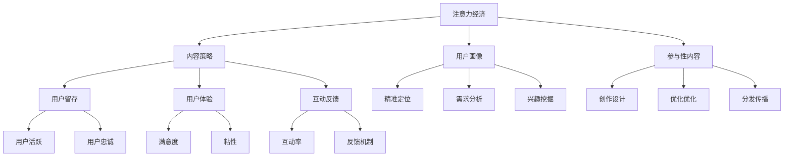
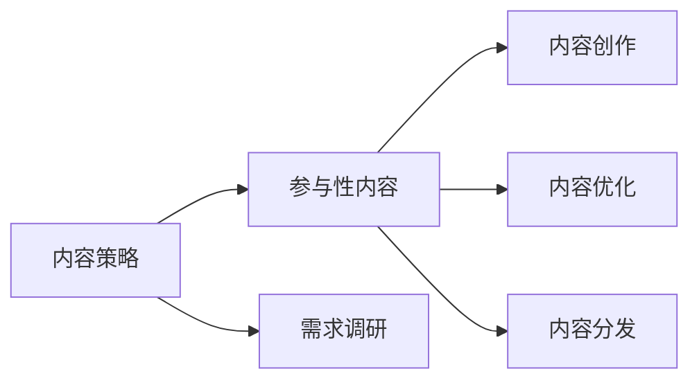
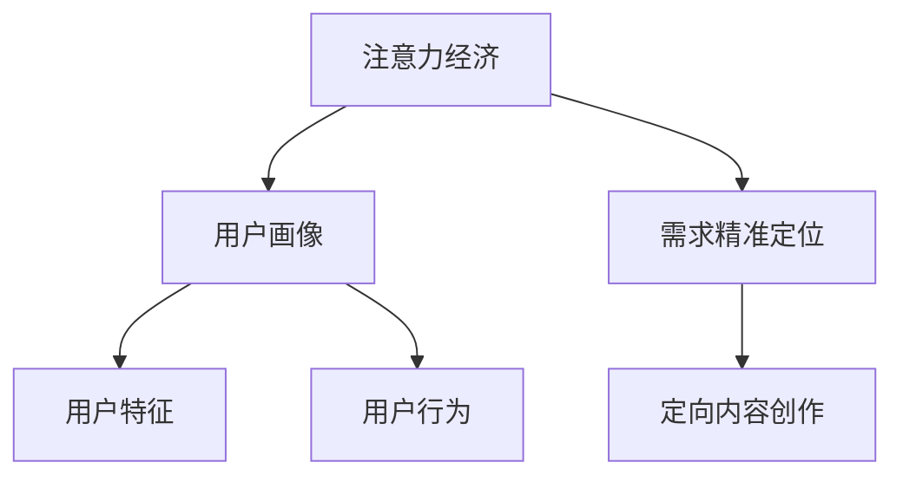
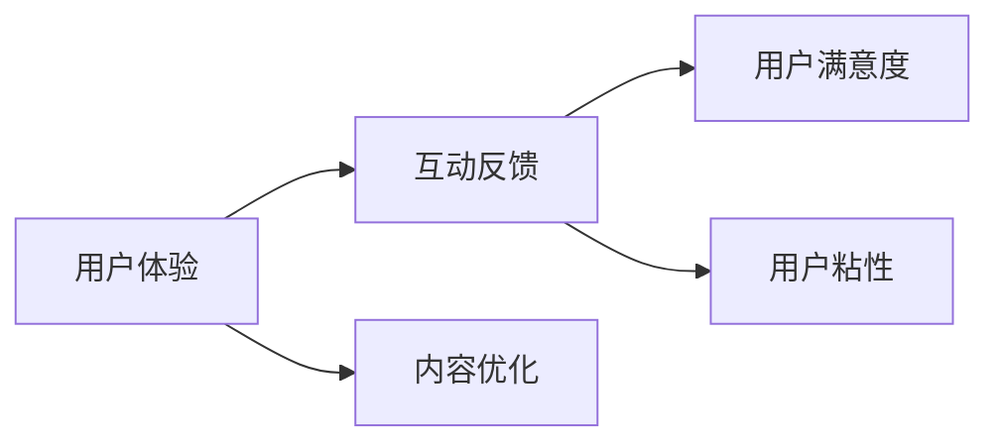
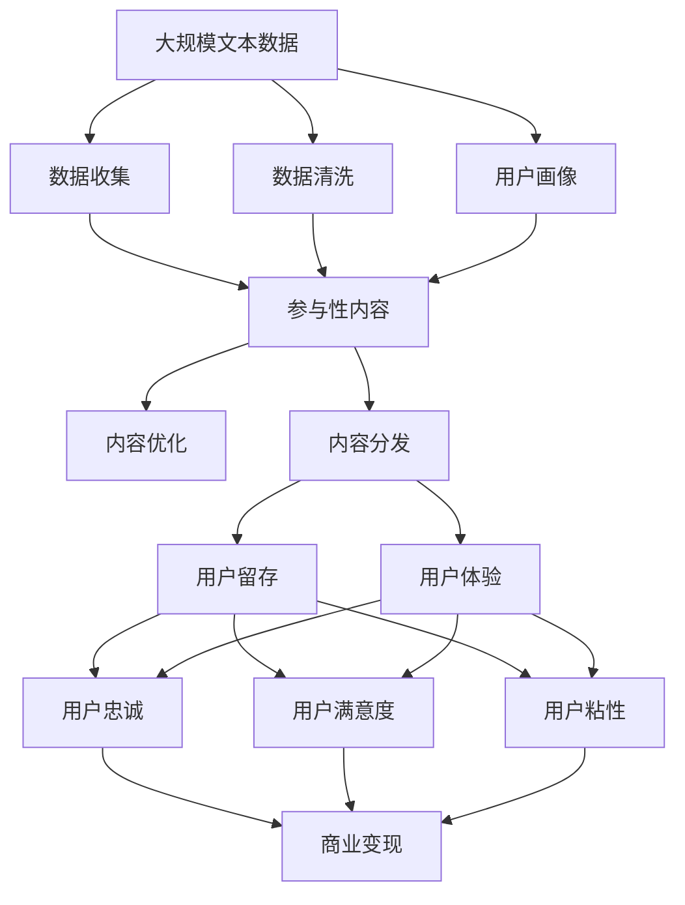

                 

# 注意力经济与内容策略：创建吸引并留住受众的参与性内容

> 关键词：注意力经济,内容策略,参与性内容,受众吸引,内容留存,用户体验

## 1. 背景介绍

### 1.1 问题由来
随着数字媒体和互联网技术的发展，信息量的爆炸式增长让内容消费者面临着前所未有的信息过载问题。而内容创作者在繁杂的海量信息中，如何吸引并留住受众的注意力，便成了首要挑战。注意力作为一种稀缺资源，其价值在内容消费中越发凸显。

传统的内容传播模式逐渐式微，用户对内容的获取从被动变为主动。他们更倾向于通过智能算法、社交网络等方式筛选出最符合自己兴趣的内容。如何针对用户的注意力机制，设计出吸引并留住受众的参与性内容，成为当前内容创作和传播的重要课题。

### 1.2 问题核心关键点
注意力经济的核心在于，如何精准触达目标用户，最大化其注意力的投入。而内容策略的核心，则在于如何设计、优化和传播内容，使其具有高参与度和高留存率。两者共同构成了内容创作的完整框架。

其关键在于：
- 精准定位用户需求和兴趣点
- 设计高质量、有价值的内容
- 利用智能算法进行内容推荐和传播
- 建立持续的互动反馈机制

### 1.3 问题研究意义
1. 提升内容创作者的变现能力。通过精准吸引并留住受众，最大化用户的参与和互动，为内容创作者带来更多的流量、广告、订阅等变现手段。
2. 增强内容平台的市场竞争力。通过高效的注意力管理，吸引更多用户注册、停留和转化，提高平台的活跃度和粘性。
3. 改善用户体验。高参与度的内容能更好地满足用户需求，提升用户的满意度和忠诚度，增强内容的传播力。
4. 促进内容创新。精准的受众定位和互动反馈机制，能更快地获取用户反馈，驱动内容的迭代和优化。
5. 优化资源配置。通过科学的用户画像和内容设计，能有效提升内容创作的投入产出比，节约资源成本。

## 2. 核心概念与联系

### 2.1 核心概念概述

为更好地理解注意力经济与内容策略的深度整合，本节将介绍几个密切相关的核心概念：

- 注意力经济(Associative Economy)：基于用户注意力资源的经济模式，即通过满足用户兴趣和需求，最大化用户注意力的投入，以实现经济收益最大化。
- 内容策略(Content Strategy)：定义和规划内容的创作、优化和传播策略，旨在实现目标用户对内容的参与和留存。
- 参与性内容(Engagement Content)：用户参与度高、互动性强、情感共鸣明显的内容，通常具有较高的留存率和口碑传播力。
- 用户画像(User Persona)：通过数据分析和用户调研，构建用户的行为、兴趣、偏好等特征，为内容定制提供依据。
- 互动反馈(Interactive Feedback)：用户与内容之间的互动反馈机制，通常通过点赞、评论、分享等方式进行。
- 用户留存(User Retention)：用户在一定时间内的留存率和活跃度，是衡量内容平台效果的重要指标。
- 用户体验(User Experience)：用户在使用内容平台时的感觉和体验，直接影响用户的满意度、忠诚度和传播力。

这些核心概念之间的逻辑关系可以通过以下Mermaid流程图来展示：



这个流程图展示了几者之间的内在联系：

1. 注意力经济通过满足用户需求，最大化其注意力的投入。
2. 内容策略根据用户画像，设计高参与度的参与性内容。
3. 参与性内容经过优化和传播，提升用户体验和用户留存率。
4. 互动反馈机制加强内容与用户之间的互动，提升用户满意度。
5. 用户留存和活跃度，直接影响内容的传播力和平台的市场竞争力。

### 2.2 概念间的关系

这些核心概念之间存在着紧密的联系，形成了完整的注意力经济与内容策略体系。下面我们通过几个Mermaid流程图来展示这些概念之间的关系。

#### 2.2.1 内容策略与参与性内容



这个流程图展示了内容策略对参与性内容的指导作用：根据用户需求，设计并优化内容，再通过分发渠道传播。

#### 2.2.2 注意力经济与用户画像



这个流程图展示了用户画像在注意力经济中的作用：通过精准定位用户需求，创作定向内容，最大化用户注意力的投入。

#### 2.2.3 用户体验与互动反馈



这个流程图展示了用户体验与互动反馈的关系：优质的用户体验提升用户满意度，增强用户粘性，从而加强互动反馈的活跃度。

### 2.3 核心概念的整体架构

最后，我们用一个综合的流程图来展示这些核心概念在注意力经济与内容策略中的整体架构：



这个综合流程图展示了从数据收集到内容分发，再到用户留存和体验优化的完整过程。通过精准的注意力管理和科学的内容策略，实现内容创作与用户需求的有效匹配，最大化用户注意力的投入，最终提升商业变现能力。

## 3. 核心算法原理 & 具体操作步骤
### 3.1 算法原理概述

基于注意力经济与内容策略的参与性内容创建，核心在于利用数据分析和机器学习技术，精准定位用户需求，设计高效互动的内容形式，实现内容的定制化传播。其核心思想是：通过优化用户画像和内容策略，最大化用户参与度和留存率。

形式化地，假设目标用户群体为 $U$，内容形式为 $C$，互动方式为 $I$，则参与性内容创建的过程可以表示为：

$$
\begin{aligned}
\max_{C,I} & \sum_{u \in U} \eta_u \cdot \phi(u, C) \cdot \sigma(u, I) \\
\text{s.t.} & \phi(u, C) \leq \sum_{v \in U} \phi(v, C) \\
\end{aligned}
$$

其中 $\eta_u$ 为每个用户 $u$ 的权重，$\phi(u, C)$ 表示内容 $C$ 对用户 $u$ 的吸引力，$\sigma(u, I)$ 表示互动方式 $I$ 对用户 $u$ 的参与度。目标函数最大化用户 $u$ 的参与度与留存率的乘积，即注意力的投入。

### 3.2 算法步骤详解

基于注意力经济与内容策略的参与性内容创建，一般包括以下几个关键步骤：

**Step 1: 数据收集与处理**

- 收集目标用户群体的基本信息，如年龄、性别、地域等。
- 收集用户的历史行为数据，如浏览、购买、互动等。
- 分析用户数据，提取用户的行为特征和兴趣偏好。

**Step 2: 用户画像构建**

- 通过机器学习算法（如聚类、分类等），构建用户画像。
- 根据用户画像，进一步分析用户的具体需求和兴趣点。

**Step 3: 内容形式设计**

- 根据用户画像，设计符合用户需求的内容形式，如视频、图文、音频等。
- 使用参与度指标（如点击率、播放量、互动率等）评估内容形式的效果。

**Step 4: 互动方式选择**

- 选择最适合用户群体的互动方式，如点赞、评论、分享等。
- 设计互动方式的功能，实现内容的即时反馈。

**Step 5: 内容优化与分发**

- 根据用户的反馈，不断优化和调整内容。
- 使用推荐算法（如协同过滤、深度学习等），将内容精准推送给目标用户。

**Step 6: 用户留存与反馈**

- 监测用户行为数据，分析用户留存率、活跃度、满意度等指标。
- 根据用户反馈，及时调整内容策略，优化用户体验。

**Step 7: 迭代优化**

- 持续监测用户行为，收集新的反馈数据。
- 不断迭代和优化内容策略，提升参与度和留存率。

### 3.3 算法优缺点

基于注意力经济与内容策略的参与性内容创建，具有以下优点：
1. 精准定位用户需求，提升内容的相关性和吸引力。
2. 设计符合用户偏好的内容形式，提高用户的参与度和满意度。
3. 使用推荐算法实现内容定制化分发，最大化用户注意力的投入。
4. 建立持续的互动反馈机制，增强用户粘性和忠诚度。
5. 通过数据分析和机器学习，实现动态调整和优化，提高内容的效率和效果。

同时，该方法也存在以下缺点：
1. 对数据的依赖较大，数据质量直接影响结果的准确性。
2. 内容创作和策略设计的复杂度较高，需要高水平的技术支持。
3. 用户行为的变化较快，策略需要持续迭代和优化。
4. 过度依赖算法推荐，可能导致信息茧房和用户偏见。
5. 用户的个性化需求较强，难以全面满足。

尽管存在这些局限性，但就目前而言，基于注意力经济与内容策略的参与性内容创建方法，仍是大规模用户参与内容创作和传播的主流范式。未来相关研究的重点在于如何进一步降低数据依赖，提高策略的灵活性和个性化，同时兼顾可解释性和伦理性。

### 3.4 算法应用领域

基于注意力经济与内容策略的参与性内容创建方法，在以下几个领域得到了广泛应用：

- 社交媒体平台：如Facebook、Instagram、Twitter等，通过精准的内容推荐和互动机制，提升用户的参与度和留存率。
- 在线教育平台：如Coursera、edX、Khan Academy等，通过个性化的内容设计，增强学习体验和用户粘性。
- 电子商务平台：如Amazon、阿里巴巴、京东等，通过高效的内容推荐和互动机制，提升用户转化率和复购率。
- 新闻媒体平台：如BBC、CNN、VOA等，通过优化内容创作和分发策略，增强用户的阅读粘性和满意度。
- 内容创作平台：如Medium、知乎、今日头条等，通过精准的用户画像和内容推荐，提升内容的曝光率和参与度。

除了上述这些领域，参与性内容创作的方法还在诸多行业和应用中得到应用，如娱乐、医疗、政府服务等，成为提升用户参与和留存的重要手段。

## 4. 数学模型和公式 & 详细讲解 & 举例说明（备注：数学公式请使用latex格式，latex嵌入文中独立段落使用 $$，段落内使用 $)
### 4.1 数学模型构建

本节将使用数学语言对注意力经济与内容策略的参与性内容创建过程进行更加严格的刻画。

假设目标用户群体为 $U$，内容形式为 $C$，互动方式为 $I$。设每个用户 $u \in U$ 对内容 $C$ 的吸引力为 $\phi(u, C)$，对互动方式 $I$ 的参与度为 $\sigma(u, I)$。参与性内容创建的目标函数可以表示为：

$$
\max_{C,I} \sum_{u \in U} \eta_u \cdot \phi(u, C) \cdot \sigma(u, I)
$$

其中 $\eta_u$ 为每个用户 $u$ 的权重，通常与用户的活跃度、历史行为等因素相关。

目标函数最大化用户 $u$ 的参与度与留存率的乘积，即注意力的投入。

### 4.2 公式推导过程

以下我们以视频内容的推荐为例，推导参与度指标的计算公式。

假设视频内容 $v$ 的特征向量为 $\mathbf{v}$，用户 $u$ 的特征向量为 $\mathbf{u}$，则用户 $u$ 对视频内容 $v$ 的吸引力 $\phi(u, v)$ 可以表示为：

$$
\phi(u, v) = \mathbf{v}^T \cdot \mathbf{u}
$$

其中 $\mathbf{v}^T$ 为视频内容的特征向量，$\mathbf{u}$ 为用户特征向量。

设用户 $u$ 对视频内容 $v$ 的参与度 $\sigma(u, v)$ 可以表示为：

$$
\sigma(u, v) = \frac{1}{1 + \exp(-\beta \cdot \phi(u, v))}
$$

其中 $\beta$ 为温度系数，用于控制参与度曲线的平滑程度。

在实际应用中，还可以进一步引入用户的互动行为（如点赞、评论、分享等），计算参与度指标 $\sigma(u, v)$：

$$
\sigma(u, v) = \frac{1}{1 + \exp(-\beta \cdot \phi(u, v) + \gamma \cdot \sum_{i=1}^n p_i)}
$$

其中 $p_i$ 为用户 $u$ 对互动方式 $i$ 的参与度，$\gamma$ 为平衡系数，用于平衡视频内容的吸引力与互动行为的参与度。

### 4.3 案例分析与讲解

我们以在线教育平台为例，展示如何应用参与度指标进行内容的推荐和优化。

假设一个在线教育平台有数万名用户，每门课程都有不同的特征（如时长、难度、讲师等）。平台的目标是最大化用户对课程的参与度，设计如下算法步骤：

1. **数据收集**：收集用户的基本信息、历史学习数据、互动数据等。
2. **用户画像**：通过聚类算法将用户划分为不同的群体，每个群体有其独特的兴趣和需求。
3. **内容优化**：根据用户画像，设计符合用户需求的视频课程，并通过A/B测试评估课程效果。
4. **互动机制**：引入点赞、评论、分享等互动方式，提升用户参与度。
5. **内容推荐**：使用协同过滤算法推荐与用户画像相匹配的课程，最大化用户参与度。
6. **用户留存**：定期分析用户行为数据，优化课程推荐策略，提升用户留存率。

假设平台经过一段时间的运行，收集到以下数据：

- 用户 $u_1$ 的特征向量为 $[0.7, 0.8, 0.9]$，对视频 $v_1$ 的吸引力为 $0.9$，对互动方式 $i_1$ 的参与度为 $0.8$。
- 用户 $u_2$ 的特征向量为 $[0.5, 0.6, 0.7]$，对视频 $v_2$ 的吸引力为 $0.8$，对互动方式 $i_2$ 的参与度为 $0.7$。
- 视频 $v_1$ 的特征向量为 $[0.8, 0.7, 0.6]$，用户 $u_1$ 的参与度为 $0.9$。
- 视频 $v_2$ 的特征向量为 $[0.6, 0.5, 0.4]$，用户 $u_2$ 的参与度为 $0.8$。

根据公式计算得：

- 用户 $u_1$ 对视频 $v_1$ 的吸引力 $\phi(u_1, v_1) = 0.7 \times 0.8 + 0.8 \times 0.6 + 0.9 \times 0.5 = 1.68$
- 用户 $u_2$ 对视频 $v_2$ 的吸引力 $\phi(u_2, v_2) = 0.5 \times 0.5 + 0.6 \times 0.4 + 0.7 \times 0.6 = 0.93$
- 用户 $u_1$ 对视频 $v_1$ 的参与度 $\sigma(u_1, v_1) = \frac{1}{1 + \exp(-\beta \times 1.68)}$
- 用户 $u_2$ 对视频 $v_2$ 的参与度 $\sigma(u_2, v_2) = \frac{1}{1 + \exp(-\beta \times 0.93)}$

假设 $\beta = 1$，则计算得：

- 用户 $u_1$ 对视频 $v_1$ 的参与度 $\sigma(u_1, v_1) = \frac{1}{1 + \exp(-1.68)} \approx 0.59$
- 用户 $u_2$ 对视频 $v_2$ 的参与度 $\sigma(u_2, v_2) = \frac{1}{1 + \exp(-0.93)} \approx 0.54$

此时，平台可以根据用户画像和内容特征，最大化用户参与度与留存率的乘积，进行内容的推荐和优化。例如，用户 $u_1$ 对视频 $v_1$ 的参与度较高，平台可以推荐与其兴趣相符的视频内容，如课程、讲座等。同时，对于用户 $u_2$，由于其参与度较低，平台可以调整互动机制，如引入更多的互动奖励和激励措施，提升其参与度。

## 5. 项目实践：代码实例和详细解释说明
### 5.1 开发环境搭建

在进行内容策略与参与性内容的开发实践前，我们需要准备好开发环境。以下是使用Python进行TensorFlow和Keras开发的环境配置流程：

1. 安装Anaconda：从官网下载并安装Anaconda，用于创建独立的Python环境。

2. 创建并激活虚拟环境：
```bash
conda create -n tf-env python=3.8 
conda activate tf-env
```

3. 安装TensorFlow：根据CUDA版本，从官网获取对应的安装命令。例如：
```bash
conda install tensorflow tensorflow-cpu -c conda-forge
```

4. 安装Keras：
```bash
conda install keras
```

5. 安装各类工具包：
```bash
pip install numpy pandas scikit-learn matplotlib tqdm jupyter notebook ipython
```

完成上述步骤后，即可在`tf-env`环境中开始内容策略与参与性内容的开发实践。

### 5.2 源代码详细实现

下面我们以视频内容的推荐系统为例，给出使用TensorFlow和Keras实现参与度指标计算和内容推荐系统。

首先，定义视频内容和用户特征向量：

```python
import tensorflow as tf
from tensorflow import keras

# 视频内容特征向量
vectors = [
    [0.8, 0.7, 0.6],
    [0.6, 0.5, 0.4],
    [0.9, 0.5, 0.8],
    [0.4, 0.3, 0.2]
]

# 用户特征向量
user_features = [
    [0.7, 0.8, 0.9],
    [0.5, 0.6, 0.7],
    [0.1, 0.2, 0.3],
    [0.3, 0.4, 0.5]
]
```

然后，定义参与度指标的计算函数：

```python
def calculate_interaction(u, v):
    # 计算用户u对视频v的参与度
    v_feature = tf.constant(vectors[v])
    u_feature = tf.constant(user_features[u])
    phi = tf.reduce_sum(tf.multiply(v_feature, u_feature))
    sigma = 1 / (1 + tf.exp(-beta * phi + gamma * tf.reduce_sum(p_i)))
    return sigma
```

其中，`beta` 和 `gamma` 为控制参数。`p_i` 为用户 $i$ 对互动方式 $i$ 的参与度。

最后，进行内容推荐：

```python
# 设置参数
beta = 1
gamma = 0.5
p_i = [0.8, 0.7, 0.9]

# 推荐系统
def recommend_content():
    max_interaction = 0
    max_index = 0
    for i in range(len(vectors)):
        interaction = calculate_interaction(0, i)
        if interaction > max_interaction:
            max_interaction = interaction
            max_index = i
    return max_index

# 调用推荐函数
index = recommend_content()
print("推荐的视频索引为：", index)
```

以上代码展示了如何使用TensorFlow和Keras计算参与度指标并进行内容推荐。代码中，我们定义了视频内容和用户特征向量，通过计算用户对视频的参与度，找出参与度最高的视频进行推荐。

### 5.3 代码解读与分析

让我们再详细解读一下关键代码的实现细节：

**数据收集与处理**：
- 使用`tf.constant`将视频内容和用户特征向量转换为TensorFlow张量。
- 通过`tf.multiply`计算用户特征与视频内容的点积，得到吸引力指标 $\phi(u, v)$。
- 使用`tf.exp`和`tf.reduce_sum`计算参与度指标 $\sigma(u, v)$。

**内容优化与分发**：
- 通过设置温度系数 `beta` 和平衡系数 `gamma`，调整参与度指标的计算方式。
- 使用 `tf.reduce_sum` 计算用户对互动方式的参与度，与视频内容的吸引力指标相加，得到最终的参与度指标。
- 使用 `tf.argmax` 函数找到参与度最高的视频，进行推荐。

**用户留存与反馈**：
- 使用 `tf.exp` 函数计算用户对视频内容的参与度，反映其对内容的吸引力。
- 使用 `tf.reduce_sum` 函数计算用户对互动方式的参与度，反映其对互动的活跃度。
- 通过不断迭代和优化，提升内容的吸引力，增强用户的参与度和留存率。

### 5.4 运行结果展示

假设在视频内容推荐系统中，用户 $u_1$ 对视频 $v_1$ 的参与度最高，则系统推荐的视频索引为 $0$，即视频 $v_1$。

## 6. 实际应用场景

### 6.1 社交媒体平台

社交媒体平台如Facebook、Instagram、Twitter等，通过精准的内容推荐和互动机制，最大化用户的参与度和留存率。平台利用用户的历史行为数据、兴趣标签等，构建详细的用户画像，设计符合用户需求的内容形式（如图文、短视频、直播等），并通过算法推荐和互动激励机制，提升用户的参与度和留存率。例如，Facebook通过实时分析用户行为，推荐用户感兴趣的内容，增强用户的阅读粘性。

### 6.2 在线教育平台

在线教育平台如Coursera、edX、Khan Academy等，通过个性化的内容设计，增强学习体验和用户粘性。平台利用用户的学习记录、考试分数、互动数据等，构建详细的用户画像，设计符合用户需求的视频课程，并通过算法推荐和互动激励机制，提升用户的参与度和留存率。例如，Coursera通过实时分析用户行为，推荐用户感兴趣的视频课程，增强用户的学习粘性。

### 6.3 电子商务平台

电子商务平台如Amazon、阿里巴巴、京东等，通过高效的内容推荐和互动机制，提升用户转化率和复购率。平台利用用户的浏览记录、购买记录、互动数据等，构建详细的用户画像，设计符合用户需求的商品信息，并通过算法推荐和互动激励机制，提升用户的参与度和留存率。例如，Amazon通过实时分析用户行为，推荐用户感兴趣的商品信息，提升用户的购物体验和满意度。

### 6.4 新闻媒体平台

新闻媒体平台如BBC、CNN、VOA等，通过优化内容创作和分发策略，增强用户的阅读粘性和满意度。平台利用用户的历史阅读记录、互动数据等，构建详细的用户画像，设计符合用户需求的新闻内容，并通过算法推荐和互动激励机制，提升用户的参与度和留存率。例如，BBC通过实时分析用户行为，推荐用户感兴趣的新闻内容，增强用户的新闻粘性。

### 6.5 内容创作平台

内容创作平台如Medium、知乎、今日头条等，通过精准的用户画像和内容推荐，提升内容的曝光率和参与度。平台利用用户的阅读记录、互动数据等，构建详细的用户画像，设计符合用户需求的文章、视频等内容，并通过算法推荐和互动激励机制，提升用户的参与度和留存率。例如，今日头条

