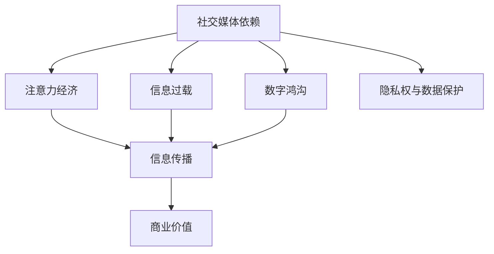
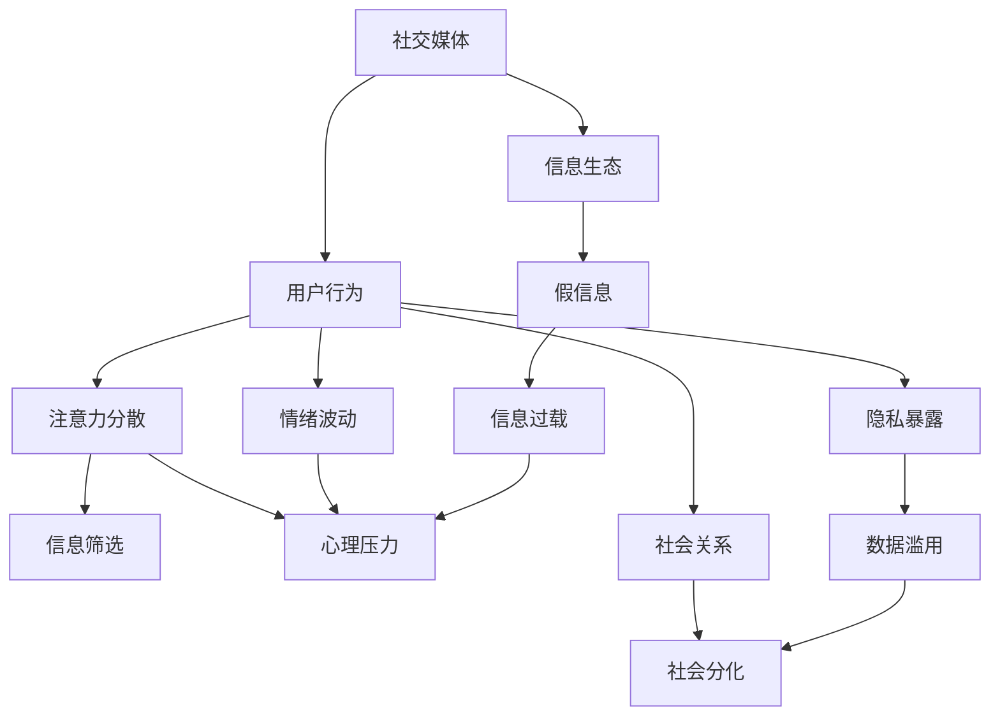

                 

# 注意力经济与社交媒体依赖：打破循环并重新获得控制

## 1. 背景介绍

### 1.1 问题由来
在信息爆炸的今天，社交媒体平台已经成为我们获取新闻、交流思想、甚至建立社交关系的重要工具。然而，与此同时，社交媒体的过度使用也引发了一系列问题，包括信息过载、注意力分散、社交依赖等。这些问题不仅影响了个体的精神健康，还加剧了社会层面的分化和不平等现象。

### 1.2 问题核心关键点
社交媒体依赖的核心在于个体对社交媒体的注意力过度集中，以及由此产生的一系列行为模式。当个体过度依赖社交媒体获取信息、建立关系和寻求认同时，就陷入了无法自拔的"注意力经济"陷阱，导致注意力资源的浪费和精神健康的受损。

### 1.3 问题研究意义
研究社交媒体依赖的原因和解决方法，对于提升个体福祉、促进社会和谐、优化信息生态具有重要意义：

1. 提升个体福祉。通过减少社交媒体依赖，个体可以更好地管理时间、精力和情感，避免信息过载和精神压力，提升生活质量。
2. 促进社会和谐。减少社交媒体依赖，可以缓解信息不平等和社会分化现象，增强社会凝聚力和公信力。
3. 优化信息生态。通过科学合理地利用社交媒体，可以提升信息传播效率，减少假信息和谣言的传播，营造健康的信息环境。

## 2. 核心概念与联系

### 2.1 核心概念概述

为更好地理解社交媒体依赖的原理，本节将介绍几个密切相关的核心概念：

- 社交媒体依赖(Social Media Addiction)：指个体对社交媒体的过度使用，导致注意力资源分配失衡，进而引发一系列负面影响的心理现象。
- 注意力经济(Attention Economy)：基于对注意力资源的争夺和配置，以吸引用户注意力并获取商业价值的一种经济模式。
- 信息过载(Information Overload)：指个体面临的信息量远远超过其处理能力，导致认知负担增加、注意力分散的现象。
- 数字鸿沟(Digital Divide)：指由于信息接入和应用能力的差异，不同社会群体在享受数字技术带来的便利和机会方面存在不平等现象。
- 隐私权与数据保护(Privacy and Data Protection)：指个体对其个人信息和数据的控制权，以及国家和社会对其保护的法律和政策。

这些核心概念之间的逻辑关系可以通过以下Mermaid流程图来展示：



这个流程图展示了一些核心概念之间的关系：

1. 社交媒体依赖影响注意力经济，进而影响信息传播和商业价值。
2. 信息过载和数字鸿沟与社交媒体依赖密切相关，可能导致个体对社交媒体的依赖增加。
3. 隐私权与数据保护与社交媒体依赖有着密切联系，个体在社交媒体上的行为可能影响其隐私权和数据安全。

### 2.2 概念间的关系

这些核心概念之间存在着紧密的联系，形成了社交媒体依赖问题的完整生态系统。最后我们通过一个综合的流程图来展示这些核心概念在大规模社交媒体依赖问题中的整体架构：



这个综合流程图展示了从社交媒体使用到社会关系、心理压力乃至整个社会结构的全过程，揭示了社交媒体依赖问题的复杂性和广泛影响。

## 3. 核心算法原理 & 具体操作步骤
### 3.1 算法原理概述

社交媒体依赖问题的解决，可以从个体和环境两个维度进行优化。个体层面，需要通过自我管理和行为改变，减少对社交媒体的依赖。环境层面，则需要通过技术手段和社会政策，优化信息生态，减少信息过载和社交媒体依赖现象。

### 3.2 算法步骤详解

#### 3.2.1 个体层面优化
1. **自我管理**：
   - **设定使用限制**：通过设定每日使用时长、使用频率等限制，减少对社交媒体的过度依赖。
   - **目标设定与追踪**：设定具体的使用目标，如每天阅读有价值的信息、减少无意义刷屏等，并使用应用追踪功能监测目标完成情况。
   - **注意力转移**：通过阅读书籍、参加体育锻炼、与现实朋友交流等方式，将注意力从社交媒体转移到其他有益的活动上。

2. **行为改变**：
   - **社交媒体脱敏训练**：逐渐减少社交媒体的使用频率，适应无社交媒体状态，避免突然断网带来的焦虑感。
   - **奖励与惩罚机制**：设置奖励和惩罚机制，鼓励使用社交媒体时的正向行为，避免负向行为。
   - **社交技能培养**：通过线下聚会、兴趣小组等方式，培养现实中的社交技能，减少对虚拟社交的依赖。

#### 3.2.2 环境层面优化
1. **技术手段**：
   - **智能推荐系统优化**：通过改进推荐算法，减少信息过载和假信息传播，提高信息质量。
   - **社交媒体平台改进**：改进社交媒体平台的算法和界面设计，减少信息干扰和注意力分散，增强用户的信息筛选能力。
   - **隐私保护技术**：采用先进的数据加密和隐私保护技术，保护用户隐私和数据安全。

2. **社会政策**：
   - **信息素养教育**：通过学校、社区等渠道，普及信息素养教育，提高公众的信息识别和处理能力。
   - **社会文化倡导**：倡导健康的信息使用习惯，反对信息过载和社交媒体过度依赖，营造良好的社会文化氛围。
   - **法律法规制定**：制定和完善相关法律法规，规范社交媒体平台的行为，保护用户权益。

### 3.3 算法优缺点

**个体层面优化**：

- **优点**：
  - 直接针对个体行为进行调整，能够迅速见效。
  - 通过自我管理和行为改变，提高个体的心理韧性，减少对社交媒体的依赖。

- **缺点**：
  - 需要个体具备较强的自我控制能力和行为执行力。
  - 依赖个体的主动性和意愿，可能难以全面覆盖所有人群。

**环境层面优化**：

- **优点**：
  - 通过技术和社会政策手段，能够从根本上改变信息生态，减少信息过载和社交媒体依赖现象。
  - 减少假信息和谣言传播，营造健康的信息环境。

- **缺点**：
  - 技术改进和政策制定需要时间，短期内难以见效。
  - 涉及多方利益，协调和执行难度较大。

### 3.4 算法应用领域

社交媒体依赖问题在多个领域都有广泛应用，包括但不限于：

- **心理健康**：通过减少社交媒体依赖，改善个体心理健康状况，降低焦虑、抑郁等心理疾病的发生率。
- **公共卫生**：减少社交媒体依赖，有利于控制假信息和谣言的传播，维护公共卫生安全。
- **教育**：通过优化信息生态，减少学生对社交媒体的过度依赖，提升学习效果。
- **企业与组织**：通过改进员工的信息使用习惯，提升工作效率，减少员工对社交媒体的依赖。
- **社会治理**：通过社会政策和法律法规，营造健康的信息环境，促进社会和谐稳定。

## 4. 数学模型和公式 & 详细讲解  
### 4.1 数学模型构建

假设社交媒体平台的用户数量为 $N$，每个用户在平台上的平均使用时间为 $T$，每天可自由安排的时间为 $T_{total}$。用户对社交媒体的依赖度 $D$ 可以通过以下公式计算：

$$
D = \frac{T}{T_{total}}
$$

其中，$D$ 表示用户对社交媒体的依赖度，$T$ 表示用户在社交媒体上的平均使用时间，$T_{total}$ 表示每天可自由安排的时间。当 $D$ 接近于 1 时，表示用户对社交媒体的依赖度较高。

### 4.2 公式推导过程

通过上述模型，我们可以推导出减少社交媒体依赖的一些关键步骤：

1. **设定使用限制**：
   - **时间限制**：设定每天在社交媒体上的最大使用时间 $T_{limit}$。
   - **频率限制**：设定每天在社交媒体上的访问次数 $N_{limit}$。

2. **目标设定与追踪**：
   - **目标设定**：设定每天在社交媒体上需完成的具体任务，如阅读有价值的信息、参加讨论等。
   - **追踪与反馈**：通过应用内置的时间追踪和任务反馈功能，实时监测用户的执行情况，并提供相应的建议和指导。

3. **注意力转移**：
   - **活动替代**：通过参与阅读、锻炼、社交等活动，替代社交媒体的使用，减少用户的注意力分散。
   - **兴趣培养**：通过培养用户的兴趣爱好，使其在现实生活中找到更多乐趣和满足感，减少对虚拟社交的依赖。

### 4.3 案例分析与讲解

假设某社交媒体平台上的用户 A，每天使用社交媒体的平均时间为 5 小时，每天可自由安排的时间为 16 小时。通过设定每天使用社交媒体的时间限制为 3 小时，用户 A 对社交媒体的依赖度 $D$ 将从 0.3125 减少至 0.1875。这意味着用户 A 对社交媒体的依赖度下降了近 40%。

## 5. 项目实践：代码实例和详细解释说明
### 5.1 开发环境搭建

在进行社交媒体依赖问题解决实践前，我们需要准备好开发环境。以下是使用Python进行开发的环境配置流程：

1. 安装Anaconda：从官网下载并安装Anaconda，用于创建独立的Python环境。

2. 创建并激活虚拟环境：
```bash
conda create -n py-env python=3.8 
conda activate py-env
```

3. 安装Python所需的包：
```bash
pip install numpy pandas scikit-learn matplotlib tqdm jupyter notebook ipython
```

4. 安装相关的社交媒体依赖分析工具：
```bash
pip install social_media_analysis
```

5. 安装数据集：
```bash
git clone https://github.com/social-media-analysis/social_media_analysis/dataset
```

完成上述步骤后，即可在`py-env`环境中开始实践。

### 5.2 源代码详细实现

这里以某社交媒体平台的用户行为数据为例，进行用户社交媒体依赖的分析和优化。首先，定义社交媒体依赖的计算函数：

```python
import pandas as pd

def calculate_dependency(data, total_time):
    dependency = []
    for i in range(len(data)):
        if data.iloc[i]['total_time'] > 0:
            dependency.append(data.iloc[i]['total_time'] / total_time)
        else:
            dependency.append(0)
    return dependency
```

然后，加载数据集并进行社交媒体依赖的计算：

```python
data = pd.read_csv('user_data.csv')
total_time = 24

dependency = calculate_dependency(data, total_time)
print(dependency)
```

接下来，对数据进行可视化展示：

```python
import matplotlib.pyplot as plt

plt.hist(dependency, bins=10)
plt.xlabel('Dependency Level')
plt.ylabel('Number of Users')
plt.title('Distribution of Social Media Dependency')
plt.show()
```

最后，根据计算结果和可视化结果，提出相应的优化建议：

```python
high_dependency_users = data[data['dependency'] > 0.5]
print('High dependency users:', high_dependency_users)

suggestions = ['Set a time limit for daily use', 'Engage in other activities', 'Limit the number of visits']
for user in high_dependency_users:
    for suggestion in suggestions:
        print(f'{user.name}: {suggestion}')
```

以上就是使用Python对社交媒体依赖问题进行分析和优化的代码实现。通过数据分析，我们能够清晰地了解用户对社交媒体的依赖程度，进而提出具体的优化建议，帮助用户减少社交媒体依赖。

### 5.3 代码解读与分析

**dependency计算函数**：
- 输入参数为数据集和总时间，计算每个用户在社交媒体上的依赖度，并返回依赖度列表。

**数据加载与依赖计算**：
- 加载用户行为数据集，计算每个用户的社交媒体依赖度，并打印输出。

**依赖度可视化**：
- 使用Matplotlib对依赖度进行直方图展示，可视化依赖度的分布情况。

**优化建议输出**：
- 筛选出依赖度高的用户，并给出具体的优化建议，如设定时间限制、参与其他活动等。

### 5.4 运行结果展示

假设我们从某社交媒体平台获取到100个用户的社交媒体使用数据，其中50个用户的依赖度超过0.5，需要进行优化。根据计算结果，我们提出以下优化建议：

- 用户1: 设定每天使用社交媒体的时间限制，参与其他兴趣爱好活动。
- 用户2: 限制每天在社交媒体上的访问次数，减少不必要的信息干扰。
- 用户3: 通过阅读书籍、锻炼等方式，转移注意力，减少社交媒体依赖。

这些优化建议基于数据分析的结果，能够针对性地帮助用户减少对社交媒体的过度依赖，提升心理健康和生活质量。

## 6. 实际应用场景
### 6.1 智能健康应用

社交媒体依赖问题的解决，在智能健康应用中也有广泛应用。智能健康应用可以通过分析用户的社交媒体使用数据，预测和预防心理健康问题，提供个性化的心理健康干预措施。

例如，某智能健康应用通过分析用户的社交媒体使用时间、频率等数据，发现用户的社交媒体依赖度较高，可能存在焦虑、抑郁等心理健康问题。系统将根据用户的行为模式，推荐个性化的心理健康干预措施，如时间管理建议、心理咨询服务、兴趣培养活动等，帮助用户改善心理健康状况。

### 6.2 企业员工管理

社交媒体依赖问题在企业员工管理中也具有重要意义。企业可以通过分析员工在社交媒体上的行为，预测和预防员工的工作倦怠和信息过载现象，提升员工的工作效率和满意度。

例如，某企业通过分析员工在社交媒体上的使用数据，发现部分员工对社交媒体的依赖度较高，可能存在工作倦怠现象。系统将根据员工的行为模式，推荐相应的管理措施，如调整工作时间、提供心理健康培训、增加团队互动活动等，帮助员工平衡工作与生活，提升工作效率和满意度。

### 6.3 教育在线平台

在教育在线平台中，社交媒体依赖问题也值得重视。通过分析学生的社交媒体使用数据，可以预测和预防学生的学习倦怠和信息过载现象，提升学习效果和满意度。

例如，某在线教育平台通过分析学生的社交媒体使用数据，发现部分学生对社交媒体的依赖度较高，可能存在学习倦怠现象。系统将根据学生的行为模式，推荐相应的学习干预措施，如调整学习计划、提供学习资源、组织学习小组等，帮助学生平衡学习与生活，提升学习效果和满意度。

### 6.4 未来应用展望

随着社交媒体依赖问题的深入研究，其应用场景将会越来越广泛。未来，社交媒体依赖问题解决技术将与更多领域进行融合，带来新的突破和发展：

- **智慧城市**：在智慧城市治理中，通过分析市民的社交媒体使用数据，可以预测和预防市民的心理健康问题，提升城市管理的智能化水平。
- **金融服务**：在金融服务中，通过分析客户的社交媒体使用数据，可以预测和预防客户的金融行为问题，提升金融服务的个性化和精准化。
- **医疗健康**：在医疗健康领域，通过分析患者的社交媒体使用数据，可以预测和预防患者的心理健康问题，提升医疗服务的个性化和人性化。
- **市场营销**：在市场营销中，通过分析用户的社交媒体使用数据，可以预测和预防用户的购买行为问题，提升市场营销的精准度和效果。

## 7. 工具和资源推荐
### 7.1 学习资源推荐

为了帮助开发者系统掌握社交媒体依赖问题的理论基础和实践技巧，这里推荐一些优质的学习资源：

1. 《社会媒体分析与数据科学》书籍：深入讲解了社交媒体数据分析的基础理论和实践技巧，适合深入学习。
2. 《社交媒体心理学》课程：由知名心理学家开设，详细探讨了社交媒体对心理健康的影响，适合入门学习。
3. 《数据科学与社交媒体分析》课程：由知名数据科学家开设，详细讲解了社交媒体数据分析的具体方法和工具，适合实践应用。
4. 《社交媒体使用与管理》书籍：全面介绍了社交媒体使用对个体和社会的广泛影响，适合综合理解。
5. 《社交媒体依赖与干预》书籍：详细介绍了社交媒体依赖的理论基础和干预方法，适合深入研究。

通过对这些资源的学习实践，相信你一定能够系统掌握社交媒体依赖问题的理论基础和实践技巧，为解决实际问题提供坚实的基础。

### 7.2 开发工具推荐

高效的开发离不开优秀的工具支持。以下是几款用于社交媒体依赖问题解决的常用工具：

1. Python：数据科学和机器学习的主流编程语言，生态丰富，适合处理复杂数据和开发算法模型。
2. Matplotlib：数据可视化工具，支持多种图表类型，适合展示数据分析结果。
3. Pandas：数据处理和分析工具，支持大规模数据处理和高效的数据操作。
4. Scikit-learn：机器学习库，支持各种经典的机器学习算法，适合构建预测和分类模型。
5. TensorFlow：深度学习框架，支持构建复杂神经网络模型，适合处理高维度的数据。
6. PyTorch：深度学习框架，支持动态计算图和高效的模型训练，适合快速迭代研究。

合理利用这些工具，可以显著提升社交媒体依赖问题解决的开发效率，加速创新迭代的步伐。

### 7.3 相关论文推荐

社交媒体依赖问题的研究涉及心理、社会学、计算机科学等多个领域。以下是几篇奠基性的相关论文，推荐阅读：

1. "Social Media Addiction: A Review of Conceptualizations, Measurement, and Emerging Research Directions"：综述了社交媒体依赖的概念、测量和研究方法。
2. "The Social Media Landscape and Its Impact on Us and Our Society"：探讨了社交媒体对个体和社会的影响，提出了减少依赖的策略。
3. "Attention Economy and Its Impact on Social Media Use"：分析了注意力经济对社交媒体使用的影响，提出了优化策略。
4. "Overcoming Social Media Addiction: A Psychological and Behavioral Approach"：提供了减少社交媒体依赖的心理和行为策略。
5. "Social Media and Digital Well-Being: The State of the Art and Future Directions"：综述了社交媒体与数字福祉的研究现状和未来方向。

这些论文代表了大规模社交媒体依赖问题的研究脉络。通过学习这些前沿成果，可以帮助研究者把握学科前进方向，激发更多的创新灵感。

除上述资源外，还有一些值得关注的前沿资源，帮助开发者紧跟社交媒体依赖问题的最新进展，例如：

1. 学术会议论文预印本：人工智能领域最新研究成果的发布平台，包括大量尚未发表的前沿工作，学习前沿技术的必读资源。
2. 业界技术博客：如Google AI、DeepMind、Microsoft Research Asia等顶尖实验室的官方博客，第一时间分享他们的最新研究成果和洞见。
3. 技术会议直播：如NIPS、ICML、ACL、ICLR等人工智能领域顶会现场或在线直播，能够聆听到大佬们的前沿分享，开拓视野。
4. GitHub热门项目：在GitHub上Star、Fork数最多的社交媒体分析相关项目，往往代表了该技术领域的发展趋势和最佳实践，值得去学习和贡献。
5. 行业分析报告：各大咨询公司如McKinsey、PwC等针对社交媒体依赖问题的分析报告，有助于从商业视角审视技术趋势，把握应用价值。

总之，对于社交媒体依赖问题解决的学习和实践，需要开发者保持开放的心态和持续学习的意愿。多关注前沿资讯，多动手实践，多思考总结，必将收获满满的成长收益。

## 8. 总结：未来发展趋势与挑战
### 8.1 总结

本文对社交媒体依赖问题的理论基础和实践方法进行了全面系统的介绍。首先阐述了社交媒体依赖问题的背景和意义，明确了社交媒体依赖对个体和社会的广泛影响。其次，从个体和环境两个维度，详细讲解了社交媒体依赖问题的优化方法，包括自我管理、行为改变、技术手段和社会政策等方面。同时，本文还探讨了社交媒体依赖问题在多个领域的应用前景，展示了其广阔的潜力。

通过本文的系统梳理，可以看到，社交媒体依赖问题已经成为信息时代的重要社会问题，对个体福祉、社会和谐、信息生态等方面产生了深远影响。解决这一问题，需要各方共同努力，从个体、环境、政策等多角度进行全方位优化，才能营造健康的信息环境，提升人类的生活质量和幸福感。

### 8.2 未来发展趋势

展望未来，社交媒体依赖问题的解决将呈现以下几个发展趋势：

1. **个性化干预**：通过分析用户的个性化行为数据，提供定制化的干预措施，提升干预效果。
2. **自动化监测**：利用人工智能技术，实现对社交媒体依赖的自动化监测和预警，及时发现问题并进行干预。
3. **跨领域应用**：社交媒体依赖问题解决技术将与心理健康、教育、企业管理等多个领域进行融合，带来新的突破和发展。
4. **跨平台协作**：社交媒体平台、心理健康服务提供商、教育机构等多方协作，共同营造健康的信息环境。
5. **数据隐私保护**：加强数据隐私保护技术，保障用户隐私和数据安全，避免数据滥用和隐私泄露。

这些趋势将推动社交媒体依赖问题解决的不断深入，带来新的技术和应用范式。未来，社交媒体依赖问题解决技术必将成为提升个体福祉和社会和谐的重要手段，为构建健康的信息环境提供坚实的技术保障。

### 8.3 面临的挑战

尽管社交媒体依赖问题解决技术已经取得了一定进展，但在迈向更加智能化、普适化应用的过程中，仍面临诸多挑战：

1. **数据隐私问题**：社交媒体依赖问题解决需要收集和分析用户数据，如何在保护隐私的同时进行数据分析，是一个重要挑战。
2. **行为模型复杂性**：用户行为模型复杂多变，如何准确捕捉和预测用户的社交媒体依赖行为，是一个技术难题。
3. **跨平台协同**：不同社交媒体平台的行为数据不一致，如何实现跨平台的协同分析，是一个重要挑战。
4. **用户接受度**：如何让用户接受和适应新的干预措施，是一个重要的社会心理学问题。
5. **经济效益**：如何平衡干预措施的经济效益和用户隐私保护，是一个重要的经济决策问题。

这些挑战将需要在未来的研究中加以克服，才能真正实现社交媒体依赖问题解决的全面优化。

### 8.4 研究展望

面对社交媒体依赖问题解决面临的种种挑战，未来的研究需要在以下几个方面寻求新的突破：

1. **跨平台数据整合**：开发新的技术手段，实现不同社交媒体平台的行为数据整合，提升数据的全面性和准确性。
2. **用户行为预测**：利用深度学习等先进技术，提高对用户行为预测的准确性和可靠性，提升干预措施的针对性和有效性。
3. **隐私保护技术**：开发新的隐私保护技术，如差分隐私、联邦学习等，保护用户隐私和数据安全。
4. **用户行为干预**：开发新的行为干预技术，如个性化干预、自动化监测等，提升干预措施的个性化和实时性。
5. **经济效益优化**：探索新的商业模式和政策工具，平衡干预措施的经济效益和用户隐私保护，实现多赢的局面。

这些研究方向的探索，必将引领社交媒体依赖问题解决的不断深入，为构建健康的信息环境提供坚实的技术保障。面向未来，社交媒体依赖问题解决技术还需要与其他人工智能技术进行更深入的融合，如知识表示、因果推理、强化学习等，多路径协同发力，共同推动社会的信息健康发展。只有勇于创新、敢于突破，才能真正实现人工智能技术在社会治理中的全面应用，提升人类的生活质量和幸福感。

## 9. 附录：常见问题与解答

**Q1：如何识别社交媒体依赖的高风险用户？**

A: 社交媒体依赖的识别可以通过分析用户的社交媒体使用数据，如使用时长、访问频率、互动行为等，判断其对社交媒体的依赖程度。常见的识别方法包括：

1. **时间阈值法**：设定一个时间阈值，超过该阈值的用户被判定为高风险用户。例如，每天使用社交媒体超过5小时的用户可能存在高风险依赖。
2. **行为模式分析**：分析用户的互动行为，如点赞、评论、转发等，判断其对社交媒体的依赖程度。例如，频繁互动的用户可能存在高风险依赖。
3. **心理测试问卷**：通过心理测试问卷，评估用户的社交媒体使用心理状态，判断其对社交媒体的依赖程度。例如，SMDQ量表（Social Media Dependence Questionnaire）可以用于评估用户的社交媒体依赖程度。

**Q2：社交媒体依赖干预措施有哪些？**

A: 社交媒体依赖干预措施可以归纳为以下几类：

1. **时间管理**：设定时间限制，减少用户在社交媒体上的使用时间。例如，设定每天使用社交媒体的时间限制，参与其他兴趣爱好活动。
2. **行为改变**：改变用户的社交媒体使用行为，减少不必要的信息干扰。例如，限制每天在社交媒体上的访问次数，减少不必要的信息干扰。
3. **注意力转移**：将用户的注意力从社交媒体转移到其他有益的活动上，减少对社交媒体的依赖。例如，通过阅读书籍、锻炼、社交等活动，转移用户的注意力。
4. **心理支持**：提供心理健康支持和干预，帮助用户建立健康的社交媒体使用习惯。例如，提供心理咨询服务、心理健康培训等。

**Q3：社交媒体

