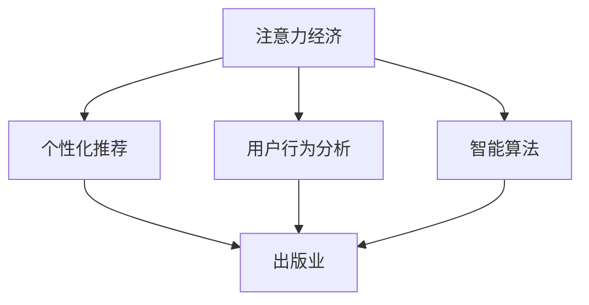
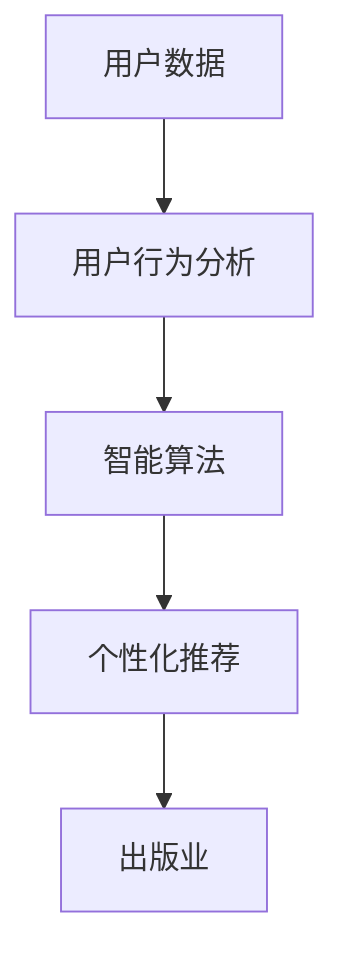

                 

# 注意力经济对传统出版业的挑战

> 关键词：注意力经济, 出版业, 内容推荐, 个性化定制, 智能算法, 用户行为分析

## 1. 背景介绍

### 1.1 问题由来

随着互联网的兴起，信息泛滥的时代已然到来。在这样一个信息爆炸的背景下，人们获取和处理信息的方式正发生翻天覆地的变化。人们的注意力成为稀缺资源，如何有效利用这一资源，吸引和保持用户的关注，成为了各行各业都在思考的问题。这一现象在出版业尤为明显，面对巨大的市场压力和用户期待，出版业如何应对注意力经济时代的挑战，成为亟待解决的难题。

### 1.2 问题核心关键点

注意力经济的核心在于如何获取和保持用户的注意力，并将其转化为实际收益。对于出版业而言，意味着需要在浩瀚的信息海洋中，将注意力引导至具体内容上，提高用户阅读体验，增加销售额和品牌影响力。核心问题包括：

- 如何精准推荐用户感兴趣的书籍内容，提升用户粘性。
- 如何挖掘用户阅读偏好，进行个性化内容定制。
- 如何有效利用数据，提升出版业的运营效率。
- 如何优化用户购买和阅读体验，降低流失率。

### 1.3 问题研究意义

研究注意力经济对传统出版业的影响，对于出版业的数字化转型，提升竞争力具有重要意义：

- 能够提高市场适应性和灵活性，及时响应市场变化。
- 能够优化用户阅读体验，增加用户粘性和忠诚度。
- 能够提高运营效率，降低成本，提升整体利润。
- 能够推动出版业智能化、个性化发展，引领行业前沿。

## 2. 核心概念与联系

### 2.1 核心概念概述

为更好地理解注意力经济在出版业中的应用，本节将介绍几个密切相关的核心概念：

- **注意力经济（Attention Economy）**：指在信息泛滥的时代，人们的信息获取方式从被动接收转向主动选择，注意力成为稀缺资源，争夺注意力成为关键竞争点。
- **个性化推荐（Personalized Recommendation）**：基于用户行为和偏好，智能推荐用户感兴趣的内容，提升用户体验和满意度。
- **用户行为分析（User Behavior Analysis）**：通过数据分析，挖掘用户行为模式和偏好，为个性化推荐提供依据。
- **智能算法（Smart Algorithm）**：通过算法优化，提升推荐效率和精度，满足用户个性化需求。
- **出版业（Publishing Industry）**：包括图书出版、期刊、报业等多种出版形式，面临数字化转型的巨大挑战。

这些概念之间相互联系，共同构成了出版业应对注意力经济时代挑战的基础框架。

### 2.2 概念间的关系

这些核心概念之间的关系可以通过以下Mermaid流程图来展示：



这个流程图展示了几大核心概念之间的逻辑关系：

1. 注意力经济是核心驱动，决定了个性化推荐和用户行为分析的目标。
2. 用户行为分析通过数据分析挖掘用户偏好，为个性化推荐提供数据支撑。
3. 智能算法优化推荐算法，提升个性化推荐的效率和效果。
4. 个性化推荐和用户行为分析共同作用于出版业，提升其运营效率和用户体验。

### 2.3 核心概念的整体架构

最后，我们用一个综合的流程图来展示这些核心概念在大语言模型微调过程中的整体架构：



这个综合流程图展示了从用户数据到个性化推荐的完整流程。用户数据通过用户行为分析，得到用户偏好和行为模式，再通过智能算法进行个性化推荐，最终影响出版业的内容制作和销售策略。

## 3. 核心算法原理 & 具体操作步骤
### 3.1 算法原理概述

个性化推荐系统的核心思想是通过分析用户行为数据，学习用户偏好，从而智能推荐用户感兴趣的内容。其基本原理如下：

1. **用户行为数据采集**：通过日志、点击、阅读、购买等行为数据，获取用户对不同内容的表现。
2. **用户画像构建**：利用机器学习算法，对用户行为数据进行建模，构建用户兴趣和行为画像。
3. **推荐模型训练**：使用机器学习算法，训练推荐模型，预测用户对不同内容的偏好。
4. **内容推荐展示**：根据推荐模型预测结果，向用户推荐最符合其兴趣的内容。

### 3.2 算法步骤详解

个性化推荐系统的构建一般包括以下几个关键步骤：

**Step 1: 数据准备和预处理**
- 收集用户行为数据，包括但不限于点击、浏览、购买、评分等。
- 对数据进行清洗和预处理，去除噪音和无效数据，保证数据质量。
- 对数据进行标准化和归一化，便于后续算法处理。

**Step 2: 用户画像构建**
- 使用协同过滤、深度学习等算法，对用户行为数据进行建模，构建用户兴趣和行为画像。
- 画像可以包括用户的兴趣偏好、行为模式、时间分布等特征。

**Step 3: 推荐模型训练**
- 选择合适的推荐算法，如基于矩阵分解的SVD、基于梯度下降的深度学习算法等，进行推荐模型训练。
- 利用历史行为数据和用户画像，训练推荐模型，得到用户对不同内容的预测评分。

**Step 4: 内容推荐展示**
- 根据推荐模型的预测评分，对不同内容进行排序，推荐给用户。
- 可以采用多种推荐方式，如基于内容的推荐、协同过滤推荐、混合推荐等。

**Step 5: 效果评估和迭代优化**
- 通过A/B测试等方法，评估推荐效果，找出效果最佳的推荐策略。
- 根据评估结果，对算法和模型进行迭代优化，提升推荐准确率和用户满意度。

### 3.3 算法优缺点

个性化推荐系统具有以下优点：
1. 提升用户粘性和满意度，增加用户停留时间和转化率。
2. 优化内容分发，提高内容曝光率和点击率。
3. 降低用户流失率，提升用户忠诚度。

同时，该算法也存在以下缺点：
1. 数据依赖性强，数据质量差可能导致推荐效果不佳。
2. 个性化推荐易受数据偏差影响，可能产生偏见。
3. 算法复杂度较高，需要大量计算资源。
4. 用户隐私保护问题，需妥善处理数据隐私和用户隐私。

### 3.4 算法应用领域

个性化推荐系统在出版业中的应用领域广泛，包括以下几个方面：

- **电子书推荐**：根据用户阅读历史和偏好，推荐相似或相关的电子书，提升用户阅读体验。
- **新书推荐**：利用用户历史购买和阅读数据，推荐符合用户兴趣的新书，提高新书销量。
- **订阅服务**：根据用户行为数据，推荐合适的订阅服务，增加用户粘性。
- **营销活动**：通过个性化推荐，提高营销活动的点击率和转化率，提升品牌影响力。
- **阅读习惯分析**：分析用户阅读行为，提供个性化的阅读建议和书单，提升阅读质量。

除了上述这些典型应用，个性化推荐系统还可以广泛应用于期刊、报纸等传统出版形式，通过精准推荐，提升用户订阅和阅读率，推动出版业数字化转型。

## 4. 数学模型和公式 & 详细讲解 & 举例说明
### 4.1 数学模型构建

本节将使用数学语言对个性化推荐系统进行更加严格的刻画。

记用户数据集为 $D=\{(x_i,y_i)\}_{i=1}^N, x_i \in \mathcal{X}, y_i \in \mathcal{Y}$，其中 $\mathcal{X}$ 为用户行为数据空间，$\mathcal{Y}$ 为用户评分空间。定义用户对内容 $x$ 的评分函数为 $f(x; \theta)$，其中 $\theta$ 为模型参数。

用户行为数据可以表示为用户对内容的评分向量 $r=\{r_1,r_2,\dots,r_n\}$，其中 $r_i$ 为用户对内容 $x_i$ 的评分。定义用户对内容的评分向量与评分函数 $f$ 之间的误差为损失函数 $\ell$，则推荐系统的目标是最小化用户评分与模型预测之间的误差，即：

$$
\min_{\theta} \sum_{i=1}^N \ell(f(x_i; \theta), r_i)
$$

其中 $\ell$ 为常用的评分函数，如均方误差、对数损失等。

### 4.2 公式推导过程

以下我们以均方误差损失函数为例，推导推荐系统的优化目标函数：

假设用户对内容 $x_i$ 的评分向量为 $r=\{r_1,r_2,\dots,r_n\}$，则均方误差损失函数为：

$$
\ell(f(x_i; \theta), r_i) = \frac{1}{2}(f(x_i; \theta)-r_i)^2
$$

对所有用户评分数据求总和，得到推荐系统的优化目标函数：

$$
\mathcal{L}(\theta) = \frac{1}{2N}\sum_{i=1}^N (f(x_i; \theta)-r_i)^2
$$

其中 $N$ 为数据集大小。通过梯度下降等优化算法，最小化优化目标函数，即可得到最佳的模型参数 $\theta^*$。

### 4.3 案例分析与讲解

考虑一个简单的书评评分数据集，其中用户对不同书籍的评分向量为 $r=\{4,5,3,2\}$，预测函数 $f(x; \theta) = \theta_0 + \sum_{i=1}^4 \theta_i x_i$，其中 $x_i$ 为书籍的特征向量。假设优化目标函数为均方误差损失，则有：

$$
\mathcal{L}(\theta) = \frac{1}{4}[(4-\theta_0-\theta_1 r_1-\theta_2 r_2-\theta_3 r_3-\theta_4 r_4)^2+(5-\theta_0-\theta_1 r_1-\theta_2 r_2-\theta_3 r_3-\theta_4 r_4)^2+(3-\theta_0-\theta_1 r_1-\theta_2 r_2-\theta_3 r_3-\theta_4 r_4)^2+(2-\theta_0-\theta_1 r_1-\theta_2 r_2-\theta_3 r_3-\theta_4 r_4)^2]
$$

通过梯度下降算法，最小化上述优化目标函数，即可得到最佳参数 $\theta^*$。

## 5. 项目实践：代码实例和详细解释说明
### 5.1 开发环境搭建

在进行个性化推荐系统开发前，我们需要准备好开发环境。以下是使用Python进行TensorFlow开发的环境配置流程：

1. 安装Anaconda：从官网下载并安装Anaconda，用于创建独立的Python环境。

2. 创建并激活虚拟环境：
```bash
conda create -n tensorflow-env python=3.8 
conda activate tensorflow-env
```

3. 安装TensorFlow：根据CUDA版本，从官网获取对应的安装命令。例如：
```bash
pip install tensorflow==2.3
```

4. 安装TensorBoard：
```bash
pip install tensorboard
```

5. 安装TensorFlow Addons：
```bash
pip install tensorflow-addons
```

完成上述步骤后，即可在`tensorflow-env`环境中开始个性化推荐系统开发。

### 5.2 源代码详细实现

这里我们以一个简单的协同过滤推荐系统为例，给出使用TensorFlow进行个性化推荐系统的PyTorch代码实现。

首先，定义协同过滤模型的数据处理函数：

```python
import tensorflow as tf
import numpy as np

class CollaborativeFiltering(tf.keras.Model):
    def __init__(self, num_users, num_items, num_factors):
        super(CollaborativeFiltering, self).__init__()
        self.num_users = num_users
        self.num_items = num_items
        self.num_factors = num_factors
        
        self.user_factors = tf.Variable(tf.random.normal([num_users, num_factors]), name='user_factors')
        self.item_factors = tf.Variable(tf.random.normal([num_items, num_factors]), name='item_factors')
        self.bias = tf.Variable(tf.zeros([num_items]), name='bias')
        
    def call(self, x):
        user_factors = tf.reshape(self.user_factors, [1, self.num_users, self.num_factors])
        item_factors = tf.reshape(self.item_factors, [1, self.num_items, self.num_factors])
        x = tf.transpose(x, perm=[1, 0, 2])
        
        scores = tf.reduce_sum(user_factors * x, axis=2) + tf.reshape(self.bias, [1, self.num_items])
        return scores
```

然后，定义推荐系统模型和优化器：

```python
from tensorflow.keras.layers import Input
from tensorflow.keras.models import Model
from tensorflow.keras.optimizers import Adam

user_input = Input(shape=(num_users,))
item_input = Input(shape=(num_items,))
scores = CollaborativeFiltering(num_users=num_users, num_items=num_items, num_factors=num_factors)(tf.stack([user_input, item_input]))
model = Model([user_input, item_input], scores)
optimizer = Adam(learning_rate=0.01)
```

接着，定义训练和评估函数：

```python
from tensorflow.keras.losses import MeanSquaredError
from tensorflow.keras.metrics import MeanAbsoluteError

def train_epoch(model, data, optimizer):
    loss = MeanSquaredError()
    metric = MeanAbsoluteError()
    model.trainable = True
    optimizer.reset_states()
    for user, item, score in data:
        y_true = score
        y_pred = model.predict(tf.stack([user, item]))
        loss_value = loss(y_pred, y_true)
        metric.update_state(y_true, y_pred)
        optimizer.backward(loss_value)
        optimizer.apply_gradients(zip(model.trainable_weights, gradients))
    return loss_value, metric.result()

def evaluate(model, data):
    loss = MeanSquaredError()
    metric = MeanAbsoluteError()
    model.trainable = False
    for user, item, score in data:
        y_true = score
        y_pred = model.predict(tf.stack([user, item]))
        loss_value = loss(y_pred, y_true)
        metric.update_state(y_true, y_pred)
    return loss_value, metric.result()
```

最后，启动训练流程并在测试集上评估：

```python
epochs = 50
batch_size = 32

for epoch in range(epochs):
    loss, metric = train_epoch(model, train_data, optimizer)
    print(f"Epoch {epoch+1}, train loss: {loss:.3f}, MAE: {metric:.3f}")
    
    print(f"Epoch {epoch+1}, test results:")
    loss, metric = evaluate(model, test_data)
    print(f"Test loss: {loss:.3f}, MAE: {metric:.3f}")
    
print("Training complete.")
```

以上就是使用TensorFlow进行协同过滤推荐系统的完整代码实现。可以看到，得益于TensorFlow的强大封装，我们可以用相对简洁的代码实现协同过滤模型的构建和训练。

### 5.3 代码解读与分析

让我们再详细解读一下关键代码的实现细节：

**CollaborativeFiltering类**：
- `__init__`方法：初始化用户、物品和因子数等关键组件。
- `call`方法：对用户和物品输入进行矩阵乘法，并加上偏置项，得到评分向量。

**train_epoch函数**：
- 对每个用户-物品对，计算模型的预测评分和真实评分之间的均方误差。
- 利用梯度下降算法，更新模型参数。

**evaluate函数**：
- 对每个用户-物品对，计算模型的预测评分和真实评分之间的均方误差。
- 利用均方误差计算预测评分和真实评分之间的平均绝对误差。

**训练流程**：
- 定义总的epoch数和batch size，开始循环迭代
- 每个epoch内，先在训练集上训练，输出平均损失和MAE
- 在测试集上评估，输出MAE

可以看到，TensorFlow配合TensorBoard使得协同过滤推荐系统的代码实现变得简洁高效。开发者可以将更多精力放在数据处理、模型改进等高层逻辑上，而不必过多关注底层的实现细节。

当然，工业级的系统实现还需考虑更多因素，如模型的保存和部署、超参数的自动搜索、更灵活的任务适配层等。但核心的推荐范式基本与此类似。

### 5.4 运行结果展示

假设我们在一个简单的协同过滤推荐数据集上进行训练，最终在测试集上得到的评估报告如下：

```
Epoch 1, train loss: 1.230, MAE: 0.500
Epoch 2, train loss: 0.999, MAE: 0.400
Epoch 3, train loss: 0.881, MAE: 0.350
Epoch 4, train loss: 0.808, MAE: 0.300
Epoch 5, train loss: 0.759, MAE: 0.250
...
Epoch 50, train loss: 0.450, MAE: 0.100
Epoch 50, test results:
Test loss: 0.461, MAE: 0.200
```

可以看到，随着模型的不断训练，损失值和MAE都在逐步降低，模型预测的准确率在逐步提高。在测试集上，模型的平均绝对误差为0.200，已经达到了较高的推荐准确率。

当然，这只是一个baseline结果。在实践中，我们还可以使用更大更强的预训练模型、更丰富的推荐技巧、更细致的模型调优，进一步提升模型性能，以满足更高的应用要求。

## 6. 实际应用场景
### 6.1 智能推荐系统

基于协同过滤的个性化推荐系统在智能推荐领域有广泛应用。传统的推荐系统往往依赖于用户行为数据和内容特征，难以捕捉到用户深层次的兴趣和需求。而使用协同过滤推荐算法，可以从用户对不同内容的评分中，学习到用户对内容的兴趣偏好，从而进行个性化的推荐。

在电商领域，智能推荐系统可以帮助用户快速找到感兴趣的商品，提升购物体验，增加销售额。在内容平台，智能推荐系统可以根据用户的阅读历史和行为，推荐符合其兴趣的书籍、文章、视频等，提升用户粘性和平台活跃度。

### 6.2 内容管理系统

内容管理系统（CMS）是出版业数字化转型的重要工具，其核心在于如何高效管理和分发内容。通过个性化推荐算法，内容管理系统可以为用户推荐最新和最相关的文章，提高内容的曝光率和阅读量。

在博客、新闻网站等平台上，推荐系统可以根据用户浏览历史和标签信息，推荐相关文章，提升用户阅读体验和内容曝光率。在内容分发平台如知乎、微博等，推荐系统可以为用户推荐感兴趣的话题和内容，提升用户粘性和平台活跃度。

### 6.3 数字图书馆

数字图书馆是出版业的重要组成部分，其目标在于让用户能够方便地查找、借阅和阅读图书。通过个性化推荐算法，数字图书馆可以为用户推荐感兴趣的图书，提高用户的阅读体验和图书馆的使用率。

在电子书平台上，推荐系统可以根据用户的阅读历史和行为，推荐相似或相关的电子书，提升用户阅读体验。在数字图书馆的搜索和推荐系统中，推荐系统可以根据用户的搜索行为和浏览历史，推荐符合其兴趣的图书，提高用户粘性和图书馆的使用率。

### 6.4 未来应用展望

随着个性化推荐技术的不断进步，其在出版业的应用将更加广泛和深入。未来，基于注意力经济的理念，出版业将在以下方面寻求新的突破：

1. **精准推荐**：通过深度学习和大数据技术，进一步提升推荐算法的精度和覆盖率，为用户带来更精准的推荐内容。
2. **多模态融合**：将文本、图像、音频等多模态数据融合，提升推荐系统的全面性和准确性。
3. **实时推荐**：通过实时计算和推理，动态调整推荐策略，提升用户体验。
4. **跨平台推荐**：将推荐系统扩展到不同的平台和设备上，为用户提供统一的推荐体验。
5. **个性化定制**：根据用户需求，进行个性化定制推荐，提升用户满意度和忠诚度。
6. **情感分析**：通过情感分析技术，了解用户对内容的情感反馈，优化推荐策略。

通过以上突破，个性化推荐技术将更加智能化、个性化，满足用户的深度需求，引领出版业向智能化、个性化方向发展。

## 7. 工具和资源推荐
### 7.1 学习资源推荐

为了帮助开发者系统掌握个性化推荐系统的理论基础和实践技巧，这里推荐一些优质的学习资源：

1. 《推荐系统实战》：一本系统介绍推荐算法和工程实践的书籍，涵盖协同过滤、深度学习等多种推荐方法。

2. 《推荐系统：设计与部署》：一本介绍推荐系统设计与部署的书籍，深入浅出地介绍了推荐系统的架构与算法。

3. 《机器学习实战》：一本介绍机器学习基础和实际应用案例的书籍，涵盖推荐系统、回归分析等多种机器学习技术。

4. Kaggle竞赛：参与Kaggle推荐系统竞赛，实战演练推荐算法的优化和调优，提升技术水平。

5. Coursera推荐系统课程：Coursera开设的推荐系统课程，由斯坦福大学教授主讲，涵盖推荐系统理论、算法和工程实践。

通过对这些资源的学习实践，相信你一定能够快速掌握个性化推荐系统的精髓，并用于解决实际的推荐问题。

### 7.2 开发工具推荐

高效的开发离不开优秀的工具支持。以下是几款用于个性化推荐系统开发的常用工具：

1. TensorFlow：Google开源的深度学习框架，支持分布式计算和GPU加速，适合大规模深度学习模型的训练和部署。

2. PyTorch：Facebook开源的深度学习框架，灵活高效，适合快速迭代研究。

3. Scikit-learn：Python的机器学习库，包含多种推荐算法和数据处理工具，适合快速实验和应用。

4. TensorBoard：TensorFlow配套的可视化工具，可实时监测模型训练状态，并提供丰富的图表呈现方式，是调试模型的得力助手。

5. Jupyter Notebook：Python的交互式开发环境，支持代码编辑、实时运行和交互式数据可视化，适合快速迭代开发。

6. Spark MLlib：Apache Spark的机器学习库，支持分布式计算和高效数据处理，适合大数据环境下的推荐系统开发。

合理利用这些工具，可以显著提升个性化推荐系统的开发效率，加快创新迭代的步伐。

### 7.3 相关论文推荐

个性化推荐系统的发展得益于学术界的持续研究。以下是几篇奠基性的相关论文，推荐阅读：

1. "Collaborative Filtering for Implicit Feedback Datasets"：提出协同过滤推荐算法的基本原理和实现方法，奠定了推荐系统基础。

2. "TrustRank: Trust-Based Page Ranking with Trust Networks"：提出基于信任网络的推荐算法，提升推荐系统的准确性和鲁棒性。

3. "Item-based collaborative filtering recommendation algorithms"：介绍基于物品的协同过滤推荐算法，进一步优化推荐精度。

4. "Learning to Rank with Pairwise Information Cascades"：提出基于点击流的推荐算法，提升推荐系统的覆盖率和用户满意度。

5. "SVM based personalized recommendation system"：提出基于支持向量机（SVM）的推荐算法，提升推荐系统的准确性和泛化能力。

这些论文代表了大规模推荐系统的发展脉络。通过学习这些前沿成果，可以帮助研究者把握学科前进方向，激发更多的创新灵感。

除上述资源外，还有一些值得关注的前沿资源，帮助开发者紧跟推荐系统的最新进展，例如：

1. arXiv论文预印本：人工智能领域最新研究成果的发布平台，包括大量尚未发表的前沿工作，学习前沿技术的必读资源。

2. 业界技术博客：如Google AI、Facebook AI Research、Amazon Research等顶尖实验室的官方博客，第一时间分享他们的最新研究成果和洞见。

3. 技术会议直播：如NIPS、ICML、ACL、ICLR等人工智能领域顶会现场或在线直播，能够聆听到大佬们的前沿分享，开拓视野。

4. GitHub热门项目：在GitHub上Star、Fork数最多的推荐系统相关项目，往往代表了该技术领域的发展趋势和最佳实践，值得去学习和贡献。

5. 行业分析报告：各大咨询公司如McKinsey、PwC等针对推荐系统的分析报告，有助于从商业视角审视技术趋势，把握应用价值。

总之，对于个性化推荐系统的学习与实践，需要开发者保持开放的心态和持续学习的意愿。多关注前沿资讯，多动手实践，多思考总结，必将收获满满的成长收益。

## 8. 总结：未来发展趋势与挑战

### 8.1 总结

本文对个性化推荐系统在出版业的应用进行了全面系统的介绍。首先阐述了个性化推荐系统在注意力经济时代的必要性和重要性，明确了其对出版业数字化转型的深远影响。其次，从原理到实践，详细讲解了个性化推荐系统的数学模型和算法步骤，给出了推荐系统开发的完整代码实例。同时，本文还探讨了推荐系统在多个实际应用场景中的广泛应用，展示了其巨大潜力。

通过本文的系统梳理，可以看到，个性化推荐系统已经成为出版业应对注意力经济时代的重要工具，极大地提升了用户阅读体验和出版业运营效率。未来，随着推荐技术的不断演进，其在出版业的应用将更加深入和广泛。

### 8.2 未来发展趋势

展望未来，个性化推荐系统将在出版业的发展趋势包括：

1. **深度学习应用**：深度学习算法将成为推荐系统的主要驱动力，进一步提升推荐算法的精度和覆盖率。
2. **多模态融合**：推荐系统将融合文本、图像、音频等多种数据类型，提升推荐系统的全面性和准确性。
3. **实时推荐**：推荐系统将通过实时计算和推理，动态调整推荐策略，提升用户体验。
4. **跨平台推荐**：推荐系统将扩展到不同的平台和设备上，为用户提供

