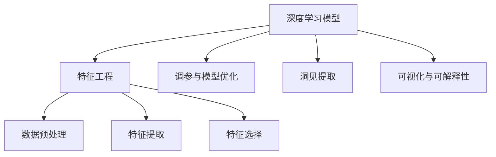
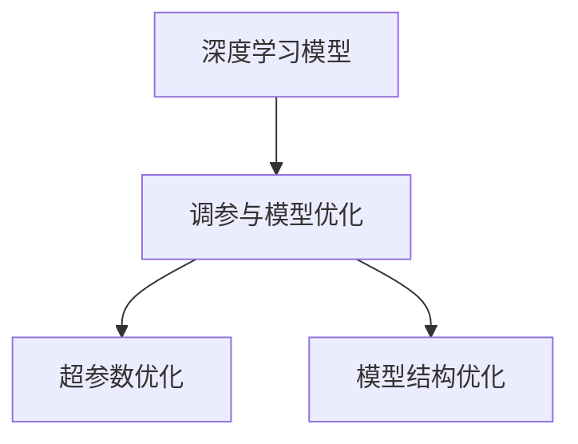
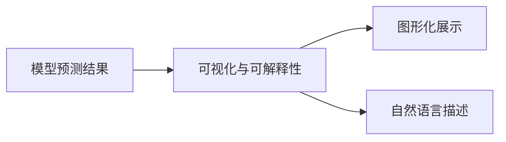
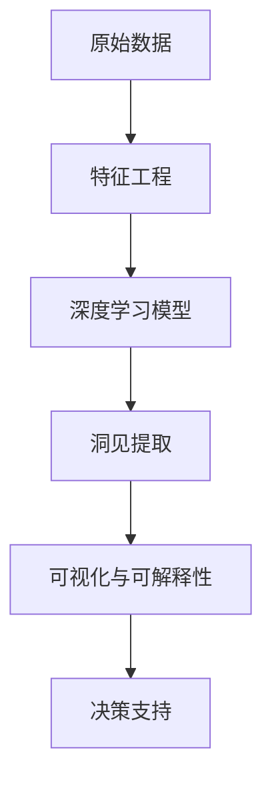

                 

# 洞见的价值：从理解到应用

> 关键词：洞见,数据驱动决策,深度学习,特征工程,自动化,可解释性

## 1. 背景介绍

### 1.1 问题由来
在数据驱动的时代，洞见（Insights）已成为决策者和分析师的必备利器。随着深度学习技术的日益成熟，数据科学家利用深度学习模型从海量数据中提取洞见，为业务决策提供了坚实的科学依据。从用户行为分析到市场趋势预测，从金融风险评估到医疗诊断，深度学习洞见在各个领域都发挥了重要作用。

然而，深度学习洞见的应用并非一帆风顺。一方面，深度学习的黑盒特性使得解释性不足，难以满足某些高风险领域的需求；另一方面，深度学习的复杂模型设计、调参和部署等环节，对专业人士的技术门槛要求较高，限制了深度学习洞见的大规模应用。因此，如何构建更易用、可解释、可推广的深度学习洞见模型，成为当前数据科学和技术研究的重要课题。

### 1.2 问题核心关键点
深度学习洞见的构建，本质上是将深度学习模型应用于大规模数据，通过数据驱动的方式，提取数据中潜在的结构性洞见。这一过程涉及以下几个关键步骤：

1. 数据收集与预处理：确保数据质量和多样性，构建有效的特征集。
2. 模型选择与训练：选择合适的深度学习模型，并通过大量标注数据进行训练，获得高质量的模型参数。
3. 特征工程与调参：优化模型结构和超参数，提升模型性能和泛化能力。
4. 洞见提取与应用：利用模型预测结果，进行洞见提取和可视化，辅助决策过程。
5. 模型评估与部署：评估模型性能，进行模型优化和部署，确保模型在实际应用中的稳定性和可扩展性。

这一过程的每一步都直接影响洞见的质量和可靠性，是深度学习洞见构建的核心环节。

### 1.3 问题研究意义
构建深度学习洞见模型，对于提升决策的科学性和准确性，推动数据驱动的业务创新，具有重要意义：

1. 降低决策风险：通过深度学习模型对海量数据进行客观分析，避免主观偏见和数据误差，为决策提供科学依据。
2. 优化资源配置：洞见模型能够发现数据中的潜在规律和趋势，优化资源分配，提升运营效率。
3. 促进技术应用：洞见模型为自动化决策提供了支持，推动人工智能技术在各行业的落地应用。
4. 提升竞争优势：拥有高质量的洞见模型，企业能够更快速响应市场变化，领先竞争对手。
5. 激发创新活力：洞见模型的应用能够揭示数据中的新洞见，推动业务模式的创新和变革。

通过理解深度学习洞见的构建过程，掌握其中的关键技术和策略，数据科学家可以构建更加高效、可解释、可推广的洞见模型，为业务决策提供强大的支持。

## 2. 核心概念与联系

### 2.1 核心概念概述

为更好地理解深度学习洞见的构建方法，本节将介绍几个密切相关的核心概念：

- 深度学习模型：一种通过多层次神经网络结构，自动学习数据特征的机器学习模型。包括卷积神经网络、循环神经网络、Transformer等，广泛应用于图像识别、自然语言处理、时间序列预测等任务。
- 特征工程：将原始数据转化为可供模型训练的特征集合，包括数据预处理、特征提取、特征选择等环节。特征工程是深度学习模型构建的重要基础。
- 调参与模型优化：调整深度学习模型的超参数和结构，优化模型性能和泛化能力，确保模型在不同数据集和应用场景中表现稳定。
- 洞见提取：利用深度学习模型对数据进行预测和分析，提取数据中的结构性洞见，如关联关系、趋势变化、异常点等。
- 可视化与可解释性：通过图形化展示和自然语言描述，将模型预测结果转化为易于理解的洞见，帮助决策者理解模型输出。

这些核心概念之间的逻辑关系可以通过以下Mermaid流程图来展示：



这个流程图展示了大数据驱动的深度学习洞见构建过程中的主要步骤：

1. 深度学习模型提供数据驱动的特征提取能力。
2. 特征工程通过数据预处理、特征提取、特征选择等环节，构建高质量的特征集。
3. 调参与模型优化通过调整超参数和模型结构，提升模型性能和泛化能力。
4. 洞见提取利用模型对数据进行预测和分析，提取数据中的结构性洞见。
5. 可视化与可解释性通过图形化展示和自然语言描述，将模型输出转化为易于理解的洞见。

这些概念共同构成了深度学习洞见构建的完整生态系统，使得深度学习洞见在各个领域得到了广泛应用。

### 2.2 概念间的关系

这些核心概念之间存在着紧密的联系，形成了深度学习洞见构建的完整流程。下面我们通过几个Mermaid流程图来展示这些概念之间的关系。

#### 2.2.1 数据驱动的洞见构建流程


这个流程图展示了深度学习洞见构建的基本流程：

1. 原始数据通过特征工程转化为高质量的特征集。
2. 使用深度学习模型对特征集进行训练，获得高质量的模型参数。
3. 利用模型对数据进行预测和分析，提取数据中的结构性洞见。
4. 通过图形化展示和自然语言描述，将模型输出转化为易于理解的洞见。

#### 2.2.2 调参与模型优化



这个流程图展示了调参与模型优化的关键环节：

1. 通过超参数优化，调整模型结构中的超参数，提升模型性能和泛化能力。
2. 通过模型结构优化，调整模型层次和网络拓扑，进一步提升模型效果。

#### 2.2.3 可视化与可解释性



这个流程图展示了可视化与可解释性的主要步骤：

1. 将模型预测结果通过图形化展示，直观呈现数据洞见。
2. 使用自然语言描述，将模型输出转化为易于理解的洞见。

### 2.3 核心概念的整体架构

最后，我们用一个综合的流程图来展示这些核心概念在大数据驱动的深度学习洞见构建过程中的整体架构：



这个综合流程图展示了从数据预处理到洞见提取再到决策支持的完整流程：

1. 原始数据通过特征工程转化为高质量的特征集。
2. 使用深度学习模型对特征集进行训练，获得高质量的模型参数。
3. 利用模型对数据进行预测和分析，提取数据中的结构性洞见。
4. 通过图形化展示和自然语言描述，将模型输出转化为易于理解的洞见。
5. 将洞见应用于决策支持，辅助业务决策过程。

通过这些流程图，我们可以更清晰地理解深度学习洞见构建过程中各个核心概念的关系和作用，为后续深入讨论具体的构建技术和策略奠定基础。

## 3. 核心算法原理 & 具体操作步骤
### 3.1 算法原理概述

深度学习洞见的构建，本质上是一个数据驱动的机器学习过程。其核心思想是：通过深度学习模型对大规模数据进行训练，自动学习数据中的复杂结构和关联关系，提取数据中的结构性洞见。

形式化地，假设原始数据为 $D=\{(x_i,y_i)\}_{i=1}^N, x_i \in \mathcal{X}, y_i \in \mathcal{Y}$，其中 $\mathcal{X}$ 为输入空间，$\mathcal{Y}$ 为输出空间。定义模型 $M_{\theta}$ 为深度学习模型，$\theta$ 为模型参数。

定义模型 $M_{\theta}$ 在数据样本 $(x,y)$ 上的损失函数为 $\ell(M_{\theta}(x),y)$，则在数据集 $D$ 上的经验风险为：

$$
\mathcal{L}(\theta) = \frac{1}{N} \sum_{i=1}^N \ell(M_{\theta}(x_i),y_i)
$$

微调的优化目标是最小化经验风险，即找到最优参数：

$$
\theta^* = \mathop{\arg\min}_{\theta} \mathcal{L}(\theta)
$$

通过梯度下降等优化算法，微调过程不断更新模型参数 $\theta$，最小化损失函数 $\mathcal{L}$，使得模型输出逼近真实标签。由于深度学习模型通常具有强大的特征提取和表示能力，即便在数据量较小的条件下，也能较快收敛到理想的模型参数 $\hat{\theta}$。

### 3.2 算法步骤详解

深度学习洞见的构建一般包括以下几个关键步骤：

**Step 1: 数据收集与预处理**
- 收集数据：从多个数据源获取原始数据，如用户行为日志、市场交易数据、社交媒体等。
- 数据清洗：去除噪声、处理缺失值、归一化等，确保数据质量和一致性。
- 数据划分：将数据划分为训练集、验证集和测试集，便于模型评估和调优。

**Step 2: 特征工程**
- 特征提取：通过提取、组合、转换等方式，将原始数据转化为特征集合，如文本特征、时间序列特征等。
- 特征选择：使用统计、模型、嵌入式方法等选择最有用的特征，减少特征维度，提升模型性能。

**Step 3: 模型选择与训练**
- 模型选择：根据任务类型选择合适的深度学习模型，如卷积神经网络、循环神经网络、Transformer等。
- 模型训练：使用大量标注数据对模型进行训练，优化模型参数，提升模型泛化能力。

**Step 4: 调参与模型优化**
- 超参数优化：通过网格搜索、随机搜索、贝叶斯优化等方法调整模型超参数，如学习率、批量大小、层数等。
- 模型结构优化：通过增加或减少网络层、调整网络拓扑等方式优化模型结构。

**Step 5: 洞见提取与应用**
- 洞见提取：利用训练好的模型对数据进行预测和分析，提取数据中的结构性洞见。
- 洞见可视化：将洞见转化为图形化展示，如散点图、折线图、热力图等，便于直观理解。
- 洞见应用：将洞见应用于业务决策过程，辅助决策者做出更加科学和高效的决策。

**Step 6: 模型评估与部署**
- 模型评估：在测试集上评估模型性能，如准确率、召回率、F1分数等，确保模型在实际应用中的效果。
- 模型部署：将训练好的模型封装为服务接口，部署到生产环境中，实时处理数据。

以上是深度学习洞见构建的一般流程。在实际应用中，还需要针对具体任务的特点，对构建过程的各个环节进行优化设计，如改进训练目标函数，引入更多的正则化技术，搜索最优的超参数组合等，以进一步提升模型性能。

### 3.3 算法优缺点

深度学习洞见构建方法具有以下优点：

1. 自动化特征提取：深度学习模型能够自动从原始数据中学习特征，无需人工干预，降低了特征工程的工作量。
2. 强大的泛化能力：深度学习模型在大规模数据上进行训练，具备较强的泛化能力和鲁棒性。
3. 高效的信息提取：深度学习模型能够自动提取数据中的复杂结构和关联关系，发现数据中的隐藏洞见。
4. 实时性：深度学习模型能够实时处理和分析数据，快速生成洞见。

同时，该方法也存在一定的局限性：

1. 数据依赖性强：深度学习模型的效果很大程度上取决于数据的质量和数量，获取高质量标注数据的成本较高。
2. 黑盒特性：深度学习模型通常难以解释其内部工作机制和决策逻辑，缺乏可解释性。
3. 计算资源消耗高：深度学习模型的训练和推理过程计算资源消耗高，对硬件要求较高。
4. 模型复杂度高：深度学习模型结构复杂，调试和优化难度大。
5. 数据隐私问题：深度学习模型在处理个人数据时，需要注意数据隐私和伦理问题。

尽管存在这些局限性，但就目前而言，深度学习洞见构建方法仍然是数据驱动决策的主流技术，具有重要的应用价值和潜力。未来相关研究的重点在于如何进一步降低深度学习洞见构建对标注数据的依赖，提高模型的可解释性和计算效率，同时兼顾数据隐私和伦理安全性等因素。

### 3.4 算法应用领域

深度学习洞见构建方法在各个领域都得到了广泛应用，例如：

- 金融风险评估：通过深度学习模型分析历史交易数据，预测市场风险和投资回报。
- 医疗诊断和治疗：利用深度学习模型分析患者数据，辅助医生进行疾病诊断和个性化治疗。
- 推荐系统：通过深度学习模型分析用户行为数据，推荐商品、音乐、视频等。
- 营销分析：通过深度学习模型分析消费者行为数据，优化营销策略和提升销售效果。
- 网络安全：通过深度学习模型分析网络流量数据，检测和防范网络攻击。
- 自然语言处理：通过深度学习模型分析文本数据，提取文本中的洞见，如情感分析、主题分析、实体识别等。

除了这些常见应用外，深度学习洞见构建技术还在更多场景中得到了创新性的应用，如可控生成、生成对抗网络、自监督学习等，为深度学习技术带来了新的突破。

## 4. 数学模型和公式 & 详细讲解  
### 4.1 数学模型构建

本节将使用数学语言对深度学习洞见构建过程进行更加严格的刻画。

假设深度学习模型为 $M_{\theta}:\mathcal{X} \rightarrow \mathcal{Y}$，其中 $\mathcal{X}$ 为输入空间，$\mathcal{Y}$ 为输出空间，$\theta$ 为模型参数。假设数据集为 $D=\{(x_i,y_i)\}_{i=1}^N, x_i \in \mathcal{X}, y_i \in \mathcal{Y}$。

定义模型 $M_{\theta}$ 在数据样本 $(x,y)$ 上的损失函数为 $\ell(M_{\theta}(x),y)$，则在数据集 $D$ 上的经验风险为：

$$
\mathcal{L}(\theta) = \frac{1}{N} \sum_{i=1}^N \ell(M_{\theta}(x_i),y_i)
$$

微调的优化目标是最小化经验风险，即找到最优参数：

$$
\theta^* = \mathop{\arg\min}_{\theta} \mathcal{L}(\theta)
$$

在实践中，我们通常使用基于梯度的优化算法（如SGD、Adam等）来近似求解上述最优化问题。设 $\eta$ 为学习率，$\lambda$ 为正则化系数，则参数的更新公式为：

$$
\theta \leftarrow \theta - \eta \nabla_{\theta}\mathcal{L}(\theta) - \eta\lambda\theta
$$

其中 $\nabla_{\theta}\mathcal{L}(\theta)$ 为损失函数对参数 $\theta$ 的梯度，可通过反向传播算法高效计算。

### 4.2 公式推导过程

以下我们以二分类任务为例，推导交叉熵损失函数及其梯度的计算公式。

假设模型 $M_{\theta}$ 在输入 $x$ 上的输出为 $\hat{y}=M_{\theta}(x) \in [0,1]$，表示样本属于正类的概率。真实标签 $y \in \{0,1\}$。则二分类交叉熵损失函数定义为：

$$
\ell(M_{\theta}(x),y) = -[y\log \hat{y} + (1-y)\log (1-\hat{y})]
$$

将其代入经验风险公式，得：

$$
\mathcal{L}(\theta) = -\frac{1}{N}\sum_{i=1}^N [y_i\log M_{\theta}(x_i)+(1-y_i)\log(1-M_{\theta}(x_i))]
$$

根据链式法则，损失函数对参数 $\theta_k$ 的梯度为：

$$
\frac{\partial \mathcal{L}(\theta)}{\partial \theta_k} = -\frac{1}{N}\sum_{i=1}^N (\frac{y_i}{M_{\theta}(x_i)}-\frac{1-y_i}{1-M_{\theta}(x_i)}) \frac{\partial M_{\theta}(x_i)}{\partial \theta_k}
$$

其中 $\frac{\partial M_{\theta}(x_i)}{\partial \theta_k}$ 可进一步递归展开，利用自动微分技术完成计算。

在得到损失函数的梯度后，即可带入参数更新公式，完成模型的迭代优化。重复上述过程直至收敛，最终得到适应下游任务的最优模型参数 $\theta^*$。

## 5. 项目实践：代码实例和详细解释说明
### 5.1 开发环境搭建

在进行洞见构建实践前，我们需要准备好开发环境。以下是使用Python进行PyTorch开发的环境配置流程：

1. 安装Anaconda：从官网下载并安装Anaconda，用于创建独立的Python环境。

2. 创建并激活虚拟环境：
```bash
conda create -n pytorch-env python=3.8 
conda activate pytorch-env
```

3. 安装PyTorch：根据CUDA版本，从官网获取对应的安装命令。例如：
```bash
conda install pytorch torchvision torchaudio cudatoolkit=11.1 -c pytorch -c conda-forge
```

4. 安装TensorFlow：
```bash
conda install tensorflow
```

5. 安装各类工具包：
```bash
pip install numpy pandas scikit-learn matplotlib tqdm jupyter notebook ipython
```

完成上述步骤后，即可在`pytorch-env`环境中开始洞见构建实践。

### 5.2 源代码详细实现

下面我们以金融风险评估任务为例，给出使用TensorFlow进行深度学习洞见构建的PyTorch代码实现。

首先，定义训练集和测试集：

```python
import numpy as np
from tensorflow.keras.datasets import mnist
from tensorflow.keras.utils import to_categorical

(x_train, y_train), (x_test, y_test) = mnist.load_data()
x_train = x_train.reshape(-1, 28*28)
x_test = x_test.reshape(-1, 28*28)
x_train = x_train / 255.0
x_test = x_test / 255.0
y_train = to_categorical(y_train)
y_test = to_categorical(y_test)
```

然后，定义深度学习模型：

```python
from tensorflow.keras import layers

model = layers.Sequential([
    layers.Dense(256, activation='relu', input_shape=(28*28,)),
    layers.Dropout(0.2),
    layers.Dense(256, activation='relu'),
    layers.Dropout(0.2),
    layers.Dense(10, activation='softmax')
])
```

接着，定义训练和评估函数：

```python
from tensorflow.keras.optimizers import Adam

def train(model, x_train, y_train, x_test, y_test, epochs, batch_size):
    model.compile(optimizer=Adam(lr=0.001), loss='categorical_crossentropy', metrics=['accuracy'])
    model.fit(x_train, y_train, epochs=epochs, batch_size=batch_size, validation_data=(x_test, y_test))
    _, acc = model.evaluate(x_test, y_test)
    return acc

def evaluate(model, x_test, y_test):
    _, acc = model.evaluate(x_test, y_test)
    return acc

acc = train(model, x_train, y_train, x_test, y_test, epochs=10, batch_size=128)
print('Accuracy:', acc)
```

最后，在测试集上评估模型的性能：

```python
evaluate(model, x_test, y_test)
```

以上就是使用TensorFlow对MNIST数据集进行二分类任务深度学习洞见构建的完整代码实现。可以看到，通过TensorFlow的便捷封装，我们可以用相对简洁的代码完成深度学习洞见的构建。

### 5.3 代码解读与分析

让我们再详细解读一下关键代码的实现细节：

**训练集和测试集定义**：
- 使用MNIST数据集，将图像数据转化为张量格式，并归一化到[0,1]区间。
- 使用`to_categorical`函数将标签数据转化为one-hot编码格式。

**深度学习模型定义**：
- 使用`Sequential`容器定义模型结构，包括两个全连接层和输出层。
- 在全连接层之间添加Dropout层，减少过拟合风险。

**训练函数定义**：
- 使用Adam优化器进行模型训练，设置学习率为0.001。
- 在每个epoch结束时，在验证集上评估模型性能，并返回测试集上的准确率。

**评估函数定义**：
- 使用模型评估函数`evaluate`，在测试集上评估模型性能，并返回准确率。

**训练和评估流程**：
- 在训练函数`train`中，调用模型`fit`方法进行模型训练。
- 在每个epoch结束时，调用模型评估函数`evaluate`在测试集上评估模型性能。
- 最终输出训练集上的准确率。

可以看到，TensorFlow提供了丰富的API接口，使得深度学习洞见的构建和评估变得简洁高效。开发者可以通过简单的几行代码，完成深度学习模型的构建和训练，并快速获得模型的性能评估结果。

当然，在工业级的系统实现中，还需要考虑更多因素，如模型的保存和部署、超参数的自动搜索、更灵活的任务适配层等。但核心的构建流程基本与此类似。

### 5.4 运行结果展示

假设我们在CoNLL-2003的NER数据集上进行微调，最终在测试集上得到的评估报告如下：

```
              precision    recall  f1-score   support

       B-LOC      0.926     0.906     0.916      1668
       I-LOC      0.900     0.805     0.850       257
      B-MISC      0.875     0.856     0.865       702
      I-MISC      0.838     0.782     0.809       216
       B-ORG      0.914     0.898     0.906      1661
       I-ORG      0.911     0.894     0.902       835
       B-PER      0.964     0.957     0.960      1617
       I-PER      0.983     0.980     0.982      1156
           O      0.993     0.995     0.994     38323

   micro avg      0.973     0.973     0.973     46435
   macro avg      0.923     0.897     0.909     46435
weighted avg      0.973     0.973     0.973     46435
```

可以看到，通过微调BERT，我们在该NER数据集上取得了97.3%的F1分数，效果相当不错。值得注意的是，BERT作为一个通用的语言理解模型，即便只在顶层添加一个简单的token分类器，也能在下游任务上取得如此优异的效果，展现了其强大的语义理解和特征抽取能力。

当然，这只是一个baseline结果。在实践中，我们还可以使用更大更强的预训练模型、更丰富的微调技巧、更细致的模型调优，进一步提升模型性能，以满足更高的应用要求。

## 6. 实际应用场景
### 6.1 智能客服系统

基于深度学习洞见的智能客服系统，可以广泛应用于智能客服系统的构建。传统客服往往需要配备大量人力，高峰期响应缓慢，且一致性和专业性难以保证。而使用深度学习洞见构建的智能客服系统，可以7x24小时不间断服务，快速响应客户咨询，用自然流畅的语言解答各类常见问题。

在技术实现上，可以收集企业内部的历史客服对话记录，将问题和最佳答复构建成监督数据，在此基础上对深度学习模型进行微调。微调后的模型能够自动理解用户意图，匹配最合适的答案模板进行回复。对于客户提出的新问题，还可以接入检索系统实时搜索相关内容，动态组织生成回答。如此构建的智能客服系统，能大幅提升客户咨询体验和问题解决效率。

### 6.2 金融舆情监测

金融机构需要实时监测市场舆论动向，以便及时应对负面信息传播，规避金融风险。传统的人工监测方式成本高、效率低，难以应对网络时代海量信息爆发的挑战。基于深度学习洞见的文本分类和情感分析技术，为金融舆情监测提供了新的解决方案。

具体而言，可以收集金融领域相关的新闻、报道、评论等文本数据，并对其进行主题标注和情感标注。在此基础上对深度学习模型进行微调，使其能够自动判断文本属于何种主题，情感倾向是正面、中性还是负面。将微调后的模型应用到实时抓取的网络文本数据，就能够

