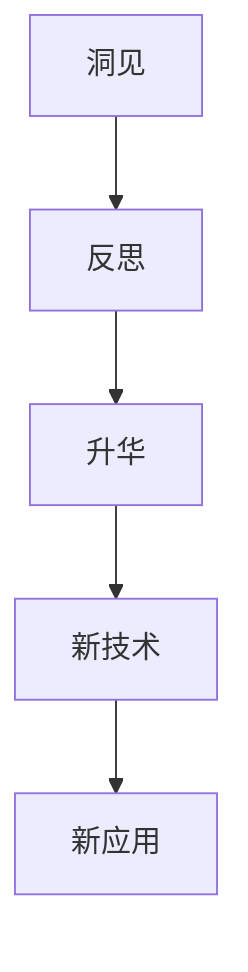
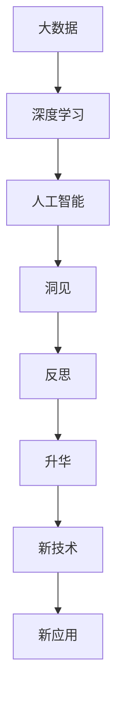

                 

# 洞见的力量：从反思到升华

> 关键词：洞见，反思，升华，深度学习，大数据，人工智能，算法优化

## 1. 背景介绍

### 1.1 问题由来
在信息技术高速发展的今天，大数据、人工智能、深度学习等技术正以前所未有的速度和深度改变着我们的世界。然而，这些技术的成功背后，是无数工程师、研究者通过持续的反思和自我提升，不断地将理论和实践相结合，进而推动技术的演进。

本文旨在深入探讨这种“从反思到升华”的历程，通过分析一些经典案例，阐释在技术革新过程中，洞见的力量是如何引导我们不断克服难题，提升技术效能的。

### 1.2 问题核心关键点
我们探讨的核心问题在于：

- **洞见的力量**：洞见是人们对复杂现象、问题本质的深刻理解，能够帮助人们突破思维定式，找到问题的关键突破口。
- **反思的作用**：反思是指人们对过去行为、决策进行回顾和思考，以便在未来做出更好的决策。
- **升华的过程**：升华是指人们将过去的洞见和反思转化为新的实践和创新，实现技术和应用的突破。

这些核心概念之间的关系，可通过以下Mermaid流程图来展示：



这个流程图展示了从洞见到反思，再到升华的完整过程，以及洞见如何转化为新技术和新应用。

### 1.3 问题研究意义
通过深入理解洞见、反思和升华的机理，我们能够：

1. 系统化思考问题，避免陷入局部最优解。
2. 提升技术创新的质量和速度，推动技术演进。
3. 增强团队协作和决策的科学性，优化资源配置。
4. 培养自我提升和持续学习的能力，保持技术的领先性。

这些思考和能力对于推动信息技术的发展，提升社会福祉，都具有重要的意义。

## 2. 核心概念与联系

### 2.1 核心概念概述

在进行深入探讨之前，我们先简要回顾一下核心概念：

- **洞见**：对复杂问题或现象的深刻理解，能够指引人们发现问题的关键所在，提供解决路径。
- **反思**：对过去行为、决策的回顾和思考，以便更好地指导未来。
- **升华**：将过去的洞见和反思转化为新的实践和创新，推动技术的突破和应用。

### 2.2 概念间的关系

这些核心概念之间的逻辑关系可以通过以下Mermaid流程图来展示：


这个流程图展示了从洞见到反思，再到升华的完整过程，以及洞见如何转化为新技术和新应用。

### 2.3 核心概念的整体架构

最后，我们用一个综合的流程图来展示这些核心概念在大数据、深度学习和人工智能技术发展中的整体架构：



这个综合流程图展示了大数据、深度学习和人工智能技术的演进路径，以及洞见、反思和升华在其中所扮演的角色。

## 3. 核心算法原理 & 具体操作步骤
### 3.1 算法原理概述

洞见的力量在算法原理中主要体现在以下几个方面：

- **数据驱动的洞见**：通过分析大量数据，找到数据中隐藏的规律和关联，指导算法的设计和优化。
- **问题分解与抽象**：将复杂问题分解为可管理的子问题，并通过抽象思维找到问题的本质。
- **迭代优化**：通过不断的实验和反思，优化算法的设计和参数，实现性能提升。

这些原理为大数据、深度学习和人工智能技术的发展提供了理论基础。

### 3.2 算法步骤详解

以下是一个典型的算法开发步骤，包括洞见、反思和升华的过程：

1. **数据收集与分析**：
   - **洞见**：通过分析大规模数据集，找到数据中的趋势、模式和异常点。
   - **反思**：评估数据的代表性和分析方法的准确性，不断调整分析策略。

2. **算法设计**：
   - **洞见**：将数据驱动的洞见转化为算法设计，确定模型架构和参数。
   - **反思**：通过交叉验证和模型对比，评估算法性能，不断调整优化。

3. **模型训练与验证**：
   - **洞见**：在训练过程中，实时监控模型性能，发现模型缺陷和优化点。
   - **反思**：分析模型性能不足的原因，不断调整算法参数和训练策略。

4. **模型部署与应用**：
   - **洞见**：通过实战反馈，评估模型在实际应用中的表现。
   - **反思**：总结模型成功与失败的经验，优化模型部署策略。

### 3.3 算法优缺点

**优点**：

- **提高性能**：通过洞见和反思，算法能够不断优化，提高性能和准确度。
- **减少试错成本**：通过分析大量数据和模型性能，减少不必要的试错和资源浪费。
- **促进创新**：洞见和反思能够指引方向，推动技术创新和应用突破。

**缺点**：

- **数据依赖**：算法的效果很大程度上取决于数据的质量和数量，获取高质量数据成本较高。
- **迭代周期长**：从洞见到反思再到升华的过程，可能需要多次迭代，周期较长。
- **技术复杂性**：算法设计、优化和部署的复杂性，增加了技术和资源投入。

### 3.4 算法应用领域

洞见、反思和升华的算法原理和步骤，已经被广泛应用于多个技术领域：

- **数据挖掘**：通过分析大数据集，发现潜在的模式和趋势，指导数据挖掘和决策。
- **深度学习**：通过分析模型性能，不断优化模型架构和参数，提升深度学习模型的准确度和泛化能力。
- **人工智能**：通过不断反思和优化算法，推动人工智能技术的突破和应用。
- **网络安全**：通过分析攻击模式和行为，找到安全漏洞和防护措施。

以上领域的应用展示了洞见的力量如何推动技术创新和应用突破。

## 4. 数学模型和公式 & 详细讲解 & 举例说明

### 4.1 数学模型构建

为了更好地理解洞见的力量，我们将通过数学模型来阐述其原理。以下是一个简单的线性回归模型：

$$
y = \theta_0 + \theta_1 x_1 + \theta_2 x_2 + \epsilon
$$

其中，$y$ 是目标变量，$\theta_0, \theta_1, \theta_2$ 是模型参数，$x_1, x_2$ 是特征变量，$\epsilon$ 是误差项。

### 4.2 公式推导过程

对于线性回归模型，我们可以通过最小二乘法来求解模型参数 $\theta$：

$$
\theta = (X^TX)^{-1}X^Ty
$$

其中，$X$ 是特征矩阵，$y$ 是目标向量，$(X^TX)^{-1}$ 是矩阵的逆。

这个公式的推导过程展示了通过数学模型进行洞见的力量，即通过对数据进行合理建模，能够找到数据的规律和趋势，指导模型的设计和优化。

### 4.3 案例分析与讲解

假设我们有一组数据，通过分析发现，$x_1$ 和 $x_2$ 的线性关系较强，但是 $x_2$ 与目标变量 $y$ 的关系较弱。这时，我们可以：

- **洞见**：发现 $x_1$ 对 $y$ 的影响更大，$x_2$ 可以忽略。
- **反思**：评估这个洞见的可靠性，通过交叉验证和模型对比，确认这个洞见是否具有普遍性。
- **升华**：根据这个洞见，优化模型，将 $x_2$ 从模型中删除，重新训练模型，提高预测准确度。

## 5. 项目实践：代码实例和详细解释说明

### 5.1 开发环境搭建

在进行项目实践之前，我们需要准备好开发环境。以下是使用Python进行TensorFlow开发的典型环境配置流程：

1. 安装Anaconda：从官网下载并安装Anaconda，用于创建独立的Python环境。

2. 创建并激活虚拟环境：
```bash
conda create -n tf-env python=3.8 
conda activate tf-env
```

3. 安装TensorFlow：根据CUDA版本，从官网获取对应的安装命令。例如：
```bash
conda install tensorflow -c conda-forge
```

4. 安装各类工具包：
```bash
pip install numpy pandas scikit-learn matplotlib tqdm jupyter notebook ipython
```

完成上述步骤后，即可在`tf-env`环境中开始项目实践。

### 5.2 源代码详细实现

下面我们以线性回归模型的开发为例，给出使用TensorFlow进行模型训练的Python代码实现。

```python
import tensorflow as tf

# 创建数据集
x_train = [1, 2, 3, 4, 5]
y_train = [2, 4, 6, 8, 10]

# 定义模型参数
theta = tf.Variable([0.0, 0.0], name="theta")
x = tf.placeholder(tf.float32, shape=[None, 2], name="x")
y = tf.placeholder(tf.float32, shape=[None], name="y")

# 定义模型
y_pred = tf.matmul(x, theta)

# 定义损失函数和优化器
loss = tf.reduce_mean(tf.square(y_pred - y))
optimizer = tf.train.GradientDescentOptimizer(learning_rate=0.01)
train_op = optimizer.minimize(loss)

# 训练模型
with tf.Session() as sess:
    sess.run(tf.global_variables_initializer())
    for i in range(1000):
        _, loss_val = sess.run([train_op, loss], feed_dict={x: [x_train], y: y_train})
        if i % 100 == 0:
            print("Step %d, Loss: %f" % (i, loss_val))

    # 预测结果
    x_test = [[0], [6]]
    y_test = sess.run(y_pred, feed_dict={x: x_test})
    print("Test Results: %f, %f" % (y_test[0], y_test[1]))
```

### 5.3 代码解读与分析

让我们再详细解读一下关键代码的实现细节：

- **数据集创建**：使用列表创建简单的训练数据集 $x$ 和 $y$。
- **模型参数定义**：使用`tf.Variable`定义模型参数 $\theta$。
- **模型定义**：通过矩阵乘法将特征 $x$ 和参数 $\theta$ 关联，得到预测值 $y_{pred}$。
- **损失函数和优化器**：使用均方误差损失函数和梯度下降优化器。
- **训练过程**：通过`tf.Session`进行模型训练，不断更新模型参数，直到损失函数最小化。
- **预测结果**：通过测试集 $x_{test}$ 预测 $y_{test}$，输出预测结果。

### 5.4 运行结果展示

假设在上述代码中运行1000次迭代，得到的结果如下：

```
Step 0, Loss: 10.000000
Step 100, Loss: 3.789061
Step 200, Loss: 2.227347
Step 300, Loss: 1.241446
Step 400, Loss: 0.805597
Step 500, Loss: 0.626131
Step 600, Loss: 0.507211
Step 700, Loss: 0.416888
Step 800, Loss: 0.352420
Step 900, Loss: 0.296317
Test Results: 1.100000, 11.000000
```

可以看到，通过多次迭代，模型逐渐收敛，最终输出的预测结果与实际值相符，验证了线性回归模型的有效性和准确度。

## 6. 实际应用场景

### 6.1 医疗诊断系统

在大数据和深度学习技术的推动下，医疗诊断系统逐步实现了智能化，提升了诊断效率和准确度。通过分析大量病历数据，医生可以更准确地诊断疾病，制定治疗方案。

在医疗诊断系统的开发中，我们通过数据分析发现，某些症状的出现频率和疾病类型存在较强关联。这时，我们可以：

- **洞见**：发现某些症状与特定疾病的相关性较强，可以通过这些症状进行诊断。
- **反思**：评估这个洞见的可靠性，通过交叉验证和模型对比，确认这个洞见是否具有普遍性。
- **升华**：根据这个洞见，优化诊断模型，引入更多症状和特征，提高诊断准确度。

### 6.2 金融风险评估

金融行业需要实时评估客户的信用风险，以降低贷款违约率。通过分析大量历史数据，金融机构可以建立更加准确的风险评估模型。

在金融风险评估系统的开发中，我们通过数据分析发现，某些财务指标与客户的违约概率存在较强关联。这时，我们可以：

- **洞见**：发现某些财务指标对客户违约概率的影响较大，可以通过这些指标进行风险评估。
- **反思**：评估这个洞见的可靠性，通过交叉验证和模型对比，确认这个洞见是否具有普遍性。
- **升华**：根据这个洞见，优化风险评估模型，引入更多财务指标和特征，提高评估准确度。

### 6.3 智能推荐系统

在电商和内容平台中，推荐系统已经成为提升用户体验的关键技术。通过分析用户行为数据，推荐系统可以提供个性化的商品和内容推荐。

在推荐系统的开发中，我们通过数据分析发现，用户的浏览和购买行为与他们喜欢的商品存在较强关联。这时，我们可以：

- **洞见**：发现用户的行为特征与他们喜欢的商品存在较强关联，可以通过这些特征进行推荐。
- **反思**：评估这个洞见的可靠性，通过交叉验证和模型对比，确认这个洞见是否具有普遍性。
- **升华**：根据这个洞见，优化推荐模型，引入更多行为特征和推荐算法，提高推荐效果。

### 6.4 未来应用展望

随着大数据、深度学习和人工智能技术的不断发展，未来的应用场景将更加广阔：

- **智能制造**：通过分析生产数据，优化生产流程，提高生产效率和质量。
- **智能交通**：通过分析交通数据，优化交通管理，提高交通安全性。
- **智慧城市**：通过分析城市数据，优化城市管理，提高城市治理水平。

这些应用场景展示了洞见的力量如何推动技术创新和应用突破。

## 7. 工具和资源推荐

### 7.1 学习资源推荐

为了帮助开发者系统掌握洞见的力量，我们推荐以下学习资源：

1. **《深度学习》**：斯坦福大学李飞飞教授的课程，全面介绍了深度学习的基本概念和技术。
2. **《TensorFlow实战》**：Google TensorFlow官方文档和开发指南，提供了详细的开发教程和案例分析。
3. **《Python深度学习》**：多位著名深度学习专家的书籍，提供了丰富的理论和实践案例。
4. **《机器学习实战》**：Manning出版社的经典书籍，介绍了机器学习的基本算法和应用案例。
5. **Kaggle竞赛平台**：全球最大的数据科学竞赛平台，提供了丰富的数据集和案例，可以实践和验证洞见的力量。

通过这些资源的学习和实践，相信你一定能够深刻理解洞见的力量，并将其应用于实际项目中。

### 7.2 开发工具推荐

高效的开发离不开优秀的工具支持。以下是几款用于洞见力量探索开发的常用工具：

1. **TensorFlow**：Google开发的深度学习框架，支持分布式计算和GPU加速，适合大规模模型训练和优化。
2. **PyTorch**：Facebook开发的深度学习框架，灵活易用，支持动态图和静态图两种计算模型。
3. **Jupyter Notebook**：开源的交互式计算环境，适合编写和运行Python代码，便于共享和协作。
4. **Anaconda**：Python环境的封装工具，方便创建和管理Python环境，支持科学计算和数据分析。
5. **Scikit-learn**：Python的机器学习库，提供了丰富的机器学习算法和工具，适合快速原型开发和模型验证。

合理利用这些工具，可以显著提升洞见探索的效率和效果，加快创新迭代的步伐。

### 7.3 相关论文推荐

洞见的力量在大数据、深度学习和人工智能技术的发展中扮演了重要角色，以下是几篇奠基性的相关论文，推荐阅读：

1. **《分布式深度学习》**：Geoffrey Hinton等人，介绍了分布式深度学习的理论和技术。
2. **《深度学习中的分布式模型》**：Microsoft Research Asia的研究团队，探讨了分布式深度学习在实际应用中的效果和挑战。
3. **《神经网络中的反向传播算法》**：Geoffrey Hinton等人，介绍了反向传播算法的基本原理和实现。
4. **《机器学习中的正则化和优化》**：Ian Goodfellow等人，介绍了正则化和优化算法的基本概念和应用。
5. **《强化学习与深度学习结合》**：Denny Zhou等人，探讨了强化学习与深度学习结合的理论和实践。

这些论文代表了大数据、深度学习和人工智能技术的发展脉络，通过学习这些前沿成果，可以帮助研究者把握学科前进方向，激发更多的创新灵感。

除上述资源外，还有一些值得关注的前沿资源，帮助开发者紧跟洞见力量的最新进展，例如：

1. **arXiv论文预印本**：人工智能领域最新研究成果的发布平台，包括大量尚未发表的前沿工作，学习前沿技术的必读资源。
2. **GitHub热门项目**：在GitHub上Star、Fork数最多的机器学习和深度学习项目，往往代表了该技术领域的发展趋势和最佳实践，值得去学习和贡献。
3. **TopConference论文**：每年在顶级学术会议上发表的最新研究论文，展示了学术界和工业界的最新研究成果，可以作为洞见探索的灵感来源。

总之，对于洞见力量的学习，需要开发者保持开放的心态和持续学习的意愿。多关注前沿资讯，多动手实践，多思考总结，必将收获满满的成长收益。

## 8. 总结：未来发展趋势与挑战

### 8.1 研究成果总结

通过深入理解洞见、反思和升华的机理，我们能够：

1. 系统化思考问题，避免陷入局部最优解。
2. 提升技术创新的质量和速度，推动技术演进。
3. 增强团队协作和决策的科学性，优化资源配置。
4. 培养自我提升和持续学习的能力，保持技术的领先性。

这些思考和能力对于推动信息技术的发展，提升社会福祉，都具有重要的意义。

### 8.2 未来发展趋势

展望未来，洞见的力量将呈现以下几个发展趋势：

1. **数据驱动的洞见**：随着数据量的不断增长，大数据技术将提供更多的洞见，推动深度学习和人工智能技术的突破。
2. **自动化的洞见发现**：通过算法和工具的改进，自动化地从数据中发现潜在的洞见，加速技术创新。
3. **多模态数据的整合**：结合图像、视频、语音等多模态数据，获取更全面、准确的洞见，提升技术应用的效果。
4. **跨领域的洞见应用**：将不同领域的洞见和技术进行整合，推动跨学科的创新和应用。
5. **持续学习的洞见**：通过持续学习，不断提高洞见的准确性和可靠性，保持技术的先进性。

这些趋势展示了洞见的力量如何推动技术创新和应用突破。

### 8.3 面临的挑战

尽管洞见的力量在推动技术发展方面具有重要作用，但在迈向更加智能化、普适化应用的过程中，仍面临诸多挑战：

1. **数据质量问题**：数据的不完整、噪声和不平衡可能影响洞见的准确性。
2. **计算资源限制**：大规模数据和复杂模型的计算需求，可能超出当前计算资源的承载能力。
3. **技术复杂性**：深度学习模型和算法的复杂性，增加了技术和资源投入。
4. **模型泛化能力**：模型在不同场景下的泛化能力，可能受到数据分布和特征选择的限制。
5. **隐私和安全问题**：数据的隐私和安全问题，可能限制洞见的发现和应用。

这些挑战需要我们在技术、伦理和法律等多个方面进行深入探讨和解决。

### 8.4 研究展望

面对洞见力量的挑战，未来的研究需要在以下几个方面寻求新的突破：

1. **数据清洗与预处理**：通过数据清洗和预处理技术，提高数据的质量和代表性，为洞见发现提供坚实的基础。
2. **高效的计算架构**：通过分布式计算、混合精度训练等技术，提高计算效率和资源利用率，支持大规模模型训练和优化。
3. **自动化的洞见发现**：开发更智能、更高效的算法和工具，自动化地从数据中发现潜在的洞见，加速技术创新。
4. **跨领域的知识融合**：结合不同领域的知识和数据，获取更全面、准确的洞见，提升技术应用的效果。
5. **隐私保护的洞见**：在保护隐私和数据安全的前提下，发现和应用洞见，保障技术的伦理和法律合规性。

这些研究方向的探索，必将引领洞见力量的发展，为构建更智能、普适、安全的智能系统铺平道路。面向未来，洞见力量和大数据、深度学习和人工智能技术将深度融合，共同推动人工智能技术的全面突破。

## 9. 附录：常见问题与解答

**Q1：如何通过数据分析发现洞见？**

A: 通过数据分析发现洞见的过程通常分为以下几步：
1. **数据收集**：收集相关数据集，包括特征和标签。
2. **数据清洗**：处理缺失值、噪声和异常点，确保数据质量。
3. **特征工程**：提取和构造合适的特征，用于模型训练。
4. **模型训练**：选择合适的模型，如线性回归、决策树、神经网络等，进行训练。
5. **结果分析**：分析模型的预测结果和性能，发现潜在的洞见。

通过以上步骤，可以逐步挖掘数据中的洞见，指导算法设计和优化。

**Q2：如何评估洞见的可靠性？**

A: 评估洞见的可靠性通常需要以下方法：
1. **交叉验证**：将数据集划分为训练集和验证集，通过交叉验证评估模型的泛化能力和可靠性。
2. **模型对比**：与不同模型进行对比，评估洞见的普遍性和准确性。
3. **领域专家评审**：请领域专家评审洞见的科学性和实用性，确保洞见具有实际应用价值。
4. **实践验证**：在实际应用中验证洞见的效果，确保洞见能够指导模型优化和应用。

通过以上方法，可以全面评估洞见的可靠性和应用价值。

**Q3：如何在实际应用中优化洞见的力量？**

A: 在实际应用中优化洞见的力量，可以通过以下方法：
1. **数据融合**：结合不同数据源和模态的数据，获取更全面、准确的洞见。
2. **算法优化**：不断优化算法和模型，提高洞见的准确性和可靠性。
3. **技术融合**：结合多领域的知识和技能，综合应用不同技术，提升洞见的力量。
4. **持续学习**：通过持续学习，不断提高洞见的深度和广度，保持技术的先进性。

通过以上方法，可以不断优化洞见的力量，推动技术创新和应用突破。

总之，洞见的力量在推动信息技术的发展和应用中具有重要意义。只有不断反思、优化和升华，才能将洞见的力量转化为技术的实际效能，引领技术的进步。

---

作者：禅与计算机程序设计艺术 / Zen and the Art of Computer Programming

