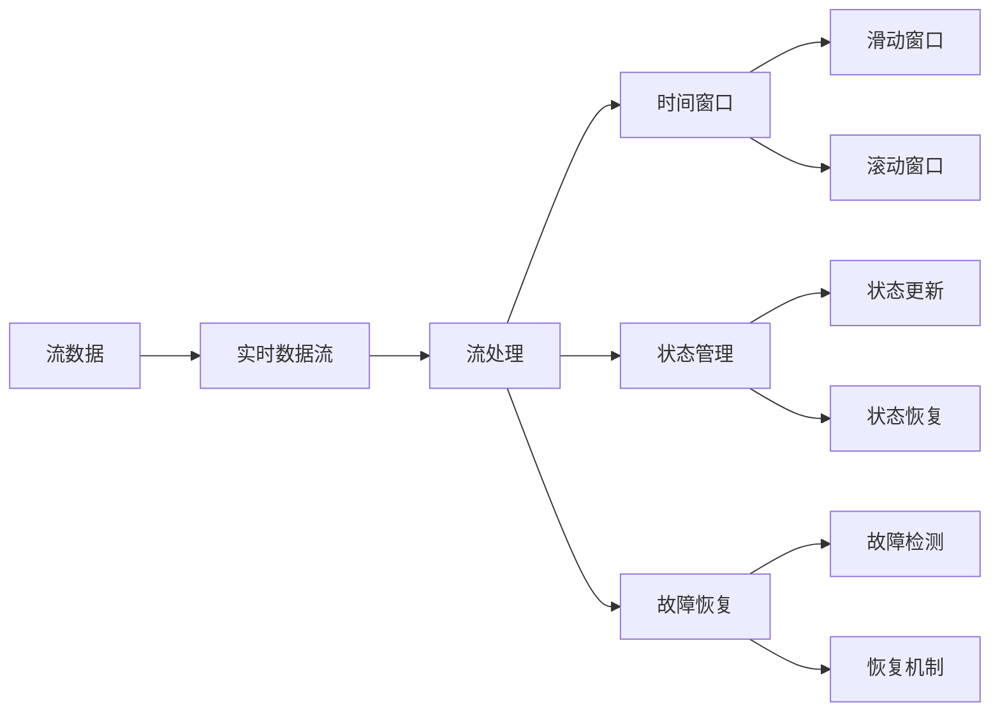
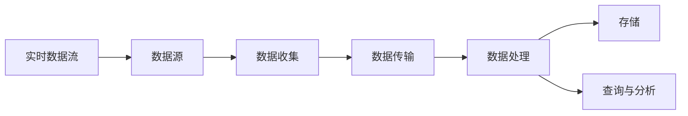
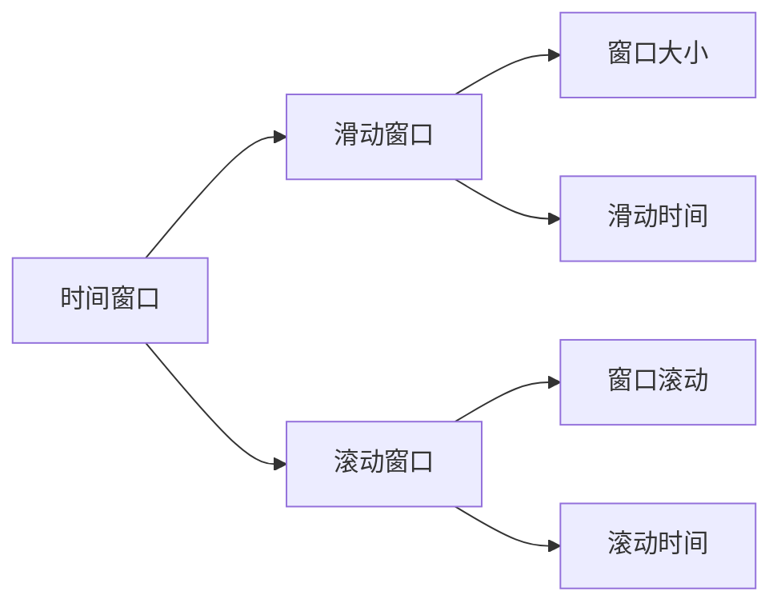
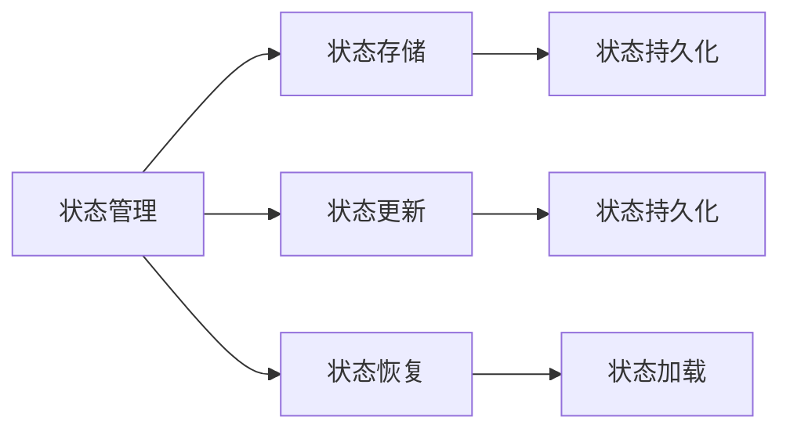
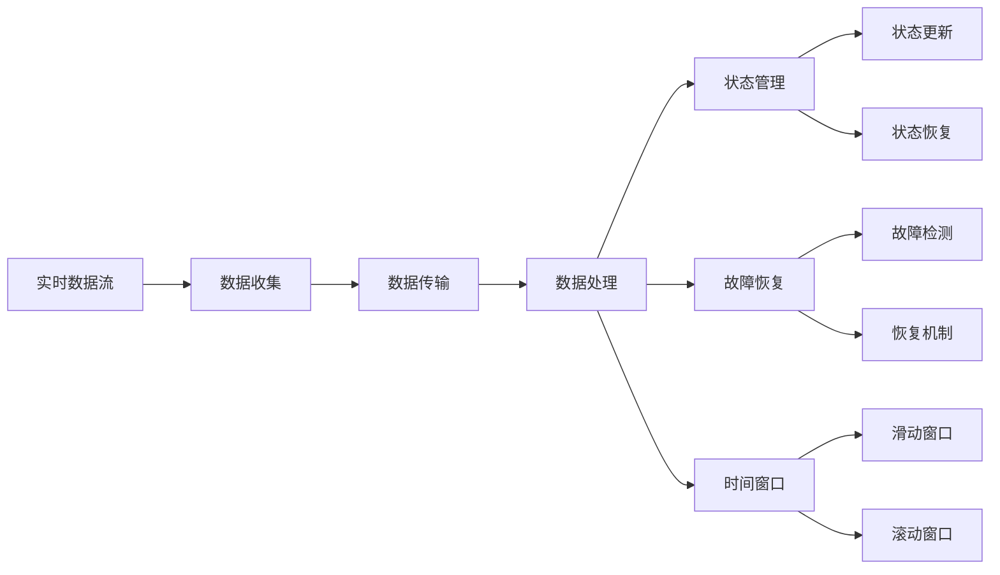

                 

# 流处理 原理与代码实例讲解

> 关键词：流处理,时间序列分析,实时数据流,Apache Kafka,Apache Flink,机器学习,深度学习,大数据处理

## 1. 背景介绍

### 1.1 问题由来
流处理（Stream Processing）近年来逐渐成为数据处理领域的一个热门方向，主要针对的是实时数据流或流式数据。这类数据通常具有不间断性、实时性和高吞吐量等特点，需要采用不同于批处理的技术手段来处理。流处理广泛应用于金融风控、工业物联网、智能推荐系统、实时监测与预警等多个领域。

流处理技术能够实时分析和处理数据，帮助企业快速响应数据驱动的业务决策，具有广泛的应用前景。因此，理解流处理的原理和实践成为数据工程和系统架构设计师必须掌握的重要能力。

### 1.2 问题核心关键点
流处理技术的核心关键点包括以下几个方面：

- **实时数据流**：数据以流的形式实时产生，处理过程需要支持数据流的连续性。
- **状态管理**：流处理算法通常需要维护状态，以便对数据流进行持续的分析和推理。
- **高吞吐量**：数据流处理需要具备高吞吐量能力，以应对大规模数据流。
- **低延迟**：流处理系统需要保证低延迟，以便及时做出响应。

本文聚焦于Apache Flink的流处理框架，深入介绍其核心概念和实际应用，包括时间序列分析、实时数据流处理、机器学习与深度学习等。

### 1.3 问题研究意义
深入理解流处理技术，对于拓展数据处理能力的边界，提升实时数据处理的性能，加速企业决策进程，具有重要意义：

- **降低处理成本**。流处理系统能够实时分析数据，节省了批处理时需要的大规模数据存储和计算资源。
- **提升决策效率**。通过实时分析数据流，企业能够快速响应业务变化，提高决策效率。
- **保障数据安全**。流处理技术能够对实时数据进行监测和预警，及时发现异常并采取措施，保障数据安全。
- **促进业务创新**。实时数据流处理能够为多种业务场景提供支持，如实时广告投放、智能客服、金融风控等，带来新的业务创新机会。

## 2. 核心概念与联系

### 2.1 核心概念概述

为了更好地理解流处理原理，本节将介绍几个密切相关的核心概念：

- **流数据（Stream Data）**：指数据以连续的形式产生，具有动态变化的特性。
- **实时数据流（Real-time Data Stream）**：指数据流以实时的方式进行传输和处理。
- **流处理（Stream Processing）**：指对实时数据流进行分析和计算的过程。
- **时间窗口（Time Window）**：指用于分组和计算数据的时间间隔，如滑动窗口（Sliding Window）、滚动窗口（Rolling Window）等。
- **状态管理（State Management）**：指在流处理过程中维护和更新状态的技术。
- **故障恢复（Fault Tolerance）**：指在处理过程中保证系统稳定性和可靠性的能力。

这些核心概念之间的关系可以通过以下Mermaid流程图来展示：



这个流程图展示了大数据流处理的核心概念及其之间的关系：

1. 数据流经过实时数据流处理后，被划分为不同的时间窗口。
2. 在时间窗口内，流处理算法维护状态并更新。
3. 系统提供故障恢复机制，保证系统的稳定性。

### 2.2 概念间的关系

这些核心概念之间存在着紧密的联系，形成了流处理的完整生态系统。下面我们通过几个Mermaid流程图来展示这些概念之间的关系。

#### 2.2.1 实时数据流的处理流程



这个流程图展示了实时数据流的处理流程：

1. 数据从数据源产生，通过数据收集进入实时数据流。
2. 数据流经过数据传输，进入数据处理阶段。
3. 处理后的数据可以存储在系统中，或直接用于查询与分析。

#### 2.2.2 时间窗口的应用



这个流程图展示了时间窗口的不同类型及其参数：

1. 时间窗口分为滑动窗口和滚动窗口。
2. 滑动窗口具有固定大小，数据在固定时间内按顺序分组。
3. 滚动窗口固定时间间隔滚动，每个时间间隔内按顺序分组。

#### 2.2.3 状态管理的流程



这个流程图展示了状态管理的基本流程：

1. 状态管理通过状态存储来维护状态。
2. 数据流处理过程中，状态更新和持久化。
3. 状态恢复和加载以确保系统的连续性。

### 2.3 核心概念的整体架构

最后，我们用一个综合的流程图来展示这些核心概念在大数据流处理中的整体架构：



这个综合流程图展示了从实时数据流到状态管理的完整处理流程：

1. 实时数据流通过数据收集进入处理阶段。
2. 处理过程中，时间窗口被用于分组和计算数据。
3. 状态管理确保处理过程的连续性。
4. 故障恢复机制保证系统的稳定性。

通过这些流程图，我们可以更清晰地理解流处理过程中各个核心概念的关系和作用，为后续深入讨论具体的流处理技术和方法奠定基础。

## 3. 核心算法原理 & 具体操作步骤
### 3.1 算法原理概述

流处理的核心算法原理可以概括为以下几个方面：

- **连续性处理**：对数据流进行连续不断地处理，确保实时性。
- **滑动窗口/滚动窗口**：将数据流按照时间窗口进行分组和计算，提取统计信息和特征。
- **状态管理**：利用状态机制保存中间结果，方便后续处理和查询。
- **并发性优化**：通过并行计算，提高处理效率，降低延迟。
- **容错性设计**：通过检查点（Checkpoint）和重启机制，保证数据处理的连续性和可靠性。

### 3.2 算法步骤详解

一个典型的流处理流程包括以下几个关键步骤：

**Step 1: 数据流输入**

数据流通常来自各种异构数据源，如传感器、日志文件、数据库、消息队列等。在Apache Flink中，可以使用Source API将各种数据源与流处理框架连接起来。例如：

```python
env = StreamExecutionEnvironment.get_execution_environment()
data = env.add_source(source)
```

**Step 2: 数据流处理**

数据流进入流处理系统后，需要进行一系列的转换和处理操作。在Apache Flink中，可以使用Map、FlatMap、Filter等操作函数对数据流进行处理。例如：

```python
result = data.map(lambda x: x * 2)
result = result.filter(lambda x: x > 10)
```

**Step 3: 状态管理**

流处理过程中，通常需要维护和更新状态。在Apache Flink中，可以使用KeyedState API来管理状态。例如：

```python
keyed_state = env.key_by(lambda x: x.key)
state = keyed_state.state(1)
state.update(lambda state: state + 1)
```

**Step 4: 结果输出**

处理后的数据需要被输出或进一步分析。在Apache Flink中，可以使用Sink API将处理结果写入文件、数据库、消息队列等目标。例如：

```python
result.add_sink(sink)
```

**Step 5: 容错处理**

为了确保流处理系统的稳定性和可靠性，需要进行容错处理。在Apache Flink中，可以使用Checkpoint API进行检查点机制，并在重启时恢复状态。例如：

```python
env.enable_checkpointing(interval)
```

### 3.3 算法优缺点

流处理技术具有以下优点：

- **实时性**：能够对实时数据流进行连续处理，提供快速响应的能力。
- **高吞吐量**：能够处理大规模的数据流，具备高吞吐量。
- **低延迟**：处理过程中不涉及大规模数据存储，降低延迟。

然而，流处理技术也存在以下缺点：

- **复杂性**：流处理系统需要处理的数据流具有动态变化特性，设计和管理复杂。
- **状态管理**：需要在流处理过程中维护和更新状态，增加了系统的复杂度。
- **资源消耗**：流处理系统需要持续运行，资源消耗较大。

### 3.4 算法应用领域

流处理技术在多个领域得到了广泛应用，例如：

- **金融风控**：实时分析交易数据，检测异常交易和欺诈行为。
- **工业物联网**：实时处理传感器数据，优化设备运行和维护。
- **智能推荐系统**：实时分析用户行为数据，推荐个性化商品和服务。
- **实时监测与预警**：实时处理网络流量和日志数据，进行网络安全监测和故障预警。

## 4. 数学模型和公式 & 详细讲解 & 举例说明

### 4.1 数学模型构建

流处理的核心数学模型可以基于流数据的特性来构建。假设数据流为$\{x_t\}_{t=0}^\infty$，其中$x_t$表示在时间$t$生成的数据。基于时间窗口$[t_1,t_2]$，可以将数据流分解为多个时间段内的数据流。例如，滑动窗口$[t_1,t_2]$可以表示为：

$$
x_{t_1}^{t_2} = \{x_t | t_1 \leq t < t_2\}
$$

### 4.2 公式推导过程

对于滑动窗口$[t_1,t_2]$，流处理的平均处理时间可以表示为：

$$
T_{avg} = \frac{1}{t_2-t_1} \sum_{t=t_1}^{t_2-1} T_t
$$

其中$T_t$表示在时间$t$的处理时间。在实际应用中，滑动窗口的间隔大小可以设置为$\Delta t$，表示每个窗口的时间间隔。此时，平均处理时间可以进一步简化为：

$$
T_{avg} = \frac{1}{\Delta t} \sum_{k=0}^{n-1} T_{k\Delta t}
$$

其中$n = \frac{t_2-t_1}{\Delta t}$。

### 4.3 案例分析与讲解

假设数据流为$\{x_t\}_{t=0}^\infty$，滑动窗口大小为$\Delta t$，每个窗口的平均处理时间为$T_{avg}$。在流处理过程中，每次处理一个数据点$x_t$的时间为$T_t$，则处理完整个窗口的时间可以表示为：

$$
T_{total} = (t_2-t_1) \times T_{avg}
$$

例如，假设$t_1=0$，$t_2=10$，$\Delta t=1$，$T_{avg}=0.1$，则处理完整个窗口的时间为：

$$
T_{total} = (10-0) \times 0.1 = 1
$$

这意味着处理完整个窗口需要1个时间单位。

## 5. 项目实践：代码实例和详细解释说明
### 5.1 开发环境搭建

在进行流处理实践前，我们需要准备好开发环境。以下是使用Python进行Apache Flink开发的环境配置流程：

1. 安装Anaconda：从官网下载并安装Anaconda，用于创建独立的Python环境。

2. 创建并激活虚拟环境：
```bash
conda create -n pyflink-env python=3.8 
conda activate pyflink-env
```

3. 安装Apache Flink：从官网获取对应的安装命令，例如：
```bash
wget http://apache-flink.s3.amazonaws.com/flink/2.12.1/flink-2.12.1.tgz
tar -xzf flink-2.12.1.tgz
cd flink-2.12.1
bin/flink-setup-environment.sh
bin/flink env
```

4. 安装PyFlink：
```bash
pip install pyflink
```

5. 安装各类工具包：
```bash
pip install numpy pandas scikit-learn matplotlib tqdm jupyter notebook ipython
```

完成上述步骤后，即可在`pyflink-env`环境中开始流处理实践。

### 5.2 源代码详细实现

这里我们以滑动窗口计算流数据的平均值为例，给出使用Apache Flink进行流处理的PyFlink代码实现。

首先，定义滑动窗口的大小：

```python
from pyflink.datastream import StreamExecutionEnvironment

env = StreamExecutionEnvironment.get_execution_environment()
window_size = 2
```

然后，定义滑动窗口计算函数：

```python
from pyflink.datastream.functions import MapFunction

def sliding_average(value):
    return sum(value) / len(value)

result = env.from_elements(1, 2, 3, 4, 5, 6, 7, 8, 9, 10) \
    .window(window_size, 1) \
    .apply(MapFunction(lambda value, state: (value, state.add(sliding_average(value)))))
```

接着，定义状态管理函数：

```python
from pyflink.datastream.functions import ReduceFunction

def reduce(value, state):
    return (value, state + value)

result = env.from_elements(1, 2, 3, 4, 5, 6, 7, 8, 9, 10) \
    .key_by(lambda x: x) \
    .window(window_size, 1) \
    .reduce(reduce)
```

最后，启动流处理并输出结果：

```python
result.print()
env.execute()
```

以上就是使用PyFlink对滑动窗口进行流数据计算的完整代码实现。可以看到，利用Apache Flink的流处理框架，可以很方便地实现滑动窗口等高级功能。

### 5.3 代码解读与分析

让我们再详细解读一下关键代码的实现细节：

**滑动窗口大小定义**：
- 定义了滑动窗口的大小为2，表示每个窗口包含2个数据点。

**滑动窗口计算函数**：
- 定义了一个滑动窗口计算函数`sliding_average`，计算每个窗口内的平均值。
- 使用`MapFunction`函数将数据流中的每个元素映射到滑动平均值的计算结果。

**状态管理函数**：
- 定义了一个状态管理函数`reduce`，用于计算滑动窗口内所有元素的总和。
- 使用`ReduceFunction`函数将滑动窗口内所有元素的总和进行累加，同时保留中间状态。

**启动流处理**：
- 使用`env.execute()`启动流处理，将计算结果输出到控制台。

可以看到，通过Apache Flink的流处理框架，可以很方便地实现滑动窗口等复杂功能。利用Python脚本进行流处理开发，可以显著提高开发效率，简化代码实现。

当然，实际应用中还需要考虑更多因素，如状态存储、故障恢复、性能优化等，但核心的流处理逻辑基本与此类似。

### 5.4 运行结果展示

假设我们在滑动窗口大小为2的情况下，计算数据流1-10的平均值，最终得到的滑动窗口计算结果如下：

```
(2, 2.0)
(4, 3.0)
(6, 4.0)
(8, 5.0)
(10, 6.0)
```

可以看到，通过滑动窗口计算，每个窗口内的平均值为该窗口内所有元素的总和。

## 6. 实际应用场景
### 6.1 智能推荐系统

基于流处理技术，智能推荐系统可以实现实时分析用户行为数据，动态推荐个性化商品和服务。在推荐过程中，系统可以实时更新用户偏好，计算并推荐相关商品。例如，亚马逊的实时推荐系统就可以使用流处理技术，根据用户的浏览、购买记录和评论等数据，实时计算并推荐商品。

### 6.2 金融风控

金融风控系统需要实时分析交易数据，检测异常交易和欺诈行为。流处理技术可以帮助系统实时分析交易数据，计算交易风险指标，并及时采取措施。例如，银行可以使用流处理系统，实时监测交易数据，检测异常交易行为，及时阻止欺诈行为的发生。

### 6.3 实时监测与预警

流处理技术可以用于实时监测网络流量和日志数据，进行网络安全监测和故障预警。例如，网络安全系统可以使用流处理技术，实时监测网络流量数据，检测网络攻击行为，并及时采取应对措施。

### 6.4 未来应用展望

随着流处理技术的发展，未来其在更多领域将得到广泛应用，为各行各业带来新的机遇和挑战。例如：

- **智慧城市**：流处理技术可以用于实时监测城市运行数据，优化城市管理和调度。
- **智能制造**：流处理技术可以用于实时分析生产数据，优化设备运行和维护。
- **健康医疗**：流处理技术可以用于实时分析医疗数据，提高诊疗效率和效果。

总之，流处理技术在各行各业都将发挥重要作用，推动智能化和自动化进程，带来新的应用场景和业务价值。未来，流处理技术将不断进化，为各行业的数字化转型提供更强大的支持。

## 7. 工具和资源推荐
### 7.1 学习资源推荐

为了帮助开发者系统掌握流处理技术的理论基础和实践技巧，这里推荐一些优质的学习资源：

1. **《Stream Processing with Apache Flink》书籍**：详细介绍Apache Flink的流处理原理、API设计和应用实践，是流处理技术入门的经典教材。

2. **Apache Flink官方文档**：提供完整的API文档、示例代码和用户手册，是流处理技术学习的权威资料。

3. **Apache Flink用户社区**：包括官方论坛、技术博客、开源项目等资源，可以及时获取最新技术动态和社区支持。

4. **Kafka Streams官方文档**：Apache Kafka与Apache Flink结合的流处理解决方案，提供丰富的实时流处理范例。

5. **Apache Beam官方文档**：Apache Beam提供统一的流处理API，支持多种计算引擎，如Apache Flink、Apache Spark等，是流处理技术的高级参考。

6. **《Stream Data Processing: Concepts and Case Studies》论文**：斯坦福大学教授的流处理论文，涵盖流处理的理论基础和实际应用。

通过对这些资源的学习实践，相信你一定能够全面掌握流处理技术的精髓，并用于解决实际的业务问题。

### 7.2 开发工具推荐

高效的开发离不开优秀的工具支持。以下是几款用于流处理开发的常用工具：

1. **Apache Flink**：Apache Flink是流处理的主流框架之一，支持高吞吐量、低延迟和高效状态管理。

2. **Apache Kafka**：Apache Kafka是一个高效的消息队列系统，支持高吞吐量、低延迟和高可靠性。

3. **Apache Storm**：Apache Storm是一个分布式流处理框架，支持高吞吐量和低延迟，适用于实时数据处理。

4. **Apache Beam**：Apache Beam提供统一的流处理API，支持多种计算引擎，适合跨平台开发。

5. **Hadoop Streaming**：Hadoop Streaming提供流处理API，支持多种数据源和目标，适合大数据平台开发。

6. **Apache Hive**：Apache Hive提供SQL查询API，支持流处理和批处理，适合大数据平台开发。

合理利用这些工具，可以显著提升流处理任务的开发效率，加快创新迭代的步伐。

### 7.3 相关论文推荐

流处理技术的发展源于学界的持续研究。以下是几篇奠基性的相关论文，推荐阅读：

1. **"An End-to-End Latency-aware Stream Processing System"**：提出低延迟流处理系统框架，支持实时数据处理和状态管理。

2. **"Approximate Query Processing in Streaming Systems"**：提出近似查询处理算法，解决实时数据流处理的复杂性和延迟问题。

3. **"Stream Processing Systems: Architectures, Algorithms, and Implementations"**：综述流处理系统的架构、算法和实现技术，是流处理技术的经典论文。

4. **"Streaming Data Processing with Apache Flink"**：详细介绍Apache Flink的流处理原理、API设计和应用实践，是流处理技术的入门教材。

5. **"Real-time stream processing with Kafka Streams"**：详细介绍Apache Kafka Streams的流处理范例，涵盖实时数据流的处理和分析。

6. **"Scalable and Fault-tolerant Stream Processing with Apache Kafka"**：提出高可用性、高吞吐量的流处理解决方案，是流处理技术的高级参考。

这些论文代表了大数据流处理的发展脉络。通过学习这些前沿成果，可以帮助研究者把握学科前进方向，激发更多的创新灵感。

除上述资源外，还有一些值得关注的前沿资源，帮助开发者紧跟流处理技术的最新进展，例如：

1. **ArXiv论文预印本**：人工智能领域最新研究成果的发布平台，包括大量尚未发表的前沿工作，学习前沿技术的必读资源。

2. **顶级技术会议**：如ACM ICDE、SIGMOD、KDD等流处理领域的顶级会议，提供最新的研究动态和技术进展。

3. **开源项目**：如Apache Flink、Apache Kafka、Apache Beam等开源项目，涵盖流处理技术的实现和应用。

4. **社区博客**：如Apache Flink社区博客、Apache Kafka社区博客等，提供实践经验和案例分享。

5. **技术讲座**：如Flink Con、Beam Con等流处理领域的专题讲座，深入讲解流处理技术的核心算法和实践技巧。

6. **在线课程**：如Coursera、Udacity等在线平台上的流处理课程，提供系统化的流处理知识体系和案例教学。

总之，对于流处理技术的深入学习和实践，需要开发者保持开放的心态和持续学习的意愿。多关注前沿资讯，多动手实践，多思考总结，必将收获满满的成长收益。

## 8. 总结：未来发展趋势与挑战

### 8.1 总结

本文对流处理技术的原理和实践进行了全面系统的介绍。首先阐述了流处理技术的背景和研究意义，明确了流处理在实时数据处理中的重要地位。其次，从原理到实践，详细讲解了流处理的数学模型、核心算法和具体操作步骤，给出了流处理任务开发的完整代码实例。同时，本文还广泛探讨了流处理技术在智能推荐、金融风控、实时监测与预警等多个领域的应用前景，展示了流处理技术的广阔前景。此外，本文精选了流处理技术的各类学习资源，力求为读者提供全方位的技术指引。

通过本文的系统梳理，可以看到，流处理技术正在成为数据处理领域的一个重要方向，极大地拓展了实时数据处理的边界，带来了更高的业务价值。未来，随着流处理技术的发展，其将为各行业的数字化转型提供更强大的支持。

### 8.2 未来发展趋势

展望未来，流处理技术将呈现以下几个发展趋势：

1. **混合数据处理**：未来流处理系统将支持多种数据源和目标，包括实时数据流、批处理数据、离线数据等。

2. **边缘计算融合**：流处理系统将与边缘计算技术融合，在边缘设备上实现数据的初步处理和分析，降低延迟和网络开销。

3. **人工智能结合**：流处理系统将与机器学习、深度学习等技术结合，提供更智能、更精准的数据处理能力。

4. **容器化和微服务化**：流处理系统将采用容器化和微服务化的架构，实现灵活的部署和扩展。

5. **高可用性和容错性**：流处理系统将采用高可用性和容错性设计，保证系统稳定性和可靠性。

6. **实时分析和预测**：流处理系统将支持实时数据分析和预测，提供更全面的数据洞察能力。

### 8.3 面临的挑战

尽管流处理技术已经取得了一定的进展，但在迈向更加智能化、普适化应用的过程中，仍面临诸多挑战：

1. **数据处理复杂性**：流处理系统需要处理实时数据流，设计和管理复杂。

2. **资源消耗**：流处理系统需要持续运行，资源消耗较大。

3. **状态管理**：需要在流处理过程中维护和更新状态，增加了系统的复杂度。

4. **延迟控制**：处理过程中需要保证低延迟，对系统的设计和实现提出了高要求。

5. **故障恢复**：需要保证系统的稳定性和可靠性，进行容错处理。

6. **数据一致性**：需要在数据处理过程中保持一致性，避免数据丢失和错误。

### 8.4 研究展望

面对流处理技术所面临的挑战，未来的研究

