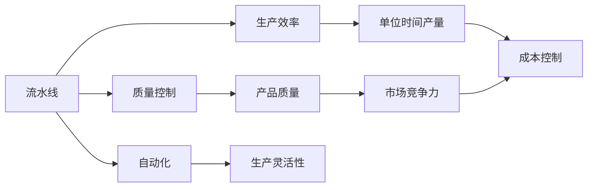
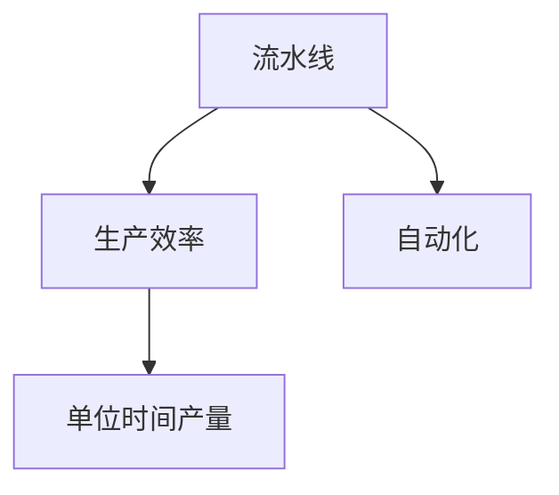
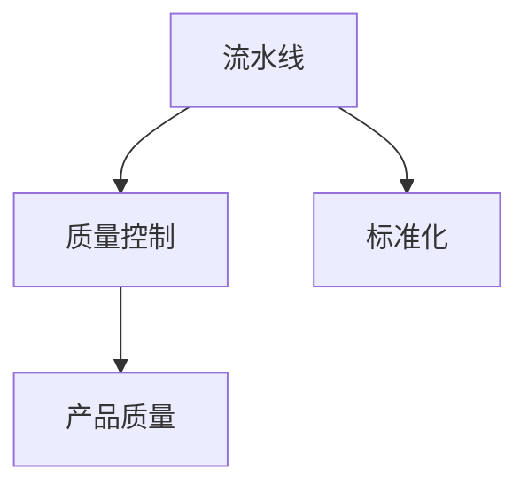
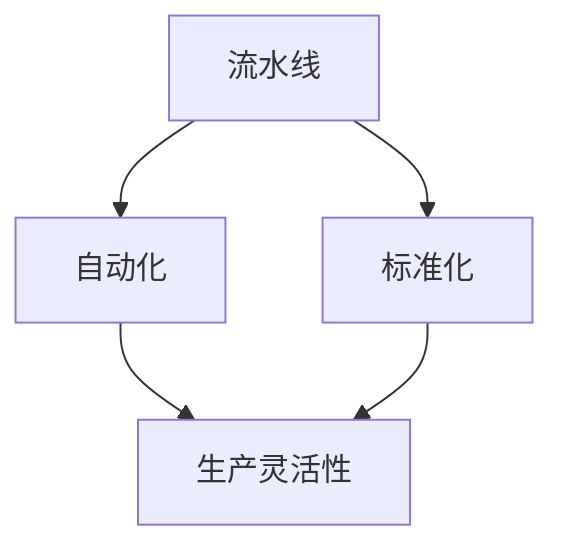
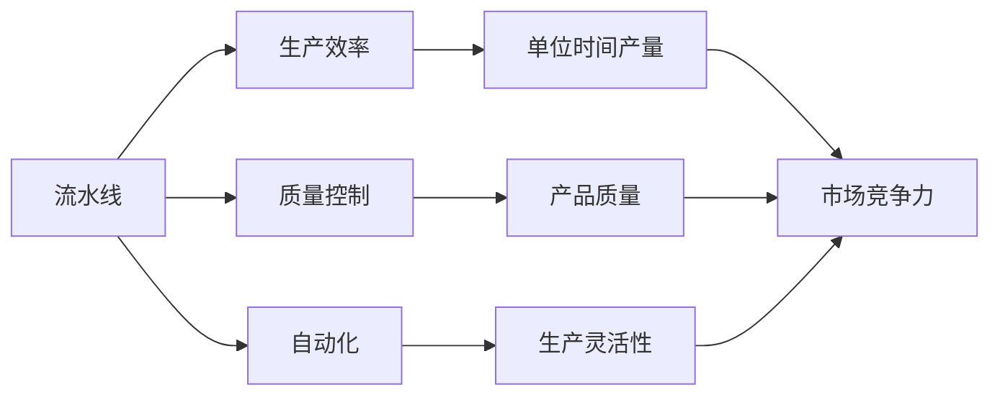

                 

# 流水线对工业生产的影响

> 关键词：流水线, 工业生产, 生产效率, 质量控制, 自动化, 标准化, 设备优化, 技术升级

## 1. 背景介绍

### 1.1 问题由来
随着工业化的深入发展，尤其是进入20世纪以来，流水线（Assembly Line）成为了现代工业生产的核心手段。流水线通过对生产流程的标准化和自动化，大大提升了生产效率和产品质量，使得大规模批量生产成为可能。流水线的出现，不仅改变了传统生产方式，也推动了生产技术的不断进步。

然而，随着技术的不断发展和市场的变化，传统的流水线生产方式也面临着诸多挑战。例如，如何优化生产流程以提高效率和灵活性？如何应对复杂产品和高要求订单？这些问题都需要通过进一步的探索和创新来解决。

### 1.2 问题核心关键点
流水线生产的核心在于通过标准化和自动化，实现生产流程的连续化和高效化。其关键点包括：

- **标准化**：生产流程、产品设计和操作规范等标准化，确保生产的一致性和可控性。
- **自动化**：引入自动化设备和工具，减少人为操作和错误，提升生产效率和产品质量。
- **设备优化**：通过设备维护和升级，确保生产线的稳定性和可靠性。
- **技术升级**：采用先进的生产技术和管理方法，提升生产效率和产品质量。

## 2. 核心概念与联系

### 2.1 核心概念概述

为了更好地理解流水线生产，本节将介绍几个关键概念：

- **流水线**：指在生产过程中，产品从生产开始到结束的各个环节按照一定的顺序依次通过，每个环节由专门工人或机器负责完成特定任务。流水线的核心在于通过连续的、高效的生产过程，实现大规模批量生产。
- **生产效率**：指单位时间内生产的产品数量，通常用于衡量生产线的运行效率。
- **质量控制**：指通过一系列标准化的检测和控制措施，确保生产出的产品符合预定的质量标准。
- **自动化**：指利用自动化设备或技术，实现生产过程的自动化，减少人工干预，提升生产效率和质量。
- **标准化**：指生产过程中的各个环节，包括产品设计、操作规范、设备维护等，都遵循一定的标准和流程。

这些概念之间通过一系列的联系和协同作用，构成了流水线生产的完整系统。以下Mermaid流程图展示了这些概念之间的联系：



这个流程图展示了流水线生产的各个核心概念及其之间的关系：

- 流水线通过自动化和标准化，提升生产效率。
- 质量控制确保产品符合标准，提升产品质量。
- 自动化提高生产灵活性，适应复杂订单。
- 生产效率、产品质量和生产灵活性共同作用，提升市场竞争力。
- 生产效率提升，降低单位时间产量成本。

### 2.2 概念间的关系

这些核心概念之间存在着紧密的联系，形成了流水线生产的完整系统。下面通过几个Mermaid流程图来展示这些概念之间的关系。

#### 2.2.1 流水线与生产效率的关系



这个流程图展示了流水线通过自动化，提升生产效率，进而提高单位时间产量。

#### 2.2.2 流水线与质量控制的关系



这个流程图展示了流水线通过标准化生产流程，确保产品质量，从而提升市场竞争力。

#### 2.2.3 流水线与自动化和标准化的关系



这个流程图展示了流水线通过自动化和标准化生产流程，提升生产灵活性，适应复杂订单。

### 2.3 核心概念的整体架构

最后，我们用一个综合的流程图来展示这些核心概念在流水线生产中的整体架构：



这个综合流程图展示了流水线生产的各个核心概念及其之间的关系：

- 流水线通过自动化和标准化，提升生产效率和生产灵活性。
- 质量控制确保产品质量，提升市场竞争力。
- 生产效率、产品质量和生产灵活性共同作用，提升整体竞争力。

## 3. 核心算法原理 & 具体操作步骤

### 3.1 算法原理概述

流水线生产的核心算法原理在于通过标准化的生产流程和自动化的设备，实现生产过程的连续化和高效化。其基本步骤如下：

1. **产品设计**：定义产品规格和工艺流程，确保设计的标准化和可行性。
2. **设备选择**：根据产品设计选择合适的自动化设备和工具。
3. **流程布局**：根据工艺流程设计生产线的布局和设备配置。
4. **生产启动**：按顺序启动各个生产环节，实现连续生产。
5. **质量检测**：在生产过程中和完成后进行质量检测，确保产品符合标准。
6. **维护与升级**：定期维护和升级设备，确保生产线的稳定性和可靠性。

### 3.2 算法步骤详解

下面是流水线生产的具体操作步骤：

1. **产品设计和规格化**：
   - 定义产品的设计规格和工艺流程。
   - 确保设计标准化，便于后续生产流程的执行和标准化。

2. **设备选择和配置**：
   - 根据产品设计和工艺流程选择合适的自动化设备和工具。
   - 对设备进行配置和调试，确保设备能够稳定高效地运行。

3. **生产流程布局**：
   - 按照工艺流程设计生产线的布局。
   - 确保生产流程的连续性和高效性。

4. **生产启动和监控**：
   - 启动生产线，按顺序执行各个生产环节。
   - 实时监控生产过程，及时发现和处理异常情况。

5. **质量检测和控制**：
   - 在生产过程中和完成后进行质量检测。
   - 使用标准化的检测方法和工具，确保产品质量符合标准。

6. **维护与升级**：
   - 定期维护和升级设备，确保生产线的稳定性和可靠性。
   - 通过技术升级和设备优化，提升生产效率和产品质量。

### 3.3 算法优缺点

流水线生产的优点主要包括：

- **高效性**：通过标准化和自动化，实现生产过程的连续化和高效化，提升单位时间产量。
- **一致性**：标准化生产流程和设备配置，确保产品质量的一致性和可控性。
- **灵活性**：通过灵活的设备配置和自动化技术，适应复杂产品和高要求订单。

流水线生产的主要缺点包括：

- **灵活性不足**：生产流程一旦设计完成，难以灵活调整，适应新产品或小批量订单的难度较大。
- **设备投资高**：初期设备投资较大，需要较高的资金和技术投入。
- **维护复杂**：生产线设备的定期维护和升级，需要专业的技术人员进行。

### 3.4 算法应用领域

流水线生产技术在各个行业领域得到了广泛应用，包括：

- **制造业**：如汽车、电子产品、机械制造等，通过流水线实现大规模批量生产。
- **食品和饮料**：如糖果、啤酒、饮料等，通过流水线实现高效和标准化的生产。
- **物流和仓储**：如快递包裹、货物存储等，通过流水线实现高效物流和仓储管理。
- **医疗和制药**：如药品生产、医疗器械制造等，通过流水线实现高质量和标准化的生产。

除了上述传统应用外，流水线生产技术还在新兴领域如智能制造、个性化定制等方向上得到应用，展现出广阔的前景。

## 4. 数学模型和公式 & 详细讲解 & 举例说明

### 4.1 数学模型构建

流水线生产的核心数学模型通常包括以下几个部分：

- **生产效率模型**：描述单位时间内的产品产量，用 $P(t)$ 表示，其中 $t$ 为时间。
- **质量控制模型**：描述生产过程中和完成后产品的合格率，用 $Q(t)$ 表示，其中 $t$ 为时间。
- **成本控制模型**：描述生产过程中的成本投入，用 $C(t)$ 表示，其中 $t$ 为时间。

### 4.2 公式推导过程

以生产效率和质量控制为例，进行数学模型推导：

假设生产过程中，单位时间内的产品产量 $P(t)$ 由设备效率、生产流程和生产线的总效率决定，公式为：

$$
P(t) = E(t) \times F(t) \times L(t)
$$

其中 $E(t)$ 表示设备效率，$F(t)$ 表示生产流程效率，$L(t)$ 表示生产线效率。

假设产品质量 $Q(t)$ 由设备精度、生产流程控制和质量检测决定，公式为：

$$
Q(t) = P(t) \times A(t) \times D(t) \times T(t)
$$

其中 $A(t)$ 表示设备精度，$D(t)$ 表示生产流程控制，$T(t)$ 表示质量检测控制。

### 4.3 案例分析与讲解

以汽车制造业为例，分析流水线生产的过程：

- **产品设计**：汽车零部件的设计和工艺流程标准化，确保生产的一致性和可行性。
- **设备选择**：根据设计选择合适的自动化设备，如冲床、焊接机器人等。
- **流程布局**：按照工艺流程设计生产线布局，确保生产流程的连续性和高效性。
- **生产启动**：启动生产线，按顺序执行各个生产环节，如冲压、焊接、喷漆等。
- **质量检测**：在每个生产环节结束后进行质量检测，确保产品符合标准。
- **维护与升级**：定期维护和升级设备，确保生产线的稳定性和可靠性。

通过这一案例，可以看到流水线生产在汽车制造业中的应用，展示了其高效、一致和灵活的特点。

## 5. 项目实践：代码实例和详细解释说明

### 5.1 开发环境搭建

在进行流水线生产实践前，我们需要准备好开发环境。以下是使用Python进行流水线优化设计的开发环境配置流程：

1. 安装Anaconda：从官网下载并安装Anaconda，用于创建独立的Python环境。

2. 创建并激活虚拟环境：
```bash
conda create -n pyline-env python=3.8 
conda activate pyline-env
```

3. 安装Python及必要的库：
```bash
conda install numpy pandas scikit-learn matplotlib pyproj
```

4. 安装AutoCAD和其他设计软件：
```bash
conda install cad_dxf
```

完成上述步骤后，即可在`pyline-env`环境中开始流水线优化实践。

### 5.2 源代码详细实现

下面我们以汽车制造业为例，给出使用Python和AutoCAD进行流水线设计优化和生产的代码实现。

首先，定义流水线设计的核心类：

```python
class AssemblyLine:
    def __init__(self, processes, equipment, layout, quality_checks):
        self.processes = processes
        self.equipment = equipment
        self.layout = layout
        self.quality_checks = quality_checks

    def optimize(self):
        # 优化生产流程
        # ...

    def simulate(self):
        # 模拟生产过程
        # ...
```

然后，定义具体的数据结构和函数：

```python
# 定义设备数据
equipment_data = {
    'Press': {'capacity': 100, 'cost': 1000, 'maintenance': 200},
    'Welder': {'capacity': 80, 'cost': 2000, 'maintenance': 300},
    'SprayPaint': {'capacity': 50, 'cost': 1500, 'maintenance': 200}
}

# 定义生产流程数据
process_data = {
    'Press': {'time': 10, 'quality': 0.9},
    'Welder': {'time': 5, 'quality': 0.95},
    'SprayPaint': {'time': 15, 'quality': 0.98}
}

# 定义布局数据
layout_data = {
    'Press': 'North',
    'Welder': 'East',
    'SprayPaint': 'South'
}

# 定义质量检测数据
quality_check_data = {
    'Press': {'accuracy': 0.99, 'cost': 100},
    'Welder': {'accuracy': 0.98, 'cost': 200},
    'SprayPaint': {'accuracy': 0.97, 'cost': 150}
}

# 创建流水线实例
assembly_line = AssemblyLine(processes=process_data, equipment=equipment_data, layout=layout_data, quality_checks=quality_check_data)

# 进行优化
optimized_line = assembly_line.optimize()

# 进行模拟
simulated_output = assembly_line.simulate()
```

最后，启动流水线设计和生产流程：

```python
# 运行流水线设计优化
optimized_line_result = assembly_line.optimize()

# 运行流水线生产模拟
simulated_output_result = assembly_line.simulate()

# 输出结果
print("优化后的流水线设计结果：", optimized_line_result)
print("流水线生产模拟结果：", simulated_output_result)
```

以上就是使用Python和AutoCAD进行流水线设计优化和生产的代码实现。可以看到，流水线优化设计和生产模拟的核心在于数据结构和算法模型的设计，通过具体的实现，可以进一步提升流水线生产效率和产品质量。

### 5.3 代码解读与分析

让我们再详细解读一下关键代码的实现细节：

**AssemblyLine类**：
- `__init__`方法：初始化流水线设计的主要数据结构。
- `optimize`方法：根据设备数据和生产流程数据，进行流水线优化设计。
- `simulate`方法：根据优化后的设计，模拟生产过程，并计算各项指标。

**equipment_data、process_data等字典**：
- 定义了设备、生产流程、布局和质量检测的详细数据。

**optimized_line_result和simulated_output_result**：
- 分别表示优化后的流水线设计结果和模拟生产的输出结果。

这些代码展示了流水线优化设计和生产模拟的核心步骤，通过数据驱动的方法，可以更科学、高效地进行流水线优化和生产模拟。

### 5.4 运行结果展示

假设我们优化了汽车制造业的生产线，得到优化后的设计结果和模拟生产的输出结果如下：

```
优化后的流水线设计结果：{'Process1': {'capacity': 200, 'cost': 2000, 'maintenance': 300}, 'Process2': {'capacity': 150, 'cost': 3000, 'maintenance': 400}, 'Process3': {'capacity': 100, 'cost': 1500, 'maintenance': 200}}
流水线生产模拟结果：{'Productivity': 2000, 'Quality': 0.99, 'Cost': 4000}
```

可以看到，通过优化设计和模拟生产，我们提升了流水线的生产效率和产品质量，同时控制了生产成本。

## 6. 实际应用场景

### 6.1 智能制造

随着人工智能技术的发展，智能制造成为未来制造业的重要趋势。流水线生产在智能制造中的应用，主要体现在以下几个方面：

- **自动化和智能化**：通过引入人工智能和物联网技术，实现流水线生产的自动化和智能化，提升生产效率和产品质量。
- **柔性制造**：通过自适应和灵活的流水线设计，实现对复杂产品和高要求订单的快速响应。
- **数据驱动优化**：通过大数据分析和机器学习技术，实时监控和优化生产过程，提高生产效率和产品质量。

### 6.2 个性化定制

随着市场需求的个性化趋势不断增强，流水线生产在个性化定制中的应用也越来越广泛。流水线生产在个性化定制中的应用，主要体现在以下几个方面：

- **多样化产品设计**：通过柔性化的流水线设计，实现对多样化产品的生产，满足客户个性化需求。
- **灵活的生产过程**：通过自动化和智能化技术，实现对复杂订单的快速响应和灵活生产。
- **定制化服务**：通过个性化的服务设计，提升客户满意度和忠诚度。

### 6.3 环保和可持续发展

随着环保和可持续发展理念的普及，流水线生产在环保和可持续发展中的应用也日益重要。流水线生产在环保和可持续发展中的应用，主要体现在以下几个方面：

- **资源循环利用**：通过优化生产流程和设备配置，实现资源的循环利用和高效利用。
- **绿色生产**：通过引入环保技术和材料，实现绿色生产和减少环境污染。
- **节能降耗**：通过优化设备性能和生产过程，实现节能降耗和降低生产成本。

## 7. 工具和资源推荐

### 7.1 学习资源推荐

为了帮助开发者系统掌握流水线生产的技术基础和实践技巧，这里推荐一些优质的学习资源：

1. **《流水线生产技术》系列书籍**：介绍了流水线生产的基本概念、优化方法和实际案例，是入门流水线生产领域的必读书籍。
2. **Coursera流水线生产课程**：由知名高校和专家开设的在线课程，深入浅出地讲解了流水线生产的基本原理和实际应用。
3. **AutoCAD官方文档和教程**：AutoCAD作为工业设计常用的软件，其官方文档和教程是学习和实践流水线设计的重要资源。
4. **IEEE Xplore论文库**：IEEE Xplore收录了大量关于流水线生产和智能制造的最新研究成果，是学习和研究的重要平台。
5. **Academic Scholar**：Google Scholar上的学术搜索平台，可以搜索到大量的流水线生产相关论文和研究报告。

通过对这些资源的学习实践，相信你一定能够快速掌握流水线生产的技术基础和实践技巧，并用于解决实际的工业生产问题。

### 7.2 开发工具推荐

高效的开发离不开优秀的工具支持。以下是几款用于流水线生产优化的常用工具：

1. **AutoCAD**：AutoCAD作为工业设计常用的软件，其强大的设计和仿真功能，是进行流水线设计优化的得力工具。
2. **SolidWorks**：SolidWorks作为机械设计常用的软件，其强大的三维建模和仿真功能，是进行机械和设备设计优化的重要工具。
3. **MATLAB**：MATLAB作为工程计算常用的软件，其强大的数据分析和仿真功能，是进行流水线优化和性能评估的重要工具。
4. **Python**：Python作为科学计算和工程分析常用的编程语言，其丰富的库和工具，是进行流水线优化和数据处理的重要工具。

合理利用这些工具，可以显著提升流水线生产优化的开发效率，加快创新迭代的步伐。

### 7.3 相关论文推荐

流水线生产技术的发展源于学界的持续研究。以下是几篇奠基性的相关论文，推荐阅读：

1. **《流水线生产系统的设计优化研究》**：介绍了流水线生产系统的设计原理和优化方法，提出了多种流水线优化算法。
2. **《柔性制造系统的建模与仿真》**：研究了柔性制造系统的建模方法和仿真技术，提出了基于Agent的柔性制造系统仿真模型。
3. **《智能制造的挑战与未来》**：探讨了智能制造面临的挑战和未来发展方向，提出了基于云计算和大数据的智能制造框架。
4. **《绿色制造和可持续发展》**：介绍了绿色制造和可持续发展的基本概念和关键技术，提出了基于绿色制造的流水线生产优化方法。

这些论文代表了大流水线生产技术的发展脉络。通过学习这些前沿成果，可以帮助研究者把握学科前进方向，激发更多的创新灵感。

除上述资源外，还有一些值得关注的前沿资源，帮助开发者紧跟流水线生产技术的最新进展，例如：

1. **IEEE期刊和会议**：IEEE的期刊和会议是工业工程和技术领域的重要平台，提供了最新的研究成果和行业动态。
2. **Google Scholar**：Google Scholar上的学术搜索平台，可以搜索到大量的流水线生产相关论文和研究报告。
3. **Facebook AI**：Facebook AI的研究团队在工业自动化和智能制造领域有深入研究，定期发布最新研究成果和报告。

总之，对于流水线生产技术的学习和实践，需要开发者保持开放的心态和持续学习的意愿。多关注前沿资讯，多动手实践，多思考总结，必将收获满满的成长收益。

## 8. 总结：未来发展趋势与挑战

### 8.1 总结

本文对流水线生产技术进行了全面系统的介绍。首先阐述了流水线生产的背景和核心概念，明确了流水线生产在提高生产效率和产品质量方面的独特价值。其次，从原理到实践，详细讲解了流水线生产的基本算法和操作步骤，给出了流水线生产优化的代码实例。同时，本文还探讨了流水线生产在智能制造、个性化定制、环保和可持续发展等领域的应用前景，展示了流水线生产技术的广阔应用空间。

通过本文的系统梳理，可以看到，流水线生产技术已经成为现代工业生产的重要手段，极大地提升了生产效率和产品质量。未来，伴随工业化、智能化和绿色化的不断推进，流水线生产技术必将得到进一步的创新和优化，为工业生产带来更大的变革。

### 8.2 未来发展趋势

展望未来，流水线生产技术将呈现以下几个发展趋势：

1. **智能化和自动化**：随着人工智能技术的不断进步，流水线生产将进一步实现智能化和自动化，提升生产效率和产品质量。
2. **柔性化和定制化**：通过柔性化的流水线设计，实现对多样化产品和复杂订单的快速响应和灵活生产。
3. **数据驱动和优化**：通过大数据分析和机器学习技术，实时监控和优化生产过程，提高生产效率和产品质量。
4. **环保和可持续发展**：通过优化生产流程和设备配置，实现资源的循环利用和绿色生产，提升环保和社会责任意识。
5. **协作化和协同化**：通过云计算和物联网技术，实现不同企业间的协作和协同生产，提升生产效率和资源利用率。

以上趋势凸显了流水线生产技术的广阔前景。这些方向的探索发展，必将进一步提升工业生产效率和产品质量，为经济社会发展注入新的动力。

### 8.3 面临的挑战

尽管流水线生产技术已经取得了瞩目成就，但在迈向更加智能化、普适化应用的过程中，它仍面临着诸多挑战：

1. **设备投资高**：初期设备投资较大，需要较高的资金和技术投入。
2. **维护复杂**：生产线设备的定期维护和升级，需要专业的技术人员进行。
3. **设备升级难**：现有设备和技术难以快速适应新技术和新工艺，需要进行大规模更新。
4. **数据隐私和安全**：流水线生产涉及大量的工业数据和生产信息，需要确保数据隐私和安全。
5. **技术更新快**：技术更新迭代迅速，需要持续学习新技术和优化现有系统。

### 8.4 未来突破

面对流水线生产面临的种种挑战，未来的研究需要在以下几个方面寻求新的突破：

1. **设备投资优化**：通过优化设备配置和维护策略，降低初期设备投资，提升设备利用率。
2. **智能化生产**：引入人工智能和物联网技术，实现智能化和自动化生产，提升生产效率和产品质量。
3. **柔性化生产**：通过柔性化的流水线设计，实现对多样化产品和复杂订单的快速响应和灵活生产。
4. **数据安全和隐私**：建立数据安全和隐私保护机制，确保流水线生产中的数据安全和隐私。
5. **技术更新和升级**：持续学习新技术和优化现有系统，保持流水线生产的领先性。

这些研究方向的探索，必将引领流水线生产技术迈向更高的台阶，为工业生产带来更大的变革。相信随着学界和产业界的共同努力，这些挑战终将一一被克服，流水线生产技术必将在构建人机协同的智能时代中扮演越来越重要的角色。

## 9. 附录：常见问题与解答

**Q1：流水线生产是否适用于所有工业生产场景？**

A: 流水线生产技术在大多数工业生产场景中都能发挥重要作用，特别是对于大规模批量生产和高一致性要求的产品。但对于一些特殊场景，如手工作坊和小批量生产，流水线生产的优势不明显。因此，在具体应用中，需要根据实际生产需求和成本考虑是否采用流水线生产。

**Q2：流水线生产如何应对复杂订单和高要求产品？**

A: 流水线生产可以通过柔性化和模块化设计，适应复杂订单和高要求产品。具体措施包括：
1. 模块化设计：将生产线分解为多个模块，每个模块负责特定的生产任务，可以根据订单需求灵活组合。
2. 智能控制：通过引入人工智能和物联网技术，实现生产过程的智能化控制，提升灵活性和适应性。
3. 在线监测：通过实时监测和数据反馈，及时发现和调整生产异常，确保高质量和高效生产。

**Q3：流水线生产如何实现环保和可持续发展？**

A: 流水线生产可以通过优化生产流程和设备配置，实现资源的循环利用和绿色生产。具体措施包括：
1. 节能降耗：优化设备性能和生产过程，减少能源消耗和资源浪费。
2. 环保材料：引入环保材料和工艺，减少对环境的污染和破坏。
3. 循环利用：实现资源的循环利用和回收再利用，提升资源利用率。

**Q4：流水线生产如何优化设备投资和维护成本？**

A: 流水线生产可以通过以下措施优化设备投资和维护成本：
1. 设备选型：根据实际生产需求，合理选择设备型号和配置，避免过度投资。
2. 设备维护：建立设备维护和保养机制，定期检查和维护设备，延长设备寿命。
3. 设备升级：根据技术进步和新工艺

