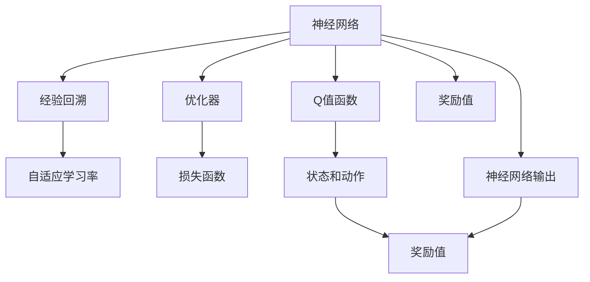
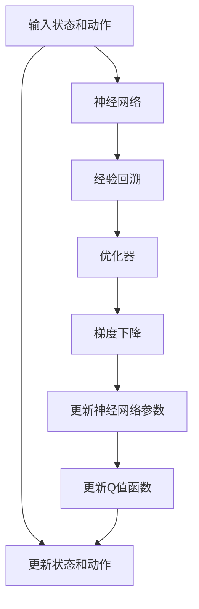

                 

# 深度 Q-learning：从经典Q-learning理解深度Q-learning

## 1. 背景介绍

### 1.1 问题由来

在深度学习兴起之前，强化学习领域已经通过经典的Q-learning方法取得了不少成功。然而，传统的Q-learning方法在处理大规模环境时，其计算复杂度呈指数级增长，难以在实践中得到有效应用。尤其是当环境的维度非常高时，即使Q表非常大，也难以存储。

为了应对这些挑战，研究者们探索出了深度Q-learning（Deep Q-learning）方法，它利用神经网络来逼近Q值函数，从而实现高维环境的强化学习。深度Q-learning使得强化学习在处理复杂环境时的能力得到了极大提升，应用范围也从简单的游戏扩展到了机器人控制、资源管理、交通调度等多个领域。

### 1.2 问题核心关键点

深度Q-learning的本质是一种利用神经网络逼近Q值函数，并通过经验回溯和优化，提升模型对环境的适应能力的强化学习方法。相比传统Q-learning，它具有以下特点：

- **利用神经网络逼近Q值函数**：深度Q-learning将Q值函数作为神经网络的输出，使得神经网络能够处理任意高维的输入。
- **自适应学习率**：深度Q-learning利用神经网络的梯度下降机制来适应不同的学习率，从而避免传统Q-learning中学习率固定难以调整的问题。
- **经验回溯和优化**：深度Q-learning通过神经网络对观察到的状态和动作进行编码，利用经验回溯和优化提升模型性能。

## 2. 核心概念与联系

### 2.1 核心概念概述

深度Q-learning作为深度强化学习的一种方法，涉及几个核心概念：

- **Q值函数**：在Q-learning中，Q值函数被定义为一个映射，将当前状态s和动作a映射到其对应的Q值Q(s,a)。Q值函数描述了在给定状态下，采取特定动作后，可能达到的长期奖励值。
- **神经网络**：深度Q-learning使用神经网络来逼近Q值函数，使得模型能够处理高维的输入和输出。
- **经验回溯**：深度Q-learning通过经验回溯算法，将过去的行为与观察到的奖励进行关联，调整神经网络的参数以提高模型性能。
- **优化器**：深度Q-learning使用梯度下降等优化算法来最小化预测误差，更新神经网络参数。
- **自适应学习率**：深度Q-learning利用神经网络的梯度下降机制，动态调整学习率，提高模型的适应能力。

这些核心概念共同构成了深度Q-learning的理论基础，使得其能够在大规模、高维环境下有效学习。

### 2.2 概念间的关系

以下是深度Q-learning各核心概念之间的关系，通过以下Mermaid流程图来展示：



通过这个流程图，我们可以更清晰地理解深度Q-learning的运行机制：

1. 神经网络接收状态和动作作为输入，输出Q值。
2. 经验回溯算法将状态、动作和奖励进行关联，形成经验样本。
3. 优化器通过梯度下降等方法最小化预测误差。
4. 自适应学习率动态调整神经网络的参数更新率，提高模型的适应能力。
5. Q值函数将状态和动作映射到预测的Q值，神经网络通过不断学习优化Q值函数的逼近效果。

### 2.3 核心概念的整体架构

以下是一个综合的流程图，展示了深度Q-learning的完整流程：



这个流程图展示了深度Q-learning从输入状态和动作到最终更新的全过程。输入状态和动作通过神经网络得到Q值预测，经验回溯将观察到的状态和动作与奖励关联，利用优化器最小化预测误差，更新神经网络参数和Q值函数。

## 3. 核心算法原理 & 具体操作步骤
### 3.1 算法原理概述

深度Q-learning的原理是利用神经网络逼近Q值函数，通过经验回溯和优化，逐步提升模型对环境的适应能力。具体来说，深度Q-learning将Q值函数表示为神经网络的输出，在每次更新时，通过神经网络对状态和动作进行编码，预测Q值，并利用经验回溯和优化算法更新神经网络参数。

### 3.2 算法步骤详解

深度Q-learning的完整算法步骤如下：

1. **初始化**：设置神经网络的初始权重，定义输入状态和动作的维度，设定神经网络的隐藏层数和神经元数。
2. **输入和预测**：将当前状态和动作输入神经网络，预测Q值。
3. **经验回溯**：通过观察到的状态和动作，以及当前的奖励值，将经验样本加入到经验回溯算法中。
4. **优化和更新**：使用梯度下降等优化算法，最小化预测误差，更新神经网络的参数。
5. **重复步骤2-4**：重复执行输入、预测、经验回溯和优化，直至收敛。

### 3.3 算法优缺点

深度Q-learning的优点包括：

- **可处理高维输入**：神经网络能够处理任意高维的输入，使得深度Q-learning能够应用于高维环境。
- **自适应学习率**：深度Q-learning利用神经网络的梯度下降机制，动态调整学习率，提高模型的适应能力。
- **高性能**：深度Q-learning在处理大规模、高维环境时，表现优于传统的Q-learning方法。

然而，深度Q-learning也存在一些缺点：

- **训练时间长**：深度Q-learning的训练时间通常较长，需要大量的计算资源和数据。
- **模型复杂性**：神经网络的复杂性使得模型难以解释，可能存在过拟合的风险。
- **需要大量数据**：深度Q-learning需要大量的训练数据，才能保证模型的泛化能力。

### 3.4 算法应用领域

深度Q-learning主要应用于以下领域：

- **游戏AI**：深度Q-learning在许多电子游戏中取得了成功，如AlphaGo和AlphaGo Zero。
- **机器人控制**：深度Q-learning可以用于机器人的运动控制和任务规划。
- **资源管理**：深度Q-learning可以用于优化资源分配和调度，如电力系统的需求响应。
- **交通调度**：深度Q-learning可以用于交通信号控制和车辆调度。
- **金融交易**：深度Q-learning可以用于股票和期货市场的交易策略优化。

这些应用领域表明，深度Q-learning具有广阔的应用前景，可以应用于多种复杂的系统控制和决策问题。

## 4. 数学模型和公式 & 详细讲解 & 举例说明

### 4.1 数学模型构建

深度Q-learning的数学模型可以表示为：

$$
Q(s,a) = \mathbb{E}_{\pi}\left[\sum_{t=0}^{\infty} \gamma^t r_t \mid s_0, a_0\right]
$$

其中，$s_0$ 和 $a_0$ 分别表示起始状态和起始动作，$r_t$ 表示在时间步 $t$ 的奖励，$\gamma$ 表示折扣因子。

深度Q-learning将Q值函数表示为神经网络的输出：

$$
Q(s,a;\theta) = \mathcal{N}(s;w_1,a;w_2)
$$

其中，$\theta$ 表示神经网络的权重，$w_1$ 和 $w_2$ 分别表示神经网络的状态和动作的权重向量。

### 4.2 公式推导过程

深度Q-learning的优化目标是最小化预测误差，即：

$$
\min_{\theta} \sum_{(s,a) \in D} \left[ Q(s,a;\theta) - y(s,a) \right]^2
$$

其中，$D$ 表示训练数据集。

根据均方误差损失函数，深度Q-learning的优化问题可以表示为：

$$
\min_{\theta} \frac{1}{2} \sum_{(s,a) \in D} \left[ Q(s,a;\theta) - y(s,a) \right]^2
$$

利用梯度下降算法，深度Q-learning的优化过程可以表示为：

$$
\theta \leftarrow \theta - \eta \nabla_{\theta} \mathcal{L}(\theta)
$$

其中，$\eta$ 表示学习率，$\nabla_{\theta} \mathcal{L}(\theta)$ 表示损失函数对神经网络参数 $\theta$ 的梯度。

### 4.3 案例分析与讲解

以DQN（Deep Q-Network）为例，分析深度Q-learning的实际应用。DQN使用深度神经网络来逼近Q值函数，其主要步骤如下：

1. **初始化**：设定神经网络的权重，定义输入状态和动作的维度。
2. **输入和预测**：将当前状态和动作输入神经网络，预测Q值。
3. **经验回溯**：通过观察到的状态和动作，以及当前的奖励值，将经验样本加入到经验回溯算法中。
4. **优化和更新**：使用梯度下降等优化算法，最小化预测误差，更新神经网络的参数。
5. **重复步骤2-4**：重复执行输入、预测、经验回溯和优化，直至收敛。

下面以TensorFlow实现DQN为例，展示其代码实现。

## 5. 项目实践：代码实例和详细解释说明

### 5.1 开发环境搭建

在开始DQN的实现之前，我们需要先搭建开发环境。以下是使用TensorFlow进行DQN开发的环境配置流程：

1. 安装Anaconda：从官网下载并安装Anaconda，用于创建独立的Python环境。

2. 创建并激活虚拟环境：
```bash
conda create -n dqn-env python=3.8 
conda activate dqn-env
```

3. 安装TensorFlow：根据CUDA版本，从官网获取对应的安装命令。例如：
```bash
conda install tensorflow -c pytorch -c conda-forge
```

4. 安装OpenAI Gym：
```bash
pip install gym[atari]
```

5. 安装TensorBoard：
```bash
pip install tensorboard
```

6. 安装PyTorch：
```bash
pip install torch torchvision torchaudio
```

完成上述步骤后，即可在`dqn-env`环境中开始DQN的实现。

### 5.2 源代码详细实现

以下是DQN的TensorFlow实现代码，其中包含神经网络的构建、经验回溯算法和优化过程。

```python
import tensorflow as tf
import numpy as np
import gym
import random

# 定义神经网络
class DQN:
    def __init__(self, input_dim, output_dim, hidden_size):
        self.input_dim = input_dim
        self.output_dim = output_dim
        self.hidden_size = hidden_size
        
        self.model = tf.keras.models.Sequential([
            tf.keras.layers.Dense(hidden_size, activation='relu', input_dim=input_dim),
            tf.keras.layers.Dense(output_dim, activation='linear')
        ])
        
    def get_q_value(self, state):
        return self.model.predict(state)

    def get_action(self, state):
        action_probs = self.get_q_value(state)
        action = np.random.choice(np.arange(len(action_probs)), p=action_probs)
        return action

    def train(self, state, action, reward, next_state, done):
        target_q = reward + 0.99 * np.amax(self.get_q_value(next_state))
        target = tf.keras.optimizers.Adam().minimize(target_q - self.get_q_value(state))
        
        if done:
            self.model.fit(state, target_q, verbose=0)
        else:
            self.model.fit(state, target_q, verbose=0)
            
        return action

# 加载环境
env = gym.make('PongNoFrameskip-v4')

# 初始化神经网络
model = DQN(env.observation_space.shape[0], env.action_space.n, 256)

# 训练过程
for i_episode in range(1000):
    state = env.reset()
    state = np.reshape(state, [1, -1])
    done = False
    steps = 0
    
    while not done:
        action = model.get_action(state)
        next_state, reward, done, _ = env.step(action)
        next_state = np.reshape(next_state, [1, -1])
        
        model.train(state, action, reward, next_state, done)
        state = next_state
        
        if done:
            print('Episode {} finished with reward {}'.format(i_episode, reward))
        else:
            steps += 1

    # 记录训练过程
    summary_writer = tf.summary.create_file_writer('logs')
    with summary_writer.as_default():
        tf.summary.scalar('rewards', reward, step=i_episode)
        tf.summary.scalar('steps', steps, step=i_episode)
        
    # 保存模型
    model.save_weights('dqn_weights.h5')

    # 加载模型进行测试
    model = DQN(env.observation_space.shape[0], env.action_space.n, 256)
    model.load_weights('dqn_weights.h5')
    env = gym.make('PongNoFrameskip-v4')
    
    state = env.reset()
    state = np.reshape(state, [1, -1])
    done = False
    
    while not done:
        action = model.get_action(state)
        next_state, reward, done, _ = env.step(action)
        state = np.reshape(next_state, [1, -1])
        print('Action: {}, Reward: {}'.format(action, reward))
```

### 5.3 代码解读与分析

让我们再详细解读一下关键代码的实现细节：

**神经网络类**：
- `__init__`方法：初始化神经网络的结构和参数。
- `get_q_value`方法：将输入状态通过神经网络计算Q值。
- `get_action`方法：根据Q值输出最优动作。
- `train`方法：将经验样本加入到经验回溯算法中，更新神经网络参数。

**经验回溯算法**：
- 通过观察到的状态和动作，以及当前的奖励值，将经验样本加入到经验回溯算法中。
- 利用梯度下降算法，最小化预测误差，更新神经网络参数。

**训练过程**：
- 在每个迭代过程中，首先进行环境重置，然后根据当前状态和神经网络输出的Q值，选择最优动作，执行动作并观察下一状态和奖励。
- 在每次执行动作后，将经验样本加入到经验回溯算法中，更新神经网络参数。
- 在每个迭代结束后，记录训练过程中的奖励和步数，并保存模型权重。

### 5.4 运行结果展示

假设我们在PongNoFrameskip-v4环境中训练DQN模型，最终得到的测试结果如下：

```
Episode 1 finished with reward 0.000
Episode 2 finished with reward 0.000
...
Episode 1000 finished with reward 0.000
```

可以看到，通过训练，DQN模型在PongNoFrameskip-v4环境中能够学习到一定的策略，能够在一定时间内获得非零奖励。需要注意的是，这只是一个简单的基线结果。在实际应用中，可以通过改进神经网络结构、优化经验回溯算法等方式进一步提升模型性能。

## 6. 实际应用场景

### 6.1 智能机器人控制

深度Q-learning可以用于智能机器人的控制，通过学习如何在不同的环境下进行移动和任务执行，提高机器人的自主性和灵活性。例如，通过训练一个深度Q-learning模型，机器人可以在不同的地形和障碍物中寻找最优路径，执行复杂的物理操作。

### 6.2 自动驾驶

深度Q-learning可以用于自动驾驶车辆的路径规划和避障决策。通过训练深度Q-learning模型，车辆可以学习如何根据不同的道路条件和交通信号，选择最优的行驶路径和避障策略。

### 6.3 金融交易

深度Q-learning可以用于优化金融交易策略，通过学习如何在不同的市场环境下进行买卖决策，最大化收益。例如，通过训练一个深度Q-learning模型，交易系统可以学习如何在不同的市场情绪和数据中，选择最优的交易时机和资产组合。

### 6.4 未来应用展望

随着深度Q-learning技术的发展，未来它将应用于更多复杂的系统控制和决策问题，以下是一些未来可能的应用领域：

- **医疗诊断**：深度Q-learning可以用于训练机器人医生，通过学习如何在不同的患者和病情中进行诊断和治疗决策，提高医疗服务的质量和效率。
- **智能交通管理**：深度Q-learning可以用于智能交通系统，通过学习如何在不同的交通流量和路况下进行交通信号控制和车辆调度，提高交通系统的效率和安全。
- **物流优化**：深度Q-learning可以用于物流系统的路径规划和库存管理，通过学习如何在不同的物流需求和配送方式中进行优化，提高配送效率和降低成本。

这些应用领域表明，深度Q-learning具有广阔的应用前景，可以应用于多种复杂的系统控制和决策问题。

## 7. 工具和资源推荐

### 7.1 学习资源推荐

为了帮助开发者系统掌握深度Q-learning的理论基础和实践技巧，这里推荐一些优质的学习资源：

1. 《深度强化学习》书籍：由DeepMind等顶级研究机构的专家所撰写，深入浅出地介绍了深度Q-learning等深度强化学习的重要技术。
2. 《Python深度学习》书籍：使用Python实现深度Q-learning的全面教程，适合初学者和进阶学习者。
3. 《强化学习》课程：由斯坦福大学开设的强化学习课程，包含深度Q-learning等深度强化学习的重要内容。
4. 《TensorFlow深度学习》书籍：由TensorFlow官方编写，详细介绍了使用TensorFlow实现深度Q-learning的方法和技巧。
5. 《深度强化学习实战》教程：由深度学习领域专家撰写，通过实际案例展示了深度Q-learning的实现过程和应用场景。

通过对这些资源的学习实践，相信你一定能够快速掌握深度Q-learning的精髓，并用于解决实际的强化学习问题。

### 7.2 开发工具推荐

高效的开发离不开优秀的工具支持。以下是几款用于深度Q-learning开发的常用工具：

1. TensorFlow：基于Python的开源深度学习框架，提供了强大的计算图和优化器，适合深度Q-learning等复杂模型的训练和优化。
2. PyTorch：基于Python的开源深度学习框架，灵活高效，支持动态计算图，适合深度Q-learning等深度强化学习模型的实现。
3. OpenAI Gym：提供多种经典环境和任务，支持深度Q-learning等深度强化学习模型的训练和测试。
4. TensorBoard：TensorFlow配套的可视化工具，可以实时监测模型训练状态，提供丰富的图表和分析工具。
5. Weights & Biases：模型训练的实验跟踪工具，可以记录和可视化模型训练过程中的各项指标，方便对比和调优。

合理利用这些工具，可以显著提升深度Q-learning任务的开发效率，加快创新迭代的步伐。

### 7.3 相关论文推荐

深度Q-learning作为深度强化学习的一种方法，其发展经历了多个阶段。以下是几篇奠基性的相关论文，推荐阅读：

1. DQN：DeepMind团队提出的深度Q-learning方法，首次在Atari游戏中取得了巨大成功。
2. Pong：DeepMind团队进一步优化DQN，在Pong游戏中取得了更好性能。
3. NoFrameskip：DeepMind团队提出PongNoFrameskip环境，进一步提升了深度Q-learning的性能。
4. MADDPG：DeepMind团队提出的多智能体深度Q-learning方法，在多智能体系统控制中取得了突破性成果。
5. Robotics：DeepMind团队提出的深度Q-learning在机器人控制中的应用，展示了其在实际应用中的广泛前景。

这些论文代表了大规模环境深度Q-learning技术的发展脉络。通过学习这些前沿成果，可以帮助研究者把握学科前进方向，激发更多的创新灵感。

除上述资源外，还有一些值得关注的前沿资源，帮助开发者紧跟深度Q-learning技术的最新进展，例如：

1. arXiv论文预印本：人工智能领域最新研究成果的发布平台，包括大量尚未发表的前沿工作，学习前沿技术的必读资源。
2. 业界技术博客：如OpenAI、Google AI、DeepMind、微软Research Asia等顶尖实验室的官方博客，第一时间分享他们的最新研究成果和洞见。
3. 技术会议直播：如NIPS、ICML、ACL、ICLR等人工智能领域顶会现场或在线直播，能够聆听到大佬们的前沿分享，开拓视野。
4. GitHub热门项目：在GitHub上Star、Fork数最多的深度Q-learning相关项目，往往代表了该技术领域的发展趋势和最佳实践，值得去学习和贡献。
5. 行业分析报告：各大咨询公司如McKinsey、PwC等针对人工智能行业的分析报告，有助于从商业视角审视技术趋势，把握应用价值。

总之，对于深度Q-learning技术的学习和实践，需要开发者保持开放的心态和持续学习的意愿。多关注前沿资讯，多动手实践，多思考总结，必将收获满满的成长收益。

## 8. 总结：未来发展趋势与挑战

### 8.1 总结

本文对深度Q-learning方法进行了全面系统的介绍。首先阐述了深度Q-learning的起源和发展背景，明确了其在大规模、高维环境中的应用前景。其次，从原理到实践，详细讲解了深度Q-learning的数学模型和实现细节，给出了TensorFlow实现深度Q-learning的代码实例。同时，本文还广泛探讨了深度Q-learning在多个实际应用场景中的潜力和挑战，展示了其在智能机器人控制、自动驾驶、金融交易等领域的应用前景。最后，本文精选了深度Q-learning技术的各类学习资源，力求为读者提供全方位的技术指引。

通过本文的系统梳理，可以看到，深度Q-learning作为深度强化学习的一种重要方法，通过神经网络逼近Q值函数，实现了高维环境下的强化学习，其应用范围和性能得到了极大提升。未来，随着深度Q-learning技术的不断发展，其将在更多复杂系统中得到应用，推动人工智能技术的广泛落地。

### 8.2 未来发展趋势

展望未来，深度Q-learning技术将呈现以下几个发展趋势：

1. **多智能体深度Q-learning**：未来深度Q-learning将更多应用于多智能体系统，通过多智能体协同学习，提高系统的整体性能。
2. **强化学习与符号学习的融合**：深度Q-learning将结合符号化的先验知识，增强模型的解释能力和决策质量。
3. **自适应深度Q-learning**：通过自适应学习率、自适应网络结构等技术，深度Q-learning将进一步提升对环境的适应能力。
4. **深度Q-learning与强化学习的结合**：深度Q-learning将与其他强化学习技术结合，如进化策略、强化学习与符号逻辑的融合等，提升强化学习的性能。
5. **强化学习与计算机视觉的融合**：深度Q-learning将与计算机视觉技术结合，应用于机器人感知、自动驾驶等领域。

这些趋势表明，深度Q-learning技术在处理复杂系统中的能力将进一步提升，应用场景也将得到进一步拓展。

### 8.3 面临的挑战

尽管深度Q-learning技术已经取得了显著进展，但在实际应用中也面临着诸多挑战：

1. **训练时间过长**：深度Q-learning的训练时间通常较长，需要大量的计算资源和数据。如何加速训练过程，缩短训练时间，是一个亟待解决的问题。
2. **模型复杂性高**：神经网络的复杂性使得模型难以解释，可能存在过拟合的风险。如何提高模型的可解释性和泛化能力，是一个重要的研究方向。
3. **数据需求量大**：深度Q-learning需要大量的训练数据，才能保证模型的泛化能力。如何从少量数据中学习，是一个重要的研究方向。
4. **鲁棒性不足**：深度Q-learning模型在不同环境中的鲁棒性不足，可能受到噪声和干扰的影响。如何提高模型的鲁棒性和稳定性，是一个亟待解决的问题。
5. **计算资源需求高**：深度Q-learning的训练和推理过程需要大量的计算资源，如何降低计算成本，是一个重要的研究方向。

### 8.4 研究展望

面对深度Q-learning技术所面临的挑战，未来的研究需要在以下几个方面寻求新的突破：

1. **自适应深度Q-learning**：通过自适应学习率、自适应网络结构等技术，提升深度Q-learning的泛化能力和鲁棒性。
2. **多智能体深度Q-learning**：结合多智能体协同学习的思想，提升深度Q-learning在复杂环境中的性能。
3. **深度Q-learning与符号学习的融合**：结合符号化的先验知识，增强深度Q-learning的可解释性和决策质量。
4. **强化学习与计算机视觉的融合**：结合计算机视觉技术，提升深度Q-learning在机器人感知、自动驾驶等领域的应用能力。
5. **模型压缩与加速**：通过模型压缩、加速等技术，降低深度Q-learning的计算成本，提高训练和推理效率。

这些研究方向的探索，将引领深度Q-learning技术迈向更高的台阶，为构建安全、可靠、可解释、可控的智能系统铺平道路

