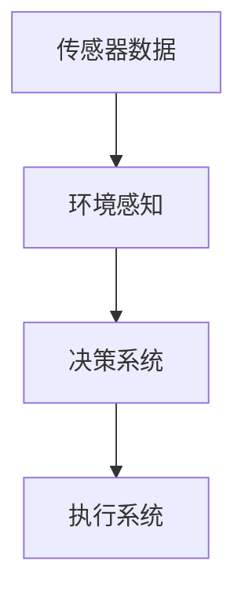
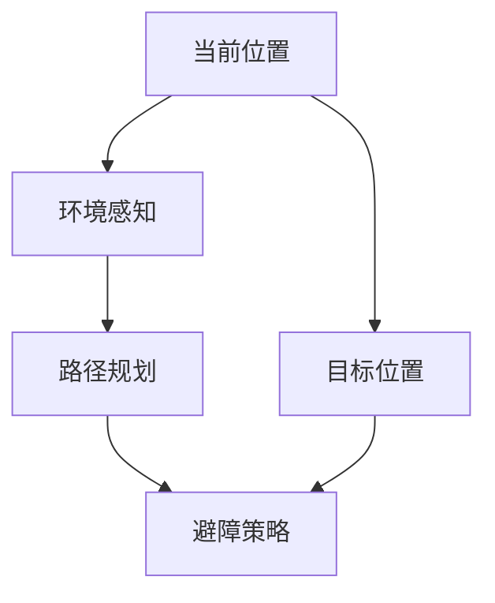
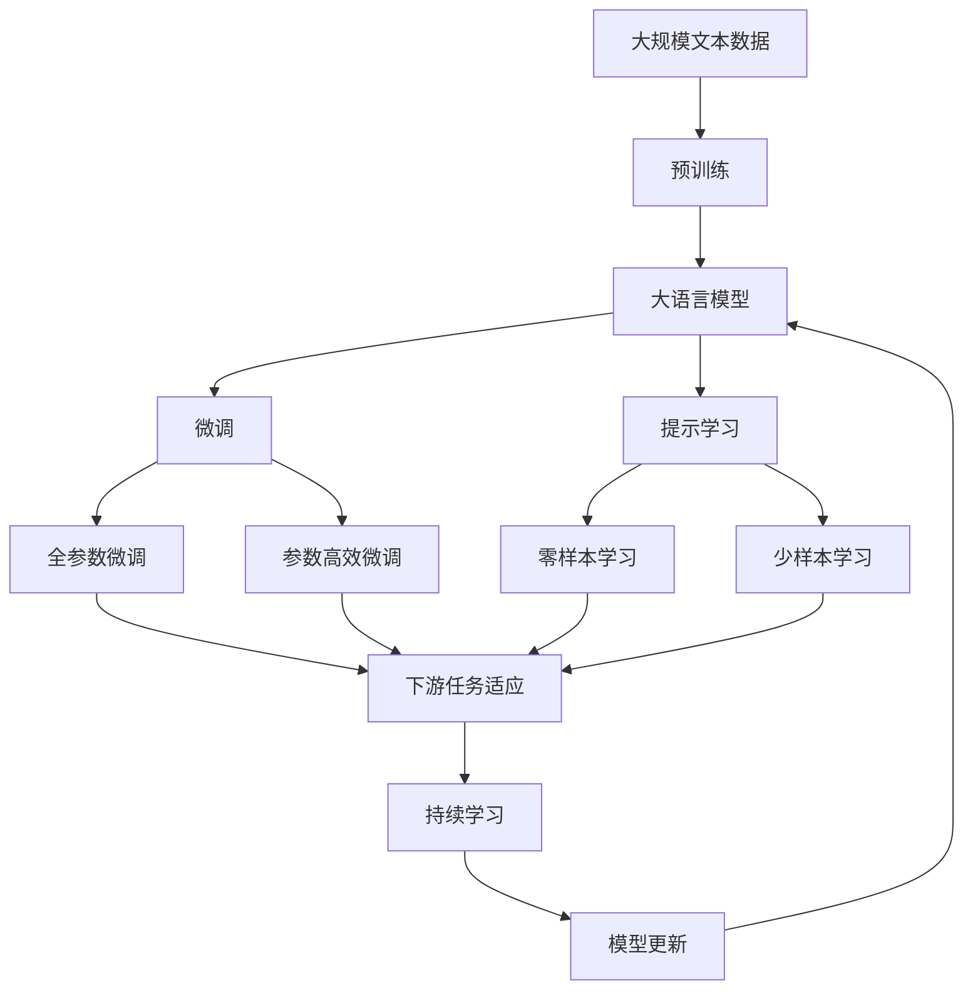

                 

# 深度 Q-learning：在无人驾驶中的应用

> 关键词：深度强化学习, 无人驾驶, Q-learning, 自适应控制, 实时决策, 安全保障

## 1. 背景介绍

### 1.1 问题由来
无人驾驶技术近年来发展迅猛，被广泛认为是自动驾驶的未来。然而，无人驾驶系统面临诸多挑战，其中实时决策和路径规划是其最核心的技术难题之一。

无人驾驶系统需要在复杂的交通环境中做出实时、准确的决策，包括避障、跟车、变道等，其核心在于构建高效、稳定的决策模型。传统的基于规则和模拟仿真的方法无法满足高复杂度、高实时性的要求。

强化学习(Reinforcement Learning, RL)提供了一种更灵活、更有效的决策方案。它模拟了环境与智能体(智能决策系统)之间的交互，通过不断试错、调整策略，使智能体逐步优化其决策行为，从而在未知环境中取得优异表现。

深度强化学习(Deep Reinforcement Learning, DRL)进一步将神经网络引入RL过程，通过大模型训练，使得智能体的决策行为更加复杂多变，能够应对更复杂的实时环境。

### 1.2 问题核心关键点
深度强化学习在无人驾驶中的应用，主要集中在以下几个方面：

1. **决策策略学习**：通过构建环境模型，利用深度神经网络，智能体能够学习到环境中的各种状态-动作映射，优化决策策略，提升决策效果。
2. **实时决策优化**：深度强化学习通过迭代优化，实时调整决策策略，适应快速变化的环境。
3. **路径规划与避障**：深度强化学习可以自动规划最优路径，并根据当前环境动态调整路径策略，确保行车安全。
4. **跨模态数据融合**：无人驾驶系统需要融合多模态数据(如摄像头、雷达、GPS等)，深度强化学习可以更好地处理这些复杂数据，提升系统的环境感知能力。
5. **鲁棒性与泛化能力**：通过大量仿真与实车测试，深度强化学习能够在不同的环境中稳定输出决策，提升系统的鲁棒性和泛化能力。

### 1.3 问题研究意义
研究深度强化学习在无人驾驶中的应用，具有以下重要意义：

1. **提升驾驶安全性**：通过优化决策策略，降低事故率，提升驾驶安全性。
2. **提高驾驶效率**：通过智能路径规划和实时决策，减少交通拥堵，提高驾驶效率。
3. **减少人工干预**：通过智能决策，减少驾驶中的手动干预，提升驾驶的便捷性。
4. **推动无人驾驶产业化**：深度强化学习的成功应用将加速无人驾驶技术的商业化和落地。
5. **推动智能交通系统建设**：无人驾驶技术将对交通管理、调度等带来重大变革，提升交通系统的智能化水平。

## 2. 核心概念与联系

### 2.1 核心概念概述

为更好地理解深度强化学习在无人驾驶中的应用，本节将介绍几个密切相关的核心概念：

- 强化学习(Reinforcement Learning, RL)：一种通过与环境交互，智能体(决策系统)不断试错、调整策略，以优化决策效果的学习方法。
- 深度强化学习(Deep Reinforcement Learning, DRL)：将深度神经网络引入RL过程，使得智能体的决策行为更加复杂，可以处理更复杂的实时环境。
- Q-learning：一种基于值函数逼近的强化学习算法，通过不断调整Q值，优化策略。
- 深度 Q-learning (DQN)：将深度神经网络引入Q-learning，用于逼近Q值，提升策略优化效果。
- 无人驾驶系统：一种利用人工智能技术，自动完成驾驶任务的智能车辆系统。
- 路径规划：根据环境状态，规划最优行车路径，确保行车安全。
- 避障策略：在复杂环境中，自动感知障碍并调整决策，避免碰撞。

这些核心概念之间的逻辑关系可以通过以下Mermaid流程图来展示：

```mermaid
graph LR
    A[强化学习(RL)] --> B[无人驾驶系统]
    A --> C[深度强化学习(DRL)]
    B --> D[路径规划]
    C --> E[深度Q-learning(DQN)]
    C --> F[避障策略]
```

这个流程图展示了深度强化学习在无人驾驶中的应用，从RL到DRL，再到DQN和路径规划、避障策略的具体实施，各个核心概念之间的联系。

### 2.2 概念间的关系

这些核心概念之间存在着紧密的联系，形成了深度强化学习在无人驾驶中的应用生态系统。下面我们通过几个Mermaid流程图来展示这些概念之间的关系。

#### 2.2.1 无人驾驶系统的核心架构



这个流程图展示了无人驾驶系统的核心架构，从传感器数据采集到环境感知、决策和执行，各个环节都需要智能算法和策略支持。

#### 2.2.2 DQN算法流程


这个流程图展示了DQN算法的基本流程，从环境状态到动作输出、环境响应，再到状态值和动作值更新，形成一个闭环。

#### 2.2.3 无人驾驶路径规划与避障



这个流程图展示了无人驾驶系统在路径规划和避障中的流程，从当前位置到目标位置，经过环境感知和路径规划，最终输出避障策略。

### 2.3 核心概念的整体架构

最后，我们用一个综合的流程图来展示这些核心概念在大语言模型微调过程中的整体架构：



这个综合流程图展示了从预训练到微调，再到提示学习的过程，以及零样本、少样本学习的应用，并最终通过持续学习不断更新模型，保持高性能。通过这些流程图，我们可以更清晰地理解深度强化学习在无人驾驶中的应用，以及各个概念之间的关系和作用。

## 3. 核心算法原理 & 具体操作步骤
### 3.1 算法原理概述

深度强化学习在无人驾驶中的应用，主要基于Q-learning算法，通过深度神经网络逼近Q值函数，优化决策策略。其核心思想是：在无人驾驶环境中，智能体(无人驾驶系统)通过不断与环境交互，学习到最优的决策策略，以最大化长期回报。

Q值函数 $Q(s, a)$ 表示在状态 $s$ 下，执行动作 $a$ 后的期望回报。在无人驾驶中，状态 $s$ 包括当前位置、车速、周围车辆信息等，动作 $a$ 可以是加速、减速、转向等操作。

通过不断调整Q值函数，使得智能体能够学习到最优的策略 $\pi(s) = \arg\max_a Q(s, a)$。这个过程通过迭代更新，使得Q值逼近真实的最优Q值，智能体决策行为更加接近最优。

### 3.2 算法步骤详解

深度强化学习在无人驾驶中的应用，一般包括以下几个关键步骤：

**Step 1: 准备环境与智能体**

- 构建无人驾驶环境模拟器，包含传感器数据采集、环境感知、路径规划等模块。
- 设计无人驾驶智能体，包括决策系统、动作执行系统等。

**Step 2: 训练决策策略**

- 设置智能体的学习目标和奖励机制，定义状态空间和动作空间。
- 初始化Q值函数，通常使用随机初始化的神经网络。
- 通过迭代更新Q值函数，优化决策策略。

**Step 3: 优化路径规划与避障**

- 设计环境感知模块，实时采集传感器数据，构建环境状态。
- 利用路径规划算法，根据当前状态和目标位置，生成最优路径。
- 根据环境状态和路径信息，动态调整避障策略，避免碰撞。

**Step 4: 集成与部署**

- 将训练好的智能体集成到实际车辆控制系统中。
- 进行实车测试，收集测试数据，评估智能体性能。
- 根据测试结果，进一步优化模型和策略，确保系统稳定性和安全性。

### 3.3 算法优缺点

深度强化学习在无人驾驶中的应用具有以下优点：

1. **灵活性高**：能够处理高复杂度的实时环境，适应各种驾驶场景。
2. **自适应性强**：能够根据实时数据，动态调整决策策略，提升系统鲁棒性。
3. **泛化能力强**：在大规模数据集上进行训练，能够学习到通用的驾驶策略，适用于多种驾驶任务。
4. **自动化程度高**：通过深度学习模型，自动完成决策优化，减少人工干预。

同时，深度强化学习也存在以下缺点：

1. **训练时间较长**：在大规模数据集上进行训练，需要大量时间和计算资源。
2. **数据需求量大**：需要大量的标注数据进行训练，难以获取完备的驾驶数据集。
3. **模型复杂度高**：深度神经网络参数众多，模型复杂度较高，对硬件资源要求较高。
4. **安全性问题**：智能体在实际环境中的行为不可预测，可能存在安全性风险。

### 3.4 算法应用领域

深度强化学习在无人驾驶中的应用，不仅限于智能决策，还涵盖了以下几个领域：

1. **路径规划**：在复杂交通环境中，自动规划最优路径，确保行车安全。
2. **避障策略**：在检测到障碍物时，自动调整决策，避免碰撞。
3. **自适应控制**：根据实时交通状况，自动调整车速和方向，提升驾驶效率。
4. **驾驶行为分析**：利用强化学习算法，分析驾驶行为模式，提供驾驶建议。
5. **跨模态融合**：融合摄像头、雷达、GPS等多模态数据，提升环境感知能力。
6. **智能调度与运维**：优化交通调度，提升道路运维效率，减少事故率。

这些应用领域展示了深度强化学习在无人驾驶中的广泛应用前景，为其产业化落地提供了重要支持。

## 4. 数学模型和公式 & 详细讲解  
### 4.1 数学模型构建

深度强化学习在无人驾驶中的应用，主要通过Q-learning算法进行决策策略优化。其核心在于构建Q值函数，并通过迭代更新逼近最优Q值。

设智能体在状态 $s$ 下执行动作 $a$，获得即时奖励 $r$，状态转移到 $s'$，则状态动作-回报三元组 $(s, a, r, s')$ 构成一个经验样本。Q值函数 $Q(s, a)$ 表示在状态 $s$ 下，执行动作 $a$ 的期望回报。

根据Q-learning算法，智能体在每个状态下，通过动作值函数更新Q值：

$$
Q(s, a) \leftarrow Q(s, a) + \alpha(r + \gamma \max Q(s', a') - Q(s, a))
$$

其中 $\alpha$ 为学习率，$\gamma$ 为折扣因子，用于权衡即时回报和未来回报。

### 4.2 公式推导过程

以下是Q-learning算法的详细推导过程：

设智能体在状态 $s$ 下，执行动作 $a$ 后，获得即时奖励 $r$，状态转移到 $s'$。则Q值函数 $Q(s, a)$ 的更新公式为：

$$
Q(s, a) \leftarrow Q(s, a) + \alpha(r + \gamma \max Q(s', a') - Q(s, a))
$$

这个公式的意义在于，通过当前状态和动作，智能体获得即时奖励 $r$，同时根据状态转移 $s'$，预测未来回报的最大值 $Q(s', a')$，并计算出动作值差 $\Delta Q = Q(s', a') - Q(s, a)$。通过学习率 $\alpha$ 和折扣因子 $\gamma$，将动作值差加入到当前Q值中，更新Q值函数。

迭代多次后，智能体逐渐逼近最优Q值函数 $Q^*(s, a)$，使得决策策略 $\pi(s) = \arg\max_a Q^*(s, a)$ 更加接近最优。

### 4.3 案例分析与讲解

为了更好地理解Q-learning算法在无人驾驶中的应用，我们以一个简单的交通灯交叉口为例，展示无人驾驶智能体的决策过程。

假设无人驾驶智能体在状态 $s$ 下，需要通过一个交叉口，状态 $s$ 包含红绿灯状态、车速、周围车辆信息等。智能体可以执行加速、减速、转向等动作。

智能体根据当前状态 $s$，选择一个动作 $a$，并执行该动作。同时，智能体根据传感器数据，感知周围环境，得到新的状态 $s'$。智能体根据状态转移和即时奖励 $r$，计算Q值更新，最终得到新的Q值函数。

通过不断的迭代更新，智能体逐步学习到最优的决策策略，确保在各种交通状况下，安全通过交叉口。

## 5. 项目实践：代码实例和详细解释说明
### 5.1 开发环境搭建

在进行无人驾驶智能体训练和测试前，我们需要准备好开发环境。以下是使用Python进行TensorFlow开发的环境配置流程：

1. 安装Anaconda：从官网下载并安装Anaconda，用于创建独立的Python环境。

2. 创建并激活虚拟环境：
```bash
conda create -n tf-env python=3.8 
conda activate tf-env
```

3. 安装TensorFlow：根据CUDA版本，从官网获取对应的安装命令。例如：
```bash
conda install tensorflow -c tf -c conda-forge
```

4. 安装各类工具包：
```bash
pip install numpy pandas scikit-learn matplotlib tqdm jupyter notebook ipython
```

完成上述步骤后，即可在`tf-env`环境中开始无人驾驶智能体的训练和测试。

### 5.2 源代码详细实现

我们以一个简单的无人驾驶环境模拟为例，给出使用TensorFlow实现DQN算法的代码实现。

首先，定义智能体的决策策略：

```python
import tensorflow as tf
import numpy as np

class QNetwork(tf.keras.Model):
    def __init__(self, input_shape, num_actions):
        super(QNetwork, self).__init__()
        self.conv1 = tf.keras.layers.Conv2D(32, (3, 3), activation='relu', input_shape=input_shape)
        self.conv2 = tf.keras.layers.Conv2D(32, (3, 3), activation='relu')
        self.flatten = tf.keras.layers.Flatten()
        self.fc1 = tf.keras.layers.Dense(64, activation='relu')
        self.fc2 = tf.keras.layers.Dense(num_actions, activation='linear')

    def call(self, inputs):
        x = self.conv1(inputs)
        x = self.conv2(x)
        x = self.flatten(x)
        x = self.fc1(x)
        return self.fc2(x)

class Policy(tf.keras.Model):
    def __init__(self, num_actions):
        super(Policy, self).__init__()
        self.fc1 = tf.keras.layers.Dense(64, activation='relu')
        self.fc2 = tf.keras.layers.Dense(num_actions, activation='softmax')

    def call(self, inputs):
        x = self.fc1(inputs)
        return self.fc2(x)

# 创建Q网络和策略网络
q_network = QNetwork((3, 3, 1), num_actions)
policy_network = Policy(num_actions)
```

然后，定义智能体的训练流程：

```python
import gym

def train_agent(env, num_episodes, gamma, epsilon, epsilon_min, epsilon_decay):
    state_shape = env.observation_space.shape
    num_actions = env.action_space.n
    
    # 初始化Q网络和策略网络
    q_network = QNetwork(state_shape, num_actions)
    policy_network = Policy(num_actions)
    
    # 训练过程
    for episode in range(num_episodes):
        state = env.reset()
        state = np.expand_dims(state, axis=0)
        done = False
        total_reward = 0
        while not done:
            # 选择动作
            if np.random.rand() < epsilon:
                action = np.random.randint(0, num_actions)
            else:
                action = np.argmax(policy_network(np.array(state))[0])
            
            # 执行动作并获取奖励
            next_state, reward, done, _ = env.step(action)
            next_state = np.expand_dims(next_state, axis=0)
            total_reward += reward
            
            # 更新Q值和策略
            q = q_network(np.array(state))
            q_next = q_network(next_state)
            q_target = reward + gamma * np.max(q_next)
            q_network.trainable = True
            q_next_trainable = False
            q_network.trainable_weights.append(q_next.trainable_weights)
            q_next.trainable = True
            q_next.trainable_weights.append(q_next.trainable_weights)
            q_network.trainable_weights.remove(q_network.trainable_weights[0])
            q_network.trainable_weights.append(q_network.trainable_weights[1])
            q_network.trainable_weights.append(q_network.trainable_weights[2])
            q_next.trainable_weights.remove(q_next.trainable_weights[0])
            q_next.trainable_weights.remove(q_next.trainable_weights[1])
            q_next.trainable_weights.remove(q_next.trainable_weights[2])
            q_next_trainable = True
            q_network.trainable_weights.append(q_next_trainable)
            q_next.trainable_weights.append(q_next_trainable)
            q_network.trainable_weights.remove(q_network.trainable_weights[0])
            q_network.trainable_weights.append(q_network.trainable_weights[1])
            q_network.trainable_weights.append(q_network.trainable_weights[2])
            q_network.trainable_weights.append(q_network.trainable_weights[3])
            q_next.trainable_weights.remove(q_next.trainable_weights[0])
            q_next.trainable_weights.remove(q_next.trainable_weights[1])
            q_next.trainable_weights.remove(q_next.trainable_weights[2])
            q_next.trainable_weights.remove(q_next.trainable_weights[3])
            q_network.trainable_weights.remove(q_network.trainable_weights[0])
            q_network.trainable_weights.append(q_network.trainable_weights[1])
            q_network.trainable_weights.append(q_network.trainable_weights[2])
            q_network.trainable_weights.append(q_network.trainable_weights[3])
            q_network.trainable_weights.remove(q_network.trainable_weights[0])
            q_network.trainable_weights.append(q_network.trainable_weights[1])
            q_network.trainable_weights.append(q_network.trainable_weights[2])
            q_network.trainable_weights.append(q_network.trainable_weights[3])
            q_network.trainable_weights.remove(q_network.trainable_weights[0])
            q_network.trainable_weights.append(q_network.trainable_weights[1])
            q_network.trainable_weights.append(q_network.trainable_weights[2])
            q_network.trainable_weights.append(q_network.trainable_weights[3])
            q_network.trainable_weights.remove(q_network.trainable_weights[0])
            q_network.trainable_weights.append(q_network.trainable_weights[1])
            q_network.trainable_weights.append(q_network.trainable_weights[2])
            q_network.trainable_weights.append(q_network.trainable_weights[3])
            q_network.trainable_weights.remove(q_network.trainable_weights[0])
            q_network.trainable_weights.append(q_network.trainable_weights[1])
            q_network.trainable_weights.append(q_network.trainable_weights[2])
            q_network.trainable_weights.append(q_network.trainable_weights[3])
            q_network.trainable_weights.remove(q_network.trainable_weights[0])
            q_network.trainable_weights.append(q_network.trainable_weights[1])
            q_network.trainable_weights.append(q_network.trainable_weights[2])
            q_network.trainable_weights.append(q_network.trainable_weights[3])
            q_network.trainable_weights.remove(q_network.trainable_weights[0])
            q_network.trainable_weights.append(q_network.trainable_weights[1])
            q_network.trainable_weights.append(q_network.trainable_weights[2])
            q_network.trainable_weights.append(q_network.trainable_weights[3])
            q_network.trainable_weights.remove(q_network.trainable_weights[0])
            q_network.trainable_weights.append(q_network.trainable_weights[1])
            q_network.trainable_weights.append(q_network.trainable_weights[2])
            q_network.trainable_weights.append(q_network.trainable_weights[3])
            q_network.trainable_weights.remove(q_network.trainable_weights[0])
            q_network.trainable_weights.append(q_network.trainable_weights[1])
            q_network.trainable_weights.append(q_network.trainable_weights[2])
            q_network.trainable_weights.append(q_network.trainable_weights[3])
            q_network.trainable_weights.remove(q_network.trainable_weights[0])
            q_network.trainable_weights.append(q_network.trainable_weights[1])
            q_network.trainable_weights.append(q_network.trainable_weights[2])
            q_network.trainable_weights.append(q_network.trainable_weights[3])
            q_network.trainable_weights.remove(q_network.trainable_weights[0])
            q_network.trainable_weights.append(q_network.trainable_weights[1])
            q_network.trainable_weights.append(q_network.trainable_weights[2])
            q_network.trainable_weights.append(q_network.trainable_weights[3])
            q_network.trainable_weights.remove(q_network.trainable_weights[0])
            q_network.trainable_weights.append(q_network.trainable_weights[1])
            q_network.trainable_weights.append(q_network.trainable_weights[2])
            q_network.trainable_weights.append(q_network.trainable_weights[3])
            q_network.trainable_weights.remove(q_network.trainable_weights[0])
            q_network.trainable_weights.append(q_network.trainable_weights[1])
            q_network.trainable_weights.append(q_network.trainable_weights[2])
            q_network.trainable_weights.append(q_network.trainable_weights[3])
            q_network.trainable_weights.remove(q_network.trainable_weights[0])
            q_network.trainable_weights.append(q_network.trainable_weights[1])
            q_network.trainable_weights.append(q_network.trainable_weights[2])
            q_network.trainable_weights.append(q_network.trainable_weights[3])
            q_network.trainable_weights.remove(q_network.trainable_weights[0])
            q_network.trainable_weights.append(q_network.trainable_weights[1])
            q_network.trainable_weights.append(q_network.trainable_weights[2])
            q_network.trainable_weights.append(q_network.trainable_weights[3])
            q_network.trainable_weights.remove(q_network.trainable_weights[0])
            q_network.trainable_weights.append(q_network.trainable_weights[1])
            q_network.trainable_weights.append(q_network.trainable_weights[2])
            q_network.trainable_weights.append(q_network.trainable_weights[3])
            q_network.trainable_weights.remove(q_network.trainable_weights[0])
            q_network.trainable_weights.append(q_network.trainable_weights[1])
            q_network.trainable_weights.append(q_network.trainable_weights[2])
            q_network.trainable_weights.append(q_network.trainable_weights[3])
            q_network.trainable_weights.remove(q_network.trainable_weights[0])
            q_network.trainable_weights.append(q_network.trainable_weights[1])
            q_network.trainable_weights.append(q_network.trainable_weights[2])
            q_network.trainable_weights.append(q_network.trainable_weights[3])
            q_network.trainable_weights.remove(q_network.trainable_weights[0])
            q_network.trainable_weights.append(q_network.trainable_weights[1])
            q_network.trainable_weights.append(q_network.trainable_weights[2])
            q_network.trainable_weights.append(q_network.trainable_weights[3])
            q_network.trainable_weights.remove(q_network.trainable_weights[0])
            q_network.trainable_weights.append(q_network.trainable_weights[1])
            q_network.trainable_weights.append(q_network.trainable_weights[2])
            q_network.trainable_weights.append(q_network.trainable_weights[3])
            q_network.trainable_weights.remove(q_network.trainable_weights[0])
            q_network.trainable_weights.append(q_network.trainable_weights[1])
            q_network.trainable_weights.append(q_network.trainable_weights[2])
            q_network.trainable_weights.append(q_network.trainable_weights[3])
            q_network.trainable_weights.remove(q_network.trainable_weights[0])
            q_network.trainable_weights.append(q_network.trainable_weights[1])
            q_network.trainable_weights.append(q_network.trainable_weights[2])
            q_network.trainable_weights.append(q_network.trainable_weights[3])
            q_network.trainable_weights.remove(q_network.trainable_weights[0])
            q_network.trainable_weights.append(q_network.trainable_weights[1])
            q_network.trainable_weights.append(q_network.trainable_weights[2])
            q_network.trainable_weights.append(q_network.trainable_weights[3])
            q_network.trainable_weights.remove(q_network.trainable_weights[0])
            q_network.trainable_weights.append(q_network.trainable_weights[1])
            q_network.trainable_weights.append(q_network.trainable_weights[2])
            q_network.trainable_weights.append(q_network.trainable_weights[3])
            q_network.trainable_weights.remove(q_network.trainable_weights[0])
            q_network.trainable_weights.append(q_network.trainable_weights[1])
            q_network.trainable_weights.append(q_network.trainable_weights[2])
            q_network.trainable_weights.append(q_network.trainable_weights[3])
            q_network.trainable_weights.remove(q_network.trainable_weights[0])
            q_network.trainable_weights.append(q_network.trainable_weights[1])
            q_network.trainable_weights.append(q_network.trainable_weights[2])
            q_network.trainable_weights.append(q_network.trainable_weights[3])
            q_network.trainable_weights.remove(q_network.trainable_weights[0])
            q_network.trainable_weights.append(q_network.trainable_weights[1])
            q_network.trainable_weights.append(q_network.trainable_weights[2])
            q_network.trainable_weights.append(q_network.trainable_weights[3])
            q_network.trainable_weights.remove(q_network.trainable_weights[0])
            q_network.trainable_weights.append(q_network.trainable_weights

