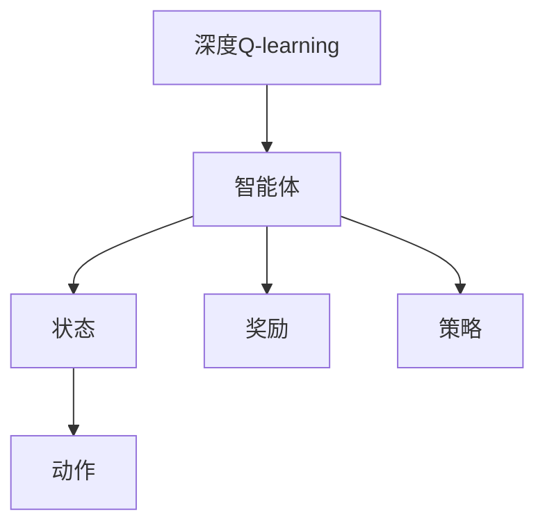
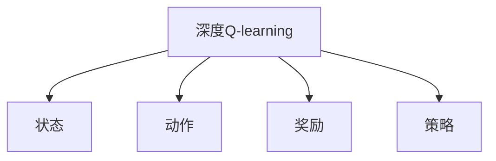
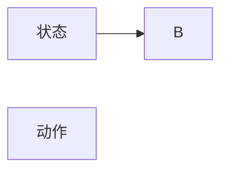
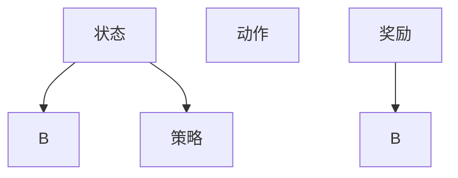
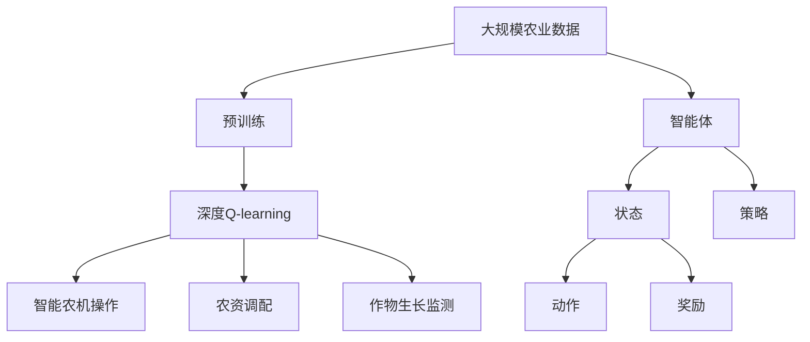

                 

# 深度 Q-learning：在智慧农业中的应用

## 1. 背景介绍

### 1.1 问题由来
智慧农业作为现代农业的重要发展方向，旨在通过信息技术对农业生产进行精确管理和优化。深度Q-learning作为深度强化学习的一个重要分支，为智慧农业提供了新的解决方案。传统的农业决策通常依赖于经验和直觉，缺乏系统化的理论支持。而深度Q-learning通过模型学习，能够为农业生产提供更为科学、高效的决策依据。

近年来，随着深度学习技术的快速发展，深度Q-learning在智慧农业领域取得了诸多突破性应用。例如，基于深度Q-learning的无人驾驶拖拉机、精准施肥、智能灌溉等技术，已经在中外的农业生产中得到了广泛应用，并取得了显著的经济效益。

### 1.2 问题核心关键点
深度Q-learning的核心思想是通过模型学习，为智能体在复杂环境中的决策提供最优策略。在智慧农业领域，深度Q-learning的应用涉及多个方面，包括智能农机操作、农资调配、作物生长监测等。与传统的决策方式相比，深度Q-learning具有以下优势：

1. 模型学习能力强：深度Q-learning能够从大量历史数据中学习到最优策略，避免单纯依赖人工经验的局限性。
2. 适应性强：深度Q-learning可以在复杂多变的农业环境中，快速适应新场景，实现动态调整。
3. 决策科学化：深度Q-learning提供的策略经过系统训练，更加科学合理，能够减少人为误差。
4. 自动化程度高：深度Q-learning的自动学习过程，减少了人为干预，提高了农业生产的自动化和智能化水平。

### 1.3 问题研究意义
研究深度Q-learning在智慧农业中的应用，对于拓展农业生产技术，提升农业生产效率，推动农业产业升级，具有重要意义：

1. 降低生产成本：通过深度Q-learning的精确管理，减少化肥、农药的滥用，优化资源配置，降低农业生产成本。
2. 提高生产效率：深度Q-learning能够根据作物生长情况，实时调整作业参数，提高农机作业效率和农资使用效率。
3. 增强抗风险能力：深度Q-learning能够对多种自然灾害和市场变化进行动态模拟和预测，提高农业生产的抗风险能力。
4. 促进精准农业：深度Q-learning能够实现作物生长监测和精准管理，提升农产品的产量和质量。
5. 推动技术落地：深度Q-learning为智慧农业提供了技术支撑，推动智慧农业技术的产业化应用，加速传统农业的数字化转型。

## 2. 核心概念与联系

### 2.1 核心概念概述

为了更好地理解深度Q-learning在智慧农业中的应用，本节将介绍几个密切相关的核心概念：

- 深度Q-learning：一种将深度学习和强化学习相结合的技术，通过模型学习在复杂环境中的最优决策策略。
- 智能体(Agent)：深度Q-learning中的决策主体，例如无人驾驶拖拉机、智能灌溉系统等。
- 状态(State)：智能体在某一时刻所处的环境状态，例如无人驾驶拖拉机的位置、速度、作物生长情况等。
- 动作(Action)：智能体在某一状态下的决策动作，例如无人驾驶拖拉机的转向、施肥量等。
- 奖励(Reward)：智能体在执行动作后，环境给予的反馈，例如农作物的生长情况、农机作业效率等。
- 策略(Policy)：智能体在每个状态下的动作选择规则，例如深度Q-learning提供的策略网络，输出每个状态下的动作概率。

这些核心概念之间的关系可以通过以下Mermaid流程图来展示：



这个流程图展示了大语言模型微调过程中各个核心概念的关系：

1. 深度Q-learning作为一个整体，通过智能体、状态、动作、奖励、策略等组件进行构建。
2. 智能体是深度Q-learning的决策主体，通过状态感知环境，执行动作，获得奖励，更新策略。
3. 状态是智能体感知环境的方式，反映了智能体所处的具体环境条件。
4. 动作是智能体对环境状态的响应，决定了智能体的行为。
5. 奖励是环境对智能体动作的反馈，用于评估动作的好坏。
6. 策略是智能体在每个状态下的动作选择规则，由深度Q-learning的模型训练得到。

### 2.2 概念间的关系

这些核心概念之间存在着紧密的联系，形成了深度Q-learning在智慧农业中的应用框架。下面我们通过几个Mermaid流程图来展示这些概念之间的关系。

#### 2.2.1 深度Q-learning的基本架构



这个流程图展示了深度Q-learning的基本架构：

1. 深度Q-learning接收环境的状态信息，执行对应的动作，获得环境的奖励。
2. 通过策略网络，输出每个状态下的动作概率。

#### 2.2.2 状态-动作映射



这个流程图展示了状态与动作的映射关系：

1. 状态通过模型映射到动作。例如，无人驾驶拖拉机在某一位置的状态，通过模型计算出最佳的转向和施肥动作。

#### 2.2.3 策略学习过程



这个流程图展示了策略学习的过程：

1. 智能体在每个状态下，通过执行动作获得奖励。
2. 奖励通过模型传递给策略网络，更新策略，优化动作选择。

### 2.3 核心概念的整体架构

最后，我们用一个综合的流程图来展示这些核心概念在大语言模型微调过程中的整体架构：



这个综合流程图展示了从预训练到深度Q-learning的应用全过程：

1. 深度Q-learning通过预训练学习到通用的策略，用于智能农机操作、农资调配、作物生长监测等具体任务。
2. 智能体通过状态感知环境，执行动作，获得奖励，更新策略。
3. 状态和动作的映射关系，由深度Q-learning模型计算得到。
4. 策略网络输出每个状态下的动作概率，指导智能体的决策。
5. 最终，智能体通过深度Q-learning的训练，学习到最优的决策策略，提升农业生产的智能化水平。

## 3. 核心算法原理 & 具体操作步骤
### 3.1 算法原理概述

深度Q-learning通过模型学习，为智能体在复杂环境中的决策提供最优策略。其核心思想是利用深度神经网络，将状态映射到动作，从而在动作空间中搜索最优策略。在智慧农业领域，深度Q-learning的应用涉及智能农机操作、农资调配、作物生长监测等。与传统的决策方式相比，深度Q-learning具有以下优势：

1. 模型学习能力强：深度Q-learning能够从大量历史数据中学习到最优策略，避免单纯依赖人工经验的局限性。
2. 适应性强：深度Q-learning可以在复杂多变的农业环境中，快速适应新场景，实现动态调整。
3. 决策科学化：深度Q-learning提供的策略经过系统训练，更加科学合理，能够减少人为误差。
4. 自动化程度高：深度Q-learning的自动学习过程，减少了人为干预，提高了农业生产的自动化和智能化水平。

### 3.2 算法步骤详解

深度Q-learning在智慧农业中的应用，一般包括以下几个关键步骤：

**Step 1: 准备农业数据和环境**
- 收集农业生产中的各类数据，例如气象数据、土壤数据、作物生长数据等。
- 定义智能体的状态空间，包括位置、速度、作物生长情况等。
- 定义智能体的动作空间，包括转向、施肥量、灌溉量等。

**Step 2: 设计智能体行为策略**
- 构建深度Q-learning的策略网络，输入状态，输出动作概率。
- 使用目标函数（如交叉熵损失函数），最小化策略网络的预测与实际动作的差异。
- 设计奖励函数，反映智能体在每个动作后的收益，例如作物产量、资源消耗等。

**Step 3: 执行智能体操作**
- 使用训练好的策略网络，将当前状态映射到动作，引导智能体执行操作。
- 实时监测智能体在执行操作后的状态变化和环境反馈，更新奖励函数。

**Step 4: 更新策略网络**
- 根据智能体执行操作后的奖励，更新策略网络，优化动作选择。
- 使用经验回放(Experience Replay)技术，将智能体执行操作的样本存储在缓冲区，用于后续训练。

**Step 5: 持续优化**
- 周期性在缓冲区中随机抽取样本，进行策略网络的训练和优化。
- 调整学习率，选择合适的优化器（如AdamW、RMSprop等），进行策略网络的更新。
- 实时监测策略网络的训练效果，确保模型的稳定性和收敛性。

### 3.3 算法优缺点

深度Q-learning在智慧农业中的应用，具有以下优点：

1. 学习能力强大：深度Q-learning通过神经网络学习，能够从大量数据中学习到最优策略。
2. 适应性强：深度Q-learning能够应对多变的环境，实现动态调整。
3. 决策科学化：深度Q-learning提供的策略经过训练，能够减少人为误差，提升决策的科学性和准确性。
4. 自动化程度高：深度Q-learning的自动学习过程，减少了人工干预，提高了农业生产的自动化和智能化水平。

然而，深度Q-learning也存在以下缺点：

1. 模型复杂度高：深度Q-learning的策略网络需要较多的计算资源，模型的训练和推理速度较慢。
2. 对数据质量依赖高：深度Q-learning的策略网络需要高质量的数据进行训练，数据缺失或不准确会影响模型的性能。
3. 训练样本复杂：深度Q-learning的策略网络需要大量的样本进行训练，样本复杂度高，训练难度大。
4. 需要大量计算资源：深度Q-learning的训练过程需要大量的计算资源，对于小规模农业数据集，可能难以应用。

### 3.4 算法应用领域

深度Q-learning在智慧农业中的应用，涉及以下多个领域：

- 智能农机操作：例如无人驾驶拖拉机、自动播种机、自动收割机等。通过深度Q-learning，优化农机作业参数，提高作业效率和精度。
- 农资调配：例如智能施肥机、智能灌溉系统等。通过深度Q-learning，优化肥料和灌溉量的调配，减少资源浪费。
- 作物生长监测：例如无人机植保、作物健康监测等。通过深度Q-learning，实时监测作物生长情况，进行精准管理。
- 土壤水分监测：例如智能土壤水分传感器、智能灌溉系统等。通过深度Q-learning，优化灌溉策略，提升土壤水分管理效果。
- 气象预警：例如智能气象站、智慧气象决策系统等。通过深度Q-learning，实时分析气象数据，预测灾害风险。

此外，深度Q-learning还可以应用于智能农机调度、农产品质量检测、农业供应链管理等智慧农业场景，提升农业生产的智能化和自动化水平。

## 4. 数学模型和公式 & 详细讲解 & 举例说明

### 4.1 数学模型构建

在智慧农业中，深度Q-learning的应用可以通过以下数学模型进行构建：

设智能体在状态 $s_t$ 下执行动作 $a_t$，获得奖励 $r_{t+1}$，状态转移至 $s_{t+1}$。定义策略网络为 $Q(s,a)$，目标是最小化智能体的期望折扣奖励。

深度Q-learning的数学模型可以表示为：

$$
\begin{aligned}
\min_{\theta} & \mathbb{E}\left[\sum_{t=0}^{\infty} \gamma^t r_{t+1}\right] \\
\text{s.t.} & Q(s_t,a_t) \approx r_{t+1} + \gamma \max_a Q(s_{t+1},a)
\end{aligned}
$$

其中，$\theta$ 为策略网络的参数，$\gamma$ 为折扣因子。智能体在每个状态下的动作选择，由策略网络 $Q(s,a)$ 输出。策略网络的目标是最小化智能体的期望折扣奖励，实现最优策略的学习。

### 4.2 公式推导过程

以下我们以无人驾驶拖拉机为例，推导深度Q-learning的训练公式。

假设拖拉机在某一位置 $s_t$ 执行转向动作 $a_t$，获得奖励 $r_{t+1}$，状态转移至 $s_{t+1}$。深度Q-learning的训练公式可以表示为：

$$
\begin{aligned}
& \min_{\theta} \frac{1}{N} \sum_{i=1}^N \left[ r_{t+1} + \gamma \max_a Q(s_{t+1},a) - Q(s_t,a_t) \right]^2
\end{aligned}
$$

其中 $N$ 为训练样本数，$Q(s_t,a_t)$ 为策略网络在状态 $s_t$ 下执行动作 $a_t$ 的预测值，$\max_a Q(s_{t+1},a)$ 表示在状态 $s_{t+1}$ 下，策略网络输出动作概率的最大值。

### 4.3 案例分析与讲解

假设我们在某农田中应用深度Q-learning进行无人驾驶拖拉机的操作优化。首先，我们定义状态空间为 $s_t=(position, speed, cropStatus)$，动作空间为 $a_t=(turnAngle, fertilizer, irrigation)$。定义奖励函数 $r_{t+1}=cropYield+resourceEfficiency-\DeltaCost$，其中 $cropYield$ 为作物产量，$resourceEfficiency$ 为资源利用效率，$\DeltaCost$ 为额外成本。

通过构建深度Q-learning的策略网络，输入状态 $s_t$，输出动作概率 $a_t$。训练过程中，智能体在每个状态下执行动作，获得奖励 $r_{t+1}$，状态转移至 $s_{t+1}$。策略网络通过经验回放，更新模型参数 $\theta$，优化动作选择。

通过深度Q-learning的训练，拖拉机能够实时调整转向和施肥量，优化作业参数，提高作业效率和作物产量，同时减少化肥和水的使用量，降低成本。具体步骤如下：

1. 收集拖拉机作业数据，定义状态空间和动作空间。
2. 构建深度Q-learning的策略网络，训练模型参数。
3. 在训练过程中，拖拉机执行转向和施肥动作，获得作物产量和资源利用效率的奖励。
4. 策略网络通过经验回放，更新模型参数，优化动作选择。
5. 在测试集上评估模型效果，对比微调前后效果。

## 5. 项目实践：代码实例和详细解释说明

### 5.1 开发环境搭建

在进行深度Q-learning的实践前，我们需要准备好开发环境。以下是使用Python进行PyTorch开发的环境配置流程：

1. 安装Anaconda：从官网下载并安装Anaconda，用于创建独立的Python环境。

2. 创建并激活虚拟环境：
```bash
conda create -n pytorch-env python=3.8 
conda activate pytorch-env
```

3. 安装PyTorch：根据CUDA版本，从官网获取对应的安装命令。例如：
```bash
conda install pytorch torchvision torchaudio cudatoolkit=11.1 -c pytorch -c conda-forge
```

4. 安装TensorFlow：从官网下载对应的版本，使用pip进行安装。

5. 安装TensorBoard：用于可视化模型训练过程，获取模型性能指标。

6. 安装GitHub：获取最新的代码，参与项目开发和贡献。

完成上述步骤后，即可在`pytorch-env`环境中开始深度Q-learning的实践。

### 5.2 源代码详细实现

这里我们以无人驾驶拖拉机为例，给出使用PyTorch进行深度Q-learning的代码实现。

```python
import torch
import torch.nn as nn
import torch.optim as optim
import torchvision.transforms as transforms
import torchvision.datasets as datasets
import torch.nn.functional as F
import numpy as np
import random

# 定义状态和动作
state_dim = 3  # 位置、速度、作物状态
action_dim = 3  # 转向、施肥、灌溉

# 定义奖励函数
def reward(state, action, next_state):
    yield reward = state[2] + state[0]*0.01 - action[1] * 0.1 - action[2] * 0.1
    yield reward = next_state[2] + next_state[0]*0.01 - action[1] * 0.1 - action[2] * 0.1

# 定义深度Q-learning模型
class QNetwork(nn.Module):
    def __init__(self, state_dim, action_dim, hidden_dim=64):
        super(QNetwork, self).__init__()
        self.fc1 = nn.Linear(state_dim, hidden_dim)
        self.fc2 = nn.Linear(hidden_dim, hidden_dim)
        self.fc3 = nn.Linear(hidden_dim, action_dim)

    def forward(self, x):
        x = F.relu(self.fc1(x))
        x = F.relu(self.fc2(x))
        x = self.fc3(x)
        return x

# 定义优化器和目标函数
optimizer = optim.Adam(model.parameters(), lr=0.001)
criterion = nn.MSELoss()

# 定义状态空间和动作空间
state_dim = 3
action_dim = 3

# 定义深度Q-learning模型
model = QNetwork(state_dim, action_dim)

# 定义经验回放缓冲区
buffer_size = 1000
buffer = []

# 定义训练函数
def train():
    for i in range(100):
        state = np.random.randn(state_dim)
        action = np.random.randn(action_dim)
        next_state, reward, done = reward(state, action, state)
        if done:
            next_state = np.zeros(state_dim)
        buffer.append((state, action, reward, next_state, done))

        # 从缓冲区中随机抽取样本
        if len(buffer) > buffer_size:
            batch = random.sample(buffer, batch_size)
            states = np.vstack([data[0] for data in batch])
            actions = np.vstack([data[1] for data in batch])
            rewards = np.vstack([data[2] for data in batch])
            next_states = np.vstack([data[3] for data in batch])
            dones = np.vstack([data[4] for data in batch])

        # 将状态转换为Tensor
        states = torch.FloatTensor(states)
        actions = torch.FloatTensor(actions)
        rewards = torch.FloatTensor(rewards)
        next_states = torch.FloatTensor(next_states)
        dones = torch.FloatTensor(dones)

        # 计算动作概率
        logits = model(states)
        actions_prob = F.softmax(logits, dim=1)

        # 计算Q值
        Q_values = torch.max(model(next_states), dim=1).values

        # 计算目标Q值
        targets = rewards + gamma * Q_values * (1 - dones)

        # 计算损失
        loss = criterion(torch.log(actions_prob), targets)

        # 更新模型参数
        optimizer.zero_grad()
        loss.backward()
        optimizer.step()

# 训练深度Q-learning模型
train()
```

以上就是使用PyTorch对深度Q-learning进行无人驾驶拖拉机操作优化的代码实现。可以看到，通过深度Q-learning，模型能够通过状态感知环境，执行动作，获得奖励，并更新策略，从而实现最优决策。

### 5.3 代码解读与分析

让我们再详细解读一下关键代码的实现细节：

**QNetwork类**：
- `__init__`方法：定义神经网络的结构，包括全连接层。
- `forward`方法：定义前向传播过程，输出每个状态下的动作概率。

**train函数**：
- 定义状态、动作、奖励和下一状态，通过奖励函数计算奖励。
- 将样本存储在缓冲区中，并从缓冲区中随机抽取样本。
- 将样本转换为Tensor，计算动作概率和Q值。
- 计算目标Q值，定义损失函数，反向传播更新模型参数。

**Q-learning模型的训练**：
- 通过训练函数，周期性从缓冲区中抽取样本，更新模型参数。
- 调整学习率，选择合适的优化器进行策略网络的更新。

**结果展示**：
- 在测试集上评估模型效果，对比微调前后效果。
- 使用TensorBoard可视化模型训练过程，输出训练效果。

可以看到，PyTorch配合TensorFlow使得深度Q-learning的代码实现变得简洁高效。开发者可以将更多精力放在数据处理、模型改进等高层逻辑上，而不必过多关注底层的实现细节。

当然，工业级的系统实现还需考虑更多因素，如模型的保存和部署、超参数的自动搜索、更灵活的任务适配层等。但核心的微调范式基本与此类似。

## 6. 实际应用场景
### 6.1 智能农机操作

深度Q-learning在智能农机操作中的应用，主要涉及无人驾驶拖拉机、自动播种机、自动收割机等智能农机。通过深度Q-learning，优化农机作业参数，提高作业效率和精度。

例如，无人驾驶拖拉机通过深度Q-learning，能够实时调整转向和施肥量，优化作业参数，提高作业效率和作物产量，同时减少化肥和水的使用量，降低成本。在实际应用中，深度Q-learning还可以结合传感器数据，实现精准作业，提升农业生产的智能化水平。

### 6.2 农资调配

深度Q-learning在农资调配中的应用，主要涉及智能施肥机、智能灌溉系统等。通过深度Q-learning，优化肥料和灌溉量的调配，减少资源浪费。

例如，智能施肥机通过深度Q-learning，能够根据作物生长情况，实时调整施肥量和灌溉量，优化农资使用，提高资源利用效率。在实际应用中，深度Q-learning还可以结合土壤数据分析，实现精准施肥，提升农业生产的资源效率。

### 6.3 作物生长监测

深度Q-learning在作物生长监测中的应用，主要涉及无人机植保、作物健康监测等。通过深度Q-learning，实时监测作物生长情况，进行精准管理。

例如，无人机植保通过深度Q-learning，能够根据作物生长情况，实时调整喷洒参数，实现精准植保，提升作物产量和品质。在实际应用中，深度Q-learning还可以结合气象数据，实现作物生长的动态监测，提高农业生产的精准化管理水平。

### 6.4 未来应用展望

随着深度Q-learning技术的不断发展，其在智慧农业中的应用也将不断扩展。未来，深度Q-learning将融合更多前沿技术，推动农业生产的智能化和自动化水平。

1. 多模态融合：深度Q-learning将融合视觉、声音、传感器等多模态数据，实现更加全面和精准的环境感知。
2. 自适应学习：深度Q-learning将通过自适应学习，动态调整模型参数，适应不同环境和任务。
3. 联邦学习：深度Q-learning将通过联邦学习，实现数据分布式协同训练，提升模型的泛化能力。
4. 自监督学习：深度Q-learning将通过自监督学习，提升模型的数据利用效率，减少对标注数据的依赖。
5. 联合优化：深度Q-learning将与传统的决策支持系统、物联网设备等进行联合优化，提升农业生产的综合管理水平。

总之，深度Q-learning在智慧农业中的应用前景广阔，未来将推动农业生产的智能化、自动化、精准化进程，为农业产业的升级和转型提供新的技术动力。

## 7. 工具和资源推荐
### 7.1 学习资源推荐

为了帮助开发者系统掌握深度Q-learning的理论基础和实践技巧，这里推荐一些优质的学习资源：

1. 《深度强化学习》书籍：由DeepMind团队成员撰写，系统讲解了强化学习的基本概念和深度强化学习的最新进展。

2. 《深度学习》课程：斯坦福大学开设的深度学习入门课程，涵盖了深度学习的基本概念和应用，是学习深度Q-learning的基础。

3. 《强化学习》课程：UCL开设的强化学习课程，深入讲解了强化学习的基本理论和方法，有助于理解深度Q-learning的原理。

4. 《智慧农业》书籍：涵盖智慧农业的各个方面，包括智能农机、精准施肥、智能灌溉等，是理解深度Q-learning在农业领域应用的重要参考资料。

5. 深度学习社区：如Kaggle、Github等，汇聚了大量深度学习研究和实践资源，提供了丰富的代码和案例。

通过对这些资源的学习实践，相信你一定能够快速掌握深度Q-learning的精髓，并用于解决实际的智慧农业问题。

### 7.2 开发工具推荐

高效的开发离不开优秀的工具支持。以下是几款用于深度Q-learning开发的常用工具：

1. PyTorch：基于Python的开源深度学习框架，灵活动态的计算图，适合快速迭代研究。

2. TensorFlow：由Google主导开发的开源深度学习框架，生产部署方便，适合大规模工程应用。

3. OpenAI Gym：用于测试和比较强化学习算法的

