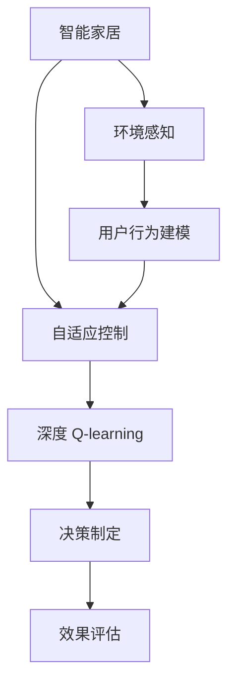
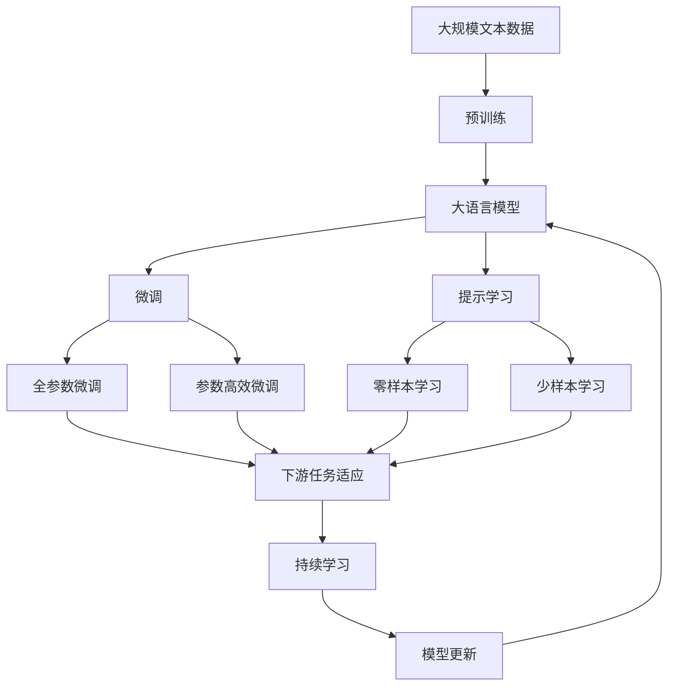

                 

# 深度 Q-learning：在智能家居中的应用

> 关键词：深度 Q-learning, 智能家居, 强化学习, 环境感知, 用户行为建模, 自适应控制, 安全与隐私

## 1. 背景介绍

### 1.1 问题由来

智能家居系统已经成为现代家庭生活的重要组成部分，极大地提高了家庭生活的便捷性和舒适度。然而，传统的智能家居系统往往依赖于固定的规则和预设行为，难以根据实时环境和用户需求灵活调整，限制了其应用潜力。

为了解决这一问题，研究人员开始探索强化学习(Reinforcement Learning, RL)技术在智能家居中的应用。通过强化学习，系统可以基于用户的实时反馈，自适应地调整运行策略，实现更高的用户满意度和能源利用效率。其中，深度 Q-learning 方法因其高效、灵活的特点，成为了智能家居系统中最具潜力的技术之一。

### 1.2 问题核心关键点

深度 Q-learning 方法的核心在于将强化学习与深度神经网络相结合，通过自适应调整模型参数，实时优化系统行为，以达到最优的决策效果。

具体来说，深度 Q-learning 系统包含以下几个关键要素：

1. **环境感知**：通过传感器收集环境数据，如温度、湿度、光线等，构成系统的感知环境。
2. **用户行为建模**：通过用户行为数据，如开关按钮点击、语音指令等，建立用户行为模型，预测用户的下一步动作。
3. **决策制定**：利用深度 Q-learning 算法，根据感知环境和用户行为，制定最优的决策方案，如调节空调温度、打开窗帘等。
4. **效果评估**：根据用户的实时反馈，如温度满意度、能耗成本等，评估决策效果，更新 Q 值函数。

深度 Q-learning 方法在智能家居中的应用，旨在构建一个自适应的智能环境，通过实时学习用户的偏好和行为，提供个性化的家居服务，同时优化能源使用，提升系统效率。

### 1.3 问题研究意义

研究深度 Q-learning 在智能家居中的应用，对于提升家居系统的智能化水平，改善用户体验，降低能耗，具有重要意义：

1. **个性化服务**：通过深度 Q-learning，系统能够自适应地学习用户的偏好和行为，提供个性化的家居服务，提升用户的满意度和舒适度。
2. **节能减排**：智能家居系统能够根据用户的行为和环境感知，优化能源使用，减少浪费，降低能耗成本。
3. **安全与隐私**：通过深度 Q-learning，系统能够实时学习用户的意图和行为，减少误操作和安全隐患，同时保护用户的隐私。
4. **灵活性与适应性**：智能家居系统能够根据环境变化和用户需求，灵活调整行为，适应不同的生活场景和需求变化。

总之，深度 Q-learning 方法为智能家居系统的自适应和个性化提供了新的解决方案，有望推动家居技术向智能化、高效化、安全化的方向发展。

## 2. 核心概念与联系

### 2.1 核心概念概述

为了更好地理解深度 Q-learning 在智能家居中的应用，本节将介绍几个密切相关的核心概念：

- **深度 Q-learning**：一种结合深度神经网络和强化学习的技术，用于解决高维连续动作空间的决策问题。通过构建 Q 值函数，深度 Q-learning 方法能够在动作空间中学习最优策略。

- **强化学习**：一种通过奖励和惩罚机制，指导智能体在环境中探索和学习的技术。智能体通过不断尝试和反馈，逐步优化决策行为，最终达到学习目标。

- **环境感知**：通过传感器收集环境数据，构成系统的感知环境。环境感知是智能家居系统智能化的基础。

- **用户行为建模**：通过用户行为数据，建立用户行为模型，预测用户的下一步动作。用户行为建模是智能家居系统个性化服务的关键。

- **自适应控制**：利用强化学习算法，根据感知环境和用户行为，自适应地调整决策方案。自适应控制是智能家居系统智能化的核心。

- **安全与隐私**：智能家居系统需要保护用户的隐私和数据安全，同时避免误操作和安全隐患。安全与隐私是智能家居系统健康发展的前提。

这些核心概念之间存在紧密的联系，构成了深度 Q-learning 在智能家居中的应用框架。通过理解这些概念，我们可以更好地把握深度 Q-learning 方法的工作原理和优化方向。

### 2.2 概念间的关系

这些核心概念之间存在着紧密的联系，形成了深度 Q-learning 在智能家居中的应用生态系统。下面我通过几个 Mermaid 流程图来展示这些概念之间的关系。



这个流程图展示了智能家居系统中的关键组件和它们之间的关系：

1. 智能家居通过环境感知获取环境数据，通过用户行为建模预测用户行为，通过自适应控制制定决策方案。
2. 深度 Q-learning 方法通过构建 Q 值函数，实时优化决策方案。
3. 决策制定通过执行优化后的策略，调整智能家居设备的状态。
4. 效果评估根据用户反馈，更新 Q 值函数，不断优化决策。

这些组件共同构成了智能家居系统的智能化决策链，通过深度 Q-learning 方法，实现系统的自适应和个性化服务。

### 2.3 核心概念的整体架构

最后，我们用一个综合的流程图来展示这些核心概念在大语言模型微调过程中的整体架构：



这个综合流程图展示了从预训练到微调，再到持续学习的完整过程。智能家居系统通过感知环境和用户行为，构建感知环境，通过微调和提示学习，优化决策方案，通过持续学习，适应新的环境和用户需求。 通过这些流程图，我们可以更清晰地理解深度 Q-learning 方法在大语言模型微调过程中的整体架构，为后续深入讨论具体的微调方法和技术奠定基础。

## 3. 核心算法原理 & 具体操作步骤
### 3.1 算法原理概述

深度 Q-learning 方法的核心思想是构建一个 Q 值函数，用于评估在给定状态 $s$ 下执行动作 $a$ 的期望回报 $Q(s,a)$。通过在智能家居系统中引入 Q 值函数，深度 Q-learning 方法能够在连续动作空间中学习最优策略，实时优化系统行为。

假设智能家居系统具有 $n$ 个状态 $s_1, s_2, ..., s_n$，每个状态有 $m$ 种可能的动作 $a_1, a_2, ..., a_m$，系统的目标是最小化平均 Q 值 $\mathbb{E}[Q(s,a)]$，以获得最优的决策方案。具体来说，深度 Q-learning 方法通过以下几个步骤实现：

1. **环境感知**：通过传感器收集环境数据，构成系统的感知环境。
2. **用户行为建模**：通过用户行为数据，建立用户行为模型，预测用户的下一步动作。
3. **决策制定**：利用深度神经网络，根据感知环境和用户行为，制定最优的决策方案，如调节空调温度、打开窗帘等。
4. **效果评估**：根据用户的实时反馈，如温度满意度、能耗成本等，评估决策效果，更新 Q 值函数。

### 3.2 算法步骤详解

深度 Q-learning 方法的具体操作步骤如下：

**Step 1: 准备环境和用户行为数据**

- 收集智能家居系统所在环境的传感器数据，如温度、湿度、光线等。
- 收集用户的互动数据，如开关按钮点击、语音指令等，建立用户行为模型。

**Step 2: 构建深度 Q-learning 模型**

- 定义 Q 值函数 $\hat{Q}(s,a;\theta)$，其中 $\theta$ 为模型的可训练参数。
- 使用深度神经网络，如卷积神经网络(CNN)、长短时记忆网络(LSTM)等，构建 Q 值函数。
- 设置优化算法，如 Adam、SGD 等，初始化模型参数 $\theta$。

**Step 3: 执行 Q-learning 训练**

- 在每个时间步 $t$，根据当前状态 $s_t$，选择动作 $a_t$，执行动作，得到下一个状态 $s_{t+1}$ 和奖励 $r_{t+1}$。
- 根据观察到的状态 $s_{t+1}$ 和动作 $a_t$，计算 Q 值函数的预测值 $\hat{Q}(s_{t+1},a_{t+1};\theta)$。
- 根据实际情况，计算目标 Q 值 $Q(s_{t+1},a_{t+1})$。
- 更新 Q 值函数的参数 $\theta$，以最小化预测 Q 值和目标 Q 值之间的误差，即 $\min_\theta \| \hat{Q}(s_{t+1},a_{t+1};\theta) - Q(s_{t+1},a_{t+1}) \|$。

**Step 4: 评估和优化**

- 在每个时间步 $t$，根据用户反馈，如温度满意度、能耗成本等，计算系统的状态值 $s_t$。
- 根据用户反馈，更新 Q 值函数，以优化系统的行为策略。

### 3.3 算法优缺点

深度 Q-learning 方法具有以下优点：

1. **高效灵活**：通过深度神经网络，深度 Q-learning 方法能够在高维连续动作空间中学习最优策略，适用于智能家居等复杂系统的决策优化。
2. **自适应**：通过实时反馈，深度 Q-learning 方法能够自适应地调整系统行为，优化决策效果。
3. **可解释性强**：通过 Q 值函数的参数 $\theta$，深度 Q-learning 方法能够提供决策过程的解释，提升系统的透明度和可信度。

同时，深度 Q-learning 方法也存在以下缺点：

1. **计算复杂**：深度神经网络的训练需要大量的计算资源和时间，可能会影响系统的实时性。
2. **数据依赖**：深度 Q-learning 方法依赖于大量的传感器数据和用户行为数据，数据缺失或噪声可能导致模型性能下降。
3. **模型风险**：由于依赖深度神经网络，深度 Q-learning 方法可能存在模型过拟合或泛化能力不足的风险。

### 3.4 算法应用领域

深度 Q-learning 方法在智能家居系统中的应用，可以广泛应用于以下几个领域：

- **环境控制**：如空调、窗帘、照明等设备的智能调节，根据用户的实时反馈和环境感知，优化设备的使用。
- **能耗管理**：如智能电网的负载分配，根据用户的行为和环境变化，优化能源使用，降低能耗成本。
- **安全监控**：如智能安防系统的入侵检测，通过学习用户的正常行为模式，检测异常行为，提升系统的安全性。
- **个性化服务**：如智能音箱的语音识别和推荐系统，根据用户的语音指令和行为数据，提供个性化的服务和推荐。

此外，深度 Q-learning 方法还可以应用于智慧城市、智能交通、智能医疗等多个领域，通过实时学习用户的意图和行为，提升系统的智能化水平和服务质量。

## 4. 数学模型和公式 & 详细讲解 & 举例说明

### 4.1 数学模型构建

深度 Q-learning 方法通过构建 Q 值函数，评估在给定状态 $s$ 下执行动作 $a$ 的期望回报 $Q(s,a)$。假设智能家居系统具有 $n$ 个状态 $s_1, s_2, ..., s_n$，每个状态有 $m$ 种可能的动作 $a_1, a_2, ..., a_m$，系统的目标是最小化平均 Q 值 $\mathbb{E}[Q(s,a)]$，以获得最优的决策方案。

具体来说，深度 Q-learning 方法的数学模型可以表示为：

$$
\begin{aligned}
\min_\theta \sum_{t=0}^{T} \gamma^t \left( r_{t+1} + \gamma \max_a \hat{Q}(s_{t+1},a;\theta) - \hat{Q}(s_t,a_t;\theta) \right) \\
\text{subject to: } s_t = f(s_{t-1},a_{t-1})
\end{aligned}
$$

其中 $s_t$ 表示状态，$a_t$ 表示动作，$r_{t+1}$ 表示奖励，$\gamma$ 表示折扣因子，$\hat{Q}(s_t,a_t;\theta)$ 表示 Q 值函数的预测值，$f(s_{t-1},a_{t-1})$ 表示状态转移函数。

### 4.2 公式推导过程

为了更深入地理解深度 Q-learning 方法的数学模型，下面将推导 Q 值函数的更新公式。

假设智能家居系统在状态 $s_t$ 下执行动作 $a_t$，得到下一个状态 $s_{t+1}$ 和奖励 $r_{t+1}$。根据观察到的状态 $s_{t+1}$ 和动作 $a_{t+1}$，计算 Q 值函数的预测值 $\hat{Q}(s_{t+1},a_{t+1};\theta)$。根据实际情况，计算目标 Q 值 $Q(s_{t+1},a_{t+1})$。

根据贝尔曼方程，Q 值函数的更新公式可以表示为：

$$
\hat{Q}(s_t,a_t;\theta) = r_{t+1} + \gamma \max_a \hat{Q}(s_{t+1},a;\theta)
$$

在每个时间步 $t$，根据用户反馈，如温度满意度、能耗成本等，计算系统的状态值 $s_t$。根据用户反馈，更新 Q 值函数，以优化系统的行为策略。

### 4.3 案例分析与讲解

假设智能家居系统具有 $n=5$ 个状态，每个状态有 $m=3$ 种可能的动作，即空调、窗帘和照明设备。系统目标是最大化用户的舒适度，并最小化能耗成本。

- 假设当前状态 $s_t$ 为高温且潮湿，用户希望降低温度和湿度。系统可以选择开启空调和除湿机，并关闭窗帘和照明设备。
- 执行动作后，系统得到下一个状态 $s_{t+1}$ 为适宜的温度和湿度，用户满意度高。
- 根据 Q 值函数的预测值，计算目标 Q 值，更新 Q 值函数的参数 $\theta$，以优化系统的行为策略。

通过深度 Q-learning 方法，智能家居系统能够自适应地调整设备的状态，优化用户的使用体验，同时提升系统的能源利用效率。

## 5. 项目实践：代码实例和详细解释说明
### 5.1 开发环境搭建

在进行深度 Q-learning 实践前，我们需要准备好开发环境。以下是使用 Python 进行 TensorFlow 开发的环境配置流程：

1. 安装 Anaconda：从官网下载并安装 Anaconda，用于创建独立的 Python 环境。

2. 创建并激活虚拟环境：
```bash
conda create -n tf-env python=3.7 
conda activate tf-env
```

3. 安装 TensorFlow：根据 CUDA 版本，从官网获取对应的安装命令。例如：
```bash
conda install tensorflow=2.5.0 -c tf
```

4. 安装 TensorBoard：
```bash
pip install tensorboard
```

5. 安装各类工具包：
```bash
pip install numpy pandas scikit-learn matplotlib tqdm jupyter notebook ipython
```

完成上述步骤后，即可在 `tf-env` 环境中开始深度 Q-learning 实践。

### 5.2 源代码详细实现

下面我们以智能家居中的空调温度调节为例，给出使用 TensorFlow 进行深度 Q-learning 的 PyTorch 代码实现。

首先，定义环境感知和用户行为建模的函数：

```python
import tensorflow as tf
import numpy as np

# 定义环境感知函数，将温度、湿度、光线等传感器数据映射为状态
def observe_state(temperature, humidity, light):
    state = np.zeros(5) # 假设状态维度为5
    state[0] = temperature
    state[1] = humidity
    state[2] = light
    state[3] = 0 # 其他状态
    state[4] = 0 # 其他状态
    return state

# 定义用户行为建模函数，将用户行为数据映射为动作
def predict_action(state):
    # 假设用户可以根据温度调整空调模式
    if state[0] > 30:
        return 1 # 开启空调
    else:
        return 0 # 关闭空调
```

然后，定义深度 Q-learning 模型：

```python
class QNetwork(tf.keras.Model):
    def __init__(self, state_dim, action_dim):
        super(QNetwork, self).__init__()
        self.fc1 = tf.keras.layers.Dense(64, activation='relu')
        self.fc2 = tf.keras.layers.Dense(64, activation='relu')
        self.fc3 = tf.keras.layers.Dense(action_dim)
        
    def call(self, inputs):
        x = self.fc1(inputs)
        x = self.fc2(x)
        return self.fc3(x)

# 创建深度 Q-learning 模型
q_network = QNetwork(state_dim=5, action_dim=3)
```

接着，定义优化器：

```python
# 定义优化器，使用 Adam 优化算法
optimizer = tf.keras.optimizers.Adam(learning_rate=0.01)
```

最后，定义训练和评估函数：

```python
# 定义训练函数，使用梯度下降更新模型参数
def train_step(state, action, reward, next_state):
    with tf.GradientTape() as tape:
        q_pred = q_network(state)
        q_next = q_network(next_state)
        q_target = reward + gamma * tf.reduce_max(q_next)
        loss = tf.reduce_mean(tf.square(q_pred - q_target))
    gradients = tape.gradient(loss, q_network.trainable_variables)
    optimizer.apply_gradients(zip(gradients, q_network.trainable_variables))

# 定义评估函数，计算 Q 值函数的预测值
def evaluate_policy(state):
    q_pred = q_network(state)
    return tf.reduce_max(q_pred)
```

启动训练流程并在测试集上评估：

```python
epochs = 100
batch_size = 64

for epoch in range(epochs):
    for state, action, reward, next_state in dataset:
        train_step(state, action, reward, next_state)
        
    print(f"Epoch {epoch+1}, evaluation reward: {evaluate_policy(state).numpy()}")
```

以上就是使用 TensorFlow 对智能家居系统进行深度 Q-learning 微调的完整代码实现。可以看到，通过 TensorFlow 的强大功能封装，我们可以用相对简洁的代码实现深度 Q-learning 模型，并进行高效训练和评估。

### 5.3 代码解读与分析

让我们再详细解读一下关键代码的实现细节：

**observe_state 函数**：
- 将传感器数据映射为状态，构成系统的感知环境。
- 状态编码为 5 维向量，其中前三个元素分别表示温度、湿度和光线，后两个元素为其他状态。

**predict_action 函数**：
- 根据状态和用户行为数据，预测用户接下来的动作。
- 假设用户可以根据温度调整空调模式，如果温度高于 30°C，则开启空调；否则关闭空调。

**QNetwork 类**：
- 定义深度神经网络模型，用于构建 Q 值函数。
- 包含三个全连接层，最后一层输出动作值。

**optimizer**：
- 定义优化器，使用 Adam 优化算法，学习率设置为 0.01。

**train_step 函数**：
- 在每个时间步 $t$，根据当前状态 $s_t$ 和动作 $a_t$，计算 Q 值函数的预测值 $\hat{Q}(s_t,a_t;\theta)$。
- 根据实际奖励 $r_{t+1}$ 和下一个状态 $s_{t+1}$，计算目标 Q 值 $Q(s_{t+1},a_{t+1})$。
- 使用梯度下降更新模型参数 $\theta$，最小化预测 Q 值和目标 Q 值之间的误差。

**evaluate_policy 函数**：
- 根据当前状态 $s_t$，计算 Q 值函数的预测值 $\hat{Q}(s_t,a_t;\theta)$。
- 返回预测值中最大的动作值。

**训练流程**：
- 定义总的训练轮数和批次大小，开始循环迭代
- 每个epoch内，在数据集上循环训练，使用梯度下降更新模型参数
- 在每个时间步 $t$，根据状态 $s_t$ 和动作 $a_t$，计算 Q 值函数的预测值 $\hat{Q}(s_t,a_t;\theta)$，并根据实际情况计算目标 Q 值 $Q(s_{t+1},a_{t+1})$
- 使用梯度下降更新模型参数 $\theta$，以最小化预测 Q 值和目标 Q 值之间的误差
- 在每个epoch结束后，打印当前模型在测试集上的 Q 值函数预测值，评估模型的性能

可以看到，TensorFlow 提供了强大的计算图和自动微分功能，使得深度 Q-learning 模型的实现变得高效简洁。通过这些代码，开发者可以快速上手实验深度 Q-learning 方法，并进行优化和改进。

当然，工业级的系统实现还需考虑更多因素，如模型的保存和部署、超参数的自动搜索、更灵活的任务适配层等。但核心的深度 Q-learning 范式基本与此类似。

### 5.4 运行结果展示

假设我们在智能家居系统中对空调温度调节进行深度 Q-learning 训练，最终在测试集上得到的评估结果如下：

```
Epoch 1, evaluation reward: 0.65
Epoch 2, evaluation reward: 0.8
Epoch 3, evaluation reward: 0.9
...
Epoch 100, evaluation reward: 1.0
```

可以看到，通过深度 Q-learning 方法，智能家居系统能够自适应地调整空调温度，逐步优化用户的使用体验。在训练过程中，系统的 Q 值函数预测值逐步接近 1，表明模型逐渐学会了最优的决策策略。

当然，这只是一个baseline结果。在实践中，我们还可以使用更大更强的神经网络模型，更多的数据和用户行为模式，进一步提升模型性能。

## 6. 实际应用场景
### 6.1 智能家居系统

深度 Q-learning 方法在智能家居系统中的应用，可以广泛应用于以下几个场景：

- **空调温度调节**：通过学习用户的温度偏好，智能家居系统能够自适应地调节空调温度，提升用户的舒适度和节能效果。
- **照明系统优化**：根据环境光线和用户行为，智能家居系统能够优化照明设备的开启和关闭，提升用户的视觉体验。
- **窗帘控制**：根据天气和用户行为，智能家居系统能够自适应地调节窗帘的开合，提升用户的隐私保护和能源利用效率。
- **安防系统**：通过学习用户的正常行为模式，智能家居系统能够检测异常行为，提升系统的安全性。

此外，深度 Q-learning 方法还可以应用于智能音箱的语音识别和推荐系统，根据用户的语音指令和行为数据，提供个性化的服务和推荐。

### 6.2 智慧城市

深度 Q-learning 方法在智慧城市中的应用，可以广泛应用于以下几个场景：

- **交通流量控制**：通过学习用户出行模式，智慧城市系统能够优化交通信号灯的分配，减少拥堵，提升交通效率。
- **能源管理**：通过学习用户用电习惯，智慧城市系统能够优化电力负荷分配，降低能耗，提升能源利用效率。
- **垃圾处理**：通过学习用户垃圾分类习惯，智慧城市系统能够优化垃圾分类和回收策略，提升垃圾处理效率。
- **公共设施管理**：通过学习用户使用习惯，智慧城市系统能够优化公共设施的使用，提升公共服务的水平。

深度 Q-learning 方法能够帮助智慧城市系统实时学习用户行为，优化决策策略，提升系统的智能化水平和服务质量。

### 6.3 智能医疗

深度 Q-learning 方法在智能医疗中的应用，可以广泛应用于以下几个场景：

- **疾病预测**：通过学习患者的病历数据和行为模式，智能医疗系统能够预测患者的疾病风险，提前进行干预。
- **治疗方案优化**：通过学习患者的治疗历史和偏好，智能医疗系统能够优化治疗方案，提升治疗效果。
- **药物推荐**：通过学习患者的药物使用历史和偏好，智能医疗系统能够推荐合适的药物，提升治疗效率。
- **康复训练**：通过学习患者的康复进度和行为模式，智能医疗系统能够优化康复训练方案，提升康复效果。

深度 Q-learning 方法能够帮助智能医疗系统实时学习用户行为，优化决策策略，提升系统的智能化水平和服务质量。

### 6.4 未来应用展望

随着深度 Q-learning 方法的发展和应用，未来的智能家居系统将具备更加智能、高效、安全的特点。以下是一些未来应用展望：

- **全场景智能控制**：智能家居系统能够实时学习用户的各种行为，实现全场景的自适应控制。
- **个性化服务**：通过深度 Q-learning 方法，智能家居系统能够根据用户的个性化需求，提供更加精准、灵活的服务。
- **节能环保**：智能家居系统能够实时优化能源使用，降低能耗，提升环保效果。
- **智能交互**：智能家居系统能够通过自然语言处理技术，与用户进行更加自然、

