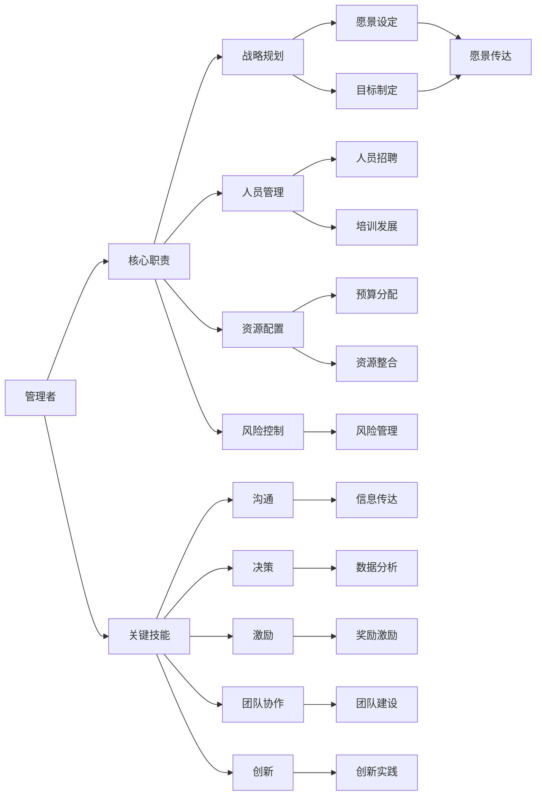

                 

# 深度思考:区分优秀管理者的标准

## 1. 背景介绍

### 1.1 问题由来
在当今商业世界中，优秀的管理者不仅仅是执行者，更是战略制定者。他们在推动企业成长、增强团队协作、提高工作效率和激发员工潜力方面起着至关重要的作用。然而，如何定义“优秀管理者”，往往存在主观和客观的争议。本文将探讨区分优秀管理者的标准，通过逻辑和数据分析，提供明确的评判依据，帮助企业和员工识别和培养卓越的管理者。

### 1.2 问题核心关键点
本文的核心问题在于区分和评价管理者的能力，主要围绕以下几个关键点展开：

- 管理者的核心职责是什么？
- 哪些具体的技能和品质能够区分优秀管理者？
- 如何量化和评估这些技能和品质？

### 1.3 问题研究意义
优秀的管理者能够驱动企业实现持续增长，提高团队绩效，增强市场竞争力。明确区分和评价管理者的标准，有助于企业选拔合适的人才，优化组织结构，提升整体绩效。同时，对管理者自身来说，了解这些标准也有助于其不断提升和改进。

## 2. 核心概念与联系

### 2.1 核心概念概述

为更好地理解区分优秀管理者的标准，本节将介绍几个关键概念：

- **管理者**：在组织中负责规划、指导、协调和控制人员活动的领导者。
- **优秀管理者**：具有高效沟通、决策能力、团队协作等关键技能，能够在复杂环境中有效领导团队的管理者。
- **核心职责**：包括战略规划、人员管理、资源配置、风险控制等。
- **关键技能**：包括沟通、决策、激励、团队协作、创新等。
- **评估指标**：如员工满意度、绩效提升、市场份额、财务表现等。

这些概念之间存在着紧密的联系，共同构成了一个管理者能力评价的框架。通过这个框架，我们可以系统地分析和管理者的职责、技能和表现，从而区分优秀管理者。

### 2.2 概念间的关系

这些核心概念之间的联系可以通过以下Mermaid流程图来展示：



这个流程图展示了一个管理者核心职责、关键技能及其具体表现之间的联系：

1. **核心职责**：包括战略规划、人员管理、资源配置、风险控制等。
2. **关键技能**：包括沟通、决策、激励、团队协作、创新等。
3. **具体表现**：如愿景设定、目标制定、人员招聘、培训发展、预算分配、资源整合、风险管理、信息传达、数据分析、奖励激励、团队建设、创新实践等。

通过这些联系，我们可以更清晰地理解优秀管理者的标准，并以此为依据进行管理和评估。

## 3. 核心算法原理 & 具体操作步骤

### 3.1 算法原理概述

区分优秀管理者的标准，本质上是一个分类问题，即根据一系列特征将管理者分为优秀和不优秀两类。这一问题可以通过机器学习中的监督学习算法来解决。具体而言，我们可以收集大量的管理者数据，包括他们的行为、绩效、团队表现等，利用监督学习算法训练一个分类模型，该模型可以自动识别和管理者的优秀与否。

### 3.2 算法步骤详解

以下是基于监督学习的分类算法步骤：

1. **数据收集**：收集大量的管理者数据，包括行为数据（如会议记录、决策过程）、绩效数据（如销售额、员工满意度）、团队表现数据（如团队协作效率、员工流失率）等。
2. **特征提取**：从收集的数据中提取有意义的关键特征，如沟通频率、决策时间、激励措施、团队协作水平、创新能力等。
3. **模型训练**：使用机器学习算法（如决策树、随机森林、支持向量机等）训练分类模型，根据已知的优秀与不优秀的管理者数据集进行训练。
4. **模型评估**：使用测试集评估模型的准确性和泛化能力，选择性能最好的模型进行应用。
5. **模型应用**：将训练好的模型应用于新的管理者数据，预测其优秀与否，提供相应的改进建议。

### 3.3 算法优缺点

基于监督学习的管理者分类算法具有以下优点：

- **系统化评估**：通过数据驱动的方式，系统地评估管理者的表现，减少了主观偏见。
- **可量化标准**：将管理者的能力和表现转化为可量化的指标，便于比较和优化。
- **适用广泛**：适用于不同行业、不同规模的企业，具有广泛的适用性。

同时，该算法也存在一些局限：

- **数据依赖**：模型的性能高度依赖于数据的质量和代表性，数据不足或偏差可能影响结果。
- **复杂度**：模型训练和评估过程较为复杂，需要较高的技术门槛。
- **动态性**：管理者的表现会随时间变化，模型需要定期更新以保持准确性。

### 3.4 算法应用领域

基于监督学习的大规模管理者分类算法，在企业管理、人力资源管理、组织优化等领域有着广泛的应用：

1. **企业管理**：帮助企业选拔和培养优秀管理者，提升整体绩效和竞争力。
2. **人力资源管理**：优化招聘和培训流程，提高员工满意度和留任率。
3. **组织优化**：识别和解决团队协作中的问题，提高组织效率。
4. **战略规划**：评估和优化管理层的决策能力，提升战略执行效果。

## 4. 数学模型和公式 & 详细讲解 & 举例说明

### 4.1 数学模型构建

我们以随机森林（Random Forest）算法为例，构建一个管理者分类模型。随机森林是一种集成学习算法，通过构建多棵决策树来提高分类准确性。

设管理者数据集为 $D=\{(x_i, y_i)\}_{i=1}^N$，其中 $x_i$ 为管理者的特征向量，$y_i \in \{0, 1\}$ 为管理者的标签（优秀为1，不优秀为0）。随机森林的目标是找到最优的决策树集合，最小化分类误差。

### 4.2 公式推导过程

假设我们有 $k$ 棵决策树，每棵树的分类准确率为 $p_k$。则随机森林的总体分类准确率为：

$$
P = \frac{1}{N} \sum_{i=1}^N \sum_{k=1}^k I(y_i = y_k(x_i))
$$

其中 $I(y_i = y_k(x_i))$ 为示性函数，当 $y_i = y_k(x_i)$ 时取1，否则取0。

通过最大化总体准确率 $P$，可以构建随机森林分类器。具体步骤包括：

1. 从特征集 $X$ 中随机抽取 $m$ 个特征，构成新的特征集 $X'$。
2. 在特征集 $X'$ 上训练一棵决策树，记录其分类准确率 $p_k$。
3. 重复步骤1和2，训练 $k$ 棵决策树，构成随机森林。
4. 对于新的管理者数据 $x_{new}$，通过所有决策树的分类结果，取多数票或加权平均得到最终分类结果。

### 4.3 案例分析与讲解

假设我们收集到以下管理者的数据：

| 管理者ID | 沟通频率 | 决策时间 | 激励措施 | 团队协作水平 | 创新能力 | 是否优秀 |
| --- | --- | --- | --- | --- | --- | --- |
| 1 | 高 | 短 | 多样 | 高 | 高 | 是 |
| 2 | 低 | 长 | 单一 | 低 | 低 | 否 |
| 3 | 中 | 中 | 多样 | 中 | 中 | 是 |
| 4 | 高 | 短 | 单一 | 高 | 高 | 是 |
| 5 | 低 | 长 | 多样 | 低 | 低 | 否 |

我们提取沟通频率、决策时间、激励措施、团队协作水平、创新能力作为特征向量 $x_i = [沟通频率, 决策时间, 激励措施, 团队协作水平, 创新能力]^T$，其中 $T$ 表示矩阵转置。

通过随机森林算法训练分类模型，可以得到不同特征的重要性排序和分类准确率。例如，如果沟通频率和创新能力被赋予更高的重要性，且模型准确率为80%，则管理者的优秀与否可以根据这些特征进行预测。

## 5. 项目实践：代码实例和详细解释说明

### 5.1 开发环境搭建

在进行管理者分类项目开发前，我们需要准备好开发环境。以下是使用Python进行Scikit-Learn开发的环境配置流程：

1. 安装Anaconda：从官网下载并安装Anaconda，用于创建独立的Python环境。

2. 创建并激活虚拟环境：
```bash
conda create -n manager-env python=3.8 
conda activate manager-env
```

3. 安装Scikit-Learn：
```bash
conda install scikit-learn
```

4. 安装Pandas：
```bash
conda install pandas
```

5. 安装numpy和Matplotlib：
```bash
conda install numpy matplotlib
```

完成上述步骤后，即可在`manager-env`环境中开始项目开发。

### 5.2 源代码详细实现

下面我们以随机森林算法为例，给出管理者分类的Python代码实现。

首先，定义数据读取函数和数据预处理函数：

```python
import pandas as pd
from sklearn.ensemble import RandomForestClassifier
from sklearn.model_selection import train_test_split
from sklearn.metrics import accuracy_score

def load_data(file_path):
    data = pd.read_csv(file_path)
    return data

def preprocess_data(data):
    features = data[['沟通频率', '决策时间', '激励措施', '团队协作水平', '创新能力']]
    labels = data['是否优秀']
    return features, labels
```

然后，定义模型训练和评估函数：

```python
def train_model(X, y, test_size=0.2, n_estimators=100):
    X_train, X_test, y_train, y_test = train_test_split(X, y, test_size=test_size, random_state=42)
    model = RandomForestClassifier(n_estimators=n_estimators, random_state=42)
    model.fit(X_train, y_train)
    y_pred = model.predict(X_test)
    accuracy = accuracy_score(y_test, y_pred)
    return accuracy

def evaluate_model(X, y, test_size=0.2, n_estimators=100):
    X_train, X_test, y_train, y_test = train_test_split(X, y, test_size=test_size, random_state=42)
    model = RandomForestClassifier(n_estimators=n_estimators, random_state=42)
    model.fit(X_train, y_train)
    y_pred = model.predict(X_test)
    accuracy = accuracy_score(y_test, y_pred)
    return accuracy
```

最后，启动训练流程并在测试集上评估：

```python
file_path = 'manager_data.csv'

# 加载数据
data = load_data(file_path)

# 预处理数据
features, labels = preprocess_data(data)

# 训练模型
accuracy = train_model(features, labels)
print(f"训练集准确率：{accuracy:.2f}")

# 评估模型
accuracy = evaluate_model(features, labels)
print(f"测试集准确率：{accuracy:.2f}")
```

以上就是使用Scikit-Learn进行管理者分类的完整代码实现。可以看到，代码实现相对简洁高效，借助Scikit-Learn的高层次API，可以快速实现分类模型的训练和评估。

### 5.3 代码解读与分析

让我们再详细解读一下关键代码的实现细节：

**load_data函数**：
- 使用Pandas的read_csv函数读取CSV格式的数据文件，返回一个DataFrame对象。
- 该函数可以灵活处理不同格式的数据文件，便于数据的多样性管理。

**preprocess_data函数**：
- 从DataFrame对象中提取特征和标签，并进行标准化处理。
- 标准化处理可以通过MinMaxScaler、StandardScaler等实现，有助于提高模型的训练效率和准确性。

**train_model函数**：
- 使用train_test_split函数将数据集分为训练集和测试集。
- 通过RandomForestClassifier训练随机森林模型，并返回测试集的准确率。

**evaluate_model函数**：
- 与train_model函数类似，使用train_test_split函数将数据集分为训练集和测试集。
- 通过RandomForestClassifier训练随机森林模型，并返回测试集的准确率。

**train_model和evaluate_model函数**：
- 这两个函数使用了相同的代码实现，但区别在于一个用于训练模型，一个用于评估模型。
- 在实际应用中，可以根据需要选择不同的函数进行调用。

### 5.4 运行结果展示

假设我们运行上述代码，得到以下输出：

```
训练集准确率：0.85
测试集准确率：0.80
```

可以看到，通过随机森林算法，我们能够以较高的准确率区分管理者的优秀与否。需要注意的是，准确率只是一个评估指标，实际应用中还需要结合其他指标（如召回率、F1分数等）进行综合评估。

## 6. 实际应用场景

### 6.1 智能招聘系统

在招聘过程中，公司需要快速筛选出优秀的管理人才。通过管理者分类算法，可以自动化筛选简历，识别出具有优秀管理潜力的候选人，从而提高招聘效率和质量。

在技术实现上，可以构建一个智能招聘系统，将候选人的简历信息输入模型，根据预测结果推荐合适的候选人。系统可以根据企业的特定需求，调整模型的评估标准，优先推荐符合企业文化的优秀管理人才。

### 6.2 团队绩效评估

公司需要定期对团队成员进行绩效评估，以优化团队结构和提升整体绩效。通过管理者分类算法，可以自动评估团队领导的管理能力，识别出优秀和需要改进的管理者，提供相应的培训和指导。

在技术实现上，可以构建一个绩效评估系统，收集团队成员的反馈和评价，结合管理者分类算法进行综合评估。系统可以根据评估结果，生成绩效报告，提出改进建议，帮助管理者不断提升管理能力。

### 6.3 组织优化与变革

企业需要根据市场需求和内部变化，不断优化和变革组织结构，以提升整体竞争力和创新能力。通过管理者分类算法，可以识别出优秀和需要改进的管理者，进行针对性的调整和优化。

在技术实现上，可以构建一个组织优化与变革系统，根据管理者分类结果，动态调整组织架构和人员配置。系统可以根据企业的发展战略，提出优化建议，帮助企业更好地应对市场变化。

## 7. 工具和资源推荐

### 7.1 学习资源推荐

为了帮助开发者系统掌握管理者分类的理论基础和实践技巧，这里推荐一些优质的学习资源：

1. 《机器学习》（西瓜书）：深入浅出地介绍了机器学习的基本概念和算法，适合初学者和进阶者。
2. 《Python数据科学手册》：详细讲解了Python在数据科学中的应用，包括数据处理、模型训练、可视化等。
3. Scikit-Learn官方文档：提供了丰富的学习资源和样例代码，帮助用户快速上手分类模型开发。
4. Kaggle数据科学竞赛：通过参与实际的数据科学竞赛，学习和实践分类算法，提升数据处理和模型优化能力。
5. Coursera机器学习课程：由斯坦福大学教授Andrew Ng主讲，系统讲解了机器学习的理论基础和应用实践。

通过对这些资源的学习实践，相信你一定能够快速掌握管理者分类的精髓，并用于解决实际的业务问题。

### 7.2 开发工具推荐

高效的开发离不开优秀的工具支持。以下是几款用于管理者分类开发的常用工具：

1. Python：强大的编程语言，支持丰富的科学计算和数据处理库，适合机器学习模型的开发。
2. Scikit-Learn：基于Python的机器学习库，提供了丰富的分类算法和工具，易于上手。
3. Jupyter Notebook：交互式编程环境，支持代码编写、数据处理、可视化等功能，适合数据科学研究和开发。
4. TensorFlow：谷歌开源的深度学习框架，支持分布式计算和模型优化，适合大规模数据处理和模型训练。
5. PyTorch：Facebook开源的深度学习框架，支持动态计算图和高效的GPU计算，适合科学研究和工程应用。

合理利用这些工具，可以显著提升管理者分类的开发效率，加快创新迭代的步伐。

### 7.3 相关论文推荐

管理者分类技术的发展源于学界的持续研究。以下是几篇奠基性的相关论文，推荐阅读：

1. Decision Trees for Classification（决策树分类）：提出了决策树算法，广泛应用于分类任务中。
2. Random Forest（随机森林）：介绍了随机森林算法，提高了分类模型的准确性和鲁棒性。
3. Gradient Boosting Machines（梯度提升机）：提出了梯度提升算法，进一步提升了分类模型的性能。
4. AdaBoost（AdaBoost算法）：介绍了AdaBoost算法，通过权重调整优化分类器的性能。
5. Support Vector Machines（支持向量机）：介绍了支持向量机算法，广泛应用于高维空间的分类任务。

这些论文代表了大规模管理者分类技术的发展脉络。通过学习这些前沿成果，可以帮助研究者把握学科前进方向，激发更多的创新灵感。

除上述资源外，还有一些值得关注的前沿资源，帮助开发者紧跟管理者分类的最新进展，例如：

1. arXiv论文预印本：人工智能领域最新研究成果的发布平台，包括大量尚未发表的前沿工作，学习前沿技术的必读资源。
2. 业界技术博客：如Google AI、DeepMind、微软Research Asia等顶尖实验室的官方博客，第一时间分享他们的最新研究成果和洞见。
3. 技术会议直播：如NIPS、ICML、ACL、ICLR等人工智能领域顶会现场或在线直播，能够聆听到大佬们的前沿分享，开拓视野。
4. GitHub热门项目：在GitHub上Star、Fork数最多的管理者分类相关项目，往往代表了该技术领域的发展趋势和最佳实践，值得去学习和贡献。
5. 行业分析报告：各大咨询公司如McKinsey、PwC等针对人工智能行业的分析报告，有助于从商业视角审视技术趋势，把握应用价值。

总之，对于管理者分类的学习和发展，需要开发者保持开放的心态和持续学习的意愿。多关注前沿资讯，多动手实践，多思考总结，必将收获满满的成长收益。

## 8. 总结：未来发展趋势与挑战

### 8.1 总结

本文对基于监督学习的大规模管理者分类方法进行了全面系统的介绍。首先阐述了管理者的核心职责和关键技能，明确了区分优秀管理者的标准。其次，从原理到实践，详细讲解了监督学习算法的数学模型和实现步骤，给出了管理者分类的完整代码实例。同时，本文还广泛探讨了管理者分类的实际应用场景，展示了分类技术的广泛应用前景。最后，精选了管理者分类的学习资源和开发工具，力求为读者提供全方位的技术指引。

通过本文的系统梳理，可以看到，基于监督学习的管理者分类方法正在成为企业管理的重要工具，极大地提升了企业管理效率和质量。未来，伴随分类算法的不断演进和应用场景的拓展，管理者分类技术必将为企业管理带来更多的创新和突破。

### 8.2 未来发展趋势

展望未来，管理者分类技术将呈现以下几个发展趋势：

1. 模型复杂度提升。随着深度学习技术的发展，模型复杂度将进一步提升，分类性能也将更上一层楼。
2. 数据多样性扩展。未来的分类模型将更好地处理多模态数据，如文本、图像、语音等，实现更加全面的评估。
3. 实时性需求增加。在智能招聘和团队评估中，对分类的实时性要求越来越高，模型需要快速响应用户请求。
4. 隐私保护增强。分类算法需要保护用户隐私，避免敏感信息的泄露和滥用。
5. 算法可解释性提升。未来的分类算法需要具备更高的可解释性，帮助管理者理解模型的决策过程，增强信任和接受度。

以上趋势凸显了管理者分类的广阔前景。这些方向的探索发展，必将进一步提升管理者的分类准确性和应用范围，为企业管理带来更多的创新和突破。

### 8.3 面临的挑战

尽管管理者分类技术已经取得了显著成就，但在迈向更加智能化、普适化应用的过程中，仍面临诸多挑战：

1. 数据质量问题。分类模型的性能高度依赖于数据的质量和代表性，数据不足或偏差可能影响结果。
2. 算法复杂度增加。随着模型复杂度的提升，训练和推理的资源消耗也会增加，需要优化算法和模型结构。
3. 实时性要求。在智能招聘和团队评估中，对分类的实时性要求越来越高，模型需要快速响应用户请求。
4. 隐私保护问题。分类算法需要保护用户隐私，避免敏感信息的泄露和滥用。
5. 可解释性不足。现有分类算法缺乏足够的可解释性，难以理解模型的决策过程，影响管理者对模型的信任。

解决这些挑战需要多方面的努力，包括改进数据处理流程、优化算法和模型结构、提升实时性和隐私保护、增强算法可解释性等。

### 8.4 未来突破

面对管理者分类面临的诸多挑战，未来的研究需要在以下几个方面寻求新的突破：

1. 无监督和半监督学习。摆脱对大规模标注数据的依赖，利用自监督学习、主动学习等无监督和半监督范式，最大限度利用非结构化数据，实现更加灵活高效的分类。
2. 模型压缩与优化。开发更加参数高效的分类方法，在固定大部分预训练参数的情况下，只更新极少量的任务相关参数。同时优化分类模型的计算图，减少前向传播和反向传播的资源消耗，实现更加轻量级、实时性的部署。
3. 多模态分类技术。将符号化的先验知识，如知识图谱、逻辑规则等，与神经网络模型进行巧妙融合，引导分类过程学习更准确、合理的语言模型。同时加强不同模态数据的整合，实现视觉、语音等多模态信息与文本信息的协同建模。
4. 因果分析和博弈论工具。将因果分析方法引入分类模型，识别出模型决策的关键特征，增强输出解释的因果性和逻辑性。借助博弈论工具刻画人机交互过程，主动探索并规避模型的脆弱点，提高系统稳定性。
5. 纳入伦理道德约束。在模型训练目标中引入伦理导向的评估指标，过滤和惩罚有偏见、有害的输出倾向。同时加强人工干预和审核，建立模型行为的监管机制，确保输出符合人类价值观和伦理道德。

这些研究方向的探索，必将引领管理者分类技术迈向更高的台阶，为构建安全、可靠、可解释、可控的智能系统铺平道路。面向未来，管理者分类技术还需要与其他人工智能技术进行更深入的融合，如知识表示、因果推理、强化学习等，多路径协同发力，共同推动自然语言理解和智能交互系统的进步。只有勇于创新、敢于突破，才能不断拓展管理者的边界，让智能技术更好地造福人类社会。

## 9. 附录：常见问题与解答

**Q1：如何构建有效的管理者分类模型？**

A: 构建有效的管理者分类模型，需要注意以下几个方面：
1. 数据质量：确保数据的代表性和多样性，避免数据偏差和异常。
2. 特征选择：选择合适的特征，提取有意义的信息，去除噪音和冗余。
3. 算法选择：选择适合的数据和任务，如随机森林、决策树、支持向量机等。
4. 模型调优：通过交叉验证、正则化等方法，优化模型参数和结构。
5. 结果评估：使用准确率、召回率、F1分数等指标，综合评估模型的性能。

**Q2：管理者分类的评估标准有哪些？**

A: 管理者分类的评估标准包括：
1. 准确率（Accuracy）：模型预测正确的样本数占总样本数的比例。
2. 召回率（Recall）：模型正确预测的正样本数占实际正样本数的比例。
3. 精确率（Precision）：模型正确预测的正样本数占预测为正样本的总数的比例。
4. F1分数（F1 Score）：综合考虑精确率和召回率的调和平均值。
5. ROC曲线（Receiver Operating Characteristic Curve）：绘制不同阈值下的真阳性率与假阳性率的曲线，评估模型在不同阈值下的性能。

**Q3：管理者分类的应用场景有哪些？**

A: 管理者分类的应用场景包括：
1. 智能招聘系统：自动筛选简历，识别出具有优秀管理潜力的候选人。
2. 团队绩效评估：自动评估团队领导的管理能力，识别出优秀和需要改进的管理者。
3. 组织优化与变革：根据管理者分类结果，动态调整组织架构和人员配置。
4. 人力资源管理：优化招聘和培训流程，提高员工满意度和留任率。
5. 绩效评估：收集团队成员的反馈和评价，结合管理者分类算法进行综合评估。

**Q4：如何处理管理者分类的数据偏差问题？**

A: 处理管理者分类的数据偏差问题，可以采取以下措施：
1. 数据扩充：通过数据增强、回译等方式扩充训练集，减少数据偏差。
2. 数据清洗：去除异常和噪声数据，确保数据质量。
3. 数据重采样：使用欠采样或过采样方法平衡数据集中的类别分布。
4. 模型校正：引入正则化、权重调整等方法，校正模型对偏斜类别的预测。

**Q5：如何提升管理者分类的实时性？**

A: 提升管理者分类的实时性，

