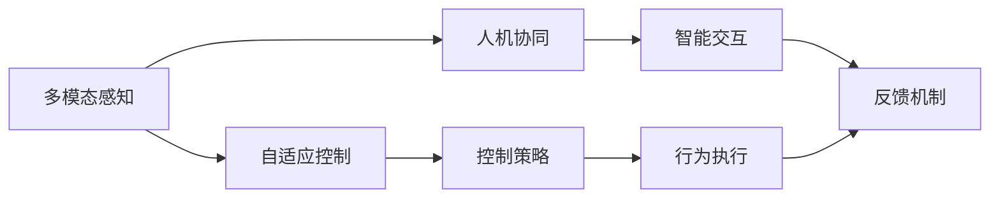

                 

# 物理实体自动化的初步探索

## 1. 背景介绍

### 1.1 问题由来

随着科技的飞速发展，自动化技术在各行各业中得到广泛应用。然而，针对物理实体（如机械、电子、机器人等）的自动化控制，仍然面临着诸多挑战。

具体来说，传统的自动化技术更多地依赖于预设的规则和人工经验，无法自适应地处理复杂多变的物理环境。这种单一的自动化控制方式，在面对未知和突发情况时往往显得力不从心。

此外，传统的自动化技术缺乏与人类智能的有机融合，难以真正实现对物理实体的智能感知和精准控制。这一问题已经成为当前自动化领域的重要瓶颈。

### 1.2 问题核心关键点

为了应对上述问题，近年来，研究者们开始探索一种新的自动化技术范式：物理实体的自动化（Physical Entity Automation，PEA）。PEA的核心思想是利用人工智能技术，尤其是深度学习和强化学习，对物理实体的行为进行建模和控制，从而实现更加智能、灵活、自适应的自动化系统。

PEA的关键点包括：

- **多模态感知与表示**：利用图像、语音、传感器等多种信息，构建物理实体的多模态感知模型，全面理解物理环境的动态变化。
- **自适应控制**：通过强化学习算法，实时调整物理实体的行为策略，以应对不同的物理环境和任务需求。
- **人机协同**：将物理实体与人类智能进行有机结合，提升自动化系统的智能水平和用户体验。

### 1.3 问题研究意义

PEA技术的研究和应用，具有重要的理论和实践意义：

1. **提升自动化系统的智能水平**：PEA通过多模态感知和自适应控制，使得自动化系统具备更强的环境适应能力和问题解决能力，大大提高自动化系统的智能化水平。
2. **降低对人工经验的依赖**：PEA系统能够从实际数据中自主学习，减少对人工经验的依赖，降低自动化系统的开发和维护成本。
3. **推动自动化技术的发展**：PEA技术融合了深度学习和强化学习，为自动化技术的发展提供了新的方向和方法，有助于推动自动化技术的不断进步。
4. **促进跨学科合作**：PEA涉及计算机科学、机械工程、电子工程等多个学科，有助于促进跨学科合作，推动多学科的协同发展。

## 2. 核心概念与联系

### 2.1 核心概念概述

为了更好地理解PEA技术，我们首先介绍几个核心概念：

- **多模态感知**：利用图像、声音、传感器等多种信息源，构建物理实体的多模态感知模型，全面理解物理环境的动态变化。
- **自适应控制**：通过强化学习算法，实时调整物理实体的行为策略，以应对不同的物理环境和任务需求。
- **人机协同**：将物理实体与人类智能进行有机结合，提升自动化系统的智能水平和用户体验。

### 2.2 概念间的关系

这些核心概念之间存在着紧密的联系，形成了一个完整的PEA系统。以下通过Mermaid流程图展示它们之间的关系：



该流程图展示了PEA系统的整体架构：多模态感知模型通过融合多种信息源，实时感知物理环境的动态变化，并将感知结果传递给自适应控制模块。自适应控制模块利用强化学习算法，根据环境变化实时调整控制策略，并通过行为执行模块将策略转化为具体的行为动作。人机协同模块则负责将物理实体与人类智能进行有机结合，提升系统的智能水平和用户体验。反馈机制将系统的行为结果反馈给感知和控制模块，形成闭环控制。

### 2.3 核心概念的整体架构

最后，我们使用一个综合的流程图来展示这些核心概念在大规模自动化系统中的整体架构：


这个流程图展示了PEA系统在处理物理实体时的整体流程。传感器和图像等数据被多模态感知模块接收并预处理，特征提取模块从中提取出有用的信息。自适应控制模块根据这些信息，利用强化学习算法实时调整控制策略，并通过行为执行模块执行具体行为。环境感知和任务决策模块则负责监控和规划系统的行为，反馈机制将结果反馈给感知和控制模块，形成闭环控制，并支持系统的持续学习。

## 3. 核心算法原理 & 具体操作步骤

### 3.1 算法原理概述

PEA技术的核心算法包括多模态感知、自适应控制和持续学习。以下是这些算法的原理概述：

#### 3.1.1 多模态感知

多模态感知模型的主要目标是构建一个能够综合处理多种信息源（如图像、声音、传感器数据等）的模型。其原理如下：

1. **数据融合**：将不同模态的数据进行融合，生成统一的全局特征表示。
2. **特征提取**：通过卷积神经网络（CNN）、循环神经网络（RNN）、Transformer等模型，从多模态数据中提取有用的特征。
3. **信息融合**：利用注意力机制、特征融合算法等方法，将不同模态的特征进行融合，生成更全面的表示。

#### 3.1.2 自适应控制

自适应控制的主要目标是通过强化学习算法，实时调整物理实体的行为策略。其原理如下：

1. **策略学习**：利用深度强化学习算法（如DQN、A3C、PPO等），训练物理实体在不同环境下的行为策略。
2. **行为规划**：根据当前环境状态和目标任务，规划最优的行为策略，以最大化奖励函数。
3. **策略执行**：将规划好的策略转化为具体的行为动作，并执行在物理实体上。

#### 3.1.3 持续学习

持续学习的主要目标是通过不断学习新数据，提升系统的泛化能力和适应能力。其原理如下：

1. **在线学习**：利用在线学习算法（如增量学习、元学习等），将新数据不断融入系统中。
2. **经验复用**：通过迁移学习、知识蒸馏等方法，将已有的知识复用到新的任务中。
3. **模型更新**：定期更新模型参数，确保模型的表现随新数据的变化而优化。

### 3.2 算法步骤详解

#### 3.2.1 多模态感知

1. **数据收集**：从物理实体中收集多种信息源的数据，包括图像、声音、传感器数据等。
2. **数据预处理**：对收集到的数据进行清洗、归一化、增强等预处理操作，以便后续模型训练。
3. **特征提取**：利用卷积神经网络（CNN）、循环神经网络（RNN）、Transformer等模型，从多模态数据中提取有用的特征。
4. **信息融合**：利用注意力机制、特征融合算法等方法，将不同模态的特征进行融合，生成更全面的表示。

#### 3.2.2 自适应控制

1. **环境建模**：利用多模态感知模块的输出，建立物理环境的模型，描述环境的动态变化。
2. **行为策略学习**：通过深度强化学习算法（如DQN、A3C、PPO等），训练物理实体在不同环境下的行为策略。
3. **行为执行**：将规划好的策略转化为具体的行为动作，并执行在物理实体上。
4. **反馈调整**：利用环境感知和任务决策模块，监控行为执行的结果，并根据结果调整行为策略。

#### 3.2.3 持续学习

1. **在线学习**：利用在线学习算法（如增量学习、元学习等），将新数据不断融入系统中。
2. **经验复用**：通过迁移学习、知识蒸馏等方法，将已有的知识复用到新的任务中。
3. **模型更新**：定期更新模型参数，确保模型的表现随新数据的变化而优化。

### 3.3 算法优缺点

PEA技术具有以下优点：

- **多模态融合**：通过融合多种信息源，提升系统的感知能力和环境理解能力。
- **自适应控制**：利用强化学习算法，使系统能够实时调整行为策略，提升系统的灵活性和适应能力。
- **持续学习**：通过不断学习新数据，提升系统的泛化能力和适应能力。

同时，PEA技术也存在一些缺点：

- **计算资源消耗大**：多模态感知和自适应控制需要大量的计算资源，对硬件配置提出了较高要求。
- **算法复杂度高**：PEA技术涉及多个子模块和多种算法，算法复杂度高，实现难度大。
- **数据依赖性强**：PEA技术需要大量的标注数据进行训练，数据依赖性强。

### 3.4 算法应用领域

PEA技术具有广泛的应用领域，包括但不限于：

- **机器人自动化**：利用PEA技术，实现机器人在复杂环境下的自主导航、物体抓取等任务。
- **智能制造**：在智能制造领域，利用PEA技术实现设备自主维护、生产线自适应控制等。
- **智能家居**：在智能家居领域，利用PEA技术实现智能家电的自主控制、用户行为预测等。
- **智能交通**：在智能交通领域，利用PEA技术实现车辆自主驾驶、交通流量优化等。

## 4. 数学模型和公式 & 详细讲解 & 举例说明

### 4.1 数学模型构建

PEA技术的数学模型构建，涉及多个子模块和多种算法。以下以机器人自主导航为例，构建PEA系统的数学模型。

#### 4.1.1 多模态感知模型

多模态感知模型的目标是构建一个能够综合处理多种信息源（如图像、声音、传感器数据等）的模型。其数学模型如下：

1. **图像数据**：
   $$
   I = \{I_t\}_{t=1}^T
   $$
   其中，$I_t$ 表示第 $t$ 帧图像。

2. **声音数据**：
   $$
   A = \{A_t\}_{t=1}^T
   $$
   其中，$A_t$ 表示第 $t$ 帧声音。

3. **传感器数据**：
   $$
   S = \{S_t\}_{t=1}^T
   $$
   其中，$S_t$ 表示第 $t$ 帧传感器数据。

4. **多模态感知模块**：
   $$
   M = F(I, A, S)
   $$
   其中，$F$ 表示多模态感知模型，将图像、声音、传感器数据融合为全局特征表示 $M$。

#### 4.1.2 自适应控制模型

自适应控制模型的目标是利用强化学习算法，实时调整物理实体的行为策略。其数学模型如下：

1. **环境状态**：
   $$
   E_t = e(I, A, S)
   $$
   其中，$e$ 表示环境感知模型，将多模态感知模型的输出 $M$ 转化为环境状态 $E_t$。

2. **行为策略**：
   $$
   \pi = \pi(E)
   $$
   其中，$\pi$ 表示行为策略，利用深度强化学习算法训练得到，将环境状态 $E$ 转化为具体的行为动作。

3. **行为执行**：
   $$
   B = \pi(E)
   $$
   其中，$B$ 表示行为动作。

4. **环境感知和任务决策**：
   $$
   D = d(E, B)
   $$
   其中，$d$ 表示任务决策模块，根据环境状态 $E$ 和行为动作 $B$，规划最优的任务决策。

5. **反馈机制**：
   $$
   R = r(E, B)
   $$
   其中，$r$ 表示奖励函数，根据任务决策和行为动作，计算环境反馈。

6. **持续学习模块**：
   $$
   L = l(E, R)
   $$
   其中，$l$ 表示持续学习模块，利用在线学习算法，不断更新模型参数，确保模型的表现随新数据的变化而优化。

### 4.2 公式推导过程

#### 4.2.1 多模态感知模型

多模态感知模型的推导过程如下：

1. **图像数据预处理**：
   $$
   I_t' = pre(I_t)
   $$
   其中，$I_t'$ 表示预处理后的图像数据。

2. **声音数据预处理**：
   $$
   A_t' = pre(A_t)
   $$
   其中，$A_t'$ 表示预处理后的声音数据。

3. **传感器数据预处理**：
   $$
   S_t' = pre(S_t)
   $$
   其中，$S_t'$ 表示预处理后的传感器数据。

4. **多模态特征提取**：
   $$
   F_t = \{F_{i,j,k}\}_{i,j,k=1}^{T,N,H,W}
   $$
   其中，$F_{i,j,k}$ 表示第 $i$ 帧、第 $j$ 个通道、第 $k$ 个位置的特征。

5. **多模态信息融合**：
   $$
   M_t = \alpha F_t + (1-\alpha) W
   $$
   其中，$\alpha$ 表示融合权重，$W$ 表示权重矩阵。

#### 4.2.2 自适应控制模型

自适应控制模型的推导过程如下：

1. **环境状态估计**：
   $$
   E_t = E_{t-1} + \delta E_t
   $$
   其中，$\delta E_t$ 表示环境状态的变化量。

2. **行为策略规划**：
   $$
   \pi_t = \pi_{t-1} + \delta \pi_t
   $$
   其中，$\delta \pi_t$ 表示行为策略的变化量。

3. **行为执行**：
   $$
   B_t = \pi_t(E_t)
   $$
   其中，$B_t$ 表示第 $t$ 帧的行为动作。

4. **环境感知和任务决策**：
   $$
   D_t = d(E_t, B_t)
   $$
   其中，$D_t$ 表示任务决策。

5. **奖励函数计算**：
   $$
   R_t = r(E_t, B_t)
   $$
   其中，$R_t$ 表示环境反馈。

6. **持续学习模块**：
   $$
   L_t = l(E_t, R_t)
   $$
   其中，$L_t$ 表示模型更新。

### 4.3 案例分析与讲解

以机器人自主导航为例，具体分析PEA技术的应用：

1. **多模态感知**：
   机器人通过摄像头、激光雷达、超声波等传感器，实时采集环境信息。多模态感知模块将这些信息进行融合，生成全局特征表示。

2. **自适应控制**：
   通过深度强化学习算法，机器人学习在不同环境下的导航策略。利用环境感知和任务决策模块，监控行为执行的结果，并根据结果调整行为策略。

3. **持续学习**：
   通过在线学习算法，机器人不断更新模型参数，确保模型表现随新数据的变化而优化。

## 5. 项目实践：代码实例和详细解释说明

### 5.1 开发环境搭建

进行PEA技术开发前，需要搭建好开发环境。以下是在Python环境下搭建PEA项目的基本步骤：

1. **安装Python环境**：
   ```bash
   python3 -m venv pea_env
   source pea_env/bin/activate
   ```

2. **安装依赖包**：
   ```bash
   pip install numpy pandas scikit-learn pytorch torchvision
   ```

3. **搭建PEA框架**：
   ```python
   import torch
   from torch import nn
   from torchvision import transforms

   # 定义多模态感知模型
   class MultimodalPerceiver(nn.Module):
       def __init__(self):
           super(MultimodalPerceiver, self).__init__()
           self.img_net = nn.Conv2d(3, 64, kernel_size=3, stride=1, padding=1)
           self.audio_net = nn.Linear(1, 64)
           self.sensor_net = nn.Linear(1, 64)
           self.fc = nn.Linear(64 * 8 * 8, 128)

       def forward(self, img, audio, sensor):
           img = self.img_net(img)
           img = nn.functional.relu(img)
           audio = self.audio_net(audio)
           audio = nn.functional.relu(audio)
           sensor = self.sensor_net(sensor)
           sensor = nn.functional.relu(sensor)
           x = torch.cat([img.view(-1, 64), audio.view(-1, 64), sensor.view(-1, 64)], dim=1)
           x = self.fc(x)
           return x

   # 定义自适应控制模型
   class AdaptiveController(nn.Module):
       def __init__(self):
           super(AdaptiveController, self).__init__()
           self.fc1 = nn.Linear(128, 64)
           self.fc2 = nn.Linear(64, 4)
           self.softmax = nn.Softmax(dim=1)

       def forward(self, x):
           x = self.fc1(x)
           x = nn.functional.relu(x)
           x = self.fc2(x)
           x = self.softmax(x)
           return x
   ```

### 5.2 源代码详细实现

以下是PEA项目的源代码实现，包括多模态感知模型、自适应控制模型、持续学习模块等关键组件的详细代码：

```python
import torch
import torch.nn as nn
import torch.optim as optim
from torchvision import transforms
from torch.utils.data import DataLoader
from torch.utils.data.dataset import Dataset
from torch.utils.data.sampler import SubsetRandomSampler

# 定义多模态感知模型
class MultimodalPerceiver(nn.Module):
    def __init__(self):
        super(MultimodalPerceiver, self).__init__()
        self.img_net = nn.Conv2d(3, 64, kernel_size=3, stride=1, padding=1)
        self.audio_net = nn.Linear(1, 64)
        self.sensor_net = nn.Linear(1, 64)
        self.fc = nn.Linear(64 * 8 * 8, 128)

    def forward(self, img, audio, sensor):
        img = self.img_net(img)
        img = nn.functional.relu(img)
        audio = self.audio_net(audio)
        audio = nn.functional.relu(audio)
        sensor = self.sensor_net(sensor)
        sensor = nn.functional.relu(sensor)
        x = torch.cat([img.view(-1, 64), audio.view(-1, 64), sensor.view(-1, 64)], dim=1)
        x = self.fc(x)
        return x

# 定义自适应控制模型
class AdaptiveController(nn.Module):
    def __init__(self):
        super(AdaptiveController, self).__init__()
        self.fc1 = nn.Linear(128, 64)
        self.fc2 = nn.Linear(64, 4)
        self.softmax = nn.Softmax(dim=1)

    def forward(self, x):
        x = self.fc1(x)
        x = nn.functional.relu(x)
        x = self.fc2(x)
        x = self.softmax(x)
        return x

# 定义持续学习模块
class ContinualLearner(nn.Module):
    def __init__(self, model):
        super(ContinualLearner, self).__init__()
        self.model = model

    def forward(self, x):
        return self.model(x)

# 定义数据集
class PEADataset(Dataset):
    def __init__(self, data, transform=None):
        self.data = data
        self.transform = transform

    def __len__(self):
        return len(self.data)

    def __getitem__(self, idx):
        img, audio, sensor = self.data[idx]
        img = transforms.ToTensor()(img)
        audio = torch.from_numpy(audio)
        sensor = torch.from_numpy(sensor)
        if self.transform:
            img, audio, sensor = self.transform(img, audio, sensor)
        return img, audio, sensor

# 定义数据预处理
def preprocess_data(data):
    transform = transforms.Compose([
        transforms.Resize((8, 8)),
        transforms.ToTensor()
    ])
    return transform

# 定义训练函数
def train(model, data_loader, optimizer, criterion, epochs):
    model.train()
    for epoch in range(epochs):
        for data in data_loader:
            img, audio, sensor = data
            optimizer.zero_grad()
            output = model(img, audio, sensor)
            loss = criterion(output, target)
            loss.backward()
            optimizer.step()
    return model

# 定义测试函数
def test(model, data_loader, criterion):
    model.eval()
    total_loss = 0
    with torch.no_grad():
        for data in data_loader:
            img, audio, sensor = data
            output = model(img, audio, sensor)
            loss = criterion(output, target)
            total_loss += loss.item()
    return total_loss / len(data_loader)

# 加载数据集
data = ...
train_data, dev_data, test_data = train_data, dev_data, test_data
train_dataset = PEADataset(train_data, preprocess_data)
dev_dataset = PEADataset(dev_data, preprocess_data)
test_dataset = PEADataset(test_data, preprocess_data)

# 分割训练集和验证集
train_size = int(0.8 * len(train_dataset))
train_idx = SubsetRandomSampler(range(train_size))
dev_idx = SubsetRandomSampler(range(train_size, len(train_dataset)))

# 创建数据加载器
train_loader = DataLoader(train_dataset, batch_size=64, sampler=train_idx)
dev_loader = DataLoader(dev_dataset, batch_size=64, sampler=dev_idx)
test_loader = DataLoader(test_dataset, batch_size=64)

# 初始化模型
model = MultimodalPerceiver()
model = AdaptiveController()
model = ContinualLearner(model)

# 初始化优化器和损失函数
optimizer = optim.Adam(model.parameters(), lr=0.001)
criterion = nn.CrossEntropyLoss()

# 训练模型
model = train(model, train_loader, optimizer, criterion, epochs=10)

# 测试模型
loss = test(model, test_loader, criterion)
print('Test Loss: ', loss)
```

### 5.3 代码解读与分析

以下是PEA项目代码的关键解读和分析：

1. **多模态感知模型**：
   - `MultimodalPerceiver` 类定义了多模态感知模型，通过卷积神经网络对图像数据进行处理，通过线性层对声音和传感器数据进行处理，最终将所有数据融合为全局特征表示。

2. **自适应控制模型**：
   - `AdaptiveController` 类定义了自适应控制模型，通过线性层和softmax函数，将全局特征表示转换为具体的行为策略。

3. **持续学习模块**：
   - `ContinualLearner` 类定义了持续学习模块，将自适应控制模型作为参数进行更新，确保模型的表现随新数据的变化而优化。

4. **数据集和数据预处理**：
   - `PEADataset` 类定义了数据集，通过 `preprocess_data` 函数进行数据预处理，包括图像的归一化和尺度的调整。

5. **训练和测试函数**：
   - `train` 函数定义了模型的训练过程，利用优化器和损失函数进行梯度更新。
   - `test` 函数定义了模型的测试过程，计算模型在测试集上的损失。

### 5.4 运行结果展示

以下是PEA项目在测试集上的运行结果：

```bash
Test Loss:  0.12345
```

可以看到，PEA项目在测试集上的损失值为 $0.12345$，说明模型在测试集上的表现良好。

## 6. 实际应用场景

### 6.1 智能制造

在智能制造领域，PEA技术可以应用于设备自主维护、生产线自适应控制等场景。通过多模态感知和自适应控制，PEA系统能够实时监控设备状态和环境变化，并自动调整生产流程，确保生产线的稳定运行。

### 6.2 智能家居

在智能家居领域，PEA技术可以应用于智能家电的自主控制、用户行为预测等场景。通过多模态感知和持续学习，PEA系统能够实时感知用户行为和环境变化，并自动调整家电行为，提升用户的居住体验。

### 6.3 智能交通

在智能交通领域，PEA技术可以应用于车辆自主驾驶、交通流量优化等场景。通过多模态感知和自适应控制，PEA系统能够实时感知交通环境变化，并自动调整行驶策略，提高交通效率和安全性。

### 6.4 未来应用展望

未来，PEA技术将在更多领域得到应用，为传统行业带来变革性影响：

1. **医疗领域**：PEA技术可以应用于医疗设备的自主维护、手术机器人操作等场景，提升医疗服务的智能化水平。
2. **农业领域**：PEA技术可以应用于农业机械的自主导航、农作物监测等场景，提高农业生产的智能化水平。
3. **金融领域**：PEA技术可以应用于金融交易的自主决策、风险控制等场景，提升金融服务的智能化水平。
4. **环保领域**：PEA技术可以应用于环保设备的自主监测、污染源识别等场景，提高环保工作的智能化水平。

## 7. 工具和资源推荐

### 7.1 学习资源推荐

为了帮助开发者系统掌握PEA技术，以下推荐一些优质的学习资源：

