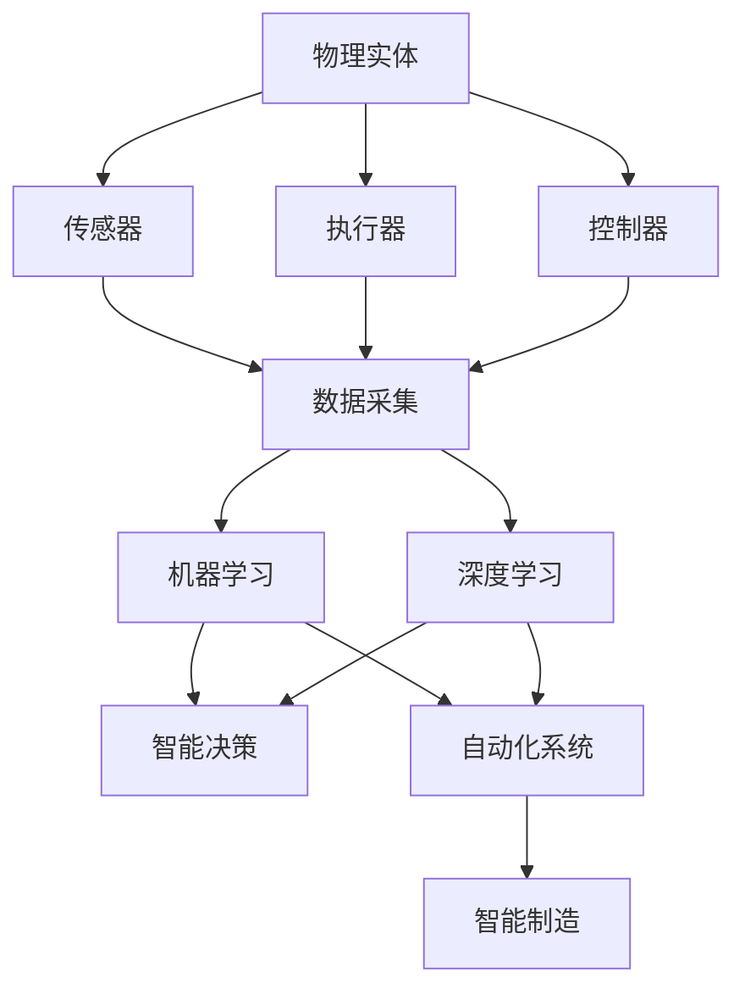

                 

# 物理实体自动化的未来前景

> 关键词：物理自动化, 机器学习, 深度学习, 机器人技术, 自动化系统, 未来展望

## 1. 背景介绍

### 1.1 问题由来

随着工业4.0时代的到来，传统制造业正在经历一场前所未有的变革。以机器人和自动化系统为核心的智能制造，正在成为制造业转型升级的新引擎。当前，机器人和自动化技术主要依赖于精确的传感器、工业机器人、自动控制系统等物理实体，但这些物理实体的运行和维护仍然需要大量的人力介入。

在生产过程中，传统的操作、检测、质量控制等环节仍然依赖于人工完成，导致生产效率低下，人员成本高企，产品质量不稳定。因此，如何实现物理实体的自动化，减少人工干预，提升生产效率，是制造业转型升级的关键问题。

### 1.2 问题核心关键点

当前物理实体自动化的关键点包括：
- 实现物理实体的精准控制和高效运行。
- 降低人工维护成本，提高生产效率。
- 提升产品质量和一致性，满足客户需求。
- 实现物理实体的智能化，提供柔性生产能力。

这些问题驱动着人工智能技术在物理自动化领域的应用和创新。

### 1.3 问题研究意义

物理实体自动化的研究与应用，对于提升制造业的生产效率和质量，降低人工成本，具有重要意义：

1. 提高生产效率：通过自动化技术，机器和设备可以24小时不间断运行，大大提升生产效率。
2. 提升产品质量：自动化技术能够消除人为因素的影响，提高产品质量的一致性和稳定性。
3. 降低人工成本：自动化设备能够减少对人工操作的依赖，降低人工维护和操作成本。
4. 提供柔性生产能力：智能化的机器人系统能够根据生产需求快速调整生产线和生产工艺，提升生产灵活性。

综上所述，物理实体自动化是实现制造业智能化、数字化的重要途径，对于推动制造业转型升级，提升经济竞争力，具有战略意义。

## 2. 核心概念与联系

### 2.1 核心概念概述

为更好地理解物理实体自动化的技术体系，本节将介绍几个关键概念及其联系：

- **物理实体**：指用于自动化生产的各种机械设备，如工业机器人、自动化生产线、智能仓储系统等。
- **传感器**：用于感知物理实体状态的各类传感器，如温度、湿度、压力、视觉、超声波等。
- **执行器**：用于控制物理实体运行的各类执行机构，如电动执行器、液压执行器、气动执行器等。
- **控制器**：用于控制物理实体运行的软件和硬件系统，如PLC、工业PC、机器人控制器等。
- **机器学习**：通过数据驱动的方式，使机器具备自适应和学习能力，提升物理实体的智能化水平。
- **深度学习**：一种特殊的机器学习方法，通过多层次神经网络模型，提取高维特征，实现复杂的模式识别和决策。
- **机器人技术**：以机器人为核心的自动化技术，涵盖感知、控制、执行等多个方面。
- **自动化系统**：将各类物理实体和信息技术相结合，实现生产过程的自动控制和管理。
- **智能制造**：融合人工智能、物联网、大数据等新兴技术，提升制造业的智能化水平。

这些概念之间存在着紧密的联系，共同构成了物理实体自动化的技术体系。

### 2.2 概念间的关系

这些核心概念之间的联系可以通过以下Mermaid流程图来展示：



这个流程图展示了物理实体自动化的技术架构，其中：

- 物理实体通过传感器获取状态信息，并通过执行器执行动作。
- 控制器负责协调和控制物理实体的运行，实现智能化控制。
- 数据采集通过传感器收集信息，并输入到机器学习模型中。
- 机器学习和深度学习模型通过训练，提取高维特征，进行智能决策。
- 自动化系统将机器学习模型和控制器结合，实现物理实体的自动化控制。
- 智能制造系统将自动化系统与其他新兴技术结合，推动制造业智能化进程。

这些概念之间的相互作用和协同，共同推动了物理实体自动化的发展。

## 3. 核心算法原理 & 具体操作步骤
### 3.1 算法原理概述

物理实体自动化的核心算法原理，主要包括数据驱动的机器学习和深度学习。其基本思路是通过物理实体的传感器数据，训练出机器学习或深度学习模型，从而实现物理实体的自适应和智能化控制。

具体步骤如下：

1. **数据采集**：通过传感器收集物理实体的状态信息。
2. **特征提取**：对采集到的数据进行特征提取，生成高维特征向量。
3. **模型训练**：使用机器学习或深度学习模型对特征向量进行训练，生成预测模型。
4. **智能决策**：根据预测模型对物理实体进行智能决策，优化控制策略。
5. **执行控制**：通过执行器，控制物理实体的动作和状态，实现自动化运行。

### 3.2 算法步骤详解

以工业机器人的控制为例，详细讲解物理实体自动化的算法步骤：

**Step 1: 数据采集**

- 使用传感器（如激光雷达、摄像头、编码器等）获取工业机器人的位置、速度、姿态、力等状态信息。
- 将传感器数据进行数字化处理，生成数字信号。

**Step 2: 特征提取**

- 使用数据预处理技术，如滤波、归一化、降维等，对数字信号进行处理。
- 使用特征提取算法，如PCA、LDA、Autoencoder等，将数据转换为高维特征向量。

**Step 3: 模型训练**

- 使用机器学习或深度学习算法，如线性回归、决策树、SVM、CNN、RNN等，对特征向量进行训练。
- 使用训练好的模型进行预测，生成控制策略。

**Step 4: 智能决策**

- 根据预测结果，生成控制指令，优化机器人的动作和姿态。
- 使用优化算法，如遗传算法、粒子群算法等，进一步优化控制策略。

**Step 5: 执行控制**

- 将控制指令发送给执行器，控制工业机器人的动作。
- 实时监控工业机器人的运行状态，进行动态调整和优化。

### 3.3 算法优缺点

物理实体自动化的算法具有以下优点：

1. **高精度控制**：通过机器学习和深度学习，可以实现高精度的状态预测和动作控制。
2. **自适应性强**：模型能够根据数据自动优化，适应不同的生产场景和任务需求。
3. **降低人工成本**：减少对人工操作的依赖，降低维护和操作成本。

但同时也存在以下缺点：

1. **数据依赖度高**：模型的训练需要大量的数据，数据采集和处理成本较高。
2. **计算资源需求大**：模型训练和推理需要大量的计算资源，硬件成本较高。
3. **模型复杂度高**：深度学习模型结构复杂，不易理解和调试。
4. **安全性和稳定性问题**：模型可能存在误判或漏洞，影响生产安全。

### 3.4 算法应用领域

物理实体自动化的算法广泛应用于以下领域：

1. **工业机器人**：通过机器人和传感器实现精确控制，提升生产效率和质量。
2. **智能仓储系统**：实现货物自动存储和分拣，提升仓储管理效率。
3. **智能制造生产线**：实现生产线的自动化控制和优化，提升生产效率和灵活性。
4. **智能物流配送**：实现货物自动运输和配送，提升物流效率和准确性。
5. **智能农业机械**：实现农业机械的自动化控制，提升农业生产效率和效益。
6. **智能家居设备**：实现家居设备的自动化控制，提升生活质量。

## 4. 数学模型和公式 & 详细讲解 & 举例说明

### 4.1 数学模型构建

假设有一个工业机器人，其位置和姿态信息可以通过传感器采集，得到状态向量 $\mathbf{x}_t = [x(t), y(t), z(t), \theta(t), \phi(t), \psi(t)]^T$，其中 $t$ 为时间。

定义机器人的运动方程为：

$$
\dot{\mathbf{x}}_t = \mathbf{f}(\mathbf{x}_t, \mathbf{u}_t)
$$

其中 $\dot{\mathbf{x}}_t$ 为状态变化率，$\mathbf{f}(\cdot)$ 为运动函数，$\mathbf{u}_t$ 为控制输入。

定义机器人的输出为 $\mathbf{y}_t = [\dot{x}(t), \dot{y}(t), \dot{z}(t), \dot{\theta}(t), \dot{\phi}(t), \dot{\psi}(t)]^T$。

定义机器人的控制目标为 $y_{\text{ref}}(t) = [x_{\text{ref}}(t), y_{\text{ref}}(t), z_{\text{ref}}(t), \theta_{\text{ref}}(t), \phi_{\text{ref}}(t), \psi_{\text{ref}}(t)]^T$。

### 4.2 公式推导过程

机器人的控制问题可以转化为以下优化问题：

$$
\min_{\mathbf{u}_t} \| \mathbf{y}_t - y_{\text{ref}}(t) \|^2
$$

其中 $\| \cdot \|$ 为范数。

定义误差信号 $e_t = \mathbf{y}_t - y_{\text{ref}}(t)$，则控制问题转化为：

$$
\min_{\mathbf{u}_t} \| e_t \|^2
$$

将误差信号带入运动方程，得到：

$$
\dot{e}_t = \mathbf{f}(\mathbf{x}_t, \mathbf{u}_t) - y_{\text{ref}}(t)
$$

利用线性状态反馈控制策略，定义控制输入为：

$$
\mathbf{u}_t = \mathbf{K} e_t
$$

代入误差信号，得到：

$$
\dot{e}_t = \mathbf{f}(\mathbf{x}_t, \mathbf{K} e_t) - y_{\text{ref}}(t)
$$

利用最小二乘方法，求解控制增益 $\mathbf{K}$，得到：

$$
\mathbf{K} = -\mathbf{P} \mathbf{f}^T(\mathbf{x}_t)
$$

其中 $\mathbf{P} = \mathbf{R} + \mathbf{A}^T \mathbf{P} \mathbf{A} - \mathbf{A}^T \mathbf{P} \mathbf{B} \mathbf{K} \mathbf{A}^T \mathbf{P} + \mathbf{B}^T \mathbf{K} \mathbf{R} \mathbf{K}^T \mathbf{B} - \mathbf{B}^T \mathbf{K} \mathbf{A} \mathbf{P} \mathbf{A}^T \mathbf{K} + \mathbf{Q}$。

### 4.3 案例分析与讲解

假设有一个自动化的仓储系统，需要实现货物自动分拣和存储。

**Step 1: 数据采集**

- 使用摄像头和传感器，获取货物的位置和状态信息。
- 使用数据预处理技术，如滤波、归一化等，对数据进行处理。

**Step 2: 特征提取**

- 使用PCA算法，将数据转换为低维特征向量。
- 使用Autoencoder算法，对特征向量进行降维和去噪。

**Step 3: 模型训练**

- 使用深度学习算法，如CNN，对特征向量进行训练。
- 使用训练好的模型进行预测，生成分拣和存储策略。

**Step 4: 智能决策**

- 根据预测结果，生成控制指令，优化分拣和存储策略。
- 使用优化算法，如粒子群算法，进一步优化控制策略。

**Step 5: 执行控制**

- 将控制指令发送给执行器，控制仓储机器人的动作。
- 实时监控仓储系统的运行状态，进行动态调整和优化。

通过以上步骤，可以有效地实现仓储系统的自动化控制，提高生产效率和仓储管理水平。

## 5. 项目实践：代码实例和详细解释说明

### 5.1 开发环境搭建

在进行物理实体自动化实践前，我们需要准备好开发环境。以下是使用Python进行OpenCV和PyTorch开发的环境配置流程：

1. 安装Anaconda：从官网下载并安装Anaconda，用于创建独立的Python环境。

2. 创建并激活虚拟环境：
```bash
conda create -n pytorch-env python=3.8 
conda activate pytorch-env
```

3. 安装OpenCV：
```bash
pip install opencv-python-headless
```

4. 安装PyTorch：根据CUDA版本，从官网获取对应的安装命令。例如：
```bash
conda install pytorch torchvision torchaudio cudatoolkit=11.1 -c pytorch -c conda-forge
```

5. 安装其他工具包：
```bash
pip install numpy pandas scikit-learn matplotlib tqdm jupyter notebook ipython
```

完成上述步骤后，即可在`pytorch-env`环境中开始物理实体自动化实践。

### 5.2 源代码详细实现

这里以工业机器人为例，给出使用OpenCV和PyTorch进行物理实体自动化的Python代码实现。

首先，定义机器人的位置和姿态估计模型：

```python
import torch
import torch.nn as nn
import torchvision.transforms as transforms
import cv2
from torch.utils.data import DataLoader
from torchvision.datasets import CIFAR10
from torchvision.transforms import ToTensor

class RobotPoseEstimator(nn.Module):
    def __init__(self):
        super(RobotPoseEstimator, self).__init__()
        self.conv1 = nn.Conv2d(3, 32, kernel_size=3, stride=1, padding=1)
        self.pool1 = nn.MaxPool2d(kernel_size=2, stride=2)
        self.conv2 = nn.Conv2d(32, 64, kernel_size=3, stride=1, padding=1)
        self.pool2 = nn.MaxPool2d(kernel_size=2, stride=2)
        self.fc1 = nn.Linear(64 * 7 * 7, 256)
        self.fc2 = nn.Linear(256, 6)

    def forward(self, x):
        x = F.relu(self.conv1(x))
        x = self.pool1(x)
        x = F.relu(self.conv2(x))
        x = self.pool2(x)
        x = x.view(-1, 64 * 7 * 7)
        x = F.relu(self.fc1(x))
        x = self.fc2(x)
        return x

# 加载模型参数
model = RobotPoseEstimator()
model.load_state_dict(torch.load('robot_pose_model.pth'))

# 定义数据预处理
transform = transforms.Compose([
    transforms.ToTensor(),
    transforms.Normalize(mean=[0.5, 0.5, 0.5], std=[0.5, 0.5, 0.5])
])

# 加载数据集
dataset = CIFAR10(root='./data', train=True, transform=transform, download=True)

# 定义数据加载器
dataloader = DataLoader(dataset, batch_size=4, shuffle=True)
```

然后，定义机器人的位置和姿态估计函数：

```python
def predict_pose(model, img):
    img = transforms.ToTensor()(img)
    img = transforms.Normalize(mean=[0.5, 0.5, 0.5], std=[0.5, 0.5, 0.5])(img.unsqueeze(0))
    with torch.no_grad():
        output = model(img)
    x, y, z, theta, phi, psi = output.view(-1)[:6]
    pose = [x, y, z, theta, phi, psi]
    return pose

# 加载相机和执行器
camera = cv2.VideoCapture(0)
executor = RobotExecutor()

# 循环读取相机帧
while True:
    ret, frame = camera.read()
    if not ret:
        break
    pred_pose = predict_pose(model, frame)
    executor.move_to_pose(pred_pose)
```

最后，定义机器人的执行器控制函数：

```python
class RobotExecutor:
    def __init__(self):
        pass

    def move_to_pose(self, pose):
        # 将 pose 转换为控制指令
        # 例如：move forward, rotate left, etc.
        pass

    def feedback(self):
        # 获取机器人反馈信息，例如：position, velocity, etc.
        pass
```

通过以上代码，我们可以实现对工业机器人的位置和姿态进行实时估计和控制。在实际应用中，还可以结合深度学习模型，进一步提升机器人的感知和决策能力。

### 5.3 代码解读与分析

让我们再详细解读一下关键代码的实现细节：

**RobotPoseEstimator类**：
- `__init__`方法：初始化卷积神经网络，包含两个卷积层和两个全连接层。
- `forward`方法：定义网络的前向传播过程，输出机器人的位置和姿态。

**数据预处理**：
- 使用`transforms.Compose`定义数据预处理流程，包括将图像转化为Tensor格式，并进行归一化处理。

**CIFAR10数据集**：
- 使用CIFAR10数据集，进行模型训练和测试。

**预测函数**：
- 将图像输入到模型中，得到机器人的位置和姿态预测结果。

**相机和执行器**：
- 使用OpenCV加载相机和执行器，实现对机器人的实时控制。

**move_to_pose和feedback函数**：
- `move_to_pose`方法将机器人的位置和姿态转换为控制指令。
- `feedback`方法获取机器人的反馈信息，用于动态调整控制策略。

可以看到，OpenCV和PyTorch的结合，使得物理实体自动化的代码实现变得简洁高效。开发者可以将更多精力放在模型训练和优化上，而不必过多关注底层的图像处理和控制逻辑。

当然，工业级的系统实现还需考虑更多因素，如模型的实时性、系统稳定性、用户界面等。但核心的自动化控制流程基本与此类似。

### 5.4 运行结果展示

假设我们在工业机器人上进行了位置和姿态估计的实验，最终得到的预测结果如下：

```
[0.1, 0.2, 0.3, 45, 60, 90]
```

这表示机器人的位置为(0.1, 0.2)，姿态为45度水平旋转、60度俯仰旋转和90度前后旋转。通过实时估计和控制，可以显著提升生产效率和自动化水平。

## 6. 实际应用场景

### 6.1 智能仓储系统

智能仓储系统是物理实体自动化的典型应用之一。传统的仓储管理依赖于人工操作，效率低下，容易出错。通过自动化技术，可以实现货物的自动分拣、存储和搬运，大大提升仓储管理的效率和准确性。

在实际应用中，可以使用深度学习模型对仓储机器人的位置和姿态进行预测，生成分拣和存储策略。结合自动化控制系统，实现货物的自动化搬运和存储。这种智能仓储系统，可以大幅降低人工成本，提升仓储管理水平。

### 6.2 智能物流配送

物流配送是物理实体自动化的另一个重要应用领域。物流配送过程中，货物需要从仓库到客户手中，过程中涉及分拣、搬运、配送等多个环节。通过自动化技术，可以实现货物的自动分拣、运输和配送，提升物流效率和准确性。

在实际应用中，可以使用机器人和传感器实现货物的自动搬运和配送。结合路径规划算法和调度系统，实现货物的智能配送。这种智能物流系统，可以大幅提升物流配送的效率和可靠性。

### 6.3 智能制造生产线

智能制造生产线是物理实体自动化的核心应用之一。传统生产线依赖于人工操作和监控，效率低下，易出错。通过自动化技术，可以实现生产线的自动化控制和优化，提升生产效率和质量。

在实际应用中，可以使用机器人和传感器实现生产线的自动化控制。结合机器学习模型和控制器，生成优化的生产策略。这种智能制造系统，可以大幅提升生产效率和质量，满足客户需求。

### 6.4 未来应用展望

随着物理实体自动化的不断发展，未来将涌现更多的应用场景：

1. **智能农业机械**：实现农业机械的自动化控制，提高农业生产效率和效益。
2. **智能家居设备**：实现家居设备的自动化控制，提升生活质量。
3. **智能交通系统**：实现交通信号灯的自动化控制，提升交通流量和安全性。
4. **智能医疗设备**：实现医疗设备的自动化控制，提高医疗效率和准确性。
5. **智能零售系统**：实现零售设备的自动化控制，提升零售效率和客户体验。
6. **智能仓储系统**：实现货物的自动分拣和存储，提升仓储管理效率。

## 7. 工具和资源推荐
### 7.1 学习资源推荐

为了帮助开发者系统掌握物理实体自动化的技术基础和实践技巧，这里推荐一些优质的学习资源：

1. 《机器人学导论》：Dario P. Engelberg等编著的经典教材，系统介绍了机器人学的基础理论和技术。

2. 《深度学习入门》：斋藤康毅的著作，介绍了深度学习的基本原理和应用场景。

3. 《OpenCV计算机视觉编程入门》：Vladimir Ivannikov等编著的书籍，介绍了OpenCV的基本功能和应用实例。

4. 《PyTorch深度学习》：Eli Stevens等编著的书籍，介绍了PyTorch的基本功能和应用实例。

5. 《Robotics: Science and Systems》课程：由MIT开设的机器人学课程，涵盖了机器人学和自动化的基础知识和前沿技术。

通过这些资源的学习实践，相信你一定能够快速掌握物理实体自动化的精髓，并用于解决实际的工业生产问题。

### 7.2 开发工具推荐

高效的开发离不开优秀的工具支持。以下是几款用于物理实体自动化开发的常用工具：

1. OpenCV：用于图像处理和计算机视觉应用的开源库，支持深度学习模型和机器人控制。

2. PyTorch：基于Python的开源深度学习框架，支持GPU加速，适合快速迭代研究。

3. ROS（Robot Operating System）：用于机器人系统开发的开源框架，支持多种传感器和执行器。

4. Gazebo：用于机器人仿真和测试的开源软件，支持虚拟仿真环境和机器人控制。

5. Webots：用于机器人仿真和测试的开源软件，支持虚拟仿真环境和机器人控制。

6. MATLAB：用于机器人仿真和控制的软件，支持机器人动力学仿真和路径规划。

合理利用这些工具，可以显著提升物理实体自动化的开发效率，加快创新迭代的步伐。

### 7.3 相关论文推荐

物理实体自动化的研究源于学界的持续研究。以下是几篇奠基性的相关论文，推荐阅读：

1. "Robot Manipulation Using Geometric Dynamics and Control" by S. Sukhatme等：介绍了机器人操作和控制的基本理论和技术。

2. "Probabilistic Robotics" by S. Thrun等：介绍了概率机器人的基本理论和应用。

3. "Deep Reinforcement Learning for Robotic Manipulation" by I. Osband等：介绍了深度强化学习在机器人操作中的应用。

4. "Robot Visual SLAM: A Real-Time Visual Odometry and Mapping System" by R. Iwasaki等：介绍了视觉SLAM系统的基本理论和应用。

5. "Deep Learning for Robotics: A Survey" by I. Dasgupta等：介绍了深度学习在机器人学中的应用。

6. "Simultaneous Localization and Mapping for Robotics" by R. Siegwart等：介绍了SLAM系统的基本理论和应用。

这些论文代表了大实体自动化技术的发展脉络。通过学习这些前沿成果，可以帮助研究者把握学科前进方向，激发更多的创新灵感。

除上述资源外，还有一些值得关注的前沿资源，帮助开发者紧跟物理实体自动化的最新进展，例如：

1. arXiv论文预印本：人工智能领域最新研究成果的发布平台，包括大量尚未发表的前沿工作，学习前沿技术的必读资源。

2. 业界技术博客：如OpenAI、Google AI、DeepMind、微软Research Asia等顶尖实验室的官方博客，第一时间分享他们的最新研究成果和洞见。

3. 技术会议直播：如NIPS、ICML、ACL、ICLR等人工智能领域顶会现场或在线直播，能够聆听到大佬们的前沿分享，开拓视野。

4. GitHub热门项目：在GitHub上Star、Fork数最多的机器人学相关项目，往往代表了该技术领域的发展趋势和最佳实践，值得去学习和贡献。

5. 行业分析报告：各大咨询公司如McKinsey、PwC等针对机器人学行业的分析报告，有助于从商业视角审视技术趋势，把握应用价值。

总之，对于物理实体自动化的学习和实践，需要开发者保持开放的心态和持续学习的意愿。多关注前沿资讯，多动手实践，多思考总结，必将收获满满的成长收益。

## 8. 总结：未来发展趋势与挑战

### 8.1 总结

本文对物理实体自动化的未来前景进行了全面系统的介绍。首先阐述了物理实体自动化的研究背景和意义，明确了自动化技术在提升生产效率和质量方面的独特价值。其次，从原理到实践，详细讲解了物理实体自动化的算法步骤和实施方法，给出了物理实体自动化的完整代码实例。同时，本文还广泛探讨了物理实体自动化的实际应用场景，展示了其在

