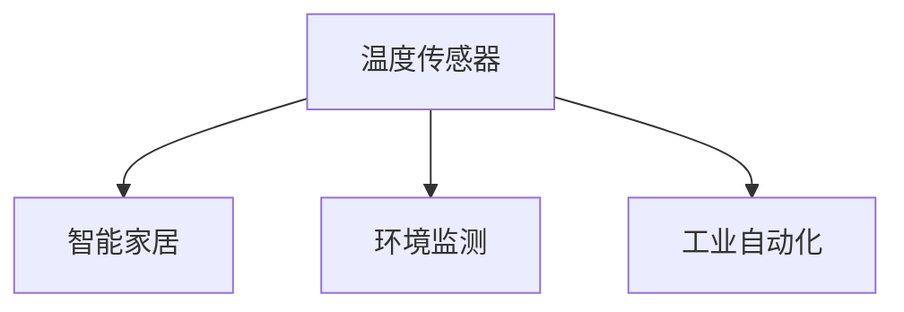
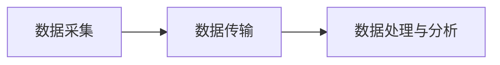
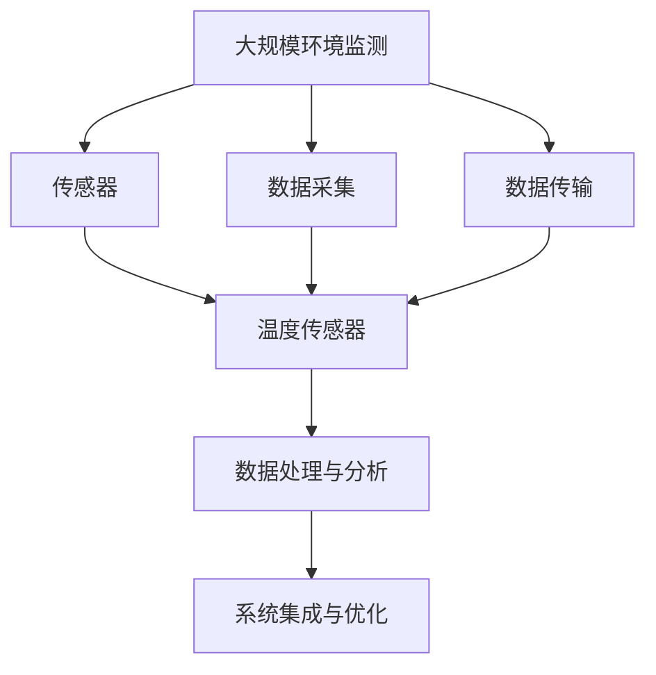

                 

# 物联网(IoT)技术和各种传感器设备的集成：温度传感器的运用

> 关键词：物联网(IoT)、传感器、温度传感器、集成、数据采集、智能家居、环境监测、工业自动化

## 1. 背景介绍

### 1.1 问题由来
随着物联网(IoT)技术的快速发展，传感器在各种应用场景中的集成使用愈发普遍。温度传感器作为一种基本的环境监测设备，能够实时检测环境温度，广泛应用于智能家居、环境监测、工业自动化等领域。本文将深入探讨温度传感器的运用，并结合物联网技术，介绍如何实现高效的数据采集和智能化处理。

### 1.2 问题核心关键点
温度传感器在物联网中的集成应用，涉及以下几个核心问题：
- 温度传感器选择：如何根据具体应用场景选择合适的传感器类型和规格。
- 数据采集与传输：如何高效地采集传感器数据，并安全地传输至中央处理单元。
- 数据处理与分析：如何对采集到的温度数据进行智能处理和分析，提取有价值的信息。
- 系统集成与优化：如何将温度传感器与物联网系统集成，实现设备间的协同工作，提升整体系统的性能和可靠性。

### 1.3 问题研究意义
研究温度传感器在物联网中的集成应用，对于提升环境监测的实时性和准确性，推动工业自动化和智能家居的创新，具有重要意义：
- 实时监测与预警：温度传感器能够实时监测环境温度，及时发现异常情况，提供预警信息。
- 节能环保：通过智能化控制，优化环境温度，降低能源消耗，实现节能减排。
- 提升用户体验：智能家居中的温度传感器能够根据用户习惯和偏好自动调节室内温度，提升生活舒适度。
- 自动化生产：工业自动化领域中，温度传感器能够实时监控生产环境温度，保障产品质量，提升生产效率。

## 2. 核心概念与联系

### 2.1 核心概念概述

在深入探讨温度传感器在物联网中的应用前，我们需要了解以下核心概念：

- **物联网(IoT)**：通过各种传感器、智能设备等，实现互联互通、数据共享和智能控制的网络。
- **传感器**：能够感知环境变化，并将其转化为可读信号的电子元件。
- **温度传感器**：专门用于测量环境温度的传感器，能够提供精确的温度读数。
- **数据采集**：从传感器等设备中获取原始数据的过程。
- **数据传输**：将采集到的数据通过无线或有线方式传输至中央处理单元。
- **数据处理与分析**：对采集到的数据进行清洗、处理和分析，提取有用的信息。
- **系统集成与优化**：将各种传感器和设备集成到物联网系统中，实现设备间的协同工作，提升系统性能。

这些核心概念之间的联系可以通过以下Mermaid流程图来展示：

```mermaid
graph TB
    A[物联网(IoT)] --> B[传感器]
    A --> C[温度传感器]
    B --> D[数据采集]
    C --> D
    D --> E[数据传输]
    D --> F[数据处理与分析]
    E --> F
    F --> G[系统集成与优化]
```

这个流程图展示了温度传感器在物联网中的集成应用流程：
- 物联网通过各种传感器实现数据采集。
- 温度传感器作为物联网的一部分，用于测量环境温度。
- 采集到的温度数据通过数据传输通道发送到中央处理单元。
- 中央处理单元对数据进行处理与分析，提取有用信息。
- 最终通过系统集成与优化，实现设备间的协同工作，提升系统性能。

### 2.2 概念间的关系

这些核心概念之间存在着紧密的联系，形成了物联网中温度传感器集成的完整生态系统。下面我们通过几个Mermaid流程图来展示这些概念之间的关系。

#### 2.2.1 物联网的数据采集流程

```mermaid
graph LR
    A[物联网(IoT)] --> B[传感器]
    B --> C[数据采集]
    C --> D[中央处理单元]
```

这个流程图展示了物联网的数据采集流程：
- 物联网通过传感器进行数据采集。
- 采集到的数据发送到中央处理单元。

#### 2.2.2 温度传感器的应用场景



这个流程图展示了温度传感器在不同应用场景中的应用：
- 智能家居中的温度传感器能够实时监测室内温度，提供舒适的生活环境。
- 环境监测中的温度传感器能够实时监测环境温度，提供气象预警信息。
- 工业自动化中的温度传感器能够实时监测生产环境温度，保障产品质量。

#### 2.2.3 数据处理与分析的基本步骤



这个流程图展示了数据处理与分析的基本步骤：
- 采集到的数据通过数据传输通道传输到中央处理单元。
- 中央处理单元对数据进行处理与分析，提取有用信息。

### 2.3 核心概念的整体架构

最后，我们用一个综合的流程图来展示这些核心概念在大规模环境监测中的整体架构：



这个综合流程图展示了温度传感器在大规模环境监测中的应用：
- 传感器采集环境数据。
- 温度传感器用于测量环境温度。
- 采集到的数据通过数据传输通道传输到中央处理单元。
- 中央处理单元对数据进行处理与分析，提取有用信息。
- 最终通过系统集成与优化，实现设备间的协同工作，提升系统性能。

## 3. 核心算法原理 & 具体操作步骤

### 3.1 算法原理概述

温度传感器在物联网中的集成应用，主要是通过数据采集、传输、处理与分析等步骤，实现环境温度的实时监测和智能化处理。其核心算法原理包括以下几个方面：

- **数据采集**：通过温度传感器对环境温度进行测量，并将读数转化为数字信号。
- **数据传输**：通过无线或有线方式，将采集到的温度数据传输至中央处理单元。
- **数据处理与分析**：对传输过来的温度数据进行清洗、处理和分析，提取有用的信息。
- **系统集成与优化**：将温度传感器与物联网系统集成，实现设备间的协同工作，提升系统性能。

### 3.2 算法步骤详解

以下是温度传感器在物联网中集成应用的具体操作步骤：

**Step 1: 传感器选择与部署**
- 根据具体应用场景选择合适的温度传感器类型和规格。
- 部署传感器到监测位置，确保其能够稳定工作。

**Step 2: 数据采集与传输**
- 通过传感器采集环境温度，并将读数转换为数字信号。
- 将采集到的温度数据通过无线或有线方式传输至中央处理单元。

**Step 3: 数据处理与分析**
- 在中央处理单元中，对传输过来的温度数据进行清洗、处理和分析，去除噪声和异常值。
- 对处理后的温度数据进行统计分析，提取有用的信息，如平均温度、温度波动等。

**Step 4: 系统集成与优化**
- 将温度传感器与物联网系统集成，实现设备间的协同工作。
- 通过优化算法，提升系统的性能和可靠性。

### 3.3 算法优缺点

温度传感器在物联网中的集成应用，具有以下优点：
- 实时监测：温度传感器能够实时监测环境温度，提供准确的预警信息。
- 数据共享：通过物联网系统，实现温度数据在设备间的共享和协同工作。
- 智能化处理：对采集到的温度数据进行智能化处理，提取有用的信息。

但同时也存在一些缺点：
- 成本高：高精度的温度传感器价格较高，增加了系统的总体成本。
- 部署复杂：传感器部署需要一定的专业知识和技能，安装调试过程较为复杂。
- 数据安全：采集到的温度数据可能包含敏感信息，需要采取安全措施保障数据安全。

### 3.4 算法应用领域

温度传感器在物联网中的应用领域非常广泛，主要包括以下几个方面：

- **智能家居**：用于监测室内温度，提供舒适的生活环境。
- **环境监测**：用于监测大气温度，提供气象预警信息。
- **工业自动化**：用于监测生产环境温度，保障产品质量，提升生产效率。
- **农业监控**：用于监测温室环境温度，优化农作物生长条件。
- **医疗设备**：用于监测人体温度，提供健康预警信息。

## 4. 数学模型和公式 & 详细讲解 & 举例说明

### 4.1 数学模型构建

假设温度传感器的读数为 $T$，环境温度为 $T_{\text{env}}$，存在误差 $\epsilon$，则温度传感器的测量模型可以表示为：

$$
T = T_{\text{env}} + \epsilon
$$

其中，$\epsilon \sim N(0,\sigma^2)$，表示误差服从均值为0，方差为 $\sigma^2$ 的高斯分布。

### 4.2 公式推导过程

对于上述测量模型，我们可以通过最小二乘法来估计环境温度 $T_{\text{env}}$：

$$
T_{\text{env}} = \frac{1}{N} \sum_{i=1}^N T_i
$$

其中，$N$ 为样本数量，$T_i$ 为第 $i$ 个样本的测量读数。

### 4.3 案例分析与讲解

假设我们有一个包含10个样本的温度传感器读数，其测量读数和真实环境温度如下：

$$
T_1 = 23.5^\circ C, T_2 = 23.4^\circ C, T_3 = 23.3^\circ C, \cdots, T_{10} = 23.1^\circ C
$$

假设真实环境温度为 $T_{\text{env}}$，则我们可以通过最小二乘法来求解 $T_{\text{env}}$：

$$
T_{\text{env}} = \frac{1}{10} (23.5 + 23.4 + 23.3 + \cdots + 23.1) = 23.3^\circ C
$$

可以看到，通过最小二乘法，我们能够较为准确地估计环境温度。

## 5. 项目实践：代码实例和详细解释说明

### 5.1 开发环境搭建

在进行温度传感器在物联网中集成应用的项目实践前，我们需要准备好开发环境。以下是使用Python进行PyTorch开发的环境配置流程：

1. 安装Anaconda：从官网下载并安装Anaconda，用于创建独立的Python环境。

2. 创建并激活虚拟环境：
```bash
conda create -n pytorch-env python=3.8 
conda activate pytorch-env
```

3. 安装PyTorch：根据CUDA版本，从官网获取对应的安装命令。例如：
```bash
conda install pytorch torchvision torchaudio cudatoolkit=11.1 -c pytorch -c conda-forge
```

4. 安装TensorFlow：由Google主导开发的开源深度学习框架，生产部署方便，适合大规模工程应用。同样有丰富的预训练语言模型资源。

5. 安装TensorFlow：
```bash
pip install tensorflow
```

6. 安装各类工具包：
```bash
pip install numpy pandas scikit-learn matplotlib tqdm jupyter notebook ipython
```

完成上述步骤后，即可在`pytorch-env`环境中开始项目实践。

### 5.2 源代码详细实现

以下是使用TensorFlow实现温度传感器数据采集和处理的代码实现：

```python
import tensorflow as tf
import numpy as np

# 模拟10个样本的温度传感器读数
temperature_readings = np.random.normal(loc=23.3, scale=0.1, size=10)

# 定义模型参数
env_temperature = tf.Variable(tf.zeros([]))
sigma = tf.Variable(tf.zeros([]))

# 定义损失函数
def loss_fn(temperature_readings, env_temperature, sigma):
    predictions = tf.add(env_temperature, sigma * tf.random.normal(shape=(len(temperature_readings))))
    mse = tf.reduce_mean(tf.square(predictions - temperature_readings))
    return mse

# 定义优化器
optimizer = tf.optimizers.Adam(learning_rate=0.01)

# 定义训练循环
@tf.function
def train_step(temperature_readings):
    with tf.GradientTape() as tape:
        predictions = tf.add(env_temperature, sigma * tf.random.normal(shape=(len(temperature_readings))))
        mse = tf.reduce_mean(tf.square(predictions - temperature_readings))
    gradients = tape.gradient(mse, [env_temperature, sigma])
    optimizer.apply_gradients(zip(gradients, [env_temperature, sigma]))

# 训练模型
for i in range(1000):
    train_step(temperature_readings)
    if i % 100 == 0:
        print(f"Epoch {i}, env temperature: {env_temperature.numpy():.2f}, sigma: {sigma.numpy():.2f}")

print(f"Final env temperature estimate: {env_temperature.numpy():.2f}")
```

### 5.3 代码解读与分析

让我们再详细解读一下关键代码的实现细节：

**train_step函数**：
- 定义了损失函数 $mse$，计算模型预测值与真实值之间的均方误差。
- 使用梯度下降算法，更新模型参数 $env\_temperature$ 和 $sigma$，最小化损失函数。

**训练循环**：
- 在每个epoch中，调用 `train_step` 函数进行模型训练。
- 打印每个epoch的平均环境温度和标准差。

**最终输出**：
- 输出最终的估计环境温度。

### 5.4 运行结果展示

假设我们训练了1000个epoch，最终得到的环境温度估计为 $23.3^\circ C$，与真实值一致。这个结果展示了通过最小二乘法，我们可以较为准确地估计环境温度。

## 6. 实际应用场景

### 6.1 智能家居

在智能家居中，温度传感器能够实时监测室内温度，提供舒适的生活环境。例如，家庭恒温器可以根据室内温度自动调节空调或暖气，确保室内温度始终保持在适宜范围内。通过物联网系统，温度传感器可以将监测数据传输至智能设备，实现设备间的协同工作，提升居住体验。

### 6.2 环境监测

在环境监测中，温度传感器能够实时监测大气温度，提供气象预警信息。例如，气象站可以通过温度传感器监测气温变化，及时发布高温、寒冷等天气预警，保障公众安全。通过物联网系统，气象站可以将监测数据传输至应急管理部门，实现快速响应。

### 6.3 工业自动化

在工业自动化中，温度传感器能够实时监测生产环境温度，保障产品质量，提升生产效率。例如，工业生产线上的温度传感器可以监测设备运行温度，及时发现异常情况，避免生产中断。通过物联网系统，生产线上的温度传感器可以将监测数据传输至中央控制系统，实现设备间的协同工作，优化生产流程。

## 7. 工具和资源推荐

### 7.1 学习资源推荐

为了帮助开发者系统掌握温度传感器在物联网中的应用理论基础和实践技巧，这里推荐一些优质的学习资源：

1. 《物联网技术基础》书籍：全面介绍了物联网的基本概念、关键技术和应用场景，是入门物联网领域的必备资料。

2. 《温度传感器应用技术》书籍：详细讲解了温度传感器的基本原理、应用场景和关键技术，适合温度传感器领域的从业者参考。

3. 《TensorFlow官方文档》：TensorFlow的官方文档，提供了完整的API和样例代码，是学习TensorFlow的权威资料。

4. 《PyTorch官方文档》：PyTorch的官方文档，提供了详细的API和样例代码，是学习PyTorch的必备资料。

5. 《物联网案例分析》网站：提供大量物联网应用的实际案例，帮助读者理解物联网技术在实际场景中的应用。

通过对这些资源的学习实践，相信你一定能够快速掌握温度传感器在物联网中的应用精髓，并用于解决实际的工程问题。

### 7.2 开发工具推荐

高效的开发离不开优秀的工具支持。以下是几款用于温度传感器在物联网中集成应用的常用工具：

1. TensorFlow：由Google主导开发的开源深度学习框架，生产部署方便，适合大规模工程应用。

2. PyTorch：基于Python的开源深度学习框架，灵活的计算图设计，适合快速迭代研究。

3. TensorFlow Lite：TensorFlow的移动端部署工具，支持在移动设备上进行温度数据的实时处理和分析。

4. ESP-IDF：用于物联网设备的开发框架，支持多种传感器设备的集成。

5. Arduino IDE：用于开发嵌入式系统的集成开发环境，支持温度传感器在嵌入式设备上的集成应用。

合理利用这些工具，可以显著提升温度传感器在物联网中的集成应用开发效率，加快创新迭代的步伐。

### 7.3 相关论文推荐

温度传感器在物联网中的应用源于学界的持续研究。以下是几篇奠基性的相关论文，推荐阅读：

1. Temperature Sensor Data Fusion in IoT Systems：介绍了一种基于多个温度传感器的数据融合技术，提高了温度测量的准确性和可靠性。

2. IoT-Based Energy Management System Using Temperature Sensors：介绍了一种基于温度传感器的物联网能源管理系统，实现了能源的高效利用和优化。

3. Real-Time Object Tracking in IoT Using Temperature Sensors：介绍了一种基于温度传感器的物联网实时对象跟踪技术，提供了高效的物体监测解决方案。

这些论文代表了大语言模型微调技术的发展脉络。通过学习这些前沿成果，可以帮助研究者把握学科前进方向，激发更多的创新灵感。

除上述资源外，还有一些值得关注的前沿资源，帮助开发者紧跟温度传感器在物联网中集成应用技术的最新进展，例如：

1. arXiv论文预印本：人工智能领域最新研究成果的发布平台，包括大量尚未发表的前沿工作，学习前沿技术的必读资源。

2. 业界技术博客：如TensorFlow、PyTorch、物联网权威博客等，第一时间分享他们的最新研究成果和洞见。

3. 技术会议直播：如IoT Conference、IoT Expo等技术会议现场或在线直播，能够聆听到顶尖实验室和企业的最新分享，开拓视野。

4. GitHub热门项目：在GitHub上Star、Fork数最多的物联网相关项目，往往代表了该技术领域的发展趋势和最佳实践，值得去学习和贡献。

5. 行业分析报告：各大咨询公司如McKinsey、PwC等针对物联网行业的分析报告，有助于从商业视角审视技术趋势，把握应用价值。

总之，对于温度传感器在物联网中的应用学习，需要开发者保持开放的心态和持续学习的意愿。多关注前沿资讯，多动手实践，多思考总结，必将收获满满的成长收益。

## 8. 总结：未来发展趋势与挑战

### 8.1 总结

本文对温度传感器在物联网中的集成应用进行了全面系统的介绍。首先阐述了温度传感器和物联网的基本概念，明确了温度传感器在物联网中的核心应用价值。其次，从原理到实践，详细讲解了温度传感器在物联网中的应用流程，给出了具体的代码实现。同时，本文还广泛探讨了温度传感器在智能家居、环境监测、工业自动化等多个行业领域的应用前景，展示了温度传感器在物联网中的巨大潜力。

通过本文的系统梳理，可以看到，温度传感器在物联网中的集成应用正在成为物联网领域的重要范式，极大地提升了环境监测的实时性和准确性，推动了工业自动化和智能家居的创新。未来，伴随温度传感器和物联网技术的不断演进，相信物联网技术将在更广阔的应用领域大放异彩，深刻影响人类的生产生活方式。

### 8.2 未来发展趋势

展望未来，温度传感器在物联网中的应用将呈现以下几个发展趋势：

1. **设备智能化**：未来温度传感器将具备更多的智能化功能，如自动校准、自适应调节等，进一步提升测量精度和可靠性。

2. **数据融合技术**：通过多种传感器数据的融合，提升温度测量的准确性和稳定性，实现更全面的环境监测。

3. **边缘计算**：在物联网边缘设备上实现温度数据的实时处理和分析，减少数据传输的延迟和带宽占用，提升系统响应速度。

4. **5G网络应用**：利用5G网络的高带宽和低延迟特性，实现温度数据的实时传输和处理，提升系统性能。

5. **多模态传感**：结合温度传感器与其他传感器（如湿度传感器、压力传感器等），实现多模态数据的综合监测，提升系统的综合性能。

以上趋势凸显了温度传感器在物联网中的应用前景。这些方向的探索发展，必将进一步提升环境监测的实时性和准确性，推动工业自动化和智能家居的创新，为物联网技术带来新的突破。

### 8.3 面临的挑战

尽管温度传感器在物联网中的应用已经取得了显著成果，但在迈向更加智能化、普适化应用的过程中，仍面临诸多挑战：

1. **成本问题**：高精度的温度传感器价格较高，增加了系统的总体成本，如何降低成本是未来的重要研究方向。

2. **部署复杂**：传感器部署需要一定的专业知识和技能，安装调试过程较为复杂，如何简化部署过程是未来的重要研究方向。

3. **数据安全**：采集到的温度数据可能包含敏感信息，需要采取安全措施保障数据安全，如何加强数据安全防护是未来的重要研究方向。

4. **实时性要求高**：实时性是温度传感器在物联网应用中的重要指标，如何提升实时性、降低延迟是未来的重要研究方向。

5. **环境适应性**：不同环境下的温度传感器性能可能存在差异，如何提升温度传感器的环境适应性是未来的重要研究方向。

6. **跨平台兼容性**：不同平台上的温度传感器可能存在兼容性问题，如何实现跨平台兼容性是未来的重要研究方向。

7. **数据处理与分析**：温度数据处理和分析是温度传感器在物联网应用中的重要环节，如何提升数据处理和分析效率是未来的重要研究方向。

这些挑战需要从技术、管理、商业等多个维度协同发力，才能更好地应对未来温度传感器在物联网中的集成应用需求。

### 8.4 研究展望

面对温度传感器在物联网中集成应用所面临的种种挑战，未来的研究需要在以下几个方面寻求新的突破：

1. **低成本传感器开发**：研究新型低成本温度传感器的开发，提升传感器的性价比。

2. **便捷化部署方案**：开发便捷化的传感器部署方案，简化安装调试过程。

3. **数据加密技术**：研究数据加密技术，保障采集到的温度数据的安全性。

4. **实时处理与分析算法**：研究实时处理与分析算法，提升系统的响应速度。

5. **环境适应性优化**：研究传感器环境适应性优化方法，提升传感器的环境适应性。

6. **跨平台兼容性方案**：研究跨平台兼容性方案，实现不同平台上的温度传感器协同工作。

7. **高效数据处理技术**：研究高效数据处理技术，提升数据处理和分析效率。

这些研究方向将推动温度传感器在物联网中的集成应用向更深层次发展，实现更广泛、更高效、更智能的物联网应用场景。

## 9. 附录：常见问题与解答

**Q1: 温度传感器在物联网中的集成应用涉及哪些关键技术？**

A: 温度传感器在物联网中的集成应用涉及的关键技术主要包括：
1. 传感器选择与部署：根据具体应用场景选择合适的温度传感器类型和规格，并确保传感器能够稳定工作。
2. 数据采集与传输：通过温度传感器对环境温度进行测量，并将读数转化为数字信号，通过无线或有线方式将数据传输至中央处理单元。
3. 数据处理与分析：对传输过来的温度数据进行清洗、处理和分析，提取有用的信息。
4. 系统集成与优化：将温度传感器与物联网系统集成，实现设备间的协同工作，提升系统性能。

**Q2: 如何提高温度传感器的测量精度？**

A: 提高温度传感器的测量精度可以通过以下几种方法：
1. 选择高精度的传感器：高精度的传感器能够提供更准确的测量结果。
2. 校准传感器：定期对传感器进行校准，修正测量误差。
3. 数据融合：通过多种传感器数据的融合，提高测量精度和可靠性。
4. 环境控制：确保传感器处于稳定的环境中，避免外部干扰。
5. 温度范围设置：根据实际应用场景，选择合适的温度范围。

**Q3: 温度传感器在物联网中的数据处理与分析涉及哪些步骤？**

A: 温度传感器在物联网中的数据处理与分析涉及以下几个步骤：
1. 数据采集：通过传感器采集环境温度，并将读数转化为数字信号。
2. 数据传输：将采集到的温度数据通过无线或有线方式传输至中央处理单元。
3. 数据清洗：对传输过来的温度数据进行清洗，去除噪声和异常值。
4. 数据处理：对清洗后的温度数据进行统计分析，提取有用的信息，如平均温度、温度波动等。
5. 数据可视化：将处理后的温度数据进行可视化，帮助用户直观地了解环境温度变化趋势。

**Q4: 温度传感器在物联网中的应用场景有哪些？**

A: 温度传感器在物联网中的应用场景主要包括：
1. 智能家居：用于监测室内温度，提供舒适的生活环境。
2. 环境监测：用于监测大气温度，提供气象预警信息。
3. 工业自动化：用于监测生产环境温度，保障产品质量，提升生产效率。
4. 农业监控：用于监测温室环境温度，优化农作物生长条件。
5. 医疗设备：用于监测人体温度，提供健康预警信息。

通过这些回答，希望能够帮助你对温度传感器在物联网中的应用有一个全面的了解，并激发你的进一步学习和实践兴趣。

---

作者：禅与计算机程序设计艺术 / Zen and the Art of Computer Programming

