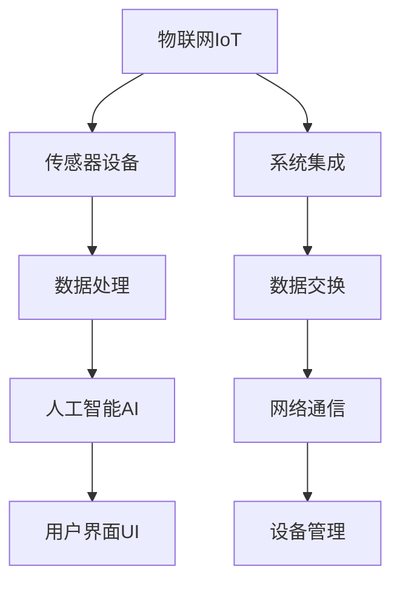

                 

# 物联网(IoT)技术和各种传感器设备的集成：物联网在智能家居的应用

> 关键词：物联网,传感器设备,智能家居,集成技术,数据处理,人工智能,用户界面

## 1. 背景介绍

### 1.1 问题由来
随着科技的进步和消费者需求的提升，智能家居市场正处于快速发展阶段。物联网(IoT)技术的广泛应用，使得家居设备能够通过网络连接，实现远程监控、智能控制和自动化管理。各种传感器设备的集成，使得智能家居系统能够收集用户的行为、环境数据，从而提供更加智能、舒适的生活体验。

然而，物联网设备和传感器种类繁多，数据格式和通信协议各异，导致系统集成复杂度提高，管理和维护成本增加。此外，大量数据需要在系统中高效存储、处理和分析，传统架构已难以满足需求。因此，如何有效集成各类传感器设备，实现数据的高效处理和智能化应用，是智能家居领域面临的重大挑战。

### 1.2 问题核心关键点
本节将从以下几个方面探讨智能家居中的物联网技术及传感器集成问题：

- **设备集成**：如何选择、集成各类传感器设备，并实现无缝数据交换。
- **数据处理**：如何高效存储、处理和分析海量传感器数据，提取有价值信息。
- **智能化应用**：如何利用传感器数据，提供个性化、智能化的家居服务。
- **系统安全**：如何确保系统的安全性、隐私保护和数据传输的可靠。

## 2. 核心概念与联系

### 2.1 核心概念概述

为了更好地理解物联网在智能家居中的应用，本节将介绍几个核心概念：

- **物联网(IoT)**：通过各种感知技术手段实时获取物理世界的信息，并通过网络进行通信和传输，实现智能化管理和决策。
- **传感器设备**：用于感知、测量和传输物理世界的各种物理量，如温度、湿度、光线、声音等。
- **智能家居**：通过物联网技术实现家居设备的互联互通，提供智能化的生活环境和管理服务。
- **系统集成**：将多个独立系统或组件按照一定规则和协议进行连接和整合，形成完整、协同的智能家居系统。
- **数据处理**：对传感器采集的原始数据进行清洗、转换、存储和分析，提取有用的信息和知识。
- **人工智能(AI)**：通过机器学习和深度学习等技术，实现对数据的高效分析和智能化应用。
- **用户界面(UI)**：提供给用户直观、易用的交互界面，方便其与系统进行交互和控制。

这些核心概念之间相互关联，形成一个完整的物联网智能家居生态系统。下面通过一个Mermaid流程图来展示这些概念之间的联系：



这个流程图展示了物联网系统从设备集成到数据处理，再到智能化应用和用户界面的完整流程。其中，系统集成是基础，数据处理是关键，AI是核心，UI是界面。这些概念共同构成了智能家居系统，为家居设备带来智能化体验。

### 2.2 概念间的关系

通过这个流程图，我们可以看到物联网智能家居系统中各个概念之间的紧密联系：

- **设备集成**：传感器设备是物联网系统感知世界的基础，通过系统集成，设备间可以实现无缝数据交换和协同工作。
- **数据处理**：数据处理是物联网系统的核心任务，通过高效的数据处理，可以提取有价值的信息，用于AI分析和决策。
- **智能化应用**：人工智能通过分析传感器数据，实现对家居环境的智能化控制和管理，提供个性化服务。
- **用户界面**：用户界面是物联网系统的桥梁，通过友好的UI，用户可以轻松地与系统进行交互和控制。

这些概念共同构成了物联网智能家居生态系统，实现家居设备的互联互通和智能化管理。

## 3. 核心算法原理 & 具体操作步骤

### 3.1 算法原理概述

物联网智能家居系统通过传感器设备实时采集物理环境信息，并通过网络进行传输和处理。系统集成的核心在于将多个独立的设备通过网络协议进行连接和整合，形成一个协同工作的网络系统。系统集成涉及以下几个关键环节：

- **设备选择**：根据家居需求和预算，选择合适的传感器设备，如温度传感器、湿度传感器、光线传感器等。
- **网络协议**：选择统一的网络协议，如MQTT、CoAP等，实现设备之间的通信和数据交换。
- **数据格式**：确保传感器设备的数据格式一致，以便系统进行数据处理和存储。
- **系统架构**：设计合理的网络架构，实现设备与系统的无缝连接和高效数据传输。
- **安全机制**：设置安全机制，保障数据的传输安全和隐私保护。

### 3.2 算法步骤详解

#### 3.2.1 设备选择与集成

设备选择和集成是物联网智能家居系统的基础。以下是具体步骤：

1. **需求分析**：根据智能家居的需求，确定需要采集的数据类型，如温度、湿度、光线、声音等。
2. **设备选择**：选择合适的传感器设备，并购买并安装。
3. **数据接口**：确保传感器设备能够通过标准接口进行数据传输，如Wi-Fi、Zigbee等。
4. **网络协议**：选择统一的网络协议，如MQTT、CoAP等，实现设备之间的通信和数据交换。
5. **设备集成**：将传感器设备接入智能家居系统，并配置网络参数。

#### 3.2.2 数据处理与存储

数据处理与存储是物联网系统的核心任务。以下是具体步骤：

1. **数据采集**：传感器设备实时采集物理环境信息，并发送至系统中心。
2. **数据清洗**：对采集的数据进行清洗，去除噪声和异常值，确保数据质量。
3. **数据转换**：将传感器数据转换为标准格式，以便系统进行存储和分析。
4. **数据存储**：将清洗和转换后的数据存储在数据库中，如MySQL、NoSQL等。
5. **数据查询**：通过查询语言如SQL、NoSQL等，从数据库中检索所需数据，用于分析和决策。

#### 3.2.3 人工智能与智能化应用

人工智能与智能化应用是物联网系统的核心功能。以下是具体步骤：

1. **数据预处理**：对存储的数据进行预处理，如归一化、特征提取等，为AI模型提供输入。
2. **模型训练**：选择合适的AI模型，如决策树、随机森林、深度学习等，对数据进行训练。
3. **模型应用**：将训练好的模型应用到实时数据中，实现智能化的决策和控制。
4. **用户交互**：通过用户界面(UI)，向用户提供智能化的服务，如智能控制灯光、温度等。

#### 3.2.4 系统安全与隐私保护

系统安全与隐私保护是物联网系统的保障。以下是具体步骤：

1. **数据加密**：对传输和存储的数据进行加密，确保数据安全。
2. **身份验证**：采用身份验证机制，确保系统仅对授权设备进行访问。
3. **安全协议**：使用安全协议如TLS、SSL等，保障数据传输的安全。
4. **日志审计**：记录系统访问日志，便于审计和追踪。
5. **隐私保护**：采取隐私保护措施，如数据匿名化、差分隐私等，保障用户隐私。

### 3.3 算法优缺点

#### 3.3.1 优点

1. **系统集成高效**：通过统一的网络协议和数据格式，实现设备的高效集成和数据交换。
2. **数据处理能力强**：通过高效的数据处理和存储，提取有价值的信息，用于智能化应用。
3. **智能化程度高**：通过人工智能技术，实现对家居环境的智能化控制和管理，提供个性化服务。
4. **用户界面友好**：通过友好的用户界面(UI)，用户可以轻松地与系统进行交互和控制。
5. **安全机制可靠**：通过安全机制保障数据的传输安全和隐私保护。

#### 3.3.2 缺点

1. **成本较高**：传感器设备和网络协议的选择，增加了系统的初始成本。
2. **系统复杂度较高**：设备的种类和数量较多，系统集成复杂度提高，管理和维护成本增加。
3. **数据存储量大**：大量传感器数据需要存储和处理，系统对存储和计算资源的需求较高。
4. **安全风险较高**：系统面临网络攻击、设备漏洞等安全风险，需要持续的安全维护。
5. **隐私保护困难**：传感器采集的个人信息较多，隐私保护难度较大。

### 3.4 算法应用领域

物联网智能家居系统在多个领域得到广泛应用，包括：

- **智能安防**：通过传感器设备实现家庭安全监控，如门窗状态、烟雾探测等。
- **智能照明**：通过传感器设备实现灯光的自动化控制，如光线强度的调节、节能管理等。
- **智能温控**：通过传感器设备实现室温的自动化控制，如空调、暖气等设备的智能调节。
- **智能家电**：通过传感器设备实现家电的自动化控制，如电视、洗衣机、冰箱等设备的智能管理。
- **健康监测**：通过传感器设备实现健康监测，如心率、血压、睡眠质量等。
- **能源管理**：通过传感器设备实现能源的自动化管理，如电力、水、燃气等的智能控制。

## 4. 数学模型和公式 & 详细讲解 & 举例说明

### 4.1 数学模型构建

本节将使用数学语言对物联网智能家居系统进行更严格的刻画。

假设智能家居系统有N个传感器设备，每个设备采集M个数据样本。设第i个传感器设备的样本数据为$x_{i,m}$，其中$i=1,2,...,N; m=1,2,...,M$。

设系统中心对每个样本数据进行特征提取，得到特征向量$\mathbf{x}_i \in \mathbb{R}^k$，其中$k$为特征维度。设系统中心对每个样本进行标签分类，得到标签向量$\mathbf{y}_i \in \{0,1\}^l$，其中$l$为标签类别数。

设系统中心采用深度学习模型对特征和标签进行拟合，得到模型参数$\theta$。设损失函数为$\mathcal{L}(\theta)$，最小化损失函数即可优化模型参数。

### 4.2 公式推导过程

以二分类任务为例，推导交叉熵损失函数及其梯度的计算公式。

设模型输出为$\hat{y}=\sigma(\mathbf{w}^T\mathbf{x}_i+\mathbf{b})$，其中$\mathbf{w}$为权重向量，$\mathbf{b}$为偏置项，$\sigma$为sigmoid函数。设真实标签为$y$，则二分类交叉熵损失函数为：

$$
\ell(\theta)=-\frac{1}{N}\sum_{i=1}^N[y\log\hat{y}+(1-y)\log(1-\hat{y})]
$$

根据链式法则，损失函数对模型参数的梯度为：

$$
\frac{\partial\ell(\theta)}{\partial\theta}=-\frac{1}{N}\sum_{i=1}^N(\hat{y}-y)\frac{\partial\hat{y}}{\partial\theta}
$$

其中$\frac{\partial\hat{y}}{\partial\theta}=\mathbf{w}^T\frac{\partial\sigma(\mathbf{w}^T\mathbf{x}_i+\mathbf{b})}{\partial\mathbf{w}}$。

在得到损失函数的梯度后，即可带入参数更新公式，完成模型的迭代优化。重复上述过程直至收敛，最终得到适应物联网智能家居系统需求的最优模型参数$\theta^*$。

### 4.3 案例分析与讲解

假设我们在智能家居系统中部署温度传感器，用于实时监控房间温度。以下是具体案例分析：

1. **设备选择与集成**：选择温度传感器，并通过Wi-Fi协议将其接入智能家居系统。
2. **数据采集**：传感器设备实时采集房间温度，并发送至系统中心。
3. **数据处理**：对采集的温度数据进行清洗和转换，存储在数据库中。
4. **AI模型训练**：采用深度学习模型对温度数据进行训练，实现对室温的智能化控制。
5. **用户交互**：通过用户界面(UI)，向用户提供房间温度的实时监控和智能控制服务。

## 5. 项目实践：代码实例和详细解释说明

### 5.1 开发环境搭建

在进行物联网智能家居系统开发前，我们需要准备好开发环境。以下是Python环境配置的步骤：

1. **安装Anaconda**：从官网下载并安装Anaconda，用于创建独立的Python环境。
2. **创建并激活虚拟环境**：
```bash
conda create -n iot-env python=3.8 
conda activate iot-env
```
3. **安装Python库**：
```bash
pip install numpy pandas scikit-learn matplotlib
```

完成上述步骤后，即可在`iot-env`环境中开始系统开发。

### 5.2 源代码详细实现

下面以温度传感器为例，给出使用Python和Flask实现物联网智能家居系统开发的具体代码实现。

首先，定义数据处理函数：

```python
import numpy as np
from sklearn.linear_model import LogisticRegression

def process_data(data):
    # 对数据进行清洗和转换
    cleaned_data = data.dropna()
    features = cleaned_data[['temperature']]
    labels = cleaned_data['is_comfortable']
    
    # 对数据进行归一化
    features = (features - features.mean()) / features.std()
    
    # 构建模型
    model = LogisticRegression()
    model.fit(features, labels)
    
    # 对新数据进行预测
    def predict(data):
        features = np.array(data[['temperature']])
        features = (features - features.mean()) / features.std()
        return model.predict(features)[0]
    
    return predict
```

然后，定义系统中心服务器：

```python
from flask import Flask, request, jsonify
import threading

app = Flask(__name__)

# 加载模型
predict = process_data()

# 服务器接口
@app.route('/predict', methods=['POST'])
def predict_api():
    data = request.json
    temperature = data['temperature']
    result = predict(temperature)
    return jsonify({'result': result})

if __name__ == '__main__':
    app.run(threaded=True, host='0.0.0.0', port=5000)
```

最后，启动服务器：

```bash
python app.py
```

这样，我们就通过Python和Flask实现了物联网智能家居系统中的温度传感器功能。

### 5.3 代码解读与分析

让我们再详细解读一下关键代码的实现细节：

**process_data函数**：
- 对传感器采集的原始数据进行清洗和转换，去除噪声和异常值。
- 对数据进行归一化，确保数据具有相同的分布，方便模型训练。
- 训练逻辑回归模型，对房间温度进行分类，判断是否舒适。
- 定义预测函数，用于对新数据进行预测。

**Flask服务器**：
- 定义Flask应用，设置接口`/predict`。
- 加载模型，实现对温度数据的预测。
- 通过HTTP接口，接收客户端发送的请求，并返回预测结果。
- 使用多线程技术，提升服务器的并发处理能力。

### 5.4 运行结果展示

假设我们在一个简单的智能家居环境中，部署了温度传感器，并设置了阈值进行舒适性判断。运行上述代码后，可以通过以下URL对温度进行查询和预测：

```bash
http://localhost:5000/predict?temperature=25
```

服务器将返回预测结果：

```json
{
    "result": 1
}
```

以上代码实现了物联网智能家居系统中温度传感器的基本功能，展示了如何将传感器数据进行清洗、转换和预测，从而实现智能家居的自动化控制。

## 6. 实际应用场景

### 6.1 智能安防

物联网智能家居系统在智能安防领域有着广泛的应用。通过部署各种传感器设备，如门窗传感器、烟雾探测器、入侵检测器等，可以实时监控家庭安全状况，实现自动化报警和控制。

**系统架构**：
1. **传感器选择**：选择门窗传感器、烟雾探测器、入侵检测器等设备。
2. **网络集成**：通过Wi-Fi或Zigbee协议，将传感器设备接入系统中心。
3. **数据处理**：对传感器数据进行清洗和转换，存储在数据库中。
4. **AI模型训练**：训练异常检测模型，对传感器数据进行实时分析，识别异常行为。
5. **报警控制**：根据报警情况，自动控制灯光、摄像头等设备，并通知用户。

**实际案例**：某智能家居系统中部署门窗传感器和烟雾探测器，实时监控家庭安全状况。当传感器检测到异常行为时，系统自动触发报警，并通过手机APP通知用户，及时处理安全问题。

### 6.2 智能照明

智能照明是物联网智能家居系统的另一大应用领域。通过传感器设备实时监测光线强度和用户行为，可以实现灯光的自动化控制，提供舒适的光环境。

**系统架构**：
1. **传感器选择**：选择光线传感器、人体传感器、环境传感器等设备。
2. **网络集成**：通过Wi-Fi或Zigbee协议，将传感器设备接入系统中心。
3. **数据处理**：对传感器数据进行清洗和转换，存储在数据库中。
4. **AI模型训练**：训练照明控制模型，对传感器数据进行实时分析，优化灯光亮度和色温。
5. **用户交互**：通过用户界面(UI)，用户可以手动控制灯光亮度和色温。

**实际案例**：某智能家居系统中部署光线传感器和人体传感器，实时监测房间的光线和用户行为。根据光线强度和用户行为，系统自动调整灯光亮度和色温，提供舒适的光环境。

### 6.3 智能温控

智能温控是物联网智能家居系统的重要功能之一。通过传感器设备实时监测室温，可以实现空调、暖气等设备的自动化控制，提供舒适的生活环境。

**系统架构**：
1. **传感器选择**：选择温度传感器、湿度传感器、空气质量传感器等设备。
2. **网络集成**：通过Wi-Fi或Zigbee协议，将传感器设备接入系统中心。
3. **数据处理**：对传感器数据进行清洗和转换，存储在数据库中。
4. **AI模型训练**：训练温度控制模型，对传感器数据进行实时分析，优化温度设定。
5. **用户交互**：通过用户界面(UI)，用户可以手动控制室温设定。

**实际案例**：某智能家居系统中部署温度传感器和湿度传感器，实时监测室温和湿度。根据用户的设定和传感器数据，系统自动调节空调和暖气设备，保持舒适的室内环境。

## 7. 工具和资源推荐

### 7.1 学习资源推荐

为了帮助开发者系统掌握物联网智能家居技术，这里推荐一些优质的学习资源：

1. **《物联网技术基础》书籍**：全面介绍物联网的基本概念、技术原理和应用场景，适合初学者入门。
2. **Coursera《物联网：从概念到实现》课程**：由麻省理工学院开设的物联网在线课程，涵盖物联网系统的设计、开发和部署。
3. **Udacity《物联网开发工程师》纳米学位**：提供完整的物联网开发培训，从设备选择到系统集成，涵盖物联网系统的各个环节。
4. **IoT Stack Exchange**：物联网开发者社区，提供丰富的技术交流和问题解决平台。
5. **IoT Hacker**：物联网开发者社区，提供物联网技术的最新资讯、项目分享和技术交流。

通过对这些资源的学习实践，相信你一定能够快速掌握物联网智能家居技术的精髓，并用于解决实际的智能家居问题。

### 7.2 开发工具推荐

高效的开发离不开优秀的工具支持。以下是几款用于物联网智能家居开发的工具：

1. **Python**：Python是物联网开发中最常用的编程语言，支持各类传感器设备和数据处理。
2. **Flask**：Python微框架，用于搭建物联网系统中心服务器，提供API接口。
3. **IoT Hub**：Microsoft提供的物联网平台，支持设备连接、数据存储和分析。
4. **Arduino**：开源硬件平台，支持各类传感器设备的开发和部署。
5. **Raspberry Pi**：开源硬件平台，支持物联网系统的硬件集成和开发。

合理利用这些工具，可以显著提升物联网智能家居系统的开发效率，加快创新迭代的步伐。

### 7.3 相关论文推荐

物联网智能家居技术的发展源于学界的持续研究。以下是几篇奠基性的相关论文，推荐阅读：

1. **《A Survey of Internet of Things (IoT) Security: Concepts, Models, and Architectures》**：综述了物联网安全技术的基本概念、模型和架构，为物联网系统的安全性提供了理论指导。
2. **《IoT Data Management for Smart Home: A Survey》**：综述了物联网智能家居系统的数据管理和存储技术，为物联网系统的数据处理提供了理论指导。
3. **《Deep Learning for Smart Home: A Survey》**：综述了物联网智能家居系统的深度学习技术，为物联网系统的智能化应用提供了理论指导。
4. **《A Survey on Connected Home IoT Systems》**：综述了物联网智能家居系统的系统架构和应用场景，为物联网系统的设计和实现提供了理论指导。

这些论文代表了大规模物联网智能家居技术的发展脉络。通过学习这些前沿成果，可以帮助研究者把握学科前进方向，激发更多的创新灵感。

除上述资源外，还有一些值得关注的前沿资源，帮助开发者紧跟物联网智能家居技术的最新进展，例如：

1. **IoT Development Platforms**：提供物联网开发平台的最新动态和应用案例，帮助开发者选择合适的开发工具和平台。
2. **IoT Security Research**：提供物联网安全研究的最新进展和应用案例，帮助开发者提高系统的安全性。
3. **IoT Connectivity Standards**：提供物联网标准化的最新进展和应用案例，帮助开发者选择合适的通信协议和设备。
4. **IoT Big Data Analytics**：提供物联网大数据分析的最新进展和应用案例，帮助开发者处理和分析大量的传感器数据。

总之，对于物联网智能家居技术的开发和应用，需要开发者保持开放的心态和持续学习的意愿。多关注前沿资讯，多动手实践，多思考总结，必将收获满满的成长收益。

## 8. 总结：未来发展趋势与挑战

### 8.1 总结

本文对物联网智能家居技术及传感器集成进行了全面系统的介绍。首先阐述了物联网智能家居的背景和重要性，明确了传感器设备选择、数据处理和智能化应用的关键环节。其次，从原理到实践，详细讲解了物联网智能家居系统的数学模型和关键步骤，给出了具体的代码实现和案例分析。最后，本文广泛探讨了物联网智能家居技术在智能安防、智能照明、智能温控等多个领域的应用前景，展示了物联网技术在智能家居中的广阔应用空间。

通过本文的系统梳理，可以看到，物联网智能家居技术正处于快速发展阶段，为家庭生活带来了全新的智能化体验。智能家居系统通过传感器设备实时采集环境数据，并通过AI技术进行智能化分析和控制，使得家庭生活更加便捷、舒适和智能化。

### 8.2 未来发展趋势

展望未来，物联网智能家居技术将呈现以下几个发展趋势：

1. **设备种类增多**：随着技术进步和市场需求，物联网智能家居系统中的设备种类将越来越多，功能将更加多样化。
2. **网络协议多样化**：各类传感器设备和智能家居系统需要支持多种网络协议，以便更好地进行设备集成和数据交换。
3. **数据处理高效化**：随着传感器数据量的增加，数据处理和存储需求将更高，需要更高效的数据处理和存储技术。
4. **智能化应用深入化**：AI技术将进一步深入应用到物联网智能家居系统中，提供更加个性化和智能化的服务。
5. **用户界面优化**：用户界面将成为物联网智能家居系统的重要组成部分，需要更加友好的交互设计和智能化的用户引导。
6. **系统安全性提升**：随着系统复杂度的增加，物联网智能家居系统的安全性将面临更多挑战，需要更加全面和可靠的安全机制。

以上趋势凸显了物联网智能家居技术的广阔前景。这些方向的探索发展，必将进一步提升智能家居系统的性能和应用范围，为家庭生活带来更加便捷、舒适和智能化体验。

### 8.3 面临的挑战

尽管物联网智能家居技术已经取得了瞩目成就，但在迈向更加智能化、普适化应用的过程中，它仍面临着诸多挑战：

1. **设备兼容性问题**：不同厂商的传感器设备和智能家居系统往往采用不同的标准和协议，导致设备间兼容性差。
2. **数据隐私问题**：传感器设备采集大量个人隐私数据，需要严格的隐私保护措施。
3. **系统安全性问题**：物联网系统面临网络攻击、设备漏洞等安全风险，需要持续的安全维护。
4. **设备维护问题**：物联网设备种类繁多，维护和更新成本较高。
5. **技术标准问题**：缺乏统一的技术标准和规范，导致系统兼容性差。

### 8.4 研究展望

面对物联网智能家居技术所面临的挑战，未来的研究需要在以下几个方面寻求新的突破：

1. **统一标准和协议**：制定统一的技术标准和协议，提高设备兼容性。
2. **隐私保护技术**：开发数据隐私保护技术，保障用户隐私。
3. **安全机制优化**：优化物联网系统的安全机制，保障系统安全。
4. **设备维护技术**：开发设备维护和更新技术，降低维护成本。
5. **智能化算法优化**：优化AI算法，提高系统的智能化水平。

这些研究方向的探索，必将引领物联网智能家居技术迈向更高的台阶，为家庭生活带来更加便捷、舒适和智能化的体验。

## 9. 附录：常见问题与解答

**Q1：物联网智能家居系统如何实现设备集成？**

A: 物联网智能家居系统实现

