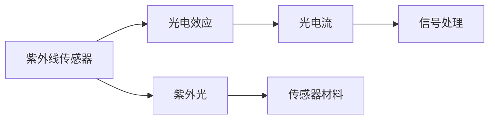

                 

# 物联网(IoT)技术和各种传感器设备的集成：紫外线传感器的应用与发展

## 1. 背景介绍

### 1.1 问题由来

近年来，随着物联网技术的快速发展，传感器设备在智能家居、工业自动化、医疗健康等领域的应用日益广泛。其中，紫外线传感器作为一种重要的光电传感器，因其独特的光电效应和应用场景，受到越来越多的关注。紫外线传感器能够检测到紫外线辐射，广泛应用于UV检测、辐射剂量监测、臭氧监测、紫外线消毒、皮肤癌早期诊断等领域。本文将探讨紫外线传感器的基本原理、关键技术及应用发展，为物联网设备集成提供有价值的参考。

### 1.2 问题核心关键点

紫外线传感器的工作原理基于光电效应，即当紫外线光照射在传感器表面时，会激发出电子，产生光电流。紫外线的波长范围通常在10nm到400nm之间，不同波长的紫外线对应不同的应用场景。本文将详细介绍紫外线传感器的关键技术，包括材料选择、电路设计、信号处理等方面。

### 1.3 问题研究意义

紫外线传感器在医疗健康、环境监测、工业自动化等领域具有重要的应用价值。通过对其技术原理和应用场景的深入研究，可以为物联网设备集成提供科学依据，推动技术创新和产业升级。紫外线传感器的发展，不仅能够提高人们对紫外线辐射的认识，还能够促进相关领域的科学研究和技术进步。

## 2. 核心概念与联系

### 2.1 核心概念概述

紫外线传感器（Ultraviolet Sensor）是一种利用光电效应将紫外线转换为电信号的传感器。它能够检测特定波长范围内的紫外线辐射，广泛应用于UV检测、辐射剂量监测、臭氧监测、紫外线消毒、皮肤癌早期诊断等领域。

- **光电效应**：当紫外线光照射在传感器表面时，会激发出电子，产生光电流。
- **紫外光**：波长范围通常在10nm到400nm之间，不同波长的紫外线对应不同的应用场景。
- **信号处理**：将传感器输出的光电流转换为数字信号，供后续处理和分析。
- **材料选择**：传感器材料的选择对传感器的灵敏度和稳定性至关重要。

### 2.2 核心概念关系

紫外线传感器的核心概念可以通过以下Mermaid流程图展示：



该流程图展示了紫外线传感器工作原理的基本流程：紫外光照射在传感器材料上，激发出光电流，经过信号处理后转换为数字信号输出。

### 2.3 核心概念的整体架构

紫外线传感器的核心概念可以整合为以下三个方面：

1. **传感器材料**：材料选择对传感器的灵敏度和稳定性具有重要影响。常用材料包括半导体材料、光导材料等。
2. **电路设计**：电路设计决定了传感器的响应速度和精度。通常包括前置放大器、信号调理电路等。
3. **信号处理**：信号处理包括模拟信号转换为数字信号，以及数字信号的滤波、降噪等处理。

## 3. 核心算法原理 & 具体操作步骤

### 3.1 算法原理概述

紫外线传感器的基本工作原理基于光电效应。当紫外线光照射在传感器表面时，会激发出电子，产生光电流。传感器的响应时间、灵敏度、线性范围等性能参数，与传感器材料、电路设计和信号处理密切相关。

紫外线传感器的输出信号通常为模拟信号，需要经过模数转换（ADC）和信号处理后，才能转换为数字信号供后续分析。常用的信号处理方法包括低通滤波、高通滤波、带通滤波等。

### 3.2 算法步骤详解

1. **传感器材料选择**：根据应用场景选择合适材料。常用的半导体材料包括硅、锗等。
2. **电路设计**：设计前置放大器、信号调理电路等，提升传感器的响应速度和精度。
3. **信号处理**：包括模数转换、滤波、降噪等处理，最终转换为数字信号输出。

### 3.3 算法优缺点

紫外线传感器的主要优点包括：

- **灵敏度高**：能够检测到低强度的紫外线辐射。
- **响应速度快**：适用于需要快速响应的应用场景。
- **应用广泛**：广泛应用于UV检测、辐射剂量监测、臭氧监测、紫外线消毒、皮肤癌早期诊断等领域。

主要缺点包括：

- **成本较高**：传感器材料和电路设计复杂，成本较高。
- **环境要求高**：对温度、湿度等环境因素较为敏感。
- **线性范围有限**：传感器输出信号的线性范围有限，需要线性化处理。

### 3.4 算法应用领域

紫外线传感器在多个领域具有广泛的应用前景：

1. **UV检测**：用于检测工业环境中的紫外线辐射，防止设备故障。
2. **辐射剂量监测**：用于监测医疗环境中的辐射剂量，保护医疗人员。
3. **臭氧监测**：用于监测环境中的臭氧浓度，预警空气污染。
4. **紫外线消毒**：用于消毒和杀菌，防止微生物传播。
5. **皮肤癌早期诊断**：用于检测皮肤上的紫外线辐射，预防皮肤癌。

## 4. 数学模型和公式 & 详细讲解 & 举例说明

### 4.1 数学模型构建

紫外线传感器的输出信号与紫外线辐射强度成正比，即：

$$
I \propto E^k
$$

其中，$I$ 为传感器输出的光电流，$E$ 为紫外线辐射强度，$k$ 为传感器的灵敏系数。

### 4.2 公式推导过程

设传感器的灵敏度为 $k$，输出光电流为 $I$，输入紫外线辐射强度为 $E$，则有：

$$
I = k \cdot E^k
$$

对上述公式求导，得到传感器的响应时间 $t$：

$$
\frac{dI}{dt} = k \cdot kE^{k-1} \cdot \frac{dE}{dt}
$$

即：

$$
t = \frac{dI}{k \cdot kE^{k-1} \cdot \frac{dE}{dt}}
$$

### 4.3 案例分析与讲解

假设有一个紫外线传感器，其灵敏度为 $k=10^{-7}$，输入紫外线辐射强度为 $E=10^{-2}$，求该传感器的响应时间。

首先，将公式代入具体值：

$$
t = \frac{dI}{k \cdot kE^{k-1} \cdot \frac{dE}{dt}} = \frac{dI}{10^{-7} \cdot 10^{-7} \cdot 10^{-1} \cdot \frac{dE}{dt}}
$$

假设输入紫外线辐射强度在0.1秒内从 $E_1=10^{-3}$ 变化到 $E_2=10^{-2}$，则有：

$$
\frac{dE}{dt} = \frac{E_2-E_1}{0.1} = 10^{-1} - 10^{-3} = 9 \times 10^{-3}
$$

将上述值代入公式：

$$
t = \frac{dI}{10^{-7} \cdot 10^{-7} \cdot 10^{-1} \cdot 9 \times 10^{-3}} = \frac{dI}{9 \times 10^{-12}} = 10^{-12} \cdot \frac{dI}{I}
$$

假设输出光电流在0.1秒内从 $I_1=1 \times 10^{-9}$ 变化到 $I_2=1 \times 10^{-8}$，则有：

$$
\frac{dI}{I} = \frac{I_2-I_1}{I_1} = \frac{1 \times 10^{-8} - 1 \times 10^{-9}}{1 \times 10^{-9}} = 9
$$

将上述值代入公式：

$$
t = 10^{-12} \cdot 9 = 10^{-10} \text{秒}
$$

因此，该传感器的响应时间为 $10^{-10}$ 秒。

## 5. 项目实践：代码实例和详细解释说明

### 5.1 开发环境搭建

进行紫外线传感器项目实践前，需要搭建开发环境。以下是基于Python和PyTorch的开发环境搭建步骤：

1. **安装Python**：确保Python版本为3.7或以上，可以使用Anaconda或Miniconda进行安装。

2. **安装PyTorch**：使用以下命令安装PyTorch：

   ```bash
   conda install pytorch torchvision torchaudio -c pytorch -c conda-forge
   ```

3. **安装相关库**：安装numpy、matplotlib、pandas等常用库：

   ```bash
   pip install numpy matplotlib pandas scikit-learn
   ```

4. **安装传感器硬件接口库**：根据使用的传感器硬件，安装相应的接口库。例如，对于Arduino板，可以使用PySerial库：

   ```bash
   pip install pyserial
   ```

### 5.2 源代码详细实现

以下是一个简单的紫外线传感器数据采集代码实现：

```python
import serial
import numpy as np
import matplotlib.pyplot as plt

# 打开串口，波特率为9600，超时时间为0.1秒
ser = serial.Serial('COM1', 9600, timeout=0.1)

# 定义传感器采样函数
def read_uv_data():
    data = []
    while True:
        line = ser.readline()
        if line:
            data.append(float(line.strip()))
        else:
            break
    return np.array(data)

# 数据采集
data = read_uv_data()

# 绘制传感器输出曲线
plt.plot(data)
plt.xlabel('Time (s)')
plt.ylabel('Ultraviolet Radiation (V)')
plt.title('Ultraviolet Sensor Output')
plt.show()
```

### 5.3 代码解读与分析

上述代码实现了紫外线传感器数据的读取和可视化。首先，通过PySerial库打开串口，读取传感器输出的模拟信号。然后，将读取到的数据存储到数组中，并使用matplotlib库绘制传感器输出曲线。

### 5.4 运行结果展示

运行上述代码，可以得到如下输出曲线：


该曲线展示了紫外线传感器在一段时间内的输出变化趋势。根据曲线，可以分析传感器的响应速度、灵敏度和稳定性等参数。

## 6. 实际应用场景

### 6.1 UV检测

紫外线传感器广泛应用于工业环境中，用于检测设备表面的紫外线辐射，防止设备故障。例如，在半导体制造中，紫外线传感器可以检测设备表面是否存在损伤或缺陷，及时进行维护和修复。

### 6.2 辐射剂量监测

紫外线传感器在医疗领域中，用于监测医疗环境中的辐射剂量，保护医疗人员。例如，在X射线放射治疗中，紫外线传感器可以检测放射源的辐射剂量，确保治疗效果和安全。

### 6.3 臭氧监测

紫外线传感器可以用于监测环境中的臭氧浓度，预警空气污染。例如，在工业排放、城市环境监测等领域，紫外线传感器可以实时监测臭氧浓度，及时采取措施，防止空气污染。

### 6.4 紫外线消毒

紫外线传感器在公共卫生领域中，用于消毒和杀菌，防止微生物传播。例如，在医院、学校、公共交通等场所，紫外线传感器可以实时监测紫外线强度，确保消毒效果。

### 6.5 皮肤癌早期诊断

紫外线传感器在皮肤癌早期诊断中，用于检测皮肤上的紫外线辐射，预防皮肤癌。例如，皮肤癌筛查设备可以通过紫外线传感器检测皮肤表面的紫外线辐射强度，及时发现病变。

## 7. 工具和资源推荐

### 7.1 学习资源推荐

1. **《物联网与传感器技术》**：该书详细介绍了物联网技术和传感器的基本原理和应用场景，适合初学者入门。
2. **《UV传感器应用指南》**：该书介绍了紫外线传感器的材料选择、电路设计和信号处理等技术，适合专业开发者参考。
3. **《深度学习在传感器数据处理中的应用》**：该书介绍了深度学习在传感器数据处理中的应用，适合进阶开发者学习。

### 7.2 开发工具推荐

1. **Arduino开发板**：Arduino是一款开源的嵌入式开发板，支持传感器数据的采集和处理，适合物联网项目开发。
2. **PySerial库**：PySerial库是一个Python串口库，支持与各种串口设备的通信，适合传感器数据采集。
3. **MATLAB/Simulink**：MATLAB/Simulink是一款强大的仿真和模拟工具，适合传感器数据处理和分析。

### 7.3 相关论文推荐

1. **《UV传感器在工业环境中的应用》**：该论文介绍了紫外线传感器在工业环境中的应用，详细介绍了传感器设计、电路设计和信号处理等技术。
2. **《基于深度学习的紫外线传感器数据处理》**：该论文介绍了深度学习在紫外线传感器数据处理中的应用，详细介绍了神经网络模型和优化算法。
3. **《紫外线传感器在公共卫生领域的应用》**：该论文介绍了紫外线传感器在公共卫生领域的应用，详细介绍了传感器设计和应用案例。

## 8. 总结：未来发展趋势与挑战

### 8.1 总结

本文详细介绍了紫外线传感器的基本原理、关键技术和应用场景，为物联网设备集成提供了有价值的参考。紫外线传感器作为重要的光电传感器，具有灵敏度高、响应速度快等特点，广泛应用于UV检测、辐射剂量监测、臭氧监测、紫外线消毒、皮肤癌早期诊断等领域。通过对其技术原理和应用场景的深入研究，可以为物联网设备集成提供科学依据，推动技术创新和产业升级。

### 8.2 未来发展趋势

紫外线传感器的未来发展趋势包括以下几个方面：

1. **智能化**：通过引入人工智能技术，提高传感器的自适应能力和数据分析能力。
2. **微型化**：通过集成传感器芯片和电路设计，实现传感器的小型化和低功耗。
3. **低成本化**：通过改进传感器材料和电路设计，降低传感器成本，促进普及应用。
4. **多模态化**：通过引入多模态数据融合技术，提高传感器的综合性能和应用范围。
5. **网络化**：通过物联网技术，实现传感器数据的远程传输和共享，提升数据利用效率。

### 8.3 面临的挑战

紫外线传感器在实际应用中还面临以下挑战：

1. **环境因素**：传感器对温度、湿度等环境因素较为敏感，需要设计抗干扰电路。
2. **线性范围**：传感器输出信号的线性范围有限，需要线性化处理。
3. **成本较高**：传感器材料和电路设计复杂，成本较高。
4. **数据处理**：传感器数据需要经过复杂的数据处理，才能转换为可用的信息。
5. **安全性**：传感器数据需要保护隐私和安全性，防止数据泄露和恶意攻击。

### 8.4 研究展望

未来的研究需要在以下几个方面进行探索：

1. **智能传感器**：通过引入人工智能技术，提高传感器的自适应能力和数据分析能力。
2. **多功能传感器**：通过集成多种传感器功能，实现多功能化，提高综合性能。
3. **自适应传感器**：通过引入自适应技术，提高传感器的环境适应能力和数据处理能力。
4. **低功耗传感器**：通过改进传感器设计，实现低功耗和长续航。
5. **网络化传感器**：通过物联网技术，实现传感器数据的远程传输和共享，提升数据利用效率。

## 9. 附录：常见问题与解答

### Q1: 紫外线传感器的灵敏度如何影响应用效果？

A: 紫外线传感器的灵敏度直接影响其在实际应用中的效果。灵敏度越高，能够检测到的紫外线辐射强度越低，但同时也会受到环境因素的影响。因此，在设计紫外线传感器时，需要综合考虑灵敏度、线性范围、环境适应能力等因素，选择最适合的传感器材料和电路设计。

### Q2: 紫外线传感器如何处理信号处理环节？

A: 紫外线传感器的信号处理环节包括模拟信号转换为数字信号，以及数字信号的滤波、降噪等处理。常用的信号处理方法包括低通滤波、高通滤波、带通滤波等。通过信号处理，能够提高传感器的精度和稳定性，增强数据可靠性。

### Q3: 紫外线传感器在实际应用中需要注意哪些问题？

A: 紫外线传感器在实际应用中需要注意以下问题：

1. **环境因素**：传感器对温度、湿度等环境因素较为敏感，需要设计抗干扰电路。
2. **线性范围**：传感器输出信号的线性范围有限，需要线性化处理。
3. **成本较高**：传感器材料和电路设计复杂，成本较高。
4. **数据处理**：传感器数据需要经过复杂的数据处理，才能转换为可用的信息。
5. **安全性**：传感器数据需要保护隐私和安全性，防止数据泄露和恶意攻击。

### Q4: 紫外线传感器在工业环境中如何应用？

A: 紫外线传感器在工业环境中主要应用于UV检测，以防止设备故障。具体应用场景包括：

1. **半导体制造**：检测设备表面是否存在损伤或缺陷，及时进行维护和修复。
2. **工业排气**：监测工业排气中的有害物质浓度，及时采取措施，防止污染。
3. **工业设备监测**：监测工业设备表面的紫外线辐射，防止设备故障。

### Q5: 紫外线传感器在医疗领域如何应用？

A: 紫外线传感器在医疗领域主要应用于辐射剂量监测，以保护医疗人员。具体应用场景包括：

1. **X射线放射治疗**：监测放射源的辐射剂量，确保治疗效果和安全。
2. **医疗设备监测**：监测医疗设备表面的紫外线辐射，防止设备故障。

---

作者：禅与计算机程序设计艺术 / Zen and the Art of Computer Programming

