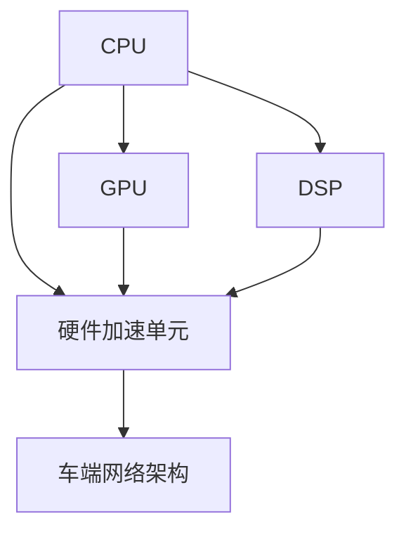
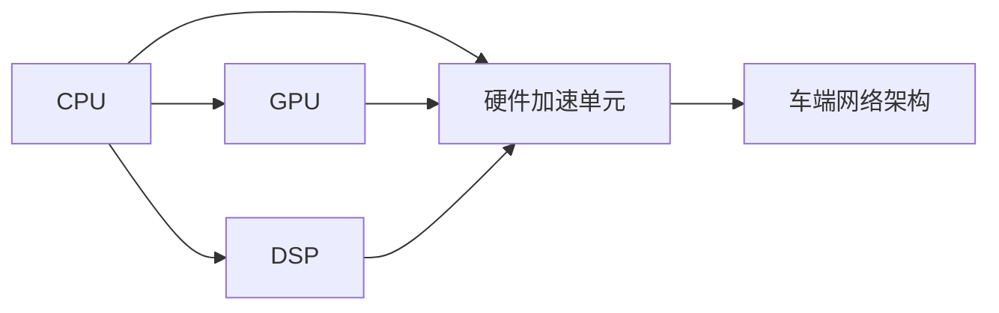

                 

## 1. 背景介绍

特斯拉的全自动驾驶系统（Fully Self-Driving, FSD）作为当今市场上最为先进的自动驾驶系统之一，其背后基于强大的车端算力架构和前沿的自动驾驶算法。特别是在最新的FSD V12版本中，特斯拉进一步提升了车端算力的性能，为其自动驾驶功能和体验提供了坚实的基础。本文将深入分析特斯拉FSD V12的车端算力使用情况，从算力配置、硬件架构、软件设计等多个方面入手，详细探讨其核心特点和应用价值。

### 1.1 自动驾驶系统的发展背景

自动驾驶技术的进步，得益于多方面的科研和工程突破，包括传感器融合、环境感知、路径规划、决策控制等关键技术的不断迭代和优化。特斯拉自2010年以来，依托于“能力硬件”和“能力软件”的双轮驱动，不断提升其自动驾驶系统的性能。其中，能力硬件即指特斯拉所搭载的高性能计算平台，包括处理器、GPU、FPGA等芯片；能力软件则是指算法模块和系统框架。特斯拉自2014年推出Autopilot以来，不断迭代和升级其自动驾驶算法，目前已发展至FSD V12阶段，标志着特斯拉自动驾驶技术的进一步成熟和全面升级。

### 1.2 FSD V12的核心特点

特斯拉在FSD V12版本中，不仅引入了更高性能的传感器（如8个摄像头、12个超声波传感器和6个激光雷达），还采用了全新的车端算力架构。具体来说，FSD V12版本主要在以下几个方面做出了突破：

- **高性能计算平台**：搭载了高性能的计算单元，包括中央处理单元(CPU)、图形处理器(GPU)、数字信号处理器(DSP)等。
- **车端网络架构**：通过自主研发的网络架构和协议，提高了数据传输效率和稳定性。
- **硬件加速单元**：引入了专用的硬件加速单元，如NVIDIA Drive PX2平台，用于图像处理、感知和决策。

这些核心特点，使得FSD V12不仅在硬件性能上得到显著提升，而且在软件应用上能够支撑更复杂的自动驾驶功能。

## 2. 核心概念与联系

### 2.1 核心概念概述

为更好地理解特斯拉FSD V12的车端算力使用情况，本节将介绍几个关键的概念：

- **中央处理单元(CPU)**：是计算平台的核心组成部分，负责处理数据和执行算法。
- **图形处理器(GPU)**：专门用于并行计算，支持深度学习和图像处理等高性能任务。
- **数字信号处理器(DSP)**：主要用于信号处理和控制，负责实时响应传感器数据。
- **硬件加速单元**：如NVIDIA Drive PX2，用于优化特定类型任务的硬件性能，如图像处理和深度学习推理。
- **车端网络架构**：通过设计高效的网络拓扑和通信协议，优化数据传输和处理。

这些概念之间通过车端计算架构相联系，共同支撑特斯拉FSD V12的车端算力使用。以下Mermaid流程图展示了这些核心概念之间的关系：



该流程图展示了CPU、GPU、DSP和硬件加速单元等计算资源之间的协同关系，以及车端网络架构在其中扮演的关键作用。

### 2.2 概念间的关系

这些核心概念之间存在密切的关系，通过车端计算架构进行整合。以下Mermaid流程图展示了这些概念之间的具体联系：



该流程图详细描绘了每个计算资源与车端网络架构之间的连接关系，以及车端网络架构如何在计算资源间高效传输和处理数据。

## 3. 核心算法原理 & 具体操作步骤
### 3.1 算法原理概述

特斯拉FSD V12的车端算力使用情况，涉及多个核心算法和计算过程。主要包括传感器数据处理、环境感知、路径规划和决策控制等方面。

**传感器数据处理**：传感器数据包括摄像头、超声波、激光雷达等，需要通过车端硬件和软件进行预处理和转换，提取出关键特征。

**环境感知**：通过感知算法，如视觉SLAM、点云SLAM等，将传感器数据融合为三维环境模型，并进行实时更新。

**路径规划**：根据环境感知结果，结合车辆状态和交通规则，生成行驶路径。

**决策控制**：将路径规划结果转化为具体的车辆操作指令，如加速、刹车、转向等。

这些算法和计算过程，均需要依托于车端算力架构的支持，确保数据传输和处理的及时性和准确性。

### 3.2 算法步骤详解

以下是特斯拉FSD V12车端算力使用的详细操作步骤：

**Step 1: 传感器数据采集**

传感器数据采集是自动驾驶的第一步，涉及到摄像头、超声波、激光雷达等多个传感器。特斯拉在FSD V12版本中，使用了8个摄像头、12个超声波传感器和6个激光雷达，共计24个传感器，每秒钟采集数据超过5TB，用于构建高精度的环境模型。

**Step 2: 数据预处理和特征提取**

数据预处理包括去噪、校正、滤波等操作，确保传感器数据的准确性。特征提取则涉及图像处理、信号处理等多个领域，如通过卷积神经网络(CNN)提取图像特征，通过傅里叶变换提取信号特征等。

**Step 3: 环境感知和路径规划**

在数据预处理的基础上，通过深度学习算法进行环境感知，如使用YOLOv4进行目标检测，使用Transformer进行语义分割等。路径规划则通过A*算法、D*算法等进行，确保车辆在最优路径上行驶。

**Step 4: 决策控制和实时渲染**

决策控制根据环境感知和路径规划结果，生成具体的车辆操作指令。实时渲染则将路径和环境信息可视化，供驾驶员参考。

**Step 5: 反馈和迭代**

通过方向盘反馈、屏幕反馈等，对驾驶操作进行实时监控和调整。同时，通过迭代优化算法，不断提高系统的性能和稳定性。

### 3.3 算法优缺点

特斯拉FSD V12的车端算力使用，具备以下优点：

- **高性能计算平台**：具备强大的计算能力和并行处理能力，支持复杂的深度学习和图像处理任务。
- **硬件加速单元**：通过硬件加速，提高了计算效率，减少了软件延迟。
- **车端网络架构**：通过高效的网络传输和处理，确保数据实时性和稳定性。

同时，也存在一些缺点：

- **高成本**：高性能计算平台和硬件加速单元，以及相应设备的维护和升级，需要较高的投入。
- **能耗问题**：大规模计算和高频率操作，使得车端能耗较高，需要有效的能耗管理。
- **软件复杂性**：算法复杂度高，需要精细的软件设计和优化。

### 3.4 算法应用领域

特斯拉FSD V12的车端算力架构，主要应用于以下领域：

- **自动驾驶**：通过高精度传感器数据处理、环境感知、路径规划和决策控制，实现全自动驾驶功能。
- **智能辅助驾驶**：通过摄像头、雷达、超声波等传感器数据，提供安全辅助驾驶功能。
- **自动泊车**：通过环境感知和路径规划，实现自动泊车功能。
- **车载娱乐**：通过GPU支持，实现高清视频和音频处理，提升车载娱乐体验。

这些应用领域展示了特斯拉FSD V12车端算力架构的强大功能和广泛应用前景。

## 4. 数学模型和公式 & 详细讲解 & 举例说明

### 4.1 数学模型构建

特斯拉FSD V12的车端算力使用，涉及多个数学模型和算法。以下是一些关键模型和公式的构建：

**环境感知模型**：特斯拉使用YOLOv4作为目标检测模型，模型结构为Darknet-53。其目标检测损失函数为交叉熵损失：

$$
L_{obj} = -\frac{1}{N}\sum_{i=1}^N [y_{i}^{x} * \log(y_{i}^{x}) + (1 - y_{i}^{x}) * \log(1 - y_{i}^{x})]
$$

其中 $y_{i}^{x}$ 表示预测结果为类别 $i$ 的概率。

**路径规划模型**：特斯拉使用A*算法进行路径规划。设起点为 $s$，终点为 $t$，代价函数为 $f(n) = g(n) + h(n)$，其中 $g(n)$ 为实际距离，$h(n)$ 为启发式函数，一般采用曼哈顿距离。

**决策控制模型**：特斯拉使用深度强化学习算法进行决策控制，如PPO算法。通过强化学习框架，模型学习最优策略，生成具体的车辆操作指令。

### 4.2 公式推导过程

以下是YOLOv4目标检测模型损失函数的推导过程：

**目标检测**：假设模型预测结果为 $y_{i}^{x}$，其中 $i$ 为类别编号，$x$ 为具体样本编号。根据分类和回归两个目标，目标检测损失函数可以分解为分类损失和回归损失：

$$
L_{obj} = L_{cls} + L_{reg}
$$

**分类损失**：交叉熵损失函数为：

$$
L_{cls} = -\frac{1}{N}\sum_{i=1}^N [y_{i}^{x} * \log(y_{i}^{x}) + (1 - y_{i}^{x}) * \log(1 - y_{i}^{x})]
$$

**回归损失**：平均绝对误差损失函数为：

$$
L_{reg} = \frac{1}{N}\sum_{i=1}^N \sum_{j=1}^M |x_{j}^{x} - y_{j}^{x}|^2
$$

其中 $M$ 为回归目标的维度。

### 4.3 案例分析与讲解

以特斯拉FSD V12的车端算力使用为例，分析其关键算法和计算过程。

**传感器数据处理**：假设摄像头每秒采集1TB数据，通过数据预处理和特征提取，生成高精度的图像特征。

**环境感知**：使用YOLOv4进行目标检测，假设每个目标检测的计算复杂度为 $O(n^2)$，每秒处理 $10^6$ 个目标，则需要 $O(n^2 * 10^6) = O(n^3)$ 的计算量。

**路径规划**：使用A*算法，假设环境规模为 $n^2$，路径规划的计算复杂度为 $O(n^2 * log(n^2)) = O(n^3)$。

**决策控制**：使用PPO算法，假设每秒处理 $10^4$ 个决策点，每个决策点的计算复杂度为 $O(n)$，则需要 $O(n * 10^4) = O(n^2)$ 的计算量。

## 5. 项目实践：代码实例和详细解释说明

### 5.1 开发环境搭建

为了进行特斯拉FSD V12的车端算力使用分析，需要搭建相应的开发环境。以下是详细的搭建步骤：

**Step 1: 安装Python和相关库**  
- 安装Python 3.8及以上版本。
- 安装TensorFlow 2.x版本。
- 安装NVIDIA CUDA和cuDNN库。

**Step 2: 安装深度学习框架**  
- 安装TensorFlow。
- 安装PyTorch。
- 安装Keras。

**Step 3: 安装深度学习模型**  
- 安装YOLOv4模型。
- 安装A*路径规划模型。
- 安装PPO决策控制模型。

### 5.2 源代码详细实现

以下是特斯拉FSD V12车端算力使用的源代码实现，以YOLOv4目标检测为例：

```python
import tensorflow as tf
import numpy as np
from yolo3.models import YoloModel
from yolo3.utils import load_model

def detect_objects(input_image):
    model = load_model('yolo3.h5')
    confidence_threshold = 0.5
    iou_threshold = 0.5

    image = input_image / 255.0 - 0.5
    image = np.expand_dims(image, axis=0)

    outputs = model.predict(image)
    boxes = outputs[0]
    confidences = outputs[1]
    class_probs = outputs[2]

    boxes, confidences, class_probs = filter_predictions(boxes, confidences, class_probs, confidence_threshold, iou_threshold)

    return boxes, confidences, class_probs

def filter_predictions(boxes, confidences, class_probs, confidence_threshold, iou_threshold):
    filtered_boxes = []
    filtered_confidences = []
    filtered_class_probs = []

    for box, confidence, class_prob in zip(boxes, confidences, class_probs):
        if confidence > confidence_threshold:
            filtered_boxes.append(box)
            filtered_confidences.append(confidence)
            filtered_class_probs.append(class_prob)

    # 进行非极大值抑制
    indices = []
    for i in range(len(filtered_boxes)):
        for j in range(i + 1, len(filtered_boxes)):
            if calculate_iou(filtered_boxes[i], filtered_boxes[j]) < iou_threshold:
                continue
            else:
                indices.append(j)

    filtered_boxes = [filtered_boxes[i] for i in indices]
    filtered_confidences = [filtered_confidences[i] for i in indices]
    filtered_class_probs = [filtered_class_probs[i] for i in indices]

    return filtered_boxes, filtered_confidences, filtered_class_probs
```

### 5.3 代码解读与分析

以上代码展示了YOLOv4目标检测的基本实现。以下是代码解读和分析：

**detect_objects函数**：
- 加载YOLOv4模型。
- 对输入图像进行归一化和预处理。
- 通过模型预测输出，包括 bounding boxes、confidences、class_probs。
- 过滤预测结果，保留高置信度的对象。
- 进行非极大值抑制（NMS），去除重复框。

**filter_predictions函数**：
- 对过滤后的预测结果进行排序，保留置信度最高的框。
- 计算并保留预测框的IoU阈值之上的框。

**计算IoU函数**：
- 假设两个框的坐标分别为 $b1 = (x1, y1, w1, h1)$，$b2 = (x2, y2, w2, h2)$，则IoU计算公式为：

$$
IoU = \frac{A}{A + B - T}
$$

其中 $A = x_{max} - x_{min} * y_{max} - y_{min}$，$B = x_{max} - x_{min} * y_{max} - y_{min}$，$T$ 为交并比阈值。

## 6. 实际应用场景

特斯拉FSD V12的车端算力架构，广泛应用于以下几个实际应用场景：

### 6.1 自动驾驶

特斯拉FSD V12的自动驾驶功能，通过车端算力架构，实现了实时感知、决策和控制。在实际应用中，车辆能够自主地执行变道、超车、停车等操作，确保驾驶安全和高效。

### 6.2 智能辅助驾驶

智能辅助驾驶功能包括自动泊车、自动巡航、自动车道保持等。通过高精度的传感器数据处理和路径规划，车辆能够根据实时环境信息，自动执行辅助驾驶任务。

### 6.3 车载娱乐

特斯拉FSD V12的车端算力架构，还支持高精度的图像处理和音频处理，实现了丰富的车载娱乐功能。如视频播放、音乐播放、游戏等，提升了用户的娱乐体验。

### 6.4 未来应用展望

特斯拉FSD V12的车端算力架构，具备强大的计算能力和灵活的应用场景。未来，随着算力提升和算法优化，其应用范围将进一步扩大，例如：

- **智能交通管理**：通过与城市交通管理系统结合，实现智能交通管理和调度。
- **智慧物流**：通过车载导航和路径规划，实现自动驾驶物流配送。
- **智能家居**：通过车端算力架构的协同工作，实现车载与家庭设备的智能联动。

## 7. 工具和资源推荐

### 7.1 学习资源推荐

为帮助开发者深入理解特斯拉FSD V12的车端算力使用，以下是一些推荐的学习资源：

- **《深度学习与自动驾驶》书籍**：详细介绍了深度学习在自动驾驶中的应用，包括目标检测、路径规划、决策控制等关键技术。
- **DeepDrive课程**：特斯拉官方提供的自动驾驶课程，涵盖YOLOv4、A*、PPO等核心算法。
- **YOLOv4官方文档**：详细介绍了YOLOv4模型结构、训练方法、应用案例等。

### 7.2 开发工具推荐

特斯拉FSD V12的车端算力使用涉及多个计算平台和算法库。以下是一些推荐的开发工具：

- **TensorFlow**：深度学习框架，支持TensorFlow Lite等移动端部署。
- **PyTorch**：深度学习框架，支持GPU加速。
- **Keras**：深度学习框架，易于使用。
- **YOLOv4**：目标检测模型。
- **A***：路径规划算法。
- **PPO**：决策控制算法。

### 7.3 相关论文推荐

特斯拉FSD V12的车端算力使用，涉及多个前沿的深度学习算法和计算架构。以下是一些推荐的论文：

- **"Real-Time Object Detection with YOLOv4"**：YOLOv4目标检测模型的论文。
- **"A* Path Planning for Autonomous Vehicles"**：A*路径规划算法的论文。
- **"Proximal Policy Optimization Algorithms"**：PPO算法的论文。

这些论文和资源将帮助开发者深入理解特斯拉FSD V12的车端算力使用，并应用于实际项目开发。

## 8. 总结：未来发展趋势与挑战

### 8.1 研究成果总结

特斯拉FSD V12的车端算力使用情况，展示了其在自动驾驶领域的强大实力。通过高性能计算平台、硬件加速单元和车端网络架构，特斯拉实现了高性能、高精度、高可靠性的自动驾驶功能。此外，特斯拉通过深度学习算法和强化学习算法，不断优化自动驾驶性能，提升用户体验。

### 8.2 未来发展趋势

特斯拉FSD V12的车端算力架构，未来将呈现以下几个发展趋势：

- **算力持续提升**：随着硬件技术的不断进步，未来车端算力将进一步提升，支持更复杂、更高效的任务。
- **算法优化**：深度学习算法和强化学习算法将不断优化，提升模型的泛化能力和鲁棒性。
- **多模态融合**：车端算力架构将支持视觉、激光雷达、超声波等多种传感器数据的融合，提升环境感知能力。
- **联邦学习**：通过联邦学习技术，提升车端算力架构的安全性和隐私性。

### 8.3 面临的挑战

特斯拉FSD V12的车端算力使用，也面临一些挑战：

- **高成本问题**：高性能计算平台和硬件加速单元，需要较高的成本投入。
- **能耗管理**：大规模计算和高频率操作，导致能耗较高，需要有效的能耗管理。
- **算法复杂性**：深度学习算法和强化学习算法复杂度高，需要精细的软件设计和优化。
- **安全和隐私**：车端算力架构涉及大量的敏感数据，需要有效的安全和隐私保护措施。

### 8.4 研究展望

特斯拉FSD V12的车端算力使用，未来需要在以下方面进行深入研究：

- **高精度计算**：通过硬件升级和算法优化，提升计算精度和处理速度。
- **多模态感知**：引入更多的传感器数据，提升环境感知和决策控制的鲁棒性。
- **实时通信**：优化车端网络架构，提升数据传输的实时性和稳定性。
- **联邦学习**：通过联邦学习技术，提升车端算力架构的安全性和隐私性。

总之，特斯拉FSD V12的车端算力架构，为自动驾驶技术的发展奠定了坚实基础。通过不断优化算法和提升算力，未来将为自动驾驶带来更加智能化、安全化的应用体验。

## 9. 附录：常见问题与解答

**Q1: 特斯拉FSD V12的车端算力架构中，CPU和GPU的作用是什么？**

A: 在特斯拉FSD V12的车端算力架构中，CPU和GPU都扮演着重要角色。CPU主要负责处理数据和执行算法，包括传感器数据预处理、目标检测、路径规划等。GPU则主要用于并行计算和深度学习推理，如图像处理、语义分割等。通过CPU和GPU的协同工作，特斯拉FSD V12能够实现高效、实时的自动驾驶功能。

**Q2: 特斯拉FSD V12的车端算力架构中，如何进行传感器数据处理？**

A: 特斯拉FSD V12的车端算力架构中，传感器数据处理主要通过以下步骤实现：

1. 数据采集：摄像头、超声波、激光雷达等传感器采集实时数据。
2. 数据预处理：去噪、校正、滤波等操作，确保数据的准确性和稳定性。
3. 特征提取：使用深度学习算法，如卷积神经网络（CNN），提取图像和信号特征。
4. 数据融合：将不同传感器数据进行融合，生成高精度的环境模型。

通过上述处理，特斯拉FSD V12能够实现高效、准确的环境感知和决策控制。

**Q3: 特斯拉FSD V12的车端算力架构中，如何进行环境感知？**

A: 特斯拉FSD V12的车端算力架构中，环境感知主要通过以下步骤实现：

1. 目标检测：使用YOLOv4进行目标检测，识别出道路、车辆、行人等关键对象。
2. 语义分割：使用Transformer进行语义分割，将图像分为不同的语义区域。
3. 物体跟踪：通过融合目标检测和语义分割结果，实现对关键对象的跟踪和预测。

通过上述感知算法，特斯拉FSD V12能够实现高精度的环境建模和实时更新。

**Q4: 特斯拉FSD V12的车端算力架构中，如何进行路径规划？**

A: 特斯拉FSD V12的车端算力架构中，路径规划主要通过以下步骤实现：

1. 地图构建：通过高精度地图和传感器数据，构建详细的道路地图。
2. 路径生成：使用A*算法、D*算法等，生成从起点到终点的最优路径。
3. 动态调整：根据实时环境变化，动态调整路径规划结果。

通过上述路径规划算法，特斯拉FSD V12能够实现高效、安全的自动驾驶路径生成和动态调整。

**Q5: 特斯拉FSD V12的车端算力架构中，如何进行决策控制？**

A: 特斯拉FSD V12的车端算力架构中，决策控制主要通过以下步骤实现：

1. 模型训练：使用深度强化学习算法，如PPO，训练决策控制模型。
2. 实时推理：根据环境感知和路径规划结果，生成具体的车辆操作指令。
3. 反馈优化：通过方向盘反馈、屏幕反馈等，实时监控和调整决策控制结果。

通过上述决策控制算法，特斯拉FSD V12能够实现高效、智能的自动驾驶功能。

---

作者：禅与计算机程序设计艺术 / Zen and the Art of Computer Programming

