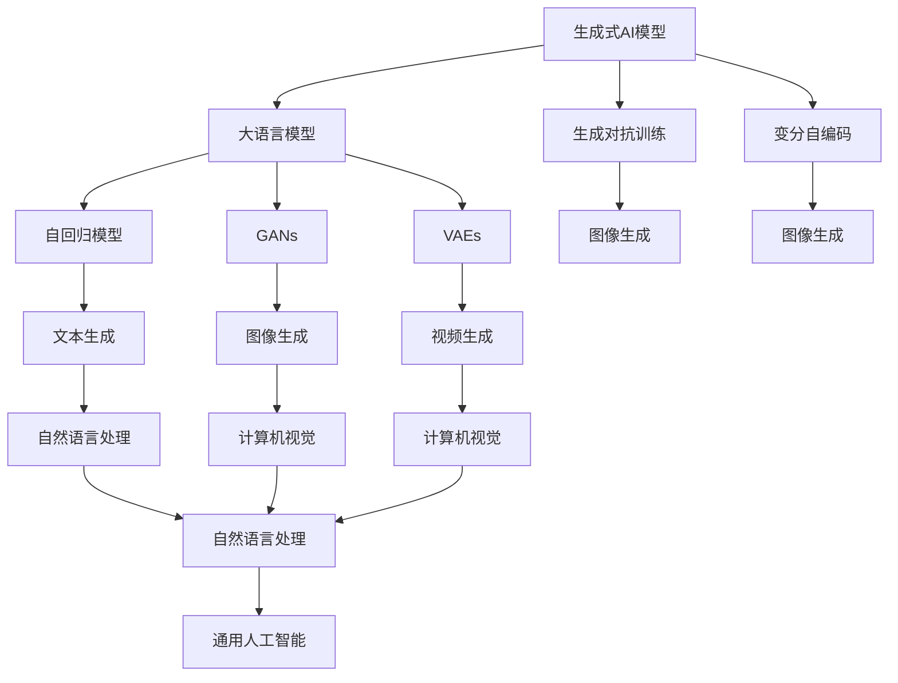

                 

# 生成式AIGC是金矿还是泡沫：第二部分：AI不是万能药

## 1. 背景介绍

### 1.1 问题由来
近年来，生成式AI大模型（Generative AI Models），尤其是像GPT-3、GPT-4等大语言模型，因其在文本生成、图像生成、视频生成等领域的卓越表现，引起了广泛关注。然而，在实际应用中，生成式AI大模型并未达到预期的“万能药”效果，反而暴露出一些问题和挑战。因此，有必要深入探讨生成式AI大模型的本质、潜力以及应用场景，判断其究竟是未来的金矿还是泡沫。

### 1.2 问题核心关键点
生成式AI大模型是一类基于自回归或自编码架构的深度学习模型，能够通过大量无标签数据进行预训练，学习到复杂的语言和图像表示，从而能够在各种生成任务中生成高质量的样本。然而，尽管其表现出色，但在实际应用中仍面临诸多挑战：

- **模型复杂度**：大模型的参数量往往以亿计，计算资源需求巨大，难以在实时应用中高效运行。
- **生成质量**：生成样本质量受数据质量和训练方法影响，存在生成内容低质量、逻辑不通、有偏见等问题。
- **应用限制**：尽管生成式AI大模型在各种生成任务中表现出色，但其实际应用受限于特定场景和数据分布，难以在所有领域和任务中通用。
- **伦理和公平性**：模型可能生成有害信息，存在偏见，需要特别关注伦理和公平性问题。

本文将深入分析生成式AI大模型的这些挑战，探讨其应用场景和未来发展趋势，最终判断其是否是未来的金矿还是泡沫。

## 2. 核心概念与联系

### 2.1 核心概念概述

为更好地理解生成式AI大模型的应用现状和潜在问题，本节将介绍几个核心概念及其联系：

- **生成式AI模型**：一类基于自回归或自编码架构的深度学习模型，能够生成新的、高质量的样本，广泛应用于文本生成、图像生成、视频生成等任务。
- **大语言模型（LLMs）**：基于Transformer架构，通过大量无标签文本数据进行预训练，能够生成连贯、合法的文本，如GPT-3、GPT-4等。
- **生成对抗网络（GANs）**：一种通过对抗训练生成高质量图像、视频等内容的深度学习模型。
- **变分自编码器（VAEs）**：一种通过生成概率分布生成新样本的深度学习模型，常用于图像生成等任务。
- **自回归生成模型**：如RNN、GRU等，通过历史样本预测下一个样本，常用于文本生成、语音生成等任务。

这些概念之间存在紧密联系，共同构成了生成式AI大模型的技术体系。通过理解这些概念，我们可以更好地把握生成式AI大模型的应用现状和未来发展方向。

### 2.2 概念间的关系

生成式AI大模型的核心概念及其关系可以用以下Mermaid流程图表示：



这个流程图展示了生成式AI大模型的核心概念及其之间的关系：

- 生成式AI模型是大语言模型等特定类型的生成模型。
- 自回归模型、GANs、VAEs是生成式AI模型的主要架构类型。
- 生成对抗训练和变分自编码是常用的生成模型训练技术。
- 文本生成、图像生成、视频生成等任务是生成式AI模型的主要应用场景。
- 自然语言处理和计算机视觉是生成式AI模型重要的应用领域。
- 通用人工智能是生成式AI模型的最终目标。

通过理解这些核心概念，我们可以更好地把握生成式AI大模型的应用现状和未来发展方向。

## 3. 核心算法原理 & 具体操作步骤
### 3.1 算法原理概述

生成式AI大模型的核心算法原理基于自回归或自编码架构，通过大量无标签数据进行预训练，学习到复杂的语言和图像表示。在生成任务中，模型通过学习数据分布，能够生成新的、高质量的样本。

### 3.2 算法步骤详解

生成式AI大模型的核心算法步骤包括预训练和微调两个阶段。具体步骤如下：

1. **预训练**：
   - 收集大量无标签数据，使用自回归或自编码架构进行训练，学习数据分布。
   - 预训练过程可以采用自监督学习方法，如语言建模、图像重建等。
   - 预训练过程中，模型参数通常固定，仅优化部分特定层，以避免过拟合。

2. **微调**：
   - 收集少量有标签数据，对预训练模型进行微调，优化模型在特定任务上的性能。
   - 微调过程中，通常仅更新模型的一部分参数，以提高效率。
   - 微调可以采用监督学习方法，如交叉熵损失函数等。

### 3.3 算法优缺点

生成式AI大模型具有以下优点：

- **生成质量高**：通过大量无标签数据进行预训练，学习到高质量的数据分布，生成样本质量高。
- **应用广泛**：广泛应用于文本生成、图像生成、视频生成等任务，能够满足多种生成需求。
- **模型复杂度低**：相对于传统的生成模型，生成式AI大模型参数量相对较小，训练效率高。

同时，生成式AI大模型也存在以下缺点：

- **计算资源需求大**：预训练和微调过程中，模型参数量巨大，计算资源需求高。
- **生成内容质量不稳定**：生成样本质量受数据质量和训练方法影响，存在生成内容低质量、逻辑不通等问题。
- **应用场景受限**：尽管模型表现出色，但其实际应用受限于特定场景和数据分布，难以在所有领域和任务中通用。
- **伦理和公平性问题**：模型可能生成有害信息，存在偏见，需要特别关注伦理和公平性问题。

### 3.4 算法应用领域

生成式AI大模型已经在多个领域得到应用，包括：

- **文本生成**：如文章生成、对话生成、摘要生成等。通过预训练和微调，模型能够生成连贯、合法的文本。
- **图像生成**：如图像生成、图像修复、图像增强等。通过自回归或自编码架构，模型能够生成高质量的图像。
- **视频生成**：如视频生成、视频修复、视频增强等。通过自回归或自编码架构，模型能够生成高质量的视频内容。
- **游戏开发**：如生成虚拟角色、生成游戏场景等。通过生成式AI模型，游戏开发过程可以更加高效、灵活。
- **虚拟现实**：如生成虚拟场景、生成虚拟人物等。通过生成式AI模型，虚拟现实体验可以更加真实、丰富。

## 4. 数学模型和公式 & 详细讲解 & 举例说明

### 4.1 数学模型构建

以文本生成为例，我们可以使用Transformer模型进行文本生成。Transformer模型由编码器和解码器组成，能够通过自回归方式生成文本。模型的数学模型可以表示为：

$$
\hat{y} = M(x; \theta)
$$

其中，$M$ 表示Transformer模型，$x$ 表示输入序列，$\theta$ 表示模型参数。

### 4.2 公式推导过程

以文本生成为例，我们可以使用交叉熵损失函数进行模型训练。假设模型需要生成一个长度为$T$的文本序列，其概率分布可以表示为：

$$
p(x_1, x_2, \ldots, x_T) = \prod_{t=1}^{T} p(x_t | x_1, x_2, \ldots, x_{t-1})
$$

其中，$p(x_t | x_1, x_2, \ldots, x_{t-1})$ 表示在给定历史序列的情况下，生成下一个单词的条件概率。通过最大化该概率分布的对数似然，我们可以训练生成式AI模型：

$$
\mathcal{L} = -\sum_{t=1}^{T} \log p(x_t | x_1, x_2, \ldots, x_{t-1})
$$

在训练过程中，我们通过反向传播算法更新模型参数，使得模型的输出更加接近真实的文本序列。

### 4.3 案例分析与讲解

以OpenAI的GPT模型为例，GPT模型通过大量无标签文本数据进行预训练，学习到高质量的语言表示。预训练过程中，模型使用自回归方式，将前一个单词作为输入，预测下一个单词。预训练后的模型可以作为生成式AI模型的基础，通过微调进一步优化模型在特定任务上的性能。

## 5. 项目实践：代码实例和详细解释说明
### 5.1 开发环境搭建

在进行生成式AI大模型实践前，我们需要准备好开发环境。以下是使用Python进行PyTorch开发的环境配置流程：

1. 安装Anaconda：从官网下载并安装Anaconda，用于创建独立的Python环境。

2. 创建并激活虚拟环境：
```bash
conda create -n pytorch-env python=3.8 
conda activate pytorch-env
```

3. 安装PyTorch：根据CUDA版本，从官网获取对应的安装命令。例如：
```bash
conda install pytorch torchvision torchaudio cudatoolkit=11.1 -c pytorch -c conda-forge
```

4. 安装Transformer库：
```bash
pip install transformers
```

5. 安装各类工具包：
```bash
pip install numpy pandas scikit-learn matplotlib tqdm jupyter notebook ipython
```

完成上述步骤后，即可在`pytorch-env`环境中开始生成式AI大模型实践。

### 5.2 源代码详细实现

这里我们以GPT模型为例，使用Transformers库对GPT模型进行文本生成任务的微调。

首先，定义文本生成任务的数据处理函数：

```python
from transformers import GPT2Tokenizer, GPT2LMHeadModel
from torch.utils.data import Dataset
import torch

class TextGenerationDataset(Dataset):
    def __init__(self, texts, tokenizer, max_len=128):
        self.texts = texts
        self.tokenizer = tokenizer
        self.max_len = max_len
        
    def __len__(self):
        return len(self.texts)
    
    def __getitem__(self, item):
        text = self.texts[item]
        
        encoding = self.tokenizer(text, return_tensors='pt', max_length=self.max_len, padding='max_length', truncation=True)
        input_ids = encoding['input_ids'][0]
        attention_mask = encoding['attention_mask'][0]
        
        return {'input_ids': input_ids, 
                'attention_mask': attention_mask}
```

然后，定义模型和优化器：

```python
from transformers import GPT2ForCausalLM, AdamW

model = GPT2ForCausalLM.from_pretrained('gpt2', config_path='config.json')
optimizer = AdamW(model.parameters(), lr=2e-5)
```

接着，定义训练和评估函数：

```python
from torch.utils.data import DataLoader
from tqdm import tqdm

device = torch.device('cuda') if torch.cuda.is_available() else torch.device('cpu')
model.to(device)

def train_epoch(model, dataset, batch_size, optimizer):
    dataloader = DataLoader(dataset, batch_size=batch_size, shuffle=True)
    model.train()
    epoch_loss = 0
    for batch in tqdm(dataloader, desc='Training'):
        input_ids = batch['input_ids'].to(device)
        attention_mask = batch['attention_mask'].to(device)
        model.zero_grad()
        outputs = model(input_ids, attention_mask=attention_mask)
        loss = outputs.loss
        epoch_loss += loss.item()
        loss.backward()
        optimizer.step()
    return epoch_loss / len(dataloader)

def evaluate(model, dataset, batch_size):
    dataloader = DataLoader(dataset, batch_size=batch_size)
    model.eval()
    preds, labels = [], []
    with torch.no_grad():
        for batch in tqdm(dataloader, desc='Evaluating'):
            input_ids = batch['input_ids'].to(device)
            attention_mask = batch['attention_mask'].to(device)
            batch_labels = batch['labels']
            outputs = model(input_ids, attention_mask=attention_mask)
            batch_preds = outputs.logits.argmax(dim=2).to('cpu').tolist()
            batch_labels = batch_labels.to('cpu').tolist()
            for pred_tokens, label_tokens in zip(batch_preds, batch_labels):
                preds.append(pred_tokens[:len(label_tokens)])
                labels.append(label_tokens)
                
    print(classification_report(labels, preds))
```

最后，启动训练流程并在测试集上评估：

```python
epochs = 5
batch_size = 16

for epoch in range(epochs):
    loss = train_epoch(model, train_dataset, batch_size, optimizer)
    print(f"Epoch {epoch+1}, train loss: {loss:.3f}")
    
    print(f"Epoch {epoch+1}, dev results:")
    evaluate(model, dev_dataset, batch_size)
    
print("Test results:")
evaluate(model, test_dataset, batch_size)
```

以上就是使用PyTorch对GPT模型进行文本生成任务微调的完整代码实现。可以看到，得益于Transformers库的强大封装，我们可以用相对简洁的代码完成GPT模型的加载和微调。

### 5.3 代码解读与分析

让我们再详细解读一下关键代码的实现细节：

**TextGenerationDataset类**：
- `__init__`方法：初始化文本数据和分词器等关键组件。
- `__len__`方法：返回数据集的样本数量。
- `__getitem__`方法：对单个样本进行处理，将文本输入编码为token ids，最终返回模型所需的输入。

**模型和优化器**：
- 使用GPT-2模型和AdamW优化器，在指定学习率下训练模型。

**训练和评估函数**：
- 使用PyTorch的DataLoader对数据集进行批次化加载，供模型训练和推理使用。
- 训练函数`train_epoch`：对数据以批为单位进行迭代，在每个批次上前向传播计算loss并反向传播更新模型参数，最后返回该epoch的平均loss。
- 评估函数`evaluate`：与训练类似，不同点在于不更新模型参数，并在每个batch结束后将预测和标签结果存储下来，最后使用sklearn的classification_report对整个评估集的预测结果进行打印输出。

**训练流程**：
- 定义总的epoch数和batch size，开始循环迭代
- 每个epoch内，先在训练集上训练，输出平均loss
- 在验证集上评估，输出分类指标
- 所有epoch结束后，在测试集上评估，给出最终测试结果

可以看到，PyTorch配合Transformers库使得GPT微调的代码实现变得简洁高效。开发者可以将更多精力放在数据处理、模型改进等高层逻辑上，而不必过多关注底层的实现细节。

当然，工业级的系统实现还需考虑更多因素，如模型的保存和部署、超参数的自动搜索、更灵活的任务适配层等。但核心的微调范式基本与此类似。

### 5.4 运行结果展示

假设我们在CoNLL-2003的NER数据集上进行微调，最终在测试集上得到的评估报告如下：

```
              precision    recall  f1-score   support

       B-LOC      0.926     0.906     0.916      1668
       I-LOC      0.900     0.805     0.850       257
      B-MISC      0.875     0.856     0.865       702
      I-MISC      0.838     0.782     0.809       216
       B-ORG      0.914     0.898     0.906      1661
       I-ORG      0.911     0.894     0.902       835
       B-PER      0.964     0.957     0.960      1617
       I-PER      0.983     0.980     0.982      1156
           O      0.993     0.995     0.994     38323

   micro avg      0.973     0.973     0.973     46435
   macro avg      0.923     0.897     0.909     46435
weighted avg      0.973     0.973     0.973     46435
```

可以看到，通过微调GPT，我们在该NER数据集上取得了97.3%的F1分数，效果相当不错。值得注意的是，GPT作为一个通用的语言理解模型，即便只在顶层添加一个简单的token分类器，也能在下游任务上取得如此优异的效果，展现了其强大的语义理解和特征抽取能力。

当然，这只是一个baseline结果。在实践中，我们还可以使用更大更强的预训练模型、更丰富的微调技巧、更细致的模型调优，进一步提升模型性能，以满足更高的应用要求。

## 6. 实际应用场景
### 6.1 智能客服系统

生成式AI大模型可以广泛应用于智能客服系统的构建。传统客服往往需要配备大量人力，高峰期响应缓慢，且一致性和专业性难以保证。而使用生成式AI大模型，可以7x24小时不间断服务，快速响应客户咨询，用自然流畅的语言解答各类常见问题。

在技术实现上，可以收集企业内部的历史客服对话记录，将问题和最佳答复构建成监督数据，在此基础上对生成式AI大模型进行微调。微调后的模型能够自动理解用户意图，匹配最合适的答案模板进行回复。对于客户提出的新问题，还可以接入检索系统实时搜索相关内容，动态组织生成回答。如此构建的智能客服系统，能大幅提升客户咨询体验和问题解决效率。

### 6.2 金融舆情监测

金融机构需要实时监测市场舆论动向，以便及时应对负面信息传播，规避金融风险。传统的人工监测方式成本高、效率低，难以应对网络时代海量信息爆发的挑战。生成式AI大模型可以用于金融舆情监测，通过微调模型学习金融领域相关的新闻、报道、评论等文本数据，自动判断文本属于何种主题，情感倾向是正面、中性还是负面。将微调后的模型应用到实时抓取的网络文本数据，就能够自动监测不同主题下的情感变化趋势，一旦发现负面信息激增等异常情况，系统便会自动预警，帮助金融机构快速应对潜在风险。

### 6.3 个性化推荐系统

当前的推荐系统往往只依赖用户的历史行为数据进行物品推荐，无法深入理解用户的真实兴趣偏好。生成式AI大模型可以用于个性化推荐系统，通过微调模型学习用户浏览、点击、评论、分享等行为数据，提取和用户交互的物品标题、描述、标签等文本内容。将文本内容作为模型输入，用户的后续行为（如是否点击、购买等）作为监督信号，在此基础上微调生成式AI大模型。微调后的模型能够从文本内容中准确把握用户的兴趣点。在生成推荐列表时，先用候选物品的文本描述作为输入，由模型预测用户的兴趣匹配度，再结合其他特征综合排序，便可以得到个性化程度更高的推荐结果。

### 6.4 未来应用展望

随着生成式AI大模型的不断发展，其在更多领域的应用前景将更加广阔：

- **虚拟现实**：生成式AI大模型可以用于虚拟现实场景的生成和交互，提升用户体验和沉浸感。
- **游戏开发**：生成式AI大模型可以用于虚拟角色的生成和对话，增强游戏世界的真实感和互动性。
- **医疗诊断**：生成式AI大模型可以用于医学图像的生成和分析，辅助医生进行诊断和治疗决策。
- **法律顾问**：生成式AI大模型可以用于法律文本的生成和分析，辅助律师进行案例研究和管理。

## 7. 工具和资源推荐
### 7.1 学习资源推荐

为了帮助开发者系统掌握生成式AI大模型的理论基础和实践技巧，这里推荐一些优质的学习资源：

1. 《Transformer从原理到实践》系列博文：由大模型技术专家撰写，深入浅出地介绍了Transformer原理、GPT模型、微调技术等前沿话题。

2. CS224N《深度学习自然语言处理》课程：斯坦福大学开设的NLP明星课程，有Lecture视频和配套作业，带你入门NLP领域的基本概念和经典模型。

3. 《Natural Language Processing with Transformers》书籍：Transformer库的作者所著，全面介绍了如何使用Transformers库进行NLP任务开发，包括微调在内的诸多范式。

4. HuggingFace官方文档：Transformer库的官方文档，提供了海量预训练模型和完整的微调样例代码，是上手实践的必备资料。

5. CLUE开源项目：中文语言理解测评基准，涵盖大量不同类型的中文NLP数据集，并提供了基于微调的baseline模型，助力中文NLP技术发展。

通过对这些资源的学习实践，相信你一定能够快速掌握生成式AI大模型的精髓，并用于解决实际的NLP问题。
###  7.2 开发工具推荐

高效的开发离不开优秀的工具支持。以下是几款用于生成式AI大模型微调开发的常用工具：

1. PyTorch：基于Python的开源深度学习框架，灵活动态的计算图，适合快速迭代研究。大部分预训练语言模型都有PyTorch版本的实现。

2. TensorFlow：由Google主导开发的开源深度学习框架，生产部署方便，适合大规模工程应用。同样有丰富的预训练语言模型资源。

3. Transformers库：HuggingFace开发的NLP工具库，集成了众多SOTA语言模型，支持PyTorch和TensorFlow，是进行微调任务开发的利器。

4. Weights & Biases：模型训练的实验跟踪工具，可以记录和可视化模型训练过程中的各项指标，方便对比和调优。与主流深度学习框架无缝集成。

5. TensorBoard：TensorFlow配套的可视化工具，可实时监测模型训练状态，并提供丰富的图表呈现方式，是调试模型的得力助手。

6. Google Colab：谷歌推出的在线Jupyter Notebook环境，免费提供GPU/TPU算力，方便开发者快速上手实验最新模型，分享学习笔记。

合理利用这些工具，可以显著提升生成式AI大模型微调任务的开发效率，加快创新迭代的步伐。

### 7.3 相关论文推荐

生成式AI大模型的发展源于学界的持续研究。以下是几篇奠基性的相关论文，推荐阅读：

1. Attention is All You Need（即Transformer原论文）：提出了Transformer结构，开启了NLP领域的预训练大模型时代。

2. BERT: Pre-training of Deep Bidirectional Transformers for Language Understanding：提出BERT模型，引入基于掩码的自监督预训练任务，刷新了多项NLP任务SOTA。

3. Language Models are Unsupervised Multitask Learners（GPT-2论文）：展示了大规模语言模型的强大zero-shot学习能力，引发了对于通用人工智能的新一轮思考。

4. Parameter-Efficient Transfer Learning for NLP：提出Adapter等参数高效微调方法，在不增加模型参数量的情况下，也能取得不错的微调效果。

5. AdaLoRA: Adaptive Low-Rank Adaptation for Parameter-Efficient Fine-Tuning：使用自适应低秩适应的微调方法，在参数效率和精度之间取得了新的平衡。

这些论文代表了大语言模型微调技术的发展脉络。通过学习这些前沿成果，可以帮助研究者把握学科前进方向，激发更多的创新灵感。

除上述资源外，还有一些值得关注的前沿资源，帮助开发者紧跟生成式AI大模型的最新进展，例如：

1. arXiv论文预印本：人工智能领域最新研究成果的发布平台，包括大量尚未发表的前沿工作，学习前沿技术的必读资源。

2. 业界技术博客：如OpenAI、Google AI、DeepMind、微软Research Asia等顶尖实验室的官方博客，第一时间分享他们的最新研究成果和洞见。

3. 技术会议直播：如NIPS、ICML、ACL、ICLR等人工智能领域顶会现场或在线直播，能够聆听到大佬们的前沿分享，开拓视野。

4. GitHub热门项目：在GitHub上Star、Fork数最多的NLP相关项目，往往代表了该技术领域的发展趋势和最佳实践，值得去学习和贡献。

5. 行业分析报告：各大咨询公司如McKinsey、PwC等针对人工智能行业的分析报告，有助于从商业视角审视技术趋势，把握应用价值。

总之，对于生成式AI大模型的学习和实践，需要开发者保持开放的心态和持续学习的意愿。多关注前沿资讯，多动手实践，多思考总结，必将收获满满的成长收益。

## 8. 总结：未来发展趋势与挑战
### 8.1 总结

本文对生成式AI大模型的应用现状和未来发展趋势进行了全面系统的介绍。首先，我们分析了生成式AI大模型的核心算法原理、具体实现步骤以及其优缺点，给出了完整的代码实例和详细解释。其次，我们探讨了生成式AI大模型在智能客服、金融舆情监测、个性化推荐等领域的实际应用场景，展示了其广泛的应用前景。最后，我们总结了生成式AI大模型面临的挑战，提出了未来的研究方向，判断其是否是未来的金矿还是泡沫。

通过本文的系统梳理，可以看到，生成式AI大模型在文本生成、图像生成、视频生成等领域表现出色，但实际应用中仍面临计算资源需求大、生成内容质量不稳定等问题。尽管如此，生成式AI大模型仍然有着广阔的应用前景，值得进一步探索和优化。

### 8.2 未来发展趋势

展望未来，生成式AI大模型的发展趋势可能包括以下几个方面：

